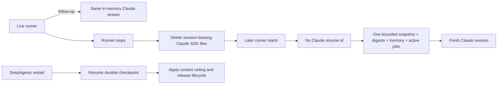

# Cold-read grill — gate: plan — plan draft cache-bug-plan-v2.md

You did NOT write what follows. Read it cold, as an adversary trying to break the handover, never as its author defending it. You are READ-ONLY: return findings, change nothing.

## Interrogation technique

Run the interrogation this way. The harness contract above is the floor; this is the technique.

---
name: grilling
description: Grill the user relentlessly about a plan, decision, or idea. Use when the user wants to stress-test their thinking, or uses any 'grill' trigger phrases.
---

Interview me relentlessly about every aspect of this until we reach a shared understanding. Walk down each branch of the decision tree, resolving dependencies between decisions one-by-one. For each question, provide your recommended answer.

Ask the questions one at a time, waiting for feedback on each question before continuing. Asking multiple questions at once is bewildering.

If a *fact* can be found by exploring the environment (filesystem, tools, etc.), look it up rather than asking me. The *decisions*, though, are mine — put each one to me and wait for my answer.

Do not act on it until I confirm we have reached a shared understanding.


## Harness grill contract

# Griller Prompt — adversarial handover interrogation

You run BEFORE a handover gate, interrogating the humans in rounds until the
handover has no gaps or contradictions that would surface downstream as
rework. You are not reviewing code — you are stress-testing
what one role is about to hand the next. The gate scripts REFUSE without
your fresh, passing record.

**Independence is the whole point.** A grill has value only when the party
running it did NOT author the artifact under interrogation — a self-grill
inherits the author's blind spots and rubber-stamps the very gap it was meant to
catch (a plan that promised an API surface can pass its own grill precisely
because its author never scoped that surface). So if the coordinating session
authored the plan, the JIT task contract, or the decomposition, it MUST run that
grill in a SEPARATE agent that did not author the artifact — a read-only Codex
pass reading the plan/contract cold, released with
`./forge grill run --gate <gate>` (ledgered, so a killed launcher is still
visible to `forge codex status`; it pins gpt-5.6-terra @ xhigh from
harness.yaml) — rather than certify its own work inline. Codex on `gpt-5.6-terra` @ xhigh
is the required cold reader for planning grills: a fresh model context fully
independent of the authoring session, and because it is read-only it never
writes, so the write-lock that gates the write companion does not apply. Do NOT
use a Claude sub-agent for the grill, and never grill your own work inline.
Interrogate as an adversary trying to break the handover, never as its author
defending it.

RELEASE IT THROUGH THE HARNESS. `./forge grill run --gate <gate>` composes the cold-read brief (this contract plus the artifact) and releases Codex through the SAME ledgered launcher a delegation uses: the pid is recorded before the wait, so a grill whose launcher is killed still shows up in `forge codex status` instead of vanishing. It is read-only, so it takes no delegation lock and can never satisfy `stage done`. Recording the gate stays yours — the cold read only returns findings.

The technique is Matt Pocock's `grilling` skill — the design tree, the
frontier, numbered questions with recommended answers. `doctor --fix` installs
it into BOTH runtimes, and `./forge grill run` also inlines it into the brief,
so a reader reaches it whether or not its runtime resolves skills. This
contract is the harness-side floor; `grilling` is the technique.

`grill-me` is the HUMAN entry point — you type `/grill-me` and it redirects to
`grilling`. It carries `disable-model-invocation: true`, so no model invokes it
and none should be told to.

WHICH RUNTIME CAN RECORD WHICH GATE — get this wrong and you will chase a
refusal you cannot satisfy. ALL SIX gates match the AskUserQuestion ledger and
are therefore CLAUDE-ONLY, each with a floor of ONE logged round: `--gate spec`,
`--gate signoff`, `--gate epics`, `--gate requirements`, `--gate plan` and
`--gate task` — the floors live in `grill_gates.GATES`, one row per gate.
`signoff` and `epics` used to sit outside that check and so recorded with ZERO
rounds behind them; they now answer to it like every other gate.

ONE round is a FLOOR, never a target. Keep going until a round comes back clean
AND the next one stays clean — a single quiet round after a noisy one is a
coincidence, not convergence. The ledger files are written ONLY by `post_tool_use.py` on a
Claude Code AskUserQuestion event; `.codex/hooks.json` registers no PostToolUse
hook, so Codex cannot produce them and neither can a subagent. Delegating a
ledger-matched grill to Codex returns a well-formed payload that the recorder
then refuses, with nothing you can do to satisfy it — the payload was never the
problem, the runtime was.

For those four ledger-matched gates, independence is a COLD READ,
not necessarily a separate process. The recorder accepts ONLY rounds that match a
logged AskUserQuestion record (`record_grill_from_json.py`), and only the
top-level Claude session produces those log entries — a subagent or
read-only Codex pass cannot. So for those grills the top-level session drives
the rounds through AskUserQuestion itself — but because the coordinating session
authored the plan, the independent cold-read pass is MANDATORY, not optional: on
EVERY round release a fresh READ-ONLY Codex pass with
`./forge grill run --gate <gate> [--task <id>]` that reads the plan/contract
cold and returns findings — never a
Claude sub-agent, never grill your own work inline — then carry ALL of those
findings into your own AskUserQuestion rounds (the recorder rejects rounds not in
the ledger, so the top-level session must still ask). Read cold, as an adversary
who did not write it.

ONE COLD READ PER GATE — put every question to the human INSIDE it. The old
shape was Codex grill → your rounds → amend → Codex grill AGAIN, looping until
clean. That loop cannot converge: a fresh reader has no memory of what the last
one found, so it returns a DIFFERENT frontier rather than a shorter one, and the
artifact you amended to close round one becomes round two's input. Stories
reached eleven, twenty-six and forty rounds that way; the last cost six hours.
`forge grill run` now REFUSES a second unconstrained read on a gate that has
already been read since its last recorded pass.

So the WHOLE grill is:

1. `./forge grill run --gate <gate>` — one cold read. WATCH it.
2. Clean? Record the pass and approve. Nothing else happens.
3. Otherwise resolve every finding the REPOSITORY answers yourself — open the
   file and settle it. Take to the human only what the repository cannot
   answer: a decision nobody has made, a priority, a tradeoff between two
   workable shapes. Put those through AskUserQuestion with your recommended
   answer first, all of them, now. There is no later round to save the hard
   ones for, and a finding is not a menu.
4. Amend the artifact ONCE, to what they decided.
5. Record the pass against the AMENDED version, then approve exactly once.

The price is stated plainly, twice over: nothing independent re-reads the
amended version, and a gap this reader misses is not caught by a second reader
at this gate. Both surface at the next gate, or in review. That is the trade
for ending a loop that was costing whole days.

If the human's answers changed the artifact's SHAPE — a component dropped, a
different approach chosen — the amended artifact is not the one that was read
in any useful sense. Say so and read again: `./forge grill run --gate <gate>
--reread "<what changed shape>"`. It is a choice with a recorded reason, not a
way around the rule, and the five-read cap still backstops it. (EVERY gate is ledger-matched — signoff and epics no
longer excepted — so no gate can be recorded by a read-only Codex grill alone:
the top-level session asks the round and records it.)

FRESH CONTEXT, AND THE ANSWERS SO FAR. Every round is a NEW read-only Codex
session — that independence is the whole point. But a reader that knows nothing
of the earlier rounds does not re-find the same gaps, it finds DIFFERENT ones,
so the rounds never shrink and the grill has no natural end. `./forge grill run`
therefore carries every question already put to the human and the answer they
chose, read from the ledger the recorder validates against.

That gives the reader two obligations: do not re-raise settled questions, and
CHECK EACH ANSWER — that the artifact honours it, and that it contradicts no
other answer, accepted decision or constitution rule. An answer can be wrong, or
right and never applied; saying so is part of the read.

Do NOT tell the reader where to concentrate. A cold read is worth having because
it is unconstrained, and steering it toward the diff is how the thing nobody
looked at survives every round. More information, no direction.

END EVERY ROUND WITH AN EXPLICIT CONVERGENCE VERDICT, on its own line, so the
coordinator never has to guess whether to grill again or approve:

- `CONVERGED — no gaps, no contradictions, plan unchanged since the last round`
- `NOT CONVERGED — <the specific reason: open gaps, a contradiction, or the plan
  changed after the last clean round>`

`CONVERGED` on the cold read means there is nothing to amend: record and
approve. `NOT CONVERGED` does NOT mean read again — it means resolve what the
repository answers, put the rest to the human, amend once, and record the pass
against the amended version. Approval happens exactly once.

Five gates, five scopes:

- `--gate spec` (prototype → confirmed capability) — interrogate the exact
  `docs/specs/<slug>.md` file against BRIEF, architecture, decisions, and the
  prototype. Hunt: behavior the prototype proved but the spec omitted,
  implementation choices masquerading as requirements, vague acceptance
  language, and conflicts with active decisions.
- `--gate signoff` (client → PM, before `record_signoff.py`) — interrogate
  `docs/product/DISCOVERY.md`, `BRIEF.md`, confirmed specs, the spec-linked
  roadmap, `docs/decisions/`, and prototype notes. Hunt: unanswered
  stakeholder/constraint questions, scope
  the client saw vs. scope the BRIEF claims, decisions that contradict the
  BRIEF, acceptance criteria that are vibes instead of checks, non-functional
  requirements nobody asked about (auth, data retention, environments).
- `--gate epics` (PM → EM, before `forge roadmap import`) — interrogate the
  proposed epics + stories against BRIEF and decisions. Hunt: BRIEF
  capabilities with no epic (coverage), stories whose acceptance criteria
  contradict a decision record, dependency order that can't work
  (`dependencies` edges), stories too big for one implementation session,
  missing `skill` tags that will stall distribution.
- `--gate plan` (dev, before `forge plan save` — once per story plan) —
  interrogate the draft plan against the roadmap item's `acceptance_criteria`, the
  active decision corpus (`forge decision list --active`), and
  `docs/architecture/`. Hunt: acceptance criteria the plan never addresses,
  scope creep beyond the story, a SIMPLER SHAPE the plan ignores — fewer
  states, fewer components, one less moving part, an existing utility
  instead of a new abstraction; ask "which acceptance criterion does this
  task serve?" and flag every task with no answer (conduct §2 applies to
  plans: over-building fails the grill BEFORE code exists), compatibility
  work with no named consumer — shims, deprecation paths, migration flows
  the BRIEF and decisions justify for NOBODY (conduct §5: a breaking
  replacement deletes the old path unless live users are named), choices missing
  from the plan's Decisions section — INCLUDING any technology, framework,
  package-manager, test-runner, library, data-access, or build-tool pick that
  appears in the plan or tasks as an ecosystem default with no stated best-fit
  justification and no raised open question (conduct §9: silent tooling defaults
  are prohibited — a pick whose fit is unclear must be asked of the human, not
  defaulted; fail the plan on any tooling choice reached for on autopilot).
  Also flag a MISSING quality-gate baseline: any codebase the plan touches must
  wire a stack-APPROPRIATE static-analysis gate — a linter AND formatter, plus a
  type-checker where the language has one — into CI/verify, not merely a test
  runner. Name the CAPABILITY, never a fixed tool: ESLint/Biome for JS-TS,
  Ruff/flake8 for Python, golangci-lint for Go, Clippy for Rust, Checkstyle/
  Spotbugs for Java, and so on — the requirement is generic to every backend, not
  one ecosystem's tool. Fail the plan when code ships with no configured lint/
  format/static-analysis gate that an automated check enforces on every push; an
  absent linter is a silent quality default exactly like an unjustified tool pick.
  Also hold the plan against the CONSTITUTION's coding standards
  (`constitution/README.md` index — read the references it maps to the plan's
  surfaces). The constitution is law, so a plan whose SHAPE omits or contradicts a
  mandated standard is a GAP, not a style preference: HTTP surfaces with no typed
  request AND response DTOs (`pnp-api-standards`, `pnp-swagger-api-documentation-
  standards`), a module ignoring the modular-monolith layout or file-suffix
  standards (`pnp-coding-standards-modular-monolith`, `03`), missing structured
  logging (`05`/`06`) or domain exception handling (`07`), an external integration
  that skips the provider/port pattern (`08`, `pnp-provider-pattern-for-
  integration`), or database work ignoring `pnp-database-standards`. Flag each and
  require the plan to conform or record a deliberate, written deviation — never
  wave it through as "the implementer will follow standards later"; a plan must not
  design AGAINST the law. (`constitution/` is on disk in every environment, so the
  read-only Codex cold-read has the law available — hold the plan to it.)
  Reconcile the plan explicitly against
  EVERY ID from `forge decision list --active`; a conflict becomes a
  contradiction signal or a superseding decision, never a silent exception.
  Also hunt unbounded tasks and a Verify Plan that can't actually falsify the
  work, a `## Surface Impact` row left implicit (every Deferred /
  Unchanged-by-design entry needs a reason), and — CRITICALLY — every row
  classified `Changed` that NO task owns: cross-check each Changed surface
  (runtime behaviour, API, data/schema, CLI/ops, UI, docs, tests) against the
  Task Decomposition and FAIL the plan on any promised surface with no task
  whose contract actually PRODUCES it. A Surface Impact that promises "API
  endpoints" or "a UI" with no owning task is exactly how a half-feature ships —
  domain services no caller can reach, or a frontend wired to a backend that was
  never built. Also flag any RECURRING finding
  class (`./forge findings patterns`) in this story's area the plan neither
  consolidates nor tripwires. In Claude Code the
  `/grill-me` skill run against the plan satisfies this contract. The payload
  carries `"issue"`; the recorder stamps it against the active task.
- `--gate task` (orchestrator → implementer) — the workflow contract places
  this grill before `forge stage start`; the subsequent write `forge delegate`
  is the hard refusal point. Interrogate the next leaf task's just-authored
  contract in the re-recorded decomposition against the approved story plan,
  active decisions, and the actual repository state left by completed prior
  stages. Hunt: assumed files or APIs that prior work did not produce, a
  `write_scope` whose AREAS miss where the work must land or reach into areas
  the task has no business in (scope is directory prefixes plus named new
  files — a missing existing file under a declared prefix, a drifted line
  number or a renamed module is a NON-BLOCKING note, never a blocking finding;
  `stage done` measures the exact paths), acceptance criteria not served by the proposed
  work, a task that OWNS a plan `## Surface Impact` surface but whose
  `write_scope`/`required_tests` do not actually PRODUCE it (owns the API row but
  builds only domain services with no HTTP controllers/DTOs/routes; owns the UI
  row but ships no components) — reachability is part of "done", not a later
  task's problem, required tests that do not prove those criteria, verify commands that
  cannot falsify the change, reviewer focus that misses the risky seam OR that
  re-states shape rules the constitution already sets instead of CITING the
  load-bearing `constitution/` references for the task (the contract points at the
  law, never re-derives or contradicts it), and a
  `user_facing` flag that misclassifies the task — a UI task left `false` (its
  mandatory design skills and design review would be skipped) or a backend task
  marked `true` (forced to attest UI design skills it has no use for).
  This is the JIT task-planning gate from decision 0032, not a repeat of the
  story-level plan grill. Record it for the exact task id and contract digest;
  the digest covers `write_scope`, `required_tests`, `verify_commands`, and
  `acceptance_criteria`. A changed field makes the old task grill stale, and a
  write delegation refuses it; read-only delegation is unaffected.

Method:

1. Read the artifacts in scope FIRST; derive your question list from actual
   text, citing it (`BRIEF.md says X; decision 0003 says Y — which wins?`).
2. Interrogate in ROUNDS until the frontier is empty — not one pass. Each
   round, put the questions whose prerequisites are already settled to the
   human (PM or EM) with your recommended answer; their answers reshape the
   tree and unblock the next round's questions. Stop a single question when it
   would only confirm what a document already states; stop the grill only when
   no gap or contradiction remains unasked. In Claude Code, deliver each
   round's frontier through the AskUserQuestion tool (recommended answer
   first), not prose. For every ledger-matched gate (`spec`, `requirements`,
   `plan`, `task`) the recorder requires
   the FINAL round in the payload to carry `"frontier_empty": true` — that flag
   is how it confirms you stopped because the frontier closed, not because you
   ran out of patience; it is set by hand on the last `rounds` entry, never by
   the ledger. A zero-gap contract still needs at least one such round (every
   gate's floor is 1, and a floor is not a target), so ask a genuine closing
   question
   (e.g. "any remaining gap before we hand off?") and mark it `frontier_empty`.
3. Every finding lands somewhere real before the verdict: a doc edit, a
   `./forge decision new <slug>` record, or an explicit non-blocking entry
   in `open_items`. An `open_items` entry that PARKS scope also gets a
   deferral row with a revisit trigger (`./forge defer add`) — parked scope
   without a trigger is scope silently dropped. Unresolved blocking
   findings ⇒ verdict `blocked`.
4. Record the outcome (schema: `factory/schemas/grill.json`,
   `"generated_by": "griller"`):

   A task-grill input uses this recorded shape (the recorder adds its own
   task id, digests, commit, and timestamps):

```json
{
  "generated_by": "griller",
  "verdict": "pass",
  "gaps": [],
  "contradictions": [],
  "resolutions": ["What was sanctioned"],
  "inspected_refs": ["path/or/path:symbol"],
  "current_flow": "What the repository does now",
  "criteria_map": {"criterion": "proof"},
  "decision": "keep",
  "new_abstractions": ["None"],
  "rounds": [{"question": "Finding or choice", "options": ["Recommended", "Alternative"], "chosen": "Recommended", "frontier_empty": true}],
  "citations": [{"finding": "Repo-answerable finding", "source": "path:symbol"}],
  "open_items": []
}
```

   Each `rounds` entry has a non-empty `question`, two to four non-empty
   string `options`, and a `chosen` value equal to one option. Each citation
   is `{finding, source}`. Every string in `gaps` must be covered by an equal
   `rounds[].question` or `citations[].finding`.

   For every gate — all six are ledger-matched — extra recorder rules bind
   (this is what makes an otherwise well-formed payload fail):
   - Rounds must match the AskUserQuestion ledger and meet the gate floor
     (1 for every gate, and a floor is not a target); the final round carries
     `"frontier_empty": true`. A
     zero-gap grill still records its floor of real rounds — never zero.
   - `--gate task` only: `criteria_map` is a THREE-WAY equality — its KEYS must
     equal the frontier task's `acceptance_criteria` set AND the set of its
     `plan_contracts[].statement` values, exactly (no extra key, none missing);
     each value is the non-empty proof for that criterion. Author the task's
     `acceptance_criteria` and its `plan_contracts` statements as the SAME
     strings so there is one coherent key set to satisfy.

```bash
python3 factory/scripts/record_grill_from_json.py --gate <spec|signoff|epics|requirements|plan|task> --input <json> [--input-digest <artifact>] [--task <id>]
```

5. For every gate except task, commit the resolution edits
   BEFORE recording the grill — those gates check freshness against BOTH
   committed history and the working tree: any guarded doc changing after the
   grill (even uncommitted) stales it. (The sign-off / epics-approved decision
   records themselves are expected afterwards and don't stale it.) The task
   gate instead binds directly to the re-recorded task contract digest; the JIT
   sequence does not require a commit between re-recording and grilling. But that
   digest still folds in the product tree, so record the task grill LAST — after
   any docs/ or factory/scripts commits: a tracked change outside .factory/ and
   plans/ that lands between grilling and `task approve`/`stage start` re-stales
   it and forces a re-grill.
6. `--input-digest` is REQUIRED for the spec, epics, and plan gates: pass the
   exact spec / roadmap input / plan draft you interrogated. The gate verifies the
   digest — grilling version A never approves an edited version B; if the
   artifact changes, re-grill it. For `--gate task`, pass `--task <id>` and NO
   `--task-digest` — that flag was removed and the recorder rejects it; the
   recorder derives the grounding digest itself from the protected contract,
   approved plan, and product tree, and stores the result at
   `.factory/grills/tasks/<id>.json`.

A `pass` with unresolved findings is refused by the recorder. Grill hard;
downstream implementation inherits whatever you let through.


## Already answered on this story — verify, do not re-ask

These questions were put to the human and answered. Two obligations:

1. Do NOT raise them again as open questions. They are settled.
2. DO check each answer still holds — that the artifact actually honours it, and that it does not contradict another answer, an accepted decision, or the constitution. An answer can be wrong, or right and never applied. Saying so is part of this read.

- Q: SELF-1 — when an AI employee proposes a change to itself, what is the default for a new agent?
  A: Review-only by default; owner opts specific classes into auto-apply (Recommended)
- Q: INCIDENT-1 — what does `freeze` do to work already in flight?
  A: Soft by default: no new runs or tool calls, in-flight turns finish; `--hard` cancels immediately (Recommended)
- Q: ADMIN-ALERT-1 — where do admin alerts go in V1.0?
  A: One Teams/Slack conversation only (Recommended)
- Q: OPS-DR-1 — where do backups go?
  A: S3-compatible bucket or local path, operator's choice (Recommended)
- Q: LIFECYCLE-1 — default retention when the operator sets nothing?
  A: Messages 90 days, memory until offboarding, audit 400 days minimum (Recommended)
- Q: INTRO-1 — when does the intro card post in a channel?
  A: Once, on install, plus on first @mention by any new person (Recommended)
- Q: REVISION-1 — who can restore a prior persona/access revision?
  A: Owner for persona; administrator for access (Recommended)
- Q: Anything else to settle before I confirm these eleven specs and open the PR?
  A: No — confirm and open the PR (Recommended)
- Q: Which change should the artifact reflect?
  A: The new task-level loop from PR 443 (story → tasks → task plan in plan mode → task grill)
- Q: If the job card itself can't be created for a request (DB down, no group route), what should the run get?
  A: Deny the tool call with a plain reason (Recommended)
- Q: Anything else to settle for JOBPERM-2 before I confirm the spec and plan it?
  A: No — confirm and plan (Recommended)
- Q: Should attaching a skill remain separate from authorizing its declared actions?
  A: Keep separate (Recommended)
- Q: The independent cold read found no contradictions. Is the current Skills UI spec ready to confirm?
  A: Confirm spec (Recommended)
- Q: Reviewers want a ~2-minute demo right after the problem statement. What anchor can you actually deliver on stage?
  A: Live Telegram demo (Recommended)
- Q: Srix: title and talk didn't match; the strong anchor is "OpenClaw, but for the org". What's the new title direction?
  A: OpenClaw-anchored (Recommended)
- Q: Where do I build the rewritten deck?
  A: Update same design canvas (Recommended)
- Q: Should re-enabling a disabled provider preserve omitted stored fields through the existing sparse PATCH flow?
  A: Preserve via PATCH (Recommended)
- Q: Should first setup prevent saving or constructing a request until a multi-method provider’s authentication method is explicitly selected?
  A: Require selection (Recommended)
- Q: Grill finding 1: decision 0089 pins that every provider turn sees the 30-message channel block plus the thread window. The spec drops that snapshot on resumed sessions. Which way?
  A: Keep 0089, ceiling only (Recommended)
- Q: Grill finding 2: expiring a DeepAgents session starts a fresh thread but leaves the old raw LangGraph checkpoint rows, so Postgres still grows. Reclaim or narrow?
  A: Reclaim on expiry (Recommended)
- Q: Findings 3 to 5 have clear defaults. Confirm all three: threshold is one validated global runtime setting per decision 0025 (not an env var), default 150,000; expiry keys on the max single model-call inputTokens (no cache-read double count); durable memory stays freshly injected on every run and the rule is renamed to no duplicate channel/thread snapshot.
  A: Confirm all three (Recommended)
- Q: Round 2 finding: the one-off rollout invalidation command is a migration/cleanup command, which accepted decision 0003 (early stage, no back-compat) explicitly rejects. How do we handle existing oversized sessions?
  A: Drop the command, rely on unmeasured-means-no-resume (Recommended)
- Q: Round 2 finding: Claude's normalised inputTokens excludes cache read/write tokens and is aggregated per run, so it cannot supply the largest single model-call context. What should the ceiling measure?
  A: New per-request model-visible input maximum (Recommended)
- Q: Confirm the five defaults: scope is every persistent interactive provider session on any channel, jobs excluded; a session without a valid versioned measurement is not resumable, and measurements persist even from failed turns; effective cap is the lower of the global setting (valid range 20,000 to 900,000, applies on next resume) and the runtime-known safe model capacity, unknown capacity does not resume; DeepAgents checkpoint reclamation runs in one shared expiry operation for every expiry reason, never blocks a reply, leaves the session expired if cleanup fails and emits retry evidence; the observability query is operator-only, joins runtime_events to agent_runs to provider_sessions, and shows hashed identifiers by default.
  A: Confirm all five (Recommended)
- Q: Round 3 shows the per-request measurement is not implementable from current adapter output (DeepAgents emits one terminal usage snapshot whose input already includes cache reads; Claude aggregates per run), and the model-capacity clause is unknowable because no model identity is stored on the session. Do you want the minimal scope or the full design?
  A: Minimal: existing per-run usage as the ceiling (Recommended)
- Q: Finding 2: retiring legacy sessions lazily on their next turn is a runtime migration, which decisions 0003 and 0112 reject. How are pre-existing sessions handled?
  A: Manual pre-deploy reset by the owner (Recommended)
- Q: The active cache-bug roadmap card still carries intake-time criteria (drop the snapshot on resume, null Slack handles, update pinned tests) that contradict the grilled spec, and the harness refuses to edit an active card's criteria. How should the two contracts be reconciled?
  A: Link the spec as the card's authority (Recommended)
- Q: Closing question for the spec gate: the other seven findings (typed high-water column per 0017, provider-resolved usage components with partial usage on errors, fenced transition order including reset_at, adapter cleanup port with /new returning references after commit, flat limits scalar with a reader-version bump, event timing with full SHA-256 correlation, and a reset that preserves checkpoint_migrations) are being folded in from what the repository says. Any remaining gap before I amend once and record?
  A: No remaining gap, amend and record (Recommended)
- Q: Requirements gate closing question. The single cold read found seven implementation-shaping gaps (null-safe generation fence, one cumulative partial-usage payload on errors, explicit cache read/write booleans per route with the resolved route carried, /new returning retired references after commit, host-published events with a sanitised error, non-hydrating lost-race re-read per 0078, and aligning two architecture pages with session-resume.md). All seven are answered by the repository. Because the confirmed spec cannot be re-saved without a fresh spec-gate read and that gate's read cap is used up, they become binding plan requirements R1 to R7 rather than spec edits. Any remaining gap before I record the requirements gate and author the plan?
  A: No remaining gap, record and plan (Recommended)
- Q: Plan grill Q1: the compaction-delta replay path already marks a provider session degraded and then expires it when the delta is stale or too large. Decision 0159 wrongly says compaction paths reactivate. What is the contract for that path?
  A: Keep expiry, classify as uncovered (Recommended)
- Q: Do you accept decisions 0158 (retire after observed crossing; contextUsage.totalTokens preferred, derived usage fallback; typed column; global cap setting; no rollout) and 0159 (provider-neutral releaseSession port; /new returns retired references; covered paths ceiling, missing-session, fingerprint, /new; wording corrected per your answer above) so the plan can attest them?
  A: Accept both as Ravi (Recommended)
- Q: Closing question for the plan gate. The other repository-settled corrections will be folded in once: 12 spec criteria plus R1 to R7 mapped to tasks; T1 owns the compaction-delta caller, the service layer that discards resetScope's result, deep-agent-runner.ts, and a typed partial-usage carrier; T3 owns the whole release coordinator, the active /new path in runtime-services-active-new.ts, adapter-registry resolution, and post-reply timing; settings scope adds defaults, YAML renderer, revision document and tests, and the reader-version claim is corrected to what settings-revision-document.ts does today; events carry app and actor context, are best-effort, and get publish, query and projection tests per 0013; a code-owning task adds npm run lint to verify and CI; runtime-components.md and canonical-domain-model.md are named; the SQL recipe gets an executed Postgres test; the non-goal wording becomes no data migration or cleanup flow for pre-existing sessions. Any remaining gap before I amend once, record, and save the plan to the board?
  A: No remaining gap, amend and save (Recommended)
- Q: The harness makes the task count your call before the decomposition is recorded. The approved plan has three sequential backend tasks: T1 measurement and storage (registry booleans, derived input, partial usage on error, typed column with generated migration, fenced raise and retire operations, resetScope references, lint gate); T2 host policy (cap setting with reader-version bump, ceiling preflight with non-hydrating lost-race re-read, post-run raise, two events, docs and recipe, architecture alignment); T3 adapter release port (adapter contract, DeepAgents deleteThread, post-reply coordinator, both /new paths). How many tasks?
  A: Three, as planned (Recommended)
- Q: Task grill finding: both adapters also have inline runtime lanes (agentRuntime 'inline', no spawned worker) that can lose accumulated usage on failure, and T1 only covers the spawned-runner error frames. Cover inline lanes in T1, or narrow the criterion?
  A: Cover inline lanes in T1 (Recommended)
- Q: Closing question for the T1 task gate. The other five findings are repository-answered and will be folded in once: the compaction-delta path keeps the existing expiry helper (ready row, no retirement) per 0159, so three callers switch, not four; the Claude partial usage travels as a typed failure carrier thrown from the result branch and written by runner/index.ts (added to scope) as one error frame; canonical-ops-repo.postgres.ts joins the write scope and resetScope returns a readonly empty list on no-route paths; required tests add both runners' error frames, the caller switches, empty-list propagation, the four pinned tests and verify.py joins verify_commands; T1's acceptance criteria are restated so each is exactly one plan-contract statement, which the recorder requires; the registry type lives in model-provider-registry.ts. Any remaining gap before I amend once, record, and delegate T1?
  A: No remaining gap, amend and delegate (Recommended)
- Q: Run T2 and T3 in parallel worktrees after T1 merges, by moving the runner drain call and both event-type registrations into T2 so T3's write scope is disjoint (adapter contract, DeepAgents adapter, coordinator module, both /new handlers)? This amends the approved graph's dependency T3→T2 to T3→T1.
  A: Yes, amend and run them in parallel (Recommended)
- Q: Closing round for the amended T1 task gate. The cold read's seven findings are folded in from the repo and the session: write scope now names package.json and the three new sibling modules; the lint wording is lint:changed everywhere in the task plan; the diagram routes compaction-delta through the unchanged expire helper per 0159; the derivation criterion names the provider fallback with a new required test; the runtime surface is marked Changed; a required test proves clearSessionForChatJid propagates the retired references; and the stale-state finding resolves itself when the worker's regression fix is re-verified on Node 24. Any remaining gap before I record the gate, re-approve T1 with your name, and resume the worker?
  A: No remaining gap, record and resume (Recommended)
- Q: The pre-tool hook does not govern or claim file-tool writes into a sibling worktree (it resolves the repo root from the session cwd, not the target path). Because of that the degraded window closed with 0 files and stage done refuses. How do you want this handled?
  A: Hotfix the hook + re-apply the fixes under two windows (Recommended)
- Q: `task pr-ready` refuses to open the PR while the two harness hotfixes (review.py proof path, pre_tool_use.py worktree root) sit in the branch, because they drift the vendored gate surface. How should I handle them for the T1 PR?
  A: Revert them in this branch (Recommended)
- Q: Fixing the required-test ids amended T1's contract, so the harness wants a fresh task grill (running now) and a re-approval before the stage can close. May I record the re-approval as Ravi once the grill passes with no open frontier?
  A: Yes, approve as Ravi when clean (Recommended)
- Q: The re-grill found the approved story plan still says all four callers switch to retireProviderSession (decision 0159 §4 keeps compaction-delta on expireProviderSession) and still prescribes blocking full `npm run lint` (settled ruling is `lint:changed` blocking, full lint advisory). The task contracts are already correct — only the plan prose is stale. Editing the plan breaks its approval digest, so it needs a fresh plan cold-read grill plus your re-approval on the board. When should that happen?
  A: After T1 merges, before T2 starts (Recommended)
- Q: Closing round for the re-grilled T1 task gate. All six findings are folded into one amendment: the carrier contract now names DeepAgentPartialUsage as the only shape and states the abort-identity rule (AC2 amended, plus two new required tests — the unit abort seam and the Node-24 boundary _close test, both probed green); QueryFailure's owner corrected to runner/query-failure.exception.ts; the objective and task plan now say lint:changed blocking / full lint advisory; the required-test count corrected to 27; write scope narrowed from the three broad prefixes to the 15 files this task actually touches; the manual error proof replaced with a controlled failure after a usage event; the stale grill record is superseded by this one; and the story-plan contradiction is ledgered as D-0082 to be fixed in the re-ceremony you scheduled between T1's merge and T2's start. Any remaining gap before I record the gate, approve T1 as Ravi, and run the review?
  A: No remaining gap, record and approve (Recommended)
- Q: The quality lens flagged T1-AC9 as only partially implemented — "no blocking CI lint step". It's right about what it was shown, and wrong about the branch. `review.py` builds the bundle by resetting every HARNESS_MACHINERY_PATHS prefix to the task base, and that tuple contains `.github/` (meant for harness-authored workflows, but it swallows a client's own application CI). The synthetic review-tip commit literally reverts our 12-line `lint:changed` CI step before the reviewer sees it — `.envrc` and `package.json` keep theirs because they aren't excluded. So any acceptance criterion needing a CI change is permanently unprovable at review, and re-running reproduces the finding forever. How do you want T1's review closed?
  A: Fold the fix into the hotfix set, re-review (Recommended)
- Q: PR 501's code is green (ci, image, scaffold, hook gates all pass). Only pr-contract fails, because check_task_proof counts per-contract verdicts that no single review chunk can confirm — the brief makes every pass verdict every contract, so each pass guesses about code outside its slice. My merge fix stops blindness outvoting a real verdict, but can't create a verdict when no pass gives one. I've spent three cycles here. How do you want to close it?
  A: Fix the brief: verdict only what you see (Recommended)
- Q: Round 19: the engine complied with the new brief and omitted verdicts for contracts its slice couldn't judge. But `_contract_verdicts` fails an omission closed to `partial`, and record_review_from_json.py turns every partial into a BLOCKING finding — so 'no pass could judge this' is recorded identically to 'this contract is defective'. That conflation is the actual bug, in the recorder rather than the merge logic I patched three times. PR 501's code remains green on CI. Four cycles spent here — how do you want to close it?
  A: Merge 501 now, fix the recorder next (Recommended)
- Q: The grill says the T2 ∥ T3 parallel graph you approved is not independently buildable: T3 needs the cleanup event type and runner drain that T2 owns, so a T3 branch cut from T1 alone cannot typecheck or falsify its ceiling/fingerprint/missing-session proofs. And in the other direction, merging T2 first switches on the default ceiling while the cleanup drain is still a no-op, orphaning DeepAgents checkpoints until T3 lands. How should the graph run?
  A: T3 depends on T2 — run sequentially (Recommended)
- Q: Two runtime surfaces have no task owner. (a) The spec requires `session.provider.retired` after commit for `/new`, but the plan gives all event behaviour to T2, whose scope excludes both /new handlers, while T3 owns the handlers and claims no event work — so cleanup could ship without the required event. (b) D-0083 transfers the resolved DeepAgents route to T2, but T2's plan scope does not include the runner input contract it needs. Who takes them?
  A: T3 takes the /new event, T2 takes the route (Recommended)
- Q: A constitution gap the grill flagged: the coordinator catches cleanup errors and publishes `session.provider.cleanup_failed` best-effort, but nothing specifies a structured fallback log or a publication-failure test. If both the cleanup and the event publication fail, an orphaned checkpoint leaves no evidence at all — which the no-swallowed-errors and structured-logging rules forbid. Separately, the plan says `sha256(id)` without naming which id; hashing the internal provider-session id instead of the raw external-session id would break the documented SQL join.
  A: Require a structured fallback log and name the id (Recommended)
- Q: The plan adds the physical column `context_high_water_mark`, but constitution/pnp-database-standards.md:46 requires camelCase physical columns. Every existing column in this repo is snake_case, so the repo convention looks like a deliberate long-standing deviation — but neither the plan nor any decision records it, so the grill counts it as an undocumented constitution violation.
  A: Record the deviation in a decision (Recommended)
- Q: Closing round for the cache-bug plan grill. Your four decisions are applied: sequential T1->T2->T3; T3 publishes the /new retirement event while T2 takes the resolved-route plumbing; a structured fallback log plus a publication-failure test with the hash named as the RAW EXTERNAL session id; and decision 0160 written and accepted for snake_case columns. The other seven I resolved from the repo: T1's caller list cut to three with compaction-delta explicitly out of scope (0159 §4); T1's write scope corrected to the files that actually shipped, with the compaction call site marked NOT in scope; the partial-usage contract rewritten to what shipped (DeepAgentPartialUsage thrown directly, abort identity preserved, both inline lanes, QueryFailure for Claude); the resolved route marked as NOT delivered by T1; the API surface reclassified Changed with a PUT/GET round trip added to the Verify Plan; and the three parked items recorded as D-0086, D-0087 and D-0088 with triggers. Any remaining gap before I record the pass and save the plan for your approval?
  A: No remaining gap, record and save (Recommended)
- Q: The spec lists `contextHighWaterMark` and `cap` on every `session.provider.retired` event, but only ceiling retirement is caused by a cap check — fingerprint, missing-session and /new retirement are not, and /new's retired references don't even carry those values. How should the payload be shaped?
  A: Discriminated payload: require for ceiling only (Recommended)
- Q: The spec requires the /new retirement event to carry `sessionId`, but decision 0159 and the implemented reset return only providerSessionId, externalSessionId and executionProviderId. The active /new path's separate boundary lookup can fail while the reset still succeeds, so the producer cannot reliably attribute every retirement. How should correlation work?
  A: Add agentSessionId to the retired reference (Recommended)
- Q: The plan says cleanup drains 'after the reply path is unblocked', but fallback delivery happens after runAgent returns — so a drain at the end of runAgent can precede or delay the fallback reply. Both /new handlers can also skip cleanup entirely if their acknowledgement send rejects. When should cleanup actually run?
  A: After the full delivery attempt settles, in a finally (Recommended)
- Q: The high-water mark accepts any non-negative integer, but the Postgres column is `integer`, capping at 2,147,483,647. A larger cumulative run measurement is valid under the written contract yet fails at SQL — leaving the session unmarked and therefore resumable, which defeats the retirement it was supposed to trigger. The cap setting's own maximum is 900,000.
  A: Saturate the stored mark at 900,001 (Recommended)
- Q: Closing round for the cache-bug requirements gate. Your four decisions are applied to the spec and to decision 0159: the retirement event payload is discriminated on reason so cap and mark appear only for ceiling; each retired reference now carries agentSessionId so /new publishes one event per row from the same committed read instead of a lookup that can fail; cleanup drains after the full primary-plus-fallback delivery attempt settles, wrapped in finally around both /new acknowledgements; and the stored mark saturates at 900,001 rather than overflowing the integer column. Four more were repo-settled: the spec now defers to 0158's contextUsage.totalTokens-first measurement (an earlier draft made the derived figure primary, which would have violated the accepted decision); the settled R1-R7 requirements now live in the spec rather than only in the plan; the raise contract states that an equal or lower observation reports no change, so false is not read as a lost fence; and runtime-components.md is aligned with session-resume.md, which had claimed a cold start injects memory only. Any remaining gap before I record the pass?
  A: No remaining gap, record it (Recommended)
- Q: Closing round for the cache-bug plan gate, covering the 14 findings from the single cold read. Your decisions: rewrite T2/T3 against current code rather than patch again, and make the settings contract its own T4. The rewrite addressed all 14 with code-verified facts: T2 gains the 900,001 clamp (the column is integer and the assert has no clamp, and T1 is sealed) and both R6 branches; T2 LOSES the resolved-route plumbing because it was never broken (host projects modelRoute.id, the runner reads it, so usage.modelRoute is already the route) with D-0083 withdrawn and lesson 157 recording why; T3 gains agentSessionId with its propagation, group-processing.ts for the real drain boundary (runAgent is awaited at :669, finalisation at :778), and the clearCurrentSession contract plus its handler and supplier since the idle path returns void; T4 owns the typed DTO and OpenAPI entry for /v1/settings/desired-state; S9's ownership is split between T2 and T3 with the reason stated; the per-task worktree lifecycle replaces 'sequential in one story worktree'; T1's declared scope now lists the inline lanes and files that actually shipped; the recipe proof must execute SQL extracted from the document; and the decomposition rebinds to the sequential graph after approval. Any remaining gap before I record the pass?
  A: No remaining gap, record the pass (Recommended)
- Q: The 900,001 saturation is coupled to the cap setting's maximum (20,000-900,000), not to any model's context window (~1M on the deployed model). So a real mark can exceed it, and if the cap range is ever widened above 900,000 a clipped mark silently stops exceeding the cap — retirement quietly stops firing. The only genuine problem was the Postgres integer overflow above 2,147,483,647. How should the clamp be defined?
  A: Clamp at the integer max, 2,147,483,647 (Recommended)
- Q: The clamp correction changed the plan body, so the approval you just gave no longer binds to it (approved digest b669160f, live f6e0cfef). The only substantive change since you approved is the one you decided: the clamp is now the Postgres integer maximum 2,147,483,647 rather than 900,001, with both documents recording why the cap-relative figure was wrong — it coupled a policy range to a storage limit and would have silently ended retirement if the cap range were ever widened. Nothing else in the plan moved. Re-approve so I can rebind the decomposition and start T2?
  A: Re-approve as Ravi (Recommended)
- Q: Which pin should luna @ max land on?
  A: The exploration role
- Q: A fresh or replacement provider session has no mark after its first turn, so the ceiling checks it one turn later than it should. How should T2 handle the first mark?
  A: Pin the id invariant (Recommended)
- Q: The grill amendment grew T2 to 12 criteria, 31 required tests and 16 scope entries — bigger than when the plan was approved. Any remaining gap before T2 goes to implementation, or is it sound to hand off as one task?
  A: Hand off as one task (Recommended)
- Q: The amended spec resolves all nine Forge cold-read findings, and you've confirmed the two remaining design choices. Lock them in and close the spec grill: (1) Claude session-bearing SDK files are ephemeral per runner while stable config, skills, and credentials stay materialized; (2) drained rollout transactionally deletes only Claude provider-session rows and their pointers while DeepAgents rows survive. Any remaining gap before I record the spec-grill pass?
  A: Confirm both — ephemeral SDK sessions + Claude-only row deletion (Recommended)
- Q: The requirements review found eleven conflicts between the old universal-resume cache-bug spec and the confirmed process-local Claude amendment. The artifact has now been amended so: (1) the amendment and decision 0163 take precedence for Claude; (2) mark/ceiling/retirement apply only to durable_resume adapters; (3) retired references carry agentSessionId; (4) rollout deletes only Claude rows and both latest/run pointers while preserving DeepAgents; (5) Claude compaction, failover, stale-row filtering, and status behavior are capability-driven; (6) obsolete Claude resume tests are replaced; (7) the full new acceptance surface is explicit; (8) architecture docs become capability-aware; (9) OpenAI-compatible cache booleans are true/true; (10) the high-water SQL includes the lower-mark predicate; and (11) observability proves Claude has no resumable association while DeepAgents remains. Confirm these resolutions and close the requirements frontier?
  A: Confirm all eleven resolutions — frontier empty

## The artifact under interrogation (plan draft cache-bug-plan-v2.md)

---
issue: cache-bug
title: Bound provider-session context growth across runner restarts
status: draft
saved: 2026-09-18T00:00:00+00:00
story: cache-bug
decisions_reviewed:
  - 0000-credential-broker-boundary
  - 0001-agent-runtime-platform
  - 0002-symphony-forge-adoption
  - 0003-early-stage-no-backcompat
  - 0004-gantry-naming-and-public-repo
  - 0005-runtime-stack
  - 0006-config-secret-source-boundary
  - 0007-settings-runtime-truth
  - 0008-storage-backend-cutover
  - 0009-canonical-domain-schema-cutover
  - 0010-claude-runtime-materialization
  - 0011-provider-session-artifact-store
  - 0012-browser-capability-boundary
  - 0013-runtime-event-exchange
  - 0014-external-ingress-vs-outbound-webhooks
  - 0015-model-catalog-and-cache-accounting
  - 0016-event-bus-outbox-boundary
  - 0017-jsonb-runtime-payload-boundary
  - 0018-provider-neutral-agent-execution-adapter
  - 0019-simple-permission-and-job-tool-lifecycle
  - 0020-mcp-source-vs-action-capability
  - 0021-capability-artifacts
  - 0022-delivery-vehicle
  - 0023-deployment-modes
  - 0024-locked-preset
  - 0025-settings-authority
  - 0027-process-roles-and-multi-live
  - 0028-agent-harness-selection
  - 0029-agent-communication-reaction-binding
  - 0030-agent-communication-reasoning-safety
  - 0031-send-message-files-authority
  - 0032-signed-artifact-links-deferred
  - 0033-teams-reactions-deferred
  - 0034-client-signoff
  - 0035-epics-approved
  - 0040-permission-execution-two-axis-model
  - 0041-client-signoff
  - 0042-decision-view-16k-prefix-stripped
  - 0043-classifier-risk-only-engine-authz
  - 0044-ci-runner-isolation
  - 0045-inbound-attachment-descriptor-writer
  - 0046-llm-process-local-admission
  - 0050-agent-removal-projection-cleanup
  - 0051-client-signoff
  - 0052-birthright-self-surface
  - 0053-permission-no-timeout-interactive
  - 0054-decision-provenance-and-risk-label
  - 0055-client-signoff
  - 0056-durable-cancellation-invariant
  - 0057-arch1-client-signoff
  - 0058-readonly-scheduler-birthright
  - 0062-perm6-client-signoff
  - 0063-perm7-client-signoff
  - 0064-client-signoff
  - 0065-perm8-client-signoff
  - 0066-race-1-skill-artifact-app-isolation
  - 0067-client-signoff
  - 0068-race-2-cluster-fenced-settings-projection
  - 0069-client-signoff
  - 0070-client-signoff
  - 0071-race-4-browser-profile-lock-aba
  - 0072-client-signoff
  - 0073-race-6-profile-mirror-version-guard
  - 0074-race-8-mandatory-atomic-async-admission
  - 0075-race-9-serialize-file-backed-settings-write
  - 0076-client-signoff
  - 0077-race-5-lease-loss-lifecycle
  - 0078-lat-3a-single-memory-hydration-per-turn
  - 0079-client-signoff
  - 0080-lat-3b-retain-authoritative-second-fetch
  - 0081-client-signoff
  - 0082-fence-1-durable-lease-generation
  - 0083-conv-001-client-signoff
  - 0084-client-signoff
  - 0085-lat-4a-fused-inbound-envelope-transaction
  - 0086-client-signoff
  - 0087-lat-5-durable-provider-history-coverage
  - 0088-client-signoff
  - 0089-thread-turns-read-channel-context
  - 0090-sender-allowlist-trigger-only
  - 0091-client-signoff
  - 0092-client-signoff
  - 0093-client-signoff-is-a-pinned-project-gate
  - 0094-conversation-file-trust-program
  - 0095-client-signoff
  - 0096-thread-recency-message-timestamp
  - 0097-public-session-conversation-aggregate
  - 0098-streamed-message-projection-timing
  - 0099-rate-limits-singleton-authority
  - 0100-mig-1-client-signoff
  - 0101-oidc-generic-google-first
  - 0102-runtime-hardening-audit-harvest
  - 0103-live-admission-terminal-retention
  - 0104-co-1-recovery-intent-reframe
  - 0105-physical-attachment-workspace-handoff
  - 0106-scheduled-runs-cannot-mutate-jobs
  - 0107-typed-permission-decision-provenance
  - 0108-job-definition-revision-fencing
  - 0109-semantic-capability-job-dependencies
  - 0110-live-ux-capability-dispatcher
  - 0112-legacy-single-canonical-shape
  - 0113-enforce-no-backcompat-architecture-check
  - 0114-canonical-job-owner
  - 0115-autonomous-tool-denial-terminal
  - 0117-scheduled-job-declare-tools-at-creation
  - 0118-identity-scoped-approval-and-grants
  - 0119-provider-neutral-group-approver-bootstrap
  - 0120-local-cli-structured-invocation
  - 0122-capability-template-amendment
  - 0123-recovery-proposal-birthright
  - 0124-bounded-durable-card-delivery
  - 0125-host-only-template-amendment
  - 0126-typed-terminal-denial-event
  - 0127-tagged-setup-action-model
  - 0128-permission-approval-result
  - 0129-capsafe-local-cli-terminal-wildcard
  - 0130-capsafe-capability-run-dispatch-only
  - 0132-adaptive-browser-authentication-access
  - 0133-gantry-tool-correlation-response-meta
  - 0134-autonomous-compound-runcommand-leaf-authorization
  - 0135-browser-model-provider-credential-facade
  - 0136-voice-as-provider-adapter
  - 0137-connector-accounts-mirror-provider-accounts
  - 0138-agents-are-service-kind-persons
  - 0142-third-console-role-approver
  - 0143-browser-write-only-secret-ingest
  - 0144-autonomous-ask-and-wait-chat-parity
  - 0151-browser-navigation-summary
  - 0153-learned-decisions-project-into-job-grants
  - 0154-human-decision-memory-generic-scope
  - 0155-default-allow-gantry-tools-interactive-auto
  - 0156-ai-employee-console-resumable-deployment
  - 0157-jobs-use-the-chat-permission-ladder
  - 0158-provider-session-context-ceiling
  - 0159-adapter-session-release-port
  - 0160-physical-column-naming-is-snake-case
  - 0161-granted-capabilities-must-be-discoverable
  - 0162-local-bootstrap-host-port-env-exception
  - 0163-process-local-claude-provider-continuity
---

# cache-bug — Capability-aware provider-session continuity

This plan replaces the earlier universal-resume plan body. The confirmed
requirements are `docs/specs/cache-bug.md` plus the Claude amendment in
`docs/specs/process-local-claude-continuity.md`. Decision 0163 controls every
Claude-specific conflict with decisions 0158/0159; 0158/0159 remain in force
for adapters that declare durable resume.

## Outcome

Claude continuity ends with the runner process. While one runner is alive,
follow-up messages continue through its existing in-memory SDK query stream.
After that runner ends, a later worker or inline run starts Claude without a
resume id and without persistent SDK transcript state. Gantry sends the
current bounded channel/thread snapshot, recent scoped session digests,
durable memory, and active jobs exactly once.

DeepAgents remains a durable-resume adapter. Its checkpoint, 150k context
ceiling, compaction delta, and provider-session release lifecycle remain
intact. T1 and T2 are already shipped containment for this durable path and
are not reverted.



## Scope and invariants

- `AgentExecutionAdapter` declares `providerSessionContinuity` as
  `process_local` or `durable_resume`; core policy branches on this capability,
  never on a Claude/Anthropic provider id.
- A `process_local` attempt receives no provider resume input and cannot
  persist a provider handle, link one to an `agent_run`, promote/replay/retire
  a provider row, or expose one through `/status`, `hasProviderResume`, or the
  public session projection.
- Claude worker and inline SDK calls use `persistSession: false` and omit
  `resume`. Same-process MessageStream continuation remains unchanged.
- Fresh reconstruction remains bounded by the existing Slack/channel limits.
  Late and intervening messages inside that window appear once; older useful
  state comes from existing durable digests and memory, not a provider
  transcript.
- Claude `/compact` resolves to `fresh_checkpoint` before provider locking.
  The durable compaction task remains the single admission/deduplication
  owner and returns the existing already-running, ready, or degraded receipt.
  It creates no Claude maintenance provider session or delta replay.
- Failover state is attempt-local. A DeepAgents attempt may read/write its
  checkpoint; a Claude attempt cannot inherit or publish that handle.
- Normal Claude cleanup deletes only per-run/session-bearing SDK artifacts.
  Stable config, skills, credentials, and unrelated runtime files remain.
- A drained rollout operation clears stale Claude provider rows plus both
  `agent_sessions.latest_provider_session_id` and
  `agent_runs.provider_session_id`. It preserves DeepAgents provider rows and
  all DeepAgents checkpoint tables. Database cleanup is transactional and
  idempotent; filesystem cleanup is explicit and path-scoped.
- Scheduled jobs do not change.

Non-goals: delta-watermark resume, automatic digest creation on every idle
close, a lazy startup sweeper, changing Slack snapshot limits, changing
DeepAgents billing aggregation, or deleting canonical messages/run evidence.

## Acceptance map

- P1: both Claude lanes continue within a live process but restart fresh with
  no provider handle, run linkage, promotion, delta replay, retirement, or
  public resume signal.
- P2: a fresh worker and inline run each receive the bounded current snapshot,
  recent scoped digests, active durable memory, and active jobs exactly once;
  late/intervening in-window messages are present and old provider transcript
  content is absent.
- P3: every failover attempt applies only its active adapter's continuity
  capability to resume input and result persistence.
- P4: Claude compaction selects before locking, deduplicates through the
  durable task, and preserves already-running/ready/degraded receipts without
  creating provider maintenance state.
- P5: stale Claude rows are ignored by lifecycle and projections even before
  rollout cleanup.
- P6: Claude session-bearing SDK files are removed at runner teardown while
  stable materialized assets remain.
- P7: DeepAgents durable resume, ceiling, provider compaction, checkpoints,
  and idempotent `releaseSession` behavior remain green.
- P8: retired references carry `agentSessionId`; active and idle `/new` reply
  first, then release after the complete primary-plus-fallback delivery attempt
  settles in `finally`; failures are sanitized and observable.
- P9: the drained cleanup removes only stale Claude associations and legacy
  Claude session directories, is safe to rerun, and proves DeepAgents and
  canonical evidence survive.
- P10: GET, PUT, and POST `/v1/settings/desired-state` have shared runtime-
  validated contracts and OpenAPI schemas, including the cap under `limits`.
- P11: focused unit/Postgres tests, the hermetic agent-e2e restart scenario,
  scheduled-job regression tests, and `factory/scripts/verify.py` pass.

## Technical design

### Capability and lifecycle policy

Add the capability to
`apps/core/src/application/agent-execution/agent-execution-adapter.ts`.
DeepAgents declares `durable_resume`; Claude declares `process_local`.
`group-agent-runner.ts`, `group-agent-runner-context-ceiling.ts`,
`group-agent-runner-compaction-delta.ts`, and failover attempt state consult
the capability before any resume selection, provider-row transition, run
attachment, or result persistence. Capability is resolved once per attempt.
The default for any existing/test adapter is explicit `durable_resume`; no
implicit provider-name fallback is introduced.

`application/sessions/session-interaction-module.ts` and its repository input
accept the continuity filter so stale process-local rows never become public
resume state. Lifecycle filtering happens before projection, not by deleting
fields after the fact.

### Claude execution and reconstruction

In the worker lane
`adapters/llm/anthropic-claude-agent/execution-adapter.ts` and
`runner/query-loop-phases-setup.ts`, and in
`adapters/llm/anthropic-claude-agent/inline-lane/index.ts`, set
`persistSession: false` and omit `resume`. The live runner still writes
follow-ups to its current MessageStream.

The existing group-processing/runner context builder remains Gantry's source
of truth for a fresh start. Tests pin the composition: bounded channel/thread
snapshot, latest scoped session digests, durable memory, and active jobs. No
new digest is generated merely because a runner idles out.

`claude-config-materializer.ts` separates stable materialization from a
per-run session directory and registers teardown of only that session path.
Tests use sentinel config/skill/credential/unrelated files to prove they
survive.

### Compaction

`session/session-compaction-command.ts` resolves the adapter capability before
obtaining a provider-session lock. `process_local` selects
`fresh_checkpoint`; `durable_resume` keeps provider compaction and delta
replay. `session/session-commands.ts` and
`runtime/group-session-command-state.ts` preserve the current durable task
admission key and its concurrent/already-running, ready, and degraded
receipts. No Claude provider row is created by maintenance.

### Durable release and `/new`

Widen `RetiredProviderSessionReference` in
`domain/sessions/provider-session-measurement.ts` and both SQL return paths in
`canonical-session-repository-context-mark.postgres.ts` to include
`agentSessionId`. Propagate it through the ops port/facades without a second
lookup.

Add optional `releaseSession` to the execution adapter. DeepAgents implements
it through `PostgresSaver.deleteThread`; Claude has no durable release work.
`runtime/provider-session-release.ts` owns idempotent adapter dispatch,
sanitization, cleanup-failed event publication, and structured fallback
logging.

Change the idle `clearCurrentSession` contract and supplier/handler plumbing
to return retired references. The active and idle `/new` paths enqueue those
references, deliver the complete primary/fallback response, and drain exactly
once from `group-processing.ts` in `finally` after delivery settles. Nothing
drains at the end of `runAgent`.

### Rollout and documentation

`docs/memory/provider-session-ceiling-operations.md` owns executable,
provider-scoped SQL for a drained deployment: stop workers, identify only
Claude execution-provider rows, clear both pointers, delete those provider
rows, verify none remain, and verify DeepAgents/checkpoint counts are
unchanged. The Postgres test executes SQL extracted from the document/shared
artifact. Legacy filesystem paths are enumerated and validated before removal;
rollback restarts Claude fresh and never reconstructs deleted provider state.

Reconcile `docs/architecture/session-resume.md`,
`docs/architecture/runtime-components.md`,
`docs/architecture/canonical-domain-model.md`, `docs/SPEC.md`, and
`apps/core/src/runner/AGENTS.md` to the same capability-aware contract.

### Desired-state HTTP contract

Add shared Zod DTOs in `packages/contracts/src/settings/index.ts`:

- write request for both PUT and POST: required `settings` document, optional
  integer-or-null `expectedRevision`, optional string-or-null `note`;
- write success: `{revision: integer}`;
- GET empty state: `{revision: 0, settings: null, updatedAt: null}`;
- GET configured state: revision, minReaderVersion, typed settings document,
  createdBy, nullable note, and updatedAt;
- existing standard 400/409 error envelopes remain unchanged.

The route parses the shared request schema before the runtime settings parser;
the latter remains authoritative for document-path validation. Register GET,
PUT, and POST with matching OpenAPI schemas. No method is removed.

## Decisions and deferrals

- 0158 remains the measurement/ceiling authority for `durable_resume` only.
- 0159 remains the release authority and is amended by the four-field retired
  reference already recorded in that decision.
- 0160 keeps the shipped snake_case physical column.
- 0161 is unaffected: this work adds no granted capability; the adapter
  continuity declaration is internal execution metadata, not a discoverable
  permission/tool.
- 0162 is unaffected: this work adds no host/port/environment exception.
- 0163 is the governing Claude continuity decision.
- D-0087 is fulfilled here rather than in a separate CACHE-2 story: the user
  explicitly folded fresh Claude restart behavior into active `cache-bug`.
- D-0089 is resolved by P10 and T4.
- D-0090 is resolved by the post-delivery `finally` boundary in T3D.
- D-0091 is resolved by the four-field reference in T3D.
- D-0086 (per-request/model-relative ceiling) and D-0088 (DeepAgents billing
  aggregation) remain open and out of scope.

## Surface impact

| Surface | Class | Owner |
| --- | --- | --- |
| Adapter contract and failover | Changed | T3A |
| Claude worker/inline execution and run linkage | Changed | T3A |
| Public session/status resume projection | Changed | T3A |
| Fresh bootstrap content and SDK teardown | Changed | T3B |
| `/compact` strategy, admission, receipts | Changed | T3C |
| DeepAgents release and both `/new` paths | Changed | T3D |
| Claude-only DB/filesystem rollout cleanup | Changed | T3E |
| Architecture/runtime/ops docs | Changed | T3E |
| Agent e2e restart proof | Changed | T3E |
| Desired-state GET/PUT/POST and OpenAPI | Changed | T4 |
| Schema/ceiling/settings shipped by T1/T2 | Preserved | T1/T2 |
| UI | N/A | no UI change |

## Task decomposition

T1 and T2 are already merged and remain recorded as done. New tasks are
strictly sequential so no task depends on behavior that has not landed.

### cache-bug-T3A — Capability-aware continuity and Claude execution

Dependencies: T2. `user_facing: false`.

Owns P1, P3, P5 and the execution half of P7. Add the adapter capability;
make Claude worker/inline calls process-local; make selection, persistence,
run attachment, failover, ceiling/delta lifecycle, status, and public resume
projection capability-aware. Preserve live MessageStream continuation and
durable DeepAgents behavior.

Write scope:

- `apps/core/src/application/agent-execution/agent-execution-adapter.ts`
- `apps/core/src/adapters/llm/anthropic-claude-agent/execution-adapter.ts`
- `apps/core/src/adapters/llm/anthropic-claude-agent/inline-lane/index.ts`
- `apps/core/src/adapters/llm/anthropic-claude-agent/runner/query-loop-phases-setup.ts`
- `apps/core/src/adapters/llm/deepagents-langchain/execution-adapter.ts`
- `apps/core/src/runtime/group-agent-runner*.ts`
- failover attempt-state modules under `apps/core/src/runtime/`
- `apps/core/src/application/sessions/session-interaction-module.ts`
- corresponding unit/integration tests

Completion checks: Claude restart supplies no resume id and records no handle;
same-process continuation passes; process-local rows never enter lifecycle or
projection; DeepAgents resume/ceiling tests remain green.

### cache-bug-T3B — Fresh reconstruction and scoped SDK cleanup

Dependencies: T3A. `user_facing: true` because restart-visible conversation
context changes.

Owns P2 and P6. Pin the fresh worker and inline reconstruction package,
including late/intervening messages exactly once, and make Claude SDK
session-bearing storage per-run and removable without touching stable assets.

Write scope:

- group-processing context assembly and runner IPC modules under
  `apps/core/src/runtime/` and `apps/core/src/runner/`
- `apps/core/src/adapters/llm/anthropic-claude-agent/claude-config-materializer.ts`
- Claude runner teardown modules
- `apps/core/test/unit/runtime/group-processing.test.ts`
- `apps/core/test/unit/runner/agent-runner-ipc.test.ts`
- `apps/core/test/unit/adapters/claude-config-materializer.test.ts`
- focused inline-lane integration tests

Completion checks: both lanes prove bounded snapshot + digest + memory + jobs;
raw provider transcript is absent; cleanup sentinel tests pass. Functional
check exercises a restarted interactive conversation.

### cache-bug-T3C — Capability-aware compaction

Dependencies: T3B. `user_facing: true` for `/compact` receipts.

Owns P4 and the compaction half of P7. Resolve strategy before provider lock,
route Claude to fresh checkpoint, retain durable task admission/dedupe and all
receipt states, and leave DeepAgents locking/delta replay unchanged.

Write scope:

- `apps/core/src/session/session-compaction-command.ts`
- `apps/core/src/session/session-commands.ts`
- `apps/core/src/runtime/group-session-command-state.ts`
- compaction command/state tests

Completion checks: concurrent Claude requests return already-running; ready
and degraded receipts are stable; no Claude maintenance row exists; the
DeepAgents compaction suite remains green.

### cache-bug-T3D — Durable release and post-delivery `/new` cleanup

Dependencies: T3C. `user_facing: true` for `/new` acknowledgement ordering.

Owns P7 and P8. Widen retired references, implement DeepAgents release, return
references from the idle command surface, and drain active/idle `/new`
cleanup only after full primary-plus-fallback delivery settles.

Write scope:

- `apps/core/src/domain/sessions/provider-session-measurement.ts`
- `apps/core/src/adapters/storage/postgres/repositories/canonical-session-repository-context-mark.postgres.ts`
- canonical ops port/service/facade modules
- `apps/core/src/runtime/provider-session-release.ts`
- `apps/core/src/runtime/group-processing.ts`
- `apps/core/src/runtime/group-processing-session-command-handlers.ts`
- `apps/core/src/runtime/group-processing-types.ts`
- `apps/core/src/session/session-commands.ts`
- `apps/core/src/app/bootstrap/runtime-services-active-new.ts`
- DeepAgents checkpoint setup/execution adapter modules
- focused unit and Postgres integration tests

Completion checks: all four retirement reasons delete only the target
DeepAgents thread after reply; second release is a no-op; failure is sanitized,
logged/evented, and never suppresses delivery; a lost transition does nothing.

### cache-bug-T3E — Drained rollout, canon, and agent-e2e proof

Dependencies: T3D. `user_facing: true`.

Owns P9 and P11. Provide executable Claude-only cleanup and verification,
reconcile every named documentation surface, and add a hermetic agent-e2e
restart scenario proving no duplicate briefing and preserved durable context.

Write scope:

- `docs/memory/provider-session-ceiling-operations.md`
- `docs/architecture/session-resume.md`
- `docs/architecture/runtime-components.md`
- `docs/architecture/canonical-domain-model.md`
- `docs/SPEC.md`
- `apps/core/src/runner/AGENTS.md`
- shared cleanup SQL artifact or migration-operations script
- provider-session operations Postgres integration test
- `apps/core/test/agent-e2e/`

Completion checks: execute the documented SQL against Postgres; prove Claude
rows/pointers disappear and DeepAgents/checkpoints/messages/runs survive;
rerun safely; run `npm run test:e2e:agent:hermetic`; run scheduled-job
regressions and `python3 factory/scripts/verify.py`.

### cache-bug-T4 — Typed desired-state API contract

Dependencies: T3E. `user_facing: false`.

Owns P10. Define shared request/response schemas, runtime-parse GET/PUT/POST
boundaries, register all three operations in OpenAPI, and prove empty state,
configured state, malformed request, conflict, and cap round trip.

Write scope:

- `packages/contracts/src/settings/index.ts`
- `apps/core/src/control/server/routes/settings.ts`
- `apps/core/src/control/server/openapi-routes-core.ts`
- desired-state route/OpenAPI integration tests

Completion checks: contract schemas and handlers agree; invalid bodies fail at
the boundary with standard errors; PUT and POST share semantics; GET empty and
configured unions are exact; the cap round-trips; `verify.py` passes.

## Build waves and verification

One task per PR and worktree, merged before the next starts:

1. T3A
2. T3B
3. T3C
4. T3D
5. T3E
6. T4

Each task records its required focused Vitest/Postgres evidence and runs the
Forge deterministic verifier. T3B/T3C/T3D/T3E also receive the required
functional check because they alter visible restart or command behavior.
Autoreview runs once per task with quality, performance, and security lenses.


## What to return

Findings only: contradictions, gaps, unstated assumptions, and anything a reader would have to guess. Say what would break and why. Do not record a gate — the coordinating session records it.

The round count below is a FLOOR, not a target. Keep grilling until a round comes back clean AND stays clean on the next one — hitting the floor is not the same as passing.
