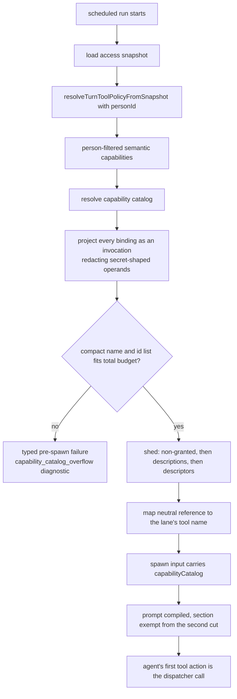

# Cold-read grill — gate: task — task plan GRANTED-1-T1

You did NOT write what follows. Read it cold, as an adversary trying to break the handover, never as its author defending it. You are READ-ONLY: return findings, change nothing.

## Interrogation technique

Run the interrogation this way. The harness contract above is the floor; this is the technique.

---
name: grilling
description: Grill the user relentlessly about a plan, decision, or idea. Use when the user wants to stress-test their thinking, or uses any 'grill' trigger phrases.
---

Interview me relentlessly about every aspect of this until we reach a shared understanding. Walk down each branch of the decision tree, resolving dependencies between decisions one-by-one. For each question, provide your recommended answer.

Ask the questions one at a time, waiting for feedback on each question before continuing. Asking multiple questions at once is bewildering.

If a *fact* can be found by exploring the environment (filesystem, tools, etc.), look it up rather than asking me. The *decisions*, though, are mine — put each one to me and wait for my answer.

Do not act on it until I confirm we have reached a shared understanding.


## Harness grill contract

# Griller Prompt — adversarial handover interrogation

You run BEFORE a handover gate, interrogating the humans in rounds until the
handover has no gaps or contradictions that would surface downstream as
rework. You are not reviewing code — you are stress-testing
what one role is about to hand the next. The gate scripts REFUSE without
your fresh, passing record.

**Independence is the whole point.** A grill has value only when the party
running it did NOT author the artifact under interrogation — a self-grill
inherits the author's blind spots and rubber-stamps the very gap it was meant to
catch (a plan that promised an API surface can pass its own grill precisely
because its author never scoped that surface). So if the coordinating session
authored the plan, the JIT task contract, or the decomposition, it MUST run that
grill in a SEPARATE agent that did not author the artifact — a read-only Codex
pass reading the plan/contract cold, released with
`./forge grill run --gate <gate>` (ledgered, so a killed launcher is still
visible to `forge codex status`; it pins gpt-5.6-terra @ xhigh from
harness.yaml) — rather than certify its own work inline. Codex on `gpt-5.6-terra` @ xhigh
is the required cold reader for planning grills: a fresh model context fully
independent of the authoring session, and because it is read-only it never
writes, so the write-lock that gates the write companion does not apply. Do NOT
use a Claude sub-agent for the grill, and never grill your own work inline.
Interrogate as an adversary trying to break the handover, never as its author
defending it.

RELEASE IT THROUGH THE HARNESS. `./forge grill run --gate <gate>` composes the cold-read brief (this contract plus the artifact) and releases Codex through the SAME ledgered launcher a delegation uses: the pid is recorded before the wait, so a grill whose launcher is killed still shows up in `forge codex status` instead of vanishing. It is read-only, so it takes no delegation lock and can never satisfy `stage done`. Recording the gate stays yours — the cold read only returns findings.

The technique is Matt Pocock's `grilling` skill — the design tree, the
frontier, numbered questions with recommended answers. `doctor --fix` installs
it into BOTH runtimes, and `./forge grill run` also inlines it into the brief,
so a reader reaches it whether or not its runtime resolves skills. This
contract is the harness-side floor; `grilling` is the technique.

`grill-me` is the HUMAN entry point — you type `/grill-me` and it redirects to
`grilling`. It carries `disable-model-invocation: true`, so no model invokes it
and none should be told to.

WHICH RUNTIME CAN RECORD WHICH GATE — get this wrong and you will chase a
refusal you cannot satisfy. ALL SIX gates match the AskUserQuestion ledger and
are therefore CLAUDE-ONLY, each with a floor of ONE logged round: `--gate spec`,
`--gate signoff`, `--gate epics`, `--gate requirements`, `--gate plan` and
`--gate task` — the floors live in `grill_gates.GATES`, one row per gate.
`signoff` and `epics` used to sit outside that check and so recorded with ZERO
rounds behind them; they now answer to it like every other gate.

ONE round is a FLOOR, never a target. Keep going until a round comes back clean
AND the next one stays clean — a single quiet round after a noisy one is a
coincidence, not convergence. The ledger files are written ONLY by `post_tool_use.py` on a
Claude Code AskUserQuestion event; `.codex/hooks.json` registers no PostToolUse
hook, so Codex cannot produce them and neither can a subagent. Delegating a
ledger-matched grill to Codex returns a well-formed payload that the recorder
then refuses, with nothing you can do to satisfy it — the payload was never the
problem, the runtime was.

For those four ledger-matched gates, independence is a COLD READ,
not necessarily a separate process. The recorder accepts ONLY rounds that match a
logged AskUserQuestion record (`record_grill_from_json.py`), and only the
top-level Claude session produces those log entries — a subagent or
read-only Codex pass cannot. So for those grills the top-level session drives
the rounds through AskUserQuestion itself — but because the coordinating session
authored the plan, the independent cold-read pass is MANDATORY, not optional: on
EVERY round release a fresh READ-ONLY Codex pass with
`./forge grill run --gate <gate> [--task <id>]` that reads the plan/contract
cold and returns findings — never a
Claude sub-agent, never grill your own work inline — then carry ALL of those
findings into your own AskUserQuestion rounds (the recorder rejects rounds not in
the ledger, so the top-level session must still ask). Read cold, as an adversary
who did not write it.

ONE COLD READ PER GATE — put every question to the human INSIDE it. The old
shape was Codex grill → your rounds → amend → Codex grill AGAIN, looping until
clean. That loop cannot converge: a fresh reader has no memory of what the last
one found, so it returns a DIFFERENT frontier rather than a shorter one, and the
artifact you amended to close round one becomes round two's input. Stories
reached eleven, twenty-six and forty rounds that way; the last cost six hours.
`forge grill run` now REFUSES a second unconstrained read on a gate that has
already been read since its last recorded pass.

So the WHOLE grill is:

1. `./forge grill run --gate <gate>` — one cold read. WATCH it.
2. Clean? Record the pass and approve. Nothing else happens.
3. Otherwise resolve every finding the REPOSITORY answers yourself — open the
   file and settle it. Take to the human only what the repository cannot
   answer: a decision nobody has made, a priority, a tradeoff between two
   workable shapes. Put those through AskUserQuestion with your recommended
   answer first, all of them, now. There is no later round to save the hard
   ones for, and a finding is not a menu.
4. Amend the artifact ONCE, to what they decided.
5. Record the pass against the AMENDED version, then approve exactly once.

The price is stated plainly, twice over: nothing independent re-reads the
amended version, and a gap this reader misses is not caught by a second reader
at this gate. Both surface at the next gate, or in review. That is the trade
for ending a loop that was costing whole days.

If the human's answers changed the artifact's SHAPE — a component dropped, a
different approach chosen — the amended artifact is not the one that was read
in any useful sense. Say so and read again: `./forge grill run --gate <gate>
--reread "<what changed shape>"`. It is a choice with a recorded reason, not a
way around the rule, and the five-read cap still backstops it. (EVERY gate is ledger-matched — signoff and epics no
longer excepted — so no gate can be recorded by a read-only Codex grill alone:
the top-level session asks the round and records it.)

FRESH CONTEXT, AND THE ANSWERS SO FAR. Every round is a NEW read-only Codex
session — that independence is the whole point. But a reader that knows nothing
of the earlier rounds does not re-find the same gaps, it finds DIFFERENT ones,
so the rounds never shrink and the grill has no natural end. `./forge grill run`
therefore carries every question already put to the human and the answer they
chose, read from the ledger the recorder validates against.

That gives the reader two obligations: do not re-raise settled questions, and
CHECK EACH ANSWER — that the artifact honours it, and that it contradicts no
other answer, accepted decision or constitution rule. An answer can be wrong, or
right and never applied; saying so is part of the read.

Do NOT tell the reader where to concentrate. A cold read is worth having because
it is unconstrained, and steering it toward the diff is how the thing nobody
looked at survives every round. More information, no direction.

END EVERY ROUND WITH AN EXPLICIT CONVERGENCE VERDICT, on its own line, so the
coordinator never has to guess whether to grill again or approve:

- `CONVERGED — no gaps, no contradictions, plan unchanged since the last round`
- `NOT CONVERGED — <the specific reason: open gaps, a contradiction, or the plan
  changed after the last clean round>`

`CONVERGED` on the cold read means there is nothing to amend: record and
approve. `NOT CONVERGED` does NOT mean read again — it means resolve what the
repository answers, put the rest to the human, amend once, and record the pass
against the amended version. Approval happens exactly once.

Five gates, five scopes:

- `--gate spec` (prototype → confirmed capability) — interrogate the exact
  `docs/specs/<slug>.md` file against BRIEF, architecture, decisions, and the
  prototype. Hunt: behavior the prototype proved but the spec omitted,
  implementation choices masquerading as requirements, vague acceptance
  language, and conflicts with active decisions.
- `--gate signoff` (client → PM, before `record_signoff.py`) — interrogate
  `docs/product/DISCOVERY.md`, `BRIEF.md`, confirmed specs, the spec-linked
  roadmap, `docs/decisions/`, and prototype notes. Hunt: unanswered
  stakeholder/constraint questions, scope
  the client saw vs. scope the BRIEF claims, decisions that contradict the
  BRIEF, acceptance criteria that are vibes instead of checks, non-functional
  requirements nobody asked about (auth, data retention, environments).
- `--gate epics` (PM → EM, before `forge roadmap import`) — interrogate the
  proposed epics + stories against BRIEF and decisions. Hunt: BRIEF
  capabilities with no epic (coverage), stories whose acceptance criteria
  contradict a decision record, dependency order that can't work
  (`dependencies` edges), stories too big for one implementation session,
  missing `skill` tags that will stall distribution.
- `--gate plan` (dev, before `forge plan save` — once per story plan) —
  interrogate the draft plan against the roadmap item's `acceptance_criteria`, the
  active decision corpus (`forge decision list --active`), and
  `docs/architecture/`. Hunt: acceptance criteria the plan never addresses,
  scope creep beyond the story, a SIMPLER SHAPE the plan ignores — fewer
  states, fewer components, one less moving part, an existing utility
  instead of a new abstraction; ask "which acceptance criterion does this
  task serve?" and flag every task with no answer (conduct §2 applies to
  plans: over-building fails the grill BEFORE code exists), compatibility
  work with no named consumer — shims, deprecation paths, migration flows
  the BRIEF and decisions justify for NOBODY (conduct §5: a breaking
  replacement deletes the old path unless live users are named), choices missing
  from the plan's Decisions section — INCLUDING any technology, framework,
  package-manager, test-runner, library, data-access, or build-tool pick that
  appears in the plan or tasks as an ecosystem default with no stated best-fit
  justification and no raised open question (conduct §9: silent tooling defaults
  are prohibited — a pick whose fit is unclear must be asked of the human, not
  defaulted; fail the plan on any tooling choice reached for on autopilot).
  Also flag a MISSING quality-gate baseline: any codebase the plan touches must
  wire a stack-APPROPRIATE static-analysis gate — a linter AND formatter, plus a
  type-checker where the language has one — into CI/verify, not merely a test
  runner. Name the CAPABILITY, never a fixed tool: ESLint/Biome for JS-TS,
  Ruff/flake8 for Python, golangci-lint for Go, Clippy for Rust, Checkstyle/
  Spotbugs for Java, and so on — the requirement is generic to every backend, not
  one ecosystem's tool. Fail the plan when code ships with no configured lint/
  format/static-analysis gate that an automated check enforces on every push; an
  absent linter is a silent quality default exactly like an unjustified tool pick.
  Also hold the plan against the CONSTITUTION's coding standards
  (`constitution/README.md` index — read the references it maps to the plan's
  surfaces). The constitution is law, so a plan whose SHAPE omits or contradicts a
  mandated standard is a GAP, not a style preference: HTTP surfaces with no typed
  request AND response DTOs (`pnp-api-standards`, `pnp-swagger-api-documentation-
  standards`), a module ignoring the modular-monolith layout or file-suffix
  standards (`pnp-coding-standards-modular-monolith`, `03`), missing structured
  logging (`05`/`06`) or domain exception handling (`07`), an external integration
  that skips the provider/port pattern (`08`, `pnp-provider-pattern-for-
  integration`), or database work ignoring `pnp-database-standards`. Flag each and
  require the plan to conform or record a deliberate, written deviation — never
  wave it through as "the implementer will follow standards later"; a plan must not
  design AGAINST the law. (`constitution/` is on disk in every environment, so the
  read-only Codex cold-read has the law available — hold the plan to it.)
  Reconcile the plan explicitly against
  EVERY ID from `forge decision list --active`; a conflict becomes a
  contradiction signal or a superseding decision, never a silent exception.
  Also hunt unbounded tasks and a Verify Plan that can't actually falsify the
  work, a `## Surface Impact` row left implicit (every Deferred /
  Unchanged-by-design entry needs a reason), and — CRITICALLY — every row
  classified `Changed` that NO task owns: cross-check each Changed surface
  (runtime behaviour, API, data/schema, CLI/ops, UI, docs, tests) against the
  Task Decomposition and FAIL the plan on any promised surface with no task
  whose contract actually PRODUCES it. A Surface Impact that promises "API
  endpoints" or "a UI" with no owning task is exactly how a half-feature ships —
  domain services no caller can reach, or a frontend wired to a backend that was
  never built. Also flag any RECURRING finding
  class (`./forge findings patterns`) in this story's area the plan neither
  consolidates nor tripwires. In Claude Code the
  `/grill-me` skill run against the plan satisfies this contract. The payload
  carries `"issue"`; the recorder stamps it against the active task.
- `--gate task` (orchestrator → implementer) — the workflow contract places
  this grill before `forge stage start`; the subsequent write `forge delegate`
  is the hard refusal point. Interrogate the next leaf task's just-authored
  contract in the re-recorded decomposition against the approved story plan,
  active decisions, and the actual repository state left by completed prior
  stages. Hunt: assumed files or APIs that prior work did not produce, a
  `write_scope` whose AREAS miss where the work must land or reach into areas
  the task has no business in (scope is directory prefixes plus named new
  files — a missing existing file under a declared prefix, a drifted line
  number or a renamed module is a NON-BLOCKING note, never a blocking finding;
  `stage done` measures the exact paths), acceptance criteria not served by the proposed
  work, a task that OWNS a plan `## Surface Impact` surface but whose
  `write_scope`/`required_tests` do not actually PRODUCE it (owns the API row but
  builds only domain services with no HTTP controllers/DTOs/routes; owns the UI
  row but ships no components) — reachability is part of "done", not a later
  task's problem, required tests that do not prove those criteria, verify commands that
  cannot falsify the change, reviewer focus that misses the risky seam OR that
  re-states shape rules the constitution already sets instead of CITING the
  load-bearing `constitution/` references for the task (the contract points at the
  law, never re-derives or contradicts it), and a
  `user_facing` flag that misclassifies the task — a UI task left `false` (its
  mandatory design skills and design review would be skipped) or a backend task
  marked `true` (forced to attest UI design skills it has no use for).
  This is the JIT task-planning gate from decision 0032, not a repeat of the
  story-level plan grill. Record it for the exact task id and contract digest;
  the digest covers `write_scope`, `required_tests`, `verify_commands`, and
  `acceptance_criteria`. A changed field makes the old task grill stale, and a
  write delegation refuses it; read-only delegation is unaffected.

Method:

1. Read the artifacts in scope FIRST; derive your question list from actual
   text, citing it (`BRIEF.md says X; decision 0003 says Y — which wins?`).
2. Interrogate in ROUNDS until the frontier is empty — not one pass. Each
   round, put the questions whose prerequisites are already settled to the
   human (PM or EM) with your recommended answer; their answers reshape the
   tree and unblock the next round's questions. Stop a single question when it
   would only confirm what a document already states; stop the grill only when
   no gap or contradiction remains unasked. In Claude Code, deliver each
   round's frontier through the AskUserQuestion tool (recommended answer
   first), not prose. For every ledger-matched gate (`spec`, `requirements`,
   `plan`, `task`) the recorder requires
   the FINAL round in the payload to carry `"frontier_empty": true` — that flag
   is how it confirms you stopped because the frontier closed, not because you
   ran out of patience; it is set by hand on the last `rounds` entry, never by
   the ledger. A zero-gap contract still needs at least one such round (every
   gate's floor is 1, and a floor is not a target), so ask a genuine closing
   question
   (e.g. "any remaining gap before we hand off?") and mark it `frontier_empty`.
3. Every finding lands somewhere real before the verdict: a doc edit, a
   `./forge decision new <slug>` record, or an explicit non-blocking entry
   in `open_items`. An `open_items` entry that PARKS scope also gets a
   deferral row with a revisit trigger (`./forge defer add`) — parked scope
   without a trigger is scope silently dropped. Unresolved blocking
   findings ⇒ verdict `blocked`.
4. Record the outcome (schema: `factory/schemas/grill.json`,
   `"generated_by": "griller"`):

   A task-grill input uses this recorded shape (the recorder adds its own
   task id, digests, commit, and timestamps):

```json
{
  "generated_by": "griller",
  "verdict": "pass",
  "gaps": [],
  "contradictions": [],
  "resolutions": ["What was sanctioned"],
  "inspected_refs": ["path/or/path:symbol"],
  "current_flow": "What the repository does now",
  "criteria_map": {"criterion": "proof"},
  "decision": "keep",
  "new_abstractions": ["None"],
  "rounds": [{"question": "Finding or choice", "options": ["Recommended", "Alternative"], "chosen": "Recommended", "frontier_empty": true}],
  "citations": [{"finding": "Repo-answerable finding", "source": "path:symbol"}],
  "open_items": []
}
```

   Each `rounds` entry has a non-empty `question`, two to four non-empty
   string `options`, and a `chosen` value equal to one option. Each citation
   is `{finding, source}`. Every string in `gaps` must be covered by an equal
   `rounds[].question` or `citations[].finding`.

   For every gate — all six are ledger-matched — extra recorder rules bind
   (this is what makes an otherwise well-formed payload fail):
   - Rounds must match the AskUserQuestion ledger and meet the gate floor
     (1 for every gate, and a floor is not a target); the final round carries
     `"frontier_empty": true`. A
     zero-gap grill still records its floor of real rounds — never zero.
   - `--gate task` only: `criteria_map` is a THREE-WAY equality — its KEYS must
     equal the frontier task's `acceptance_criteria` set AND the set of its
     `plan_contracts[].statement` values, exactly (no extra key, none missing);
     each value is the non-empty proof for that criterion. Author the task's
     `acceptance_criteria` and its `plan_contracts` statements as the SAME
     strings so there is one coherent key set to satisfy.

```bash
python3 factory/scripts/record_grill_from_json.py --gate <spec|signoff|epics|requirements|plan|task> --input <json> [--input-digest <artifact>] [--task <id>]
```

5. For every gate except task, commit the resolution edits
   BEFORE recording the grill — those gates check freshness against BOTH
   committed history and the working tree: any guarded doc changing after the
   grill (even uncommitted) stales it. (The sign-off / epics-approved decision
   records themselves are expected afterwards and don't stale it.) The task
   gate instead binds directly to the re-recorded task contract digest; the JIT
   sequence does not require a commit between re-recording and grilling. But that
   digest still folds in the product tree, so record the task grill LAST — after
   any docs/ or factory/scripts commits: a tracked change outside .factory/ and
   plans/ that lands between grilling and `task approve`/`stage start` re-stales
   it and forces a re-grill.
6. `--input-digest` is REQUIRED for the spec, epics, and plan gates: pass the
   exact spec / roadmap input / plan draft you interrogated. The gate verifies the
   digest — grilling version A never approves an edited version B; if the
   artifact changes, re-grill it. For `--gate task`, pass `--task <id>` and NO
   `--task-digest` — that flag was removed and the recorder rejects it; the
   recorder derives the grounding digest itself from the protected contract,
   approved plan, and product tree, and stores the result at
   `.factory/grills/tasks/<id>.json`.

A `pass` with unresolved findings is refused by the recorder. Grill hard;
downstream implementation inherits whatever you let through.


## Lessons already in force for these paths

The plan must design AROUND these. A plan that ignores one is not merely unlucky later — it is wrong now, and saying so is part of this read.

- Runtime state, jobs, control events, and memory use Postgres as the production storage model; schema or repository changes need repository tests and architecture/docs updates when contracts shift.
- Keep provider-specific and channel-specific behavior behind adapters; domain and application code should depend on stable product concepts and ports, not SDK payloads or runtime wiring.
- Risky tool execution must pass through deterministic permission evaluation and sandbox policy before any provider callback or runner grants access.
- When memory IPC auth scope includes per-run reviewer authority, every runner boundary must forward memoryReviewerIsControlApprover into the Gantry MCP server env; otherwise approver runs sign memory_search and continuity_summary requests with a different scope than runtime verification.
- Runner-spawning tests (agent-runner-ipc, ipc-mcp-stdio) sandbox the runner by COPYING source files; hand-enumerated lists silently break when a new module becomes runner-reachable (every test then burns its ~19s IPC timeout). Fixed 2026-07-22 by recursive cpSync of the whole shared/ tree. If a runner-spawn test suite suddenly times out uniformly, check the sandbox copy set FIRST; never reintroduce per-file enumeration of a derivable file set.
- Run the focused Prettier check after adding or reshaping TypeScript tests so the deterministic structural gate does not rediscover formatting drift.
- The full npm run test:unit lane can finish the LIVE-1 surfaces and then remain silent without a Vitest summary in this checkout; do not call it green without the exit code, and preserve focused lane evidence separately.
- Managed command policy can reject required VITEST_JUNIT/FORGE_TEST_ID commands when the exact testcase identifier contains a literal greater-than separator. Report the wrapper lane as blocked and do not call it passing.
- Managed command policy can refuse the required FORGE_TEST_ID when its exact test name contains a greater-than character; report the policy refusal separately from focused test evidence.
- A jobs or runner directory-wide Vitest invocation can remain live without a summary or exit code in the managed environment; terminate it after bounded polling and report it as unverified, not green.
- A focused Vitest selector can complete its test but still exit 1 when the macOS watcher hits EMFILE; treat this as blocked verification and rerun with the canonical wrapper or a watcher-safe environment.
- Postgres JSONB normalizes object key order and drops undefined; any equality check against persisted state (JSON.stringify ===) silently fails in prod while structuredClone-based fakes keep it green. Compare with util.isDeepStrictEqual and make repository fakes persist through a JSONB-faithful round trip (see test/unit/application/jsonb-round-trip.ts).
- Managed execution can reject a required test when an inline environment assignment is the command prefix, reporting that the shell wrapper hides prefix inspection; invoke the same command through env so the executable prefix is visible, and report any remaining refusal separately.
- Managed command policy can refuse required Vitest commands when a leading environment assignment obscures the inspected prefix; preserve the refusal and run an equivalent direct Vitest JUnit command separately.
- On a task touching 20+ files the Codex run hits the compaction limit after about 90 read commands; the source files are already complete and committed (checkpoint 5e060951a, tsc clean), so do NOT re-read finished source files — start from git status and the required_tests list, write or finish ONE test file at a time (run only that file with vitest), and stop reading the brief's cited source lines you have already implemented.
- Remaining T2b work after the checkpoint is ONLY: (1) test/unit/runner/tool-permission-gate.test.ts:1347-1358 — re-point the CAPSAFE-1-BOUNDARY import from the deleted gantryToolDefaultRisk to gantryToolRisk and assert capability_run is high; (2) test/unit/runtime/permission-classifier.test.ts — replace the 'auto-approves a routine gantry mutation via the deterministic map' expectation (medium is gone) and make the lane-independent-high leaf pass (the consult stub must not be invoked for a table-judged tool); (3) create test/unit/runtime/browser-file-attach-source.test.ts; (4) the remaining required_tests leaves in ipc-permission-classifier-decision, ipc-file-artifact-handlers, file-tool and askfloor-tap-budget. Source files are complete and committed; do not re-read them.
- Exactly six required leaves are still missing; every source file and every other suite is complete, committed and green (tsc clean). Write ONLY these six it() titles verbatim, one file at a time, running only that file after each: - apps/core/test/unit/jobs/ipc-file-artifact-handlers.test.ts: it('hides protected entries from list with a protectedHidden count and refuses a protected read by id and by path with the fixed not-a-permission-question text') - apps/core/test/unit/runner/mcp/file-tool.test.ts: it('appends the protected-entries-hidden line to list output only when the count is positive and relays a protected read refusal unchanged') - apps/core/test/unit/runner/tool-permission-gate.test.ts: it('keeps capability_run high through the typed table for the CAPSAFE-1 boundary with no classifier-derived or cached allow') - apps/core/test/unit/runtime/askfloor-tap-budget.test.ts: it('TB1 TB2 TB3 TB4: a browser click, a file read by path, an unprotected file write and a native FileWrite inside the workspace cost 0 taps in interactive auto with the LLM consult not invoked') - apps/core/test/unit/runtime/askfloor-tap-budget.test.ts: it('mirror fixtures: a protected file write, a FileWrite outside the workspace and scheduler_delete_job cost 1 tap, and a raw-path file_attach reaches the stubbed LLM consult as ambiguous') - apps/core/test/unit/runtime/askfloor-tap-budget.test.ts: it('keeps today's outcome for the TB1 TB2 TB3 TB4 fixtures under auto_strict, ask and autonomous')
- T3a order that fits one Codex run: (1) schema.ts + port + repository + domain/types.ts + the shared boundary canonicalPath, then run npm run db:migrations:generate -- --name permission_decision_memory_human (NEVER hand-write the SQL or snapshot; commit what drizzle-kit emits), then npx tsc --noEmit; (2) the scope-key module and the service; (3) tests ONE FILE AT A TIME in this order — provenance, scope, service, prospective-write pin, Postgres suite — running each file right after writing it and never re-reading a finished source file. Postgres tests need the TEST database: run 'source /private/tmp/claude-501/-Users-ravikiranvemula-Workdir-myclaw/b4051e43-dbea-4d62-ba73-ae6210455474/scratchpad/pgfix-env.sh' in the same shell before vitest (it exports GANTRY_TEST_DATABASE_URL for gantry_test; the live database gantry must never be touched). Required leaf titles are exact it() names from the brief.
- The tree already holds partial T5b work (listing module, forget handler, parser, ports, four provider branches). Do NOT re-survey: read only the cited line ranges in the brief and the files you are about to edit. Order: 1 listing module + parser + session command; 2 forget handler + wiring setter + runtime-services bind; 3 audit read port + Postgres adapter + job-name hydration; 4 label carrier on both prompt paths + guidance line; 5 the four provider in-place edits; 6 tests one file at a time, running only the touched suite after each. Everything you write survives on disk across relaunches; commit nothing, finish the slice in front of you.
- Every source file in the T5b scope is already edited, type-checks clean, and is committed. Do not re-read or rework sources unless a test proves a defect. Remaining, one file at a time, running only that suite after each: unit/runtime/group-processing.test.ts, unit/runtime/permission-decision-coordinator.test.ts, unit/bootstrap/runtime-app.test.ts, unit/bootstrap/channel-message-action-router.test.ts, unit/application/human-decision-memory-service.test.ts, unit/runtime/ipc-interaction-handler.test.ts, unit/bootstrap/inline-agent-loop-tools.test.ts, unit/runtime/prompt-profile.test.ts, unit/channels/telegram.test.ts, unit/channels/slack.test.ts, unit/channels/discord/discord.test.ts, unit/channels/teams/teams.test.ts, then unit/runtime/askfloor-tap-budget-harness.ts + askfloor-tap-budget.test.ts (S5). Each required_tests leaf id must appear verbatim as a test title.
- The review found no blocker; exactly three P2s remain and nothing else may change: (1) /permissions forget <prefix> must match the prefix against the FULL record id (the short display id is a rendering of it, never the match key) — pin with a test where two records share a short-id prefix; (2) decoding the remembered place must preserve colons inside the value (split on the first separator only) — pin with a place containing a colon; (3) add the concurrent double-tap coverage each provider suite was required to carry: two Forget taps on the same row settle to one applied and one already_revoked reply. Run only the touched suites; tsc and check:architecture must stay green.
- Together with the three quality P2s these are the ONLY changes in this round: (4) the used-by lookup runs only for the rows actually rendered (the ten newest for bare /permissions, all for /permissions all), never for every remembered record; (5) job-name hydration is ONE batched read for the collected job ids, not a serial per-record loop; (6) a provider in-place edit failure must never suppress the Forget receipt — send the confirmation reply first or independently, then attempt the edit, and pin it with a test per provider where the edit throws; (7) keep behaviour otherwise identical. Run only the touched suites; tsc and check:architecture stay green.
- Final fix cycle; change nothing else. (1) After a Forget tap the re-rendered list hydrates used-by ONLY for the rows it renders (the ten newest), same as the bare listing. (2) Job-name hydration is ONE bulk repository read for the deduplicated job ids (a single list/getMany call), not concurrent per-id reads — this also bounds /permissions all to one query. (3) Slack: when the replacement view has no buttons, clear the blocks (send an empty blocks array / text-only update) so stale buttons do not linger; pin with a test. (4) Move the 'Already forgotten.' string into the listing copy owner beside the other replies. Run only the touched suites; tsc and check:architecture stay green.
- The review marked two contracts partial; close them and nothing else. (AC2) PermissionMemoryListMessageView and the list-view type live in application/permissions/permission-memory-listing.ts (the required owner) — move the type there and import it from the current location; no behaviour change. (AC5) the used-by read fetches ONLY the job ids referenced by the rendered records: collect the ids from the rows being rendered, dedupe once, and pass exactly that set to the single bulk job read; add a listing test asserting the bulk read receives only referenced ids. Run listing + forget-handler suites, tsc, check:architecture; ceilings measured after prettier.
- Orchestrator ruling (signals S-0093 and S-0094 resolved): PermissionMemoryListMessageView is DOMAIN-owned by design and stays where it is; AC2's 'listing module owns the view type' clause is superseded by the layer rule (domain must not import application) and is considered implemented. Do NOT move the type, do NOT raise a contradiction about it, do NOT edit domain/message-actions.ts. The single remaining change is AC5: in application/permissions/permission-memory-listing.ts (or the forget handler where hydration is called) collect the job ids referenced by the rows being rendered, dedupe once, and pass exactly that set to the one bulk job read; add a listing unit test asserting the bulk read receives only the referenced ids. Run the listing and forget-handler suites, tsc, check:architecture; finish.
- Exactly these changes, nothing else. (P1, blocking) app/bootstrap/runtime-services.ts ~line 601: the Forget handler's resolvePerson must canonicalise the caller in the CONVERSATION's app — derive the app id with appIdFromConversationJid(action.conversationJid) (the same value the handler later uses for the memory lookup) and pass it to resolveCanonicalMemoryPersonId instead of the process-wide runtime app id; pin with a runtime-services test where the conversation's app differs from the process app. (AC5) runtime-services.ts ~626 and app/bootstrap/group-processor-deps.ts ~87 bind a job reader that ignores the id set and lists ALL jobs; bind a by-ids read (add listJobsByIds(appId, ids) to the ops job repository port + Postgres adapter if none exists, or batch the existing getJobById) so only the referenced ids are read; pin it. (AC2) application/permissions/permission-memory-listing.ts ~155 duplicates the category-noun table; delete it and call the existing shared category-noun helper the card copy uses; add the one-job and two-job used-by cases to the listing suite beside the 3+ case. Run runtime-services, listing, forget-handler suites; tsc; check:architecture; ceilings after prettier (runtime-services ≤ 1186). You cannot reach Postgres; the orchestrator runs that lane.
- Orchestrator ruling (S-0095 resolved): do NOT add listJobsByIds or touch ops-repo.ts / the jobs Postgres adapter (out of scope). AC5 is implemented by: collect the job ids referenced by the rows being rendered (≤10 for bare /permissions; all active rows for /permissions all), dedupe once, and resolve names with ONE concurrent batch — Promise.all over getJobById for exactly that set — in the reader bound at runtime-services.ts ~626 and group-processor-deps.ts ~87; never list every job. Pin with a listing test that the reader is invoked only with the referenced ids. Do not raise a contradiction about this. Then: (P1) runtime-services.ts ~601 pass appIdFromConversationJid(action.conversationJid) into resolveCanonicalMemoryPersonId (test: conversation app ≠ process app); (AC2) delete the duplicate category-noun table at permission-memory-listing.ts ~155 and call the shared helper; add the one-job and two-job used-by cases. Run runtime-services, listing, forget-handler suites, tsc, check:architecture; ceilings after prettier.
- Orchestrator ruling (S-0097 resolved, AC2 amended): permission-memory-listing.ts OWNS the category-noun mapping (CATEGORY_NOUNS + exported permissionMemoryScopeNoun). No other noun helper exists; do not search for one, do not delete the table, do not raise a contradiction about nouns. Do exactly three things and finish: (1) P1 — runtime-services.ts ~601: pass appIdFromConversationJid(action.conversationJid) into resolveCanonicalMemoryPersonId; add a runtime-services test where the conversation's app differs from the process app. (2) AC5 — in the readers bound at runtime-services.ts ~626 and group-processor-deps.ts ~87, resolve names with one Promise.all over getJobById for the deduplicated referenced ids only (never list all jobs); test that only referenced ids are read. (3) AC5 tests — add one-job and two-job used-by cases in permission-memory-listing.test.ts beside the 3+ case. Run runtime-services, listing, forget-handler suites; tsc; check:architecture; ceilings after prettier.
- Orchestrator ruling (review round 6): MemoryForgetMessageActionInput carries the agent identity as the bounded agentRouteKey — the codec key the round-3 grill ruled because Telegram's callback payload is size-limited; the host handler resolves the route-effective agentId from it. Do NOT add an agentId field to the domain input or to any provider payload; AC4 has been amended to say so. Do not raise a contradiction about it. The single remaining change: app/bootstrap/runtime-services.ts ~line 631 — the post-Forget used-by hydration (and any used-by read the Forget handler performs) must use the CONVERSATION's app id (appIdFromConversationJid(action.conversationJid), the same value the handler already uses for the memory lookup and the person resolver), never the process-wide app id; pin it with a runtime-services test where the conversation app differs from the process app. Run runtime-services + forget-handler suites, tsc, check:architecture; ceilings after prettier (runtime-services ≤ 1186 — extract a tiny helper if needed). Finish.
- Work in this order and finish each slice before reading further; everything you write survives on disk across relaunches; commit nothing. Slice 1: NEW application/permissions/permission-judge-outage-latch.ts (pure latch: observe/reset/clearAll, keyed appId|providerAccountId|targetJid, the two exported copy strings) + NEW runtime/permission-judge-outage.ts (module-level judgeOutageLatch instance, unavailablePromptConsultResult(failureCode, startedAt) returning the full PermissionClassifierPromptConsultResult with decision 'ask', isJudgeUnavailable, sendJudgeOfflineNotice with { threadId, providerAccountId }, no-target skip, swallowed errors) + add 'wiring_missing' to the failure-code union at runtime/permission-classifier.ts:60. Slice 2: IPC — split eligibility from wiring at ipc-permission-classifier-decision.ts:361, synthetic result on wiring failure, notice call before requestPermissionApproval at :639 and :595 and before the terminal job decision, reason line, exclude Unavailable from the cache write at :502; the file is 691/700 — calls only; extract the verdict-cache helpers into the runtime glue module if needed. Slice 3: inline-agent-loop-tools.ts — split the :372 guard, notice in beforePrompt (:449-468) and before the scheduled cancel return at :410, reason line; 708/750. Slice 4: NEW latch suite, NEW glue suite, the wiring_missing case in permission-classifier.test.ts, the IPC-decision cases, the inline cases — one file at a time, run only that suite. Slice 5: harness knobs (classifierVerdict.status, sendMessage + publishRuntimeEvent spies returned from replayPermissionRequest, classifierConsult param on replayExactMemorySequence), S6 + aggregation in askfloor-tap-budget.test.ts, NEW askfloor-invariance.test.ts as an it.each table over harness fixtures with tuples copied verbatim. Test titles = required_tests ids VERBATIM. You cannot reach Postgres; the orchestrator runs that lane. Never list all jobs, never import channels/.
- Exactly six changes; product design is otherwise final. (1) inline-agent-loop-tools.ts ~422: call observeJudgeAvailabilityForRequest BEFORE the successful-allow return so an answered allow clears the latch (pin: answered allow then unavailable → notice again). (2) askfloor-tap-budget.test.ts S6 ~324: the uncovered-read case must be a READ that the rails do not cover (e.g. a file read by path OUTSIDE the trusted root, or an mcp read binding not in reviewedMcpReadBindings) — not mcp__crm__update_record — and must assert exactly one tap and one notice; add the scheduled-job case (hostJobId set, judge unavailable): notice sent once to the job conversation, decision reason = JUDGE_OFFLINE_REASON, deterministic denial + card recovery unchanged. (3) askfloor-invariance.test.ts: build the matrix from the REAL harness fixtures — one row per lane in AF-AC6: ask, auto_strict, interactive auto, trusted-host autonomous via registerWorkerPermissionRunRestriction, the projection quartet via replayRememberedJobProjection (exact match allows, near-miss cards, revoked re-cards, rails-bump re-cards — the harness has these), YOLO backstop, unmapped forced ask, scheduler_delete_job, destructive via replayDestructiveExactMemory, the family rail hit asserting FAMILY_RULE_RAIL_HIT_REASON, the inline-scheduled path through the INLINE gate (pattern of inline-agent-loop-tools.test.ts:1115/1450, not the IPC replay), attachment_open via attachmentOpenIds; expected tuples copied verbatim from askfloor-tap-budget.test.ts:26/173/233 and ipc-permission-classifier-decision.test.ts:360/385/416; the Unavailable column for the six codes + wiring_missing differs only where AF-AC5/0157 say. (4) aggregation ~356: actually run the four TB1-TB4 interactive-auto fixtures and the four mirrors (protected write, outside-workspace write, scheduler_delete_job, raw-path attach) plus S1-S6 through replayPermissionRequest and sum taps per lane. (5) runtime/permission-judge-outage.ts:133: delete the unused exported sendJudgeOfflineNotice; keep only sendJudgeOfflineNoticeForRequest and test that one. (6) REGRESSION apps/core/test/unit/application/jobperm-ask-and-wait.test.ts 'denies a job request when its permission card cannot be attached' now fails (attachRequest 0 calls): on a job lane a synthetic wiring_missing result must flow into the SAME card/attach path as a real classifier ask (0157), never a terminal decision before attach — fix the IPC resolver so that test passes unchanged. Test titles must stay the required_tests ids verbatim. Run the touched suites + that jobperm suite; tsc; check:architecture; ceilings after prettier.

## Already answered on this story — verify, do not re-ask

These questions were put to the human and answered. Two obligations:

1. Do NOT raise them again as open questions. They are settled.
2. DO check each answer still holds — that the artifact actually honours it, and that it does not contradict another answer, an accepted decision, or the constitution. An answer can be wrong, or right and never applied. Saying so is part of this read.

- Q: SELF-1 — when an AI employee proposes a change to itself, what is the default for a new agent?
  A: Review-only by default; owner opts specific classes into auto-apply (Recommended)
- Q: INCIDENT-1 — what does `freeze` do to work already in flight?
  A: Soft by default: no new runs or tool calls, in-flight turns finish; `--hard` cancels immediately (Recommended)
- Q: ADMIN-ALERT-1 — where do admin alerts go in V1.0?
  A: One Teams/Slack conversation only (Recommended)
- Q: OPS-DR-1 — where do backups go?
  A: S3-compatible bucket or local path, operator's choice (Recommended)
- Q: LIFECYCLE-1 — default retention when the operator sets nothing?
  A: Messages 90 days, memory until offboarding, audit 400 days minimum (Recommended)
- Q: INTRO-1 — when does the intro card post in a channel?
  A: Once, on install, plus on first @mention by any new person (Recommended)
- Q: REVISION-1 — who can restore a prior persona/access revision?
  A: Owner for persona; administrator for access (Recommended)
- Q: Anything else to settle before I confirm these eleven specs and open the PR?
  A: No — confirm and open the PR (Recommended)
- Q: If the job card itself can't be created for a request (DB down, no group route), what should the run get?
  A: Deny the tool call with a plain reason (Recommended)
- Q: Anything else to settle for JOBPERM-2 before I confirm the spec and plan it?
  A: No — confirm and plan (Recommended)
- Q: Should attaching a skill remain separate from authorizing its declared actions?
  A: Keep separate (Recommended)
- Q: The independent cold read found no contradictions. Is the current Skills UI spec ready to confirm?
  A: Confirm spec (Recommended)
- Q: Should re-enabling a disabled provider preserve omitted stored fields through the existing sparse PATCH flow?
  A: Preserve via PATCH (Recommended)
- Q: Should first setup prevent saving or constructing a request until a multi-method provider’s authentication method is explicitly selected?
  A: Require selection (Recommended)

## The artifact under interrogation (task plan GRANTED-1-T1)

# GRANTED-1-T1 — The scheduled run is told which capabilities it holds

## Context

A scheduled run never receives a capability catalog. `capabilityCatalog` is built
only on the chat path (`runtime/group-agent-access-context.ts:45` calling
`runtime/group-run-context.ts:156`), and the job path
(`jobs/execution-phases-run.ts`) never sets it on the spawn input at `:287`, while
prompt compilation renders only what that input carries
(`runtime/agent-spawn-prompt.ts:87`). The agent guesses, and the KnackLabs job
burned two to four failed calls at the head of seven consecutive runs.

The dispatcher was always reachable (`shared/admin-mcp-tools.ts:96`, filtered at
`runner/gantry-mcp-tool-surface.ts:152`), and that run's own fourth attempt
succeeded through it. The missing element is knowledge, not exposure.

Spec `docs/specs/granted-capability-is-visible.md`; plan
`plans/active/GRANTED-1-agents-can-use-what-they-are-granted.md`; decision 0158.

## The two capability sets

`jobs/execution-phases-run.ts` holds both, and picking the wrong one is the
security risk in this task:

- `inheritedToolPolicy.semanticCapabilities` (`:182`) — resolved through
  `resolveTurnToolPolicyFromSnapshot(accessSnapshot, personId)`, filtered to what
  the acting person is granted. **The catalog uses this one.**
- `semanticCapabilities` (`:194`) — `resolveTurnSemanticCapabilitiesFromSnapshot`,
  no person filter. Feeding it would advertise capabilities the person was never
  granted as ready.

`runtime/group-run-context.ts:156` already accepts a ready capability set, so the
job path reuses it unchanged. No new resolver API.

## What changes

1. **Job path builds and passes the catalog.** Call the existing resolver with
   the person-filtered set and set `capabilityCatalog` on the spawn input at
   `:287`.
2. **`CatalogEntry` gains `invocations`, plural.** A semantic capability owns an
   array of implementation bindings (`shared/semantic-capabilities.ts:53`) while
   the catalog projects one entry per capability, so a singular field would hide a
   valid route. Every binding renders, in a deterministic order, as a closed union
   over the four usable kinds (`shared/semantic-capabilities.ts:25`; legacy
   `mcp_tool` is rejected at validation and never reaches the catalog):
   `local_cli` carries a lane-neutral dispatcher reference, the capability id and
   the reviewed argument patterns; `mcp_pattern` a neutral proxy reference and the
   connected server name; `tool_rule` the tool name, which is how skill actions
   appear, being a tool rule distinguished by source; `adapter` the neutral
   reference and capability id, its own reference being opaque.
   `resolveReadyActions` (`agent-prompt-capability-catalog.ts:137`) populates it
   and stops dropping `stableRef`.
3. **Render-time redaction.** Reviewed shapes render as reviewed, per the owner's
   ruling, EXCEPT that a secret-shaped operand is redacted as the catalog renders.
   Template validation (`shared/semantic-capabilities.ts:557`) blocks shell syntax
   and environment assignments but not a literal credential such as an API-key
   flag value, and `localCliArgPatterns` (`:541`) serializes verbatim. The owner
   chose redaction at render over blocking at definition time.
4. **Lane mapping at the compiler seam.** The catalog stores a lane-neutral
   reference; `runtime/agent-spawn-prompt.ts:80` already receives `AgentInput`,
   which carries `runtime` (`runtime/agent-spawn-types.ts:84`), so the mapping
   lives there and passes the resolved name to the profile service. The DeepAgents
   lane has no entry and a test asserts that, so its behaviour is unchanged and
   the gap cannot drift silently.
5. **Shedding and the two budgets.** `prompt-profile-service.ts:54` gains a named
   default budget and a ceiling derived as at least the compact name-and-id list.
   The renderer sheds in order: non-granted entries, then descriptions, then
   descriptors. Compilation truncates at the section budget (`:532`) and again at
   the total prompt budget (`:756`), so the capability section is exempted from
   the second cut below its compact representation.
6. **Hard overflow fails closed, through a typed path.** The existing callback
   (`agent-spawn-prompt.ts:58`) only logs counts, and a compile error is caught
   and turned into an empty prompt (`:120`), after which spawning continues. That
   cannot satisfy "before any provider call", so overflow raises a typed
   pre-spawn failure that the catch does not swallow, carrying a redacted
   `capability_catalog_overflow` diagnostic with granted and renderable counts.
7. **Deletion and wording.** The 97ded3746 block leaves `runner/mcp/context.ts`;
   the dispatcher description in `runner/mcp/tools/capability-run.ts` points at
   the catalog. Its input schema, risk classification and host enforcement are
   pinned unchanged.

## Non-goals

No change to enforcement, the argv template or the classifier. No migration or
schema change. The DeepAgents catalog is GRANTED-2. Document editing is DOCEDIT-1.
Blocking literal credentials at capability-definition validation was considered
and the owner chose render-time redaction instead.

## Workflow



## Manual Verification

1. Trigger the KnackLabs job and read the rendered guidance in its prompt record:
   the granted sheets capability appears with display name, stable id, the
   Anthropic tool name and its reviewed argument shape.
2. Query `gantry.runtime_events` for that run: no `tool.activity` row with phase
   `failure` precedes the first successful capability invocation.
3. Compare against a chat turn for the same agent: the same entries render, since
   both lanes share the builder and renderer.
4. Define a capability whose template carries a secret-shaped operand and confirm
   the rendered catalog shows it redacted while the stored template is unchanged.
5. Grant the agent enough capabilities that the compact list cannot fit, and
   confirm the run fails at startup with the overflow diagnostic rather than
   starting and silently omitting one.

## Verify

`npx vitest run -c vitest.unit.config.ts apps/core/test/unit/application
apps/core/test/unit/runtime apps/core/test/unit/jobs apps/core/test/unit/runner`,
then `npm run typecheck`, `npm run lint`, `npm run format:check`,
`npm run check:architecture`, and `python3 factory/scripts/verify.py` with
`GANTRY_TEST_DATABASE_URL`.


## What to return

Findings only: contradictions, gaps, unstated assumptions, and anything a reader would have to guess. Say what would break and why. Do not record a gate — the coordinating session records it.

The round count below is a FLOOR, not a target. Keep grilling until a round comes back clean AND stays clean on the next one — hitting the floor is not the same as passing.
