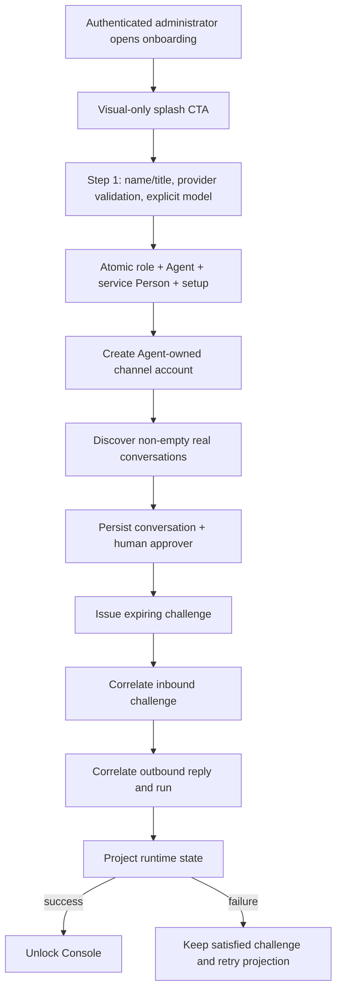

# Cold-read grill — gate: task — task plan ONBOARDING-V2-1-T1

You did NOT write what follows. Read it cold, as an adversary trying to break the handover, never as its author defending it. You are READ-ONLY: return findings, change nothing.

## Interrogation technique

Run the interrogation this way. The harness contract above is the floor; this is the technique.

---
name: grilling
description: Grill the user relentlessly about a plan, decision, or idea. Use when the user wants to stress-test their thinking, or uses any 'grill' trigger phrases.
---

Interview the user relentlessly until you reach a shared understanding. Map this as a **design tree**: every decision branches into the decisions that hang off it.

Work the tree in **rounds**. The **frontier** is every decision whose prerequisites are already settled: the questions you can ask _now_ without guessing at answers you haven't heard yet. Ask the whole frontier in one round: number each question and give your recommended answer. Then wait for the user's answers before the next round.

Format a round like so:

```
❓ **Q1** - **<question title>**: <question body, might be multiple paragraphs, including multiple choices>

➡️ <your recommended answer>

---

❓ **Q2** - **<question title>**: <question body, might be multiple paragraphs, including multiple choices>

➡️ <your recommended answer>
```

Each round the user answers reshapes the tree: settled decisions push the frontier outward and unblock questions that depended on them. Recompute the frontier and ask the next round. A question whose answer depends on another question still open in this round belongs to a _later_ round, not this one.

Finding _facts_ is your job, never the user's. When a frontier question needs a fact from the environment (filesystem, tools, etc.), dispatch a sub-agent to find it; don't ask the user for anything you could look up yourself. Don't block on it: a running exploration is an unsettled prerequisite, so only the questions downstream of it wait for the sub-agent to report; ask the rest of the frontier now. The _decisions_ are the user's: put each to them and wait.

The session is done when the frontier is empty: every branch of the design tree visited, nothing left silently assumed. Do not act on it until the user confirms you have reached a shared understanding.


## Harness grill contract

# Griller Prompt — adversarial handover interrogation

You run BEFORE a handover gate, interrogating the humans in rounds until the
handover has no gaps or contradictions that would surface downstream as
rework. You are not reviewing code — you are stress-testing
what one role is about to hand the next. The gate scripts REFUSE without
your fresh, passing record.

**Independence is the whole point.** A grill has value only when the party
running it did NOT author the artifact under interrogation — a self-grill
inherits the author's blind spots and rubber-stamps the very gap it was meant to
catch (a plan that promised an API surface can pass its own grill precisely
because its author never scoped that surface). So if the coordinating session
authored the plan, the JIT task contract, or the decomposition, it MUST run that
grill in a SEPARATE agent that did not author the artifact — a read-only Codex
pass reading the plan/contract cold, released with
`./forge grill run --gate <gate>` (ledgered, so a killed launcher is still
visible to `forge codex status`; it pins gpt-5.6-terra @ xhigh from
harness.yaml) — rather than certify its own work inline. Codex on `gpt-5.6-terra` @ xhigh
is the required cold reader for planning grills: a fresh model context fully
independent of the authoring session, and because it is read-only it never
writes, so the write-lock that gates the write companion does not apply. Do NOT
use a Claude sub-agent for the grill, and never grill your own work inline.
Interrogate as an adversary trying to break the handover, never as its author
defending it.

RELEASE IT THROUGH THE HARNESS. `./forge grill run --gate <gate>` composes the cold-read brief (this contract plus the artifact) and releases Codex through the SAME ledgered launcher a delegation uses: the pid is recorded before the wait, so a grill whose launcher is killed still shows up in `forge codex status` instead of vanishing. It is read-only, so it takes no delegation lock and can never satisfy `stage done`. Recording the gate stays yours — the cold read only returns findings.

The technique is Matt Pocock's `grilling` skill — the design tree, the
frontier, numbered questions with recommended answers. `doctor --fix` installs
it into BOTH runtimes, and `./forge grill run` also inlines it into the brief,
so a reader reaches it whether or not its runtime resolves skills. This
contract is the harness-side floor; `grilling` is the technique.

`grill-me` is the HUMAN entry point — you type `/grill-me` and it redirects to
`grilling`. It carries `disable-model-invocation: true`, so no model invokes it
and none should be told to.

WHICH RUNTIME CAN RECORD WHICH GATE — get this wrong and you will chase a
refusal you cannot satisfy. ALL SIX gates match the AskUserQuestion ledger and
are therefore CLAUDE-ONLY, each with a floor of ONE logged round: `--gate spec`,
`--gate signoff`, `--gate epics`, `--gate requirements`, `--gate plan` and
`--gate task` — the floors live in `grill_gates.GATES`, one row per gate.
`signoff` and `epics` used to sit outside that check and so recorded with ZERO
rounds behind them; they now answer to it like every other gate.

ONE round is a FLOOR, never a target. Keep going until a round comes back clean
AND the next one stays clean — a single quiet round after a noisy one is a
coincidence, not convergence. The ledger files are written ONLY by `post_tool_use.py` on a
Claude Code AskUserQuestion event; `.codex/hooks.json` registers no PostToolUse
hook, so Codex cannot produce them and neither can a subagent. Delegating a
ledger-matched grill to Codex returns a well-formed payload that the recorder
then refuses, with nothing you can do to satisfy it — the payload was never the
problem, the runtime was.

For those four ledger-matched gates, independence is a COLD READ,
not necessarily a separate process. The recorder accepts ONLY rounds that match a
logged AskUserQuestion record (`record_grill_from_json.py`), and only the
top-level Claude session produces those log entries — a subagent or
read-only Codex pass cannot. So for those grills the top-level session drives
the rounds through AskUserQuestion itself — but because the coordinating session
authored the plan, the independent cold-read pass is MANDATORY, not optional: on
EVERY round release a fresh READ-ONLY Codex pass with
`./forge grill run --gate <gate> [--task <id>]` that reads the plan/contract
cold and returns findings — never a
Claude sub-agent, never grill your own work inline — then carry ALL of those
findings into your own AskUserQuestion rounds (the recorder rejects rounds not in
the ledger, so the top-level session must still ask). Read cold, as an adversary
who did not write it.

ONE COLD READ PER GATE — put every question to the human INSIDE it. The old
shape was Codex grill → your rounds → amend → Codex grill AGAIN, looping until
clean. That loop cannot converge: a fresh reader has no memory of what the last
one found, so it returns a DIFFERENT frontier rather than a shorter one, and the
artifact you amended to close round one becomes round two's input. Stories
reached eleven, twenty-six and forty rounds that way; the last cost six hours.
`forge grill run` now REFUSES a second unconstrained read on a gate that has
already been read since its last recorded pass.

So the WHOLE grill is:

1. `./forge grill run --gate <gate>` — one cold read. WATCH it.
2. Clean? Record the pass and approve. Nothing else happens.
3. Otherwise resolve every finding the REPOSITORY answers yourself — open the
   file and settle it. Take to the human only what the repository cannot
   answer: a decision nobody has made, a priority, a tradeoff between two
   workable shapes. Put those through AskUserQuestion with your recommended
   answer first, all of them, now. There is no later round to save the hard
   ones for, and a finding is not a menu.
4. Amend the artifact ONCE, to what they decided.
5. Record the pass against the AMENDED version, then approve exactly once.

The price is stated plainly, twice over: nothing independent re-reads the
amended version, and a gap this reader misses is not caught by a second reader
at this gate. Both surface at the next gate, or in review. That is the trade
for ending a loop that was costing whole days.

If the human's answers changed the artifact's SHAPE — a component dropped, a
different approach chosen — the amended artifact is not the one that was read
in any useful sense. Say so and read again: `./forge grill run --gate <gate>
--reread "<what changed shape>"`. It is a choice with a recorded reason, not a
way around the rule, and the five-read cap still backstops it. (EVERY gate is ledger-matched — signoff and epics no
longer excepted — so no gate can be recorded by a read-only Codex grill alone:
the top-level session asks the round and records it.)

FRESH CONTEXT, AND THE ANSWERS SO FAR. Every round is a NEW read-only Codex
session — that independence is the whole point. But a reader that knows nothing
of the earlier rounds does not re-find the same gaps, it finds DIFFERENT ones,
so the rounds never shrink and the grill has no natural end. `./forge grill run`
therefore carries every question already put to the human and the answer they
chose, read from the ledger the recorder validates against.

That gives the reader two obligations: do not re-raise settled questions, and
CHECK EACH ANSWER — that the artifact honours it, and that it contradicts no
other answer, accepted decision or constitution rule. An answer can be wrong, or
right and never applied; saying so is part of the read.

Do NOT tell the reader where to concentrate. A cold read is worth having because
it is unconstrained, and steering it toward the diff is how the thing nobody
looked at survives every round. More information, no direction.

END EVERY ROUND WITH AN EXPLICIT CONVERGENCE VERDICT, on its own line, so the
coordinator never has to guess whether to grill again or approve:

- `CONVERGED — no gaps, no contradictions, plan unchanged since the last round`
- `NOT CONVERGED — <the specific reason: open gaps, a contradiction, or the plan
  changed after the last clean round>`

`CONVERGED` on the cold read means there is nothing to amend: record and
approve. `NOT CONVERGED` does NOT mean read again — it means resolve what the
repository answers, put the rest to the human, amend once, and record the pass
against the amended version. Approval happens exactly once.

Five gates, five scopes:

- `--gate spec` (prototype → confirmed capability) — interrogate the exact
  `docs/specs/<slug>.md` file against BRIEF, architecture, decisions, and the
  prototype. Hunt: behavior the prototype proved but the spec omitted,
  implementation choices masquerading as requirements, vague acceptance
  language, and conflicts with active decisions.
- `--gate signoff` (client → PM, before `record_signoff.py`) — interrogate
  `docs/product/DISCOVERY.md`, `BRIEF.md`, confirmed specs, the spec-linked
  roadmap, `docs/decisions/`, and prototype notes. Hunt: unanswered
  stakeholder/constraint questions, scope
  the client saw vs. scope the BRIEF claims, decisions that contradict the
  BRIEF, acceptance criteria that are vibes instead of checks, non-functional
  requirements nobody asked about (auth, data retention, environments).
- `--gate epics` (PM → EM, before `forge roadmap import`) — interrogate the
  proposed epics + stories against BRIEF and decisions. Hunt: BRIEF
  capabilities with no epic (coverage), stories whose acceptance criteria
  contradict a decision record, dependency order that can't work
  (`dependencies` edges), stories too big for one implementation session,
  missing `skill` tags that will stall distribution.
- `--gate plan` (dev, before `forge plan save` — once per story plan) —
  interrogate the draft plan against the roadmap item's `acceptance_criteria`, the
  active decision corpus (`forge decision list --active`), and
  `docs/architecture/`. Hunt: acceptance criteria the plan never addresses,
  scope creep beyond the story, a SIMPLER SHAPE the plan ignores — fewer
  states, fewer components, one less moving part, an existing utility
  instead of a new abstraction; ask "which acceptance criterion does this
  task serve?" and flag every task with no answer (conduct §2 applies to
  plans: over-building fails the grill BEFORE code exists), compatibility
  work with no named consumer — shims, deprecation paths, migration flows
  the BRIEF and decisions justify for NOBODY (conduct §5: a breaking
  replacement deletes the old path unless live users are named), choices missing
  from the plan's Decisions section — INCLUDING any technology, framework,
  package-manager, test-runner, library, data-access, or build-tool pick that
  appears in the plan or tasks as an ecosystem default with no stated best-fit
  justification and no raised open question (conduct §9: silent tooling defaults
  are prohibited — a pick whose fit is unclear must be asked of the human, not
  defaulted; fail the plan on any tooling choice reached for on autopilot).
  Also flag a MISSING quality-gate baseline: any codebase the plan touches must
  wire a stack-APPROPRIATE static-analysis gate — a linter AND formatter, plus a
  type-checker where the language has one — into CI/verify, not merely a test
  runner. Name the CAPABILITY, never a fixed tool: ESLint/Biome for JS-TS,
  Ruff/flake8 for Python, golangci-lint for Go, Clippy for Rust, Checkstyle/
  Spotbugs for Java, and so on — the requirement is generic to every backend, not
  one ecosystem's tool. Fail the plan when code ships with no configured lint/
  format/static-analysis gate that an automated check enforces on every push; an
  absent linter is a silent quality default exactly like an unjustified tool pick.
  Also hold the plan against the CONSTITUTION's coding standards
  (`constitution/README.md` index — read the references it maps to the plan's
  surfaces). The constitution is law, so a plan whose SHAPE omits or contradicts a
  mandated standard is a GAP, not a style preference: HTTP surfaces with no typed
  request AND response DTOs (`pnp-api-standards`, `pnp-swagger-api-documentation-
  standards`), a module ignoring the modular-monolith layout or file-suffix
  standards (`pnp-coding-standards-modular-monolith`, `03`), missing structured
  logging (`05`/`06`) or domain exception handling (`07`), an external integration
  that skips the provider/port pattern (`08`, `pnp-provider-pattern-for-
  integration`), or database work ignoring `pnp-database-standards`. Flag each and
  require the plan to conform or record a deliberate, written deviation — never
  wave it through as "the implementer will follow standards later"; a plan must not
  design AGAINST the law. (`constitution/` is on disk in every environment, so the
  read-only Codex cold-read has the law available — hold the plan to it.)
  Reconcile the plan explicitly against
  EVERY ID from `forge decision list --active`; a conflict becomes a
  contradiction signal or a superseding decision, never a silent exception.
  Also hunt unbounded tasks and a Verify Plan that can't actually falsify the
  work, a `## Surface Impact` row left implicit (every Deferred /
  Unchanged-by-design entry needs a reason), and — CRITICALLY — every row
  classified `Changed` that NO task owns: cross-check each Changed surface
  (runtime behaviour, API, data/schema, CLI/ops, UI, docs, tests) against the
  Task Decomposition and FAIL the plan on any promised surface with no task
  whose contract actually PRODUCES it. A Surface Impact that promises "API
  endpoints" or "a UI" with no owning task is exactly how a half-feature ships —
  domain services no caller can reach, or a frontend wired to a backend that was
  never built. Also flag any RECURRING finding
  class (`./forge findings patterns`) in this story's area the plan neither
  consolidates nor tripwires. In Claude Code the
  `/grill-me` skill run against the plan satisfies this contract. The payload
  carries `"issue"`; the recorder stamps it against the active task.
- `--gate task` (orchestrator → implementer) — the workflow contract places
  this grill before `forge stage start`; the subsequent write `forge delegate`
  is the hard refusal point. Interrogate the next leaf task's just-authored
  contract in the re-recorded decomposition against the approved story plan,
  active decisions, and the actual repository state left by completed prior
  stages. Hunt: assumed files or APIs that prior work did not produce, a
  `write_scope` whose AREAS miss where the work must land or reach into areas
  the task has no business in (scope is directory prefixes plus named new
  files — a missing existing file under a declared prefix, a drifted line
  number or a renamed module is a NON-BLOCKING note, never a blocking finding;
  `stage done` measures the exact paths), acceptance criteria not served by the proposed
  work, a task that OWNS a plan `## Surface Impact` surface but whose
  `write_scope`/`required_tests` do not actually PRODUCE it (owns the API row but
  builds only domain services with no HTTP controllers/DTOs/routes; owns the UI
  row but ships no components) — reachability is part of "done", not a later
  task's problem, required tests that do not prove those criteria, verify commands that
  cannot falsify the change, reviewer focus that misses the risky seam OR that
  re-states shape rules the constitution already sets instead of CITING the
  load-bearing `constitution/` references for the task (the contract points at the
  law, never re-derives or contradicts it), and a
  `user_facing` flag that misclassifies the task — a UI task left `false` (its
  mandatory design skills and design review would be skipped) or a backend task
  marked `true` (forced to attest UI design skills it has no use for).
  This is the JIT task-planning gate from decision 0032, not a repeat of the
  story-level plan grill. Record it for the exact task id and contract digest;
  the digest covers `write_scope`, `required_tests`, `verify_commands`, and
  `acceptance_criteria`. A changed field makes the old task grill stale, and a
  write delegation refuses it; read-only delegation is unaffected.

Method:

1. Read the artifacts in scope FIRST; derive your question list from actual
   text, citing it (`BRIEF.md says X; decision 0003 says Y — which wins?`).
2. Interrogate in ROUNDS until the frontier is empty — not one pass. Each
   round, put the questions whose prerequisites are already settled to the
   human (PM or EM) with your recommended answer; their answers reshape the
   tree and unblock the next round's questions. Stop a single question when it
   would only confirm what a document already states; stop the grill only when
   no gap or contradiction remains unasked. In Claude Code, deliver each
   round's frontier through the AskUserQuestion tool (recommended answer
   first), not prose. For every ledger-matched gate (`spec`, `requirements`,
   `plan`, `task`) the recorder requires
   the FINAL round in the payload to carry `"frontier_empty": true` — that flag
   is how it confirms you stopped because the frontier closed, not because you
   ran out of patience; it is set by hand on the last `rounds` entry, never by
   the ledger. A zero-gap contract still needs at least one such round (every
   gate's floor is 1, and a floor is not a target), so ask a genuine closing
   question
   (e.g. "any remaining gap before we hand off?") and mark it `frontier_empty`.
3. Every finding lands somewhere real before the verdict: a doc edit, a
   `./forge decision new <slug>` record, or an explicit non-blocking entry
   in `open_items`. An `open_items` entry that PARKS scope also gets a
   deferral row with a revisit trigger (`./forge defer add`) — parked scope
   without a trigger is scope silently dropped. Unresolved blocking
   findings ⇒ verdict `blocked`.
4. Record the outcome (schema: `factory/schemas/grill.json`,
   `"generated_by": "griller"`):

   A task-grill input uses this recorded shape (the recorder adds its own
   task id, digests, commit, and timestamps):

```json
{
  "generated_by": "griller",
  "verdict": "pass",
  "gaps": [],
  "contradictions": [],
  "resolutions": ["What was sanctioned"],
  "inspected_refs": ["path/or/path:symbol"],
  "current_flow": "What the repository does now",
  "criteria_map": {"criterion": "proof"},
  "decision": "keep",
  "new_abstractions": ["None"],
  "rounds": [{"question": "Finding or choice", "options": ["Recommended", "Alternative"], "chosen": "Recommended", "frontier_empty": true}],
  "citations": [{"finding": "Repo-answerable finding", "source": "path:symbol"}],
  "open_items": []
}
```

   Each `rounds` entry has a non-empty `question`, two to four non-empty
   string `options`, and a `chosen` value equal to one option. Each citation
   is `{finding, source}`. Every string in `gaps` must be covered by an equal
   `rounds[].question` or `citations[].finding`.

   For every gate — all six are ledger-matched — extra recorder rules bind
   (this is what makes an otherwise well-formed payload fail):
   - Rounds must match the AskUserQuestion ledger and meet the gate floor
     (1 for every gate, and a floor is not a target); the final round carries
     `"frontier_empty": true`. A
     zero-gap grill still records its floor of real rounds — never zero.
   - `--gate task` only: `criteria_map` is a THREE-WAY equality — its KEYS must
     equal the frontier task's `acceptance_criteria` set AND the set of its
     `plan_contracts[].statement` values, exactly (no extra key, none missing);
     each value is the non-empty proof for that criterion. Author the task's
     `acceptance_criteria` and its `plan_contracts` statements as the SAME
     strings so there is one coherent key set to satisfy.

```bash
python3 factory/scripts/record_grill_from_json.py --gate <spec|signoff|epics|requirements|plan|task> --input <json> [--input-digest <artifact>] [--task <id>]
```

5. For every gate except task, commit the resolution edits
   BEFORE recording the grill — those gates check freshness against BOTH
   committed history and the working tree: any guarded doc changing after the
   grill (even uncommitted) stales it. (The sign-off / epics-approved decision
   records themselves are expected afterwards and don't stale it.) The task
   gate instead binds directly to the re-recorded task contract digest; the JIT
   sequence does not require a commit between re-recording and grilling. But that
   digest still folds in the product tree, so record the task grill LAST — after
   any docs/ or factory/scripts commits: a tracked change outside .factory/ and
   plans/ that lands between grilling and `task approve`/`stage start` re-stales
   it and forces a re-grill.
6. `--input-digest` is REQUIRED for the spec, epics, and plan gates: pass the
   exact spec / roadmap input / plan draft you interrogated. The gate verifies the
   digest — grilling version A never approves an edited version B; if the
   artifact changes, re-grill it. For `--gate task`, pass `--task <id>` and NO
   `--task-digest` — that flag was removed and the recorder rejects it; the
   recorder derives the grounding digest itself from the protected contract,
   approved plan, and product tree, and stores the result at
   `.factory/grills/tasks/<id>.json`.

A `pass` with unresolved findings is refused by the recorder. Grill hard;
downstream implementation inherits whatever you let through.


## Lessons already in force for these paths

The plan must design AROUND these. A plan that ignores one is not merely unlucky later — it is wrong now, and saying so is part of this read.

- Runtime state, jobs, control events, and memory use Postgres as the production storage model; schema or repository changes need repository tests and architecture/docs updates when contracts shift.
- When replacing Postgres runtime schema in one cut, move active runtime persistence behind canonical Drizzle repositories/services in the same change; leaving schema-owned raw SQL or old table definitions creates drift and runtime failures after destructive migrations.
- Keep provider-specific and channel-specific behavior behind adapters; domain and application code should depend on stable product concepts and ports, not SDK payloads or runtime wiring.
- Risky tool execution must pass through deterministic permission evaluation and sandbox policy before any provider callback or runner grants access.
- Fleet compose rehearsal must run settings-seed through the normal Docker entrypoint so local auto-secrets are exported, and seed desired-state via the import service rather than the broad CLI bootstrap; the CLI bootstrap can close the shared runtime storage pool before settings import validation finishes. Docker-internal first-party Postgres hostnames need explicit plaintext allowance while real remote Postgres still requires sslmode=require.
- Postgres JSONB normalizes object key order and drops undefined; any equality check against persisted state (JSON.stringify ===) silently fails in prod while structuredClone-based fakes keep it green. Compare with util.isDeepStrictEqual and make repository fakes persist through a JSONB-faithful round trip (see test/unit/application/jsonb-round-trip.ts).
- T3a order that fits one Codex run: (1) schema.ts + port + repository + domain/types.ts + the shared boundary canonicalPath, then run npm run db:migrations:generate -- --name permission_decision_memory_human (NEVER hand-write the SQL or snapshot; commit what drizzle-kit emits), then npx tsc --noEmit; (2) the scope-key module and the service; (3) tests ONE FILE AT A TIME in this order — provenance, scope, service, prospective-write pin, Postgres suite — running each file right after writing it and never re-reading a finished source file. Postgres tests need the TEST database: run 'source /private/tmp/claude-501/-Users-ravikiranvemula-Workdir-myclaw/b4051e43-dbea-4d62-ba73-ae6210455474/scratchpad/pgfix-env.sh' in the same shell before vitest (it exports GANTRY_TEST_DATABASE_URL for gantry_test; the live database gantry must never be touched). Required leaf titles are exact it() names from the brief.
- The tree already holds partial T5b work (listing module, forget handler, parser, ports, four provider branches). Do NOT re-survey: read only the cited line ranges in the brief and the files you are about to edit. Order: 1 listing module + parser + session command; 2 forget handler + wiring setter + runtime-services bind; 3 audit read port + Postgres adapter + job-name hydration; 4 label carrier on both prompt paths + guidance line; 5 the four provider in-place edits; 6 tests one file at a time, running only the touched suite after each. Everything you write survives on disk across relaunches; commit nothing, finish the slice in front of you.
- Implementation and every test are committed and green; tsc passes. The ONLY remaining work is npm run check:architecture, which reports exactly: (1) channels/telegram/callback-handlers.ts 910 lines, limit 900; (2) runtime/ipc-interaction-processing.ts 866, limit 865; (3) session/session-commands.ts 742, limit 740 — trim or extract the smallest helper, no behaviour change; (4-6) app/bootstrap/runtime-group-processor-deps.ts imports adapters/storage/postgres/runtime-store, config/index and config/profiles — the layer checker treats a bootstrap file named runtime-* as runtime code: rename it to group-processor-deps.ts (update its importers) so it is judged as bootstrap, which may import adapters and config. Do not touch anything else. Finish with npm run check:architecture and npx tsc --noEmit both green.
- Together with the three quality P2s these are the ONLY changes in this round: (4) the used-by lookup runs only for the rows actually rendered (the ten newest for bare /permissions, all for /permissions all), never for every remembered record; (5) job-name hydration is ONE batched read for the collected job ids, not a serial per-record loop; (6) a provider in-place edit failure must never suppress the Forget receipt — send the confirmation reply first or independently, then attempt the edit, and pin it with a test per provider where the edit throws; (7) keep behaviour otherwise identical. Run only the touched suites; tsc and check:architecture stay green.
- Final fix cycle; change nothing else. (1) After a Forget tap the re-rendered list hydrates used-by ONLY for the rows it renders (the ten newest), same as the bare listing. (2) Job-name hydration is ONE bulk repository read for the deduplicated job ids (a single list/getMany call), not concurrent per-id reads — this also bounds /permissions all to one query. (3) Slack: when the replacement view has no buttons, clear the blocks (send an empty blocks array / text-only update) so stale buttons do not linger; pin with a test. (4) Move the 'Already forgotten.' string into the listing copy owner beside the other replies. Run only the touched suites; tsc and check:architecture stay green.
- Exactly five changes. (P1, blocking) app/bootstrap/runtime-services.ts ~line 597 binds the Forget handler's resolvePerson to resolveControlApproverPrincipal; it must resolve the tapping user to the CANONICAL DM memory person through the same path the /permissions command uses — resolveCanonicalMemoryPersonId from runtime/group-person-identity (DM-gated; a group route yields null → not_found). Pin in test/unit/bootstrap/runtime-services.test.ts that the bound resolver is the canonical one and that a group route resolves to null. (P2) used-by hydration fetches only the job ids actually referenced by the rendered rows, one bulk read, and the per-record dedup must be a single Set pass, not nested loops. (Tests) integration/permission-decision-memory.postgres.integration.test.ts: the audit test seeds apps 'app-one'/'app-two' before inserting permission_decisions rows (FK); the round-trip test passes railVersion: 4 to listHumanDecisions. Run runtime-services, forget-handler, listing suites and the Postgres suite (GANTRY_TEST_DATABASE_URL is exported); tsc and check:architecture green; ceilings measured after prettier.
- Everything else is committed and green. The only failing test is 'lists one latest use per job by human decision record id…' in the Postgres suite: the adapter's listDecisionsByHumanDecisionRecordId returns lastUsedAt as the raw Postgres text ('2026-09-04 00:00:00+00') while the port promises an ISO string ('2026-09-04T00:00:00.000Z'). Fix it in adapters/storage/postgres/repositories/domain-repositories.postgres.ts by normalising the value the way the sibling reads in that file do (e.g. new Date(value).toISOString() or the existing timestamp helper); do not change the test's expectation. You cannot reach Postgres from your sandbox — the orchestrator runs that suite; just make the change, run tsc, and finish.
- The review marked two contracts partial; close them and nothing else. (AC2) PermissionMemoryListMessageView and the list-view type live in application/permissions/permission-memory-listing.ts (the required owner) — move the type there and import it from the current location; no behaviour change. (AC5) the used-by read fetches ONLY the job ids referenced by the rendered records: collect the ids from the rows being rendered, dedupe once, and pass exactly that set to the single bulk job read; add a listing test asserting the bulk read receives only referenced ids. Run listing + forget-handler suites, tsc, check:architecture; ceilings measured after prettier.
- Orchestrator ruling (signals S-0093 and S-0094 resolved): PermissionMemoryListMessageView is DOMAIN-owned by design and stays where it is; AC2's 'listing module owns the view type' clause is superseded by the layer rule (domain must not import application) and is considered implemented. Do NOT move the type, do NOT raise a contradiction about it, do NOT edit domain/message-actions.ts. The single remaining change is AC5: in application/permissions/permission-memory-listing.ts (or the forget handler where hydration is called) collect the job ids referenced by the rows being rendered, dedupe once, and pass exactly that set to the one bulk job read; add a listing unit test asserting the bulk read receives only the referenced ids. Run the listing and forget-handler suites, tsc, check:architecture; finish.
- Exactly these changes, nothing else. (P1, blocking) app/bootstrap/runtime-services.ts ~line 601: the Forget handler's resolvePerson must canonicalise the caller in the CONVERSATION's app — derive the app id with appIdFromConversationJid(action.conversationJid) (the same value the handler later uses for the memory lookup) and pass it to resolveCanonicalMemoryPersonId instead of the process-wide runtime app id; pin with a runtime-services test where the conversation's app differs from the process app. (AC5) runtime-services.ts ~626 and app/bootstrap/group-processor-deps.ts ~87 bind a job reader that ignores the id set and lists ALL jobs; bind a by-ids read (add listJobsByIds(appId, ids) to the ops job repository port + Postgres adapter if none exists, or batch the existing getJobById) so only the referenced ids are read; pin it. (AC2) application/permissions/permission-memory-listing.ts ~155 duplicates the category-noun table; delete it and call the existing shared category-noun helper the card copy uses; add the one-job and two-job used-by cases to the listing suite beside the 3+ case. Run runtime-services, listing, forget-handler suites; tsc; check:architecture; ceilings after prettier (runtime-services ≤ 1186). You cannot reach Postgres; the orchestrator runs that lane.
- Orchestrator ruling (S-0095 resolved): do NOT add listJobsByIds or touch ops-repo.ts / the jobs Postgres adapter (out of scope). AC5 is implemented by: collect the job ids referenced by the rows being rendered (≤10 for bare /permissions; all active rows for /permissions all), dedupe once, and resolve names with ONE concurrent batch — Promise.all over getJobById for exactly that set — in the reader bound at runtime-services.ts ~626 and group-processor-deps.ts ~87; never list every job. Pin with a listing test that the reader is invoked only with the referenced ids. Do not raise a contradiction about this. Then: (P1) runtime-services.ts ~601 pass appIdFromConversationJid(action.conversationJid) into resolveCanonicalMemoryPersonId (test: conversation app ≠ process app); (AC2) delete the duplicate category-noun table at permission-memory-listing.ts ~155 and call the shared helper; add the one-job and two-job used-by cases. Run runtime-services, listing, forget-handler suites, tsc, check:architecture; ceilings after prettier.
- Orchestrator ruling (S-0097 resolved, AC2 amended): permission-memory-listing.ts OWNS the category-noun mapping (CATEGORY_NOUNS + exported permissionMemoryScopeNoun). No other noun helper exists; do not search for one, do not delete the table, do not raise a contradiction about nouns. Do exactly three things and finish: (1) P1 — runtime-services.ts ~601: pass appIdFromConversationJid(action.conversationJid) into resolveCanonicalMemoryPersonId; add a runtime-services test where the conversation's app differs from the process app. (2) AC5 — in the readers bound at runtime-services.ts ~626 and group-processor-deps.ts ~87, resolve names with one Promise.all over getJobById for the deduplicated referenced ids only (never list all jobs); test that only referenced ids are read. (3) AC5 tests — add one-job and two-job used-by cases in permission-memory-listing.test.ts beside the 3+ case. Run runtime-services, listing, forget-handler suites; tsc; check:architecture; ceilings after prettier.
- Orchestrator ruling (review round 6): MemoryForgetMessageActionInput carries the agent identity as the bounded agentRouteKey — the codec key the round-3 grill ruled because Telegram's callback payload is size-limited; the host handler resolves the route-effective agentId from it. Do NOT add an agentId field to the domain input or to any provider payload; AC4 has been amended to say so. Do not raise a contradiction about it. The single remaining change: app/bootstrap/runtime-services.ts ~line 631 — the post-Forget used-by hydration (and any used-by read the Forget handler performs) must use the CONVERSATION's app id (appIdFromConversationJid(action.conversationJid), the same value the handler already uses for the memory lookup and the person resolver), never the process-wide app id; pin it with a runtime-services test where the conversation app differs from the process app. Run runtime-services + forget-handler suites, tsc, check:architecture; ceilings after prettier (runtime-services ≤ 1186 — extract a tiny helper if needed). Finish.
- Work in this order and finish each slice before reading further; everything you write survives on disk across relaunches; commit nothing. Slice 1: NEW application/permissions/permission-judge-outage-latch.ts (pure latch: observe/reset/clearAll, keyed appId|providerAccountId|targetJid, the two exported copy strings) + NEW runtime/permission-judge-outage.ts (module-level judgeOutageLatch instance, unavailablePromptConsultResult(failureCode, startedAt) returning the full PermissionClassifierPromptConsultResult with decision 'ask', isJudgeUnavailable, sendJudgeOfflineNotice with { threadId, providerAccountId }, no-target skip, swallowed errors) + add 'wiring_missing' to the failure-code union at runtime/permission-classifier.ts:60. Slice 2: IPC — split eligibility from wiring at ipc-permission-classifier-decision.ts:361, synthetic result on wiring failure, notice call before requestPermissionApproval at :639 and :595 and before the terminal job decision, reason line, exclude Unavailable from the cache write at :502; the file is 691/700 — calls only; extract the verdict-cache helpers into the runtime glue module if needed. Slice 3: inline-agent-loop-tools.ts — split the :372 guard, notice in beforePrompt (:449-468) and before the scheduled cancel return at :410, reason line; 708/750. Slice 4: NEW latch suite, NEW glue suite, the wiring_missing case in permission-classifier.test.ts, the IPC-decision cases, the inline cases — one file at a time, run only that suite. Slice 5: harness knobs (classifierVerdict.status, sendMessage + publishRuntimeEvent spies returned from replayPermissionRequest, classifierConsult param on replayExactMemorySequence), S6 + aggregation in askfloor-tap-budget.test.ts, NEW askfloor-invariance.test.ts as an it.each table over harness fixtures with tuples copied verbatim. Test titles = required_tests ids VERBATIM. You cannot reach Postgres; the orchestrator runs that lane. Never list all jobs, never import channels/.
- Exactly six changes; product design is otherwise final. (1) inline-agent-loop-tools.ts ~422: call observeJudgeAvailabilityForRequest BEFORE the successful-allow return so an answered allow clears the latch (pin: answered allow then unavailable → notice again). (2) askfloor-tap-budget.test.ts S6 ~324: the uncovered-read case must be a READ that the rails do not cover (e.g. a file read by path OUTSIDE the trusted root, or an mcp read binding not in reviewedMcpReadBindings) — not mcp__crm__update_record — and must assert exactly one tap and one notice; add the scheduled-job case (hostJobId set, judge unavailable): notice sent once to the job conversation, decision reason = JUDGE_OFFLINE_REASON, deterministic denial + card recovery unchanged. (3) askfloor-invariance.test.ts: build the matrix from the REAL harness fixtures — one row per lane in AF-AC6: ask, auto_strict, interactive auto, trusted-host autonomous via registerWorkerPermissionRunRestriction, the projection quartet via replayRememberedJobProjection (exact match allows, near-miss cards, revoked re-cards, rails-bump re-cards — the harness has these), YOLO backstop, unmapped forced ask, scheduler_delete_job, destructive via replayDestructiveExactMemory, the family rail hit asserting FAMILY_RULE_RAIL_HIT_REASON, the inline-scheduled path through the INLINE gate (pattern of inline-agent-loop-tools.test.ts:1115/1450, not the IPC replay), attachment_open via attachmentOpenIds; expected tuples copied verbatim from askfloor-tap-budget.test.ts:26/173/233 and ipc-permission-classifier-decision.test.ts:360/385/416; the Unavailable column for the six codes + wiring_missing differs only where AF-AC5/0157 say. (4) aggregation ~356: actually run the four TB1-TB4 interactive-auto fixtures and the four mirrors (protected write, outside-workspace write, scheduler_delete_job, raw-path attach) plus S1-S6 through replayPermissionRequest and sum taps per lane. (5) runtime/permission-judge-outage.ts:133: delete the unused exported sendJudgeOfflineNotice; keep only sendJudgeOfflineNoticeForRequest and test that one. (6) REGRESSION apps/core/test/unit/application/jobperm-ask-and-wait.test.ts 'denies a job request when its permission card cannot be attached' now fails (attachRequest 0 calls): on a job lane a synthetic wiring_missing result must flow into the SAME card/attach path as a real classifier ask (0157), never a terminal decision before attach — fix the IPC resolver so that test passes unchanged. Test titles must stay the required_tests ids verbatim. Run the touched suites + that jobperm suite; tsc; check:architecture; ceilings after prettier.
- Not a defect (0158): Decision 0158 §3: the host retires the session through one atomic active->expired transition that returns the retired reference, and starts fresh from the ordinary bounded briefing. Starting fresh after the fenced retirement is the settled behaviour; acting on a LOST fence (re-reading the turn context with hydrateMemory: false and reusing the hydrated block when the generation matches) is plan item R6, assigned to T2 (cache-bug-T2 AC R6), not T1. T1-AC6 only introduces the atomic retire that returns the reference and switches the existing callers to it; T1-AC8 states no caller acts on the returned reference yet. Clearing the local resume ids after the fenced call is the pre-existing behaviour (expireProviderSession returned void) and persists no replacement handle for a foreign generation: a lost fence means the row is already non-active or the agent session was reset, so no live resumable handle is dropped, and the fresh run's handle is written by setSession under the current generation. — raised as "Honor a lost retirement before dropping the resume state (apps/core/src/runtime/group-agent-runner.ts:394): The return value from the fenced retirement is disca"
- Not a defect (0158): Decision 0158 §3: the host retires the session through one atomic active->expired transition that returns the retired reference, and starts fresh from the ordinary bounded briefing. Starting fresh after the fenced retirement is the settled behaviour; acting on a LOST fence (re-reading the turn context with hydrateMemory: false and reusing the hydrated block when the generation matches) is plan item R6, assigned to T2 (cache-bug-T2 AC R6), not T1. T1-AC6 only introduces the atomic retire that returns the reference and switches the existing callers to it; T1-AC8 states no caller acts on the returned reference yet. Clearing the local resume ids after the fenced call is the pre-existing behaviour (expireProviderSession returned void) and persists no replacement handle for a foreign generation: a lost fence means the row is already non-active or the agent session was reset, so no live resumable handle is dropped, and the fresh run's handle is written by setSession under the current generation. — raised as "[P1] Handle a lost retirement transition before discarding the resumed session (apps/core/src/runtime/group-agent-runner.ts:394): `retireProviderSession` return"
- Not a defect (0158): Decision 0158 §3: the host retires the session through one atomic active->expired transition that returns the retired reference, and starts fresh from the ordinary bounded briefing. Starting fresh after the fenced retirement is the settled behaviour; acting on a LOST fence (re-reading the turn context with hydrateMemory: false and reusing the hydrated block when the generation matches) is plan item R6, assigned to T2 (cache-bug-T2 AC R6), not T1. T1-AC6 only introduces the atomic retire that returns the reference and switches the existing callers to it; T1-AC8 states no caller acts on the returned reference yet. Clearing the local resume ids after the fenced call is the pre-existing behaviour (expireProviderSession returned void) and persists no replacement handle for a foreign generation: a lost fence means the row is already non-active or the agent session was reset, so no live resumable handle is dropped, and the fresh run's handle is written by setSession under the current generation. — raised as "[P1] Honor a lost fenced retirement before creating a replacement session (apps/core/src/runtime/group-agent-runner.ts:396): The return value from the generatio"
- Not a defect (0159): Decision 0159 §3 settles resetScope as the /new path that removes the provider-session rows of the sessions in the caller's scope and returns the retired references; T1 only changed its return type (T1-AC8) and relocated it. The scope key already confines the reset to one conversation scope and its thread-variant descendants (apps/core/src/cli/group.ts comment above deleteSession), so omitting the agent predicate when no route owner resolves cannot touch another conversation. Sessions created without a conversation install have no route owner by design (CLI reset, integration fixture); adding a stop guard fails the existing 'resetScope returns the retired references' Postgres integration test. Pre-existing behaviour in base f83779ce7 canonical-session-repository.postgres.ts resetScope, unchanged by this task (T1-AC10). — raised as "Return early when no owning agent route can be resolved (apps/core/src/adapters/storage/postgres/repositories/canonical-session-repository-context-mark.postgres"
- Not a defect (0159): Decision 0159 §3 settles resetScope as the /new path that removes the provider-session rows of the sessions in the caller's scope and returns the retired references; T1 only changed its return type (T1-AC8) and relocated it. The scope key already confines the reset to one conversation scope and its thread-variant descendants (apps/core/src/cli/group.ts comment above deleteSession), so omitting the agent predicate when no route owner resolves cannot touch another conversation. Sessions created without a conversation install have no route owner by design (CLI reset, integration fixture); adding a stop guard fails the existing 'resetScope returns the retired references' Postgres integration test. Pre-existing behaviour in base f83779ce7 canonical-session-repository.postgres.ts resetScope, unchanged by this task (T1-AC10). — raised as "[P1] Fail closed when the conversation has no resolved owner (apps/core/src/adapters/storage/postgres/repositories/canonical-session-repository-context-mark.pos"

## The contract as recorded (authoritative over any copy in the plan)

## Contract (recorded)

Rendered by the harness from the recorded decomposition; edit the decomposition, not this block. It is excluded from the plan's approval and grill digests, so a re-render never stales either.

**Objective.** From the Forge task worktree based on current origin/main, transplant the pinned product delta 97ded374637fd12b92dc05dbc2e482bd23035109..31bc4cf0740fdaad87482ba1a0c84fa1212c9fad, hydrate its governing documents from planning commit 829500087, correct the recorded safety defects, generate one current-schema migration, and leave local PR-ready evidence without pushing or opening a PR.

**Acceptance criteria**

- The task worktree hydrates decisions 0162 and 0163, both V2 specifications, and the V2 HTML reference from planning commit 829500087; the reference has SHA-256 c1dc1305abd4876f74ac7b0c8e097205c891b3478fb3ab7f7db1ec6f72259a45, and feat/v2-onboarding remains untouched.
- The splash and all four onboarding steps conform to the immutable V2 reference in light and dark themes, saved and system reduced-motion modes, and 1920x956, 1469x800, 1280x800, 1024x768, 768x1024, and 375x812 viewports, with only documented deterministic masks.
- The same-origin browser onboarding facade requires administrator session auth, trusted Origin, CSRF, and hosted recent reauthentication; rejects Bearer credentials and automatic mutation replay; sends no-store responses; uses the repository browser error envelope documented in OpenAPI with x-gantry-browser-auth; and keeps browser, audit, and error projections secret-free.
- The focused onboarding application service atomically creates the custom role, Agent, service Person, desired-state revision, audit event, and resumable setup; one setup exists per app, explicit retry reuses its idempotency key, a changed payload conflicts, and upstream changes invalidate only dependent progress.
- Model setup accepts only the exact agentHarness values auto, anthropic_sdk, and deepagents and only compatible credential modes; a candidate is verified through the shared model-provider preflight before persistence, failed candidates preserve a prior healthy credential, models stay unavailable until validation, and successful secret inputs clear.
- Channel setup stores only runtime-owned gantry-secret references, supports the existing direct, env:, and aws-sm: reference modes when policy permits, returns a typed policy-disabled result otherwise, never projects channel secrets into agent capability secrets, and requires non-empty real conversation discovery before completion.
- Provider selection is deterministic from live capability and provider support, Slack is preselected only when supported, Teams remains setup-only, provider accounts are Agent-owned with service-Person projection, direct-message approvers derive automatically from the counterpart, and group approvers require the recognized installer or validated manual membership.
- The verification challenge persists account, conversation, canonical thread, code, inbound message, outbound message, and onboarding run identity; the run identity is carried through outbound send metadata and its persisted projection; expiry, replay, account/conversation/thread/code mismatch, outbound-before-inbound, and projection failure are typed, and projection retry preserves a satisfied challenge.
- Exactly one generator-produced current-schema pre-release migration and snapshot covers resumable setup, verification correlation, provider-account correlation, constraints, and indexes; lifecycle tables use UUID row identifiers and actor/timestamp audit fields, archive migration history is excluded, the migration is regenerated from a clean baseline, and the migration directory remains clean afterward.
- The adopted web implementation preserves current-main package metadata including Node >=24 <25, uses repository primitives and Tailwind where appropriate, and splits the oversized onboarding route and workspace modules at real responsibility boundaries so route/page modules remain below 300 lines.
- Focused browser, model, provider, lifecycle, OpenAPI, migration, and visual tests cover idempotency conflict, invalidation, service-Person ownership, harness values, secret modes, empty discovery, provider fallback, Teams setup-only behavior, DM/group rules, expiry/replay/mismatch, run and thread correlation, projection retry, migration journal integrity, immutable reference hash, and Console gating.
- Lint, formatting, type checks, web and runtime builds, disposable-Postgres proof, deterministic Forge verification, one three-lens autoreview with motion review, and a rebuilt-runtime functional check of healthz, readyz, and ui/onboarding are recorded before the user-held PR handoff; live Slack tenant proof remains release-only.

**Write scope** (what `stage done` measures the diff against)

- apps/core/src/adapters/llm/
- apps/core/src/adapters/storage/postgres/repositories/
- apps/core/src/adapters/storage/postgres/schema/
- apps/core/src/application/model-credentials/
- apps/core/src/application/onboarding/
- apps/core/src/application/provider-conversations/
- apps/core/src/app/bootstrap/
- apps/core/src/channels/
- apps/core/src/cli/
- apps/core/src/control/server/
- apps/core/src/domain/
- apps/core/src/runtime/
- apps/core/test/
- apps/web/
- docs/architecture/agent-runtime.md
- docs/architecture/channel-interactions.md
- docs/architecture/credential-management.md
- docs/architecture/web-ui-foundation.md
- docs/decisions/0162-onboarding-v2-legacy-adoption.md
- docs/decisions/0163-onboarding-v2-migration-baseline.md
- docs/operations/
- docs/reference/onboarding/
- docs/specs/v2-first-agent-onboarding.md
- docs/specs/v2-first-agent-onboarding-visual-contract.md
- package-lock.json

**Required tests** (run by `stage done`)

- `enforces the complete same-origin onboarding boundary and documents browser auth` -- `npx vitest run -c vitest.unit.config.ts {path} -t {id} --reporter=default --reporter=junit --outputFile.junit={report}` (apps/core/test/unit/control/server/browser-onboarding.test.ts)
- `validates candidates before persistence and preserves a healthy credential on failure` -- `npx vitest run -c vitest.unit.config.ts {path} -t {id} --reporter=default --reporter=junit --outputFile.junit={report}` (apps/core/test/unit/control/server/browser-onboarding.test.ts)
- `accepts only auto anthropic_sdk and deepagents with compatible providers` -- `npx vitest run -c vitest.unit.config.ts {path} -t {id} --reporter=default --reporter=junit --outputFile.junit={report}` (apps/core/test/unit/control/server/browser-onboarding.test.ts)
- `keeps channel credentials runtime owned across direct reference and policy disabled modes` -- `npx vitest run -c vitest.unit.config.ts {path} -t {id} --reporter=default --reporter=junit --outputFile.junit={report}` (apps/core/test/unit/control/server/browser-onboarding.test.ts)
- `does not complete discovery when no supported conversations are returned` -- `npx vitest run -c vitest.unit.config.ts {path} -t {id} --reporter=default --reporter=junit --outputFile.junit={report}` (apps/core/test/unit/control/server/browser-onboarding.test.ts)
- `selects supported providers deterministically and leaves Teams setup only` -- `npx vitest run -c vitest.unit.config.ts {path} -t {id} --reporter=default --reporter=junit --outputFile.junit={report}` (apps/core/test/unit/control/server/browser-onboarding.test.ts)
- `creates one resumable setup and conflicts on changed idempotent replay` -- `npx vitest run -c vitest.integration.postgres.config.ts {path} -t {id} --reporter=default --reporter=junit --outputFile.junit={report}` (apps/core/test/integration/onboarding-verification.postgres.integration.test.ts)
- `invalidates only downstream onboarding progress` -- `npx vitest run -c vitest.integration.postgres.config.ts {path} -t {id} --reporter=default --reporter=junit --outputFile.junit={report}` (apps/core/test/integration/onboarding-verification.postgres.integration.test.ts)
- `assigns direct and group approvers from the correct provider identities` -- `npx vitest run -c vitest.integration.postgres.config.ts {path} -t {id} --reporter=default --reporter=junit --outputFile.junit={report}` (apps/core/test/integration/onboarding-verification.postgres.integration.test.ts)
- `correlates account conversation thread code messages and run before projection` -- `npx vitest run -c vitest.integration.postgres.config.ts {path} -t {id} --reporter=default --reporter=junit --outputFile.junit={report}` (apps/core/test/integration/onboarding-verification.postgres.integration.test.ts)
- `preserves a satisfied challenge while projection retries` -- `npx vitest run -c vitest.integration.postgres.config.ts {path} -t {id} --reporter=default --reporter=junit --outputFile.junit={report}` (apps/core/test/integration/onboarding-verification.postgres.integration.test.ts)
- `keeps the single generated onboarding migration in journal order` -- `npx vitest run -c vitest.unit.config.ts {path} -t {id} --reporter=default --reporter=junit --outputFile.junit={report}` (apps/core/test/unit/storage/postgres-migration-journal.test.ts)
- `keeps models locked until compatible credentials validate and clears successful drafts` -- `npx vitest run -c apps/web/vitest.config.ts --root . {path} -t {id} --reporter=default --reporter=junit --outputFile.junit={report}` (apps/web/src/features/onboarding/onboarding-model-setup.test.ts)
- `keeps Console handoff locked until exact verification and projection complete` -- `npx vitest run -c apps/web/vitest.config.ts --root . {path} -t {id} --reporter=default --reporter=junit --outputFile.junit={report}` (apps/web/src/onboarding-step-one.test.ts)
- `matches the immutable V2 reference outside documented masks at all required viewports` -- `npx vitest run -c apps/web/vitest.config.ts --root . {path} -t {id} --reporter=default --reporter=junit --outputFile.junit={report}` (apps/web/src/onboarding-visual-acceptance.test.ts)

**Verify commands**

- `npm run db:migrations:generate`
- `git diff --exit-code -- apps/core/src/adapters/storage/postgres/schema/migrations`
- `npm run db:migrations:check`
- `npm run lint:changed`
- `npm run lint:web`
- `npm run format:check`
- `npm run format:check:web`
- `npm run typecheck`
- `npm run typecheck:web`
- `npm run check:architecture`
- `npm run build:web`
- `npm run build:runtime`

**Review budget.** 90 files / 50000 lines -- Decision 0162 authorizes one interleaved legacy-adoption task. The pinned archive contains 62 product files and 5521 handwritten changed lines before one generator-owned Drizzle snapshot; the added allowance covers real UI module boundaries, shared provider seams, governing documents, and focused tests without authorizing unrelated scope.

## Already answered on this story — verify, do not re-ask

These questions were put to the human and answered. Two obligations:

1. Do NOT raise them again as open questions. They are settled.
2. DO check each answer still holds — that the artifact actually honours it, and that it does not contradict another answer, an accepted decision, or the constitution. An answer can be wrong, or right and never applied. Saying so is part of this read.

- Q: SELF-1 — when an AI employee proposes a change to itself, what is the default for a new agent?
  A: Review-only by default; owner opts specific classes into auto-apply (Recommended)
- Q: INCIDENT-1 — what does `freeze` do to work already in flight?
  A: Soft by default: no new runs or tool calls, in-flight turns finish; `--hard` cancels immediately (Recommended)
- Q: ADMIN-ALERT-1 — where do admin alerts go in V1.0?
  A: One Teams/Slack conversation only (Recommended)
- Q: OPS-DR-1 — where do backups go?
  A: S3-compatible bucket or local path, operator's choice (Recommended)
- Q: LIFECYCLE-1 — default retention when the operator sets nothing?
  A: Messages 90 days, memory until offboarding, audit 400 days minimum (Recommended)
- Q: INTRO-1 — when does the intro card post in a channel?
  A: Once, on install, plus on first @mention by any new person (Recommended)
- Q: REVISION-1 — who can restore a prior persona/access revision?
  A: Owner for persona; administrator for access (Recommended)
- Q: Anything else to settle before I confirm these eleven specs and open the PR?
  A: No — confirm and open the PR (Recommended)
- Q: Which change should the artifact reflect?
  A: The new task-level loop from PR 443 (story → tasks → task plan in plan mode → task grill)
- Q: If the job card itself can't be created for a request (DB down, no group route), what should the run get?
  A: Deny the tool call with a plain reason (Recommended)
- Q: Anything else to settle for JOBPERM-2 before I confirm the spec and plan it?
  A: No — confirm and plan (Recommended)
- Q: Should attaching a skill remain separate from authorizing its declared actions?
  A: Keep separate (Recommended)
- Q: The independent cold read found no contradictions. Is the current Skills UI spec ready to confirm?
  A: Confirm spec (Recommended)
- Q: Reviewers want a ~2-minute demo right after the problem statement. What anchor can you actually deliver on stage?
  A: Live Telegram demo (Recommended)
- Q: Srix: title and talk didn't match; the strong anchor is "OpenClaw, but for the org". What's the new title direction?
  A: OpenClaw-anchored (Recommended)
- Q: Where do I build the rewritten deck?
  A: Update same design canvas (Recommended)
- Q: Should re-enabling a disabled provider preserve omitted stored fields through the existing sparse PATCH flow?
  A: Preserve via PATCH (Recommended)
- Q: Should first setup prevent saving or constructing a request until a multi-method provider’s authentication method is explicitly selected?
  A: Require selection (Recommended)
- Q: Adopt the complete amended task contract?
  A: Yes (Recommended)
- Q: Is any ONBOARDING-V2-1-T1 grill finding still open?
  A: No open findings (Recommended)

## The artifact under interrogation (task plan ONBOARDING-V2-1-T1)

---
decisions_reviewed:
  - 0000-credential-broker-boundary
  - 0001-agent-runtime-platform
  - 0002-symphony-forge-adoption
  - 0003-early-stage-no-backcompat
  - 0004-gantry-naming-and-public-repo
  - 0005-runtime-stack
  - 0006-config-secret-source-boundary
  - 0007-settings-runtime-truth
  - 0008-storage-backend-cutover
  - 0009-canonical-domain-schema-cutover
  - 0010-claude-runtime-materialization
  - 0011-provider-session-artifact-store
  - 0012-browser-capability-boundary
  - 0013-runtime-event-exchange
  - 0014-external-ingress-vs-outbound-webhooks
  - 0015-model-catalog-and-cache-accounting
  - 0016-event-bus-outbox-boundary
  - 0017-jsonb-runtime-payload-boundary
  - 0018-provider-neutral-agent-execution-adapter
  - 0019-simple-permission-and-job-tool-lifecycle
  - 0020-mcp-source-vs-action-capability
  - 0021-capability-artifacts
  - 0022-delivery-vehicle
  - 0023-deployment-modes
  - 0024-locked-preset
  - 0025-settings-authority
  - 0027-process-roles-and-multi-live
  - 0028-agent-harness-selection
  - 0029-agent-communication-reaction-binding
  - 0030-agent-communication-reasoning-safety
  - 0031-send-message-files-authority
  - 0032-signed-artifact-links-deferred
  - 0033-teams-reactions-deferred
  - 0034-client-signoff
  - 0035-epics-approved
  - 0040-permission-execution-two-axis-model
  - 0041-client-signoff
  - 0042-decision-view-16k-prefix-stripped
  - 0043-classifier-risk-only-engine-authz
  - 0044-ci-runner-isolation
  - 0045-inbound-attachment-descriptor-writer
  - 0046-llm-process-local-admission
  - 0050-agent-removal-projection-cleanup
  - 0051-client-signoff
  - 0052-birthright-self-surface
  - 0053-permission-no-timeout-interactive
  - 0054-decision-provenance-and-risk-label
  - 0055-client-signoff
  - 0056-durable-cancellation-invariant
  - 0057-arch1-client-signoff
  - 0058-readonly-scheduler-birthright
  - 0062-perm6-client-signoff
  - 0063-perm7-client-signoff
  - 0064-client-signoff
  - 0065-perm8-client-signoff
  - 0066-race-1-skill-artifact-app-isolation
  - 0067-client-signoff
  - 0068-race-2-cluster-fenced-settings-projection
  - 0069-client-signoff
  - 0070-client-signoff
  - 0071-race-4-browser-profile-lock-aba
  - 0072-client-signoff
  - 0073-race-6-profile-mirror-version-guard
  - 0074-race-8-mandatory-atomic-async-admission
  - 0075-race-9-serialize-file-backed-settings-write
  - 0076-client-signoff
  - 0077-race-5-lease-loss-lifecycle
  - 0078-lat-3a-single-memory-hydration-per-turn
  - 0079-client-signoff
  - 0080-lat-3b-retain-authoritative-second-fetch
  - 0081-client-signoff
  - 0082-fence-1-durable-lease-generation
  - 0083-conv-001-client-signoff
  - 0084-client-signoff
  - 0085-lat-4a-fused-inbound-envelope-transaction
  - 0086-client-signoff
  - 0087-lat-5-durable-provider-history-coverage
  - 0088-client-signoff
  - 0089-thread-turns-read-channel-context
  - 0090-sender-allowlist-trigger-only
  - 0091-client-signoff
  - 0092-client-signoff
  - 0093-client-signoff-is-a-pinned-project-gate
  - 0094-conversation-file-trust-program
  - 0095-client-signoff
  - 0096-thread-recency-message-timestamp
  - 0097-public-session-conversation-aggregate
  - 0098-streamed-message-projection-timing
  - 0099-rate-limits-singleton-authority
  - 0100-mig-1-client-signoff
  - 0101-oidc-generic-google-first
  - 0102-runtime-hardening-audit-harvest
  - 0103-live-admission-terminal-retention
  - 0104-co-1-recovery-intent-reframe
  - 0105-physical-attachment-workspace-handoff
  - 0106-scheduled-runs-cannot-mutate-jobs
  - 0107-typed-permission-decision-provenance
  - 0108-job-definition-revision-fencing
  - 0109-semantic-capability-job-dependencies
  - 0110-live-ux-capability-dispatcher
  - 0112-legacy-single-canonical-shape
  - 0113-enforce-no-backcompat-architecture-check
  - 0114-canonical-job-owner
  - 0115-autonomous-tool-denial-terminal
  - 0117-scheduled-job-declare-tools-at-creation
  - 0118-identity-scoped-approval-and-grants
  - 0119-provider-neutral-group-approver-bootstrap
  - 0120-local-cli-structured-invocation
  - 0122-capability-template-amendment
  - 0123-recovery-proposal-birthright
  - 0124-bounded-durable-card-delivery
  - 0125-host-only-template-amendment
  - 0126-typed-terminal-denial-event
  - 0127-tagged-setup-action-model
  - 0128-permission-approval-result
  - 0129-capsafe-local-cli-terminal-wildcard
  - 0130-capsafe-capability-run-dispatch-only
  - 0132-adaptive-browser-authentication-access
  - 0133-gantry-tool-correlation-response-meta
  - 0134-autonomous-compound-runcommand-leaf-authorization
  - 0135-browser-model-provider-credential-facade
  - 0136-voice-as-provider-adapter
  - 0137-connector-accounts-mirror-provider-accounts
  - 0138-agents-are-service-kind-persons
  - 0142-third-console-role-approver
  - 0143-browser-write-only-secret-ingest
  - 0144-autonomous-ask-and-wait-chat-parity
  - 0151-browser-navigation-summary
  - 0153-learned-decisions-project-into-job-grants
  - 0154-human-decision-memory-generic-scope
  - 0155-default-allow-gantry-tools-interactive-auto
  - 0156-ai-employee-console-resumable-deployment
  - 0157-jobs-use-the-chat-permission-ladder
  - 0158-provider-session-context-ceiling
  - 0159-adapter-session-release-port
  - 0160-physical-column-naming-is-snake-case
  - 0161-granted-capabilities-must-be-discoverable
  - 0162-onboarding-v2-legacy-adoption
  - 0163-onboarding-v2-migration-baseline
---

# ONBOARDING-V2-1-T1 — Adopt and harden the complete V2 onboarding flow

## Problem

The approved V2 onboarding experience exists only on local archive `feat/v2-onboarding` and predates current Forge delivery. Its final product tree must be adopted from base `97ded374637fd12b92dc05dbc2e482bd23035109` through inspected tip `31bc4cf0740fdaad87482ba1a0c84fa1212c9fad`, but its intermediate migrations and several readiness/security defects cannot ship.

## Scope / Non-goals

Transplant the pinned product delta into the Forge-created task worktree from current `origin/main`; exclude archive `.factory/**` and all archive migration SQL/journal/snapshots. Hydrate decisions 0162/0163, the confirmed specifications, and the immutable HTML reference from planning commit `829500087`, verifying its SHA-256 before implementation. Preserve current-main overlaps, including the exact Node `>=24 <25` range. Add the focused application owner, shared credential/discovery seams, complete browser/OpenAPI safety contract, one generated migration, required hardening, product tests, deterministic visual proof, review, and rebuilt-runtime evidence.

Do not modify Factory scripts/tests, rewrite or push the archive, redesign Console, add transports, fabricate readiness, change public SDK/CLI contracts, add compatibility schema, push/open the task PR, or mark shipped. The user holds the PR command. Only Slack live tenant proof remains a release gate.

## Acceptance Criteria

- The task worktree hydrates decisions 0162 and 0163, both V2 specifications, and the V2 HTML reference from planning commit `829500087`; the reference SHA-256 is `c1dc1305abd4876f74ac7b0c8e097205c891b3478fb3ab7f7db1ec6f72259a45`, and `feat/v2-onboarding` remains untouched.
- The splash and all four onboarding steps conform to the immutable V2 reference in light and dark themes, saved and system reduced-motion modes, and `1920x956`, `1469x800`, `1280x800`, `1024x768`, `768x1024`, and `375x812` viewports, with only documented deterministic masks.
- The same-origin browser onboarding facade requires administrator session auth, trusted Origin, CSRF, and hosted recent reauthentication; rejects Bearer credentials and automatic mutation replay; sends `no-store`; uses the repository browser error envelope documented in OpenAPI with `x-gantry-browser-auth`; and keeps browser, audit, and error projections secret-free.
- The focused onboarding application service atomically creates the custom role, Agent, service Person, desired-state revision, audit event, and resumable setup; one setup exists per app, explicit retry reuses its idempotency key, a changed payload conflicts, and upstream changes invalidate only dependent progress.
- Model setup accepts only `auto`, `anthropic_sdk`, and `deepagents` for `agentHarness` and only compatible credential modes; a candidate is verified through shared model-provider preflight before persistence, failed candidates preserve a prior healthy credential, models stay unavailable until validation, and successful secret inputs clear.
- Channel setup stores only runtime-owned `gantry-secret:` references, supports existing direct, `env:`, and `aws-sm:` modes when policy permits, returns a typed policy-disabled result otherwise, never projects channel secrets into agent capability secrets, and requires non-empty real discovery before completion.
- Provider selection is deterministic from live capability/provider support, Slack is preselected only when supported, Teams remains setup-only, provider accounts are Agent-owned with service-Person projection, direct-message approvers derive automatically from the counterpart, and group approvers require the recognized installer or validated manual membership.
- The verification challenge persists account, conversation, canonical thread, code, inbound message, outbound message, and onboarding run identity; run identity is carried through outbound send metadata and persisted projection; expiry, replay, account/conversation/thread/code mismatch, outbound-before-inbound, and projection failure are typed, and projection retry preserves a satisfied challenge.
- Exactly one generator-produced current-schema pre-release migration and snapshot covers setup, verification and provider-account correlation, constraints, and indexes; lifecycle tables use UUID row identifiers plus actor/timestamp audit fields, archive migration history is excluded, the migration is regenerated from a clean baseline, and the migration directory remains clean afterward.
- The adopted web implementation preserves current-main package metadata including Node `>=24 <25`, uses repository primitives and Tailwind where appropriate, and splits the oversized onboarding route and workspace modules at real responsibility boundaries so route/page modules remain below 300 lines.
- Focused tests cover browser/model/provider/lifecycle/OpenAPI/migration/visual contracts, including replay conflict, invalidation, service-Person ownership, harness values, secret modes, empty discovery, provider fallback, Teams setup-only, DM/group rules, expiry/replay/mismatch, run/thread correlation, projection retry, journal integrity, immutable reference hash, and Console gating.
- Lint, formatting, type checks, web/runtime builds, disposable-Postgres proof, Forge verification, one three-lens autoreview with motion review, and a rebuilt-runtime check of `/healthz`, `/readyz`, and `/ui/onboarding` are recorded before the user-held PR handoff; live Slack tenant proof remains release-only.

## Technical Approach

1. Hydrate governing docs from commit `829500087`; assert the HTML reference hash, then apply only the pinned archive product tree. Resolve `apps/web/package.json`, `package-lock.json`, schema exports, and the journal toward current main, preserving Node `>=24 <25`.
2. Add a focused application onboarding service as atomic owner of custom role, Agent, service Person, first config revision, audit event, unique setup, dependent revision, and idempotency result. Its Postgres adapter executes one transaction; HTTP maps typed DTOs/errors only.
3. Enforce the browser boundary and document browser routes with `x-gantry-browser-auth`; keep their existing nested browser error envelope as the repository-specific same-origin facade contract rather than pretending they use Bearer/public-API envelopes.
4. Validate complete model credential candidates through existing model-provider preflight before persistence, including exact harness values and compatibility. Preserve a healthy stored credential on failure and clear successful browser drafts. Store channel credentials only as runtime-owned `gantry-secret:` references, supporting current direct/reference modes and typed policy refusal.
5. Select providers from live capabilities deterministically, keep Teams setup-only, refuse empty discovery, create Agent-owned accounts/service-Person aliases, auto-derive DM approvers, and validate group installer/manual membership.
6. Extend the existing outbound send options and durable message projection with onboarding `runId`; persist exact account/conversation/canonical-thread/code/inbound/outbound/run correlation and retain a satisfied challenge across projection retry.
7. Generate one Drizzle migration from the current schema with UUID row identifiers, actor/timestamp audit fields, snake_case physical columns, foreign keys, partial active uniqueness, and expiry/correlation indexes. Regenerate from clean baseline and require a clean migration diff after generation.
8. Keep the splash visual-only and move identity into Step 1. Refactor the existing Step 1 model card into one fixed-height V2 split shell: a left pane for the static mark, editable name/title, and ordered live provider list; a right pane for the selected provider’s write-only credential workflow, validation, connected state, and model selector. Reuse the existing provider data, Iconify marks, controller, and browser facades. Provider changes clear unsaved secrets, validation, model, and readiness; a green Connected pill belongs only to the selected provider after actual validation. Lock identity after the durable setup succeeds, and enable Continue only after that saved, validated, explicitly modeled state. Use Tailwind for local layout/state and retain stylesheet rules only for shared responsive and scrolling precision.
9. Add focused Vitest/Postgres proof and a Playwright Core plus browser-Canvas visual oracle against the hashed HTML. Include `375x812`, wait for local fonts, freeze named frames, mask only listed intentional deviations, and fail on every other pixel; also check keyboard focus, labels, contrast, responsive states, and 200 percent zoom.
10. Rebuild/restart runtime, retain logs/listener evidence, prove `/healthz`, `/readyz`, and `/ui/onboarding`, then execute the full browser flow. Record evidence through Forge and stop before push/PR.

## Decisions

Decision 0162 authorizes the one-task legacy exception and a 90-file/50,000-line review budget. Decision 0163 requires one generated pre-release baseline. Decisions 0000, 0006, 0135, and 0143 govern secret separation/write-only ingestion; 0028 fixes `agentHarness`; 0118/0119 fix DM/group approvers; 0132, 0138, 0142, and 0156 govern browser access, identity, roles, and readiness. Browser onboarding remains an internal same-origin facade with its existing safe envelope and explicit OpenAPI auth extension. The new onboarding lifecycle tables follow the constitution's UUID and actor/timestamp rules rather than claiming a technical-table exemption.

The V2 HTML owns visual primitives. The confirmed spec, visual-contract deviation list, and active safety decisions own behavior. No new decision is introduced.

## Surface Impact

| Surface | Classification | Reason |
| --- | --- | --- |
| Runtime behavior | Changed | Durable setup, invalidation, real discovery, correlation, projection, and Console gates. |
| API | Changed | Protected browser onboarding and Slack-manifest routes plus safe OpenAPI documentation. |
| Data/schema | Changed | One generated setup/idempotency/verification migration. |
| CLI/ops | Unchanged by design | Browser-only flow; runtime build/restart commands are reused. |
| UI | Changed | Splash, rail, four steps, themes, motion, responsive states, drawers, and global toasts. |
| Docs | Changed | Governing decisions/specs/reference are hydrated; credential, channel, runtime, web UI, and Slack operations ownership stay aligned. |
| Tests | Changed | Core/web/Postgres/visual product proof plus recorded review/functional evidence. |
| Factory scripts/tests | Unchanged by design | Forge is consumed, never modified. |
| SDK/contracts | Unchanged by design | No public API, SDK, CLI, or provider protocol change. |

## Task Decomposition

One task, `ONBOARDING-V2-1-T1`, `user_facing: true`. Decision 0162 is the story-only exception to normal backend/frontend separation. Review budget is 90 files and 50,000 changed lines because the pinned archive has 62 product files/5,521 handwritten lines before one generated snapshot, and hardening adds shared provider seams, UI module boundaries, governing docs, and focused tests. Forge's twice-budget hard stop remains.

## Risks

- Selective transplant can regress current main: inspect every overlap and keep main's package/journal/route ownership.
- Candidate credentials can destroy healthy state or leak: validate before commit, preserve failures, clear browser drafts, and assert response/log/audit redaction.
- Readiness can be fabricated by ordering bugs: persist and test every negative transition, exact correlation, and projection retry.
- Generated metadata is large: accept exactly one generator-owned snapshot and no archive history or manual edits.
- Visual checks can flake: pin browser inputs, use local fonts, named frames, documented masks, and deterministic Canvas comparisons.
- The legacy task is broad: keep the pinned source boundary, small cohesive commits, explicit budget, required tests, and one three-lens review.

## Verify Plan

- Run each required-test contract from the protected decomposition with fresh JUnit output.
- Run focused onboarding web/core suites plus the schema-isolated Postgres lifecycle suite.
- Generate migrations, assert the migration directory remains clean, then run the migration-history check, root/web lint and format checks, root/web type checks, architecture check, web build, and runtime build.
- Run the deterministic visual oracle at `1920x956`, `1469x800`, `1280x800`, `1024x768`, `768x1024`, and `375x812` for dark/light, motion/reduced-motion, named frames, keyboard/labels/contrast, and 200 percent zoom; verify the reference hash first.
- Run `python3 factory/scripts/verify.py`.
- Run one direct autoreview pass covering quality, performance, and security, plus animation review; resolve and reverify every blocking finding.
- Rebuild/restart local runtime and prove listener/logs, `/healthz`, `/readyz`, `/ui/onboarding`, and the full authenticated flow through Console.

## Workflow



## Manual Verification

1. Start from a clean disposable database and authenticate as administrator. Confirm the V2 splash is visual-only and its CTA opens Step 1. Confirm blank name/title reveal inline errors only after Save is pressed and no browser mutation occurs.
2. Verify exact light/dark splash and Steps 1–4 at every named viewport. Check the fixed 266px rail, centered KnackLabs lockup, SVG state progression, focus rings, card/accordion scrolling, always-visible footer navigation, and mobile block.
3. Toggle saved reduced motion and system reduced motion separately. Confirm motion runs by default, mark/role/rail/transition sequences match named frames, and movement stops or becomes the specified fade without hiding state.
4. Exercise each allowed model provider/auth mode, including Bedrock variants. Confirm the Step 1 split card keeps a 50dvh desktop/tablet shell with independent pane scrolling and mobile document scrolling; the selected provider alone receives the green Connected pill after validation. Confirm models remain locked/loading until validation, a failed candidate retains the prior healthy credential, successful secrets disappear from browser inputs/state, explicit model choice is required, Save locks identity after durable creation, and Back/Continue resume without revalidation when inputs did not change.
5. In Slack Step 2, confirm Slack is preselected, the prefilled manifest URL and setup drawer are accurate/copyable, Create completes honestly, Connect validates `xapp-`/`xoxb-` tokens, empty discovery does not complete, and successful real discovery enables Continue. Confirm non-Slack providers keep their supported flows.
6. Persist a DM conversation and confirm its counterpart becomes approver automatically, then exercise a group path with recognised installer/manual membership validation. Confirm invalid people and cross-account conversations are rejected without losing completed upstream state.
7. Send the exact challenge. Confirm wrong account/conversation/thread/code, replay, expired challenge, and outbound-before-inbound remain incomplete. Force projection failure after valid correlation, confirm the challenge remains satisfied, then retry projection and unlock Console only after success.
8. Restart the rebuilt runtime mid-flow and confirm durable resume at the last valid step. Verify `/healthz`, `/readyz`, and `/ui/onboarding`, then complete Console entry.

<!-- forge:contract -->
## Contract (recorded)

Rendered by the harness from the recorded decomposition; edit the decomposition, not this block. It is excluded from the plan's approval and grill digests, so a re-render never stales either.

**Objective.** From the Forge task worktree based on current origin/main, transplant the pinned product delta 97ded374637fd12b92dc05dbc2e482bd23035109..31bc4cf0740fdaad87482ba1a0c84fa1212c9fad, hydrate its governing documents from planning commit 829500087, correct the recorded safety defects, generate one current-schema migration, and leave local PR-ready evidence without pushing or opening a PR.

**Acceptance criteria**

- The task worktree hydrates decisions 0162 and 0163, both V2 specifications, and the V2 HTML reference from planning commit 829500087; the reference has SHA-256 c1dc1305abd4876f74ac7b0c8e097205c891b3478fb3ab7f7db1ec6f72259a45, and feat/v2-onboarding remains untouched.
- The splash and all four onboarding steps conform to the immutable V2 reference in light and dark themes, saved and system reduced-motion modes, and 1920x956, 1469x800, 1280x800, 1024x768, 768x1024, and 375x812 viewports, with only documented deterministic masks.
- The same-origin browser onboarding facade requires administrator session auth, trusted Origin, CSRF, and hosted recent reauthentication; rejects Bearer credentials and automatic mutation replay; sends no-store responses; uses the repository browser error envelope documented in OpenAPI with x-gantry-browser-auth; and keeps browser, audit, and error projections secret-free.
- The focused onboarding application service atomically creates the custom role, Agent, service Person, desired-state revision, audit event, and resumable setup; one setup exists per app, explicit retry reuses its idempotency key, a changed payload conflicts, and upstream changes invalidate only dependent progress.
- Model setup accepts only the exact agentHarness values auto, anthropic_sdk, and deepagents and only compatible credential modes; a candidate is verified through the shared model-provider preflight before persistence, failed candidates preserve a prior healthy credential, models stay unavailable until validation, and successful secret inputs clear.
- Channel setup stores only runtime-owned gantry-secret references, supports the existing direct, env:, and aws-sm: reference modes when policy permits, returns a typed policy-disabled result otherwise, never projects channel secrets into agent capability secrets, and requires non-empty real conversation discovery before completion.
- Provider selection is deterministic from live capability and provider support, Slack is preselected only when supported, Teams remains setup-only, provider accounts are Agent-owned with service-Person projection, direct-message approvers derive automatically from the counterpart, and group approvers require the recognized installer or validated manual membership.
- The verification challenge persists account, conversation, canonical thread, code, inbound message, outbound message, and onboarding run identity; the run identity is carried through outbound send metadata and its persisted projection; expiry, replay, account/conversation/thread/code mismatch, outbound-before-inbound, and projection failure are typed, and projection retry preserves a satisfied challenge.
- Exactly one generator-produced current-schema pre-release migration and snapshot covers resumable setup, verification correlation, provider-account correlation, constraints, and indexes; lifecycle tables use UUID row identifiers and actor/timestamp audit fields, archive migration history is excluded, the migration is regenerated from a clean baseline, and the migration directory remains clean afterward.
- The adopted web implementation preserves current-main package metadata including Node >=24 <25, uses repository primitives and Tailwind where appropriate, and splits the oversized onboarding route and workspace modules at real responsibility boundaries so route/page modules remain below 300 lines.
- Focused browser, model, provider, lifecycle, OpenAPI, migration, and visual tests cover idempotency conflict, invalidation, service-Person ownership, harness values, secret modes, empty discovery, provider fallback, Teams setup-only behavior, DM/group rules, expiry/replay/mismatch, run and thread correlation, projection retry, migration journal integrity, immutable reference hash, and Console gating.
- Lint, formatting, type checks, web and runtime builds, disposable-Postgres proof, deterministic Forge verification, one three-lens autoreview with motion review, and a rebuilt-runtime functional check of healthz, readyz, and ui/onboarding are recorded before the user-held PR handoff; live Slack tenant proof remains release-only.

**Write scope** (what `stage done` measures the diff against)

- apps/core/src/adapters/llm/
- apps/core/src/adapters/storage/postgres/repositories/
- apps/core/src/adapters/storage/postgres/schema/
- apps/core/src/application/model-credentials/
- apps/core/src/application/onboarding/
- apps/core/src/application/provider-conversations/
- apps/core/src/app/bootstrap/
- apps/core/src/channels/
- apps/core/src/cli/
- apps/core/src/control/server/
- apps/core/src/domain/
- apps/core/src/runtime/
- apps/core/test/
- apps/web/
- docs/architecture/agent-runtime.md
- docs/architecture/channel-interactions.md
- docs/architecture/credential-management.md
- docs/architecture/web-ui-foundation.md
- docs/decisions/0162-onboarding-v2-legacy-adoption.md
- docs/decisions/0163-onboarding-v2-migration-baseline.md
- docs/operations/
- docs/reference/onboarding/
- docs/specs/v2-first-agent-onboarding.md
- docs/specs/v2-first-agent-onboarding-visual-contract.md
- package-lock.json

**Required tests** (run by `stage done`)

- `enforces the complete same-origin onboarding boundary and documents browser auth` -- `npx vitest run -c vitest.unit.config.ts {path} -t {id} --reporter=default --reporter=junit --outputFile.junit={report}` (apps/core/test/unit/control/server/browser-onboarding.test.ts)
- `validates candidates before persistence and preserves a healthy credential on failure` -- `npx vitest run -c vitest.unit.config.ts {path} -t {id} --reporter=default --reporter=junit --outputFile.junit={report}` (apps/core/test/unit/control/server/browser-onboarding.test.ts)
- `accepts only auto anthropic_sdk and deepagents with compatible providers` -- `npx vitest run -c vitest.unit.config.ts {path} -t {id} --reporter=default --reporter=junit --outputFile.junit={report}` (apps/core/test/unit/control/server/browser-onboarding.test.ts)
- `keeps channel credentials runtime owned across direct reference and policy disabled modes` -- `npx vitest run -c vitest.unit.config.ts {path} -t {id} --reporter=default --reporter=junit --outputFile.junit={report}` (apps/core/test/unit/control/server/browser-onboarding.test.ts)
- `does not complete discovery when no supported conversations are returned` -- `npx vitest run -c vitest.unit.config.ts {path} -t {id} --reporter=default --reporter=junit --outputFile.junit={report}` (apps/core/test/unit/control/server/browser-onboarding.test.ts)
- `selects supported providers deterministically and leaves Teams setup only` -- `npx vitest run -c vitest.unit.config.ts {path} -t {id} --reporter=default --reporter=junit --outputFile.junit={report}` (apps/core/test/unit/control/server/browser-onboarding.test.ts)
- `creates one resumable setup and conflicts on changed idempotent replay` -- `npx vitest run -c vitest.integration.postgres.config.ts {path} -t {id} --reporter=default --reporter=junit --outputFile.junit={report}` (apps/core/test/integration/onboarding-verification.postgres.integration.test.ts)
- `invalidates only downstream onboarding progress` -- `npx vitest run -c vitest.integration.postgres.config.ts {path} -t {id} --reporter=default --reporter=junit --outputFile.junit={report}` (apps/core/test/integration/onboarding-verification.postgres.integration.test.ts)
- `assigns direct and group approvers from the correct provider identities` -- `npx vitest run -c vitest.integration.postgres.config.ts {path} -t {id} --reporter=default --reporter=junit --outputFile.junit={report}` (apps/core/test/integration/onboarding-verification.postgres.integration.test.ts)
- `correlates account conversation thread code messages and run before projection` -- `npx vitest run -c vitest.integration.postgres.config.ts {path} -t {id} --reporter=default --reporter=junit --outputFile.junit={report}` (apps/core/test/integration/onboarding-verification.postgres.integration.test.ts)
- `preserves a satisfied challenge while projection retries` -- `npx vitest run -c vitest.integration.postgres.config.ts {path} -t {id} --reporter=default --reporter=junit --outputFile.junit={report}` (apps/core/test/integration/onboarding-verification.postgres.integration.test.ts)
- `keeps the single generated onboarding migration in journal order` -- `npx vitest run -c vitest.unit.config.ts {path} -t {id} --reporter=default --reporter=junit --outputFile.junit={report}` (apps/core/test/unit/storage/postgres-migration-journal.test.ts)
- `keeps models locked until compatible credentials validate and clears successful drafts` -- `npx vitest run -c apps/web/vitest.config.ts --root . {path} -t {id} --reporter=default --reporter=junit --outputFile.junit={report}` (apps/web/src/features/onboarding/onboarding-model-setup.test.ts)
- `keeps Console handoff locked until exact verification and projection complete` -- `npx vitest run -c apps/web/vitest.config.ts --root . {path} -t {id} --reporter=default --reporter=junit --outputFile.junit={report}` (apps/web/src/onboarding-step-one.test.ts)
- `matches the immutable V2 reference outside documented masks at all required viewports` -- `npx vitest run -c apps/web/vitest.config.ts --root . {path} -t {id} --reporter=default --reporter=junit --outputFile.junit={report}` (apps/web/src/onboarding-visual-acceptance.test.ts)

**Verify commands**

- `npm run db:migrations:generate`
- `git diff --exit-code -- apps/core/src/adapters/storage/postgres/schema/migrations`
- `npm run db:migrations:check`
- `npm run lint:changed`
- `npm run lint:web`
- `npm run format:check`
- `npm run format:check:web`
- `npm run typecheck`
- `npm run typecheck:web`
- `npm run check:architecture`
- `npm run build:web`
- `npm run build:runtime`

**Review budget.** 90 files / 50000 lines -- Decision 0162 authorizes one interleaved legacy-adoption task. The pinned archive contains 62 product files and 5521 handwritten changed lines before one generator-owned Drizzle snapshot; the added allowance covers real UI module boundaries, shared provider seams, governing documents, and focused tests without authorizing unrelated scope.
<!-- /forge:contract -->


## What to return

Findings only: contradictions, gaps, unstated assumptions, and anything a reader would have to guess. Say what would break and why. Do not record a gate — the coordinating session records it.

The round count below is a FLOOR, not a target. Keep grilling until a round comes back clean AND stays clean on the next one — hitting the floor is not the same as passing.
