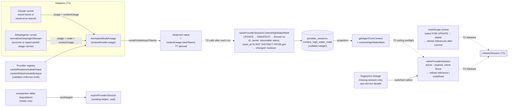

# Cold-read grill — gate: task — task plan cache-bug-T1

You did NOT write what follows. Read it cold, as an adversary trying to break the handover, never as its author defending it. You are READ-ONLY: return findings, change nothing.

## Interrogation technique

Run the interrogation this way. The harness contract above is the floor; this is the technique.

---
name: grilling
description: Grill the user relentlessly about a plan, decision, or idea. Use when the user wants to stress-test their thinking, or uses any 'grill' trigger phrases.
---

Interview the user relentlessly until you reach a shared understanding. Map this as a **design tree**: every decision branches into the decisions that hang off it.

Work the tree in **rounds**. The **frontier** is every decision whose prerequisites are already settled — the questions you can ask _now_ without guessing at answers you haven't heard yet. Ask the whole frontier in one round: number each question and give your recommended answer. Then wait for the user's answers before the next round.

Each question should be formatted like so:

```
❓ **Q1** - **<question title>**: <question body, might be multiple paragraphs, including multiple choices>

➡️ <your recommended answer>
```

Each round the user answers reshapes the tree — settled decisions push the frontier outward and unblock questions that depended on them. Recompute the frontier and ask the next round. A question whose answer depends on another question still open in this round belongs to a _later_ round, not this one.

Finding _facts_ is your job, never the user's. When a frontier question needs a fact from the environment (filesystem, tools, etc.), dispatch a sub-agent to find it — don't ask the user for anything you could look up yourself. Don't block on it: a running exploration is an unsettled prerequisite, so only the questions downstream of it wait for the sub-agent to report — ask the rest of the frontier now. The _decisions_ are the user's — put each to them and wait.

The session is done when the frontier is empty: every branch of the design tree visited, nothing left silently assumed. Do not act on it until the user confirms you have reached a shared understanding.


## Harness grill contract

# Griller Prompt — adversarial handover interrogation

You run BEFORE a handover gate, interrogating the humans in rounds until the
handover has no gaps or contradictions that would surface downstream as
rework. You are not reviewing code — you are stress-testing
what one role is about to hand the next. The gate scripts REFUSE without
your fresh, passing record.

**Independence is the whole point.** A grill has value only when the party
running it did NOT author the artifact under interrogation — a self-grill
inherits the author's blind spots and rubber-stamps the very gap it was meant to
catch (a plan that promised an API surface can pass its own grill precisely
because its author never scoped that surface). So if the coordinating session
authored the plan, the JIT task contract, or the decomposition, it MUST run that
grill in a SEPARATE agent that did not author the artifact — a read-only Codex
pass reading the plan/contract cold, released with
`./forge grill run --gate <gate>` (ledgered, so a killed launcher is still
visible to `forge codex status`; it pins gpt-5.6-terra @ xhigh from
harness.yaml) — rather than certify its own work inline. Codex on `gpt-5.6-terra` @ xhigh
is the required cold reader for planning grills: a fresh model context fully
independent of the authoring session, and because it is read-only it never
writes, so the write-lock that gates the write companion does not apply. Do NOT
use a Claude sub-agent for the grill, and never grill your own work inline.
Interrogate as an adversary trying to break the handover, never as its author
defending it.

RELEASE IT THROUGH THE HARNESS. `./forge grill run --gate <gate>` composes the cold-read brief (this contract plus the artifact) and releases Codex through the SAME ledgered launcher a delegation uses: the pid is recorded before the wait, so a grill whose launcher is killed still shows up in `forge codex status` instead of vanishing. It is read-only, so it takes no delegation lock and can never satisfy `stage done`. Recording the gate stays yours — the cold read only returns findings.

The technique is Matt Pocock's `grilling` skill — the design tree, the
frontier, numbered questions with recommended answers. `doctor --fix` installs
it into BOTH runtimes, and `./forge grill run` also inlines it into the brief,
so a reader reaches it whether or not its runtime resolves skills. This
contract is the harness-side floor; `grilling` is the technique.

`grill-me` is the HUMAN entry point — you type `/grill-me` and it redirects to
`grilling`. It carries `disable-model-invocation: true`, so no model invokes it
and none should be told to.

WHICH RUNTIME CAN RECORD WHICH GATE — get this wrong and you will chase a
refusal you cannot satisfy. ALL SIX gates match the AskUserQuestion ledger and
are therefore CLAUDE-ONLY, each with a floor of ONE logged round: `--gate spec`,
`--gate signoff`, `--gate epics`, `--gate requirements`, `--gate plan` and
`--gate task` — the floors live in `grill_gates.GATES`, one row per gate.
`signoff` and `epics` used to sit outside that check and so recorded with ZERO
rounds behind them; they now answer to it like every other gate.

ONE round is a FLOOR, never a target. Keep going until a round comes back clean
AND the next one stays clean — a single quiet round after a noisy one is a
coincidence, not convergence. The ledger files are written ONLY by `post_tool_use.py` on a
Claude Code AskUserQuestion event; `.codex/hooks.json` registers no PostToolUse
hook, so Codex cannot produce them and neither can a subagent. Delegating a
ledger-matched grill to Codex returns a well-formed payload that the recorder
then refuses, with nothing you can do to satisfy it — the payload was never the
problem, the runtime was.

For those four ledger-matched gates, independence is a COLD READ,
not necessarily a separate process. The recorder accepts ONLY rounds that match a
logged AskUserQuestion record (`record_grill_from_json.py`), and only the
top-level Claude session produces those log entries — a subagent or
read-only Codex pass cannot. So for those grills the top-level session drives
the rounds through AskUserQuestion itself — but because the coordinating session
authored the plan, the independent cold-read pass is MANDATORY, not optional: on
EVERY round release a fresh READ-ONLY Codex pass with
`./forge grill run --gate <gate> [--task <id>]` that reads the plan/contract
cold and returns findings — never a
Claude sub-agent, never grill your own work inline — then carry ALL of those
findings into your own AskUserQuestion rounds (the recorder rejects rounds not in
the ledger, so the top-level session must still ask). Read cold, as an adversary
who did not write it.

ONE COLD READ PER GATE — put every question to the human INSIDE it. The old
shape was Codex grill → your rounds → amend → Codex grill AGAIN, looping until
clean. That loop cannot converge: a fresh reader has no memory of what the last
one found, so it returns a DIFFERENT frontier rather than a shorter one, and the
artifact you amended to close round one becomes round two's input. Stories
reached eleven, twenty-six and forty rounds that way; the last cost six hours.
`forge grill run` now REFUSES a second unconstrained read on a gate that has
already been read since its last recorded pass.

So the WHOLE grill is:

1. `./forge grill run --gate <gate>` — one cold read. WATCH it.
2. Clean? Record the pass and approve. Nothing else happens.
3. Otherwise resolve every finding the REPOSITORY answers yourself — open the
   file and settle it. Take to the human only what the repository cannot
   answer: a decision nobody has made, a priority, a tradeoff between two
   workable shapes. Put those through AskUserQuestion with your recommended
   answer first, all of them, now. There is no later round to save the hard
   ones for, and a finding is not a menu.
4. Amend the artifact ONCE, to what they decided.
5. Record the pass against the AMENDED version, then approve exactly once.

The price is stated plainly, twice over: nothing independent re-reads the
amended version, and a gap this reader misses is not caught by a second reader
at this gate. Both surface at the next gate, or in review. That is the trade
for ending a loop that was costing whole days.

If the human's answers changed the artifact's SHAPE — a component dropped, a
different approach chosen — the amended artifact is not the one that was read
in any useful sense. Say so and read again: `./forge grill run --gate <gate>
--reread "<what changed shape>"`. It is a choice with a recorded reason, not a
way around the rule, and the five-read cap still backstops it. (EVERY gate is ledger-matched — signoff and epics no
longer excepted — so no gate can be recorded by a read-only Codex grill alone:
the top-level session asks the round and records it.)

FRESH CONTEXT, AND THE ANSWERS SO FAR. Every round is a NEW read-only Codex
session — that independence is the whole point. But a reader that knows nothing
of the earlier rounds does not re-find the same gaps, it finds DIFFERENT ones,
so the rounds never shrink and the grill has no natural end. `./forge grill run`
therefore carries every question already put to the human and the answer they
chose, read from the ledger the recorder validates against.

That gives the reader two obligations: do not re-raise settled questions, and
CHECK EACH ANSWER — that the artifact honours it, and that it contradicts no
other answer, accepted decision or constitution rule. An answer can be wrong, or
right and never applied; saying so is part of the read.

Do NOT tell the reader where to concentrate. A cold read is worth having because
it is unconstrained, and steering it toward the diff is how the thing nobody
looked at survives every round. More information, no direction.

END EVERY ROUND WITH AN EXPLICIT CONVERGENCE VERDICT, on its own line, so the
coordinator never has to guess whether to grill again or approve:

- `CONVERGED — no gaps, no contradictions, plan unchanged since the last round`
- `NOT CONVERGED — <the specific reason: open gaps, a contradiction, or the plan
  changed after the last clean round>`

`CONVERGED` on the cold read means there is nothing to amend: record and
approve. `NOT CONVERGED` does NOT mean read again — it means resolve what the
repository answers, put the rest to the human, amend once, and record the pass
against the amended version. Approval happens exactly once.

Five gates, five scopes:

- `--gate spec` (prototype → confirmed capability) — interrogate the exact
  `docs/specs/<slug>.md` file against BRIEF, architecture, decisions, and the
  prototype. Hunt: behavior the prototype proved but the spec omitted,
  implementation choices masquerading as requirements, vague acceptance
  language, and conflicts with active decisions.
- `--gate signoff` (client → PM, before `record_signoff.py`) — interrogate
  `docs/product/DISCOVERY.md`, `BRIEF.md`, confirmed specs, the spec-linked
  roadmap, `docs/decisions/`, and prototype notes. Hunt: unanswered
  stakeholder/constraint questions, scope
  the client saw vs. scope the BRIEF claims, decisions that contradict the
  BRIEF, acceptance criteria that are vibes instead of checks, non-functional
  requirements nobody asked about (auth, data retention, environments).
- `--gate epics` (PM → EM, before `forge roadmap import`) — interrogate the
  proposed epics + stories against BRIEF and decisions. Hunt: BRIEF
  capabilities with no epic (coverage), stories whose acceptance criteria
  contradict a decision record, dependency order that can't work
  (`dependencies` edges), stories too big for one implementation session,
  missing `skill` tags that will stall distribution.
- `--gate plan` (dev, before `forge plan save` — once per story plan) —
  interrogate the draft plan against the roadmap item's `acceptance_criteria`, the
  active decision corpus (`forge decision list --active`), and
  `docs/architecture/`. Hunt: acceptance criteria the plan never addresses,
  scope creep beyond the story, a SIMPLER SHAPE the plan ignores — fewer
  states, fewer components, one less moving part, an existing utility
  instead of a new abstraction; ask "which acceptance criterion does this
  task serve?" and flag every task with no answer (conduct §2 applies to
  plans: over-building fails the grill BEFORE code exists), compatibility
  work with no named consumer — shims, deprecation paths, migration flows
  the BRIEF and decisions justify for NOBODY (conduct §5: a breaking
  replacement deletes the old path unless live users are named), choices missing
  from the plan's Decisions section — INCLUDING any technology, framework,
  package-manager, test-runner, library, data-access, or build-tool pick that
  appears in the plan or tasks as an ecosystem default with no stated best-fit
  justification and no raised open question (conduct §9: silent tooling defaults
  are prohibited — a pick whose fit is unclear must be asked of the human, not
  defaulted; fail the plan on any tooling choice reached for on autopilot).
  Also flag a MISSING quality-gate baseline: any codebase the plan touches must
  wire a stack-APPROPRIATE static-analysis gate — a linter AND formatter, plus a
  type-checker where the language has one — into CI/verify, not merely a test
  runner. Name the CAPABILITY, never a fixed tool: ESLint/Biome for JS-TS,
  Ruff/flake8 for Python, golangci-lint for Go, Clippy for Rust, Checkstyle/
  Spotbugs for Java, and so on — the requirement is generic to every backend, not
  one ecosystem's tool. Fail the plan when code ships with no configured lint/
  format/static-analysis gate that an automated check enforces on every push; an
  absent linter is a silent quality default exactly like an unjustified tool pick.
  Also hold the plan against the CONSTITUTION's coding standards
  (`constitution/README.md` index — read the references it maps to the plan's
  surfaces). The constitution is law, so a plan whose SHAPE omits or contradicts a
  mandated standard is a GAP, not a style preference: HTTP surfaces with no typed
  request AND response DTOs (`pnp-api-standards`, `pnp-swagger-api-documentation-
  standards`), a module ignoring the modular-monolith layout or file-suffix
  standards (`pnp-coding-standards-modular-monolith`, `03`), missing structured
  logging (`05`/`06`) or domain exception handling (`07`), an external integration
  that skips the provider/port pattern (`08`, `pnp-provider-pattern-for-
  integration`), or database work ignoring `pnp-database-standards`. Flag each and
  require the plan to conform or record a deliberate, written deviation — never
  wave it through as "the implementer will follow standards later"; a plan must not
  design AGAINST the law. (`constitution/` is on disk in every environment, so the
  read-only Codex cold-read has the law available — hold the plan to it.)
  Reconcile the plan explicitly against
  EVERY ID from `forge decision list --active`; a conflict becomes a
  contradiction signal or a superseding decision, never a silent exception.
  Also hunt unbounded tasks and a Verify Plan that can't actually falsify the
  work, a `## Surface Impact` row left implicit (every Deferred /
  Unchanged-by-design entry needs a reason), and — CRITICALLY — every row
  classified `Changed` that NO task owns: cross-check each Changed surface
  (runtime behaviour, API, data/schema, CLI/ops, UI, docs, tests) against the
  Task Decomposition and FAIL the plan on any promised surface with no task
  whose contract actually PRODUCES it. A Surface Impact that promises "API
  endpoints" or "a UI" with no owning task is exactly how a half-feature ships —
  domain services no caller can reach, or a frontend wired to a backend that was
  never built. Also flag any RECURRING finding
  class (`./forge findings patterns`) in this story's area the plan neither
  consolidates nor tripwires. In Claude Code the
  `/grill-me` skill run against the plan satisfies this contract. The payload
  carries `"issue"`; the recorder stamps it against the active task.
- `--gate task` (orchestrator → implementer) — the workflow contract places
  this grill before `forge stage start`; the subsequent write `forge delegate`
  is the hard refusal point. Interrogate the next leaf task's just-authored
  contract in the re-recorded decomposition against the approved story plan,
  active decisions, and the actual repository state left by completed prior
  stages. Hunt: assumed files or APIs that prior work did not produce, a
  `write_scope` whose AREAS miss where the work must land or reach into areas
  the task has no business in (scope is directory prefixes plus named new
  files — a missing existing file under a declared prefix, a drifted line
  number or a renamed module is a NON-BLOCKING note, never a blocking finding;
  `stage done` measures the exact paths), acceptance criteria not served by the proposed
  work, a task that OWNS a plan `## Surface Impact` surface but whose
  `write_scope`/`required_tests` do not actually PRODUCE it (owns the API row but
  builds only domain services with no HTTP controllers/DTOs/routes; owns the UI
  row but ships no components) — reachability is part of "done", not a later
  task's problem, required tests that do not prove those criteria, verify commands that
  cannot falsify the change, reviewer focus that misses the risky seam OR that
  re-states shape rules the constitution already sets instead of CITING the
  load-bearing `constitution/` references for the task (the contract points at the
  law, never re-derives or contradicts it), and a
  `user_facing` flag that misclassifies the task — a UI task left `false` (its
  mandatory design skills and design review would be skipped) or a backend task
  marked `true` (forced to attest UI design skills it has no use for).
  This is the JIT task-planning gate from decision 0032, not a repeat of the
  story-level plan grill. Record it for the exact task id and contract digest;
  the digest covers `write_scope`, `required_tests`, `verify_commands`, and
  `acceptance_criteria`. A changed field makes the old task grill stale, and a
  write delegation refuses it; read-only delegation is unaffected.

Method:

1. Read the artifacts in scope FIRST; derive your question list from actual
   text, citing it (`BRIEF.md says X; decision 0003 says Y — which wins?`).
2. Interrogate in ROUNDS until the frontier is empty — not one pass. Each
   round, put the questions whose prerequisites are already settled to the
   human (PM or EM) with your recommended answer; their answers reshape the
   tree and unblock the next round's questions. Stop a single question when it
   would only confirm what a document already states; stop the grill only when
   no gap or contradiction remains unasked. In Claude Code, deliver each
   round's frontier through the AskUserQuestion tool (recommended answer
   first), not prose. For every ledger-matched gate (`spec`, `requirements`,
   `plan`, `task`) the recorder requires
   the FINAL round in the payload to carry `"frontier_empty": true` — that flag
   is how it confirms you stopped because the frontier closed, not because you
   ran out of patience; it is set by hand on the last `rounds` entry, never by
   the ledger. A zero-gap contract still needs at least one such round (every
   gate's floor is 1, and a floor is not a target), so ask a genuine closing
   question
   (e.g. "any remaining gap before we hand off?") and mark it `frontier_empty`.
3. Every finding lands somewhere real before the verdict: a doc edit, a
   `./forge decision new <slug>` record, or an explicit non-blocking entry
   in `open_items`. An `open_items` entry that PARKS scope also gets a
   deferral row with a revisit trigger (`./forge defer add`) — parked scope
   without a trigger is scope silently dropped. Unresolved blocking
   findings ⇒ verdict `blocked`.
4. Record the outcome (schema: `factory/schemas/grill.json`,
   `"generated_by": "griller"`):

   A task-grill input uses this recorded shape (the recorder adds its own
   task id, digests, commit, and timestamps):

```json
{
  "generated_by": "griller",
  "verdict": "pass",
  "gaps": [],
  "contradictions": [],
  "resolutions": ["What was sanctioned"],
  "inspected_refs": ["path/or/path:symbol"],
  "current_flow": "What the repository does now",
  "criteria_map": {"criterion": "proof"},
  "decision": "keep",
  "new_abstractions": ["None"],
  "rounds": [{"question": "Finding or choice", "options": ["Recommended", "Alternative"], "chosen": "Recommended", "frontier_empty": true}],
  "citations": [{"finding": "Repo-answerable finding", "source": "path:symbol"}],
  "open_items": []
}
```

   Each `rounds` entry has a non-empty `question`, two to four non-empty
   string `options`, and a `chosen` value equal to one option. Each citation
   is `{finding, source}`. Every string in `gaps` must be covered by an equal
   `rounds[].question` or `citations[].finding`.

   For every gate — all six are ledger-matched — extra recorder rules bind
   (this is what makes an otherwise well-formed payload fail):
   - Rounds must match the AskUserQuestion ledger and meet the gate floor
     (1 for every gate, and a floor is not a target); the final round carries
     `"frontier_empty": true`. A
     zero-gap grill still records its floor of real rounds — never zero.
   - `--gate task` only: `criteria_map` is a THREE-WAY equality — its KEYS must
     equal the frontier task's `acceptance_criteria` set AND the set of its
     `plan_contracts[].statement` values, exactly (no extra key, none missing);
     each value is the non-empty proof for that criterion. Author the task's
     `acceptance_criteria` and its `plan_contracts` statements as the SAME
     strings so there is one coherent key set to satisfy.

```bash
python3 factory/scripts/record_grill_from_json.py --gate <spec|signoff|epics|requirements|plan|task> --input <json> [--input-digest <artifact>] [--task <id>]
```

5. For every gate except task, commit the resolution edits
   BEFORE recording the grill — those gates check freshness against BOTH
   committed history and the working tree: any guarded doc changing after the
   grill (even uncommitted) stales it. (The sign-off / epics-approved decision
   records themselves are expected afterwards and don't stale it.) The task
   gate instead binds directly to the re-recorded task contract digest; the JIT
   sequence does not require a commit between re-recording and grilling. But that
   digest still folds in the product tree, so record the task grill LAST — after
   any docs/ or factory/scripts commits: a tracked change outside .factory/ and
   plans/ that lands between grilling and `task approve`/`stage start` re-stales
   it and forces a re-grill.
6. `--input-digest` is REQUIRED for the spec, epics, and plan gates: pass the
   exact spec / roadmap input / plan draft you interrogated. The gate verifies the
   digest — grilling version A never approves an edited version B; if the
   artifact changes, re-grill it. For `--gate task`, pass `--task <id>` and NO
   `--task-digest` — that flag was removed and the recorder rejects it; the
   recorder derives the grounding digest itself from the protected contract,
   approved plan, and product tree, and stores the result at
   `.factory/grills/tasks/<id>.json`.

A `pass` with unresolved findings is refused by the recorder. Grill hard;
downstream implementation inherits whatever you let through.


## Lessons already in force for these paths

The plan must design AROUND these. A plan that ignores one is not merely unlucky later — it is wrong now, and saying so is part of this read.

- Runtime state, jobs, control events, and memory use Postgres as the production storage model; schema or repository changes need repository tests and architecture/docs updates when contracts shift.
- When replacing Postgres runtime schema in one cut, move active runtime persistence behind canonical Drizzle repositories/services in the same change; leaving schema-owned raw SQL or old table definitions creates drift and runtime failures after destructive migrations.
- Keep provider-specific and channel-specific behavior behind adapters; domain and application code should depend on stable product concepts and ports, not SDK payloads or runtime wiring.
- Risky tool execution must pass through deterministic permission evaluation and sandbox policy before any provider callback or runner grants access.
- Fleet compose rehearsal must run settings-seed through the normal Docker entrypoint so local auto-secrets are exported, and seed desired-state via the import service rather than the broad CLI bootstrap; the CLI bootstrap can close the shared runtime storage pool before settings import validation finishes. Docker-internal first-party Postgres hostnames need explicit plaintext allowance while real remote Postgres still requires sslmode=require.
- Runner-spawning tests (agent-runner-ipc, ipc-mcp-stdio) sandbox the runner by COPYING source files; hand-enumerated lists silently break when a new module becomes runner-reachable (every test then burns its ~19s IPC timeout). Fixed 2026-07-22 by recursive cpSync of the whole shared/ tree. If a runner-spawn test suite suddenly times out uniformly, check the sandbox copy set FIRST; never reintroduce per-file enumeration of a derivable file set.
- Postgres JSONB normalizes object key order and drops undefined; any equality check against persisted state (JSON.stringify ===) silently fails in prod while structuredClone-based fakes keep it green. Compare with util.isDeepStrictEqual and make repository fakes persist through a JSONB-faithful round trip (see test/unit/application/jsonb-round-trip.ts).
- T3a order that fits one Codex run: (1) schema.ts + port + repository + domain/types.ts + the shared boundary canonicalPath, then run npm run db:migrations:generate -- --name permission_decision_memory_human (NEVER hand-write the SQL or snapshot; commit what drizzle-kit emits), then npx tsc --noEmit; (2) the scope-key module and the service; (3) tests ONE FILE AT A TIME in this order — provenance, scope, service, prospective-write pin, Postgres suite — running each file right after writing it and never re-reading a finished source file. Postgres tests need the TEST database: run 'source /private/tmp/claude-501/-Users-ravikiranvemula-Workdir-myclaw/b4051e43-dbea-4d62-ba73-ae6210455474/scratchpad/pgfix-env.sh' in the same shell before vitest (it exports GANTRY_TEST_DATABASE_URL for gantry_test; the live database gantry must never be touched). Required leaf titles are exact it() names from the brief.
- The tree already holds partial T5b work (listing module, forget handler, parser, ports, four provider branches). Do NOT re-survey: read only the cited line ranges in the brief and the files you are about to edit. Order: 1 listing module + parser + session command; 2 forget handler + wiring setter + runtime-services bind; 3 audit read port + Postgres adapter + job-name hydration; 4 label carrier on both prompt paths + guidance line; 5 the four provider in-place edits; 6 tests one file at a time, running only the touched suite after each. Everything you write survives on disk across relaunches; commit nothing, finish the slice in front of you.
- cache-bug-T1 AC9/S11 is fulfilled by npm run lint:changed (ESLint over TypeScript files changed against the merge-base with origin/main) inside FACTORY_STRUCTURAL_CMD in .envrc and as the blocking CI step, with full npm run lint kept as an advisory continue-on-error CI step; the 82 pre-existing errors are recorded as deferral D-0080 and must NOT be fixed, baselined or suppressed in this task. This is the orchestrator's recorded ruling (signals S-0092, S-0095, S-0099, 2026-09-09): do not raise it again.
- Together with the three quality P2s these are the ONLY changes in this round: (4) the used-by lookup runs only for the rows actually rendered (the ten newest for bare /permissions, all for /permissions all), never for every remembered record; (5) job-name hydration is ONE batched read for the collected job ids, not a serial per-record loop; (6) a provider in-place edit failure must never suppress the Forget receipt — send the confirmation reply first or independently, then attempt the edit, and pin it with a test per provider where the edit throws; (7) keep behaviour otherwise identical. Run only the touched suites; tsc and check:architecture stay green.
- Final fix cycle; change nothing else. (1) After a Forget tap the re-rendered list hydrates used-by ONLY for the rows it renders (the ten newest), same as the bare listing. (2) Job-name hydration is ONE bulk repository read for the deduplicated job ids (a single list/getMany call), not concurrent per-id reads — this also bounds /permissions all to one query. (3) Slack: when the replacement view has no buttons, clear the blocks (send an empty blocks array / text-only update) so stale buttons do not linger; pin with a test. (4) Move the 'Already forgotten.' string into the listing copy owner beside the other replies. Run only the touched suites; tsc and check:architecture stay green.
- apps/core/test/integration/deepagents-langchain-boundary.postgres.integration.test.ts 'aborts an in-flight run on a _close sentinel and exits cleanly with NO completed marker (close-stdin)' fails deterministically (exit code 1, error frame) because stream-normalizer-partial-usage.ts wraps EVERY thrown error into the DeepAgentPartialUsage carrier, so runner/index.ts:283 (liveControl.closed() && isAbortError(err)) no longer recognises the close-driven AbortError as a graceful stop. Fix: the wrapper passes abort errors through unwrapped (isAbortError check before wrapping), or isAbortError looks through the carrier's cause; keep the partial-usage frame for genuine failures. Run the DB-gated integration lane (npm run test:integration with GANTRY_TEST_DATABASE_URL) on Node 24 before reporting.
- Everything else is committed and green. The only failing test is 'lists one latest use per job by human decision record id…' in the Postgres suite: the adapter's listDecisionsByHumanDecisionRecordId returns lastUsedAt as the raw Postgres text ('2026-09-04 00:00:00+00') while the port promises an ISO string ('2026-09-04T00:00:00.000Z'). Fix it in adapters/storage/postgres/repositories/domain-repositories.postgres.ts by normalising the value the way the sibling reads in that file do (e.g. new Date(value).toISOString() or the existing timestamp helper); do not change the test's expectation. You cannot reach Postgres from your sandbox — the orchestrator runs that suite; just make the change, run tsc, and finish.
- The review marked two contracts partial; close them and nothing else. (AC2) PermissionMemoryListMessageView and the list-view type live in application/permissions/permission-memory-listing.ts (the required owner) — move the type there and import it from the current location; no behaviour change. (AC5) the used-by read fetches ONLY the job ids referenced by the rendered records: collect the ids from the rows being rendered, dedupe once, and pass exactly that set to the single bulk job read; add a listing test asserting the bulk read receives only referenced ids. Run listing + forget-handler suites, tsc, check:architecture; ceilings measured after prettier.
- Orchestrator ruling (signals S-0093 and S-0094 resolved): PermissionMemoryListMessageView is DOMAIN-owned by design and stays where it is; AC2's 'listing module owns the view type' clause is superseded by the layer rule (domain must not import application) and is considered implemented. Do NOT move the type, do NOT raise a contradiction about it, do NOT edit domain/message-actions.ts. The single remaining change is AC5: in application/permissions/permission-memory-listing.ts (or the forget handler where hydration is called) collect the job ids referenced by the rows being rendered, dedupe once, and pass exactly that set to the one bulk job read; add a listing unit test asserting the bulk read receives only the referenced ids. Run the listing and forget-handler suites, tsc, check:architecture; finish.
- Exactly these changes, nothing else. (P1, blocking) app/bootstrap/runtime-services.ts ~line 601: the Forget handler's resolvePerson must canonicalise the caller in the CONVERSATION's app — derive the app id with appIdFromConversationJid(action.conversationJid) (the same value the handler later uses for the memory lookup) and pass it to resolveCanonicalMemoryPersonId instead of the process-wide runtime app id; pin with a runtime-services test where the conversation's app differs from the process app. (AC5) runtime-services.ts ~626 and app/bootstrap/group-processor-deps.ts ~87 bind a job reader that ignores the id set and lists ALL jobs; bind a by-ids read (add listJobsByIds(appId, ids) to the ops job repository port + Postgres adapter if none exists, or batch the existing getJobById) so only the referenced ids are read; pin it. (AC2) application/permissions/permission-memory-listing.ts ~155 duplicates the category-noun table; delete it and call the existing shared category-noun helper the card copy uses; add the one-job and two-job used-by cases to the listing suite beside the 3+ case. Run runtime-services, listing, forget-handler suites; tsc; check:architecture; ceilings after prettier (runtime-services ≤ 1186). You cannot reach Postgres; the orchestrator runs that lane.
- Orchestrator ruling (review round 6): MemoryForgetMessageActionInput carries the agent identity as the bounded agentRouteKey — the codec key the round-3 grill ruled because Telegram's callback payload is size-limited; the host handler resolves the route-effective agentId from it. Do NOT add an agentId field to the domain input or to any provider payload; AC4 has been amended to say so. Do not raise a contradiction about it. The single remaining change: app/bootstrap/runtime-services.ts ~line 631 — the post-Forget used-by hydration (and any used-by read the Forget handler performs) must use the CONVERSATION's app id (appIdFromConversationJid(action.conversationJid), the same value the handler already uses for the memory lookup and the person resolver), never the process-wide app id; pin it with a runtime-services test where the conversation app differs from the process app. Run runtime-services + forget-handler suites, tsc, check:architecture; ceilings after prettier (runtime-services ≤ 1186 — extract a tiny helper if needed). Finish.
- Work in this order and finish each slice before reading further; everything you write survives on disk across relaunches; commit nothing. Slice 1: NEW application/permissions/permission-judge-outage-latch.ts (pure latch: observe/reset/clearAll, keyed appId|providerAccountId|targetJid, the two exported copy strings) + NEW runtime/permission-judge-outage.ts (module-level judgeOutageLatch instance, unavailablePromptConsultResult(failureCode, startedAt) returning the full PermissionClassifierPromptConsultResult with decision 'ask', isJudgeUnavailable, sendJudgeOfflineNotice with { threadId, providerAccountId }, no-target skip, swallowed errors) + add 'wiring_missing' to the failure-code union at runtime/permission-classifier.ts:60. Slice 2: IPC — split eligibility from wiring at ipc-permission-classifier-decision.ts:361, synthetic result on wiring failure, notice call before requestPermissionApproval at :639 and :595 and before the terminal job decision, reason line, exclude Unavailable from the cache write at :502; the file is 691/700 — calls only; extract the verdict-cache helpers into the runtime glue module if needed. Slice 3: inline-agent-loop-tools.ts — split the :372 guard, notice in beforePrompt (:449-468) and before the scheduled cancel return at :410, reason line; 708/750. Slice 4: NEW latch suite, NEW glue suite, the wiring_missing case in permission-classifier.test.ts, the IPC-decision cases, the inline cases — one file at a time, run only that suite. Slice 5: harness knobs (classifierVerdict.status, sendMessage + publishRuntimeEvent spies returned from replayPermissionRequest, classifierConsult param on replayExactMemorySequence), S6 + aggregation in askfloor-tap-budget.test.ts, NEW askfloor-invariance.test.ts as an it.each table over harness fixtures with tuples copied verbatim. Test titles = required_tests ids VERBATIM. You cannot reach Postgres; the orchestrator runs that lane. Never list all jobs, never import channels/.
- Exactly six changes; product design is otherwise final. (1) inline-agent-loop-tools.ts ~422: call observeJudgeAvailabilityForRequest BEFORE the successful-allow return so an answered allow clears the latch (pin: answered allow then unavailable → notice again). (2) askfloor-tap-budget.test.ts S6 ~324: the uncovered-read case must be a READ that the rails do not cover (e.g. a file read by path OUTSIDE the trusted root, or an mcp read binding not in reviewedMcpReadBindings) — not mcp__crm__update_record — and must assert exactly one tap and one notice; add the scheduled-job case (hostJobId set, judge unavailable): notice sent once to the job conversation, decision reason = JUDGE_OFFLINE_REASON, deterministic denial + card recovery unchanged. (3) askfloor-invariance.test.ts: build the matrix from the REAL harness fixtures — one row per lane in AF-AC6: ask, auto_strict, interactive auto, trusted-host autonomous via registerWorkerPermissionRunRestriction, the projection quartet via replayRememberedJobProjection (exact match allows, near-miss cards, revoked re-cards, rails-bump re-cards — the harness has these), YOLO backstop, unmapped forced ask, scheduler_delete_job, destructive via replayDestructiveExactMemory, the family rail hit asserting FAMILY_RULE_RAIL_HIT_REASON, the inline-scheduled path through the INLINE gate (pattern of inline-agent-loop-tools.test.ts:1115/1450, not the IPC replay), attachment_open via attachmentOpenIds; expected tuples copied verbatim from askfloor-tap-budget.test.ts:26/173/233 and ipc-permission-classifier-decision.test.ts:360/385/416; the Unavailable column for the six codes + wiring_missing differs only where AF-AC5/0157 say. (4) aggregation ~356: actually run the four TB1-TB4 interactive-auto fixtures and the four mirrors (protected write, outside-workspace write, scheduler_delete_job, raw-path attach) plus S1-S6 through replayPermissionRequest and sum taps per lane. (5) runtime/permission-judge-outage.ts:133: delete the unused exported sendJudgeOfflineNotice; keep only sendJudgeOfflineNoticeForRequest and test that one. (6) REGRESSION apps/core/test/unit/application/jobperm-ask-and-wait.test.ts 'denies a job request when its permission card cannot be attached' now fails (attachRequest 0 calls): on a job lane a synthetic wiring_missing result must flow into the SAME card/attach path as a real classifier ask (0157), never a terminal decision before attach — fix the IPC resolver so that test passes unchanged. Test titles must stay the required_tests ids verbatim. Run the touched suites + that jobperm suite; tsc; check:architecture; ceilings after prettier.
- Not a defect (0158): Decision 0158 §3: the host retires the session through one atomic active->expired transition that returns the retired reference, and starts fresh from the ordinary bounded briefing. Starting fresh after the fenced retirement is the settled behaviour; acting on a LOST fence (re-reading the turn context with hydrateMemory: false and reusing the hydrated block when the generation matches) is plan item R6, assigned to T2 (cache-bug-T2 AC R6), not T1. T1-AC6 only introduces the atomic retire that returns the reference and switches the existing callers to it; T1-AC8 states no caller acts on the returned reference yet. Clearing the local resume ids after the fenced call is the pre-existing behaviour (expireProviderSession returned void) and persists no replacement handle for a foreign generation: a lost fence means the row is already non-active or the agent session was reset, so no live resumable handle is dropped, and the fresh run's handle is written by setSession under the current generation. — raised as "Honor a lost retirement before dropping the resume state (apps/core/src/runtime/group-agent-runner.ts:394): The return value from the fenced retirement is disca"
- Not a defect (0158): Decision 0158 §3: the host retires the session through one atomic active->expired transition that returns the retired reference, and starts fresh from the ordinary bounded briefing. Starting fresh after the fenced retirement is the settled behaviour; acting on a LOST fence (re-reading the turn context with hydrateMemory: false and reusing the hydrated block when the generation matches) is plan item R6, assigned to T2 (cache-bug-T2 AC R6), not T1. T1-AC6 only introduces the atomic retire that returns the reference and switches the existing callers to it; T1-AC8 states no caller acts on the returned reference yet. Clearing the local resume ids after the fenced call is the pre-existing behaviour (expireProviderSession returned void) and persists no replacement handle for a foreign generation: a lost fence means the row is already non-active or the agent session was reset, so no live resumable handle is dropped, and the fresh run's handle is written by setSession under the current generation. — raised as "[P1] Handle a lost retirement transition before discarding the resumed session (apps/core/src/runtime/group-agent-runner.ts:394): `retireProviderSession` return"
- Not a defect (0158): Decision 0158 §3: the host retires the session through one atomic active->expired transition that returns the retired reference, and starts fresh from the ordinary bounded briefing. Starting fresh after the fenced retirement is the settled behaviour; acting on a LOST fence (re-reading the turn context with hydrateMemory: false and reusing the hydrated block when the generation matches) is plan item R6, assigned to T2 (cache-bug-T2 AC R6), not T1. T1-AC6 only introduces the atomic retire that returns the reference and switches the existing callers to it; T1-AC8 states no caller acts on the returned reference yet. Clearing the local resume ids after the fenced call is the pre-existing behaviour (expireProviderSession returned void) and persists no replacement handle for a foreign generation: a lost fence means the row is already non-active or the agent session was reset, so no live resumable handle is dropped, and the fresh run's handle is written by setSession under the current generation. — raised as "[P1] Honor a lost fenced retirement before creating a replacement session (apps/core/src/runtime/group-agent-runner.ts:396): The return value from the generatio"
- Not a defect (0158): Decision 0158 §2 defines the observed context value as modelVisibleInputTokens derived from the normalised usage (input alone for inclusive routes): a CONTEXT measure, for which the largest single model invocation's cumulative input is the correct figure — summing input across the invocations of one graph turn would count the same conversation prefix once per invocation and overstate the context. Summed accounting is the billing concern, and the story plan's Scope / Non-goals names 'the DeepAgents largest-not-summed billing defect' as an explicit non-goal (spec cache-bug non-goals, same wording); the accumulator is pre-existing code that T1 only moved to stream-normalizer-usage.ts. — raised as "Accumulate usage across model invocations instead of taking a global maximum (apps/core/src/adapters/llm/deepagents-langchain/runner/stream-normalizer-usage.ts:"
- Not a defect (0159): Decision 0159 §3 settles resetScope as the /new path that removes the provider-session rows of the sessions in the caller's scope and returns the retired references; T1 only changed its return type (T1-AC8) and relocated it. The scope key already confines the reset to one conversation scope and its thread-variant descendants (apps/core/src/cli/group.ts comment above deleteSession), so omitting the agent predicate when no route owner resolves cannot touch another conversation. Sessions created without a conversation install have no route owner by design (CLI reset, integration fixture); adding a stop guard fails the existing 'resetScope returns the retired references' Postgres integration test. Pre-existing behaviour in base f83779ce7 canonical-session-repository.postgres.ts resetScope, unchanged by this task (T1-AC10). — raised as "Return early when no owning agent route can be resolved (apps/core/src/adapters/storage/postgres/repositories/canonical-session-repository-context-mark.postgres"
- Not a defect (0159): Decision 0159 §3 settles resetScope as the /new path that removes the provider-session rows of the sessions in the caller's scope and returns the retired references; T1 only changed its return type (T1-AC8) and relocated it. The scope key already confines the reset to one conversation scope and its thread-variant descendants (apps/core/src/cli/group.ts comment above deleteSession), so omitting the agent predicate when no route owner resolves cannot touch another conversation. Sessions created without a conversation install have no route owner by design (CLI reset, integration fixture); adding a stop guard fails the existing 'resetScope returns the retired references' Postgres integration test. Pre-existing behaviour in base f83779ce7 canonical-session-repository.postgres.ts resetScope, unchanged by this task (T1-AC10). — raised as "[P1] Fail closed when the conversation has no resolved owner (apps/core/src/adapters/storage/postgres/repositories/canonical-session-repository-context-mark.pos"

## Already answered on this story — verify, do not re-ask

These questions were put to the human and answered. Two obligations:

1. Do NOT raise them again as open questions. They are settled.
2. DO check each answer still holds — that the artifact actually honours it, and that it does not contradict another answer, an accepted decision, or the constitution. An answer can be wrong, or right and never applied. Saying so is part of this read.

- Q: SELF-1 — when an AI employee proposes a change to itself, what is the default for a new agent?
  A: Review-only by default; owner opts specific classes into auto-apply (Recommended)
- Q: INCIDENT-1 — what does `freeze` do to work already in flight?
  A: Soft by default: no new runs or tool calls, in-flight turns finish; `--hard` cancels immediately (Recommended)
- Q: ADMIN-ALERT-1 — where do admin alerts go in V1.0?
  A: One Teams/Slack conversation only (Recommended)
- Q: OPS-DR-1 — where do backups go?
  A: S3-compatible bucket or local path, operator's choice (Recommended)
- Q: LIFECYCLE-1 — default retention when the operator sets nothing?
  A: Messages 90 days, memory until offboarding, audit 400 days minimum (Recommended)
- Q: INTRO-1 — when does the intro card post in a channel?
  A: Once, on install, plus on first @mention by any new person (Recommended)
- Q: REVISION-1 — who can restore a prior persona/access revision?
  A: Owner for persona; administrator for access (Recommended)
- Q: Anything else to settle before I confirm these eleven specs and open the PR?
  A: No — confirm and open the PR (Recommended)
- Q: If the job card itself can't be created for a request (DB down, no group route), what should the run get?
  A: Deny the tool call with a plain reason (Recommended)
- Q: Anything else to settle for JOBPERM-2 before I confirm the spec and plan it?
  A: No — confirm and plan (Recommended)
- Q: Should attaching a skill remain separate from authorizing its declared actions?
  A: Keep separate (Recommended)
- Q: The independent cold read found no contradictions. Is the current Skills UI spec ready to confirm?
  A: Confirm spec (Recommended)
- Q: Should re-enabling a disabled provider preserve omitted stored fields through the existing sparse PATCH flow?
  A: Preserve via PATCH (Recommended)
- Q: Should first setup prevent saving or constructing a request until a multi-method provider’s authentication method is explicitly selected?
  A: Require selection (Recommended)
- Q: Grill finding 1: decision 0089 pins that every provider turn sees the 30-message channel block plus the thread window. The spec drops that snapshot on resumed sessions. Which way?
  A: Keep 0089, ceiling only (Recommended)
- Q: Grill finding 2: expiring a DeepAgents session starts a fresh thread but leaves the old raw LangGraph checkpoint rows, so Postgres still grows. Reclaim or narrow?
  A: Reclaim on expiry (Recommended)
- Q: Findings 3 to 5 have clear defaults. Confirm all three: threshold is one validated global runtime setting per decision 0025 (not an env var), default 150,000; expiry keys on the max single model-call inputTokens (no cache-read double count); durable memory stays freshly injected on every run and the rule is renamed to no duplicate channel/thread snapshot.
  A: Confirm all three (Recommended)
- Q: Round 2 finding: the one-off rollout invalidation command is a migration/cleanup command, which accepted decision 0003 (early stage, no back-compat) explicitly rejects. How do we handle existing oversized sessions?
  A: Drop the command, rely on unmeasured-means-no-resume (Recommended)
- Q: Round 2 finding: Claude's normalised inputTokens excludes cache read/write tokens and is aggregated per run, so it cannot supply the largest single model-call context. What should the ceiling measure?
  A: New per-request model-visible input maximum (Recommended)
- Q: Confirm the five defaults: scope is every persistent interactive provider session on any channel, jobs excluded; a session without a valid versioned measurement is not resumable, and measurements persist even from failed turns; effective cap is the lower of the global setting (valid range 20,000 to 900,000, applies on next resume) and the runtime-known safe model capacity, unknown capacity does not resume; DeepAgents checkpoint reclamation runs in one shared expiry operation for every expiry reason, never blocks a reply, leaves the session expired if cleanup fails and emits retry evidence; the observability query is operator-only, joins runtime_events to agent_runs to provider_sessions, and shows hashed identifiers by default.
  A: Confirm all five (Recommended)
- Q: Round 3 shows the per-request measurement is not implementable from current adapter output (DeepAgents emits one terminal usage snapshot whose input already includes cache reads; Claude aggregates per run), and the model-capacity clause is unknowable because no model identity is stored on the session. Do you want the minimal scope or the full design?
  A: Minimal: existing per-run usage as the ceiling (Recommended)
- Q: Finding 2: retiring legacy sessions lazily on their next turn is a runtime migration, which decisions 0003 and 0112 reject. How are pre-existing sessions handled?
  A: Manual pre-deploy reset by the owner (Recommended)
- Q: The active cache-bug roadmap card still carries intake-time criteria (drop the snapshot on resume, null Slack handles, update pinned tests) that contradict the grilled spec, and the harness refuses to edit an active card's criteria. How should the two contracts be reconciled?
  A: Link the spec as the card's authority (Recommended)
- Q: Closing question for the spec gate: the other seven findings (typed high-water column per 0017, provider-resolved usage components with partial usage on errors, fenced transition order including reset_at, adapter cleanup port with /new returning references after commit, flat limits scalar with a reader-version bump, event timing with full SHA-256 correlation, and a reset that preserves checkpoint_migrations) are being folded in from what the repository says. Any remaining gap before I amend once and record?
  A: No remaining gap, amend and record (Recommended)
- Q: Requirements gate closing question. The single cold read found seven implementation-shaping gaps (null-safe generation fence, one cumulative partial-usage payload on errors, explicit cache read/write booleans per route with the resolved route carried, /new returning retired references after commit, host-published events with a sanitised error, non-hydrating lost-race re-read per 0078, and aligning two architecture pages with session-resume.md). All seven are answered by the repository. Because the confirmed spec cannot be re-saved without a fresh spec-gate read and that gate's read cap is used up, they become binding plan requirements R1 to R7 rather than spec edits. Any remaining gap before I record the requirements gate and author the plan?
  A: No remaining gap, record and plan (Recommended)
- Q: Plan grill Q1: the compaction-delta replay path already marks a provider session degraded and then expires it when the delta is stale or too large. Decision 0159 wrongly says compaction paths reactivate. What is the contract for that path?
  A: Keep expiry, classify as uncovered (Recommended)
- Q: Do you accept decisions 0158 (retire after observed crossing; contextUsage.totalTokens preferred, derived usage fallback; typed column; global cap setting; no rollout) and 0159 (provider-neutral releaseSession port; /new returns retired references; covered paths ceiling, missing-session, fingerprint, /new; wording corrected per your answer above) so the plan can attest them?
  A: Accept both as Ravi (Recommended)
- Q: Closing question for the plan gate. The other repository-settled corrections will be folded in once: 12 spec criteria plus R1 to R7 mapped to tasks; T1 owns the compaction-delta caller, the service layer that discards resetScope's result, deep-agent-runner.ts, and a typed partial-usage carrier; T3 owns the whole release coordinator, the active /new path in runtime-services-active-new.ts, adapter-registry resolution, and post-reply timing; settings scope adds defaults, YAML renderer, revision document and tests, and the reader-version claim is corrected to what settings-revision-document.ts does today; events carry app and actor context, are best-effort, and get publish, query and projection tests per 0013; a code-owning task adds npm run lint to verify and CI; runtime-components.md and canonical-domain-model.md are named; the SQL recipe gets an executed Postgres test; the non-goal wording becomes no data migration or cleanup flow for pre-existing sessions. Any remaining gap before I amend once, record, and save the plan to the board?
  A: No remaining gap, amend and save (Recommended)
- Q: The harness makes the task count your call before the decomposition is recorded. The approved plan has three sequential backend tasks: T1 measurement and storage (registry booleans, derived input, partial usage on error, typed column with generated migration, fenced raise and retire operations, resetScope references, lint gate); T2 host policy (cap setting with reader-version bump, ceiling preflight with non-hydrating lost-race re-read, post-run raise, two events, docs and recipe, architecture alignment); T3 adapter release port (adapter contract, DeepAgents deleteThread, post-reply coordinator, both /new paths). How many tasks?
  A: Three, as planned (Recommended)
- Q: Task grill finding: both adapters also have inline runtime lanes (agentRuntime 'inline', no spawned worker) that can lose accumulated usage on failure, and T1 only covers the spawned-runner error frames. Cover inline lanes in T1, or narrow the criterion?
  A: Cover inline lanes in T1 (Recommended)
- Q: Closing question for the T1 task gate. The other five findings are repository-answered and will be folded in once: the compaction-delta path keeps the existing expiry helper (ready row, no retirement) per 0159, so three callers switch, not four; the Claude partial usage travels as a typed failure carrier thrown from the result branch and written by runner/index.ts (added to scope) as one error frame; canonical-ops-repo.postgres.ts joins the write scope and resetScope returns a readonly empty list on no-route paths; required tests add both runners' error frames, the caller switches, empty-list propagation, the four pinned tests and verify.py joins verify_commands; T1's acceptance criteria are restated so each is exactly one plan-contract statement, which the recorder requires; the registry type lives in model-provider-registry.ts. Any remaining gap before I amend once, record, and delegate T1?
  A: No remaining gap, amend and delegate (Recommended)
- Q: Run T2 and T3 in parallel worktrees after T1 merges, by moving the runner drain call and both event-type registrations into T2 so T3's write scope is disjoint (adapter contract, DeepAgents adapter, coordinator module, both /new handlers)? This amends the approved graph's dependency T3→T2 to T3→T1.
  A: Yes, amend and run them in parallel (Recommended)
- Q: Closing round for the amended T1 task gate. The cold read's seven findings are folded in from the repo and the session: write scope now names package.json and the three new sibling modules; the lint wording is lint:changed everywhere in the task plan; the diagram routes compaction-delta through the unchanged expire helper per 0159; the derivation criterion names the provider fallback with a new required test; the runtime surface is marked Changed; a required test proves clearSessionForChatJid propagates the retired references; and the stale-state finding resolves itself when the worker's regression fix is re-verified on Node 24. Any remaining gap before I record the gate, re-approve T1 with your name, and resume the worker?
  A: No remaining gap, record and resume (Recommended)
- Q: The pre-tool hook does not govern or claim file-tool writes into a sibling worktree (it resolves the repo root from the session cwd, not the target path). Because of that the degraded window closed with 0 files and stage done refuses. How do you want this handled?
  A: Hotfix the hook + re-apply the fixes under two windows (Recommended)

## The artifact under interrogation (task plan cache-bug-T1)

# cache-bug-T1 — Measurement, storage, and the quality gate

Story plan: `plans/active/cache-bug-bound-provider-session-context-growth-across-runner-restarts.md`
(approved). Spec: `docs/specs/cache-bug.md`. Decisions: 0158, 0159, 0017.

## Problem

The host has no measure of how much context a persistent provider session
carries, no typed place to store one, and no retirement operation that reports
whether it won. `expireProviderSession` returns `void`; `resetScope` deletes
provider-session rows and returns nothing; `totalBillableInputTokens` subtracts
cache reads so it cannot stand in for context size; the DeepAgents normaliser
does not carry its resolved route and drops usage when a turn throws; the
Claude result-error branch throws before normalising usage. Core ESLint exists
but neither `verify.py` nor CI runs it.

## Scope / Non-goals

In scope: the measurement seam, the typed column and two fenced repository
operations, `resetScope` returning references, the turn-context projection,
partial usage on both adapters' error frames, registry cache-inclusion
booleans with validation, and the diff-scoped `npm run lint:changed` gate
under verify and CI (full lint advisory; debt D-0080).

Non-goals: reading the mark for policy or raising it after a run (T2), any
release of DeepAgents state (T3), the cap setting (T2), events (T2), docs (T2).
No behaviour change for users in this task: sessions resume exactly as today.

## Workflow

What this task builds is the measurement-and-storage path that T2 will switch
on. Data moves left to right; T1 stops at the dashed boundary.



Three callers of the old expiry (fingerprint change, missing-session retry,
the ops-service facade and its `canonical-ops-repo.postgres.ts` twin) switch
to `retireProviderSession` in this task and keep their current behaviour; the
returned reference is discarded until T3 consumes it. The compaction-delta
degradation path operates on a `ready` row and stays on the existing
`expireProviderSession` helper, unchanged, per decision 0159 §4. Inline
runtime lanes (`agentRuntime: 'inline'`) for both adapters are in scope for
the partial-usage change and emit one terminal error output with usage, the
same shape as the worker frames.

## Acceptance Criteria

As recorded on the decomposition for `cache-bug-T1` (S1, S2/R2, S3/R1, R1,
R3, R4 return type, projection, S11 lint, S10 pinned tests).

## Technical Approach

1. **Registry booleans.** Add `cacheReadsIncludedInInput` and
   `cacheWritesIncludedInInput` to `ModelProviderPromptCacheSupport` in
   `model-provider-registry.ts` (the type lives there, ~line 95); set Anthropic `false/false`, OpenAI and
   OpenRouter (and every `openai-compatible` lane that reads
   `prompt_tokens_details.*`) `true/true`; routes with cache mode `none` are
   `true/true` by construction. The existing registry validator gains one
   check: an executable route whose prompt cache support lacks either boolean
   fails with a named error.
2. **Derivation.** `modelVisibleInputTokens(usage: NormalizedModelUsage)` in
   `shared/model-usage.ts`: resolve the route from `usage.modelRoute`
   (fallback `usage.provider`); additive when either boolean is false or the
   route is unresolved; inclusive otherwise. Pure function, no I/O.
3. **DeepAgents route + partial usage.** `deep-agent-runner.ts` passes the
   resolved route id it already uses for cache-provider resolution into
   `normalizeDeepAgentStream`; `normalizedUsage` sets `provider` and
   `modelRoute`. On a thrown turn the normaliser attaches a typed
   `DeepAgentPartialUsage` value (accumulated usage + `usageEventId` + route)
   to a `DeepAgentTurnFailure` wrapper; `deep-agent-runner.ts` propagates it
   and `runner/index.ts` writes `usage` on the `status: 'error'` frame.
4. **Claude partial usage.** In the `result` branch of
   `query-loop-phases-messages.ts`, normalise the message usage and throw a
   typed `QueryFailure` (a value-carrying error class in `runner/types.ts`)
   holding `{ message, usage, usageEventId }` instead of a bare `Error`; the
   throw propagates through `runQuery` untouched, and the `catch` in
   `runner/index.ts` unwraps it and writes `usage` on the single
   `status: 'error'` frame. No early emission, so exactly one error frame.
   The Claude inline lane (`inline-lane/index.ts`, its `throw new
   Error(failure)` at the result branch) mirrors this: it emits one terminal
   error output carrying the accumulated usage.
4b. **DeepAgents inline lane.** `deepagents-langchain/inline-lane` applies the
   same `DeepAgentPartialUsage` carrier so an errored inline turn emits one
   terminal error output with usage.
5. **Schema + migration.** `contextHighWaterMark: integer('context_high_water_mark')`
   on `providerSessionsPostgres`; run
   `npm run db:migrations:generate -- --name provider_session_context_high_water_mark`
   and commit exactly what drizzle-kit emits (SQL, snapshot, journal).
6. **Repository operations** in `canonical-session-repository-helpers.postgres.ts`:
   `raiseProviderSessionContextHighWaterMark` (one UPDATE with `GREATEST`,
   joined to `agent_sessions`, predicate on id, owner, `status IN resumable`,
   `reset_at IS NOT DISTINCT FROM $gen`; returns `rowCount > 0`) and
   `retireProviderSession` (one UPDATE `status='expired'` with `RETURNING`,
   predicate adds `status='active'` and provider/external id; returns the
   reference or `undefined`). Value validation lives in
   `domain/sessions/provider-session-measurement.ts` with
   `ProviderSessionMeasurementError`. Port signatures in
   `domain/repositories/ops-repo.ts`; the facade in
   `canonical-session-ops-service.ts` exposes both and returns the reference.
7. **resetScope.** Select the provider-session references `FOR UPDATE` inside
   the transaction before deleting, return them after commit as a readonly
   list; on no-route or empty paths return a readonly empty list, never
   `undefined`. The ops-service `resetScope`, the
   `canonical-ops-repo.postgres.ts` facade (`deleteSession` currently
   discards the result) and `app.clearSessionForChatJid` propagate the list;
   callers ignore it until T3.
8. **Projection.** `providerSessionContext` returns `contextHighWaterMark`.
9. **Lint gate (diff-scoped).** `package.json` gains `lint:changed` (ESLint
   over the TypeScript files changed against the merge-base with
   `origin/main`); `.envrc` `FACTORY_STRUCTURAL_CMD` gains
   `&& npm run lint:changed`; the CI check step runs `lint:changed` as a
   blocking step and keeps full `npm run lint` as an advisory
   `continue-on-error` step. Every file this task touches is lint-clean. The
   82 pre-existing errors outside the diff are deferral D-0080 with a
   trigger (a lint-debt paydown story lands, then `lint:changed` becomes
   `lint`); they are neither fixed, baselined nor suppressed here.

## Decisions

No new decisions. 0158 §1–2 and 0159 §3 govern; 0017 places the mark in a
typed column.

## Surface Impact

| Surface | Class | Note |
| --- | --- | --- |
| Runtime behaviour | Changed | error frames from both runners and both inline lanes now carry partial usage; fingerprint and missing-session retirement go through the atomic retire; sessions still resume exactly as today because nothing reads the mark yet (T2) |
| API | N-A | none |
| Data/schema | Changed | one nullable integer column, generated migration |
| CLI/ops | Changed | `npm run lint:changed` in verify and CI (full lint advisory) |
| UI | N-A | none |
| Docs | Unchanged by design | T2 owns docs/memory and architecture alignment |
| Tests | Changed | nine required tests plus pinned tests untouched |

## Task Decomposition

This is a leaf task; no further split.

## Risks

- Generated migration drift: run `db:migrations:check` before and after.
- The `FROM agent_sessions` join in both UPDATEs must not widen the match;
  the null/null and null-vs-non-null tests pin it.
- Lint may surface debt outside the diff; deferral, not scope creep.
- Postgres tests need `GANTRY_TEST_DATABASE_URL` (test database only).

## Verify Plan

On Node 24 (`.nvmrc`): `npm run db:migrations:check`, `npm run typecheck`,
`npm run lint:changed`, the twenty-five required tests (derivation including
the provider fallback, registry validation, repository fences, caller
switches, both runners' and both inline lanes' error frames, the
`clearSessionForChatJid` reference propagation, the four pinned tests), then
`python3 factory/scripts/verify.py`, which is itself a recorded verify
command so the `.envrc` lint wiring is proven. The Postgres leaf runs on the
host against a throwaway pgvector database.

## Manual Verification

1. Apply the migration to a scratch database: `npm run db:migrate`. Observe
   `\d provider_sessions` shows `context_high_water_mark integer` nullable.
2. Run the Postgres suite for the new operations with
   `GANTRY_TEST_DATABASE_URL` set:
   `npx vitest run -c vitest.integration.postgres.config.ts apps/core/test/integration/provider-session-context-high-water-mark.postgres.integration.test.ts`.
   Observe all cases green, including the null/null fence and the lost
   transition returning `undefined`.
3. Start a live Slack or web turn against the running app and send one
   message. Observe the reply arrives exactly as before (no policy change) and
   `SELECT context_high_water_mark FROM provider_sessions` is still `NULL`
   for that session, because raising is T2's job.
4. Force a DeepAgents turn to fail (for example an invalid model credential).
   Observe the runner's error frame in the logs carries a `usage` object with
   the accumulated counts and the resolved route.
5. Run `python3 factory/scripts/verify.py`. Observe it now executes
   `npm run lint` and passes.


## What to return

Findings only: contradictions, gaps, unstated assumptions, and anything a reader would have to guess. Say what would break and why. Do not record a gate — the coordinating session records it.

The round count below is a FLOOR, not a target. Keep grilling until a round comes back clean AND stays clean on the next one — hitting the floor is not the same as passing.
