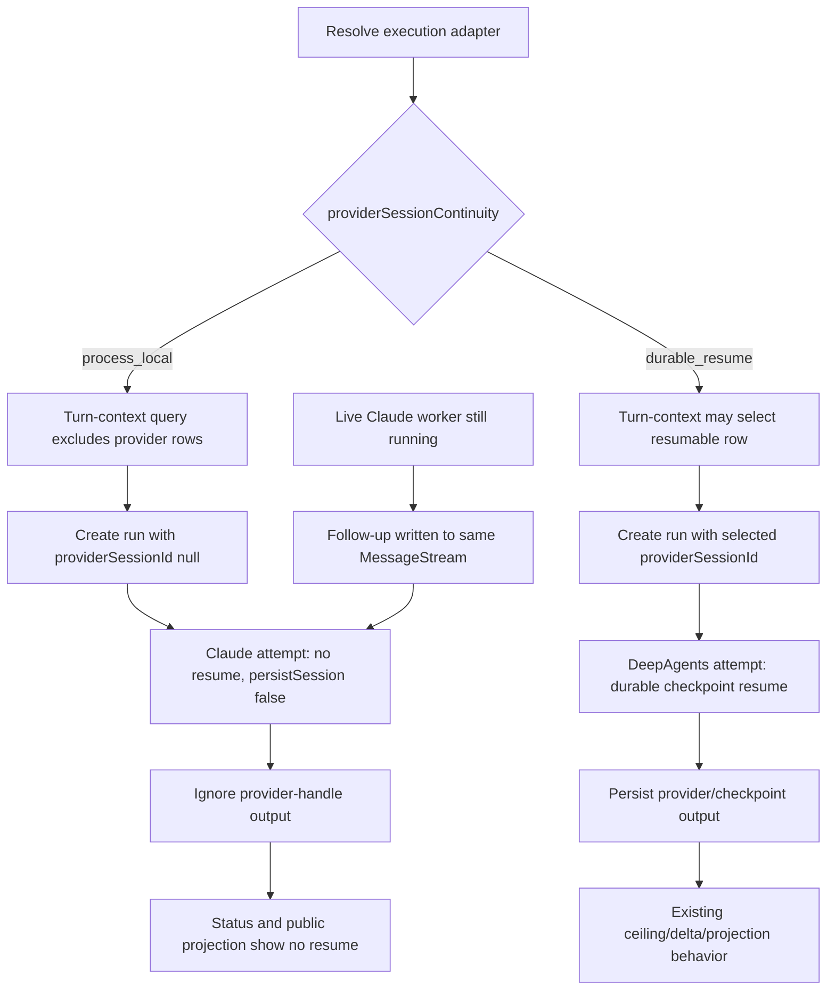

# Cold-read grill — gate: task — task plan cache-bug-T3A

You did NOT write what follows. Read it cold, as an adversary trying to break the handover, never as its author defending it. You are READ-ONLY: return findings, change nothing.

## Interrogation technique

Run the interrogation this way. The harness contract above is the floor; this is the technique.

---
name: grilling
description: Grill the user relentlessly about a plan, decision, or idea. Use when the user wants to stress-test their thinking, or uses any 'grill' trigger phrases.
---

Interview me relentlessly about every aspect of this until we reach a shared understanding. Walk down each branch of the decision tree, resolving dependencies between decisions one-by-one. For each question, provide your recommended answer.

Ask the questions one at a time, waiting for feedback on each question before continuing. Asking multiple questions at once is bewildering.

If a *fact* can be found by exploring the environment (filesystem, tools, etc.), look it up rather than asking me. The *decisions*, though, are mine — put each one to me and wait for my answer.

Do not act on it until I confirm we have reached a shared understanding.


## Harness grill contract

# Griller Prompt — adversarial handover interrogation

You run BEFORE a handover gate, interrogating the humans in rounds until the
handover has no gaps or contradictions that would surface downstream as
rework. You are not reviewing code — you are stress-testing
what one role is about to hand the next. The gate scripts REFUSE without
your fresh, passing record.

**Independence is the whole point.** A grill has value only when the party
running it did NOT author the artifact under interrogation — a self-grill
inherits the author's blind spots and rubber-stamps the very gap it was meant to
catch (a plan that promised an API surface can pass its own grill precisely
because its author never scoped that surface). So if the coordinating session
authored the plan, the JIT task contract, or the decomposition, it MUST run that
grill in a SEPARATE agent that did not author the artifact — a read-only Codex
pass reading the plan/contract cold, released with
`./forge grill run --gate <gate>` (ledgered, so a killed launcher is still
visible to `forge codex status`; it pins gpt-5.6-terra @ xhigh from
harness.yaml) — rather than certify its own work inline. Codex on `gpt-5.6-terra` @ xhigh
is the required cold reader for planning grills: a fresh model context fully
independent of the authoring session, and because it is read-only it never
writes, so the write-lock that gates the write companion does not apply. Do NOT
use a Claude sub-agent for the grill, and never grill your own work inline.
Interrogate as an adversary trying to break the handover, never as its author
defending it.

RELEASE IT THROUGH THE HARNESS. `./forge grill run --gate <gate>` composes the cold-read brief (this contract plus the artifact) and releases Codex through the SAME ledgered launcher a delegation uses: the pid is recorded before the wait, so a grill whose launcher is killed still shows up in `forge codex status` instead of vanishing. It is read-only, so it takes no delegation lock and can never satisfy `stage done`. Recording the gate stays yours — the cold read only returns findings.

The technique is Matt Pocock's `grilling` skill — the design tree, the
frontier, numbered questions with recommended answers. `doctor --fix` installs
it into BOTH runtimes, and `./forge grill run` also inlines it into the brief,
so a reader reaches it whether or not its runtime resolves skills. This
contract is the harness-side floor; `grilling` is the technique.

`grill-me` is the HUMAN entry point — you type `/grill-me` and it redirects to
`grilling`. It carries `disable-model-invocation: true`, so no model invokes it
and none should be told to.

WHICH RUNTIME CAN RECORD WHICH GATE — get this wrong and you will chase a
refusal you cannot satisfy. ALL SIX gates match the AskUserQuestion ledger and
are therefore CLAUDE-ONLY, each with a floor of ONE logged round: `--gate spec`,
`--gate signoff`, `--gate epics`, `--gate requirements`, `--gate plan` and
`--gate task` — the floors live in `grill_gates.GATES`, one row per gate.
`signoff` and `epics` used to sit outside that check and so recorded with ZERO
rounds behind them; they now answer to it like every other gate.

ONE round is a FLOOR, never a target. Keep going until a round comes back clean
AND the next one stays clean — a single quiet round after a noisy one is a
coincidence, not convergence. The ledger files are written ONLY by `post_tool_use.py` on a
Claude Code AskUserQuestion event; `.codex/hooks.json` registers no PostToolUse
hook, so Codex cannot produce them and neither can a subagent. Delegating a
ledger-matched grill to Codex returns a well-formed payload that the recorder
then refuses, with nothing you can do to satisfy it — the payload was never the
problem, the runtime was.

For those four ledger-matched gates, independence is a COLD READ,
not necessarily a separate process. The recorder accepts ONLY rounds that match a
logged AskUserQuestion record (`record_grill_from_json.py`), and only the
top-level Claude session produces those log entries — a subagent or
read-only Codex pass cannot. So for those grills the top-level session drives
the rounds through AskUserQuestion itself — but because the coordinating session
authored the plan, the independent cold-read pass is MANDATORY, not optional: on
EVERY round release a fresh READ-ONLY Codex pass with
`./forge grill run --gate <gate> [--task <id>]` that reads the plan/contract
cold and returns findings — never a
Claude sub-agent, never grill your own work inline — then carry ALL of those
findings into your own AskUserQuestion rounds (the recorder rejects rounds not in
the ledger, so the top-level session must still ask). Read cold, as an adversary
who did not write it.

ONE COLD READ PER GATE — put every question to the human INSIDE it. The old
shape was Codex grill → your rounds → amend → Codex grill AGAIN, looping until
clean. That loop cannot converge: a fresh reader has no memory of what the last
one found, so it returns a DIFFERENT frontier rather than a shorter one, and the
artifact you amended to close round one becomes round two's input. Stories
reached eleven, twenty-six and forty rounds that way; the last cost six hours.
`forge grill run` now REFUSES a second unconstrained read on a gate that has
already been read since its last recorded pass.

So the WHOLE grill is:

1. `./forge grill run --gate <gate>` — one cold read. WATCH it.
2. Clean? Record the pass and approve. Nothing else happens.
3. Otherwise resolve every finding the REPOSITORY answers yourself — open the
   file and settle it. Take to the human only what the repository cannot
   answer: a decision nobody has made, a priority, a tradeoff between two
   workable shapes. Put those through AskUserQuestion with your recommended
   answer first, all of them, now. There is no later round to save the hard
   ones for, and a finding is not a menu.
4. Amend the artifact ONCE, to what they decided.
5. Record the pass against the AMENDED version, then approve exactly once.

The price is stated plainly, twice over: nothing independent re-reads the
amended version, and a gap this reader misses is not caught by a second reader
at this gate. Both surface at the next gate, or in review. That is the trade
for ending a loop that was costing whole days.

If the human's answers changed the artifact's SHAPE — a component dropped, a
different approach chosen — the amended artifact is not the one that was read
in any useful sense. Say so and read again: `./forge grill run --gate <gate>
--reread "<what changed shape>"`. It is a choice with a recorded reason, not a
way around the rule, and the five-read cap still backstops it. (EVERY gate is ledger-matched — signoff and epics no
longer excepted — so no gate can be recorded by a read-only Codex grill alone:
the top-level session asks the round and records it.)

FRESH CONTEXT, AND THE ANSWERS SO FAR. Every round is a NEW read-only Codex
session — that independence is the whole point. But a reader that knows nothing
of the earlier rounds does not re-find the same gaps, it finds DIFFERENT ones,
so the rounds never shrink and the grill has no natural end. `./forge grill run`
therefore carries every question already put to the human and the answer they
chose, read from the ledger the recorder validates against.

That gives the reader two obligations: do not re-raise settled questions, and
CHECK EACH ANSWER — that the artifact honours it, and that it contradicts no
other answer, accepted decision or constitution rule. An answer can be wrong, or
right and never applied; saying so is part of the read.

Do NOT tell the reader where to concentrate. A cold read is worth having because
it is unconstrained, and steering it toward the diff is how the thing nobody
looked at survives every round. More information, no direction.

END EVERY ROUND WITH AN EXPLICIT CONVERGENCE VERDICT, on its own line, so the
coordinator never has to guess whether to grill again or approve:

- `CONVERGED — no gaps, no contradictions, plan unchanged since the last round`
- `NOT CONVERGED — <the specific reason: open gaps, a contradiction, or the plan
  changed after the last clean round>`

`CONVERGED` on the cold read means there is nothing to amend: record and
approve. `NOT CONVERGED` does NOT mean read again — it means resolve what the
repository answers, put the rest to the human, amend once, and record the pass
against the amended version. Approval happens exactly once.

Five gates, five scopes:

- `--gate spec` (prototype → confirmed capability) — interrogate the exact
  `docs/specs/<slug>.md` file against BRIEF, architecture, decisions, and the
  prototype. Hunt: behavior the prototype proved but the spec omitted,
  implementation choices masquerading as requirements, vague acceptance
  language, and conflicts with active decisions.
- `--gate signoff` (client → PM, before `record_signoff.py`) — interrogate
  `docs/product/DISCOVERY.md`, `BRIEF.md`, confirmed specs, the spec-linked
  roadmap, `docs/decisions/`, and prototype notes. Hunt: unanswered
  stakeholder/constraint questions, scope
  the client saw vs. scope the BRIEF claims, decisions that contradict the
  BRIEF, acceptance criteria that are vibes instead of checks, non-functional
  requirements nobody asked about (auth, data retention, environments).
- `--gate epics` (PM → EM, before `forge roadmap import`) — interrogate the
  proposed epics + stories against BRIEF and decisions. Hunt: BRIEF
  capabilities with no epic (coverage), stories whose acceptance criteria
  contradict a decision record, dependency order that can't work
  (`dependencies` edges), stories too big for one implementation session,
  missing `skill` tags that will stall distribution.
- `--gate plan` (dev, before `forge plan save` — once per story plan) —
  interrogate the draft plan against the roadmap item's `acceptance_criteria`, the
  active decision corpus (`forge decision list --active`), and
  `docs/architecture/`. Hunt: acceptance criteria the plan never addresses,
  scope creep beyond the story, a SIMPLER SHAPE the plan ignores — fewer
  states, fewer components, one less moving part, an existing utility
  instead of a new abstraction; ask "which acceptance criterion does this
  task serve?" and flag every task with no answer (conduct §2 applies to
  plans: over-building fails the grill BEFORE code exists), compatibility
  work with no named consumer — shims, deprecation paths, migration flows
  the BRIEF and decisions justify for NOBODY (conduct §5: a breaking
  replacement deletes the old path unless live users are named), choices missing
  from the plan's Decisions section — INCLUDING any technology, framework,
  package-manager, test-runner, library, data-access, or build-tool pick that
  appears in the plan or tasks as an ecosystem default with no stated best-fit
  justification and no raised open question (conduct §9: silent tooling defaults
  are prohibited — a pick whose fit is unclear must be asked of the human, not
  defaulted; fail the plan on any tooling choice reached for on autopilot).
  Also flag a MISSING quality-gate baseline: any codebase the plan touches must
  wire a stack-APPROPRIATE static-analysis gate — a linter AND formatter, plus a
  type-checker where the language has one — into CI/verify, not merely a test
  runner. Name the CAPABILITY, never a fixed tool: ESLint/Biome for JS-TS,
  Ruff/flake8 for Python, golangci-lint for Go, Clippy for Rust, Checkstyle/
  Spotbugs for Java, and so on — the requirement is generic to every backend, not
  one ecosystem's tool. Fail the plan when code ships with no configured lint/
  format/static-analysis gate that an automated check enforces on every push; an
  absent linter is a silent quality default exactly like an unjustified tool pick.
  Also hold the plan against the CONSTITUTION's coding standards
  (`constitution/README.md` index — read the references it maps to the plan's
  surfaces). The constitution is law, so a plan whose SHAPE omits or contradicts a
  mandated standard is a GAP, not a style preference: HTTP surfaces with no typed
  request AND response DTOs (`pnp-api-standards`, `pnp-swagger-api-documentation-
  standards`), a module ignoring the modular-monolith layout or file-suffix
  standards (`pnp-coding-standards-modular-monolith`, `03`), missing structured
  logging (`05`/`06`) or domain exception handling (`07`), an external integration
  that skips the provider/port pattern (`08`, `pnp-provider-pattern-for-
  integration`), or database work ignoring `pnp-database-standards`. Flag each and
  require the plan to conform or record a deliberate, written deviation — never
  wave it through as "the implementer will follow standards later"; a plan must not
  design AGAINST the law. (`constitution/` is on disk in every environment, so the
  read-only Codex cold-read has the law available — hold the plan to it.)
  Reconcile the plan explicitly against
  EVERY ID from `forge decision list --active`; a conflict becomes a
  contradiction signal or a superseding decision, never a silent exception.
  Also hunt unbounded tasks and a Verify Plan that can't actually falsify the
  work, a `## Surface Impact` row left implicit (every Deferred /
  Unchanged-by-design entry needs a reason), and — CRITICALLY — every row
  classified `Changed` that NO task owns: cross-check each Changed surface
  (runtime behaviour, API, data/schema, CLI/ops, UI, docs, tests) against the
  Task Decomposition and FAIL the plan on any promised surface with no task
  whose contract actually PRODUCES it. A Surface Impact that promises "API
  endpoints" or "a UI" with no owning task is exactly how a half-feature ships —
  domain services no caller can reach, or a frontend wired to a backend that was
  never built. Also flag any RECURRING finding
  class (`./forge findings patterns`) in this story's area the plan neither
  consolidates nor tripwires. In Claude Code the
  `/grill-me` skill run against the plan satisfies this contract. The payload
  carries `"issue"`; the recorder stamps it against the active task.
- `--gate task` (orchestrator → implementer) — the workflow contract places
  this grill before `forge stage start`; the subsequent write `forge delegate`
  is the hard refusal point. Interrogate the next leaf task's just-authored
  contract in the re-recorded decomposition against the approved story plan,
  active decisions, and the actual repository state left by completed prior
  stages. Hunt: assumed files or APIs that prior work did not produce, a
  `write_scope` whose AREAS miss where the work must land or reach into areas
  the task has no business in (scope is directory prefixes plus named new
  files — a missing existing file under a declared prefix, a drifted line
  number or a renamed module is a NON-BLOCKING note, never a blocking finding;
  `stage done` measures the exact paths), acceptance criteria not served by the proposed
  work, a task that OWNS a plan `## Surface Impact` surface but whose
  `write_scope`/`required_tests` do not actually PRODUCE it (owns the API row but
  builds only domain services with no HTTP controllers/DTOs/routes; owns the UI
  row but ships no components) — reachability is part of "done", not a later
  task's problem, required tests that do not prove those criteria, verify commands that
  cannot falsify the change, reviewer focus that misses the risky seam OR that
  re-states shape rules the constitution already sets instead of CITING the
  load-bearing `constitution/` references for the task (the contract points at the
  law, never re-derives or contradicts it), and a
  `user_facing` flag that misclassifies the task — a UI task left `false` (its
  mandatory design skills and design review would be skipped) or a backend task
  marked `true` (forced to attest UI design skills it has no use for).
  This is the JIT task-planning gate from decision 0032, not a repeat of the
  story-level plan grill. Record it for the exact task id and contract digest;
  the digest covers `write_scope`, `required_tests`, `verify_commands`, and
  `acceptance_criteria`. A changed field makes the old task grill stale, and a
  write delegation refuses it; read-only delegation is unaffected.

Method:

1. Read the artifacts in scope FIRST; derive your question list from actual
   text, citing it (`BRIEF.md says X; decision 0003 says Y — which wins?`).
2. Interrogate in ROUNDS until the frontier is empty — not one pass. Each
   round, put the questions whose prerequisites are already settled to the
   human (PM or EM) with your recommended answer; their answers reshape the
   tree and unblock the next round's questions. Stop a single question when it
   would only confirm what a document already states; stop the grill only when
   no gap or contradiction remains unasked. In Claude Code, deliver each
   round's frontier through the AskUserQuestion tool (recommended answer
   first), not prose. For every ledger-matched gate (`spec`, `requirements`,
   `plan`, `task`) the recorder requires
   the FINAL round in the payload to carry `"frontier_empty": true` — that flag
   is how it confirms you stopped because the frontier closed, not because you
   ran out of patience; it is set by hand on the last `rounds` entry, never by
   the ledger. A zero-gap contract still needs at least one such round (every
   gate's floor is 1, and a floor is not a target), so ask a genuine closing
   question
   (e.g. "any remaining gap before we hand off?") and mark it `frontier_empty`.
3. Every finding lands somewhere real before the verdict: a doc edit, a
   `./forge decision new <slug>` record, or an explicit non-blocking entry
   in `open_items`. An `open_items` entry that PARKS scope also gets a
   deferral row with a revisit trigger (`./forge defer add`) — parked scope
   without a trigger is scope silently dropped. Unresolved blocking
   findings ⇒ verdict `blocked`.
4. Record the outcome (schema: `factory/schemas/grill.json`,
   `"generated_by": "griller"`):

   A task-grill input uses this recorded shape (the recorder adds its own
   task id, digests, commit, and timestamps):

```json
{
  "generated_by": "griller",
  "verdict": "pass",
  "gaps": [],
  "contradictions": [],
  "resolutions": ["What was sanctioned"],
  "inspected_refs": ["path/or/path:symbol"],
  "current_flow": "What the repository does now",
  "criteria_map": {"criterion": "proof"},
  "decision": "keep",
  "new_abstractions": ["None"],
  "rounds": [{"question": "Finding or choice", "options": ["Recommended", "Alternative"], "chosen": "Recommended", "frontier_empty": true}],
  "citations": [{"finding": "Repo-answerable finding", "source": "path:symbol"}],
  "open_items": []
}
```

   Each `rounds` entry has a non-empty `question`, two to four non-empty
   string `options`, and a `chosen` value equal to one option. Each citation
   is `{finding, source}`. Every string in `gaps` must be covered by an equal
   `rounds[].question` or `citations[].finding`.

   For every gate — all six are ledger-matched — extra recorder rules bind
   (this is what makes an otherwise well-formed payload fail):
   - Rounds must match the AskUserQuestion ledger and meet the gate floor
     (1 for every gate, and a floor is not a target); the final round carries
     `"frontier_empty": true`. A
     zero-gap grill still records its floor of real rounds — never zero.
   - `--gate task` only: `criteria_map` is a THREE-WAY equality — its KEYS must
     equal the frontier task's `acceptance_criteria` set AND the set of its
     `plan_contracts[].statement` values, exactly (no extra key, none missing);
     each value is the non-empty proof for that criterion. Author the task's
     `acceptance_criteria` and its `plan_contracts` statements as the SAME
     strings so there is one coherent key set to satisfy.

```bash
python3 factory/scripts/record_grill_from_json.py --gate <spec|signoff|epics|requirements|plan|task> --input <json> [--input-digest <artifact>] [--task <id>]
```

5. For every gate except task, commit the resolution edits
   BEFORE recording the grill — those gates check freshness against BOTH
   committed history and the working tree: any guarded doc changing after the
   grill (even uncommitted) stales it. (The sign-off / epics-approved decision
   records themselves are expected afterwards and don't stale it.) The task
   gate instead binds directly to the re-recorded task contract digest; the JIT
   sequence does not require a commit between re-recording and grilling. But that
   digest still folds in the product tree, so record the task grill LAST — after
   any docs/ or factory/scripts commits: a tracked change outside .factory/ and
   plans/ that lands between grilling and `task approve`/`stage start` re-stales
   it and forces a re-grill.
6. `--input-digest` is REQUIRED for the spec, epics, and plan gates: pass the
   exact spec / roadmap input / plan draft you interrogated. The gate verifies the
   digest — grilling version A never approves an edited version B; if the
   artifact changes, re-grill it. For `--gate task`, pass `--task <id>` and NO
   `--task-digest` — that flag was removed and the recorder rejects it; the
   recorder derives the grounding digest itself from the protected contract,
   approved plan, and product tree, and stores the result at
   `.factory/grills/tasks/<id>.json`.

A `pass` with unresolved findings is refused by the recorder. Grill hard;
downstream implementation inherits whatever you let through.


## Lessons already in force for these paths

The plan must design AROUND these. A plan that ignores one is not merely unlucky later — it is wrong now, and saying so is part of this read.

- Runtime state, jobs, control events, and memory use Postgres as the production storage model; schema or repository changes need repository tests and architecture/docs updates when contracts shift.
- When replacing Postgres runtime schema in one cut, move active runtime persistence behind canonical Drizzle repositories/services in the same change; leaving schema-owned raw SQL or old table definitions creates drift and runtime failures after destructive migrations.
- Keep provider-specific and channel-specific behavior behind adapters; domain and application code should depend on stable product concepts and ports, not SDK payloads or runtime wiring.
- Risky tool execution must pass through deterministic permission evaluation and sandbox policy before any provider callback or runner grants access.
- When memory IPC auth scope includes per-run reviewer authority, every runner boundary must forward memoryReviewerIsControlApprover into the Gantry MCP server env; otherwise approver runs sign memory_search and continuity_summary requests with a different scope than runtime verification.
- Fleet compose rehearsal must run settings-seed through the normal Docker entrypoint so local auto-secrets are exported, and seed desired-state via the import service rather than the broad CLI bootstrap; the CLI bootstrap can close the shared runtime storage pool before settings import validation finishes. Docker-internal first-party Postgres hostnames need explicit plaintext allowance while real remote Postgres still requires sslmode=require.
- Managed command policy can reject required VITEST_JUNIT/FORGE_TEST_ID commands when the exact testcase identifier contains a literal greater-than separator. Report the wrapper lane as blocked and do not call it passing.
- A focused Vitest selector can complete its test but still exit 1 when the macOS watcher hits EMFILE; treat this as blocked verification and rerun with the canonical wrapper or a watcher-safe environment.
- Postgres JSONB normalizes object key order and drops undefined; any equality check against persisted state (JSON.stringify ===) silently fails in prod while structuredClone-based fakes keep it green. Compare with util.isDeepStrictEqual and make repository fakes persist through a JSONB-faithful round trip (see test/unit/application/jsonb-round-trip.ts).
- Managed execution can reject a required test when an inline environment assignment is the command prefix, reporting that the shell wrapper hides prefix inspection; invoke the same command through env so the executable prefix is visible, and report any remaining refusal separately.
- When a follow-up delegate carries a fix Codex cannot reproduce in its sandbox (Postgres-only hang or failure), state in the note that the earlier fixes are accepted and that only the named file may change, with the host-side proof; otherwise Codex reasons the fix away and reverts autoreview-accepted work (JOBPERM-3-T1 run 9).
- T3a order that fits one Codex run: (1) schema.ts + port + repository + domain/types.ts + the shared boundary canonicalPath, then run npm run db:migrations:generate -- --name permission_decision_memory_human (NEVER hand-write the SQL or snapshot; commit what drizzle-kit emits), then npx tsc --noEmit; (2) the scope-key module and the service; (3) tests ONE FILE AT A TIME in this order — provenance, scope, service, prospective-write pin, Postgres suite — running each file right after writing it and never re-reading a finished source file. Postgres tests need the TEST database: run 'source /private/tmp/claude-501/-Users-ravikiranvemula-Workdir-myclaw/b4051e43-dbea-4d62-ba73-ae6210455474/scratchpad/pgfix-env.sh' in the same shell before vitest (it exports GANTRY_TEST_DATABASE_URL for gantry_test; the live database gantry must never be touched). Required leaf titles are exact it() names from the brief.
- The tree already holds partial T5b work (listing module, forget handler, parser, ports, four provider branches). Do NOT re-survey: read only the cited line ranges in the brief and the files you are about to edit. Order: 1 listing module + parser + session command; 2 forget handler + wiring setter + runtime-services bind; 3 audit read port + Postgres adapter + job-name hydration; 4 label carrier on both prompt paths + guidance line; 5 the four provider in-place edits; 6 tests one file at a time, running only the touched suite after each. Everything you write survives on disk across relaunches; commit nothing, finish the slice in front of you.
- Every source file in the T5b scope is already edited, type-checks clean, and is committed. Do not re-read or rework sources unless a test proves a defect. Remaining, one file at a time, running only that suite after each: unit/runtime/group-processing.test.ts, unit/runtime/permission-decision-coordinator.test.ts, unit/bootstrap/runtime-app.test.ts, unit/bootstrap/channel-message-action-router.test.ts, unit/application/human-decision-memory-service.test.ts, unit/runtime/ipc-interaction-handler.test.ts, unit/bootstrap/inline-agent-loop-tools.test.ts, unit/runtime/prompt-profile.test.ts, unit/channels/telegram.test.ts, unit/channels/slack.test.ts, unit/channels/discord/discord.test.ts, unit/channels/teams/teams.test.ts, then unit/runtime/askfloor-tap-budget-harness.ts + askfloor-tap-budget.test.ts (S5). Each required_tests leaf id must appear verbatim as a test title.
- Implementation and every test are committed and green; tsc passes. The ONLY remaining work is npm run check:architecture, which reports exactly: (1) channels/telegram/callback-handlers.ts 910 lines, limit 900; (2) runtime/ipc-interaction-processing.ts 866, limit 865; (3) session/session-commands.ts 742, limit 740 — trim or extract the smallest helper, no behaviour change; (4-6) app/bootstrap/runtime-group-processor-deps.ts imports adapters/storage/postgres/runtime-store, config/index and config/profiles — the layer checker treats a bootstrap file named runtime-* as runtime code: rename it to group-processor-deps.ts (update its importers) so it is judged as bootstrap, which may import adapters and config. Do not touch anything else. Finish with npm run check:architecture and npx tsc --noEmit both green.
- Together with the three quality P2s these are the ONLY changes in this round: (4) the used-by lookup runs only for the rows actually rendered (the ten newest for bare /permissions, all for /permissions all), never for every remembered record; (5) job-name hydration is ONE batched read for the collected job ids, not a serial per-record loop; (6) a provider in-place edit failure must never suppress the Forget receipt — send the confirmation reply first or independently, then attempt the edit, and pin it with a test per provider where the edit throws; (7) keep behaviour otherwise identical. Run only the touched suites; tsc and check:architecture stay green.
- Final fix cycle; change nothing else. (1) After a Forget tap the re-rendered list hydrates used-by ONLY for the rows it renders (the ten newest), same as the bare listing. (2) Job-name hydration is ONE bulk repository read for the deduplicated job ids (a single list/getMany call), not concurrent per-id reads — this also bounds /permissions all to one query. (3) Slack: when the replacement view has no buttons, clear the blocks (send an empty blocks array / text-only update) so stale buttons do not linger; pin with a test. (4) Move the 'Already forgotten.' string into the listing copy owner beside the other replies. Run only the touched suites; tsc and check:architecture stay green.
- Product code is final. apps/core/test/integration/permission-decision-memory.postgres.integration.test.ts fails twice and both are test fixes: (1) 'lists one latest use per job…' inserts permission_decisions rows for app 'app-one' and 'app-two' without seeding those apps — permission_decisions.app_id has a foreign key to apps; seed the apps first the way the sibling Postgres suites do (reuse their helper or insert the app rows in the test's setup) and clean them up. (2) 'round-trips human decisions per person: putHumanDecision refreshes an active duplicate…' now gets [] because repository.list filters to the current rails version (a T5b contract: old-version rows are not listed); write that test's records with the CURRENT rails version so the refreshed row is returned, and keep one assertion that an old-version row is excluded. Run only this suite with GANTRY_TEST_DATABASE_URL set (it is exported in your environment); tsc must stay green. Touch nothing else.
- Exact cause of the round-trip failure: T5b added a required railVersion input to repository.listHumanDecisions (eq(table.railVersion, input.railVersion)); the round-trip test calls it with only appId/agentFolder/actingPersonId while its records carry railVersion 4, so the query returns []. Fix the test call by passing railVersion: 4 (and any other listHumanDecisions call in that suite that omits it); do not loosen the repository filter. The FK failure in the audit test is separate: seed apps 'app-one' and 'app-two' before inserting permission_decisions rows.
- The Codex sandbox has no GANTRY_TEST_DATABASE_URL and no Postgres; DB-gated integration tests skip there by design. Do not raise a blocked signal for it: run everything credential-free, state in your report which DB-gated files you could not run, and the orchestrator runs them on the host against a throwaway pgvector Postgres before stage close (rulings S-0083 on ASKFLOOR-1 and S-0093 on cache-bug).
- Exactly five changes. (P1, blocking) app/bootstrap/runtime-services.ts ~line 597 binds the Forget handler's resolvePerson to resolveControlApproverPrincipal; it must resolve the tapping user to the CANONICAL DM memory person through the same path the /permissions command uses — resolveCanonicalMemoryPersonId from runtime/group-person-identity (DM-gated; a group route yields null → not_found). Pin in test/unit/bootstrap/runtime-services.test.ts that the bound resolver is the canonical one and that a group route resolves to null. (P2) used-by hydration fetches only the job ids actually referenced by the rendered rows, one bulk read, and the per-record dedup must be a single Set pass, not nested loops. (Tests) integration/permission-decision-memory.postgres.integration.test.ts: the audit test seeds apps 'app-one'/'app-two' before inserting permission_decisions rows (FK); the round-trip test passes railVersion: 4 to listHumanDecisions. Run runtime-services, forget-handler, listing suites and the Postgres suite (GANTRY_TEST_DATABASE_URL is exported); tsc and check:architecture green; ceilings measured after prettier.
- Everything else is committed and green. The only failing test is 'lists one latest use per job by human decision record id…' in the Postgres suite: the adapter's listDecisionsByHumanDecisionRecordId returns lastUsedAt as the raw Postgres text ('2026-09-04 00:00:00+00') while the port promises an ISO string ('2026-09-04T00:00:00.000Z'). Fix it in adapters/storage/postgres/repositories/domain-repositories.postgres.ts by normalising the value the way the sibling reads in that file do (e.g. new Date(value).toISOString() or the existing timestamp helper); do not change the test's expectation. You cannot reach Postgres from your sandbox — the orchestrator runs that suite; just make the change, run tsc, and finish.
- The review marked two contracts partial; close them and nothing else. (AC2) PermissionMemoryListMessageView and the list-view type live in application/permissions/permission-memory-listing.ts (the required owner) — move the type there and import it from the current location; no behaviour change. (AC5) the used-by read fetches ONLY the job ids referenced by the rendered records: collect the ids from the rows being rendered, dedupe once, and pass exactly that set to the single bulk job read; add a listing test asserting the bulk read receives only referenced ids. Run listing + forget-handler suites, tsc, check:architecture; ceilings measured after prettier.
- Orchestrator ruling (signals S-0093 and S-0094 resolved): PermissionMemoryListMessageView is DOMAIN-owned by design and stays where it is; AC2's 'listing module owns the view type' clause is superseded by the layer rule (domain must not import application) and is considered implemented. Do NOT move the type, do NOT raise a contradiction about it, do NOT edit domain/message-actions.ts. The single remaining change is AC5: in application/permissions/permission-memory-listing.ts (or the forget handler where hydration is called) collect the job ids referenced by the rows being rendered, dedupe once, and pass exactly that set to the one bulk job read; add a listing unit test asserting the bulk read receives only the referenced ids. Run the listing and forget-handler suites, tsc, check:architecture; finish.
- Exactly these changes, nothing else. (P1, blocking) app/bootstrap/runtime-services.ts ~line 601: the Forget handler's resolvePerson must canonicalise the caller in the CONVERSATION's app — derive the app id with appIdFromConversationJid(action.conversationJid) (the same value the handler later uses for the memory lookup) and pass it to resolveCanonicalMemoryPersonId instead of the process-wide runtime app id; pin with a runtime-services test where the conversation's app differs from the process app. (AC5) runtime-services.ts ~626 and app/bootstrap/group-processor-deps.ts ~87 bind a job reader that ignores the id set and lists ALL jobs; bind a by-ids read (add listJobsByIds(appId, ids) to the ops job repository port + Postgres adapter if none exists, or batch the existing getJobById) so only the referenced ids are read; pin it. (AC2) application/permissions/permission-memory-listing.ts ~155 duplicates the category-noun table; delete it and call the existing shared category-noun helper the card copy uses; add the one-job and two-job used-by cases to the listing suite beside the 3+ case. Run runtime-services, listing, forget-handler suites; tsc; check:architecture; ceilings after prettier (runtime-services ≤ 1186). You cannot reach Postgres; the orchestrator runs that lane.
- Orchestrator ruling (S-0095 resolved): do NOT add listJobsByIds or touch ops-repo.ts / the jobs Postgres adapter (out of scope). AC5 is implemented by: collect the job ids referenced by the rows being rendered (≤10 for bare /permissions; all active rows for /permissions all), dedupe once, and resolve names with ONE concurrent batch — Promise.all over getJobById for exactly that set — in the reader bound at runtime-services.ts ~626 and group-processor-deps.ts ~87; never list every job. Pin with a listing test that the reader is invoked only with the referenced ids. Do not raise a contradiction about this. Then: (P1) runtime-services.ts ~601 pass appIdFromConversationJid(action.conversationJid) into resolveCanonicalMemoryPersonId (test: conversation app ≠ process app); (AC2) delete the duplicate category-noun table at permission-memory-listing.ts ~155 and call the shared helper; add the one-job and two-job used-by cases. Run runtime-services, listing, forget-handler suites, tsc, check:architecture; ceilings after prettier.
- Orchestrator ruling (S-0097 resolved, AC2 amended): permission-memory-listing.ts OWNS the category-noun mapping (CATEGORY_NOUNS + exported permissionMemoryScopeNoun). No other noun helper exists; do not search for one, do not delete the table, do not raise a contradiction about nouns. Do exactly three things and finish: (1) P1 — runtime-services.ts ~601: pass appIdFromConversationJid(action.conversationJid) into resolveCanonicalMemoryPersonId; add a runtime-services test where the conversation's app differs from the process app. (2) AC5 — in the readers bound at runtime-services.ts ~626 and group-processor-deps.ts ~87, resolve names with one Promise.all over getJobById for the deduplicated referenced ids only (never list all jobs); test that only referenced ids are read. (3) AC5 tests — add one-job and two-job used-by cases in permission-memory-listing.test.ts beside the 3+ case. Run runtime-services, listing, forget-handler suites; tsc; check:architecture; ceilings after prettier.
- Orchestrator ruling (review round 6): MemoryForgetMessageActionInput carries the agent identity as the bounded agentRouteKey — the codec key the round-3 grill ruled because Telegram's callback payload is size-limited; the host handler resolves the route-effective agentId from it. Do NOT add an agentId field to the domain input or to any provider payload; AC4 has been amended to say so. Do not raise a contradiction about it. The single remaining change: app/bootstrap/runtime-services.ts ~line 631 — the post-Forget used-by hydration (and any used-by read the Forget handler performs) must use the CONVERSATION's app id (appIdFromConversationJid(action.conversationJid), the same value the handler already uses for the memory lookup and the person resolver), never the process-wide app id; pin it with a runtime-services test where the conversation app differs from the process app. Run runtime-services + forget-handler suites, tsc, check:architecture; ceilings after prettier (runtime-services ≤ 1186 — extract a tiny helper if needed). Finish.
- Work in this order and finish each slice before reading further; everything you write survives on disk across relaunches; commit nothing. Slice 1: NEW application/permissions/permission-judge-outage-latch.ts (pure latch: observe/reset/clearAll, keyed appId|providerAccountId|targetJid, the two exported copy strings) + NEW runtime/permission-judge-outage.ts (module-level judgeOutageLatch instance, unavailablePromptConsultResult(failureCode, startedAt) returning the full PermissionClassifierPromptConsultResult with decision 'ask', isJudgeUnavailable, sendJudgeOfflineNotice with { threadId, providerAccountId }, no-target skip, swallowed errors) + add 'wiring_missing' to the failure-code union at runtime/permission-classifier.ts:60. Slice 2: IPC — split eligibility from wiring at ipc-permission-classifier-decision.ts:361, synthetic result on wiring failure, notice call before requestPermissionApproval at :639 and :595 and before the terminal job decision, reason line, exclude Unavailable from the cache write at :502; the file is 691/700 — calls only; extract the verdict-cache helpers into the runtime glue module if needed. Slice 3: inline-agent-loop-tools.ts — split the :372 guard, notice in beforePrompt (:449-468) and before the scheduled cancel return at :410, reason line; 708/750. Slice 4: NEW latch suite, NEW glue suite, the wiring_missing case in permission-classifier.test.ts, the IPC-decision cases, the inline cases — one file at a time, run only that suite. Slice 5: harness knobs (classifierVerdict.status, sendMessage + publishRuntimeEvent spies returned from replayPermissionRequest, classifierConsult param on replayExactMemorySequence), S6 + aggregation in askfloor-tap-budget.test.ts, NEW askfloor-invariance.test.ts as an it.each table over harness fixtures with tuples copied verbatim. Test titles = required_tests ids VERBATIM. You cannot reach Postgres; the orchestrator runs that lane. Never list all jobs, never import channels/.
- Exactly six changes; product design is otherwise final. (1) inline-agent-loop-tools.ts ~422: call observeJudgeAvailabilityForRequest BEFORE the successful-allow return so an answered allow clears the latch (pin: answered allow then unavailable → notice again). (2) askfloor-tap-budget.test.ts S6 ~324: the uncovered-read case must be a READ that the rails do not cover (e.g. a file read by path OUTSIDE the trusted root, or an mcp read binding not in reviewedMcpReadBindings) — not mcp__crm__update_record — and must assert exactly one tap and one notice; add the scheduled-job case (hostJobId set, judge unavailable): notice sent once to the job conversation, decision reason = JUDGE_OFFLINE_REASON, deterministic denial + card recovery unchanged. (3) askfloor-invariance.test.ts: build the matrix from the REAL harness fixtures — one row per lane in AF-AC6: ask, auto_strict, interactive auto, trusted-host autonomous via registerWorkerPermissionRunRestriction, the projection quartet via replayRememberedJobProjection (exact match allows, near-miss cards, revoked re-cards, rails-bump re-cards — the harness has these), YOLO backstop, unmapped forced ask, scheduler_delete_job, destructive via replayDestructiveExactMemory, the family rail hit asserting FAMILY_RULE_RAIL_HIT_REASON, the inline-scheduled path through the INLINE gate (pattern of inline-agent-loop-tools.test.ts:1115/1450, not the IPC replay), attachment_open via attachmentOpenIds; expected tuples copied verbatim from askfloor-tap-budget.test.ts:26/173/233 and ipc-permission-classifier-decision.test.ts:360/385/416; the Unavailable column for the six codes + wiring_missing differs only where AF-AC5/0157 say. (4) aggregation ~356: actually run the four TB1-TB4 interactive-auto fixtures and the four mirrors (protected write, outside-workspace write, scheduler_delete_job, raw-path attach) plus S1-S6 through replayPermissionRequest and sum taps per lane. (5) runtime/permission-judge-outage.ts:133: delete the unused exported sendJudgeOfflineNotice; keep only sendJudgeOfflineNoticeForRequest and test that one. (6) REGRESSION apps/core/test/unit/application/jobperm-ask-and-wait.test.ts 'denies a job request when its permission card cannot be attached' now fails (attachRequest 0 calls): on a job lane a synthetic wiring_missing result must flow into the SAME card/attach path as a real classifier ask (0157), never a terminal decision before attach — fix the IPC resolver so that test passes unchanged. Test titles must stay the required_tests ids verbatim. Run the touched suites + that jobperm suite; tsc; check:architecture; ceilings after prettier.
- CORRECTS lesson 155, which was wrong. usage.modelRoute in the spawned DeepAgents lane ALREADY carries the resolved registry route: execution-adapter.ts:134 projects effectiveModelEntry.modelRoute.id into GANTRY_DEEPAGENTS_MODEL_PROVIDER, resolveModelProvider() reads it, and runner/index.ts:143 passes it as input.provider — so modelRoute: input.provider is the route id, and cache policy resolves at route granularity. Two autoreview rounds, a deferral (D-0083, now withdrawn) and lesson 155 all asserted provider-granularity because a field NAMED provider carries a route id, and nobody traced the value to its source. The general lesson: a finding about what a value CONTAINS must be verified by following the assignment chain to where the value is produced, not by reading the field's name or type at the point of use.

## The contract as recorded (authoritative over any copy in the plan)

## Contract (recorded)

Rendered by the harness from the recorded decomposition; edit the decomposition, not this block. It is excluded from the plan's approval and grill digests, so a re-render never stales either.

**Objective.** Add adapter-owned provider-session continuity and enforce it before admission, run linkage, failover, lifecycle, persistence, status, or projection. Claude becomes process-local while the worker's live MessageStream and all DeepAgents durable behavior remain intact.

**Acceptance criteria**

- Claude worker restarts and inline attempts receive no resume id, create no provider handle or run linkage, and expose no public resume signal; the live worker MessageStream still accepts same-process follow-ups.
- Turn-context selection excludes process-local rows before live-execution creates a run, and ceiling, delta replay, promotion, retirement, persistence, failover, status, and public projection all consume the adapter capability rather than a provider id.
- DeepAgents durable resume, ceiling, checkpoint persistence, and scheduled-job behavior remain green; governing docs and a hermetic restart agent-e2e ship with the behavior.

**Write scope** (what `stage done` measures the diff against)

- apps/core/src/application/agent-execution
- apps/core/src/application/sessions
- apps/core/src/adapters/llm/anthropic-claude-agent
- apps/core/src/adapters/llm/deepagents-langchain/execution-adapter.ts
- apps/core/src/adapters/storage/postgres/repositories
- apps/core/src/app/bootstrap/live-execution.ts
- apps/core/src/runtime
- apps/core/test/unit
- apps/core/test/integration/claude-agent-sdk-boundary.integration.test.ts
- apps/core/test/agent-e2e/scenarios/claude-fresh-restart.agent-e2e.test.ts
- docs/architecture/session-resume.md
- docs/architecture/runtime-components.md
- docs/architecture/canonical-domain-model.md
- docs/SPEC.md
- apps/core/src/runner/AGENTS.md

**Required tests** (run by `stage done`)

- `continues a live Claude worker without provider persistence` -- `VITEST_JUNIT=1 npx vitest run -c vitest.unit.config.ts {path} -t {id} --reporter=junit --outputFile={report}` (apps/core/test/unit/runner/agent-runner-ipc.test.ts)
- `starts a recovered Claude worker without a resume id or persisted handle` -- `VITEST_JUNIT=1 npx vitest run -c vitest.unit.config.ts {path} -t {id} --reporter=junit --outputFile={report}` (apps/core/test/unit/runtime/provider-session-continuity.test.ts)
- `starts every Claude inline attempt without resume or persistence` -- `VITEST_JUNIT=1 npx vitest run -c vitest.unit.config.ts {path} -t {id} --reporter=junit --outputFile={report}` (apps/core/test/unit/runtime/provider-session-continuity.test.ts)
- `filters a stale process-local row before run creation and lifecycle` -- `VITEST_JUNIT=1 npx vitest run -c vitest.unit.config.ts {path} -t {id} --reporter=junit --outputFile={report}` (apps/core/test/unit/runtime/provider-session-continuity.test.ts)
- `keeps provider-session state attempt-local across DeepAgents to Claude failover` -- `VITEST_JUNIT=1 npx vitest run -c vitest.unit.config.ts {path} -t {id} --reporter=junit --outputFile={report}` (apps/core/test/unit/runtime/provider-session-continuity.test.ts)
- `hides stale process-local rows from status and public resume projection` -- `VITEST_JUNIT=1 npx vitest run -c vitest.unit.config.ts {path} -t {id} --reporter=junit --outputFile={report}` (apps/core/test/unit/application/sessions/session-interaction-module.test.ts)
- `preserves durable DeepAgents resume and context ceiling behavior` -- `VITEST_JUNIT=1 npx vitest run -c vitest.unit.config.ts {path} -t {id} --reporter=junit --outputFile={report}` (apps/core/test/unit/runtime/group-agent-runner-context-ceiling.test.ts)
- `restarts Claude without duplicate provider history` -- `VITEST_JUNIT=1 npx vitest run -c vitest.agent-e2e.config.ts {path} -t {id} --reporter=junit --outputFile={report}` (apps/core/test/agent-e2e/scenarios/claude-fresh-restart.agent-e2e.test.ts)

**Verify commands**

- `npm run typecheck`
- `npm run lint:changed`
- `npm run test:e2e:agent:hermetic`
- `python3 factory/scripts/verify.py`

**Review budget.** 30 files / 2600 lines -- The task crosses admission, adapter setup, failover, lifecycle, projection, docs, and focused proof because one capability must fence every provider-session side effect atomically. Reconstruction, SDK filesystem lifetime, compaction, release, rollout cleanup, and the settings API are explicitly split into later tasks.

## Already answered on this story — verify, do not re-ask

These questions were put to the human and answered. Two obligations:

1. Do NOT raise them again as open questions. They are settled.
2. DO check each answer still holds — that the artifact actually honours it, and that it does not contradict another answer, an accepted decision, or the constitution. An answer can be wrong, or right and never applied. Saying so is part of this read.

- Q: SELF-1 — when an AI employee proposes a change to itself, what is the default for a new agent?
  A: Review-only by default; owner opts specific classes into auto-apply (Recommended)
- Q: INCIDENT-1 — what does `freeze` do to work already in flight?
  A: Soft by default: no new runs or tool calls, in-flight turns finish; `--hard` cancels immediately (Recommended)
- Q: ADMIN-ALERT-1 — where do admin alerts go in V1.0?
  A: One Teams/Slack conversation only (Recommended)
- Q: OPS-DR-1 — where do backups go?
  A: S3-compatible bucket or local path, operator's choice (Recommended)
- Q: LIFECYCLE-1 — default retention when the operator sets nothing?
  A: Messages 90 days, memory until offboarding, audit 400 days minimum (Recommended)
- Q: INTRO-1 — when does the intro card post in a channel?
  A: Once, on install, plus on first @mention by any new person (Recommended)
- Q: REVISION-1 — who can restore a prior persona/access revision?
  A: Owner for persona; administrator for access (Recommended)
- Q: Anything else to settle before I confirm these eleven specs and open the PR?
  A: No — confirm and open the PR (Recommended)
- Q: Which change should the artifact reflect?
  A: The new task-level loop from PR 443 (story → tasks → task plan in plan mode → task grill)
- Q: If the job card itself can't be created for a request (DB down, no group route), what should the run get?
  A: Deny the tool call with a plain reason (Recommended)
- Q: Anything else to settle for JOBPERM-2 before I confirm the spec and plan it?
  A: No — confirm and plan (Recommended)
- Q: Should attaching a skill remain separate from authorizing its declared actions?
  A: Keep separate (Recommended)
- Q: The independent cold read found no contradictions. Is the current Skills UI spec ready to confirm?
  A: Confirm spec (Recommended)
- Q: Reviewers want a ~2-minute demo right after the problem statement. What anchor can you actually deliver on stage?
  A: Live Telegram demo (Recommended)
- Q: Srix: title and talk didn't match; the strong anchor is "OpenClaw, but for the org". What's the new title direction?
  A: OpenClaw-anchored (Recommended)
- Q: Where do I build the rewritten deck?
  A: Update same design canvas (Recommended)
- Q: Should re-enabling a disabled provider preserve omitted stored fields through the existing sparse PATCH flow?
  A: Preserve via PATCH (Recommended)
- Q: Should first setup prevent saving or constructing a request until a multi-method provider’s authentication method is explicitly selected?
  A: Require selection (Recommended)
- Q: Grill finding 1: decision 0089 pins that every provider turn sees the 30-message channel block plus the thread window. The spec drops that snapshot on resumed sessions. Which way?
  A: Keep 0089, ceiling only (Recommended)
- Q: Grill finding 2: expiring a DeepAgents session starts a fresh thread but leaves the old raw LangGraph checkpoint rows, so Postgres still grows. Reclaim or narrow?
  A: Reclaim on expiry (Recommended)
- Q: Findings 3 to 5 have clear defaults. Confirm all three: threshold is one validated global runtime setting per decision 0025 (not an env var), default 150,000; expiry keys on the max single model-call inputTokens (no cache-read double count); durable memory stays freshly injected on every run and the rule is renamed to no duplicate channel/thread snapshot.
  A: Confirm all three (Recommended)
- Q: Round 2 finding: the one-off rollout invalidation command is a migration/cleanup command, which accepted decision 0003 (early stage, no back-compat) explicitly rejects. How do we handle existing oversized sessions?
  A: Drop the command, rely on unmeasured-means-no-resume (Recommended)
- Q: Round 2 finding: Claude's normalised inputTokens excludes cache read/write tokens and is aggregated per run, so it cannot supply the largest single model-call context. What should the ceiling measure?
  A: New per-request model-visible input maximum (Recommended)
- Q: Confirm the five defaults: scope is every persistent interactive provider session on any channel, jobs excluded; a session without a valid versioned measurement is not resumable, and measurements persist even from failed turns; effective cap is the lower of the global setting (valid range 20,000 to 900,000, applies on next resume) and the runtime-known safe model capacity, unknown capacity does not resume; DeepAgents checkpoint reclamation runs in one shared expiry operation for every expiry reason, never blocks a reply, leaves the session expired if cleanup fails and emits retry evidence; the observability query is operator-only, joins runtime_events to agent_runs to provider_sessions, and shows hashed identifiers by default.
  A: Confirm all five (Recommended)
- Q: Round 3 shows the per-request measurement is not implementable from current adapter output (DeepAgents emits one terminal usage snapshot whose input already includes cache reads; Claude aggregates per run), and the model-capacity clause is unknowable because no model identity is stored on the session. Do you want the minimal scope or the full design?
  A: Minimal: existing per-run usage as the ceiling (Recommended)
- Q: Finding 2: retiring legacy sessions lazily on their next turn is a runtime migration, which decisions 0003 and 0112 reject. How are pre-existing sessions handled?
  A: Manual pre-deploy reset by the owner (Recommended)
- Q: The active cache-bug roadmap card still carries intake-time criteria (drop the snapshot on resume, null Slack handles, update pinned tests) that contradict the grilled spec, and the harness refuses to edit an active card's criteria. How should the two contracts be reconciled?
  A: Link the spec as the card's authority (Recommended)
- Q: Closing question for the spec gate: the other seven findings (typed high-water column per 0017, provider-resolved usage components with partial usage on errors, fenced transition order including reset_at, adapter cleanup port with /new returning references after commit, flat limits scalar with a reader-version bump, event timing with full SHA-256 correlation, and a reset that preserves checkpoint_migrations) are being folded in from what the repository says. Any remaining gap before I amend once and record?
  A: No remaining gap, amend and record (Recommended)
- Q: Requirements gate closing question. The single cold read found seven implementation-shaping gaps (null-safe generation fence, one cumulative partial-usage payload on errors, explicit cache read/write booleans per route with the resolved route carried, /new returning retired references after commit, host-published events with a sanitised error, non-hydrating lost-race re-read per 0078, and aligning two architecture pages with session-resume.md). All seven are answered by the repository. Because the confirmed spec cannot be re-saved without a fresh spec-gate read and that gate's read cap is used up, they become binding plan requirements R1 to R7 rather than spec edits. Any remaining gap before I record the requirements gate and author the plan?
  A: No remaining gap, record and plan (Recommended)
- Q: Plan grill Q1: the compaction-delta replay path already marks a provider session degraded and then expires it when the delta is stale or too large. Decision 0159 wrongly says compaction paths reactivate. What is the contract for that path?
  A: Keep expiry, classify as uncovered (Recommended)
- Q: Do you accept decisions 0158 (retire after observed crossing; contextUsage.totalTokens preferred, derived usage fallback; typed column; global cap setting; no rollout) and 0159 (provider-neutral releaseSession port; /new returns retired references; covered paths ceiling, missing-session, fingerprint, /new; wording corrected per your answer above) so the plan can attest them?
  A: Accept both as Ravi (Recommended)
- Q: Closing question for the plan gate. The other repository-settled corrections will be folded in once: 12 spec criteria plus R1 to R7 mapped to tasks; T1 owns the compaction-delta caller, the service layer that discards resetScope's result, deep-agent-runner.ts, and a typed partial-usage carrier; T3 owns the whole release coordinator, the active /new path in runtime-services-active-new.ts, adapter-registry resolution, and post-reply timing; settings scope adds defaults, YAML renderer, revision document and tests, and the reader-version claim is corrected to what settings-revision-document.ts does today; events carry app and actor context, are best-effort, and get publish, query and projection tests per 0013; a code-owning task adds npm run lint to verify and CI; runtime-components.md and canonical-domain-model.md are named; the SQL recipe gets an executed Postgres test; the non-goal wording becomes no data migration or cleanup flow for pre-existing sessions. Any remaining gap before I amend once, record, and save the plan to the board?
  A: No remaining gap, amend and save (Recommended)
- Q: The harness makes the task count your call before the decomposition is recorded. The approved plan has three sequential backend tasks: T1 measurement and storage (registry booleans, derived input, partial usage on error, typed column with generated migration, fenced raise and retire operations, resetScope references, lint gate); T2 host policy (cap setting with reader-version bump, ceiling preflight with non-hydrating lost-race re-read, post-run raise, two events, docs and recipe, architecture alignment); T3 adapter release port (adapter contract, DeepAgents deleteThread, post-reply coordinator, both /new paths). How many tasks?
  A: Three, as planned (Recommended)
- Q: Task grill finding: both adapters also have inline runtime lanes (agentRuntime 'inline', no spawned worker) that can lose accumulated usage on failure, and T1 only covers the spawned-runner error frames. Cover inline lanes in T1, or narrow the criterion?
  A: Cover inline lanes in T1 (Recommended)
- Q: Closing question for the T1 task gate. The other five findings are repository-answered and will be folded in once: the compaction-delta path keeps the existing expiry helper (ready row, no retirement) per 0159, so three callers switch, not four; the Claude partial usage travels as a typed failure carrier thrown from the result branch and written by runner/index.ts (added to scope) as one error frame; canonical-ops-repo.postgres.ts joins the write scope and resetScope returns a readonly empty list on no-route paths; required tests add both runners' error frames, the caller switches, empty-list propagation, the four pinned tests and verify.py joins verify_commands; T1's acceptance criteria are restated so each is exactly one plan-contract statement, which the recorder requires; the registry type lives in model-provider-registry.ts. Any remaining gap before I amend once, record, and delegate T1?
  A: No remaining gap, amend and delegate (Recommended)
- Q: Run T2 and T3 in parallel worktrees after T1 merges, by moving the runner drain call and both event-type registrations into T2 so T3's write scope is disjoint (adapter contract, DeepAgents adapter, coordinator module, both /new handlers)? This amends the approved graph's dependency T3→T2 to T3→T1.
  A: Yes, amend and run them in parallel (Recommended)
- Q: Closing round for the amended T1 task gate. The cold read's seven findings are folded in from the repo and the session: write scope now names package.json and the three new sibling modules; the lint wording is lint:changed everywhere in the task plan; the diagram routes compaction-delta through the unchanged expire helper per 0159; the derivation criterion names the provider fallback with a new required test; the runtime surface is marked Changed; a required test proves clearSessionForChatJid propagates the retired references; and the stale-state finding resolves itself when the worker's regression fix is re-verified on Node 24. Any remaining gap before I record the gate, re-approve T1 with your name, and resume the worker?
  A: No remaining gap, record and resume (Recommended)
- Q: The pre-tool hook does not govern or claim file-tool writes into a sibling worktree (it resolves the repo root from the session cwd, not the target path). Because of that the degraded window closed with 0 files and stage done refuses. How do you want this handled?
  A: Hotfix the hook + re-apply the fixes under two windows (Recommended)
- Q: `task pr-ready` refuses to open the PR while the two harness hotfixes (review.py proof path, pre_tool_use.py worktree root) sit in the branch, because they drift the vendored gate surface. How should I handle them for the T1 PR?
  A: Revert them in this branch (Recommended)
- Q: Fixing the required-test ids amended T1's contract, so the harness wants a fresh task grill (running now) and a re-approval before the stage can close. May I record the re-approval as Ravi once the grill passes with no open frontier?
  A: Yes, approve as Ravi when clean (Recommended)
- Q: The re-grill found the approved story plan still says all four callers switch to retireProviderSession (decision 0159 §4 keeps compaction-delta on expireProviderSession) and still prescribes blocking full `npm run lint` (settled ruling is `lint:changed` blocking, full lint advisory). The task contracts are already correct — only the plan prose is stale. Editing the plan breaks its approval digest, so it needs a fresh plan cold-read grill plus your re-approval on the board. When should that happen?
  A: After T1 merges, before T2 starts (Recommended)
- Q: Closing round for the re-grilled T1 task gate. All six findings are folded into one amendment: the carrier contract now names DeepAgentPartialUsage as the only shape and states the abort-identity rule (AC2 amended, plus two new required tests — the unit abort seam and the Node-24 boundary _close test, both probed green); QueryFailure's owner corrected to runner/query-failure.exception.ts; the objective and task plan now say lint:changed blocking / full lint advisory; the required-test count corrected to 27; write scope narrowed from the three broad prefixes to the 15 files this task actually touches; the manual error proof replaced with a controlled failure after a usage event; the stale grill record is superseded by this one; and the story-plan contradiction is ledgered as D-0082 to be fixed in the re-ceremony you scheduled between T1's merge and T2's start. Any remaining gap before I record the gate, approve T1 as Ravi, and run the review?
  A: No remaining gap, record and approve (Recommended)
- Q: The quality lens flagged T1-AC9 as only partially implemented — "no blocking CI lint step". It's right about what it was shown, and wrong about the branch. `review.py` builds the bundle by resetting every HARNESS_MACHINERY_PATHS prefix to the task base, and that tuple contains `.github/` (meant for harness-authored workflows, but it swallows a client's own application CI). The synthetic review-tip commit literally reverts our 12-line `lint:changed` CI step before the reviewer sees it — `.envrc` and `package.json` keep theirs because they aren't excluded. So any acceptance criterion needing a CI change is permanently unprovable at review, and re-running reproduces the finding forever. How do you want T1's review closed?
  A: Fold the fix into the hotfix set, re-review (Recommended)
- Q: PR 501's code is green (ci, image, scaffold, hook gates all pass). Only pr-contract fails, because check_task_proof counts per-contract verdicts that no single review chunk can confirm — the brief makes every pass verdict every contract, so each pass guesses about code outside its slice. My merge fix stops blindness outvoting a real verdict, but can't create a verdict when no pass gives one. I've spent three cycles here. How do you want to close it?
  A: Fix the brief: verdict only what you see (Recommended)
- Q: Round 19: the engine complied with the new brief and omitted verdicts for contracts its slice couldn't judge. But `_contract_verdicts` fails an omission closed to `partial`, and record_review_from_json.py turns every partial into a BLOCKING finding — so 'no pass could judge this' is recorded identically to 'this contract is defective'. That conflation is the actual bug, in the recorder rather than the merge logic I patched three times. PR 501's code remains green on CI. Four cycles spent here — how do you want to close it?
  A: Merge 501 now, fix the recorder next (Recommended)
- Q: The grill says the T2 ∥ T3 parallel graph you approved is not independently buildable: T3 needs the cleanup event type and runner drain that T2 owns, so a T3 branch cut from T1 alone cannot typecheck or falsify its ceiling/fingerprint/missing-session proofs. And in the other direction, merging T2 first switches on the default ceiling while the cleanup drain is still a no-op, orphaning DeepAgents checkpoints until T3 lands. How should the graph run?
  A: T3 depends on T2 — run sequentially (Recommended)
- Q: Two runtime surfaces have no task owner. (a) The spec requires `session.provider.retired` after commit for `/new`, but the plan gives all event behaviour to T2, whose scope excludes both /new handlers, while T3 owns the handlers and claims no event work — so cleanup could ship without the required event. (b) D-0083 transfers the resolved DeepAgents route to T2, but T2's plan scope does not include the runner input contract it needs. Who takes them?
  A: T3 takes the /new event, T2 takes the route (Recommended)
- Q: A constitution gap the grill flagged: the coordinator catches cleanup errors and publishes `session.provider.cleanup_failed` best-effort, but nothing specifies a structured fallback log or a publication-failure test. If both the cleanup and the event publication fail, an orphaned checkpoint leaves no evidence at all — which the no-swallowed-errors and structured-logging rules forbid. Separately, the plan says `sha256(id)` without naming which id; hashing the internal provider-session id instead of the raw external-session id would break the documented SQL join.
  A: Require a structured fallback log and name the id (Recommended)
- Q: The plan adds the physical column `context_high_water_mark`, but constitution/pnp-database-standards.md:46 requires camelCase physical columns. Every existing column in this repo is snake_case, so the repo convention looks like a deliberate long-standing deviation — but neither the plan nor any decision records it, so the grill counts it as an undocumented constitution violation.
  A: Record the deviation in a decision (Recommended)
- Q: Closing round for the cache-bug plan grill. Your four decisions are applied: sequential T1->T2->T3; T3 publishes the /new retirement event while T2 takes the resolved-route plumbing; a structured fallback log plus a publication-failure test with the hash named as the RAW EXTERNAL session id; and decision 0160 written and accepted for snake_case columns. The other seven I resolved from the repo: T1's caller list cut to three with compaction-delta explicitly out of scope (0159 §4); T1's write scope corrected to the files that actually shipped, with the compaction call site marked NOT in scope; the partial-usage contract rewritten to what shipped (DeepAgentPartialUsage thrown directly, abort identity preserved, both inline lanes, QueryFailure for Claude); the resolved route marked as NOT delivered by T1; the API surface reclassified Changed with a PUT/GET round trip added to the Verify Plan; and the three parked items recorded as D-0086, D-0087 and D-0088 with triggers. Any remaining gap before I record the pass and save the plan for your approval?
  A: No remaining gap, record and save (Recommended)
- Q: The spec lists `contextHighWaterMark` and `cap` on every `session.provider.retired` event, but only ceiling retirement is caused by a cap check — fingerprint, missing-session and /new retirement are not, and /new's retired references don't even carry those values. How should the payload be shaped?
  A: Discriminated payload: require for ceiling only (Recommended)
- Q: The spec requires the /new retirement event to carry `sessionId`, but decision 0159 and the implemented reset return only providerSessionId, externalSessionId and executionProviderId. The active /new path's separate boundary lookup can fail while the reset still succeeds, so the producer cannot reliably attribute every retirement. How should correlation work?
  A: Add agentSessionId to the retired reference (Recommended)
- Q: The plan says cleanup drains 'after the reply path is unblocked', but fallback delivery happens after runAgent returns — so a drain at the end of runAgent can precede or delay the fallback reply. Both /new handlers can also skip cleanup entirely if their acknowledgement send rejects. When should cleanup actually run?
  A: After the full delivery attempt settles, in a finally (Recommended)
- Q: The high-water mark accepts any non-negative integer, but the Postgres column is `integer`, capping at 2,147,483,647. A larger cumulative run measurement is valid under the written contract yet fails at SQL — leaving the session unmarked and therefore resumable, which defeats the retirement it was supposed to trigger. The cap setting's own maximum is 900,000.
  A: Saturate the stored mark at 900,001 (Recommended)
- Q: Closing round for the cache-bug requirements gate. Your four decisions are applied to the spec and to decision 0159: the retirement event payload is discriminated on reason so cap and mark appear only for ceiling; each retired reference now carries agentSessionId so /new publishes one event per row from the same committed read instead of a lookup that can fail; cleanup drains after the full primary-plus-fallback delivery attempt settles, wrapped in finally around both /new acknowledgements; and the stored mark saturates at 900,001 rather than overflowing the integer column. Four more were repo-settled: the spec now defers to 0158's contextUsage.totalTokens-first measurement (an earlier draft made the derived figure primary, which would have violated the accepted decision); the settled R1-R7 requirements now live in the spec rather than only in the plan; the raise contract states that an equal or lower observation reports no change, so false is not read as a lost fence; and runtime-components.md is aligned with session-resume.md, which had claimed a cold start injects memory only. Any remaining gap before I record the pass?
  A: No remaining gap, record it (Recommended)
- Q: Closing round for the cache-bug plan gate, covering the 14 findings from the single cold read. Your decisions: rewrite T2/T3 against current code rather than patch again, and make the settings contract its own T4. The rewrite addressed all 14 with code-verified facts: T2 gains the 900,001 clamp (the column is integer and the assert has no clamp, and T1 is sealed) and both R6 branches; T2 LOSES the resolved-route plumbing because it was never broken (host projects modelRoute.id, the runner reads it, so usage.modelRoute is already the route) with D-0083 withdrawn and lesson 157 recording why; T3 gains agentSessionId with its propagation, group-processing.ts for the real drain boundary (runAgent is awaited at :669, finalisation at :778), and the clearCurrentSession contract plus its handler and supplier since the idle path returns void; T4 owns the typed DTO and OpenAPI entry for /v1/settings/desired-state; S9's ownership is split between T2 and T3 with the reason stated; the per-task worktree lifecycle replaces 'sequential in one story worktree'; T1's declared scope now lists the inline lanes and files that actually shipped; the recipe proof must execute SQL extracted from the document; and the decomposition rebinds to the sequential graph after approval. Any remaining gap before I record the pass?
  A: No remaining gap, record the pass (Recommended)
- Q: The 900,001 saturation is coupled to the cap setting's maximum (20,000-900,000), not to any model's context window (~1M on the deployed model). So a real mark can exceed it, and if the cap range is ever widened above 900,000 a clipped mark silently stops exceeding the cap — retirement quietly stops firing. The only genuine problem was the Postgres integer overflow above 2,147,483,647. How should the clamp be defined?
  A: Clamp at the integer max, 2,147,483,647 (Recommended)
- Q: The clamp correction changed the plan body, so the approval you just gave no longer binds to it (approved digest b669160f, live f6e0cfef). The only substantive change since you approved is the one you decided: the clamp is now the Postgres integer maximum 2,147,483,647 rather than 900,001, with both documents recording why the cap-relative figure was wrong — it coupled a policy range to a storage limit and would have silently ended retirement if the cap range were ever widened. Nothing else in the plan moved. Re-approve so I can rebind the decomposition and start T2?
  A: Re-approve as Ravi (Recommended)
- Q: Which pin should luna @ max land on?
  A: The exploration role
- Q: A fresh or replacement provider session has no mark after its first turn, so the ceiling checks it one turn later than it should. How should T2 handle the first mark?
  A: Pin the id invariant (Recommended)
- Q: The grill amendment grew T2 to 12 criteria, 31 required tests and 16 scope entries — bigger than when the plan was approved. Any remaining gap before T2 goes to implementation, or is it sound to hand off as one task?
  A: Hand off as one task (Recommended)
- Q: The amended spec resolves all nine Forge cold-read findings, and you've confirmed the two remaining design choices. Lock them in and close the spec grill: (1) Claude session-bearing SDK files are ephemeral per runner while stable config, skills, and credentials stay materialized; (2) drained rollout transactionally deletes only Claude provider-session rows and their pointers while DeepAgents rows survive. Any remaining gap before I record the spec-grill pass?
  A: Confirm both — ephemeral SDK sessions + Claude-only row deletion (Recommended)
- Q: The requirements review found eleven conflicts between the old universal-resume cache-bug spec and the confirmed process-local Claude amendment. The artifact has now been amended so: (1) the amendment and decision 0163 take precedence for Claude; (2) mark/ceiling/retirement apply only to durable_resume adapters; (3) retired references carry agentSessionId; (4) rollout deletes only Claude rows and both latest/run pointers while preserving DeepAgents; (5) Claude compaction, failover, stale-row filtering, and status behavior are capability-driven; (6) obsolete Claude resume tests are replaced; (7) the full new acceptance surface is explicit; (8) architecture docs become capability-aware; (9) OpenAI-compatible cache booleans are true/true; (10) the high-water SQL includes the lower-mark predicate; and (11) observability proves Claude has no resumable association while DeepAgents remains. Confirm these resolutions and close the requirements frontier?
  A: Confirm all eleven resolutions — frontier empty
- Q: The independent plan grill found fifteen blockers. The plan has now been structurally rewritten so: (1) it uses all nine required Forge sections with concrete failure-oriented verification; (2) Surface Impact uses the supported seven-surface taxonomy; (3) process-local filtering happens in turn-context selection before live-execution creates a run and all selection/repository/port files are owned; (4) /new publishes one successful retirement event per committed retired row; (5) T4 owns route metadata, operation schemas, and OpenAPI components; (6) the desired-state DTO is a typed envelope while the core runtime parser remains the sole full-document authority; (7) Claude materialization has inner session cleanup plus final whole-run-directory cleanup per decision 0010; (8) only the worker MessageStream promises live continuation, while inline attempts are fresh; (9) reconstruction tests prove canonical runs/events are retained but not replayed; (10) rollout filesystem cleanup has a concrete dry-run/apply Node helper with allowed-root, symlink, path-escape, idempotence, and sentinel tests; (11) task dependencies now name only real consumed behavior and each extra split states its bounded-review force; (12) every backend task is user_facing false; (13) each runtime PR carries its own canon changes and hermetic agent-e2e delta, or an explicit non-agent justification; (14) the Anthropic materialization architecture document is owned; and (15) a recurring contract-partial tripwire requires producer/consumer enumeration and escalation on recurrence. Confirm these fifteen resolutions and close the plan frontier?
  A: Confirm all fifteen — frontier empty

## The artifact under interrogation (task plan cache-bug-T3A)

# cache-bug-T3A — Capability-aware continuity and Claude execution

Story plan: `plans/active/cache-bug-bound-provider-session-context-growth-across-runner-restarts.md`.
Specs: `docs/specs/cache-bug.md` and
`docs/specs/process-local-claude-continuity.md`. Governing decisions: 0010,
0018, 0078, 0089, 0158, 0159, and 0163. T1/T2 are already shipped; this task
does not change their measurement or durable-resume ceiling contract.

## Problem

A provider session is currently selected by the canonical turn-context query,
attached to a new run in `live-execution.ts`, passed through
`group-agent-runner.ts`, and then resumed/persisted by the Claude SDK lanes.
Stopping only the SDK `resume` option would be too late: a stale Claude row
would still be linked to canonical execution, enter promotion/delta/ceiling
logic, survive failover, and appear through session status.

This task introduces one adapter-owned continuity capability and applies it
before the first provider-session side effect. Claude declares
`process_local`; DeepAgents declares `durable_resume`. Core code consumes the
capability and never asks whether the provider is Claude or Anthropic.

## Scope / Non-goals

In scope:

- the adapter capability and exhaustive declarations;
- turn-context selection before `live-execution.ts` creates a run;
- run linkage, runner resume selection, provider-row lifecycle, result
  persistence, and failover attempt isolation;
- Claude worker and inline SDK calls with `persistSession: false` and no
  `resume`;
- session/status/public resume projection filtering;
- same-process worker MessageStream continuation;
- same-PR architecture/runtime docs and a hermetic restart agent-e2e.

Non-goals: the exact fresh snapshot/digest/memory/job composition and SDK
filesystem teardown (T3B), `/compact` (T3C), DeepAgents `releaseSession` and
`/new` cleanup (T3D), rollout deletion (T3E), or the desired-state API (T4).
No schema migration and no provider-name conditional are allowed.

## Workflow



The capability is resolved before `getAgentTurnContext`. The turn-context
port/service/repository receives a continuity filter and does not return a
process-local provider row. Consequently `live-execution.ts` creates the run
with no provider association. The runner repeats the guard defensively before
promotion, delta replay, ceiling/fingerprint retirement, input construction,
run metadata update, and result persistence.

Failover creates isolated attempt state. Each attempt computes its resume input
and persistence permission from its own adapter. A DeepAgents handle may not
flow into a Claude fallback, and output from a Claude attempt may not replace a
DeepAgents provider association. A successful DeepAgents attempt keeps its
existing persistence behavior.

The worker lane preserves only the already-live MessageStream. A later worker
starts fresh. The inline lane has no long-lived stream and every invocation is
fresh.

## Acceptance Criteria

The three criteria and their `T3A-P1` through `T3A-P3` plan contracts are
rendered from the protected decomposition below. The implementation must
satisfy them together: blocking SDK resume without blocking selection/run
linkage is incomplete, and filtering selection while still accepting Claude
output handles is also incomplete.

## Technical Approach

### Capability declaration

Add:

```ts
type ProviderSessionContinuity = 'process_local' | 'durable_resume';
```

and a required readonly `providerSessionContinuity` field to
`AgentExecutionAdapter`. Claude declares `process_local`; DeepAgents declares
`durable_resume`. Test adapters must declare one explicitly so new adapters
cannot accidentally inherit durable persistence.

### Admission and repository selection

Resolve the adapter before the turn-context read in live admission. Extend the
turn-context application input with the capability (or the minimal typed
selection policy derived from it) and have the Postgres query join/select a
provider row only for `durable_resume`. The process-local branch still returns
the canonical agent session and hydrated Gantry state; only provider-session
fields are absent.

`live-execution.ts` therefore passes `null`/absence to
`createSessionAgentRun`. A unit/integration seam must assert the call itself,
not merely inspect a later projection.

### Runner lifecycle and failover

Resolve continuity once per attempt. For `process_local`:

- clear resume provider/external ids before compaction-delta, fingerprint, or
  ceiling consumers;
- set provider-session persistence disallowed;
- omit `sessionId` from runner input;
- ignore `newSessionId`/provider-session output and never update run provider
  metadata;
- keep scheduled-job behavior unchanged.

Do not remove the existing durable-resume branches. DeepAgents keeps ready-row
promotion, compaction delta replay, fingerprint/ceiling retirement, checkpoint
resume, and persisted output.

Failover attempt state is constructed fresh for each candidate adapter. Tests
cover DeepAgents-to-Claude and Claude-to-DeepAgents boundaries so no handle or
permission boolean is accidentally shared.

### Claude SDK lanes

In the worker query setup, pass `persistSession: false` and no `resume` even if
an upstream test fixture supplies a session id. In the inline lane, do the same
and do not surface a new SDK session id as provider-session output. Keep the
live worker's MessageStream input path intact; do not create an equivalent
persistent inline stream.

### Projection

The session interaction application service asks the provider-session
repository only for durable-resume continuity (or applies the same typed
repository input). `hasProviderResume` and public resume projections must be
false/absent for stale Claude rows left by an incomplete rollout. This is a
read-policy fence, not a destructive cleanup.

### Canon

Update `session-resume.md`, `runtime-components.md`,
`canonical-domain-model.md`, the relevant `docs/SPEC.md` runtime sections, and
`runner/AGENTS.md` in this PR. They must say that provider continuity is
capability-aware, Claude resumes only inside its live worker stream, and
DeepAgents remains durable.

## Decisions

No new decision record. Decision 0163 chooses process-local Claude continuity;
0018 requires the provider-neutral adapter seam; 0158/0159 retain durable
ceiling/release behavior; 0078 and 0089 preserve Gantry memory/snapshot
ownership. The implementation must not reinterpret those decisions as a
provider-id switch.

Existing TypeScript, Drizzle repository patterns, Vitest, and the hermetic
agent-e2e harness are the selected tools under decision 0005; no dependency is
added.

Recurring `contract-partial` tripwire: enumerate every producer and consumer
of `providerSessionContinuity`. If review finds any selection, linkage,
lifecycle, persistence, failover, or projection path still bypassing it, stop
and escalate rather than patching only that site.

## Surface Impact

| Surface | Class | Reason |
| --- | --- | --- |
| Runtime behavior | Changed | Claude restarts fresh; live worker continuation and DeepAgents durability remain |
| API | Changed | Existing session/status responses no longer report resumable Claude state |
| Data/schema | Unchanged by design | No migration; stale rows are filtered now and removed by T3E |
| CLI/ops | Unchanged by design | Rollout commands belong to T3E |
| UI | N-A | No UI work |
| Docs | Changed | Runtime/session canon changes with behavior |
| Tests | Changed | Unit/integration plus hermetic restart agent-e2e |

## Task Decomposition

This is one bounded task. Admission, runner guards, SDK setup, failover, and
projection must land together because any missing consumer reopens a durable
Claude association. Reconstruction/filesystem lifetime, compaction, release,
rollout deletion, and HTTP typing are separate tasks with different harnesses.

## Risks

- Filtering after run creation is too late. Assert the repository result and
  `createSessionAgentRun` input.
- A provider-name conditional would duplicate adapter policy and fail when a
  new process-local adapter appears. Audit for ids/literals in changed core
  code.
- A shared mutable failover variable can carry a DeepAgents handle into Claude.
  Construct and assert per-attempt state.
- Setting `persistSession: false` could accidentally disable the live worker
  stream. Pin same-process continuation separately from restart behavior.
- Filtering stale rows only in the public DTO leaves ceiling/delta lifecycle
  active. Test selection and every lifecycle entry, not just output shape.

## Verify Plan

- Run every required leaf rendered from the protected decomposition.
- Run `npm run typecheck` and `npm run lint:changed`.
- Run the relevant unit/integration suites for runner ceiling, live admission,
  Claude SDK boundary, failover, and session interaction.
- Run `npm run test:e2e:agent:hermetic`; the restart scenario must show one
  fresh briefing and no provider-session association, while the live-stream
  scenario still continues.
- Run scheduled-job regressions unchanged.
- Run `python3 factory/scripts/verify.py`.
- Fail the task if any Claude path selects, attaches, resumes, persists,
  promotes, delta-replays, retires, or projects a provider session; if any
  DeepAgents durable behavior changes; or if canon still claims universal
  provider-session resume.

## Manual Verification

1. Run the focused T3A unit and integration suites and confirm the new
   process-local and unchanged DeepAgents cases pass.
2. Run the hermetic agent-e2e scenario that sends a turn, stops/recreates the
   Claude worker, then sends another turn. Observe a fresh Claude attempt with
   no resume id or duplicate provider history.
3. In the same harness, send a follow-up while the first worker remains alive.
   Observe it use the same live MessageStream.
4. Seed a stale Claude provider row and fetch session status. Observe no
   `hasProviderResume` signal and no provider association on the new run.
5. Run the corresponding DeepAgents restart case. Observe the checkpoint
   resume and context-ceiling path remain active.

<!-- forge:contract -->
## Contract (recorded)

Rendered by the harness from the recorded decomposition; edit the decomposition, not this block. It is excluded from the plan's approval and grill digests, so a re-render never stales either.

**Objective.** Add adapter-owned provider-session continuity and enforce it before admission, run linkage, failover, lifecycle, persistence, status, or projection. Claude becomes process-local while the worker's live MessageStream and all DeepAgents durable behavior remain intact.

**Acceptance criteria**

- Claude worker restarts and inline attempts receive no resume id, create no provider handle or run linkage, and expose no public resume signal; the live worker MessageStream still accepts same-process follow-ups.
- Turn-context selection excludes process-local rows before live-execution creates a run, and ceiling, delta replay, promotion, retirement, persistence, failover, status, and public projection all consume the adapter capability rather than a provider id.
- DeepAgents durable resume, ceiling, checkpoint persistence, and scheduled-job behavior remain green; governing docs and a hermetic restart agent-e2e ship with the behavior.

**Write scope** (what `stage done` measures the diff against)

- apps/core/src/application/agent-execution
- apps/core/src/application/sessions
- apps/core/src/adapters/llm/anthropic-claude-agent
- apps/core/src/adapters/llm/deepagents-langchain/execution-adapter.ts
- apps/core/src/adapters/storage/postgres/repositories
- apps/core/src/app/bootstrap/live-execution.ts
- apps/core/src/runtime
- apps/core/test/unit
- apps/core/test/integration/claude-agent-sdk-boundary.integration.test.ts
- apps/core/test/agent-e2e/scenarios/claude-fresh-restart.agent-e2e.test.ts
- docs/architecture/session-resume.md
- docs/architecture/runtime-components.md
- docs/architecture/canonical-domain-model.md
- docs/SPEC.md
- apps/core/src/runner/AGENTS.md

**Required tests** (run by `stage done`)

- `continues a live Claude worker without provider persistence` -- `VITEST_JUNIT=1 npx vitest run -c vitest.unit.config.ts {path} -t {id} --reporter=junit --outputFile={report}` (apps/core/test/unit/runner/agent-runner-ipc.test.ts)
- `starts a recovered Claude worker without a resume id or persisted handle` -- `VITEST_JUNIT=1 npx vitest run -c vitest.unit.config.ts {path} -t {id} --reporter=junit --outputFile={report}` (apps/core/test/unit/runtime/provider-session-continuity.test.ts)
- `starts every Claude inline attempt without resume or persistence` -- `VITEST_JUNIT=1 npx vitest run -c vitest.unit.config.ts {path} -t {id} --reporter=junit --outputFile={report}` (apps/core/test/unit/runtime/provider-session-continuity.test.ts)
- `filters a stale process-local row before run creation and lifecycle` -- `VITEST_JUNIT=1 npx vitest run -c vitest.unit.config.ts {path} -t {id} --reporter=junit --outputFile={report}` (apps/core/test/unit/runtime/provider-session-continuity.test.ts)
- `keeps provider-session state attempt-local across DeepAgents to Claude failover` -- `VITEST_JUNIT=1 npx vitest run -c vitest.unit.config.ts {path} -t {id} --reporter=junit --outputFile={report}` (apps/core/test/unit/runtime/provider-session-continuity.test.ts)
- `hides stale process-local rows from status and public resume projection` -- `VITEST_JUNIT=1 npx vitest run -c vitest.unit.config.ts {path} -t {id} --reporter=junit --outputFile={report}` (apps/core/test/unit/application/sessions/session-interaction-module.test.ts)
- `preserves durable DeepAgents resume and context ceiling behavior` -- `VITEST_JUNIT=1 npx vitest run -c vitest.unit.config.ts {path} -t {id} --reporter=junit --outputFile={report}` (apps/core/test/unit/runtime/group-agent-runner-context-ceiling.test.ts)
- `restarts Claude without duplicate provider history` -- `VITEST_JUNIT=1 npx vitest run -c vitest.agent-e2e.config.ts {path} -t {id} --reporter=junit --outputFile={report}` (apps/core/test/agent-e2e/scenarios/claude-fresh-restart.agent-e2e.test.ts)

**Verify commands**

- `npm run typecheck`
- `npm run lint:changed`
- `npm run test:e2e:agent:hermetic`
- `python3 factory/scripts/verify.py`

**Review budget.** 30 files / 2600 lines -- The task crosses admission, adapter setup, failover, lifecycle, projection, docs, and focused proof because one capability must fence every provider-session side effect atomically. Reconstruction, SDK filesystem lifetime, compaction, release, rollout cleanup, and the settings API are explicitly split into later tasks.
<!-- /forge:contract -->


## What to return

Findings only: contradictions, gaps, unstated assumptions, and anything a reader would have to guess. Say what would break and why. Do not record a gate — the coordinating session records it.

The round count below is a FLOOR, not a target. Keep grilling until a round comes back clean AND stays clean on the next one — hitting the floor is not the same as passing.
