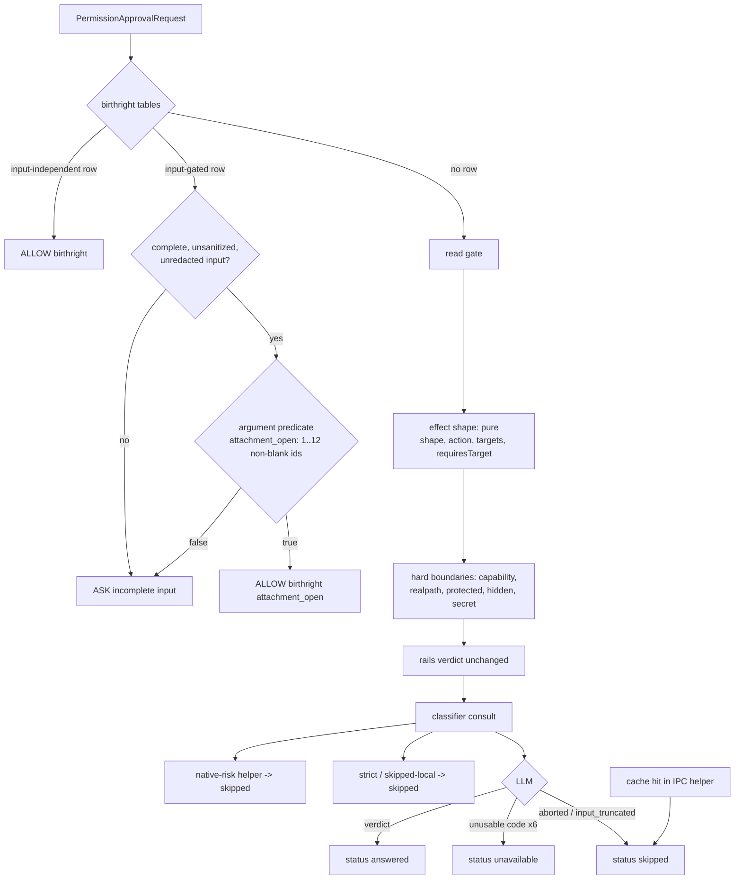

# ASKFLOOR-1-T2a — Shape classifier extraction, attachment birthright, judge status

## Problem
Three seams block the rest of the story. (1) `shared/auto-permission-read-only-gate.ts` exposes ONE function, `evaluateAutoPermissionReadOnlyGate`, whose file-read path (`evaluateFileRead`, `:248-308`) couples the verb/argument read-only SHAPE with the capability boundary, realpath containment, protected-path mentions (`allProtectedPathMentions`, `tool-execution-protected-paths.ts:25-102`), hidden-segment and secret checks — so no caller can ask "is this a read-only shape?" without also asking "is it inside the workspace?" (that coupling is why an out-of-root read yields no reusable kind for T3's memory and why T2b's native-write judgment has no containment helper to share). (2) Opening an attachment the owner just sent costs a card: `attachment_open` is not in the rails' birthright tables (`domain/permission-deterministic-rails.ts:51-101`), although the host handler already validates conversation origin server-side (`jobs/ipc-attachment-open-handler.ts:43-84`; resolver `application/attachments/attachment-resolver.ts:167-186`; not-found copy `attachment-failure.ts:4-5`). (3) `runtime/permission-classifier.ts` returns a result whose `failureCode` (`:58-66,92-99`) is absent on the native-risk (`:327-330,354-355`), strict-deterministic (`:341-353`), skipped-local (`:304,339-340`) and LLM-success (`:240-246`) branches, so "judge unavailable" is not derivable — T6's outage latch needs a typed status stamped at every branch.

## Scope / Non-goals
In: two NEW shared modules extracted from the read gate — a pure effect-shape classifier and a hard-boundaries evaluator — with the gate becoming their thin composition and every caller (rails `:149-158`, classifier `:305-314,341-356`) behaving byte-for-byte as today; the `attachment_open` input-gated birthright row (the ONLY rails row this story adds; T1 owned the `unsupported_meta_executor` signal per A-0070) with a typed per-tool argument predicate so a malformed `attachment_ids` still asks; a closed `PermissionClassifierStatus` stamped at every classifier branch, with the native-risk branch moved into a named helper file that T2b then owns; the AF-AC8 S1 fixture. Out: any change to gate/rails VERDICTS (pinned by the existing suites), the default-allow risk table and native Write/Edit path judgment (T2b), consuming the status (T6), the inline consult's silent skip (T6), memory kinds (T3), the attachment handler and resolver (unchanged; their origin validation is the safety property and is already pinned by `ipc-attachment-open-handler.test.ts` and `attachment-resolver.test.ts:304-348`).

## Acceptance Criteria
- T2a-AC1: `attachment_open` whose request input is COMPLETE, UNSANITIZED, UNREDACTED and well-SHAPED — `attachment_ids` an array of one to twelve strings, each non-blank after trim — is an input-gated birthright in the deterministic rails, so such a request never asks in ask, auto, auto_strict or autonomous mode (rails are mode-blind; the S1 fixture replays all four lanes at 0 taps). The rails judge SHAPE on the request's display copy `toolInput` (always present) AFTER today's completeness, sanitization (`permission-deterministic-rails.ts:125`) and redaction (`:264`) checks, which stay byte-for-byte for every input-gated row including this one; therefore an id the sanitizer shortened (over 500 characters, `runtime/ipc-tool-input-sanitization.ts:6,64`) or redacted (token-like, `:11,55`) ASKS — an accepted limit consistent with the spec's "a malformed id asks" (AF-AC2) and decision 0154: today's generated ids are short (`message-attachment:…`, `canonical-message-attachments.postgres.ts:54-80`) and no bound is claimed for future formats; if a host-valid id ever trips sanitization, that is a separately scoped sanitization change, not a rails exemption. No veto exemption, no length rule, no change to `runtime/ipc-parsing.ts`, no dependence on `classifierToolInput`. Origin stays host-validated, unchanged: an id that fails conversation-origin validation (`ipc-attachment-open-handler.ts:43-84`, resolver `attachment-resolver.ts:167-186`) returns the existing not-found line "I couldn't find that attachment in this conversation." — never a card; the handler and its tests are untouched. A missing, empty, more-than-twelve, blank, non-string, shortened or redacted list asks with the rails' existing input-gated ASK outcome.
- T2a-AC2: a pure effect-shape classifier (`shared/permission-effect-shape.ts`) classifies ONE PARSED LEAF at a time with a pure context `classifyPermissionEffectShape(leaf, { stdinOk })` — `stdinOk` is the compound/pipeline fact the gate already derives per leaf (standalone leaves get `false`, compound leaves `true`, `auto-permission-read-only-gate.ts:129,164`) and is what `requiresTarget` depends on, since `BashCommandLeaf` carries no compound context (`bash-command-parser.ts:14`) — covering the verb/argument shape logic INCLUDING `grepFileArgs` (`:429-468`, which moves into the shape module) and the native file-read shape, returning a DISCRIMINATED result `{ kind: read_only_command, executable, targets } | { kind: file_read, action, targets, requiresTarget } | { kind: not_read_only, reason }`, computed without any filesystem, capability or workspace input; the gate RETAINS, verbatim: compound orchestration over the ordered leaves (`:120-140`), the whole-command raw guards at `:115-122` and `:149-150` (protected-path and secret MENTIONS scanned over the command text before any target is discarded, e.g. `grep settings.yaml README.md` is refused on the mention), and the MCP read-binding branch (`:159,311`); a hard-boundaries evaluator (`shared/permission-hard-boundaries.ts`) owns the TARGET-level checks from the file-read path (`:248-308`: capability boundary, realpath containment, protected-path, hidden-segment and secret on each target); `evaluateAutoPermissionReadOnlyGate` composes leaf shape → target boundaries inside its unchanged orchestration with EXACT result-and-reason parity, pinned by the existing suite plus explicit parity leaves in the composition test for (i) a standalone `cat` versus the same leaf inside `cat | wc -l`, (ii) a compound command, and (iii) a non-target protected mention (`grep settings.yaml README.md`) — the existing `:342-346` case is the workspace-root one and is not the mention proof.
- T2a-AC3: `PermissionClassifierResult` carries a REQUIRED closed `status` (`domain/permission-classifier-status.ts`: `answered | unavailable | skipped`): only a successful LLM verdict is `answered`; `llm_unconfigured timeout model_resolution_failure query_error parse_failure validation_failure` are `unavailable`; `aborted`, `input_truncated`, the native-risk, strict-deterministic and skipped-local branches are `skipped`; the native-risk branch lives in the named helper `runtime/permission-classifier-native-risk.ts` with an unchanged verdict; the cache-hit result constructed in `runtime/ipc-permission-classifier-decision.ts` (`:293`, the one constructor outside the classifier file) is stamped `skipped` (a replayed verdict is neither a fresh answer nor an outage).
- T2a-AC4: AF-AC8 S1 — opening an attachment already in the conversation — replays at 0 taps in every lane through T1's harness (`TapBudgetFixture` already carries `toolName` + `toolInput`, `askfloor-tap-budget-harness.ts:11,55`; the harness is NOT edited and is not in scope), added as a fixture without editing T1's leaves.
- T2a-AC5: existing unit and Postgres integration suites pass; tsc and check:architecture green (AF-AC7).

## Technical Approach
1. **Shape / boundaries split.** `shared/permission-effect-shape.ts` exports the closed enum `PermissionEffectShape` (`read_only_command | file_read | not_read_only`) and, in the same small module, the pure per-leaf function `classifyPermissionEffectShape(leaf, { stdinOk })` returning the discriminated result of AC2, built from the gate's existing verb/argument logic (`auto-permission-read-only-gate.ts:79-105`, `grepFileArgs` `:429-468`, and the parsed `fileArgs` of `:248-308`) — no filesystem, no capability ids, no workspace root; `stdinOk` is passed by the orchestration exactly as today (`:129,164`) and `requiresTarget` is derived from it inside the classifier. NOT moved (they stay in the gate verbatim): compound orchestration over ordered leaves (`:120-140`), the whole-command raw guards at `:115-122` and `:149-150` (protected/secret mentions), and the MCP read-binding branch (`:159,311`). `shared/permission-hard-boundaries.ts` exports `evaluateReadHardBoundaries({ action, targets, requiresTarget, capabilityIds, workspaceRoot }) → { allowed, reason }` holding the per-target capability boundary, realpath containment, protected-path, hidden-segment and secret checks verbatim from the file-read path. The gate keeps its signature and result; inside its unchanged orchestration each leaf becomes `shape → boundaries`; its two callers are untouched. Result and reason strings stay byte-identical (existing tests assert them; the new module leaves carry the moved cases; two explicit parity leaves cover a compound command and a non-target protected mention). File naming: the new modules follow the existing sibling convention in `apps/core/src/shared` (`kebab-case.ts`, no dotted role suffix, e.g. `permission-trusted-paths.ts`) — a deliberate, repo-wide deviation from the constitution's suffix table (`pnp-coding-standards-modular-monolith.md:22-54`), recorded here rather than introducing a lone `.helper.ts`. Rejected simpler shape: leaving the gate as-is and having T3a re-derive "read-only kind" from the parser — a second read-only classifier would drift from the rails' one (0043: one deterministic fact source).
2. **Attachment birthright.** Add `attachment_open` to the INPUT-GATED birthright set (`permission-deterministic-rails.ts:51-101`) and introduce ONE typed predicate map beside it, `INPUT_GATED_BIRTHRIGHT_ARGUMENT_PREDICATES: ReadonlyMap<string, (input: Record<string, unknown>) => boolean>`, consulted by the input-gated evaluation (`:110-142`) against the request's display copy `toolInput` AFTER today's completeness, sanitization (`:125`) and redaction (`:264`) checks, which stay byte-for-byte for every row including this one; its single entry validates `attachment_ids` as an array of 1..12 strings, each non-blank after trim. Predicate false → the existing input-gated ASK path (same typed signal and reason shape as an incomplete input today). The rails have no mode input, so every mode is covered by construction; the S1 fixture proves the four lanes end-to-end. Origin is not a permission matter: the handler answers not_found for foreign ids (untouched). Rejected shapes: (a) an exemption letting a predicate pass override the sanitization/redaction vetoes — it would turn a shortened 513-character id into a tool error and contradict AF-AC2's "a malformed id asks" (grill r4); (b) threading the raw input or shape metadata through `ipc-parsing.ts` — more surface for a theoretical shape no real id has.
3. **Typed status.** `domain/permission-classifier-status.ts` exports the closed enum `PermissionClassifierStatus`. `PermissionClassifierResult.status` becomes REQUIRED; the type is named only in `runtime/permission-classifier.ts`, but ONE structural constructor exists outside it — the cached-verdict result in `runtime/ipc-permission-classifier-decision.ts:293` (a T1 file, edited here for exactly that constructor) — which stamps `skipped`; test stubs are untyped. `failedResult` (`:642-658`) maps the six unusable codes to `unavailable` and `aborted`/`input_truncated` to `skipped`; the strict-deterministic (`:341-353`), skipped-local (`:339-340`) and native-risk branches stamp `skipped`; the LLM success path (`:240-246`) stamps `answered`. The native-risk branch (`:327-330,354-355`) moves to `runtime/permission-classifier-native-risk.ts` exporting `evaluateNativeRiskBranch(input) → PermissionClassifierResult | undefined` with the verdict unchanged — T2b later passes tool arguments into that helper without touching the classifier file. `TODO(T6)`: the status is stamped but not yet read (T6 adds the latch and the wiring-missing `unavailable`).
4. **S1 fixture.** `askfloor-tap-budget.test.ts` gains one leaf that replays an `attachment_open` request with a well-shaped id list through `replayPermissionRequest` for each of the four lanes and asserts 0 taps and `decidedBy` from the rails birthright; the harness already accepts `toolName` + `toolInput` and is not touched.
5. **Tests.** New `permission-effect-shape.test.ts` and `permission-hard-boundaries.test.ts` (one leaf each plus the moved cases); `auto-permission-read-only-gate.test.ts` unchanged except one composition leaf; rails tests gain the two attachment leaves and one "unchanged after the split" leaf; classifier tests gain the three status leaves and the helper leaf.

## Decisions
Load-bearing, unchanged: 0043 (deterministic facts in rails, risk in classification — the birthright is a deterministic fact: host-validated origin), 0052 and 0121 as amended by 0154 (the attachment birthright in every mode), 0054/0107 (typed provenance). No new decision.

## Surface Impact
Runtime behaviour: `attachment_open` of an attachment already in the conversation stops asking in every mode; nothing else changes. API/schema/UI: unchanged by design (tool schema and handler untouched). Docs: none. Tests: changed as listed.

## Task Decomposition
Single task; depends on T1 (lanes, harness). Write scope: `shared/auto-permission-read-only-gate.ts`, NEW `shared/permission-effect-shape.ts`, NEW `shared/permission-hard-boundaries.ts`, `domain/permission-deterministic-rails.ts` (birthright row + predicate map only), NEW `domain/permission-classifier-status.ts`, `runtime/permission-classifier.ts`, NEW `runtime/permission-classifier-native-risk.ts`, `runtime/ipc-permission-classifier-decision.ts` (the cache-hit constructor only); tests: `test/unit/runtime/ipc-permission-classifier-decision.test.ts` (one cache-hit status leaf), `test/unit/shared/auto-permission-read-only-gate.test.ts`, NEW `test/unit/shared/permission-effect-shape.test.ts`, NEW `test/unit/shared/permission-hard-boundaries.test.ts`, `test/unit/shared/permission-deterministic-rails.test.ts`, `test/unit/runtime/permission-classifier.test.ts`, `test/unit/runtime/askfloor-tap-budget.test.ts` — fifteen files (eight source, seven test). `user_facing: false`.

## Risks
Verdict drift during the split — mitigated by keeping reason strings and the gate signature identical and by the existing suites as the oracle. Birthright over-reach — the predicate gates on shape only; origin stays host-validated; a malformed list still asks. Required `status` breaking callers — the type is file-local today; the compiler is the check.

## Workflow
What moves through this task: one permission request for an MCP tool call or a shell command, from the IPC request through the deterministic rails to a verdict, and one classifier consultation from its branches to a typed result. This task starts at the rails' birthright tables and the read gate's inputs and stops at the rails verdict and the classifier result; the IPC tail's merge, the memory stages and the outage latch are other tasks.

## Manual Verification
1. In a Telegram DM with the agent in `permission_mode: auto`, send any image or file, then ask "what's in the attachment I just sent?". Observe: the agent opens it and answers with no permission card.
2. Repeat step 1 with the agent's permission mode set to `ask` and then `auto_strict`. Observe: still no card for the attachment open.
3. Forward an attachment from a different chat and ask the agent to open it by that id. Observe: the reply "I couldn't find that attachment in this conversation." and no card.
4. Ask the agent to run `cat README.md` in its workspace. Observe: allowed as before with no card (read gate unchanged).
5. Ask the agent to run `cat ~/.ssh/config`. Observe: a card, as before (hard boundaries unchanged).
6. With the classifier's model unconfigured (`memory.llm` unset in settings), ask for a command outside the trusted roots. Observe: the card appears exactly as today. The typed status is internal in T2a (the runtime event payload is unchanged and its exact-payload test stays as is, `permission-classifier.test.ts:1689`); T6 makes it visible in chat.

## Verify Plan
`python3 factory/scripts/verify.py` (authoritative; gate environment); `npx tsc --noEmit`; `npm run check:architecture`; the twelve required leaf tests via `VITEST_JUNIT=1 npx vitest run -c vitest.unit.config.ts <path> -t <id> --outputFile=<report>`; the Postgres integration lane (`npm run test:integration:postgres` with `GANTRY_TEST_DATABASE_URL` exported) is run by the orchestrator as stage evidence, as for T1 — T2a touches no storage code, and two pre-existing suites are red on base/origin/main independent of this story (tracked as a main quickfix before T3a).
