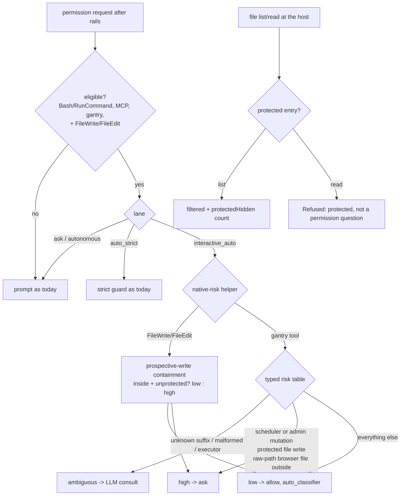

# ASKFLOOR-1-T2b — Default-allow risk table for gantry-native tools

## Problem
Gantry-native tools are judged by IDENTITY in `application/permissions/gantry-tool-risk.ts:59-166`: `gantryToolDefaultRisk(toolName)` maps a suffix to `low | medium | high` with no argument input, every namespaced-but-unknown suffix is HIGH (`:101-107`), `file` is HIGH by identity, every mutating `browser_*` tool is HIGH, and its only production caller `evaluateNativeRiskBranch` (`runtime/permission-classifier-native-risk.ts:6-21`, extracted by T2a) receives `{ canonicalToolName, inputTruncated, yoloDenylistHit, requestFamily }` — never the arguments, although the classifier has built `classifierToolInput` just before (`permission-classifier.ts:302,331`). So in interactive auto a browser click, a virtual-store file read or an attachment materialize asks, while the OWNER RULING (spec AF-AC1, 2026-09-03) is the opposite posture: every gantry-native tool auto-allows by default and only a CLOSED set of high-risk rows asks. Two more gaps block the ruling: native `Write`/`Edit` never reach argument-aware logic because the eligibility gate (`application/permissions/permission-classifier.ts:11-28`) accepts only `Bash`/`RunCommand`, MCP names and bare gantry names — and the names that arrive are the facade ids `FileWrite`/`FileEdit` (`shared/gantry-tool-facades.ts:64-76`); and the `file` host handler enforces no entry protection on `list`/`read` (`jobs/ipc-file-artifact-handlers.ts:109-175`), which the default-allow posture relies on.

## Scope / Non-goals
In: ONE small typed risk table replacing the identity model (default LOW for every registered gantry tool; the closed high-risk rows; `ambiguous` for unknown names, malformed shapes and the owner-ruled generic executors); the native-risk helper receives the arguments and the lane and applies the table under `interactive_auto` only; the eligibility gate widened for exactly the two native file-write facades; a prospective-write containment helper shared by native Write/Edit and the browser raw-path file actions; host-side entry protection in the `file` handler's `list` and `read`; the AF-AC8 S-scenario fixtures for the table. Out: rails (no row, no signal — T2a's `attachment_open` birthright already runs before the classifier), `auto_strict`/`ask`/job verdicts (byte-identical, pinned), the LLM classifier prompt, the browser artifact policy's runtime behaviour (`browser-artifact-policy.ts` unchanged — the permission predicate mirrors its shape), decision memory (T3), the outage latch (T6), `deepagents-shell-filesystem-guard.ts`, `send_message` (0052 birthright in the rails; no destination-bearing variant exists — principle only).

## Acceptance Criteria
- T2b-AC1: `application/permissions/gantry-tool-risk.ts` is ONE typed table. The verdict type is the closed `GantryToolRiskVerdict = low | high | ambiguous` (the old `medium` and the identity HIGH-by-default are gone; `GantryToolRisk` keeps its name only if the enum is replaced in place — no parallel type). Input is `{ toolName: GantryMcpToolName-or-string, toolInput: unknown }`. Rules, in order: (1) a suffix not in `ALL_GANTRY_MCP_TOOL_NAMES` (`shared/admin-mcp-tools.ts:206-215`) → `ambiguous`; (2) the CLOSED HIGH-RISK rows → `high`: scheduler mutations = `SCHEDULER_MUTATION_MCP_TOOL_NAMES` (`:32-39`, incl. pause/resume/run_now); admin mutations = the registry's mutation exports `AUTHORITY_CHANGING_GANTRY_MCP_TOOL_NAMES`, `DECISION_ACTOR_GANTRY_MCP_TOOL_NAMES`, `DURABLE_GRANT_EXCLUDED_DISPATCHERS` and `DELEGATION_DISPATCHERS` (`:129-177`), IMPORTED, never restated; destructive or protected writes = `file` `write`/`promote_scratch` whose virtual target is protected or `protected: true`, and `browser_act` `file_attach`/`file_upload` whose payload source is a raw filesystem path (`paths`, or `source.type === "path"`) outside the workspace, protected or secret (AC3 helper); (3) OWNER RULING 2026-09-05: the generic executors `async_run_command`, `async_mcp_call`, `mcp_call_tool`, `capability_run` → `ambiguous` (the classifier judges them with their arguments; never forced HIGH, never LOW); (4) argument-shaped rows: `file` per-action discriminated predicate — `list` (`scope` + optional `path`, `limit`) → `low`; `read` (`artifactId` + optional `version`, or `scope` + `path`, + optional `offset`, `readLimit`) → `low`; `write` (`scope` + `path` + `content` + optional `encoding`, `contentType`, `protected`) → `low` to an unprotected virtual path without `protected: true`, else `high`; `promote_scratch` (`path` + `targetScope` + `targetPath`) → same rule on the target; any other shape → `ambiguous`; `browser_act` `file_attach`/`file_upload` with a raw-path source inside the workspace → `low`, artifact- or bytes-sourced `file_upload` → `low`, malformed → `ambiguous`; (5) every other registered tool → `low` (all remaining `browser_*` actions, `file` list/read, scheduler/admin READS, attachment tools, canvas, render, memory, brain, procedure, task reads and cancel). Exhaustive table test: every suffix in `ALL_GANTRY_MCP_TOOL_NAMES` is asserted with a valid shape and, for the argument-shaped rows, a malformed shape; the registry-import rows are asserted by iterating the imported sets, so a registry addition is covered without editing the test.
- T2b-AC2: the table is applied under lane `interactive_auto` ONLY. `evaluateNativeRiskBranch` (`runtime/permission-classifier-native-risk.ts`) gains `toolInput` (the classifier copy the caller already holds, `permission-classifier.ts:302`), `workspaceRoot` and `lane: PermissionLane`; under `interactive_auto` it returns `low` → the existing native `allow` result (`status: skipped`, provenance unchanged: `decidedBy`/`source` `auto_classifier`), `high` → the existing native ask result, `ambiguous` → `undefined` (LLM consult continues); under every other lane it returns exactly what it returns today. The lane is derived once in the classifier from `permissionMode` + `hostJobId` with T1's derivation (`application/permissions/auto-lane-analysis.ts:97-114` — reused, not re-implemented); the classifier input gains `hostJobId` if it does not carry it, and the inline live consult (`app/bootstrap/inline-agent-loop-tools.ts:389-445`) passes its job id so an inline SCHEDULED run in auto mode derives `autonomous` and never sees the table (the T2b lane-leak fix; the inline memory/latch work stays T3b/T6). `auto_strict` keeps the strict guard's precedence (`permission-classifier.ts:348-364`); `ask` and job lanes never reach the branch (IPC `:325-383`). Explicit tests: the same `browser_act` click fixture allows under `interactive_auto`, asks under `auto_strict`, and is never consulted under `ask`/`autonomous`; an inline run with a job id derives `autonomous`.
- T2b-AC3: NEW `application/permissions/native-file-write-risk.ts` exports `judgeNativeFileWrite({ toolName, toolInput, workspaceRoot })` → `low | high | ambiguous` for the native file-write facades (`FileWrite`/`FileEdit` — the ids the gate receives from both runners, `shared/gantry-tool-facades.ts:64-76`; argument key `file_path` from the Anthropic runner, `path` from the deepagents facade, `gantry-facade-tools.ts:110-132,160-189` — both accepted, both pinned) and the shared prospective-write containment predicate `isProspectiveWriteInsideWorkspace(workspaceRoot, candidatePath)`: lexical containment after normalisation, the nearest EXISTING ancestor realpath-contained, no symlink component or symlink target (`lstat`), a non-existent target allowed; protected/hidden/secret destinations refused via the existing capability-path predicates (`shared/tool-execution-protected-paths.ts:40-102`) — the same helper the AC1 browser raw-path row uses; `gantry-facade-file-safety.ts:39-67` stays the execution-time authority and is not imported (it is async, config-bound and creates directories). The eligibility gate (`application/permissions/permission-classifier.ts:11-28`) accepts exactly `FileWrite` and `FileEdit` in addition to today's predicates; the native-risk helper routes those two ids to `judgeNativeFileWrite` and every gantry name to the table. Tests: inside the workspace → allow with no LLM call; outside, protected (`settings.yaml`), hidden segment, secret name, symlinked parent, symlinked target → ask; missing target inside → allow; malformed input → ambiguous → LLM consult; a third facade id (`FileRead`) stays ineligible.
- T2b-AC4: host-side entry protection in `jobs/ipc-file-artifact-handlers.ts`: ONE `(scope, path)` predicate `isProtectedArtifactEntry` combining the generic virtual protection (`domain/file-artifacts/protected-virtual-path.ts:23-57`, which excludes `AGENTS.md` by design) with the prompt-profile scope's own protection (`isAgentProfileArtifactWrite`, so `prompt-profile/**/AGENTS.md` and `SOUL.md` stay hidden), applied during `list` (protected descriptors filtered out; the response gains `protectedHidden: number`) and after id resolution for `read` (a protected entry is rejected through the existing `reject(error, code)` convention with code `protected_entry` and message `Refused: <path> is protected. This is not a permission question — don't retry, tell the owner.`); the runner tool `runner/mcp/tools/file.ts` appends `(N protected entries hidden — not a permission question, don't retry.)` to the `list` text when `protectedHidden > 0` and relays the refusal text unchanged. Tests: ordinary-scope counter-tests (nothing hidden, `protectedHidden: 0`, no suffix line), a protected `settings.yaml` hidden from list and refused on read by id and by path, `prompt-profile/AGENTS.md` hidden and refused, `write`/`promote_scratch` protection unchanged.
- T2b-AC5: AF-AC8 fixtures through T1's `replayPermissionRequest`: S2 (browser action in interactive auto), S4 (`file` read by path), S5 (`file` write to an unprotected virtual path), S6 (native `FileWrite` inside the workspace) each cost 0 taps with `decidedBy: auto_classifier` and NO LLM call (the fixture's stubbed consult must not be invoked); the mirror fixtures — `file` write to `settings.yaml`, `FileWrite` outside the workspace, `scheduler_delete_job`, `browser_act file_attach` with a path outside the workspace — cost 1 tap; the same four S-fixtures under `auto_strict`, `ask` and `autonomous` produce today's outcome (pinned by value).
- T2b-AC6: existing unit suites pass with every verdict of `ask`, `auto_strict` and job lanes unchanged (a changed expectation in an existing test outside `gantry-tool-risk.test.ts` is a defect); tsc and check:architecture green (AF-AC7).

## Technical Approach
1. **Table.** Rewrite `gantry-tool-risk.ts` as data: a `ReadonlyMap<GantryMcpToolName, RowRule>` is over-built — the rules are five ordered predicates over the registry sets plus two argument-shaped rows, so the module is ~120 lines: `knownGantryTool(suffix)`, the imported HIGH sets, `EXECUTOR_TOOLS` (the four owner-ruled suffixes, a `ReadonlySet`), `judgeFileTool(input)`, `judgeBrowserFileAction(input, workspaceRoot)`, and `gantryToolRisk({ toolName, toolInput, workspaceRoot })`. `gantryNativeCanonicalToolName` stays. Shape validation reuses the tools' own zod schemas where exported (`runner/mcp/tools/file.ts:12-62`; browser payload from `shared/browser-backend-actions.ts`) — a shape that fails its schema is `ambiguous`, never `high`. Rejected: keeping `medium` (nothing downstream distinguishes it — `coordinatePermissionClassifierRisk` treats low and medium alike, `permission-decision-coordinator.ts:92-100`); a per-verb browser matrix (owner simplification ruling: every browser action LOW except the raw-path file predicate).
2. **Helper + lane.** `evaluateNativeRiskBranch` input grows by `toolInput`, `workspaceRoot`, `lane`; the classifier derives `lane` via the T1 function from `input.permissionMode` and `input.hostJobId`; `hostJobId` is added to the classifier input type and threaded from IPC (already known there, `ipc-permission-classifier-decision.ts:82-135`) and from the inline consult. Under `interactive_auto`: `FileWrite`/`FileEdit` → `judgeNativeFileWrite`; gantry names → the table; `low`/`high` → the existing native result constructors; `ambiguous` → `undefined`. Other lanes → the branch's current behaviour verbatim (the T2a helper test keeps pinning `memory_save` there; under `interactive_auto` `memory_save` is now `low` — the ONE expectation that legitimately changes, in the helper's own test).
3. **Prospective containment.** `native-file-write-risk.ts` is async (it must `lstat`/`realpath`) but takes only `(workspaceRoot, candidatePath)`; the effect-shape/hard-boundaries split from T2a is not reused because those check EXISTING read targets (realpath of the file), whereas a write target may not exist. Symlink rule mirrors `gantry-facade-file-safety.ts:88-132` by test, not by import.
4. **Host entry protection.** The predicate lives beside the handlers (one exported function in the handler module or `domain/file-artifacts/protected-virtual-path.ts` if it stays pure — it is pure: scope + path strings). `list` filters and counts; `read` refuses after resolution (by id or by scope+path). The runner tool renders the count line and relays the refusal (it already relays `reject` messages).
5. **Fixtures.** `askfloor-tap-budget-harness.ts` already accepts `toolName`/`toolInput` and stubs the consult; T2b adds a `workspaceRoot` fixture field and asserts the stub was not called for the S2/S4/S5/S6 fixtures.
Naming follows the sibling convention in `apps/core/src/application/permissions` and `apps/core/src/shared` (kebab-case, no dotted role suffix), the recorded repo-wide deviation from the constitution suffix table.

## Decisions
Load-bearing, unchanged: 0043 (deterministic facts in rails, risk in classification — the table is classification, lane-gated), 0052 (`send_message` birthright), 0121 (no classifier on autonomous runs — the lane gate and the inline `hostJobId` fix uphold it), 0154/0155. Owner rulings recorded in the spec (AF-AC1 default-allow posture; AF-AC2 file predicate) and in `plans/exploration/askfloor-1-t2b-seam-map-2.md` (executors → ambiguous). No new decision.

## Surface Impact
Runtime: in interactive auto, browser actions, `file` list/read/unprotected writes, attachment tools, canvas/render/memory writes and native file writes inside the workspace stop asking; scheduler/admin mutations, protected writes, out-of-workspace or raw-path-outside writes still ask; executors and unknown tools go to the judge. Host: `file list` hides protected entries and reports the count; `file read` of a protected entry returns the fixed refusal. Other modes: unchanged. No schema, migration or UI change.

## Task Decomposition
Single task; depends on T2a. Write scope (source): `application/permissions/gantry-tool-risk.ts`, NEW `application/permissions/native-file-write-risk.ts`, `application/permissions/permission-classifier.ts`, `runtime/permission-classifier-native-risk.ts`, `runtime/permission-classifier.ts` (lane derivation + `hostJobId` on the input, the helper call site only), `runtime/ipc-permission-classifier-decision.ts` (thread `hostJobId`/`workspaceRoot` into the consult, one call site), `app/bootstrap/inline-agent-loop-tools.ts` (pass the job id into the consult, one call site), `jobs/ipc-file-artifact-handlers.ts`, `domain/file-artifacts/protected-virtual-path.ts` (the combined entry predicate, if placed here), `runner/mcp/tools/file.ts`; tests: `test/unit/application/gantry-tool-risk.test.ts` (rewritten, exhaustive), NEW `test/unit/application/native-file-write-risk.test.ts`, `test/unit/application/permission-classifier.test.ts`, `test/unit/runtime/permission-classifier.test.ts`, `test/unit/runtime/ipc-permission-classifier-decision.test.ts`, `test/unit/jobs/ipc-file-artifact-handlers.test.ts`, `test/unit/runner/mcp/file-tool.test.ts` (or the existing file-tool suite), `test/unit/runtime/askfloor-tap-budget.test.ts`, `test/unit/runtime/askfloor-tap-budget-harness.ts` — 19 files (10 source, 9 test). `user_facing: false` (the owner's live tap-test follows the merge).

## Risks
Default-allow over-reach: mitigated by the closed HIGH rows importing the registry sets, the owner-ruled executor row, `ambiguous` (not LOW) for anything unrecognised, and the lane gate. Lane leak to inline scheduled runs: closed by threading `hostJobId`; pinned by test. Prospective containment drift from execution semantics: mirrored by test against the facade safety cases. Handler protection surprising the agent: the fixed texts say "not a permission question" so the agent never waits for a card.

## Workflow
What moves through this task: one permission request for a gantry-native tool call or a native file write, from the classifier's native-risk branch to a verdict, plus one `file` list/read request through the host handler. It starts after the deterministic rails (T2a's birthrights already ran) and stops at the native-risk verdict or the LLM consult; memory (T3) and the outage latch (T6) are other tasks.

## Manual Verification
1. In a Telegram DM with the agent in `permission_mode: auto`, ask it to open a web page and click a link (`browser_act`). Observe: no permission card.
2. Ask it to list and read a file from its virtual store (`file list` then `file read`). Observe: no card; a protected entry such as `settings.yaml` is absent from the list with the "(N protected entries hidden …)" line, and reading it by path returns the "Refused: … is protected …" text without a card.
3. Ask it to write a note into its virtual store (`file write` to an unprotected path). Observe: no card. Ask it to write to `settings.yaml`. Observe: a card.
4. Ask it to create a file inside its workspace (native Write). Observe: no card. Ask it to write to `~/.ssh/config`. Observe: a card.
5. Ask it to delete a scheduled job. Observe: a card, as before.
6. Switch the agent to `auto_strict` and repeat step 1. Observe: a card, as before.

## Verify Plan
`python3 factory/scripts/verify.py` (authoritative; gate environment); `npx tsc --noEmit`; `npm run check:architecture`; the required leaf tests via `VITEST_JUNIT=1 npx vitest run -c vitest.unit.config.ts <path> -t <id> --outputFile=<report>`; the Postgres integration lane (`npm run test:integration:postgres`, `GANTRY_TEST_DATABASE_URL` exported) is orchestrator-run stage evidence as for T1/T2a — T2b touches no storage code; the 4 pre-existing reds on origin/main are tracked as a main quickfix before T3a.
