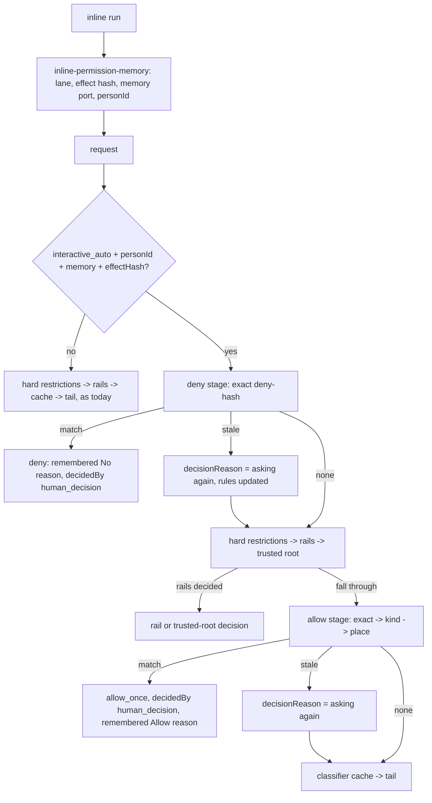

# ASKFLOOR-1-T3b — Memory consult in the coordinator and the inline runtime

## Problem
T3a stores a person's remembered Allow/No (`human_decision` rows, PR #484) but nothing reads them. The coordinator already reserves the two stages by name — `exact_remembered_deny` (a no-op before `hard_restrictions`, `runtime/permission-decision-coordinator.ts:46-56,102`) and `remembered_allows` (a no-op after the rails and the trusted-root stage, `:213`) — and T1's lane seam (`input.analysis?.lane`, `:58-84`) tells it which lane it is in. The inline live runtime (`app/bootstrap/inline-agent-loop-tools.ts:389-445`) calls the same coordinator with no lane, no effect hash, no memory port and no person id, so it can never consult. Decision 0154 fixes the order: an exact remembered No short-circuits everything, including hard restrictions; remembered Allows are consulted only after the non-overridable rails, exact → kind → place; `ask`, `auto_strict` and job lanes never consult.

## Scope / Non-goals
In: the two memory stages as ONE thin module the coordinator calls at its two slots; one person-scoped lookup on the port and repository; the `human_decision` provenance entry; the inline runtime's consult inputs (lane, effect hash, memory port, person id) via ONE new bootstrap module so the inline file stays under its 750-line ceiling; tests. Out: the remember WRITE and the card/callback path (T3c); job projection (T4); `/permissions` and card copy (T5); the outage latch (T6); trust-growth counting (T3a exposes it; T5a reads it); any rails or classifier change; the S2 tap-budget fixture (T3c).

## Acceptance Criteria
- T3b-AC1: LOOKUP. `PermissionDecisionMemoryRepository` gains `findHumanDecision({ appId, agentFolder, actingPersonId, candidates: Array<{ scope, scopeKey }>, railVersion })` → `{ row: PermissionDecisionMemoryRow; stale: boolean } | null` (the T3a row type; no narrowed type is introduced) (`domain/ports/permission-decision-memory.ts`; Postgres impl beside `listHumanDecisions`): ACTIVE rows only, person + app + folder scoped, `candidates` tried in the given order and the FIRST match returned; `stale: true` when the only matching row carries a `rail_version` other than `railVersion` (a rails bump: the row is reported but must not decide). Postgres tests: order respected across two candidates; another person's row never matches; a revoked row never matches; a stale-version row returns `stale: true`; no row → `null`.
- T3b-AC2: STAGE MODULE. NEW `runtime/permission-human-memory-stage.ts` exports `consultRememberedDeny(input)` and `consultRememberedAllow(input)` over `{ request, analysis, effectHash, workspaceRoot, canonicalRoot?, decisionMemory }`, both returning `PermissionApprovalDecision | undefined`; both return `undefined` immediately unless `analysis.lane === interactive_auto`, `request.personId` is non-blank, `decisionMemory` is present and `effectHash` is defined (0154/0118/0121: the classifier lanes never consult; no person, no memory). Candidate keys come ONLY from T3a's `deriveHumanDecisionScopeKey` (`application/permissions/human-decision-scope.ts`): deny = `{ exact, deny-hash }`; allow = `[{ exact, allow-key }, { kind, kind:tool:<canonicalTool> }, { kind, category-kind-key }, { place, place-key }]` in that order, each omitted when the derivation refuses (`ok: false`) — the two kind candidates come from the SAME derivation called with `trustGrowthTool: true` (yields `kind:tool:<canonicalTool>`, the key T3c writes for a trust-growth tool per 0154) and then `trustGrowthTool: false` (the category key); the stage never decides which tools are trust-growth, it consults both keys, and the stage leaf seeds a `kind:tool:<tool>` row that matches for that tool and misses for another. A matching deny → `denied(request, reason)` with `decidedBy: 'human_decision'` and reason `denied by your remembered No to this exact command (<YYYY-MM-DD from createdAt>) — /permissions to change`; a matching allow → `decisionForMode(request, 'allow_once', 'human_decision', 'machine')` with reason `allowed by your remembered Allow (<scope words>, <YYYY-MM-DD>) — /permissions to change` where scope words are `this exact action` / `this kind of action, anywhere` / `anything of this kind under <root>`; `stale: true` → no decision, and `request.decisionReason = 'Asking again — the safety rules were updated since you last decided this'` so the re-ask carries it; a memory-port failure (throw) → `undefined` after one `warn` (fail closed to the existing flow). Unit tests with a fake port: every guard, the candidate order, deny/allow reasons and provenance, stale re-ask line, port failure.
- T3b-AC3: COORDINATOR ORDER. `coordinatePermissionDecision` calls `consultRememberedDeny` at the `exact_remembered_deny` slot BEFORE `hardDenyReason`, locked preset and fixed image (`:102-123`), and `consultRememberedAllow` at the `remembered_allows` slot (`:213`) AFTER the rails and the trusted-root stage, passing that stage's canonical root when it produced one, and BEFORE the classifier-cache read; when the deny stage reported a STALE row (it set `request.decisionReason` to the stale line and returned no decision), the coordinator re-applies that stale line to `request.decisionReason` immediately before the classifier-cache read, so the reviewed-rule and rail stages (`:143`, `:200`) cannot leave a different reason on the re-ask; `CoordinatePermissionDecisionInput` gains `workspaceRoot?` (the IPC helper already resolves it, `runtime/ipc-permission-classifier-decision.ts:367-375`) — no other input changes; the stage order constant is unchanged and its pin (`test/unit/runtime/permission-decision-coordinator.test.ts:314-325`) still passes. `domain/permission-decision.ts` adds `human_decision: { source: 'human_decision', repeatableForFutureRuns: true }` to `PERMISSION_PROVENANCE_BY_DECIDER` (`:69-100`). Coordinator tests (fake port, seeded rows): `decisionForMode(request, 'allow_once', 'human_decision', 'machine')` yields `source: human_decision` with `repeatableForFutureRuns: true` (the provenance pin lives here — no domain-level suite exists for that map); a remembered No returns before a hard deny; a remembered Allow returns `decidedBy: human_decision` without the classifier tail or cache; kind and place candidates match when exact does not; `ask`, `auto_strict` and job lanes never call the port; a request without `personId` never calls the port; a stale file-write deny whose intermediate reviewed-rule or rail stage overwrote `decisionReason` still reaches the classifier tail carrying the stale line.
- T3b-AC4: INLINE PARITY. NEW `app/bootstrap/inline-permission-memory.ts` exports `inlinePermissionMemoryInputs({ run, laneInput, request, deps }) → { analysis?, effectHash?, workspaceRoot, decisionMemory?, personId? }`: lane `interactive_auto` only when `run.permissionMode === 'auto'` and `run.isScheduledJob !== true` (a job run yields lane `autonomous`; `auto_strict` / `ask` map to their lanes — through T1's `deriveAutoLaneAnalysis` (`application/permissions/auto-lane-analysis.ts:97`), never a second table), `effectHash` via `computePermissionEffectHash` with the resolved workspace root, `decisionMemory` from a NEW optional dep `getPermissionDecisionMemoryRepository()` on `InlineCoreToolHostDeps` (`inline-agent-loop-tool-types.ts:23-53`; `runtime-services.ts` already carries the repository getter through its `resolved` spread into the inline wiring (`:141-146,331-345`), so no `runtime-services.ts` edit is expected — the implementer raises a scope signal if the type does not flow), `personId = run.memoryUserId` for a non-scheduled run only. `inline-agent-loop-tools.ts` (at 739/750 lines — ONLY these edits) stamps `personId` on the request and spreads those inputs into its `coordinatePermissionDecision` call TOGETHER WITH the existing `skipClassifierVerdictCache: true` option, so supplying `effectHash` never lets a cached classifier Allow bypass today's inline classifier (the cache stays out of scope); its classifier tail is untouched. Tests: the inline suite's existing consult expectations unchanged; new cases: a seeded remembered Allow for the run's person short-circuits the inline classifier while `getClassifierVerdict` is never called; a scheduled run and a run without `memoryUserId` never consult; wiring test for the new dep; the typed fake in `test/unit/application/human-decision-memory-service.test.ts` gains `findHumanDecision` so it still satisfies the port.
- T3b-AC5: existing unit and Postgres suites pass; tsc and check:architecture green; `inline-agent-loop-tools.ts` stays ≤ 750 lines; no leftovers (the owner rule: no wrapper, shim, alias or "legacy" naming).

## Technical Approach
1. Port + repository lookup (one query, `IN` over the candidate keys, ordered by the caller's list; rail version compared in code so `stale` is cheap).
2. The stage module is the only place that knows the two orderings and the reason lines; the coordinator gains two calls and one optional input. Rejected: putting the consult inside the coordinator (it must stay thin — story plan contract shape) or inside the classifier consult (0043: authorization is not risk).
3. Provenance: one map entry; `decisionForMode` already routes machine deciders through the map.
4. Inline: one module that derives the four inputs; the inline file changes by a handful of lines.

## Decisions
0154 (order, scopes, reason lines), 0118 (person scope), 0121 (no consult on job lanes), 0043 (authorization stays deterministic), 0153 (jobs consume projections only — T4), 0155 (lane posture). Orchestrator rulings on the seam map's open questions: one ordered multi-candidate lookup; rail version only (the effect-schema version is inside the hash); port failure fails closed to the existing flow; a trusted-root decision wins because it runs first; dates render as `YYYY-MM-DD` from `createdAt`; on the inline path `run.memoryUserId` on a non-scheduled auto run is the DM signal (groups carry no memory person, 0118).

## Surface Impact
Runtime (interactive auto, DM): a remembered No short-circuits to a deny with the plan's reason; a remembered Allow (exact, kind, place) allows without the classifier; a rails bump re-asks with the plan's line. Other lanes unchanged. Inline live runs gain the same behaviour for the resolved person. No schema, migration or UI change.

## Task Decomposition
Single task; depends on T3a. Write scope: `domain/ports/permission-decision-memory.ts`, `adapters/storage/postgres/repositories/permission-decision-memory-repository.postgres.ts`, `domain/permission-decision.ts`, NEW `runtime/permission-human-memory-stage.ts`, `runtime/permission-decision-coordinator.ts`, NEW `app/bootstrap/inline-permission-memory.ts`, `app/bootstrap/inline-agent-loop-tool-types.ts`, `app/bootstrap/inline-agent-loop-tools.ts`; tests: `test/unit/application/human-decision-memory-service.test.ts` (typed fake gains the lookup), `test/integration/permission-decision-memory.postgres.integration.test.ts`, NEW `test/unit/runtime/permission-human-memory-stage.test.ts`, `test/unit/runtime/permission-decision-coordinator.test.ts`, NEW `test/unit/bootstrap/inline-permission-memory.test.ts`, `test/unit/bootstrap/inline-agent-loop-tools.test.ts` — 14 files. Budget 16 files / 1,600 lines. `user_facing: false`.

## Risks
Order regression: the deny consult must precede hard restrictions and the allow consult must follow the rails — pinned by the coordinator tests. Lane leak: every consult is gated on `interactive_auto` + person + memory — pinned. Inline ceiling: the file is at 739/750; the module split is the only safe shape. Reason drift: the two reason lines and the stale line are constants in the stage module, asserted verbatim.

## Workflow
One permission request enters the coordinator; with lane, person and memory present, the deny stage checks the exact hash before anything else; the rails and trusted root run; the allow stage tries exact, kind, place; otherwise the classifier cache and tail as today.

## Manual Verification
1. Seed a `human_decision` allow row for your person and an exact command via the T3a service in a REPL against the test database; in a DM in auto mode run that command: no card, the agent reports "allowed by your remembered Allow".
2. Seed a No for a command; run it: the agent reports the remembered-No refusal, no card.
3. Bump `RAIL_CATALOG_VERSION` in a scratch build: the next card says "Asking again — the safety rules were updated since you last decided this".
4. Repeat 1 in `auto_strict`: a card, as before.

## Verify Plan
`python3 factory/scripts/verify.py` with `GANTRY_TEST_DATABASE_URL` exported (the general lane is serial when set, T3a); `npx tsc --noEmit`; `npm run check:architecture`; the unit leaves through `vitest.unit.config.ts` and the Postgres leaf through `vitest.integration.postgres.config.ts`; `npm run test:integration:postgres`.
