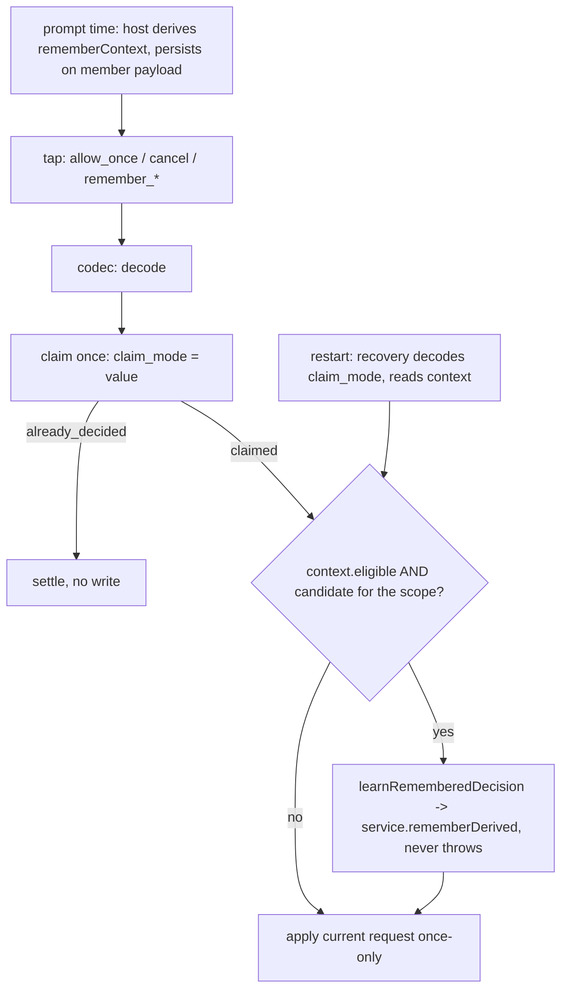

# ASKFLOOR-1-T3c — Remember settlement and learning writes

## Context
T3a stores remembered decisions (#484) and T3b consults them (#486), but nothing writes one from a real card tap. Today every provider card tap carries a scalar mode (`allow_once | allow_persistent_rule | cancel`), the durable claim persists that scalar (`schema/worker-coordination.ts:171`, a plain `text` column), recovery reconstructs a decision from it, and the human-resolution paths apply the current request and record nothing. T3c makes a structured `remember { outcome, scope }` tap flow through the closed codec set, persist via `HumanDecisionMemoryService.remember` exactly once per claim, and apply the current request as a once-only approval — only when the host-stamped eligibility AND a fresh lane re-derivation both hold. Seam map: `plans/exploration/askfloor-1-t3c-seam-map.md`; the round-1 grill (`askfloor-1-t3c-task-grill-answer.md`) and a follow-up exploration fixed the ownership, carriers, hook order and recovery path recorded below.

## Orchestrator rulings
1. **Durable representation:** a CLOSED set of four remember codes — `remember_allow_exact | remember_allow_kind | remember_allow_place | remember_deny_exact` — travels in the SAME slot that carries the scalar mode and is persisted verbatim in the claim's `claim_mode` text column. ONE application codec decodes a code (or a scalar) into `{ mode: PermissionApprovalDecisionMode; remember?: PermissionRememberResolution }`. The carrier types stay in `domain/types.ts` and widen LINE-NEUTRALLY: `PermissionRememberCode` is declared there on one line, `PermissionRecoveryEnvelope.renderedDecisionOptions` and `PermissionCallbackClaimIntent.mode` become `PermissionApprovalDecisionMode | PermissionRememberCode` on their existing lines, and the file's line count does not grow (join one existing two-line declaration) — no type move, no re-export. The Postgres prompt mapper validates BOTH `claim_mode` and every `renderedDecisionOptions` entry through the codec on read and refuses an unknown value (fail closed).
2. **Ownership:** T3c edits no file under `channels/` except the two codecs the story plan assigns it — `telegram/channel-shared.ts` (the longest code keeps a 36-character id within Telegram's 64-byte callback data) and `slack/permission-action-id.ts`; their shared parity owner is `test/unit/channels/provider-affordance-parity.test.ts`. Every provider handler and renderer is T5a's; until T5a no card emits a code.
3. **ONE host-derived `rememberContext`, bound at prompt time.** Because the durable request snapshot deliberately omits `toolInput`, no key can be derived at settlement or after a restart. So the host derives, ONCE, a validated `PermissionRememberContext = { eligible: boolean; lane; personId?; effectHash; effectSchemaVersion; railVersion; workspaceRoot?; canonicalRoot?; candidates: { deny: { scopeKey } | null; exact: { scopeKey; pathOnly } | null; kind: { scopeKey } | null; kindTool: { scopeKey } | null; place: { scopeKey } | null } }` through T3a's `deriveHumanDecisionScopeKey` (every variant, `trustGrowthTool` true and false, `place` only when a canonical root exists) — on the IPC path inside `runtime/ipc-permission-classifier-decision.ts` (which already holds the lane analysis, tool input, effect hash and the trusted-root canonical root) and returned alongside its ask result; on the inline path in `app/bootstrap/inline-permission-memory.ts` from `laneInput`/`run`/`request` (no canonical root: `place` stays null until T5a). `eligible` is `lane === interactive_auto && personId non-blank (0118: the host stamps a person only for a DM) && !isScheduledJob && !request.permissionBatch` (a batch prompt is never individual). The context is persisted on the host-owned pending-interaction member payload at creation (`ipc-interaction-processing.ts:171` → `durable-interaction-handler.ts:42` → `pending-interaction-durability.ts:87`, JSONB `payload_json`, no migration), read back by claim and by recovery, validated on read.
4. **Write-then-apply, fail-open (the story plan's order, `:160`, `:192`):** learning runs BEFORE the current request is applied, through the existing seams — IPC in `ipc-interaction-processing.ts` just before `applyPermissionInteractionDecision` (`:269`), inline in the existing `afterDecision` hook (`inline-agent-loop-tools.ts:483-543`, which runs before `finishDurablePermissionInteraction` applies), recovery in `pending-interaction-permission-callback.ts` just before the recovered apply (`:491`) — and it NEVER throws: a refusal or port failure logs one `warn` (`unlearned`) and the current request is applied as a once-only tap. Crash after learning, before application or settlement → recovery learns again → T3a's refresh keeps one active row; `already_decided` never reaches learning. No new hook.
5. **The write bypasses derivation:** `HumanDecisionMemoryService` gains `rememberDerived(dto)` — the same write path as `remember` (refusals, id, provenance, `putHumanDecision`) with the scope key and `pathOnly` supplied from the context instead of derived — so the settlement code never needs the request's tool input. Kind writes use the context's `kind` (category) candidate; `kindTool` and `place` candidates are persisted for T5a to select; a code whose candidate is null → `not_rememberable` with T3a's reason.
6. **Person:** the acting person is the context's host-stamped `personId` (never a callback identity); label `undefined`. Blank person ⇒ `eligible` is false ⇒ nothing persists.
7. **Composition root:** recovery's `learn` dependency is threaded through `pending-interaction-durability.ts:47` and configured where the durability backend is built, `adapters/storage/postgres/runtime-store.ts:127`, over the decision-memory repository; the IPC settlement helper (`runtime/permission-remember-settlement.ts`) and the inline module use the same application helper; one production-wiring case in `test/unit/adapters/runtime-store.test.ts`.

## Scope / Non-goals
In: codec module; the type move; the two owned codecs; the durable path (member payload stamp, claim carries the code, prompt mapper validates on read, recovery decodes and learns); ONE learning helper; the IPC settlement helper; the inline post-apply call; the S2 fixture through the real claim/application/learning path. Out: every provider handler and renderer, card buttons and copy (T5a); job projection (T4); `/permissions` (T5b); the outage latch (T6); anything T3b consults.

## Acceptance Criteria
- T3c-AC1: CODEC + CARRIERS. NEW `application/permissions/permission-remember-codec.ts` exports `PERMISSION_REMEMBER_CODES`, `decodePermissionDecisionCode(value: string) → { mode: PermissionApprovalDecisionMode; remember?: PermissionRememberResolution } | null` (scalars pass through; `remember_allow_*` → `allow_once` + `{ outcome: allow, scope }`; `remember_deny_exact` → `cancel` + `{ outcome: deny, scope: exact }`; anything else → `null`) and `encodePermissionRememberCode(resolution)`; `PermissionRememberCode` and the two widened carrier fields live in `domain/types.ts` line-neutrally (ruling 1); `telegram/channel-shared.ts` and `slack/permission-action-id.ts` accept and emit the codes in the scalar-mode slot. Unit tests: codec round-trip for the four codes and three scalars, `null` for unknown, the longest Telegram callback within 64 bytes with a 36-character id; the provider-affordance parity suite parses a code and a scalar on both owned codecs.
- T3c-AC2: CONTEXT + DURABLE PATH. NEW `application/permissions/human-decision-learning.ts` exports `derivePermissionRememberContext(input) → PermissionRememberContext` (ruling 3; every candidate through `deriveHumanDecisionScopeKey`; `eligible` per ruling 3) and `parsePermissionRememberContext(value: unknown) → PermissionRememberContext | null` (validated on read); the IPC decision helper derives it and `ipc-interaction-processing.ts:171` passes it into the member creation; the inline path derives it in `inline-permission-memory.ts`; `durable-interaction-handler.ts:42` / `pending-interaction-durability.ts:87` persist it in the member payload; `claimPermissionInteractionCallback` persists the tapped value verbatim in `claim_mode`; the Postgres mapper validates `claimMode` and every rendered option through the codec on read; recovery decodes the persisted code into the identical `{ mode, remember }` and reads the same context; `already_decided` never learns. Tests: the context round-trips through the member payload and is returned by claim and by recovery (unit, `pending-interaction-durability.test.ts`); claim persists a code and the mapper refuses an unknown `claim_mode` or rendered option (Postgres, `worker-coordination.postgres.integration.test.ts`); exact, category-kind, tool-kind and place candidate keys in a persisted context equal a fresh derivation for the same request (`human-decision-learning.test.ts`).
- T3c-AC3: LEARNING HELPER + SERVICE ENTRY. `human-decision-learning.ts` also exports `learnRememberedDecision({ context, resolution, service, warn }) → Promise<LearnResult>` with `LearnResult = { status: 'remembered'; id } | { status: 'not_eligible' } | { status: 'not_rememberable'; reason: HumanDecisionServiceRefusal } | { status: 'unlearned' }`: `not_eligible` unless `context.eligible`; picks the candidate for the resolution's scope (`deny` for a No; `exact` / `kind` / `place` for an Allow; a null candidate → `not_rememberable` with T3a's reason) and calls `service.rememberDerived` with the context's person, effect hash, versions, root and the constant reason `remembered from a card tap`, label `undefined`; a throwing port → one `warn` and `unlearned`; it never throws and never touches the current decision. `HumanDecisionMemoryService.rememberDerived(dto)` shares `remember`'s write path with the key supplied. Unit tests with a fake service: every `eligible` input, each scope's candidate selection, null candidate → reason, each service refusal relayed, port failure → `unlearned`; the service suite pins `rememberDerived` (same row as `remember` for the same key; refusals identical).
- T3c-AC4: WRITE-THEN-APPLY CALLERS. (a) IPC: NEW `runtime/permission-remember-settlement.ts` (the IPC module is at its 865-line ceiling) called from `ipc-interaction-processing.ts` just before `applyPermissionInteractionDecision` (`:269`): decodes the settled mode, reads the member's context, calls `learnRememberedDecision` with a `HumanDecisionMemoryService` over the coordinator's `decisionMemory` port; the application and event sequence (`:269-382`) are byte-identical for remembered and once-only taps. (b) Inline: `inline-permission-memory.ts` gains `inlineRememberSettlement(...)` called from the existing `afterDecision` hook (`inline-agent-loop-tools.ts:483-543`, ≤ 6 changed lines); it never throws into `runDurablePermissionInteraction`. (c) Recovery: `pending-interaction-permission-callback.ts` calls the optional `learn` dependency just before the recovered apply (`:491`); `pending-interaction-durability.ts` threads it; `runtime-store.ts` configures it (ruling 7). Tests: IPC suite (`ipc-interaction-handler.test.ts`) — an eligible remembered Allow persists before application with unchanged events; a remembered No persists and the current call is denied; `ask`, `auto_strict`, group (blank person), batch and scheduled-job prompts persist nothing (one case each); double-delivery refreshes, not duplicates. Inline suite — eligible Allow on a non-scheduled auto run persists once; scheduled run persists nothing; port failure leaves the decision applied. Recovery suite — a recovered remember code learns once through the same helper; an ineligible or unauthorized code degrades to its scalar base with no write; a crash before learning learns on recovery; a crash after learning ends with one active row. Wiring — `runtime-store.test.ts` proves the production `learn` dependency reaches the callback path.
- T3c-AC5: S2. `askfloor-tap-budget-harness.ts` gains a person, a fake decision-memory port and a provider-neutral durable fixture (in-memory durability backend, claim with a code, learn, apply) so the first run traverses claim → learning → application; `askfloor-tap-budget.test.ts` adds S2 — `cd ~/Workdir/<repo> && ls && git log` under `interactive_auto` with a person: first run at most one prompt answered with `remember_allow_exact` → one claimed code and one active row; second identical run through the real coordinator → zero prompts.
- T3c-AC6: existing unit and Postgres suites pass; tsc and check:architecture green; `ipc-interaction-processing.ts` ≤ 865, `inline-agent-loop-tools.ts` ≤ 750, `domain/types.ts` ≤ 740; no leftovers (no wrapper, shim, alias, re-export, dead branch or "legacy" naming).

## Technical Approach
1. Codes ride the existing mode slot end to end; the carriers widen in place, line-neutrally. Rejected: a type move (19 unscoped importers), a structured claim column (migration) and an opaque token (needs a lookup recovery cannot rebuild).
2. One host-derived context, bound at prompt time, carries eligibility and every candidate key; one learning helper consumes it; the three callers are thin and run before application (story plan order).
3. Eligibility lives in the persisted context; forged or replayed codes degrade to their scalar base behind the existing claim guards (`pending-interaction-permission-claim.ts:40-60`, `-callback.ts:359-397`).
4. Idempotency comes from T3a's refresh semantics; no new ledger.

## Decisions
0154, 0118, 0121, 0124, 0138, 0043. Rulings 1–7 above are recorded here; none amends a decision.

## Surface Impact
Providers Telegram and Slack accept four more callback values that no card emits until T5a; the durable path carries a stamp and a code. No schema, migration or UI change.

## Task Decomposition
Single task; depends on T3b. Write scope (source): NEW `application/permissions/permission-remember-codec.ts`, NEW `application/permissions/human-decision-learning.ts`, NEW `runtime/permission-remember-settlement.ts`, `domain/types.ts` (line-neutral), `domain/human-decision.ts` (context type), `application/permissions/human-decision-memory-service.ts` (`rememberDerived`), `runtime/ipc-permission-classifier-decision.ts` (context derivation), `application/interactions/pending-interaction-permission-callback.ts`, `application/interactions/pending-interaction-permission-recovery-orchestrator.ts`, `application/interactions/pending-interaction-durability.ts`, `application/interactions/durable-interaction-handler.ts`, `adapters/storage/postgres/repositories/worker-coordination-permission-prompt.postgres.ts`, `adapters/storage/postgres/runtime-store.ts`, `runtime/ipc-interaction-processing.ts`, `app/bootstrap/inline-permission-memory.ts`, `app/bootstrap/inline-agent-loop-tools.ts`, `channels/telegram/channel-shared.ts`, `channels/slack/permission-action-id.ts`; tests: NEW `test/unit/application/permission-remember-codec.test.ts`, NEW `test/unit/application/human-decision-learning.test.ts`, `test/unit/application/human-decision-memory-service.test.ts`, `test/unit/runtime/ipc-interaction-handler.test.ts`, `test/unit/bootstrap/inline-agent-loop-tools.test.ts`, `test/unit/application/pending-interaction-permission-recovery-orchestrator.test.ts`, `test/unit/application/pending-interaction-durability.test.ts`, `test/unit/adapters/runtime-store.test.ts`, `test/unit/channels/provider-affordance-parity.test.ts`, `test/integration/worker-coordination.postgres.integration.test.ts`, `test/unit/runtime/askfloor-tap-budget-harness.ts`, `test/unit/runtime/askfloor-tap-budget.test.ts` — 30 files. Budget 33 files / 3,300 lines. `user_facing: false`.

## Risks
Ceilings: three files at their ceiling; the helpers absorb the logic and `types.ts` changes line-neutrally. Order: learning precedes application on every path and never throws, pinned. Forged codes: degrade, never widen, pinned per lane. Key mismatch: same derivation and `trustGrowthTool: false`, pinned by S2. Recovery: learns once through the same helper, pinned.

## Workflow
At prompt time the host derives one remember context (eligibility + candidate keys) and persists it with the durable member. A tap carries a scalar or one of the four codes; the codec decodes it; the claim persists it once; the learning helper writes from the context (fail-open); then the current request is applied exactly as a once-only tap. Recovery replays the same code through the same pre-apply point.

## Manual Verification
1. Through the IPC harness (no card emits the codes until T5a), answer a DM auto-mode prompt for `cd ~/Workdir/<repo> && ls && git log` with `remember_allow_exact`: one `human_decision` row; run again: no prompt.
2. Same on a group or `auto_strict` prompt: nothing persisted.
3. Stop the runtime between claim and settlement; on restart the recovered tap applies once and one row exists.

## Verify Plan
`python3 factory/scripts/verify.py` with `GANTRY_TEST_DATABASE_URL` exported; `npx tsc --noEmit`; `npm run check:architecture`; `npm run test:integration:postgres`; the unit leaves through `vitest.unit.config.ts` and the Postgres leaf through `vitest.integration.postgres.config.ts`.
