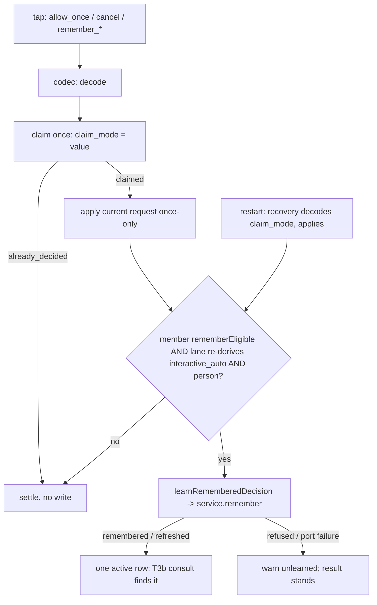

# ASKFLOOR-1-T3c — Remember settlement and learning writes

## Context
T3a stores remembered decisions (#484) and T3b consults them (#486), but nothing writes one from a real card tap. Today every provider card tap carries a scalar mode (`allow_once | allow_persistent_rule | cancel`), the durable claim persists that scalar (`schema/worker-coordination.ts:171`, a plain `text` column), recovery reconstructs a decision from it, and the human-resolution paths apply the current request and record nothing. T3c makes a structured `remember { outcome, scope }` tap flow through the closed codec set, persist via `HumanDecisionMemoryService.remember` exactly once per claim, and apply the current request as a once-only approval — only when the host-stamped eligibility AND a fresh lane re-derivation both hold. Seam map: `plans/exploration/askfloor-1-t3c-seam-map.md`; the round-1 grill (`askfloor-1-t3c-task-grill-answer.md`) and a follow-up exploration fixed the ownership, carriers, hook order and recovery path recorded below.

## Orchestrator rulings
1. **Durable representation:** a CLOSED set of four remember codes — `remember_allow_exact | remember_allow_kind | remember_allow_place | remember_deny_exact` — declared as `PermissionRememberCode` in `domain/human-decision.ts`, travels in the SAME slot that carries the scalar mode and is persisted verbatim in the claim's `claim_mode` text column. ONE application codec decodes a code (or a scalar) into `{ mode: PermissionApprovalDecisionMode; remember?: PermissionRememberResolution }`. Typed carriers: `PermissionRecoveryEnvelope.renderedDecisionOptions` and `PermissionCallbackClaimIntent.mode` widen to `PermissionApprovalDecisionMode | PermissionRememberCode`; because `domain/types.ts` sits at its 740-line ceiling, the claim/recovery types (`PermissionRecoveryEnvelope`, `PermissionCallbackScope`, `PermissionCallbackClaimIntent`, `PermissionCallbackClaimReference`, `PermissionCallbackClaim`, `types.ts:262-298`) MOVE net-zero into NEW `domain/permission-interaction.ts` (importers updated; no re-export left behind). The Postgres prompt mapper (`worker-coordination-permission-prompt.postgres.ts:39-55`, the `claimMode` cast) validates the stored string through the codec on read and refuses an unknown value.
2. **Ownership:** T3c edits no file under `channels/` except the two codecs the story plan assigns it — `telegram/channel-shared.ts` (pattern + parser accept the codes; the callback id budget is unchanged: the longest code keeps a 36-character id within Telegram's 64-byte callback data) and `slack/permission-action-id.ts`. Every provider handler and renderer (Telegram callback handlers, Slack delivery/interactions, Discord, Teams) is T5a's; until T5a no card emits a code, so user-visible behaviour is unchanged.
3. **Eligibility stamp:** `rememberEligible` is computed by ONE host function `derivePermissionRememberEligibility({ lane, personId, isScheduledJob, matchKind }) → boolean` (NEW, in `application/permissions/human-decision-learning.ts`): true only when `lane === interactive_auto` (from `deriveAutoLaneAnalysis`), `personId` is non-blank (0118: the host stamps a person only for a DM, so person presence IS the DM fact), the run is not a scheduled job, and `matchKind === 'individual'` (never a batch prompt). It is stamped at the HOST-OWNED creation of the durable pending-interaction member (`ipc-interaction-processing.ts:171` → `durable-interaction-handler.ts:42` → `pending-interaction-durability.ts:87`, JSONB `pending_interactions.payload_json`) on both paths (IPC: lane from the same permission mode and host job id the IPC classifier-decision helper derives; inline: from `laneInput`/`run` via `inline-permission-memory.ts`), read back by claim and by recovery, and re-derived at settlement from the same host facts; a remember code whose stamp or re-derivation is false decodes to its scalar base and persists nothing (settled once).
4. **Person:** the acting person is the host-stamped `request.personId` (never a callback-supplied identity); label `undefined` (rows render "someone", 0154). Blank person ⇒ nothing persists, once-only settlement.
5. **Post-apply, three paths:** learning runs only AFTER the current request was applied — IPC at `ipc-interaction-processing.ts:326` (after `applyPermissionInteractionDecision`, before the promotion signal at `:334`); inline after `runDurablePermissionInteraction` returns `resolved: true` (`inline-agent-loop-tools.ts:543-546`) — NOT in the `afterDecision` hook, which runs before application; recovery in `pending-interaction-permission-callback.ts` after `authorityApplied = true` (`:521`) through an optional `learn` dependency the host wires. Idempotency is T3a's refresh: a second write for the same claim (provider double-delivery, crash after learning but before settlement) refreshes the one active row; `already_decided` never reaches the learning call.
6. **Failed persistence:** a memory-port failure after a valid, claimed, applied tap keeps the once-only result and logs one `warn` (`unlearned`); no retry, no claim release.
7. **Scopes on write:** exact and kind (kind with `trustGrowthTool: false`; tool-scoped kinds arrive with T5a); a `remember_allow_place` code learns only when the caller supplies a canonical root (T5a will), otherwise the helper returns `not_rememberable: no_root`; `effectSchemaVersion` pins `EFFECT_SCHEMA_VERSION`, `railVersion` pins `RAIL_CATALOG_VERSION`, `reason` is the constant `remembered from a card tap`.

## Scope / Non-goals
In: codec module; the type move; the two owned codecs; the durable path (member payload stamp, claim carries the code, prompt mapper validates on read, recovery decodes and learns); ONE learning helper; the IPC settlement helper; the inline post-apply call; the S2 fixture through the real claim/application/learning path. Out: every provider handler and renderer, card buttons and copy (T5a); job projection (T4); `/permissions` (T5b); the outage latch (T6); anything T3b consults.

## Acceptance Criteria
- T3c-AC1: CODEC + CARRIERS. NEW `application/permissions/permission-remember-codec.ts` exports `PERMISSION_REMEMBER_CODES` (the closed four), `decodePermissionDecisionCode(value: string) → { mode: PermissionApprovalDecisionMode; remember?: PermissionRememberResolution } | null` (scalars pass through; `remember_allow_*` → `allow_once` + `{ outcome: allow, scope }`; `remember_deny_exact` → `cancel` + `{ outcome: deny, scope: exact }`; anything else → `null`) and `encodePermissionRememberCode(resolution) → PermissionRememberCode`; `PermissionRememberCode` lives in `domain/human-decision.ts`; the claim/recovery types move net-zero from `domain/types.ts` into NEW `domain/permission-interaction.ts` and their `mode` / `renderedDecisionOptions` fields accept `PermissionApprovalDecisionMode | PermissionRememberCode`; `telegram/channel-shared.ts` and `slack/permission-action-id.ts` accept and emit the codes in the scalar-mode slot. Unit tests: codec round-trip for the four codes and three scalars, `null` for unknown, the longest Telegram callback within 64 bytes with a 36-character id; the two codec suites parse a code and a scalar.
- T3c-AC2: DURABLE PATH. `derivePermissionRememberEligibility` is stamped as `rememberEligible` on the pending-interaction member payload at creation on both paths (`durable-interaction-handler.ts:42` receives it from the IPC caller at `ipc-interaction-processing.ts:171` and from the inline caller via `inline-permission-memory.ts`); `claimPermissionInteractionCallback` (`pending-interaction-permission-callback.ts:292-405`) persists the tapped value verbatim in `claim_mode`; the Postgres mapper validates `claimMode` through the codec on read; recovery (`pending-interaction-permission-recovery-orchestrator.ts:102-209`, `-callback.ts:470-549`) decodes the persisted code into the identical `{ mode, remember }` and applies the same once-only decision; `already_decided` never learns. Tests: member payload carries the stamp (unit, `pending-interaction-durability.test.ts`); claim persists a code and the mapper refuses an unknown value (Postgres, `worker-coordination.postgres.integration.test.ts`); recovery reconstructs the identical intent; a replayed callback on a settled claim is `already_decided` with no write.
- T3c-AC3: LEARNING HELPER. NEW `application/permissions/human-decision-learning.ts` exports `derivePermissionRememberEligibility` (ruling 3) and `learnRememberedDecision({ request, resolution, rememberEligible, lane, effectHash, workspaceRoot, canonicalRoot?, service, warn }) → Promise<LearnResult>` with `LearnResult = { status: 'remembered'; id } | { status: 'not_eligible' } | { status: 'not_rememberable'; reason: HumanDecisionServiceRefusal } | { status: 'unlearned' }`: `not_eligible` unless `rememberEligible && lane === interactive_auto && request.personId` non-blank; builds the T3a `HumanDecisionRememberRequest` (outcome/scope from the resolution, `trustGrowthTool: false`, `railVersion: RAIL_CATALOG_VERSION`, `effectSchemaVersion: EFFECT_SCHEMA_VERSION`, `effectHash`, `workspaceRoot`, `canonicalRoot`, person from `request.personId`, label `undefined`, reason `remembered from a card tap`) and calls `service.remember`, relaying each refusal reason; a throwing port → one `warn` and `unlearned`. It never touches the current decision. Unit tests with a fake service: every eligibility input, the DTO shape (the keys the T3b stage consults), place without a root → `no_root`, each service refusal relayed, port failure → `unlearned` without throwing.
- T3c-AC4: POST-APPLY CALLERS. (a) IPC: NEW `runtime/permission-remember-settlement.ts` (the IPC module is at its 865-line ceiling) called at `ipc-interaction-processing.ts:326` after `applyPermissionInteractionDecision` succeeds and before the promotion signal: decodes the settled mode, reads the member's `rememberEligible`, re-derives the lane from the same host facts, and calls `learnRememberedDecision` with a `HumanDecisionMemoryService` over the coordinator's `decisionMemory` port; the application and event sequence (`:334-382`) are byte-identical for remembered and once-only taps. (b) Inline: `inline-permission-memory.ts` gains `inlineRememberSettlement(...)` called from `inline-agent-loop-tools.ts` after `runDurablePermissionInteraction` returns `resolved: true` (`:543-546`, ≤ 6 changed lines), never inside `afterDecision`. (c) Recovery: `pending-interaction-permission-callback.ts` gains an optional `learn` dependency invoked after `authorityApplied = true` (`:521`), wired by the IPC host with the same helper; `pending-interaction-durability.ts` threads it. Tests: IPC suite (`ipc-interaction-handler.test.ts`) — an eligible remembered Allow persists once after application with unchanged events; a remembered No persists and the current call is denied; `ask`, `auto_strict`, group (blank person), batch and scheduled-job prompts persist nothing (one case each); double-delivery refreshes, not duplicates. Inline suite — eligible Allow on a non-scheduled auto run persists once after resolution; scheduled run persists nothing; port failure leaves the decision applied. Recovery suite — a recovered remember code learns once through the same path; crash after learning but before settlement ends with one active row.
- T3c-AC5: S2. `askfloor-tap-budget-harness.ts` gains a person, a fake decision-memory port and a provider-neutral durable fixture (in-memory durability backend, claim with a code, apply, learn) so the first run traverses claim → application → learning; `askfloor-tap-budget.test.ts` adds S2 — `cd ~/Workdir/<repo> && ls && git log` under `interactive_auto` with a person: first run at most one prompt answered with `remember_allow_exact` → one claimed code and one active row; second identical run through the real coordinator → zero prompts.
- T3c-AC6: existing unit and Postgres suites pass; tsc and check:architecture green; `ipc-interaction-processing.ts` ≤ 865, `inline-agent-loop-tools.ts` ≤ 750, `domain/types.ts` ≤ 740 (the move is net-negative there); no leftovers (no wrapper, shim, alias, re-export, dead branch or "legacy" naming).

## Technical Approach
1. Codes ride the existing mode slot end to end; the type move gives them a typed carrier without touching the ceiling. Rejected: a structured claim column (migration, payload versioning) and an opaque token (needs a lookup recovery cannot rebuild).
2. One learning helper owns eligibility, DTO construction and the fail-open rule; the three post-apply callers are thin.
3. Eligibility is stamped once on the host-owned member record and re-derived at settlement; forged or replayed codes degrade to their scalar base behind the existing claim guards (`pending-interaction-permission-claim.ts:40-60`, `-callback.ts:359-397`).
4. Idempotency comes from T3a's refresh semantics; no new ledger.

## Decisions
0154, 0118, 0121, 0124, 0138, 0043. Rulings 1–7 above are recorded here; none amends a decision.

## Surface Impact
Providers Telegram and Slack accept four more callback values that no card emits until T5a; the durable path carries a stamp and a code. No schema, migration or UI change.

## Task Decomposition
Single task; depends on T3b. Write scope (source): NEW `application/permissions/permission-remember-codec.ts`, NEW `application/permissions/human-decision-learning.ts`, NEW `runtime/permission-remember-settlement.ts`, NEW `domain/permission-interaction.ts`, `domain/human-decision.ts`, `domain/types.ts` (the move), `application/interactions/pending-interaction-prompt-binding.ts`, `application/interactions/pending-interaction-permission-callback.ts`, `application/interactions/pending-interaction-permission-recovery-orchestrator.ts`, `application/interactions/pending-interaction-durability.ts`, `application/interactions/durable-interaction-handler.ts`, `adapters/storage/postgres/repositories/worker-coordination-permission-prompt.postgres.ts`, `runtime/ipc-interaction-processing.ts`, `app/bootstrap/inline-permission-memory.ts`, `app/bootstrap/inline-agent-loop-tools.ts`, `channels/telegram/channel-shared.ts`, `channels/slack/permission-action-id.ts`; tests: NEW `test/unit/application/permission-remember-codec.test.ts`, NEW `test/unit/application/human-decision-learning.test.ts`, `test/unit/runtime/ipc-interaction-handler.test.ts`, `test/unit/bootstrap/inline-agent-loop-tools.test.ts`, `test/unit/application/pending-interaction-permission-recovery-orchestrator.test.ts`, `test/unit/application/pending-interaction-durability.test.ts`, `test/unit/application/durable-interaction-handler.test.ts`, `test/integration/worker-coordination.postgres.integration.test.ts`, `test/unit/runtime/askfloor-tap-budget-harness.ts`, `test/unit/runtime/askfloor-tap-budget.test.ts` — 27 files. Budget 30 files / 3,000 lines (importers touched by the type move use the headroom and are named in a signal). `user_facing: false`.

## Risks
Ceilings: three files at their ceiling; the helpers and the type move absorb the logic. Hook order: the inline learn must follow resolution, pinned. Forged codes: degrade, never widen, pinned per lane. Key mismatch: same derivation and `trustGrowthTool: false`, pinned by S2. Recovery: learns once through the same helper, pinned.

## Workflow
A tap carries a scalar or one of the four codes; the codec decodes it; the claim persists it once; the current request is applied exactly as a once-only tap; only then the learning helper writes — when the member's eligibility stamp and a fresh re-derivation both hold. Recovery replays the same code through the same post-apply point.

## Manual Verification
1. Through the IPC harness (no card emits the codes until T5a), answer a DM auto-mode prompt for `cd ~/Workdir/<repo> && ls && git log` with `remember_allow_exact`: one `human_decision` row; run again: no prompt.
2. Same on a group or `auto_strict` prompt: nothing persisted.
3. Stop the runtime between claim and settlement; on restart the recovered tap applies once and one row exists.

## Verify Plan
`python3 factory/scripts/verify.py` with `GANTRY_TEST_DATABASE_URL` exported; `npx tsc --noEmit`; `npm run check:architecture`; `npm run test:integration:postgres`; the unit leaves through `vitest.unit.config.ts` and the Postgres leaf through `vitest.integration.postgres.config.ts`.
