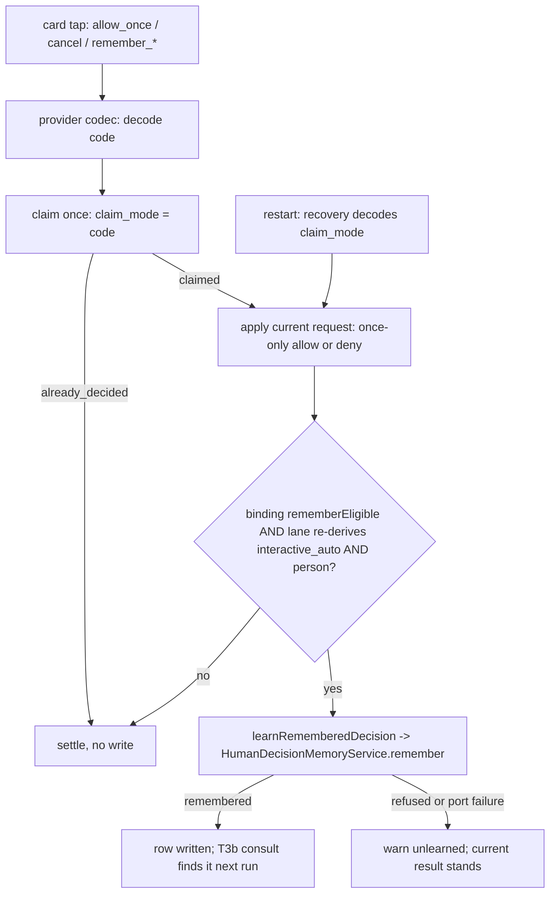

# ASKFLOOR-1-T3c — Remember settlement and learning writes

## Context
T3a stores remembered decisions (#484) and T3b consults them (#486), but nothing writes one from a real card tap. Today every provider card tap carries a scalar mode (`allow_once | allow_persistent_rule | cancel`), the durable claim persists that scalar (`worker-coordination.ts:171`, a plain `text` column), recovery reconstructs a decision from it, and the two human-resolution chokepoints (`runtime/ipc-interaction-processing.ts:240-358`; inline `afterDecision`, `app/bootstrap/inline-agent-loop-tools.ts:483-543`) apply the current request and record nothing. T3c makes a structured `remember { outcome, scope }` tap flow through the closed codec set, persist exactly once via `HumanDecisionMemoryService.remember`, and apply the current request as a once-only approval — only when the host-stamped eligibility AND a fresh lane re-derivation both say the card was eligible. Seam map: `plans/exploration/askfloor-1-t3c-seam-map.md`.

## Orchestrator rulings on the seam map's open questions
1. **Durable representation:** a CLOSED set of four remember codes — `remember_allow_exact | remember_allow_kind | remember_allow_place | remember_deny_exact` — travels in the SAME slot providers already carry the scalar mode (Telegram `perm:<code>:<id>`, Slack action id / button value, Discord custom id, Teams action payload) and is persisted verbatim in the claim's existing `claim_mode` text column; ONE application codec decodes a code into `{ mode: 'allow_once' | 'cancel', remember: PermissionRememberResolution }` and encodes back. No schema change; recovery replays the same code. The codes are declared in `domain/human-decision.ts` (`PermissionRememberCode`), NOT in `domain/types.ts` (at its 740-line ceiling); provider codecs accept `PermissionApprovalDecisionMode | PermissionRememberCode`.
2. **Person:** learning is DM-only; the acting person is the host-stamped `request.personId` (0118: DM identity is `memoryUserId`, stamped by the host at `ipc-interaction-processing.ts:132-158` and inline `:360-398`); the provider tapper is already authorized against that DM by the existing approver checks. Blank person ⇒ nothing persists, once-only settlement, the plan's post-tap line is T5a's.
3. **Failed persistence:** after a valid, claimed, eligible tap, a memory-port failure keeps the current once-only approval and logs one `warn` (`unlearned`); no retry, no claim release.
4. **Eligibility stamp:** `rememberEligible` is computed at prompt construction (both paths) as `deriveAutoLaneAnalysis(...).lane === interactive_auto && personId non-blank && not a scheduled run && the conversation is a DM`, persisted on the durable prompt BINDING record (`pending-interaction-prompt-binding.ts`, its own type — not the request) so recovery and replay carry it; at settlement the write happens only when the persisted stamp is true AND the lane re-derives `interactive_auto` from the same inputs; a remember code on an ineligible card decodes to its scalar base and persists nothing (fail closed to legacy settlement, settled once).
5. **Kind scope on write:** T3c writes kind rows with `trustGrowthTool: false` (the category key). Tool-scoped kind rows (`kind:tool:*`) arrive with T5a's card option; T3b already consults both.

## Scope / Non-goals
In: the codec module; provider codecs (Telegram, Slack, Discord, Teams) accepting and emitting the four codes for eligible cards; the binding/claim/recovery path carrying the code and the eligibility stamp; ONE shared learning helper both chokepoints call; the IPC chokepoint via a new small runtime helper (the IPC module sits at its 865-line ceiling); the inline chokepoint via the existing `inline-permission-memory.ts` (the inline file is at 745/750); the S2 tap-budget fixture. Out: card buttons, labels, copy, post-tap lines (T5a); job projection (T4); `/permissions` (T5b); the outage latch (T6); any change to what T3b consults.

## Acceptance Criteria
- T3c-AC1: CODEC. NEW `application/permissions/permission-remember-codec.ts` exports `PERMISSION_REMEMBER_CODES` (the closed four), `decodePermissionDecisionCode(value: string) → { mode: PermissionApprovalDecisionMode; remember?: PermissionRememberResolution } | null` (scalar modes pass through with no `remember`; the four codes map to `allow_once` + `{ outcome: allow, scope: exact|kind|place }` or `cancel` + `{ outcome: deny, scope: exact }`; anything else → `null`) and `encodePermissionRememberCode(resolution) → PermissionRememberCode`; `PermissionRememberCode` is declared in `domain/human-decision.ts`. Every provider codec (`telegram/channel-shared.ts` pattern + parser, `slack/permission-action-id.ts`, `slack/permission-approval-delivery.ts` button value, `discord/components.ts`, `teams/cards.ts` + `teams/interaction-handlers.ts` normalisation) accepts the four codes in the slot that carries the scalar mode and routes the decoded result into its existing settlement call; the Telegram pattern's callback id budget is unchanged. Unit tests: codec round-trip for all four codes and the three scalars, `null` for unknown; one parse test per provider codec for a remember code and a scalar.
- T3c-AC2: DURABLE PATH. `bindPendingPermissionInteractionMessage` (`pending-interaction-prompt-binding.ts:39-95`) persists `rememberEligible: boolean` on the binding record; `claimPermissionInteractionCallback` (`pending-interaction-permission-callback.ts:292-405`) persists the tapped code verbatim in `claim_mode` (no new column); `recoverDurablePermissionDecision` (`pending-interaction-permission-recovery-orchestrator.ts:102-209`) and the replay authority application (`pending-interaction-permission-callback.ts:470-549`) decode the persisted code through the codec so a recovered remembered tap yields the SAME once-only decision and the same remember intent; `already_decided` never learns again. Tests: binding persists the stamp; claim persists a code; recovery of a persisted remember code reconstructs the identical `{ mode, remember }`; a replayed callback on a settled claim is `already_decided` with no write.
- T3c-AC3: LEARNING HELPER. NEW `application/permissions/human-decision-learning.ts` exports `learnRememberedDecision({ request, resolution: PermissionRememberResolution, rememberEligible: boolean, laneInput, effectHash, workspaceRoot, service: HumanDecisionMemoryService, warn }) → Promise<'remembered' | 'not_eligible' | 'not_rememberable' | 'unlearned'>`: returns `not_eligible` unless `rememberEligible` is true AND `deriveAutoLaneAnalysis(laneInput).lane === interactive_auto` AND `request.personId` is non-blank; builds the T3a `HumanDecisionRememberRequest` (outcome/scope from the resolution, `trustGrowthTool: false`, `railVersion: RAIL_CATALOG_VERSION`, `effectHash`, `workspaceRoot`, the person from `request.personId`) and calls `service.remember`; relays the service's `not_rememberable` reasons; a throwing port → one `warn` and `unlearned`. It never touches the current decision. Unit tests with a fake service: every guard, the DTO shape (keys match what `runtime/permission-human-memory-stage.ts` consults: same derivation inputs, `trustGrowthTool: false`), each service refusal relayed, port failure → `unlearned` without throwing.
- T3c-AC4: CHOKEPOINTS. (a) IPC: NEW `runtime/permission-remember-settlement.ts` (the IPC module is at its 865-line ceiling) called from `ipc-interaction-processing.ts` AFTER the current decision is applied (`:269-340`) and after decision recording (`:341-358`), never before the claim boundary: it decodes the settled mode, reads the binding's `rememberEligible`, re-derives the lane from the host-stamped inputs the IPC path already has, and calls `learnRememberedDecision` with a `HumanDecisionMemoryService` built over the coordinator's `decisionMemory` port; the current-request application and event sequence (`:359-382`) are byte-identical for remembered and once-only taps. (b) Inline: `inline-permission-memory.ts` gains `inlineRememberSettlement(...)` that the inline `afterDecision` (`inline-agent-loop-tools.ts:483-543`, ≤ 5 changed lines) calls after the decision is applied; a helper failure never throws into `runDurablePermissionInteraction` (`durable-interaction-handler.ts:143-211`), so the claim settles and the current result stands. Tests: IPC suite — an eligible remembered Allow persists once and the current call is approved once-only with unchanged events; the same tap on an `ask`, `auto_strict`, group or scheduled-job prompt persists nothing (one case per lane); a remembered No persists and the current call is denied; a blank person persists nothing; inline suite — an eligible remembered Allow on a non-scheduled auto run persists once; a scheduled run persists nothing; a port failure leaves the decision applied.
- T3c-AC5: S2. `test/unit/runtime/askfloor-tap-budget-harness.ts` gains a person and a decision-memory repository (a fake port) and a scripted prompt response; `askfloor-tap-budget.test.ts` adds S2 — `cd ~/Workdir/<repo> && ls && git log` under `interactive_auto` with a person: first run at most one prompt answered with `remember_allow_exact` → one row persisted; second identical run → zero prompts and the T3b consult returns the remembered Allow.
- T3c-AC6: existing unit and Postgres suites pass; tsc and check:architecture green; `ipc-interaction-processing.ts` ≤ 865, `inline-agent-loop-tools.ts` ≤ 750, `domain/types.ts` ≤ 740; no leftovers (no wrapper, shim, alias, dead branch or "legacy" naming).

## Technical Approach
1. Codes, not a second wire field: the four codes ride the existing mode slot end to end, so the claim, recovery and every provider codec change by a type widening plus one decode call. Rejected: a structured `resolution` field on the claim (schema change, four payload shapes to version) and an opaque token (needs a lookup table the recovery path cannot rebuild after a restart).
2. One learning helper (application) owns eligibility, DTO construction and the fail-open rule; both chokepoints are thin callers. Rejected: writing inside `HumanDecisionMemoryService` (it must not know lanes) or inside the coordinator (0043: authorization, not learning).
3. Eligibility is stamped once on the binding and re-derived at settlement; a forged or replayed remember code on an ineligible card degrades to its scalar base (settled once by the existing claim guards, `pending-interaction-permission-claim.ts:40-60`, `-callback.ts:359-397`).
4. Kind writes use the category key; T5a unlocks tool-scoped kinds.

## Decisions
0154 (learning write, scopes), 0118 (person = host-stamped DM identity), 0121 (no learning on job lanes), 0124 (delivery/claim authority unchanged), 0138, 0043. Rulings 1–5 above are recorded in the task plan; none amends a decision.

## Surface Impact
Providers accept four more callback values on cards that T5a will render; today no card emits them, so user-visible behaviour is unchanged until T5a. Recovery and replay carry the code. No schema, migration or UI change.

## Task Decomposition
Single task; depends on T3b. Write scope (source): NEW `application/permissions/permission-remember-codec.ts`, NEW `application/permissions/human-decision-learning.ts`, NEW `runtime/permission-remember-settlement.ts`, `domain/human-decision.ts` (codes), `application/interactions/pending-interaction-prompt-binding.ts`, `application/interactions/pending-interaction-permission-callback.ts`, `application/interactions/pending-interaction-permission-recovery-orchestrator.ts`, `runtime/ipc-interaction-processing.ts`, `app/bootstrap/inline-permission-memory.ts`, `app/bootstrap/inline-agent-loop-tools.ts`, `channels/telegram/channel-shared.ts`, `channels/slack/permission-action-id.ts`, `channels/slack/permission-approval-delivery.ts`, `channels/slack/channel-interactions.ts`, `channels/discord/components.ts`, `channels/discord/permission-callback.ts`, `channels/teams/cards.ts`, `channels/teams/interaction-handlers.ts`; tests: NEW `test/unit/application/permission-remember-codec.test.ts`, NEW `test/unit/application/human-decision-learning.test.ts`, `test/unit/runtime/ipc-interaction-processing.test.ts` (or the IPC permission-interaction suite the implementer identifies as the owner of `:240-358`), `test/unit/bootstrap/inline-agent-loop-tools.test.ts`, `test/unit/application/pending-interaction-permission-recovery.test.ts` (the existing recovery suite), one parse test file per provider (existing codec suites), `test/unit/runtime/askfloor-tap-budget-harness.ts`, `test/unit/runtime/askfloor-tap-budget.test.ts` — about 28 files. Budget 32 files / 3,200 lines. `user_facing: false`.

## Risks
Ceilings: three touched files sit at their ceiling; the two NEW helpers and the inline module absorb the logic. Forged callbacks: a remember code from a non-eligible card must degrade, never widen (pinned per lane). Key mismatch: the write must use the same derivation and `trustGrowthTool: false` so T3b's second-run consult finds it (pinned by S2). Provider drift: four codecs; one parse test each.

## Workflow
A card tap carries one of the closed codes; the provider codec decodes it, the claim persists it once, the current request is applied exactly as a once-only tap, and only then does the learning helper write a remembered decision — when the binding's eligibility stamp and a fresh lane re-derivation both hold. Recovery replays the same code through the same path.

## Manual Verification
1. In a DM in auto mode, run `cd ~/Workdir/<repo> && ls && git log`; on the card (once T5a renders the option — until then, answer the prompt with `remember_allow_exact` through the IPC harness) choose Allow-and-remember: one row in `permission_decision_memory` with kind `human_decision`; run it again: no card.
2. Same on a group card or an `auto_strict` DM: nothing persisted.
3. Stop the runtime between tap and settlement; on restart the recovered tap yields the same once-only approval and one row.

## Verify Plan
`python3 factory/scripts/verify.py` with `GANTRY_TEST_DATABASE_URL` exported; `npx tsc --noEmit`; `npm run check:architecture`; the unit leaves through `vitest.unit.config.ts`.
