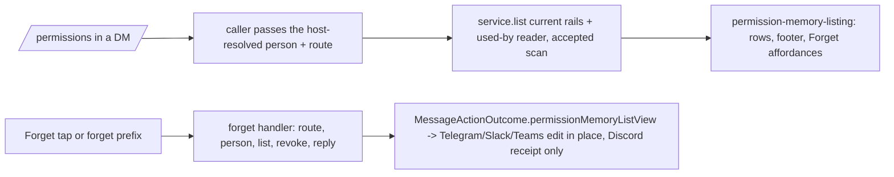

# ASKFLOOR-1-T5b — `/permissions`: remembered list, `all`, `forget <id>`, the Forget host handler

## Context
T3a–T5a made remembered decisions real: the card can learn (T3c), jobs project them (T4), and every provider renders the Forget button and delivers a typed `memory_forget` action to a router hook that still answers "Not available yet." (T5a). Nobody can SEE or UNDO what was remembered yet. T5b makes the existing `/permissions` session command (`session-command-parse.ts:25-39`, `session-commands.ts:580-585`) list the person's remembered decisions with Forget buttons, adds `/permissions all` and `/permissions forget <id>`, binds the Forget host handler, adds the "used by job" read over T4's audit stamp, and the one operating-guidance line. Seam map: `plans/exploration/askfloor-1-t5b-seam-map.md`. Grill r1 (`askfloor-1-t5b-task-grill-r1.md`) folded in v2; grill r2 (`askfloor-1-t5b-task-grill-r2.md`, 12 blocking) folded in v3 with three owner rulings; grill r3 (`askfloor-1-t5b-task-grill-r3.md`, 9 blocking, no owner choices) folded in v4 as the final residue (grill budget: three rounds).

## Owner rulings (Ravi)
- 2026-09-08 (bundled, ledgered): a job that no longer exists is OMITTED from the "used by" suffix; when more than two jobs used a record the two MOST RECENT uses are named, then "+N jobs"; dates render in the runtime's configured timezone as day + month ("2 Sep"); Forget edits the list message IN PLACE where the provider allows, so T5b MAY touch the four provider action handlers for that edit (the story's "T5b touches no provider file" yields to this ruling for the in-place edit only).
- 2026-09-02/03 (story plan line 162): row format "Allow · read-only reads · anywhere · 2 Sep · Ravi" (outcome first, the approver's snapshotted display name, never "you"; 0154's fallback "someone" when no label); "· used by job <name>" from ACTUAL consumption only; the ten newest with buttons, then "Showing the 10 newest with buttons. <N> older." and "Send /permissions all for the full list, or /permissions forget <id>."; `/permissions all` = every ACTIVE current-rails record as plain text, short id FIRST ("a3f9c2 · Allow · read-only reads · anywhere · 2 Sep · Ravi"), no pagination; `forget <id>` resolves a prefix of ≥ 4 characters (case-insensitive) against THIS person's ACTIVE current-rails records — one match → revoke, more than one → "That id matches more than one — send /permissions all and use the longer id." with nothing mutated, none → the not_found reply; replies identical to the button: "Forgot: <scope>. I'll ask next time." / "Already forgotten." / "Nothing to forget — that isn't one of your remembered decisions, or it's already gone. Send /permissions for the current list."; empty state "Nothing remembered yet. Tap Allow on a card and it shows up here."; groups: every variant is non-mutating and replies with the mode line plus "Remembered decisions are a DM feature — nothing is remembered in groups. Send /permissions to me directly to see yours."; the operating-guidance line "I don't keep that list myself — send /permissions to see everything you've allowed or refused, each with a Forget button."; family rules are not listed (durable-policy rows).
- 2026-09-08 (0154 amendment): old-version rows are simply not listed. Orchestrator default (grill r1 gap 5, recommended option taken, no owner round): a Forget button or prefix that names an old-version row answers not_found and mutates nothing — the visible set and the revocable set are the same set.
- 2026-09-09 (bundled, grill r2): ROW COPY is recoverable-only — no display snapshot, no schema change: a category row reads "<Outcome> · <risk-category noun> · <place> · <d Mon> · <label>" ("Allow · read-only reads · anywhere · 2 Sep · Ravi"), an exact-action row reads "<Outcome> · <tool label>, this exact call · <place> · <d Mon> · <label>" ("Allow · Bash, this exact call · anywhere · …"); T5b ships as ONE task with a widened budget (55 files / 5,000 lines, ledgered here; Codex runs sliced by area); the used-by audit read is an ACCEPTED SCAN — no index, no migration, recorded as an assumption at pr-ready, the index is the upgrade path if `/permissions` ever gets slow.
- Copy literal (grill r1 gap 9): the suffix is exactly "· used by job <name>" (story plan line 162); decision 0153's consequence line "also used by job" is amended to the same literal in this task.

## Orchestrator rulings (seam map + grill r1)
1. **One service, one injection.** `SessionCommandDeps` (`session-commands.ts:89-135`) gains one optional `remembered` member `{ appId; agentFolder; agentId; conversationKind: 'dm' | 'group'; resolvePersonId: () => Promise<string | undefined>; service: HumanDecisionMemoryService; usedBy: UsedByJobReader; timezone: string }` (`agentId` is the route-effective id, `group.agentId ?? agentIdForFolder(group.folder)`, `runtime-app-routes.ts:9-21`, and is stamped on every Forget affordance) — `handleSessionCommand` (`session-commands.ts:245-252`) sees no route outside `deps`, so the caller supplies the whole context per invocation: `group-processing-session-command-handlers.ts:33-67,146-153` passes the route's app id and agent folder, the DM/group kind, and `resolveMemoryUserId` (the host-resolved, DM-gated person; the resolver is cached per turn, `group-person-identity.ts:11-29`, so the thunk never reruns identity). The service, the used-by reader and the timezone reach group processing through `GroupProcessingDeps`: the `createGroupProcessor({...})` argument object (`runtime-app.ts:574-661`) MOVES, unchanged, into NEW `app/bootstrap/runtime-group-processor-deps.ts` (`createGroupProcessorDeps(ctx)`) because `runtime-app.ts` sits at 738/739, and that module adds the one `remembered` field built from the decision-memory repository, `ops` and the configured timezone; `group-processing-types.ts` carries the field to the handlers. On a group route `remembered` is present but every variant returns the guidance without calling `list`, the used-by read or `revoke` (tests assert all three counts are zero).
2. **Rendering lives in the application layer.** `session-commands.ts` is at 740 and `channels/` may not be imported by `session/` or `application/`; NEW `application/permissions/permission-memory-listing.ts` owns the row formatter, the ten-newest footer, the empty state, the `all` listing, the three forget replies, the ambiguity reply and the prefix resolver. The noun and place words come from the T5a application helpers already in `application/permissions/permission-card-affordances.ts` (`permissionHumanToolLabel`, the risk-category noun) — nothing moves out of `channels/`; the listing module imports them. Per the 2026-09-09 ruling a category row's noun is the risk-category noun and an exact-action row's noun is "<tool label>, this exact call" (the effect hash is never shown); place is the row's `canonicalRoot` folder name or "anywhere". Rows: `{ shortId, recordId, agentId, outcome, scopeNoun, place, decidedAt, label?, usedBy: { jobs: string[]; more: number } }`. Category and place are DECODED from the row's `scopeKey` (`human-decision-scope.ts:67-77`; human rows persist `canonicalRoot: null`, `permission-decision-memory-repository.postgres.ts:186-205`): the listing module holds a closed category → noun map ("read-only reads", …) and a listing-specific exact-tool label map (Bash → "Bash", never the card's "exact command access"); tests use real T3-shaped rows with no `canonicalRoot`, including the literal Bash example. Dates: `Intl.DateTimeFormat('en-GB', { day: 'numeric', month: 'short', timeZone }).formatToParts` assembled as `<day> <month>` so "2 Sep" is exact regardless of runtime locale; the timezone day-crossing case is pinned. `UsedByJobReader` (type + factory) lives in this module — not a separate source file.
3. **Forget host handler — its own module.** NEW `app/bootstrap/permission-memory-forget-handler.ts` exports `createMemoryForgetHandler({ getConversationRoutes, resolvePerson, resolvePermissionMode, service, usedBy, timezone })` and returns the `OnMemoryForgetMessageAction` bound through the existing setter seam (`channel-wiring-types.ts:238-249`, `channel-wiring.ts:726-730` — no channel import). Route authority: the app id is `appIdFromConversationJid(conversationJid) ?? 'default'` (`shared/app-conversation-jid.ts`, as `runtime-app.ts:209` does); the agent is the route-effective `agentId` the listing affordance carries and the provider callback returns. Callback payloads are bounded (Telegram 64 bytes, `telegram/message-action-affordances.ts:42,136-143`; Discord 100 chars, `discord/components.ts:19,49-53`) and a folder-derived agent id is unbounded, so the affordance transports `{ recordId (full), agentRouteKey }` where `agentRouteKey` is a short deterministic digest of the route-effective agent id computed in the listing module and resolved host-side against the route-effective ids of the conversation's routes (unknown key or a collision → not_found, fail closed; round-trip, maximum-size, unknown-key and collision tests). The route resolves through `resolveConversationRoute(routes, conversationJid, threadId, agentId, providerAccountId)` (`app/bootstrap/runtime-app-routes.ts:9-21`); unknown route → not_found. `MemoryForgetMessageActionInput` (`message-actions.ts:112-118`) gains only `agentRouteKey`; the provider codecs that carry it are Telegram `message-action-affordances.ts:70-85,134-150`, Discord `components.ts:42-58,102-116`, Teams `cards.ts:66,309-329` (Discord `interactions.ts` already spreads the parsed action and stays untouched). `resolvePerson` is the DM-gated canonical identity for the tapping user (a group route or an unresolved person → not_found, nothing mutated). The row is loaded BEFORE revoking through `service.list({ …, includeRevoked: true })` (new flag on the port and adapter, `permission-decision-memory-repository.postgres.ts:215-234`; the button path only — prefix and listing stay active-only) scoped to the person, the route's agent folder and current rails, so "Forgot: <scope>" names it, a revoked row answers "Already forgotten." without touching the repository, and a foreign, stale or other-agent id answers not_found with zero revoke calls; `service.revoke` then maps `applied | already_revoked | not_found` to the three replies. The result rides the existing `MessageActionOutcome` (`message-actions.ts:177-203`) exactly as the observer digest does: `receipt` is the reply, and on `applied` a new typed `permissionMemoryListView?: PermissionMemoryListMessageView` — the type is DEFINED in `domain/message-actions.ts` (domain imports only domain/shared/contracts, `architecture-map.json:80-82`; the observer digest view is the precedent) as `{ text: string; affordances: Array<{ recordId; agentRouteKey; label }> }`, and the application listing module constructs it. It is the WHOLE current message: the handler injects `resolvePermissionMode(route)` for the mode line (override-or-default, `session-commands.ts:580-585`) and, after `applied`, re-reads the ACTIVE current-rails rows and their used-by data before rendering, so the replacement is authoritative, never a client-side row removal. Each provider keeps its native message id / token locally and, when the view is present, edits the tapped message the way it already re-renders `observerDigestView` (Telegram `callback-handlers.ts:676-681` pattern → `editMessageText`; Slack `channel-message-action-handler.ts` + `message-action-affordances.ts` → `chat.update`; Teams `message-actions.ts:286-303` → `updateAdaptiveCard`) and always sends the receipt; the handler call plus the edit run under the same per-source-message lock the observer edits use (`telegram/callback-handlers.ts:648-659`; `slack/channel-message-action-handler.ts:129-149`; `teams/message-actions.ts:378-396`), pinned by a concurrent double-tap test (no resurrected row, one receipt each). Teams routes with the authenticated `message.threadId` and mutates the source card with `replyToId ?? id` (`teams/types.ts:24-38`). Discord replies only: its Forget branch already answers with an immediate ephemeral response (`interaction-helpers.ts:60-64`) and, like the observer digest, has no in-place re-render today — the receipt is the whole effect — one ephemeral `@original` PATCH (`interaction-helpers.ts:71-89`) and no source-list mutation (ruling: a provider that cannot edit replies only; a type-6 deferred update + source PATCH is the upgrade path, not this task). Authority comes only from authenticated provider context: Teams (`message-actions.ts:88-120`) fills `targetJid`/`threadId` for `memory_forget` from the authenticated activity's conversation and `replyToId`, never from the submitted action data (T5a stage-review finding, deferred here because this task binds the handler); the other three providers already derive them from the callback's authenticated message. `runtime-services.ts` binds the handler in a handful of lines; to stay under its 1,186 cap the `schedulerMessageOptions` + `startScheduler` block (`runtime-services.ts:372-434`) MOVES to NEW `app/bootstrap/runtime-scheduler-start.ts` as `createRuntimeSchedulerStarter(deps)` whose `deps` is an explicit pick of what the block closes over today (process role, app, the queue, channel wiring, the lifecycle updater, the browser closures, execution adapters, the repository getters) — ~65 lines of body plus ~30 lines of picked types and imports; the caller keeps one `startScheduler` binding line.
4. **"Used by job".** `PermissionRepository` (`domain/ports/repositories.ts:619-625`) gains ONE read `listDecisionsByHumanDecisionRecordId(input: { appId; recordIds: string[] }) → Array<{ recordId; jobId; lastUsedAt: string }>` — ONE row per `(recordId, jobId)` with the latest `created_at` as `lastUsedAt`, ordered `lastUsedAt DESC, jobId ASC`; Postgres (`domain-repositories.postgres.ts:1807-1867`, `permission_decisions.actor_context_json` is `text`, `schema/permissions.ts:53`) extracts `(actor_context_json::jsonb)->>'humanDecisionRecordId'` and `->>'jobId'` with `GROUP BY`. No index and no migration (owner ruling 2026-09-09): the read runs once per DM `/permissions`, filtered by app and by the ≤ N listed record ids; the table has no retention boundary, so this is an accepted unbounded scan, recorded as an assumption at pr-ready with the expression index as the upgrade path. The used-by reader (application) hydrates names through `ops-repo.ts:221` `getJobById`, DROPS missing jobs BEFORE counting, names the two most recent, then "+N jobs".
5. **Approver label — host-stamped carrier.** The IPC prompt path already refuses the worker's `personId` and takes `runRestriction.memoryUserId` from the host run registry (`ipc-interaction-processing.ts:134-158,214`); the label rides the same registry. One host-derived carrier, `memoryUserLabel` beside `memoryUserId`, threaded through the turn: `group-processing.ts:262` resolves the person and reads `sender_name` from the SAME sender-matched inbound message the canonical resolver selects (`group-person-identity.ts:80-85,136-146` — the newest message whose raw sender matches, never the generic latest message at `group-processing.ts:110-112`) → `memoryContext: { userId, label }` on the runner options (`group-processing.ts:670`, `group-processing-types.ts:177`) → `AgentInput.memoryUserLabel` (`group-agent-runner.ts:151,251,544,702`; `agent-spawn-types.ts:69`) → `setupPermissionRunRestriction` picks it (`agent-spawn-permission-run-restriction.ts:21-53`) → the coordinator's registry read (`permission-decision-coordinator.ts:527-555`) → `ipc-interaction-processing.ts:214` supplies `personLabel: runRestriction?.memoryUserLabel` (a worker-supplied label, like the worker personId, is discarded); `permission-remember-settlement.ts:86-112` gains `personLabel?` and passes it to `derivePermissionRememberContext`; `inline-permission-memory.ts:44-60,117-135` supplies `run.memoryUserLabel`. Rows render the stored label, "someone" when absent.
6. **Current rails.** `railVersion` becomes a mandatory input of `listHumanDecisions` on the port (`domain/ports/permission-decision-memory.ts`) and the adapter (`permission-decision-memory-repository.postgres.ts:215-234`, SQL filter, plus the `includeRevoked` flag from ruling 3); both service call sites pass `RAIL_CATALOG_VERSION` — `list` (`human-decision-memory-service.ts:181`) and `rememberDerived` (`:160-164`); bare, `all`, prefix resolution and the button all go through `list`, so an old-version row is invisible AND unrevocable (not_found). Tests: the Postgres suite proves SQL exclusion of a `railVersion - 1` row; the unit suite proves its prefix / id answers not_found with zero revoke calls.
7. **Guidance line.** `FULL_TOOL_ACCESS_GUIDANCE` (`prompt-profile-service.ts:199-220`, at 783) gains the one physical line; the truncation guard (`prompt-profile.test.ts:301-307`) is updated.
8. **Groups.** Every `/permissions` variant on a group route renders the mode line + the DM-guidance line and mutates nothing; parsing of `all`/`forget` still succeeds so the reply is the guidance, not a syntax error.

## Scope / Non-goals
In: parser (`all`, `forget <prefix>`), the listing module, the group-processor-deps move + `remembered` injection, the Forget handler module + wiring setter + the list view on `MessageActionOutcome` + in-place edit on Telegram/Slack/Teams (Discord reply-only), the scheduler-start move, the audit read + used-by reader, the label carrier through the turn registry on both prompt paths, current-rails + includeRevoked on the memory port, the guidance line, 0153 wording, listing fixture + S5. Out: any change to what is learned or projected (T3c/T4), card rendering (T5a), outage copy (T6), pagination of `all`, any new memory store, an audit index, a display snapshot of exact calls, a Discord deferred-update path.

## Acceptance Criteria
- T5b-AC1: PARSER. `parsePermissionsCommand` accepts `permissions_all` and `permissions_forget { prefix }` (prefix ≥ 4 chars, lower-cased; anything else is today's usage reply); show/set/default unchanged. Tests: parser suite (`session-commands.test.ts:186-210`) — both new forms, a 3-char prefix rejected, mixed-case prefix lower-cased, every existing form unchanged.
<<<<<<< HEAD
- T5b-AC2: LISTING. Bare `/permissions` in a DM renders today's mode line, then the ten newest ACTIVE current-rails records as "<Outcome> · <scope noun> · <place> · <d Mon> · <label>" (+ " · used by job <a>, <b>" or "+N jobs" per ruling 4) each with a `memory_forget { recordId, agentRouteKey, label: 'Forget <shortId>' }` affordance, then the footer lines when more exist; the empty state when none; `/permissions all` renders every active record as plain text with the short id first; dates use the configured timezone, day + month. NEW `application/permissions/permission-memory-listing.ts` owns every row and reply string and the `PermissionMemoryListMessageView`; nouns come from the existing application helpers (category noun / "<tool label>, this exact call"). Tests: NEW listing suite — row format from real T3-shaped rows (scopeKey-decoded category and place, `canonicalRoot` null, the literal Bash exact-call example) incl. "someone" fallback, exact "2 Sep" under a foreign process locale, timezone day-crossing date, agentRouteKey round-trip / max-size / unknown / collision, ten-newest cut + footer, empty state, `all` ordering (newest first) and short-id-first, used-by suffix with 1, 2, 3+ jobs, a deleted job omitted before the +N count, one job used twice rendered once.
- T5b-AC3: FORGET BY ID AND BY BUTTON. `/permissions forget <prefix>` resolves (case-insensitive) against this person's ACTIVE current-rails records only: one match → `service.revoke` → "Forgot: <scope>. I'll ask next time."; several → the ambiguity reply, nothing mutated; none → the not_found reply. `createMemoryForgetHandler` does the same for a tap: app id from the jid, agentRouteKey resolved against the route-effective agent ids, route by (jid, thread, agentId, account), DM-gated person, row loaded through person-scoped `list({ includeRevoked: true })` BEFORE `revoke`, a revoked row → "Already forgotten." with zero revoke calls, another person's / other-agent / stale-rails id / an unknown route / a group route → not_found with zero revoke calls, and on `applied` re-lists the active rows and returns `permissionMemoryListView` (mode line via the injected resolver — default and route override pinned — plus the re-read rows and footer). Tests: listing suite (three outcomes, revoked-row prefix → not_found, cross-person → not_found, ambiguity → zero revoke calls); NEW `test/unit/bootstrap/permission-memory-forget-handler.test.ts` (the real factory: applied with listing, already_revoked, cross-person, stale rails, unknown route, group route, list-before-revoke ordering, a revoke racing to already_revoked); router suite (`channel-message-action-router.test.ts:170-196`) — the bound handler's result reaches the provider unchanged; `runtime-services.test.ts` — the handler is bound at startup through the setter.
- T5b-AC4: IN-PLACE EDIT. Telegram, Slack and Teams, when the outcome carries `permissionMemoryListView`, edit the tapped message with the view (text + Forget affordances) through the same path they use for `observerDigestView`, using their locally held message id / token, and send the receipt in every case (no view → receipt only); Discord answers with its existing ephemeral receipt only. Every provider forwards `agentId` from the callback payload. Every provider codec round-trips `agentRouteKey` within its payload limit. Tests: Telegram/Slack/Teams (edit called with the rendered view under the per-message lock; receipt; no edit without a view; concurrent double-tap → no resurrected row), Discord (no source-list mutation, one ephemeral receipt update), Teams routing with the authenticated `message.threadId` and mutating `replyToId ?? id`, ignoring submitted `threadId`/`targetJid`.
=======
- T5b-AC2: LISTING. Bare `/permissions` in a DM renders today's mode line, then the ten newest ACTIVE current-rails records as "<Outcome> · <scope noun> · <place> · <d Mon> · <label>" (+ " · used by job <a>, <b>" or "+N jobs" per ruling 4) each with a `memory_forget { recordId, agentRouteKey, label: 'Forget <shortId>' }` affordance, then the footer lines when more exist; the empty state when none; `/permissions all` renders every active record as plain text with the short id first; dates use the configured timezone, day + month. NEW `application/permissions/permission-memory-listing.ts` owns every row and reply string and consumes the domain-owned `PermissionMemoryListMessageView` (the type stays in `domain/message-actions.ts` — domain must not import application; ruling S-0093); the listing module owns the category-noun mapping and exports `permissionMemoryScopeNoun` (no other noun helper exists in the tree; the card copy derives its wording from the typed risk table, not from a noun helper — ruling S-0097); exact-call rows read "<tool label>, this exact call". Tests: NEW listing suite — row format from real T3-shaped rows (scopeKey-decoded category and place, `canonicalRoot` null, the literal Bash exact-call example) incl. "someone" fallback, exact "2 Sep" under a foreign process locale, timezone day-crossing date, agentRouteKey round-trip / max-size / unknown / collision, ten-newest cut + footer, empty state, `all` ordering (newest first) and short-id-first, used-by suffix with 1, 2, 3+ jobs, a deleted job omitted before the +N count, one job used twice rendered once.
- T5b-AC3: FORGET BY ID AND BY BUTTON. `/permissions forget <prefix>` resolves (case-insensitive) against this person's ACTIVE current-rails records only: one match → `service.revoke` → "Forgot: <scope>. I'll ask next time."; several → the ambiguity reply, nothing mutated; none → the not_found reply. `createMemoryForgetHandler` does the same for a tap: app id from the jid, agentRouteKey resolved against the route-effective agent ids, route by (jid, thread, agentId, account), DM-gated person, row loaded through person-scoped `list({ includeRevoked: true })` BEFORE `revoke`, a revoked row → "Already forgotten." with zero revoke calls, another person's / other-agent / stale-rails id / an unknown route / a group route → not_found with zero revoke calls, and on `applied` re-lists the active rows and returns `permissionMemoryListView` (mode line via the injected resolver — default and route override pinned — plus the re-read rows and footer). Tests: listing suite (three outcomes, revoked-row prefix → not_found, cross-person → not_found, ambiguity → zero revoke calls); NEW `test/unit/bootstrap/permission-memory-forget-handler.test.ts` (the real factory: applied with listing, already_revoked, cross-person, stale rails, unknown route, group route, list-before-revoke ordering, a revoke racing to already_revoked); router suite (`channel-message-action-router.test.ts:170-196`) — the bound handler's result reaches the provider unchanged; `runtime-services.test.ts` — the handler is bound at startup through the setter.
- T5b-AC4: IN-PLACE EDIT. Telegram, Slack and Teams, when the outcome carries `permissionMemoryListView`, edit the tapped message with the view (text + Forget affordances) through the same path they use for `observerDigestView`, using their locally held message id / token, and send the receipt in every case (no view → receipt only); Discord answers with its existing ephemeral receipt only. Every provider forwards the agent identity as the bounded `agentRouteKey` in its callback payload (the codec key the round-3 grill ruled; the host handler resolves the route-effective `agentId` from it — no raw `agentId` field, Telegram's callback payload limit forbids it; ruling S-0098). Every provider codec round-trips `agentRouteKey` within its payload limit. Tests: Telegram/Slack/Teams (edit called with the rendered view under the per-message lock; receipt; no edit without a view; concurrent double-tap → no resurrected row), Discord (no source-list mutation, one ephemeral receipt update), Teams routing with the authenticated `message.threadId` and mutating `replyToId ?? id`, ignoring submitted `threadId`/`targetJid`.
>>>>>>> origin/main
- T5b-AC5: USED-BY READ. `listDecisionsByHumanDecisionRecordId` on the port + Postgres adapter: one row per `(recordId, jobId)`, latest use, ordered `lastUsedAt DESC, jobId`, filtered by app and record ids, extracted from `actor_context_json`; no index (owner-accepted scan, recorded as an assumption at pr-ready). The used-by reader hydrates names via `getJobById`, drops deleted jobs first, names two, then "+N jobs". Tests: Postgres integration (rows written through `recordDecision` with `humanDecisionRecordId` on both job lanes are returned once per job with the latest timestamp; unrelated rows and other apps are not), reader unit (1, 2, 3+ jobs; deleted job dropped before the count; ordering).
- T5b-AC6: IDENTITY + GROUPS + LABEL. The caller passes the complete `remembered` context (app, agent folder, kind, `resolveMemoryUserId`); on a group route every variant replies mode line + DM guidance with zero `list`, used-by and `revoke` calls (one test per variant); `memoryUserLabel` is derived from `sender_name` in group processing, carried on `memoryContext` → `AgentInput` → the permission run restriction, persisted as `personLabel` on both prompt paths, and rendered from the stored row. Tests: group-processing suite (DM lists; group bare/all/forget → guidance, three zero-call assertions; the runner options carry `memoryContext.label` from `sender_name`); `permission-decision-coordinator.test.ts` (the registry exposes the label when `setupPermissionRunRestriction` is fed an `AgentInput`, `:1185-1206` pattern — not direct registration); group-processing (a trailing bot / different-sender message does not change the label); `ipc-interaction-handler.test.ts` (label from the registry persisted; a worker-supplied label ignored); `inline-agent-loop-tools.test.ts` (label from the run persisted).
- T5b-AC7: GUIDANCE + S5 + GATES. The guidance line is in `FULL_TOOL_ACCESS_GUIDANCE` (guard updated); S5 in `askfloor-tap-budget.test.ts` (remember in chat → the projected job runs with zero cards → a NEAR-MISS call in the same job still cards → Forget → the same job asks again) with the harness's `revokeById` made real (`askfloor-tap-budget-harness.ts:332-397`); decision 0153's consequence line reads "used by job". Existing unit and Postgres suites pass; tsc and check:architecture green; `session-commands.ts` ≤ 740, `prompt-profile-service.ts` ≤ 783, `runtime-services.ts` ≤ 1186 after the scheduler-start move, `runtime-app.ts` ≤ 739 after the group-processor-deps move, `channel-wiring.ts` ≤ 790 with no new channel import, 700 elsewhere; no wrapper, shim, alias, re-export, dead branch or compatibility naming.

## Technical Approach
1. One application module owns every row and reply string and the list view; the command, the handler and the providers are consumers (rejected: a `session/` formatter — `channels/` cannot import it lawfully; per-provider copy; a display snapshot of exact calls — owner ruling).
2. The Forget handler is its own bootstrap module bound through the existing setter; it holds the app-from-jid + agent-keyed route lookup, identity and the pre-revoke load; the replacement view rides `MessageActionOutcome` like the observer digest, so providers reuse their digest re-render path (rejected: identity inside the router; a message id on the host action; trusting the callback label; a new Discord deferred-update path).
3. The used-by suffix reads the durable audit rows T4 wrote, grouped per job, not runtime events (0153: actual consumption); an unbounded scan is accepted over an index (owner ruling).
4. The approver label rides the turn's `memoryContext` into the host run registry the IPC path already trusts for the person id (rejected: a worker-supplied label; a `/new`-only seam).
5. Current rails are filtered where rows are read, so listing and revocation share one visible set (0154 amendment).

## Decisions
0154 (amended), 0118, 0153 (wording amended), 0124. No new decision.

## Surface Impact
`/permissions` in a DM shows the remembered list with Forget buttons; `/permissions all` and `/permissions forget <id>` exist; groups get one guidance line; a Forget tap removes the row in place and confirms; the agent's guidance points people at `/permissions`.

## Task Decomposition
Single task; depends on T5a and T4. Write scope — source: `session/session-command-parse.ts`, `session/session-commands.ts`, NEW `application/permissions/permission-memory-listing.ts`, `application/permissions/human-decision-memory-service.ts`, `runtime/group-processing-session-command-handlers.ts`, `runtime/group-processing-types.ts`, `runtime/group-processing.ts`, `runtime/group-agent-runner.ts`, `runtime/agent-spawn-types.ts`, `runtime/agent-spawn-permission-run-restriction.ts`, `runtime/permission-decision-coordinator.ts`, `runtime/ipc-interaction-processing.ts`, `runtime/permission-remember-settlement.ts`, `app/bootstrap/inline-permission-memory.ts`, `app/bootstrap/runtime-app.ts`, NEW `app/bootstrap/runtime-group-processor-deps.ts`, `app/bootstrap/runtime-services.ts`, NEW `app/bootstrap/runtime-scheduler-start.ts`, NEW `app/bootstrap/permission-memory-forget-handler.ts`, `app/bootstrap/channel-wiring-types.ts`, `app/bootstrap/channel-wiring.ts`, `app/bootstrap/channel-message-action-router.ts`, `domain/message-actions.ts`, `domain/ports/repositories.ts`, `domain/ports/permission-decision-memory.ts`, `adapters/storage/postgres/repositories/domain-repositories.postgres.ts`, `adapters/storage/postgres/repositories/permission-decision-memory-repository.postgres.ts`, `application/agents/prompt-profile-service.ts`, `channels/telegram/callback-handlers.ts`, `channels/slack/channel-message-action-handler.ts`, `channels/slack/message-action-affordances.ts`, `channels/discord/components.ts`, `channels/telegram/message-action-affordances.ts`, `channels/teams/message-actions.ts`, `channels/teams/cards.ts`, `docs/decisions/0153-learned-decisions-project-into-job-grants.md`; tests: `test/unit/session/session-commands.test.ts`, NEW `test/unit/application/permission-memory-listing.test.ts`, NEW `test/unit/bootstrap/permission-memory-forget-handler.test.ts`, `test/unit/runtime/group-processing.test.ts`, `test/unit/runtime/permission-decision-coordinator.test.ts`, `test/unit/bootstrap/runtime-app.test.ts`, `test/unit/bootstrap/channel-message-action-router.test.ts`, `test/unit/bootstrap/runtime-services.test.ts`, `test/unit/application/human-decision-memory-service.test.ts`, `test/unit/runtime/ipc-interaction-handler.test.ts`, `test/unit/bootstrap/inline-agent-loop-tools.test.ts`, `test/unit/runtime/prompt-profile.test.ts`, `test/unit/channels/telegram.test.ts`, `test/unit/channels/slack.test.ts`, `test/unit/channels/discord/discord.test.ts`, `test/unit/channels/teams/teams.test.ts`, `test/integration/permission-decision-memory.postgres.integration.test.ts`, `test/unit/runtime/askfloor-tap-budget-harness.ts`, `test/unit/runtime/askfloor-tap-budget.test.ts` — 55 files. Budget 55 files / 5,000 lines (owner-approved 2026-09-09; two pure moves account for ~180 lines). `user_facing: true` → functional check before pr-ready. Codex runs are sliced: (a) port/adapter/service + listing module + parser + command; (b) group-processor-deps move + `remembered` injection + label carrier; (c) forget handler + domain view type + wiring + scheduler-start move; (d) provider codecs and edits + S5 + guidance + 0153.

## Risks
Ceilings: `runtime-services.ts` (1186/1186) and `runtime-app.ts` (738/739) are AT their caps — the two pure moves land first; the wiring setter adds no channel import. Identity: one visible set for listing and revocation (pinned by cross-person, stale-rails and group zero-call tests). Provider edits: four handlers — one edit test each, Discord's acknowledgement order pinned. Postgres JSON extraction on a `text` column: cast in SQL, covered by the integration leaf.

## Manual Verification (functional check, user_facing)
1. DM: remember an Allow on a card, send `/permissions` → the mode line and one row with a Forget button; `/permissions all` → the same row with its short id first.
2. Tap Forget → "Forgot: …" and the row disappears from the message; tap again (stale message) → "Already forgotten."
3. `/permissions forget <first 4 chars>` on a fresh record → "Forgot: …"; an ambiguous prefix → the ambiguity reply and both rows still listed.
4. Schedule a job that uses the remembered call → row gains "· used by job <name>".
5. In a group: `/permissions`, `/permissions all`, `/permissions forget abcd` → the mode line + the DM guidance, nothing changes.

## Verify Plan
`python3 factory/scripts/verify.py` with `GANTRY_TEST_DATABASE_URL`; `npx tsc --noEmit`; `npm run check:architecture`; unit leaves through `vitest.unit.config.ts`; the Postgres leaf through its config.

## Workflow

