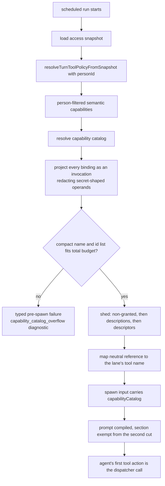

# GRANTED-1-T1 — The scheduled run is told which capabilities it holds

## Context

A scheduled run never receives a capability catalog. `capabilityCatalog` is built
only on the chat path (`runtime/group-agent-access-context.ts:45` calling
`runtime/group-run-context.ts:156`), and the job path
(`jobs/execution-phases-run.ts`) never sets it on the spawn input at `:287`, while
prompt compilation renders only what that input carries
(`runtime/agent-spawn-prompt.ts:87`). The agent guesses, and the KnackLabs job
burned two to four failed calls at the head of seven consecutive runs.

The dispatcher was always reachable (`shared/admin-mcp-tools.ts:96`, filtered at
`runner/gantry-mcp-tool-surface.ts:152`), and that run's own fourth attempt
succeeded through it. The missing element is knowledge, not exposure.

Spec `docs/specs/granted-capability-is-visible.md`; plan
`plans/active/GRANTED-1-agents-can-use-what-they-are-granted.md`; decision 0158.

## The two capability sets

`jobs/execution-phases-run.ts` holds both, and picking the wrong one is the
security risk in this task:

- `inheritedToolPolicy.semanticCapabilities` (`:182`) — resolved through
  `resolveTurnToolPolicyFromSnapshot(accessSnapshot, personId)`, filtered to what
  the acting person is granted. **The catalog uses this one.**
- `semanticCapabilities` (`:194`) — `resolveTurnSemanticCapabilitiesFromSnapshot`,
  no person filter. Feeding it would advertise capabilities the person was never
  granted as ready.

`runtime/group-run-context.ts:156` already accepts a ready capability set, so the
job path reuses it unchanged. No new resolver API.

## What changes

1. **Job path builds and passes the catalog.** Call the existing resolver with
   the person-filtered set and set `capabilityCatalog` on the spawn input at
   `:287`.
2. **`CatalogEntry` gains `invocations`, plural.** A semantic capability owns an
   array of implementation bindings (`shared/semantic-capabilities.ts:53`) while
   the catalog projects one entry per capability, so a singular field would hide a
   valid route. Every binding renders, in a deterministic order, as a closed union
   over the four usable kinds (`shared/semantic-capabilities.ts:25`; legacy
   `mcp_tool` is rejected at validation and never reaches the catalog):
   `local_cli` carries a lane-neutral dispatcher reference, the capability id and
   the reviewed argument patterns; `mcp_pattern` a neutral proxy reference and the
   connected server name; `tool_rule` the tool name, which is how skill actions
   appear, being a tool rule distinguished by source; `adapter` the neutral
   reference and capability id, its own reference being opaque.
   `resolveReadyActions` (`agent-prompt-capability-catalog.ts:137`) populates it
   and stops dropping `stableRef`.
3. **Render-time redaction.** Reviewed shapes render as reviewed, per the owner's
   ruling, EXCEPT that a secret-shaped operand is redacted as the catalog renders.
   Template validation (`shared/semantic-capabilities.ts:557`) blocks shell syntax
   and environment assignments but not a literal credential such as an API-key
   flag value, and `localCliArgPatterns` (`:541`) serializes verbatim. The owner
   chose redaction at render over blocking at definition time.
4. **Lane mapping at the compiler seam.** The catalog stores a lane-neutral
   reference; `runtime/agent-spawn-prompt.ts:80` already receives `AgentInput`,
   which carries `runtime` (`runtime/agent-spawn-types.ts:84`), so the mapping
   lives there and passes the resolved name to the profile service. The DeepAgents
   lane has no entry and a test asserts that, so its behaviour is unchanged and
   the gap cannot drift silently.
5. **Shedding and the two budgets.** `prompt-profile-service.ts:54` gains a named
   default budget and a ceiling derived as at least the compact name-and-id list.
   The renderer sheds in order: non-granted entries, then descriptions, then
   descriptors. Compilation truncates at the section budget (`:532`) and again at
   the total prompt budget (`:756`), so the capability section is exempted from
   the second cut below its compact representation.
6. **Hard overflow fails closed, through a typed path.** The existing callback
   (`agent-spawn-prompt.ts:58`) only logs counts, and a compile error is caught
   and turned into an empty prompt (`:120`), after which spawning continues. That
   cannot satisfy "before any provider call", so overflow raises a typed
   pre-spawn failure that the catch does not swallow, carrying a redacted
   `capability_catalog_overflow` diagnostic with granted and renderable counts.
7. **Deletion and wording.** The 97ded3746 block leaves `runner/mcp/context.ts`;
   the dispatcher description in `runner/mcp/tools/capability-run.ts` points at
   the catalog. Its input schema, risk classification and host enforcement are
   pinned unchanged.

## Non-goals

No change to enforcement, the argv template or the classifier. No migration or
schema change. The DeepAgents catalog is GRANTED-2. Document editing is DOCEDIT-1.
Blocking literal credentials at capability-definition validation was considered
and the owner chose render-time redaction instead.

## Workflow

## Manual Verification

1. Trigger the KnackLabs job and read the rendered guidance in its prompt record:
   the granted sheets capability appears with display name, stable id, the
   Anthropic tool name and its reviewed argument shape.
2. Query `gantry.runtime_events` for that run: no `tool.activity` row with phase
   `failure` precedes the first successful capability invocation.
3. Compare against a chat turn for the same agent: the same entries render, since
   both lanes share the builder and renderer.
4. Define a capability whose template carries a secret-shaped operand and confirm
   the rendered catalog shows it redacted while the stored template is unchanged.
5. Grant the agent enough capabilities that the compact list cannot fit, and
   confirm the run fails at startup with the overflow diagnostic rather than
   starting and silently omitting one.

## Verify

`npx vitest run -c vitest.unit.config.ts apps/core/test/unit/application
apps/core/test/unit/runtime apps/core/test/unit/jobs apps/core/test/unit/runner`,
then `npm run typecheck`, `npm run lint`, `npm run format:check`,
`npm run check:architecture`, and `python3 factory/scripts/verify.py` with
`GANTRY_TEST_DATABASE_URL`.
