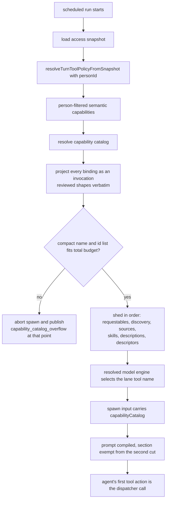

# GRANTED-1-T1 — The scheduled run is told which capabilities it holds

## Context

A scheduled run never receives a capability catalog. `capabilityCatalog` is built
only on the chat path (`runtime/group-agent-access-context.ts:45` calling
`runtime/group-run-context.ts:156`), and the job path
(`jobs/execution-phases-run.ts`) never sets it on the spawn input at `:287`, while
prompt compilation renders only what that input carries
(`runtime/agent-spawn-prompt.ts:87`). The agent guesses, and the KnackLabs job
burned two to four failed calls at the head of seven consecutive runs.

The dispatcher was always reachable (`shared/admin-mcp-tools.ts:96`, filtered at
`runner/gantry-mcp-tool-surface.ts:152`), and that run's own fourth attempt
succeeded through it. The missing element is knowledge, not exposure.

Spec `docs/specs/granted-capability-is-visible.md`; plan
`plans/active/GRANTED-1-agents-can-use-what-they-are-granted.md`; decision 0158.

## The two capability sets

`jobs/execution-phases-run.ts` holds both, and picking the wrong one is the
security risk in this task:

- `inheritedToolPolicy.semanticCapabilities` (`:182`) — resolved through
  `resolveTurnToolPolicyFromSnapshot(accessSnapshot, personId)`, filtered to what
  the acting person is granted. **The catalog uses this one.**
- `semanticCapabilities` (`:194`) — `resolveTurnSemanticCapabilitiesFromSnapshot`,
  no person filter. Feeding it would advertise capabilities the person was never
  granted as ready.

`runtime/group-run-context.ts:156` already accepts a ready capability set, so the
job path reuses it unchanged. No new resolver API.

## What changes

1. **Job path builds and passes the catalog.** Call the existing resolver with
   the person-filtered set and set `capabilityCatalog` on the spawn input at
   `:287`.
2. **`CatalogEntry` gains `invocations`, plural, one shape per calling
   mechanism.** A capability owns an array of bindings
   (`shared/semantic-capabilities.ts:53`) while the catalog projects one entry
   per capability, so a singular field would hide a valid route. Every binding
   renders, in a deterministic order, over the four usable kinds
   (`:25`; legacy `mcp_tool` is rejected at validation). Each kind is called a
   DIFFERENT way, so there is no single neutral dispatcher reference: the
   dispatcher runs local CLI capabilities only, by its own registered
   description (`runner/mcp/tools/capability-run.ts:14`).

   - `local_cli` — the lane-mapped dispatcher name, the capability id, and the
     reviewed argument patterns.
   - `mcp_pattern` — the lane-mapped MCP proxy tool, the connected server name
     and the tool-name pattern.
   - `tool_rule` — the tool name, called directly. Skill actions appear here,
     being a tool rule distinguished by source, under 0129's semantics.
   - `adapter` with a `builtin:` reference — the tool name after that prefix,
     called directly. The raw reference is never rendered.
   - `adapter` of any other shape — informational: display name and stable id
     only, no tool reference and no invented shape.

   The lane mapping therefore applies only to the two dispatcher-style kinds.
   `resolveReadyActions` (`agent-prompt-capability-catalog.ts:137`) populates
   this and stops dropping `stableRef`.

3. **Reviewed shapes render verbatim, everywhere.** The owner ruled that approved
   templates are trusted and no redaction of argument operands is performed, in
   the catalog or anywhere else. The exposure was stated and accepted: template
   validation (`shared/semantic-capabilities.ts:557`) blocks shell syntax and
   environment assignments but not a literal credential such as an API-key flag
   value, and `localCliArgPatterns` (`:541`) serializes verbatim, so a template
   containing one would place it in the prompt. The mismatch denial already emits
   those patterns today, so this changes no existing exposure. What a descriptor
   never carries is the executable path or its hash.
   Template validation (`shared/semantic-capabilities.ts:557`) blocks shell syntax
   and environment assignments but not a literal credential such as an API-key
   flag value, and `localCliArgPatterns` (`:541`) serializes verbatim. The owner
   chose redaction at render over blocking at definition time.
4. **Lane mapping takes the resolved engine, not a runtime flag.**
   `AgentRuntime` is only `worker | inline` (`shared/agent-runtime.ts:9`), a
   different axis from the execution engine, so it cannot select a tool name. The
   engine is already resolved from the model at BOTH prompt-compile call sites:
   `runtime/agent-spawn.ts:179` (`resolvedModel.value.agentEngine`) before the
   compile at `:219`, and `runtime/agent-spawn-host.ts:161` before the compile at
   `:179`. Both pass that engine into `compileSpawnSystemPrompt`, which resolves
   the lane-neutral reference through a small mapping. The `deepagents` engine
   (`shared/agent-engine.ts:10`) has no entry, so it renders no tool name and its
   guidance is unchanged; a test on each path asserts this, so the gap cannot
   drift silently.
5. **Shedding is a total order, and the compact list is defined.** The compact
   representation is one line per grant carrying display name and stable id, and
   nothing else. `prompt-profile-service.ts:54` gains a named default budget and a
   ceiling derived as at least that compact list. The renderer
   (`agent-prompt-capability-guidance.ts:41`) today always includes requestable
   actions and fixed discovery text in every fit calculation and only sheds ready
   descriptions, skills and sources (`:88`), so "non-granted entries" was too
   loose. The shedding order becomes total and explicit: requestable actions,
   then discovery text, then connected-source summaries, then installed skills,
   then ready descriptions, then invocation descriptors, and only the compact list
   remains. Compilation truncates at the section budget
   (`prompt-profile-service.ts:532`) and again at the total prompt budget
   (`:756`), so the capability section is exempted from the second cut below its
   compact representation.
6. **Hard overflow aborts the spawn and publishes at the abort point.** The
   existing callback (`agent-spawn-prompt.ts:58`) only logs counts, and a compile
   error is caught and turned into an empty prompt (`:120`), after which spawning
   continues. Overflow therefore raises a typed failure the catch does not
   swallow. The existing startup publisher
   (`agent-spawn.ts:721 publishRunnerHostStartupDiagnosticFromSpawn`) runs far
   later, immediately before the runner process executes, so it is never reached
   on this path: both spawn paths publish the redacted
   `capability_catalog_overflow` event themselves, with granted and renderable
   counts, at the point they abort.
7. **Deletion and wording.** The 97ded3746 block leaves `runner/mcp/context.ts`;
   the dispatcher description in `runner/mcp/tools/capability-run.ts` points at
   the catalog. Its input schema, risk classification and host enforcement are
   pinned unchanged.

## Non-goals

No change to enforcement, the argv template or the classifier. No migration or
schema change. The runtime flag distinguishing worker from inline is not touched;
it is the wrong axis for engine selection. The DeepAgents catalog is GRANTED-2. Document editing is DOCEDIT-1.
Redaction of argument operands is out of scope by owner ruling: approved
templates are trusted. Blocking literal credentials at capability-definition
validation remains available as later hardening.

## Workflow

## Manual Verification

1. Trigger the KnackLabs job and read the rendered guidance in its prompt record:
   the granted sheets capability appears with display name, stable id, the
   Anthropic tool name and its reviewed argument shape.
2. Query `gantry.runtime_events` for that run: no `tool.activity` row with phase
   `failure` precedes the first successful capability invocation.
3. Compare against a chat turn for the same agent: the same entries render, since
   both lanes share the builder and renderer.
4. Grant the agent enough capabilities that the compact list cannot fit, and
   confirm the run fails at startup with the overflow diagnostic rather than
   starting and silently omitting one.

## Verify

`npx vitest run --config vitest.unit.config.ts apps/core/test/unit/application
apps/core/test/unit/runtime apps/core/test/unit/jobs apps/core/test/unit/runner`,
then `npm run typecheck`, `npm run lint`, `npm run format:check`,
`npm run check:architecture`, and `python3 factory/scripts/verify.py` with
`GANTRY_TEST_DATABASE_URL`.
