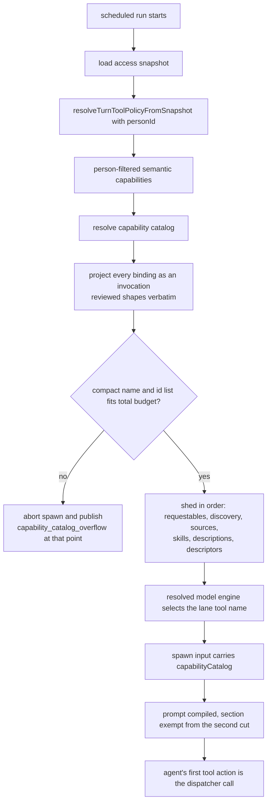

# GRANTED-1-T1 — The scheduled run is told which capabilities it holds

## Context

A scheduled run never receives a capability catalog. `capabilityCatalog` is built
only on the chat path (`runtime/group-agent-access-context.ts:45` calling
`runtime/group-run-context.ts:156`), and the job path
(`jobs/execution-phases-run.ts`) never sets it on the spawn input at `:287`, while
prompt compilation renders only what that input carries
(`runtime/agent-spawn-prompt.ts:87`). The agent guesses, and the KnackLabs job
burned two to four failed calls at the head of seven consecutive runs.

The dispatcher was always reachable (`shared/admin-mcp-tools.ts:96`, filtered at
`runner/gantry-mcp-tool-surface.ts:152`), and that run's own fourth attempt
succeeded through it. The missing element is knowledge, not exposure.

Spec `docs/specs/granted-capability-is-visible.md`; plan
`plans/active/GRANTED-1-agents-can-use-what-they-are-granted.md`; decision 0161.

## The two capability sets

`jobs/execution-phases-run.ts` holds both, and picking the wrong one is the
security risk in this task:

- `inheritedToolPolicy.semanticCapabilities` (`:182`) — resolved through
  `resolveTurnToolPolicyFromSnapshot(accessSnapshot, personId)`, filtered to what
  the acting person is granted. **The catalog uses this one.**
- `semanticCapabilities` (`:194`) — `resolveTurnSemanticCapabilitiesFromSnapshot`,
  no person filter. Feeding it would advertise capabilities the person was never
  granted as ready.

`runtime/group-run-context.ts:156` already accepts a ready capability set, so the
job path reuses it unchanged. No new resolver API.

## What changes

1. **Job path builds and passes the catalog.** Call the existing resolver with
   the person-filtered set and set `capabilityCatalog` on the spawn input at
   `:287`.
2. **`CatalogEntry` gains `invocations`, plural, one shape per calling
   mechanism.** A capability owns an array of bindings
   (`shared/semantic-capabilities.ts:53`) while the catalog projects one entry
   per capability, so a singular field would hide a valid route. Every binding
   renders, in a deterministic order, over the four usable kinds
   (`:25`; legacy `mcp_tool` is rejected at validation). Each kind is called a
   DIFFERENT way, so there is no single neutral dispatcher reference: the
   dispatcher runs local CLI capabilities only, by its own registered
   description (`runner/mcp/tools/capability-run.ts:14`).

   - `local_cli` — the lane-mapped dispatcher name, the capability id, and the
     reviewed argument patterns.
   - `mcp_pattern` — the lane-mapped MCP proxy tool, the connected server name
     and the tool-name pattern.
   - `tool_rule` — the tool name, called directly. Skill actions appear here,
     being a tool rule distinguished by source, under 0129's semantics.
   - `adapter` with a `builtin:` reference — the tool name after that prefix,
     called directly. The raw reference is never rendered.
   - `adapter` of any other shape — informational: display name and stable id
     only, no tool reference and no invented shape.

   The lane mapping therefore applies only to the two dispatcher-style kinds.
   `resolveReadyActions` (`agent-prompt-capability-catalog.ts:137`) populates
   this and stops dropping `stableRef`.

3. **Reviewed shapes render verbatim, everywhere.** The owner ruled that approved
   templates are trusted and no redaction of argument operands is performed, in
   the catalog or anywhere else. The exposure was stated and accepted: template
   validation (`shared/semantic-capabilities.ts:557`) blocks shell syntax and
   environment assignments but not a literal credential such as an API-key flag
   value, and `localCliArgPatterns` (`:541`) serializes verbatim, so a template
   containing one would place it in the prompt. The mismatch denial already emits
   those patterns today, so this changes no existing exposure. What a descriptor
   never carries is the executable path or its hash.
   Template validation (`shared/semantic-capabilities.ts:557`) blocks shell syntax
   and environment assignments but not a literal credential such as an API-key
   flag value, and `localCliArgPatterns` (`:541`) serializes verbatim. The owner
   chose redaction at render over blocking at definition time.
4. **Lane mapping takes the resolved engine, not a runtime flag.**
   `AgentRuntime` is only `worker | inline` (`shared/agent-runtime.ts:9`), a
   different axis from the execution engine, so it cannot select a tool name. The
   engine is already resolved from the model at BOTH prompt-compile call sites:
   `runtime/agent-spawn.ts:179` (`resolvedModel.value.agentEngine`) before the
   compile at `:219`, and `runtime/agent-spawn-host.ts:161` before the compile at
   `:179`. Both pass that engine into `compileSpawnSystemPrompt`, which resolves
   the lane-neutral reference through a small mapping. The `deepagents` engine
   (`shared/agent-engine.ts:10`) has no entry, so it renders no tool name and its
   guidance is unchanged; a test on each path asserts this, so the gap cannot
   drift silently.
5. **Shedding is a total order, and the compact list is defined.** The compact
   representation is one line per grant carrying display name and stable id, and
   nothing else. `prompt-profile-service.ts:54` gains a named default budget and a
   ceiling derived as at least that compact list. The renderer
   (`agent-prompt-capability-guidance.ts:41`) today always includes requestable
   actions and fixed discovery text in every fit calculation and only sheds ready
   descriptions, skills and sources (`:88`), so "non-granted entries" was too
   loose. The shedding order becomes total and explicit: requestable actions,
   then discovery text, then connected-source summaries, then installed skills,
   then ready descriptions, then invocation descriptors, and only the compact list
   remains. Compilation truncates at the section budget
   (`prompt-profile-service.ts:532`) and again at the total prompt budget
   (`:756`), so the capability section is exempted from the second cut below its
   compact representation.
6. **Hard overflow aborts the spawn and publishes at the abort point.** The
   existing callback (`agent-spawn-prompt.ts:58`) only logs counts, and a compile
   error is caught and turned into an empty prompt (`:120`), after which spawning
   continues. Overflow therefore raises a typed failure the catch does not
   swallow. The existing startup publisher
   (`agent-spawn.ts:721 publishRunnerHostStartupDiagnosticFromSpawn`) runs far
   later, immediately before the runner process executes, so it is never reached
   on this path: both spawn paths publish the redacted
   `capability_catalog_overflow` event themselves, with granted and renderable
   counts, at the point they abort.
7. **Deletion and wording.** The 97ded3746 block leaves `runner/mcp/context.ts`;
   the dispatcher description in `runner/mcp/tools/capability-run.ts` points at
   the catalog. Its input schema, risk classification and host enforcement are
   pinned unchanged.

## Non-goals

No change to enforcement, the argv template or the classifier. No migration or
schema change. The runtime flag distinguishing worker from inline is not touched;
it is the wrong axis for engine selection. The DeepAgents catalog is GRANTED-2. Document editing is DOCEDIT-1.
Redaction of argument operands is out of scope by owner ruling: approved
templates are trusted. Blocking literal credentials at capability-definition
validation remains available as later hardening.

## Workflow

## Manual Verification

1. Trigger the KnackLabs job and read the rendered guidance in its prompt record:
   the granted sheets capability appears with display name, stable id, the
   Anthropic tool name and its reviewed argument shape.
2. Query `gantry.runtime_events` for that run: no `tool.activity` row with phase
   `failure` precedes the first successful capability invocation.
3. Compare against a chat turn for the same agent: the same entries render, since
   both lanes share the builder and renderer.
4. Grant the agent enough capabilities that the compact list cannot fit, and
   confirm the run fails at startup with the overflow diagnostic rather than
   starting and silently omitting one.

## Verify

`npx vitest run --config vitest.unit.config.ts apps/core/test/unit/application
apps/core/test/unit/runtime apps/core/test/unit/jobs apps/core/test/unit/runner`,
then `npm run typecheck`, `npm run lint`, `npm run format:check`,
`npm run check:architecture`, and `python3 factory/scripts/verify.py` with
`GANTRY_TEST_DATABASE_URL`.

<!-- forge:contract -->
## Contract (recorded)

Rendered by the harness from the recorded decomposition; edit the decomposition, not this block. It is excluded from the plan's approval and grill digests, so a re-render never stales either.

**Objective.** A scheduled run receives a capability catalog built from the person-filtered inheritedToolPolicy.semanticCapabilities on its existing spawn-input field, so an agent is told which grants it holds. Entries gain an invocation union over the four usable binding kinds with a lane-neutral tool reference and, for local CLI, the reviewed argument patterns. The renderer sheds non-granted material first, never hides a grant, and fails the run closed when even names will not fit.

**Acceptance criteria**

- The scheduled spawn input carries a catalog built from the person-filtered capability set, asserted over the real job execution path where the field is absent today
- A capability active for the app but not granted to the acting person never appears as ready, asserted with the two sets differing
- Rendered guidance carries display name, stable id, neutral tool reference and reviewed argument shape, asserted against exact rendered text
- A descriptor is produced for each of the four usable binding kinds; the adapter reference never appears; a legacy mcp_tool binding still fails validation
- The neutral reference resolves to the Anthropic tool name against the real projection including with tool search active, and the DeepAgents entry is asserted absent
- No grant is hidden: shedding follows the fixed order and the derived ceiling cannot conflict with the never-hide rule
- Hard overflow fails the run before any provider or tool call with a redacted capability_catalog_overflow diagnostic naming the counts
- The never-hide guarantee survives both the section budget and the total prompt budget, asserted end to end through prompt compilation
- A deterministic replay builds the materialization through the production path, asserts the descriptor is present in it, and shows the descriptor is SUFFICIENT to call the production dispatcher: the real dispatcher registration accepts exactly the descriptor's capability id and argument pattern, and with the descriptor removed there is nothing to call. That the model chooses it FIRST is model behaviour a unit test cannot prove and is evidenced by the live run instead
- The 97ded3746 block is gone, the dispatcher description points at the catalog, and its schema, risk and enforcement are pinned unchanged
- No descriptor contains an executable path or hash, asserted against a binding carrying both; reviewed argument operands render verbatim by owner ruling

**Write scope** (what `stage done` measures the diff against)

- apps/core/src/jobs/execution-phases-run.ts
- apps/core/src/application/agents/agent-prompt-capability-catalog.ts
- apps/core/src/application/agents/agent-prompt-capability-guidance.ts
- apps/core/src/application/agents/prompt-profile-service.ts
- apps/core/src/runtime/agent-spawn-prompt.ts
- apps/core/src/runtime/agent-spawn.ts
- apps/core/src/runtime/agent-spawn-host.ts
- apps/core/src/runner/mcp/context.ts
- apps/core/src/runner/mcp/tools/capability-run.ts
- apps/core/test/unit/application/agent-prompt-capability-catalog.test.ts
- apps/core/test/unit/runtime/prompt-profile.test.ts
- apps/core/test/unit/runtime/agent-spawn-prompt.test.ts
- apps/core/test/unit/runtime/agent-spawn-host.test.ts
- apps/core/test/unit/jobs/execution-phases-run.test.ts
- apps/core/test/unit/runner/mcp/locked-introspection.test.ts
- apps/core/test/unit/runner/capability-catalog-replay.test.ts
- apps/core/src/application/agents/agent-profile-service.ts

**Scope amendments** (measured paths the scope did not name, recorded with `forge stage amend-scope`)

- AGENTS.md -- AGENTS.md and harness.yaml carry no net change on this branch: git diff base..HEAD for both paths is empty. They were edited mid-task while applying the owner model policy in this checkout, then restored to their base state once that policy moved to its own branch, which is now PR 510. The measurement counts paths touched across commits rather than the final delta, so both appear as strays while the shipped diff contains neither. Nothing about the model pins belongs in a capability-catalog task.
- harness.yaml -- AGENTS.md and harness.yaml carry no net change on this branch: git diff base..HEAD for both paths is empty. They were edited mid-task while applying the owner model policy in this checkout, then restored to their base state once that policy moved to its own branch, which is now PR 510. The measurement counts paths touched across commits rather than the final delta, so both appear as strays while the shipped diff contains neither. Nothing about the model pins belongs in a capability-catalog task.

**Required tests** (run by `stage done`)

- `the scheduled spawn input carries a capability catalog` -- `VITEST_JUNIT=1 npx vitest run -c vitest.unit.config.ts {path} -t {id} --outputFile={report}` (apps/core/test/unit/jobs/execution-phases-run.test.ts)
- `an ungranted but app-active capability never renders as ready` -- `VITEST_JUNIT=1 npx vitest run -c vitest.unit.config.ts {path} -t {id} --outputFile={report}` (apps/core/test/unit/jobs/execution-phases-run.test.ts)
- `rendered guidance carries name, stable id, lane tool name and reviewed argument shape` -- `VITEST_JUNIT=1 npx vitest run -c vitest.unit.config.ts {path} -t {id} --outputFile={report}` (apps/core/test/unit/runtime/prompt-profile.test.ts)
- `a descriptor is produced for each usable binding kind` -- `VITEST_JUNIT=1 npx vitest run -c vitest.unit.config.ts {path} -t {id} --outputFile={report}` (apps/core/test/unit/application/agent-prompt-capability-catalog.test.ts)
- `a capability with several bindings renders every one of them in a deterministic order` -- `VITEST_JUNIT=1 npx vitest run -c vitest.unit.config.ts {path} -t {id} --outputFile={report}` (apps/core/test/unit/application/agent-prompt-capability-catalog.test.ts)
- `a legacy mcp_tool binding never reaches the catalog` -- `VITEST_JUNIT=1 npx vitest run -c vitest.unit.config.ts {path} -t {id} --outputFile={report}` (apps/core/test/unit/application/agent-prompt-capability-catalog.test.ts)
- `the resolved engine from the worker path selects the Anthropic tool name` -- `VITEST_JUNIT=1 npx vitest run -c vitest.unit.config.ts {path} -t {id} --outputFile={report}` (apps/core/test/unit/runtime/agent-spawn-prompt.test.ts)
- `the resolved engine from the inline host path selects the Anthropic tool name` -- `VITEST_JUNIT=1 npx vitest run -c vitest.unit.config.ts {path} -t {id} --outputFile={report}` (apps/core/test/unit/runtime/agent-spawn-host.test.ts)
- `a deepagents engine renders no tool name and leaves guidance unchanged` -- `VITEST_JUNIT=1 npx vitest run -c vitest.unit.config.ts {path} -t {id} --outputFile={report}` (apps/core/test/unit/runtime/agent-spawn-prompt.test.ts)
- `shedding removes requestables, then discovery, then source summaries, then descriptions, then descriptors` -- `VITEST_JUNIT=1 npx vitest run -c vitest.unit.config.ts {path} -t {id} --outputFile={report}` (apps/core/test/unit/runtime/prompt-profile.test.ts)
- `the compact grant list survives the total prompt budget` -- `VITEST_JUNIT=1 npx vitest run -c vitest.unit.config.ts {path} -t {id} --outputFile={report}` (apps/core/test/unit/runtime/prompt-profile.test.ts)
- `hard overflow aborts the spawn and publishes capability_catalog_overflow before any provider call` -- `VITEST_JUNIT=1 npx vitest run -c vitest.unit.config.ts {path} -t {id} --outputFile={report}` (apps/core/test/unit/runtime/agent-spawn-prompt.test.ts)
- `hard overflow aborts the inline host spawn and publishes the same diagnostic` -- `VITEST_JUNIT=1 npx vitest run -c vitest.unit.config.ts {path} -t {id} --outputFile={report}` (apps/core/test/unit/runtime/agent-spawn-host.test.ts)
- `the granted capability is the first tool action in replay` -- `VITEST_JUNIT=1 npx vitest run -c vitest.unit.config.ts {path} -t {id} --outputFile={report}` (apps/core/test/unit/runner/capability-catalog-replay.test.ts)
- `removing the descriptor stops the replay producing that call` -- `VITEST_JUNIT=1 npx vitest run -c vitest.unit.config.ts {path} -t {id} --outputFile={report}` (apps/core/test/unit/runner/capability-catalog-replay.test.ts)
- `the dispatcher schema, risk and enforcement are unchanged` -- `VITEST_JUNIT=1 npx vitest run -c vitest.unit.config.ts {path} -t {id} --outputFile={report}` (apps/core/test/unit/runner/mcp/locked-introspection.test.ts)

**Verify commands**

- `npx vitest run --config vitest.unit.config.ts apps/core/test/unit/application apps/core/test/unit/runtime apps/core/test/unit/jobs apps/core/test/unit/runner`
- `npm run typecheck`
- `npx eslint apps/core/src/jobs/execution-phases-run.ts apps/core/src/application/agents/agent-prompt-capability-catalog.ts apps/core/src/application/agents/agent-prompt-capability-guidance.ts apps/core/src/application/agents/prompt-profile-service.ts apps/core/src/runtime/agent-spawn-prompt.ts apps/core/src/runtime/agent-spawn.ts apps/core/src/runtime/agent-spawn-host.ts apps/core/src/runner/mcp/context.ts apps/core/src/runner/mcp/tools/capability-run.ts apps/core/src/application/agents/agent-profile-service.ts`
- `npm run format:check`
- `npm run check:architecture`
- `python3 factory/scripts/verify.py`

**Review budget.** 17 files / 1400 lines -- Nine source files and seven test files. Scope widened once for the two spawn seams; the redaction sinks were removed again by owner ruling that approved templates are trusted and reviewed argument shapes render verbatim everywhere. The security lens then required removing a compatibility re-export whose only consumer is agent-profile-service.ts, so that file joins the scope for a one-symbol import change.
<!-- /forge:contract -->
