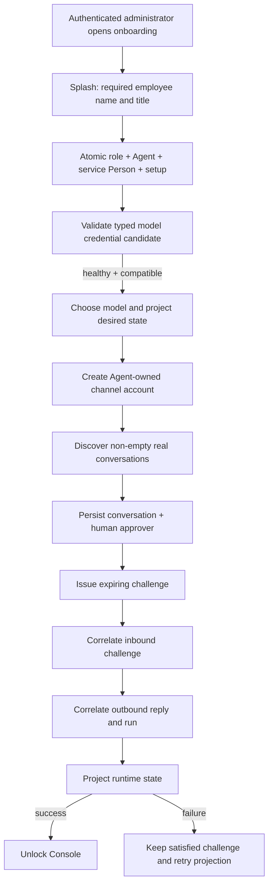

---
decisions_reviewed:
  - 0000-credential-broker-boundary
  - 0001-agent-runtime-platform
  - 0002-symphony-forge-adoption
  - 0003-early-stage-no-backcompat
  - 0004-gantry-naming-and-public-repo
  - 0005-runtime-stack
  - 0006-config-secret-source-boundary
  - 0007-settings-runtime-truth
  - 0008-storage-backend-cutover
  - 0009-canonical-domain-schema-cutover
  - 0010-claude-runtime-materialization
  - 0011-provider-session-artifact-store
  - 0012-browser-capability-boundary
  - 0013-runtime-event-exchange
  - 0014-external-ingress-vs-outbound-webhooks
  - 0015-model-catalog-and-cache-accounting
  - 0016-event-bus-outbox-boundary
  - 0017-jsonb-runtime-payload-boundary
  - 0018-provider-neutral-agent-execution-adapter
  - 0019-simple-permission-and-job-tool-lifecycle
  - 0020-mcp-source-vs-action-capability
  - 0021-capability-artifacts
  - 0022-delivery-vehicle
  - 0023-deployment-modes
  - 0024-locked-preset
  - 0025-settings-authority
  - 0027-process-roles-and-multi-live
  - 0028-agent-harness-selection
  - 0029-agent-communication-reaction-binding
  - 0030-agent-communication-reasoning-safety
  - 0031-send-message-files-authority
  - 0032-signed-artifact-links-deferred
  - 0033-teams-reactions-deferred
  - 0034-client-signoff
  - 0035-epics-approved
  - 0040-permission-execution-two-axis-model
  - 0041-client-signoff
  - 0042-decision-view-16k-prefix-stripped
  - 0043-classifier-risk-only-engine-authz
  - 0044-ci-runner-isolation
  - 0045-inbound-attachment-descriptor-writer
  - 0046-llm-process-local-admission
  - 0050-agent-removal-projection-cleanup
  - 0051-client-signoff
  - 0052-birthright-self-surface
  - 0053-permission-no-timeout-interactive
  - 0054-decision-provenance-and-risk-label
  - 0055-client-signoff
  - 0056-durable-cancellation-invariant
  - 0057-arch1-client-signoff
  - 0058-readonly-scheduler-birthright
  - 0062-perm6-client-signoff
  - 0063-perm7-client-signoff
  - 0064-client-signoff
  - 0065-perm8-client-signoff
  - 0066-race-1-skill-artifact-app-isolation
  - 0067-client-signoff
  - 0068-race-2-cluster-fenced-settings-projection
  - 0069-client-signoff
  - 0070-client-signoff
  - 0071-race-4-browser-profile-lock-aba
  - 0072-client-signoff
  - 0073-race-6-profile-mirror-version-guard
  - 0074-race-8-mandatory-atomic-async-admission
  - 0075-race-9-serialize-file-backed-settings-write
  - 0076-client-signoff
  - 0077-race-5-lease-loss-lifecycle
  - 0078-lat-3a-single-memory-hydration-per-turn
  - 0079-client-signoff
  - 0080-lat-3b-retain-authoritative-second-fetch
  - 0081-client-signoff
  - 0082-fence-1-durable-lease-generation
  - 0083-conv-001-client-signoff
  - 0084-client-signoff
  - 0085-lat-4a-fused-inbound-envelope-transaction
  - 0086-client-signoff
  - 0087-lat-5-durable-provider-history-coverage
  - 0088-client-signoff
  - 0089-thread-turns-read-channel-context
  - 0090-sender-allowlist-trigger-only
  - 0091-client-signoff
  - 0092-client-signoff
  - 0093-client-signoff-is-a-pinned-project-gate
  - 0094-conversation-file-trust-program
  - 0095-client-signoff
  - 0096-thread-recency-message-timestamp
  - 0097-public-session-conversation-aggregate
  - 0098-streamed-message-projection-timing
  - 0099-rate-limits-singleton-authority
  - 0100-mig-1-client-signoff
  - 0101-oidc-generic-google-first
  - 0102-runtime-hardening-audit-harvest
  - 0103-live-admission-terminal-retention
  - 0104-co-1-recovery-intent-reframe
  - 0105-physical-attachment-workspace-handoff
  - 0106-scheduled-runs-cannot-mutate-jobs
  - 0107-typed-permission-decision-provenance
  - 0108-job-definition-revision-fencing
  - 0109-semantic-capability-job-dependencies
  - 0110-live-ux-capability-dispatcher
  - 0112-legacy-single-canonical-shape
  - 0113-enforce-no-backcompat-architecture-check
  - 0114-canonical-job-owner
  - 0115-autonomous-tool-denial-terminal
  - 0117-scheduled-job-declare-tools-at-creation
  - 0118-identity-scoped-approval-and-grants
  - 0119-provider-neutral-group-approver-bootstrap
  - 0120-local-cli-structured-invocation
  - 0122-capability-template-amendment
  - 0123-recovery-proposal-birthright
  - 0124-bounded-durable-card-delivery
  - 0125-host-only-template-amendment
  - 0126-typed-terminal-denial-event
  - 0127-tagged-setup-action-model
  - 0128-permission-approval-result
  - 0129-capsafe-local-cli-terminal-wildcard
  - 0130-capsafe-capability-run-dispatch-only
  - 0132-adaptive-browser-authentication-access
  - 0133-gantry-tool-correlation-response-meta
  - 0134-autonomous-compound-runcommand-leaf-authorization
  - 0135-browser-model-provider-credential-facade
  - 0136-voice-as-provider-adapter
  - 0137-connector-accounts-mirror-provider-accounts
  - 0138-agents-are-service-kind-persons
  - 0142-third-console-role-approver
  - 0143-browser-write-only-secret-ingest
  - 0144-autonomous-ask-and-wait-chat-parity
  - 0151-browser-navigation-summary
  - 0153-learned-decisions-project-into-job-grants
  - 0154-human-decision-memory-generic-scope
  - 0155-default-allow-gantry-tools-interactive-auto
  - 0156-ai-employee-console-resumable-deployment
  - 0157-jobs-use-the-chat-permission-ladder
  - 0158-provider-session-context-ceiling
  - 0159-adapter-session-release-port
  - 0160-physical-column-naming-is-snake-case
  - 0161-granted-capabilities-must-be-discoverable
  - 0162-onboarding-v2-legacy-adoption
  - 0163-onboarding-v2-migration-baseline
---

# ONBOARDING-V2-1-T1 — Adopt and harden the complete V2 onboarding flow

## Problem

The approved V2 onboarding experience exists only on local archive `feat/v2-onboarding` and predates current Forge delivery. Its final product tree must be adopted from base `97ded374637fd12b92dc05dbc2e482bd23035109` through inspected tip `31bc4cf0740fdaad87482ba1a0c84fa1212c9fad`, but its intermediate migrations and several readiness/security defects cannot ship.

## Scope / Non-goals

Transplant the pinned product delta into the Forge-created task worktree from current `origin/main`; exclude archive `.factory/**` and all archive migration SQL/journal/snapshots. Hydrate decisions 0162/0163, the confirmed specifications, and the immutable HTML reference from planning commit `829500087`, verifying its SHA-256 before implementation. Preserve current-main overlaps, including the exact Node `>=24 <25` range. Add the focused application owner, shared credential/discovery seams, complete browser/OpenAPI safety contract, one generated migration, required hardening, product tests, deterministic visual proof, review, and rebuilt-runtime evidence.

Do not modify Factory scripts/tests, rewrite or push the archive, redesign Console, add transports, fabricate readiness, change public SDK/CLI contracts, add compatibility schema, push/open the task PR, or mark shipped. The user holds the PR command. Only Slack live tenant proof remains a release gate.

## Acceptance Criteria

- The task worktree hydrates decisions 0162 and 0163, both V2 specifications, and the V2 HTML reference from planning commit `829500087`; the reference SHA-256 is `c1dc1305abd4876f74ac7b0c8e097205c891b3478fb3ab7f7db1ec6f72259a45`, and `feat/v2-onboarding` remains untouched.
- The splash and all four onboarding steps conform to the immutable V2 reference in light and dark themes, saved and system reduced-motion modes, and `1920x956`, `1469x800`, `1280x800`, `1024x768`, `768x1024`, and `375x812` viewports, with only documented deterministic masks.
- The same-origin browser onboarding facade requires administrator session auth, trusted Origin, CSRF, and hosted recent reauthentication; rejects Bearer credentials and automatic mutation replay; sends `no-store`; uses the repository browser error envelope documented in OpenAPI with `x-gantry-browser-auth`; and keeps browser, audit, and error projections secret-free.
- The focused onboarding application service atomically creates the custom role, Agent, service Person, desired-state revision, audit event, and resumable setup; one setup exists per app, explicit retry reuses its idempotency key, a changed payload conflicts, and upstream changes invalidate only dependent progress.
- Model setup accepts only `auto`, `anthropic_sdk`, and `deepagents` for `agentHarness` and only compatible credential modes; a candidate is verified through shared model-provider preflight before persistence, failed candidates preserve a prior healthy credential, models stay unavailable until validation, and successful secret inputs clear.
- Channel setup stores only runtime-owned `gantry-secret:` references, supports existing direct, `env:`, and `aws-sm:` modes when policy permits, returns a typed policy-disabled result otherwise, never projects channel secrets into agent capability secrets, and requires non-empty real discovery before completion.
- Provider selection is deterministic from live capability/provider support, Slack is preselected only when supported, Teams remains setup-only, provider accounts are Agent-owned with service-Person projection, direct-message approvers derive automatically from the counterpart, and group approvers require the recognized installer or validated manual membership.
- The verification challenge persists account, conversation, canonical thread, code, inbound message, outbound message, and onboarding run identity; run identity is carried through outbound send metadata and persisted projection; expiry, replay, account/conversation/thread/code mismatch, outbound-before-inbound, and projection failure are typed, and projection retry preserves a satisfied challenge.
- Exactly one generator-produced current-schema pre-release migration and snapshot covers setup, verification and provider-account correlation, constraints, and indexes; lifecycle tables use UUID row identifiers plus actor/timestamp audit fields, archive migration history is excluded, the migration is regenerated from a clean baseline, and the migration directory remains clean afterward.
- The adopted web implementation preserves current-main package metadata including Node `>=24 <25`, uses repository primitives and Tailwind where appropriate, and splits the oversized onboarding route and workspace modules at real responsibility boundaries so route/page modules remain below 300 lines.
- Focused tests cover browser/model/provider/lifecycle/OpenAPI/migration/visual contracts, including replay conflict, invalidation, service-Person ownership, harness values, secret modes, empty discovery, provider fallback, Teams setup-only, DM/group rules, expiry/replay/mismatch, run/thread correlation, projection retry, journal integrity, immutable reference hash, and Console gating.
- Lint, formatting, type checks, web/runtime builds, disposable-Postgres proof, Forge verification, one three-lens autoreview with motion review, and a rebuilt-runtime check of `/healthz`, `/readyz`, and `/ui/onboarding` are recorded before the user-held PR handoff; live Slack tenant proof remains release-only.

## Technical Approach

1. Hydrate governing docs from commit `829500087`; assert the HTML reference hash, then apply only the pinned archive product tree. Resolve `apps/web/package.json`, `package-lock.json`, schema exports, and the journal toward current main, preserving Node `>=24 <25`.
2. Add a focused application onboarding service as atomic owner of custom role, Agent, service Person, first config revision, audit event, unique setup, dependent revision, and idempotency result. Its Postgres adapter executes one transaction; HTTP maps typed DTOs/errors only.
3. Enforce the browser boundary and document browser routes with `x-gantry-browser-auth`; keep their existing nested browser error envelope as the repository-specific same-origin facade contract rather than pretending they use Bearer/public-API envelopes.
4. Validate complete model credential candidates through existing model-provider preflight before persistence, including exact harness values and compatibility. Preserve a healthy stored credential on failure and clear successful browser drafts. Store channel credentials only as runtime-owned `gantry-secret:` references, supporting current direct/reference modes and typed policy refusal.
5. Select providers from live capabilities deterministically, keep Teams setup-only, refuse empty discovery, create Agent-owned accounts/service-Person aliases, auto-derive DM approvers, and validate group installer/manual membership.
6. Extend the existing outbound send options and durable message projection with onboarding `runId`; persist exact account/conversation/canonical-thread/code/inbound/outbound/run correlation and retain a satisfied challenge across projection retry.
7. Generate one Drizzle migration from the current schema with UUID row identifiers, actor/timestamp audit fields, snake_case physical columns, foreign keys, partial active uniqueness, and expiry/correlation indexes. Regenerate from clean baseline and require a clean migration diff after generation.
8. Adopt and split the V2 React/Tailwind/SVG/Iconify/Fontsource/Sonner implementation at the splash, shell/rail, model, workspace, assignment, and verification boundaries; route/page modules stay below 300 lines. Preserve exact motion/reduced-motion and accessibility contracts.
9. Add focused Vitest/Postgres proof and a Playwright Core plus browser-Canvas visual oracle against the hashed HTML. Include `375x812`, wait for local fonts, freeze named frames, mask only listed intentional deviations, and fail on every other pixel; also check keyboard focus, labels, contrast, responsive states, and 200 percent zoom.
10. Rebuild/restart runtime, retain logs/listener evidence, prove `/healthz`, `/readyz`, and `/ui/onboarding`, then execute the full browser flow. Record evidence through Forge and stop before push/PR.

## Decisions

Decision 0162 authorizes the one-task legacy exception and a 90-file/50,000-line review budget. Decision 0163 requires one generated pre-release baseline. Decisions 0000, 0006, 0135, and 0143 govern secret separation/write-only ingestion; 0028 fixes `agentHarness`; 0118/0119 fix DM/group approvers; 0132, 0138, 0142, and 0156 govern browser access, identity, roles, and readiness. Browser onboarding remains an internal same-origin facade with its existing safe envelope and explicit OpenAPI auth extension. The new onboarding lifecycle tables follow the constitution's UUID and actor/timestamp rules rather than claiming a technical-table exemption.

The V2 HTML owns visual primitives. The confirmed spec, visual-contract deviation list, and active safety decisions own behavior. No new decision is introduced.

## Surface Impact

| Surface | Classification | Reason |
| --- | --- | --- |
| Runtime behavior | Changed | Durable setup, invalidation, real discovery, correlation, projection, and Console gates. |
| API | Changed | Protected browser onboarding and Slack-manifest routes plus safe OpenAPI documentation. |
| Data/schema | Changed | One generated setup/idempotency/verification migration. |
| CLI/ops | Unchanged by design | Browser-only flow; runtime build/restart commands are reused. |
| UI | Changed | Splash, rail, four steps, themes, motion, responsive states, drawers, and global toasts. |
| Docs | Changed | Governing decisions/specs/reference are hydrated; credential, channel, runtime, web UI, and Slack operations ownership stay aligned. |
| Tests | Changed | Core/web/Postgres/visual product proof plus recorded review/functional evidence. |
| Factory scripts/tests | Unchanged by design | Forge is consumed, never modified. |
| SDK/contracts | Unchanged by design | No public API, SDK, CLI, or provider protocol change. |

## Task Decomposition

One task, `ONBOARDING-V2-1-T1`, `user_facing: true`. Decision 0162 is the story-only exception to normal backend/frontend separation. Review budget is 90 files and 50,000 changed lines because the pinned archive has 62 product files/5,521 handwritten lines before one generated snapshot, and hardening adds shared provider seams, UI module boundaries, governing docs, and focused tests. Forge's twice-budget hard stop remains.

## Risks

- Selective transplant can regress current main: inspect every overlap and keep main's package/journal/route ownership.
- Candidate credentials can destroy healthy state or leak: validate before commit, preserve failures, clear browser drafts, and assert response/log/audit redaction.
- Readiness can be fabricated by ordering bugs: persist and test every negative transition, exact correlation, and projection retry.
- Generated metadata is large: accept exactly one generator-owned snapshot and no archive history or manual edits.
- Visual checks can flake: pin browser inputs, use local fonts, named frames, documented masks, and deterministic Canvas comparisons.
- The legacy task is broad: keep the pinned source boundary, small cohesive commits, explicit budget, required tests, and one three-lens review.

## Verify Plan

- Run each required-test contract from the protected decomposition with fresh JUnit output.
- Run focused onboarding web/core suites plus the schema-isolated Postgres lifecycle suite.
- Generate migrations, assert the migration directory remains clean, then run the migration-history check, root/web lint and format checks, root/web type checks, architecture check, web build, and runtime build.
- Run the deterministic visual oracle at `1920x956`, `1469x800`, `1280x800`, `1024x768`, `768x1024`, and `375x812` for dark/light, motion/reduced-motion, named frames, keyboard/labels/contrast, and 200 percent zoom; verify the reference hash first.
- Run `python3 factory/scripts/verify.py`.
- Run one direct autoreview pass covering quality, performance, and security, plus animation review; resolve and reverify every blocking finding.
- Rebuild/restart local runtime and prove listener/logs, `/healthz`, `/readyz`, `/ui/onboarding`, and the full authenticated flow through Console.

## Workflow

## Manual Verification

1. Start from a clean disposable database and authenticate as administrator. Confirm first visit shows the V2 splash; empty employee name/title reveal inline errors and do not advance.
2. Verify exact light/dark splash and Steps 1–4 at every named viewport. Check the fixed 266px rail, centered KnackLabs lockup, SVG state progression, focus rings, card/accordion scrolling, always-visible footer navigation, and mobile block.
3. Toggle saved reduced motion and system reduced motion separately. Confirm motion runs by default, mark/role/rail/transition sequences match named frames, and movement stops or becomes the specified fade without hiding state.
4. Exercise each allowed model provider/auth mode, including Bedrock variants. Confirm models remain locked/loading until validation, a failed candidate retains the prior healthy credential, successful secrets disappear from browser inputs/state, explicit model choice is required, and Back/Continue resume without revalidation when inputs did not change.
5. In Slack Step 2, confirm Slack is preselected, the prefilled manifest URL and setup drawer are accurate/copyable, Create completes honestly, Connect validates `xapp-`/`xoxb-` tokens, empty discovery does not complete, and successful real discovery enables Continue. Confirm non-Slack providers keep their supported flows.
6. Persist a DM conversation and confirm its counterpart becomes approver automatically, then exercise a group path with recognised installer/manual membership validation. Confirm invalid people and cross-account conversations are rejected without losing completed upstream state.
7. Send the exact challenge. Confirm wrong account/conversation/thread/code, replay, expired challenge, and outbound-before-inbound remain incomplete. Force projection failure after valid correlation, confirm the challenge remains satisfied, then retry projection and unlock Console only after success.
8. Restart the rebuilt runtime mid-flow and confirm durable resume at the last valid step. Verify `/healthz`, `/readyz`, and `/ui/onboarding`, then complete Console entry.

<!-- forge:contract -->
## Contract (recorded)

Rendered by the harness from the recorded decomposition; edit the decomposition, not this block. It is excluded from the plan's approval and grill digests, so a re-render never stales either.

**Objective.** From the Forge task worktree based on current origin/main, transplant the pinned product delta 97ded374637fd12b92dc05dbc2e482bd23035109..31bc4cf0740fdaad87482ba1a0c84fa1212c9fad, hydrate its governing documents from planning commit 829500087, correct the recorded safety defects, generate one current-schema migration, and leave local PR-ready evidence without pushing or opening a PR.

**Acceptance criteria**

- The task worktree hydrates decisions 0162 and 0163, both V2 specifications, and the V2 HTML reference from planning commit 829500087; the reference has SHA-256 c1dc1305abd4876f74ac7b0c8e097205c891b3478fb3ab7f7db1ec6f72259a45, and feat/v2-onboarding remains untouched.
- The splash and all four onboarding steps conform to the immutable V2 reference in light and dark themes, saved and system reduced-motion modes, and 1920x956, 1469x800, 1280x800, 1024x768, 768x1024, and 375x812 viewports, with only documented deterministic masks.
- The same-origin browser onboarding facade requires administrator session auth, trusted Origin, CSRF, and hosted recent reauthentication; rejects Bearer credentials and automatic mutation replay; sends no-store responses; uses the repository browser error envelope documented in OpenAPI with x-gantry-browser-auth; and keeps browser, audit, and error projections secret-free.
- The focused onboarding application service atomically creates the custom role, Agent, service Person, desired-state revision, audit event, and resumable setup; one setup exists per app, explicit retry reuses its idempotency key, a changed payload conflicts, and upstream changes invalidate only dependent progress.
- Model setup accepts only the exact agentHarness values auto, anthropic_sdk, and deepagents and only compatible credential modes; a candidate is verified through the shared model-provider preflight before persistence, failed candidates preserve a prior healthy credential, models stay unavailable until validation, and successful secret inputs clear.
- Channel setup stores only runtime-owned gantry-secret references, supports the existing direct, env:, and aws-sm: reference modes when policy permits, returns a typed policy-disabled result otherwise, never projects channel secrets into agent capability secrets, and requires non-empty real conversation discovery before completion.
- Provider selection is deterministic from live capability and provider support, Slack is preselected only when supported, Teams remains setup-only, provider accounts are Agent-owned with service-Person projection, direct-message approvers derive automatically from the counterpart, and group approvers require the recognized installer or validated manual membership.
- The verification challenge persists account, conversation, canonical thread, code, inbound message, outbound message, and onboarding run identity; the run identity is carried through outbound send metadata and its persisted projection; expiry, replay, account/conversation/thread/code mismatch, outbound-before-inbound, and projection failure are typed, and projection retry preserves a satisfied challenge.
- Exactly one generator-produced current-schema pre-release migration and snapshot covers resumable setup, verification correlation, provider-account correlation, constraints, and indexes; lifecycle tables use UUID row identifiers and actor/timestamp audit fields, archive migration history is excluded, the migration is regenerated from a clean baseline, and the migration directory remains clean afterward.
- The adopted web implementation preserves current-main package metadata including Node >=24 <25, uses repository primitives and Tailwind where appropriate, and splits the oversized onboarding route and workspace modules at real responsibility boundaries so route/page modules remain below 300 lines.
- Focused browser, model, provider, lifecycle, OpenAPI, migration, and visual tests cover idempotency conflict, invalidation, service-Person ownership, harness values, secret modes, empty discovery, provider fallback, Teams setup-only behavior, DM/group rules, expiry/replay/mismatch, run and thread correlation, projection retry, migration journal integrity, immutable reference hash, and Console gating.
- Lint, formatting, type checks, web and runtime builds, disposable-Postgres proof, deterministic Forge verification, one three-lens autoreview with motion review, and a rebuilt-runtime functional check of healthz, readyz, and ui/onboarding are recorded before the user-held PR handoff; live Slack tenant proof remains release-only.

**Write scope** (what `stage done` measures the diff against)

- apps/core/src/adapters/llm/
- apps/core/src/adapters/storage/postgres/repositories/
- apps/core/src/adapters/storage/postgres/schema/
- apps/core/src/application/model-credentials/
- apps/core/src/application/onboarding/
- apps/core/src/application/provider-conversations/
- apps/core/src/app/bootstrap/
- apps/core/src/channels/
- apps/core/src/cli/
- apps/core/src/control/server/
- apps/core/src/domain/
- apps/core/src/runtime/
- apps/core/test/
- apps/web/
- docs/architecture/agent-runtime.md
- docs/architecture/channel-interactions.md
- docs/architecture/credential-management.md
- docs/architecture/web-ui-foundation.md
- docs/decisions/0162-onboarding-v2-legacy-adoption.md
- docs/decisions/0163-onboarding-v2-migration-baseline.md
- docs/operations/
- docs/reference/onboarding/
- docs/specs/v2-first-agent-onboarding.md
- docs/specs/v2-first-agent-onboarding-visual-contract.md
- package-lock.json

**Required tests** (run by `stage done`)

- `enforces the complete same-origin onboarding boundary and documents browser auth` -- `npx vitest run -c vitest.unit.config.ts {path} -t {id} --reporter=default --reporter=junit --outputFile.junit={report}` (apps/core/test/unit/control/server/browser-onboarding.test.ts)
- `validates candidates before persistence and preserves a healthy credential on failure` -- `npx vitest run -c vitest.unit.config.ts {path} -t {id} --reporter=default --reporter=junit --outputFile.junit={report}` (apps/core/test/unit/control/server/browser-onboarding.test.ts)
- `accepts only auto anthropic_sdk and deepagents with compatible providers` -- `npx vitest run -c vitest.unit.config.ts {path} -t {id} --reporter=default --reporter=junit --outputFile.junit={report}` (apps/core/test/unit/control/server/browser-onboarding.test.ts)
- `keeps channel credentials runtime owned across direct reference and policy disabled modes` -- `npx vitest run -c vitest.unit.config.ts {path} -t {id} --reporter=default --reporter=junit --outputFile.junit={report}` (apps/core/test/unit/control/server/browser-onboarding.test.ts)
- `does not complete discovery when no supported conversations are returned` -- `npx vitest run -c vitest.unit.config.ts {path} -t {id} --reporter=default --reporter=junit --outputFile.junit={report}` (apps/core/test/unit/control/server/browser-onboarding.test.ts)
- `selects supported providers deterministically and leaves Teams setup only` -- `npx vitest run -c vitest.unit.config.ts {path} -t {id} --reporter=default --reporter=junit --outputFile.junit={report}` (apps/core/test/unit/control/server/browser-onboarding.test.ts)
- `creates one resumable setup and conflicts on changed idempotent replay` -- `npx vitest run -c vitest.integration.postgres.config.ts {path} -t {id} --reporter=default --reporter=junit --outputFile.junit={report}` (apps/core/test/integration/onboarding-verification.postgres.integration.test.ts)
- `invalidates only downstream onboarding progress` -- `npx vitest run -c vitest.integration.postgres.config.ts {path} -t {id} --reporter=default --reporter=junit --outputFile.junit={report}` (apps/core/test/integration/onboarding-verification.postgres.integration.test.ts)
- `assigns direct and group approvers from the correct provider identities` -- `npx vitest run -c vitest.integration.postgres.config.ts {path} -t {id} --reporter=default --reporter=junit --outputFile.junit={report}` (apps/core/test/integration/onboarding-verification.postgres.integration.test.ts)
- `correlates account conversation thread code messages and run before projection` -- `npx vitest run -c vitest.integration.postgres.config.ts {path} -t {id} --reporter=default --reporter=junit --outputFile.junit={report}` (apps/core/test/integration/onboarding-verification.postgres.integration.test.ts)
- `preserves a satisfied challenge while projection retries` -- `npx vitest run -c vitest.integration.postgres.config.ts {path} -t {id} --reporter=default --reporter=junit --outputFile.junit={report}` (apps/core/test/integration/onboarding-verification.postgres.integration.test.ts)
- `keeps the single generated onboarding migration in journal order` -- `npx vitest run -c vitest.unit.config.ts {path} -t {id} --reporter=default --reporter=junit --outputFile.junit={report}` (apps/core/test/unit/storage/postgres-migration-journal.test.ts)
- `keeps models locked until compatible credentials validate and clears successful drafts` -- `npx vitest run -c apps/web/vitest.config.ts --root . {path} -t {id} --reporter=default --reporter=junit --outputFile.junit={report}` (apps/web/src/features/onboarding/onboarding-model-setup.test.ts)
- `keeps Console handoff locked until exact verification and projection complete` -- `npx vitest run -c apps/web/vitest.config.ts --root . {path} -t {id} --reporter=default --reporter=junit --outputFile.junit={report}` (apps/web/src/onboarding-step-one.test.ts)
- `matches the immutable V2 reference outside documented masks at all required viewports` -- `npx vitest run -c apps/web/vitest.config.ts --root . {path} -t {id} --reporter=default --reporter=junit --outputFile.junit={report}` (apps/web/src/onboarding-visual-acceptance.test.ts)

**Verify commands**

- `npm run db:migrations:generate`
- `git diff --exit-code -- apps/core/src/adapters/storage/postgres/schema/migrations`
- `npm run db:migrations:check`
- `npm run lint`
- `npm run lint:web`
- `npm run format:check`
- `npm run format:check:web`
- `npm run typecheck`
- `npm run typecheck:web`
- `npm run check:architecture`
- `npm run build:web`
- `npm run build:runtime`

**Review budget.** 90 files / 50000 lines -- Decision 0162 authorizes one interleaved legacy-adoption task. The pinned archive contains 62 product files and 5521 handwritten changed lines before one generator-owned Drizzle snapshot; the added allowance covers real UI module boundaries, shared provider seams, governing documents, and focused tests without authorizing unrelated scope.
<!-- /forge:contract -->
