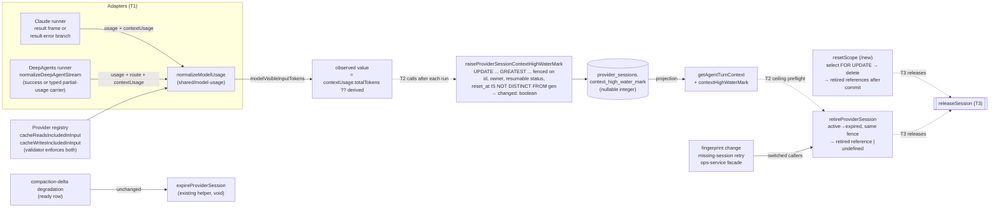

# cache-bug-T1 — Measurement, storage, and the quality gate

Story plan: `plans/active/cache-bug-bound-provider-session-context-growth-across-runner-restarts.md`
(approved). Spec: `docs/specs/cache-bug.md`. Decisions: 0158, 0159, 0017.

## Problem

The host has no measure of how much context a persistent provider session
carries, no typed place to store one, and no retirement operation that reports
whether it won. `expireProviderSession` returns `void`; `resetScope` deletes
provider-session rows and returns nothing; `totalBillableInputTokens` subtracts
cache reads so it cannot stand in for context size; the DeepAgents normaliser
does not carry its resolved route and drops usage when a turn throws; the
Claude result-error branch throws before normalising usage. Core ESLint exists
but neither `verify.py` nor CI runs it.

## Scope / Non-goals

In scope: the measurement seam, the typed column and two fenced repository
operations, `resetScope` returning references, the turn-context projection,
partial usage on both adapters' error frames, registry cache-inclusion
booleans with validation, and the diff-scoped `npm run lint:changed` gate
under verify and CI (full lint advisory; debt D-0080).

Non-goals: reading the mark for policy or raising it after a run (T2), any
release of DeepAgents state (T3), the cap setting (T2), events (T2), docs (T2).
No behaviour change for users in this task: sessions resume exactly as today.

## Workflow

What this task builds is the measurement-and-storage path that T2 will switch
on. Data moves left to right; T1 stops at the dashed boundary.

Three callers of the old expiry (fingerprint change, missing-session retry,
the ops-service facade and its `canonical-ops-repo.postgres.ts` twin) switch
to `retireProviderSession` in this task and keep their current behaviour; the
returned reference is discarded until T3 consumes it. The compaction-delta
degradation path operates on a `ready` row and stays on the existing
`expireProviderSession` helper, unchanged, per decision 0159 §4. Inline
runtime lanes (`agentRuntime: 'inline'`) for both adapters are in scope for
the partial-usage change and emit one terminal error output with usage, the
same shape as the worker frames.

## Acceptance Criteria

As recorded on the decomposition for `cache-bug-T1` (S1, S2/R2, S3/R1, R1,
R3, R4 return type, projection, S11 lint, S10 pinned tests).

## Technical Approach

1. **Registry booleans.** Add `cacheReadsIncludedInInput` and
   `cacheWritesIncludedInInput` to `ModelProviderPromptCacheSupport` in
   `model-provider-registry.ts` (the type lives there, ~line 95); set Anthropic `false/false`, OpenAI and
   OpenRouter (and every `openai-compatible` lane that reads
   `prompt_tokens_details.*`) `true/true`; routes with cache mode `none` are
   `true/true` by construction. The existing registry validator gains one
   check: an executable route whose prompt cache support lacks either boolean
   fails with a named error.
2. **Derivation.** `modelVisibleInputTokens(usage: NormalizedModelUsage)` in
   `shared/model-usage.ts`: resolve the route from `usage.modelRoute`
   (fallback `usage.provider`); additive when either boolean is false or the
   route is unresolved; inclusive otherwise. Pure function, no I/O.
3. **DeepAgents route + partial usage.** `deep-agent-runner.ts` passes the
   resolved route id it already uses for cache-provider resolution into
   `normalizeDeepAgentStream`; `normalizedUsage` sets `provider` and
   `modelRoute`. On a thrown turn the normaliser attaches a typed
   `DeepAgentPartialUsage` value (accumulated usage + `usageEventId` + route)
   to a `DeepAgentTurnFailure` wrapper; `deep-agent-runner.ts` propagates it
   and `runner/index.ts` writes `usage` on the `status: 'error'` frame.
4. **Claude partial usage.** In the `result` branch of
   `query-loop-phases-messages.ts`, normalise the message usage and throw a
   typed `QueryFailure` (a value-carrying error class in `runner/types.ts`)
   holding `{ message, usage, usageEventId }` instead of a bare `Error`; the
   throw propagates through `runQuery` untouched, and the `catch` in
   `runner/index.ts` unwraps it and writes `usage` on the single
   `status: 'error'` frame. No early emission, so exactly one error frame.
   The Claude inline lane (`inline-lane/index.ts`, its `throw new
   Error(failure)` at the result branch) mirrors this: it emits one terminal
   error output carrying the accumulated usage.
4b. **DeepAgents inline lane.** `deepagents-langchain/inline-lane` applies the
   same `DeepAgentPartialUsage` carrier so an errored inline turn emits one
   terminal error output with usage.
5. **Schema + migration.** `contextHighWaterMark: integer('context_high_water_mark')`
   on `providerSessionsPostgres`; run
   `npm run db:migrations:generate -- --name provider_session_context_high_water_mark`
   and commit exactly what drizzle-kit emits (SQL, snapshot, journal).
6. **Repository operations** in `canonical-session-repository-helpers.postgres.ts`:
   `raiseProviderSessionContextHighWaterMark` (one UPDATE with `GREATEST`,
   joined to `agent_sessions`, predicate on id, owner, `status IN resumable`,
   `reset_at IS NOT DISTINCT FROM $gen`; returns `rowCount > 0`) and
   `retireProviderSession` (one UPDATE `status='expired'` with `RETURNING`,
   predicate adds `status='active'` and provider/external id; returns the
   reference or `undefined`). Value validation lives in
   `domain/sessions/provider-session-measurement.ts` with
   `ProviderSessionMeasurementError`. Port signatures in
   `domain/repositories/ops-repo.ts`; the facade in
   `canonical-session-ops-service.ts` exposes both and returns the reference.
7. **resetScope.** Select the provider-session references `FOR UPDATE` inside
   the transaction before deleting, return them after commit as a readonly
   list; on no-route or empty paths return a readonly empty list, never
   `undefined`. The ops-service `resetScope`, the
   `canonical-ops-repo.postgres.ts` facade (`deleteSession` currently
   discards the result) and `app.clearSessionForChatJid` propagate the list;
   callers ignore it until T3.
8. **Projection.** `providerSessionContext` returns `contextHighWaterMark`.
9. **Lint gate (diff-scoped).** `package.json` gains `lint:changed` (ESLint
   over the TypeScript files changed against the merge-base with
   `origin/main`); `.envrc` `FACTORY_STRUCTURAL_CMD` gains
   `&& npm run lint:changed`; the CI check step runs `lint:changed` as a
   blocking step and keeps full `npm run lint` as an advisory
   `continue-on-error` step. Every file this task touches is lint-clean. The
   82 pre-existing errors outside the diff are deferral D-0080 with a
   trigger (a lint-debt paydown story lands, then `lint:changed` becomes
   `lint`); they are neither fixed, baselined nor suppressed here.

## Decisions

No new decisions. 0158 §1–2 and 0159 §3 govern; 0017 places the mark in a
typed column.

## Surface Impact

| Surface | Class | Note |
| --- | --- | --- |
| Runtime behaviour | Changed | error frames from both runners and both inline lanes now carry partial usage; fingerprint and missing-session retirement go through the atomic retire; sessions still resume exactly as today because nothing reads the mark yet (T2) |
| API | N-A | none |
| Data/schema | Changed | one nullable integer column, generated migration |
| CLI/ops | Changed | `npm run lint:changed` in verify and CI (full lint advisory) |
| UI | N-A | none |
| Docs | Unchanged by design | T2 owns docs/memory and architecture alignment |
| Tests | Changed | nine required tests plus pinned tests untouched |

## Task Decomposition

This is a leaf task; no further split.

## Risks

- Generated migration drift: run `db:migrations:check` before and after.
- The `FROM agent_sessions` join in both UPDATEs must not widen the match;
  the null/null and null-vs-non-null tests pin it.
- Lint may surface debt outside the diff; deferral, not scope creep.
- Postgres tests need `GANTRY_TEST_DATABASE_URL` (test database only).

## Verify Plan

On Node 24 (`.nvmrc`): `npm run db:migrations:check`, `npm run typecheck`,
`npm run lint:changed`, the twenty-five required tests (derivation including
the provider fallback, registry validation, repository fences, caller
switches, both runners' and both inline lanes' error frames, the
`clearSessionForChatJid` reference propagation, the four pinned tests), then
`python3 factory/scripts/verify.py`, which is itself a recorded verify
command so the `.envrc` lint wiring is proven. The Postgres leaf runs on the
host against a throwaway pgvector database.

## Manual Verification

1. Apply the migration to a scratch database: `npm run db:migrate`. Observe
   `\d provider_sessions` shows `context_high_water_mark integer` nullable.
2. Run the Postgres suite for the new operations with
   `GANTRY_TEST_DATABASE_URL` set:
   `npx vitest run -c vitest.integration.postgres.config.ts apps/core/test/integration/provider-session-context-high-water-mark.postgres.integration.test.ts`.
   Observe all cases green, including the null/null fence and the lost
   transition returning `undefined`.
3. Start a live Slack or web turn against the running app and send one
   message. Observe the reply arrives exactly as before (no policy change) and
   `SELECT context_high_water_mark FROM provider_sessions` is still `NULL`
   for that session, because raising is T2's job.
4. Force a DeepAgents turn to fail (for example an invalid model credential).
   Observe the runner's error frame in the logs carries a `usage` object with
   the accumulated counts and the resolved route.
5. Run `python3 factory/scripts/verify.py`. Observe it now executes
   `npm run lint` and passes.
