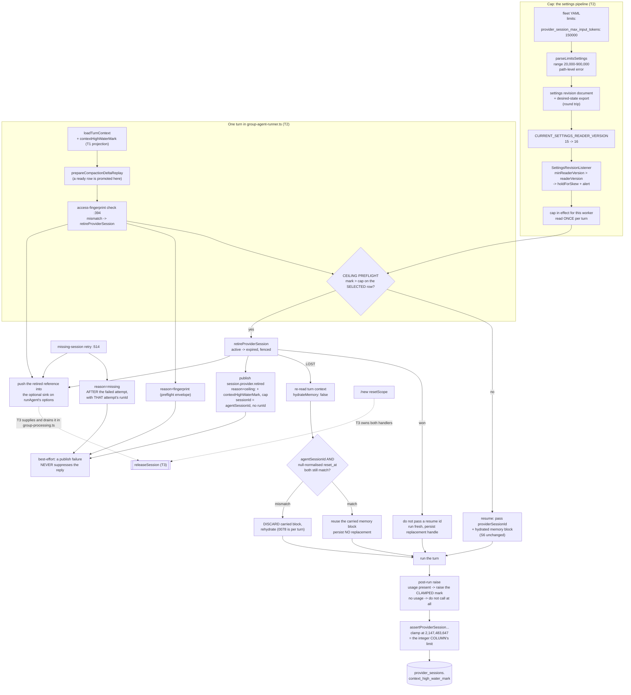

# cache-bug-T2 — Ceiling policy, the cap setting, and event types

Story plan: `plans/active/cache-bug-bound-provider-session-context-growth-across-runner-restarts.md`
(approved). Spec: `docs/specs/cache-bug.md`. Decisions: 0158, 0159, 0025, 0078,
0160. Depends on `cache-bug-T1` (merged, #501).

## Problem

T1 built the measurement and the storage and stopped at the boundary: nothing
raises the mark after a run, nothing reads it, and no operator can say how big
is too big. Four concrete gaps sit between T1's column and a session that
actually retires.

`raiseProviderSessionContextHighWaterMark` exists and is never called, so
`provider_sessions.context_high_water_mark` is `NULL` for every row. There is
no setting for the cap: `runtime-settings-limits-parser.ts` accepts only
`<providerId>.requests_per_minute`, so the ceiling has no number to compare
against. `group-agent-runner.ts` resumes any resumable row without looking at
the mark. And the retirements T1 already performs — access-fingerprint change
at `:394`, missing-session retry at `:514` — are silent: they return a
reference nobody reads and emit no event, so an operator cannot tell a retired
session from a lost one.

There is also a defect T1 could not carry, because T1 is sealed.
`context_high_water_mark` is a Postgres `integer` (`schema/sessions.ts:89`)
while `assertProviderSessionContextHighWaterMark`
(`domain/sessions/provider-session-measurement.ts:16`) validates only
"non-negative integer". An observation above 2,147,483,647 therefore passes
validation, reaches SQL, and fails the write — leaving an over-cap session
unmarked and resumable, which is the exact outcome the ceiling exists to
prevent. T2 owns the measurement path, so T2 owns the clamp.

## Scope / Non-goals

In scope: the clamp at the column's limit; the
`limits.provider_session_max_input_tokens` setting through the whole settings
pipeline with the reader-version bump; the ceiling preflight and the post-run
raise in `group-agent-runner.ts`; the lost-race re-read with both its
branches; both retirement event families with payloads discriminated on the
reason; the ceiling, fingerprint and missing-session publications; the
collection of retired references for T3; the operator procedures and the
schema-checked observability recipe; and the `canonical-domain-model.md`
correction.

Non-goals: any release of DeepAgents checkpoint state, the `releaseSession`
port, the cleanup coordinator and the `/new` publication — all T3, which owns
both `/new` handlers. The typed HTTP contract for
`/v1/settings/desired-state` is T4. The resolved model route is NOT in scope:
it is already correct, and deferral D-0083 which claimed otherwise is
withdrawn (lesson 157). The per-request measurement seam and a
capacity-relative cap stay deferred (D-0086), as does delta-snapshot resume
(D-0087) and the DeepAgents largest-not-summed billing question (D-0088).

## Workflow

Two independent paths meet at the preflight: a cap arrives from settings, a
mark arrives from measurement, and the comparison decides whether this turn
resumes or starts fresh. T2 stops at the dashed boundary — it collects
retired references but never releases anything.

Two boundary facts decide the shape of this task.

The preflight sits **after** `prepareCompactionDeltaReplay` and **after** the
fingerprint check, and evaluates the mark on the selected row only. Both
predecessors can change which row this turn resumes — the replay promotes a
`ready` row, the fingerprint check retires and clears the resume id — so a
preflight placed earlier would judge a row that is not the one about to be
used. A `maintenance_compact` row is resumable and is not retired by the
ceiling.

The retired references leave through an **optional sink on `runAgent`'s
options**, not through its return value. `GroupAgentRunResult` is the bare
union `'success' | 'error' | 'stopped'` (`group-agent-runner.ts:59`), so
widening it would edit `group-processing-types.ts:81` and `group-processing.ts`
— T3's files, and T3's drain boundary is deliberately in `group-processing.ts`
because `runAgent` is awaited at `:669` while
`finalizeGroupAgentUserVisibleOutput` runs at `:778`, after it. An absent sink
is a no-op that cannot throw, so T2 is complete and correct on its own.

## Acceptance Criteria

The ten criteria and their bound plan contracts are recorded in
`.factory/stories/cache-bug/decomposition.json` under `cache-bug-T2`
(`T2-AC1`..`T2-AC10`). They are not restated here; the contract is the record
and this plan must not drift from it.

## Technical Approach

**The clamp.** `domain/sessions/provider-session-measurement.ts` gains the
column's limit as a named constant and the raise path stores
`Math.min(observed, limit)`. The constant derives from the `integer` column
type and must NOT be expressed in terms of the cap's 900,000 maximum. An
earlier draft used 900,001, one above the largest configurable cap, which
silently coupled a policy range to a storage limit: a real mark can exceed
900,001 on a ~1M-context model, and widening the cap range past 900,000 would
leave a clipped mark unable to exceed the cap — ending retirement for exactly
the sessions the ceiling targets, with nothing failing to show it. Negative
and non-integer values still raise `ProviderSessionMeasurementError`; clamping
is for the top end only, where the value is real but unstorable.

**The cap setting.** `provider_session_max_input_tokens` parses as a sibling
of the provider entries rather than inside one, because it is not
provider-specific. It defaults to 150,000 and rejects outside 20,000-900,000
with a path-level error, matching the existing parser's failure style. It
round-trips through `settings-revision-document.ts` and
`desired-state-current-export.ts`, and `CURRENT_SETTINGS_READER_VERSION` goes
15 to 16 (`settings-fleet-import.ts:71`) so a worker that predates the key
holds its last-applied revision through `holdForSkew` and raises a skew alert
instead of silently ignoring a setting it cannot read. Per decision 0025 the
cap is settings-owned: it is read through the revision pipeline, never from an
environment variable.

**The event types.** Both families register in
`domain/events/runtime-event-types.ts` with payloads discriminated on
`reason` — `providerSessionHash` and `executionProviderId` always,
`contextHighWaterMark` and `cap` only for `reason = ceiling`. The other three
reasons are not caused by a cap check, so those two fields are causal evidence
that does not exist for them, and the type omits them rather than carrying
nulls indistinguishable from unknown values. `providerSessionHash` is the full
lowercase hex SHA-256 of the raw external session id, matching the recipe's
`encode(sha256(external_session_id::bytea), 'hex')`.

Making that discrimination compile-time safe needs a change to how these
events are published. `RuntimeEventPublishInput` carries `payload: unknown`
(`domain/events/events.ts:103`), so a standalone payload interface binds
nothing at the call site. That type has six or more consumers across
`app/bootstrap/`, so narrowing it globally would ripple well outside this
task; the intended shape is a typed publish helper for these two families that
narrows the payload and keeps the general port as it is. Whichever form is
chosen, the check is behavioural: a wrong payload for a `reason` must fail to
compile. No event family in this repository carries a `version` field, so
these follow that convention; if canon turns out to require versioning, that
gets its own decision rather than a one-off versioned family here.

Publication is best-effort. A failed publish is logged and swallowed — it
never suppresses or delays the user's reply, which is the whole point of the
ceiling being invisible to the person talking to the agent.

**The lost race.** A lost `active -> expired` transition means a concurrent
writer changed the row. The re-read uses `hydrateMemory: false` because
decision 0078 makes hydration exactly-once per turn, and the carried block is
reused only when the agent session id and the null-normalised `reset_at`
generation both still match. On a mismatch the carried block is discarded and
memory rehydrated: a mismatch means a reset happened, and reusing the block
would leak the retired session's memory into its replacement. Both branches
carry coverage, because an implementation that handles only the match branch
passes every test that does not reset concurrently.

**The operator surface.** `docs/memory/provider-session-ceiling-operations.md`
carries the pre-deploy reset with its stop condition, the orphan scan, and the
observability recipe. The recipe SQL is extracted from the document by the
Postgres test and executed against the live schema, so the document cannot
drift from the schema without a test failing. Physical column names in the
recipe are snake_case per decision 0160.

## Decisions

No new decision record. 0158 fixes the retire-after-observed-crossing rule and
the `contextUsage.totalTokens`-first measure; 0159 §4 fixes which callers move
and which stay; 0025 makes the cap settings-owned; 0078 makes memory
hydration once per turn, which is what forces the `hydrateMemory: false`
re-read; 0160 records snake_case physical columns, which the recipe follows.
The clamp is a defect fix inside an existing contract, not a new choice.

## Surface Impact

No user-visible change for a healthy session: under-cap and unmarked sessions
resume exactly as today, with the same memory block and snapshot. A session
past the cap loses its provider-side continuity on its next turn and keeps its
durable Gantry memory; the reply still arrives. Operators gain one setting,
two event families and a documented recipe. No HTTP contract changes in this
task — the typed DTO for `/v1/settings/desired-state` is T4.

## Task Decomposition

This is a leaf task; no further split. It is wide but single-purpose: every
part serves the ceiling decision, and the two candidates for splitting out
were already split out — the release port to T3 and the settings HTTP contract
to T4.

## Risks

- The preflight's position is load-bearing. Placed before
  `prepareCompactionDeltaReplay` or before the fingerprint check it judges the
  wrong row; the "promotes a ready row" and "leaves maintenance_compact
  resumable" leaves pin it.
- The clamp constant is the one number in this task that is easy to get
  plausibly wrong, and wrong is silent. 900,001 looks reasonable and breaks
  retirement the moment the cap range widens.
- Narrowing `RuntimeEventPublishInput` in place would touch six or more
  bootstrap consumers and turn a typing change into a cross-cutting one.
- A match-only R6 implementation passes any suite that never resets
  concurrently, so the mismatch branch needs a test that forces the reset.
- The reader-version bump is a fleet-wide behaviour: a worker below 16 holds
  its revision. That is the intended failure mode, but it means a partial
  rollout freezes settings for the old workers until they update.
- Postgres tests need `GANTRY_TEST_DATABASE_URL` (a throwaway database only).

## Verify Plan

On Node 24 (`.nvmrc`): `npm run db:migrations:check` (no migration in this
task — it must stay clean), `npm run typecheck`, `npm run lint:changed`, the
twenty-two required tests, then `python3 factory/scripts/verify.py`. The
required set covers the clamp at and above the boundary plus the still-rejected
invalid values; the preflight's resume/retire/fresh path, the crossing run
deferred to the next resume, the promoted `ready` row, the untouched
`maintenance_compact` row and the lost transition; both R6 branches; the cap's
default, its range rejection, its round trip and the reader-version hold; the
discriminated payload typing, the two publication envelopes and the
reply-survives-publish-failure case; the sink's collection order; and the
recipe executed against the schema. The four pinned S6 tests run unchanged and
must stay green without edits. The Postgres leaf runs on the host against a
throwaway pgvector database.

## Manual Verification

1. Put the cap in a fleet YAML as
   `limits: { provider_session_max_input_tokens: 150000 }` and import it.
   Observe it round-trips: `GET /v1/settings/desired-state` returns the key
   with that value, and the revision document carries it.
2. Set it to `19000` and import again. Observe the import is refused with an
   error naming the path `limits.provider_session_max_input_tokens`, not a
   generic parse failure.
3. Set the cap low — `20000` — and hold a normal conversation with an agent
   over several turns until `SELECT context_high_water_mark FROM
   provider_sessions` for that session exceeds it. Observe the mark rises
   after each turn while the session keeps resuming: crossing the cap does not
   retire mid-run.
4. Send one more message. Observe the reply still arrives; the agent has lost
   provider-side continuity but still has its durable memory;
   `SELECT status FROM provider_sessions` shows the old row `expired` and a
   new row `active`; and a `session.provider.retired` event exists with
   `reason = ceiling` carrying `contextHighWaterMark` and `cap`, the hashed
   session id, and `sessionId` set to the agent session with no run id.
5. Repeat step 4's query for a fingerprint retirement (change the runtime
   access projection for that conversation) and observe the same event with
   `reason = fingerprint` and NO `contextHighWaterMark` or `cap` fields —
   absent, not null.
6. Break event publication deliberately (point the outbox at a failing
   writer). Observe the user's reply still arrives and the retirement still
   happened; only the event is missing, with a log line for it.
7. Run a worker built before this change against a revision that requires
   reader version 16. Observe it holds its previously applied revision and
   raises a skew alert rather than applying a document it cannot fully read.
8. Run `python3 factory/scripts/verify.py`. Observe green, including
   `lint:changed`.
