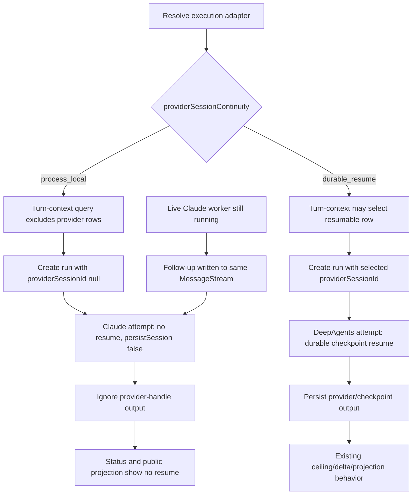

# cache-bug-T3A — Capability-aware continuity and Claude execution

Story plan: `plans/active/cache-bug-bound-provider-session-context-growth-across-runner-restarts.md`.
Specs: `docs/specs/cache-bug.md` and
`docs/specs/process-local-claude-continuity.md`. Governing decisions: 0010,
0018, 0078, 0089, 0158, 0159, and 0163. T1/T2 are already shipped; this task
does not change their measurement or durable-resume ceiling contract.

## Problem

A provider session is currently selected by the canonical turn-context query,
attached to a new run in `live-execution.ts`, passed through
`group-agent-runner.ts`, and then resumed/persisted by the Claude SDK lanes.
Stopping only the SDK `resume` option would be too late: a stale Claude row
would still be linked to canonical execution, enter promotion/delta/ceiling
logic, survive failover, and appear through session status.

This task introduces one adapter-owned continuity capability and applies it
before the first provider-session side effect. Claude declares
`process_local`; DeepAgents declares `durable_resume`. Core code consumes the
capability and never asks whether the provider is Claude or Anthropic.

## Scope / Non-goals

In scope:

- the adapter capability and exhaustive declarations;
- turn-context selection before `live-execution.ts` creates a run;
- the live-recovery coordinator and inline-task lifecycle turn-context reads;
- run linkage, runner resume selection, provider-row lifecycle, result
  persistence, and failover attempt isolation;
- Claude worker and inline SDK calls with `persistSession: false` and no
  `resume`;
- session interaction, chat `/status`, and public resume projection filtering;
- same-process worker MessageStream continuation;
- same-PR architecture/runtime docs and a hermetic restart agent-e2e.

Non-goals: the exact fresh snapshot/digest/memory/job composition and SDK
filesystem teardown (T3B), `/compact` (T3C), DeepAgents `releaseSession` and
`/new` cleanup (T3D), rollout deletion (T3E), or the desired-state API (T4).
No schema migration and no provider-name conditional are allowed.

## Workflow



The capability is resolved before `getAgentTurnContext`. The full production
chain is owned: `domain/repositories/ops-repo.ts`,
`schema/canonical-ops-repo.postgres.ts`,
`services/canonical-session-ops-service.ts`, and the canonical session
repository. The repository applies the continuity predicate before releasing
maintenance locks, promoting a ready row, ordering candidates, or selecting a
row; a post-fetch filter is forbidden. Consequently `live-execution.ts`
creates the run with no provider association. The runner repeats the guard defensively before
promotion, delta replay, ceiling/fingerprint retirement, input construction,
run metadata update, and result persistence.

Failover creates isolated attempt state. Each candidate performs a
non-hydrating, generation-fenced turn-context re-read and computes resume input
and persistence permission from its own adapter; the already-hydrated Gantry
memory block is reused only under decision 0078's existing fence. A DeepAgents
handle may not flow into a Claude fallback, and a Claude-first attempt may not
leave persistence disabled for a successful DeepAgents fallback. A successful
DeepAgents attempt keeps its existing resume/lifecycle/persistence behavior.

The worker lane preserves only the already-live MessageStream. A later worker
starts fresh. The inline lane has no long-lived stream and every invocation is
fresh.

## Acceptance Criteria

The three criteria and their `T3A-P1` through `T3A-P3` plan contracts are
rendered from the protected decomposition below. The implementation must
satisfy them together: blocking SDK resume without blocking selection/run
linkage is incomplete, and filtering selection while still accepting Claude
output handles is also incomplete.

## Technical Approach

### Capability declaration

Add:

```ts
type ProviderSessionContinuity = 'process_local' | 'durable_resume';
```

and a required readonly `providerSessionContinuity` field to
`AgentExecutionAdapter`. Claude declares `process_local`; DeepAgents declares
`durable_resume`. Every concrete and test adapter—including the claim-protocol,
runtime-host-child-process, and inline-agent-runtime integration fixtures—must
declare one explicitly so a cast cannot silently turn `undefined` into a
durable default.

### Admission and repository selection

Resolve the adapter before every turn-context read that can create or recover a
run: live admission, live recovery, and inline-task lifecycle. Extend the
turn-context domain port, canonical ops facade, application service, and
Postgres repository input with the capability (or the minimal typed selection
policy derived from it). The Postgres operation must avoid maintenance-lock
release, ready-row promotion, ordering, and provider-row selection entirely for
`process_local`; this is stronger than hiding fields after the query. The
process-local branch still returns
the canonical agent session and hydrated Gantry state; only provider-session
fields are absent.

`live-execution.ts` therefore passes `null`/absence to
`createSessionAgentRun`. A unit/integration seam must assert the call itself,
not merely inspect a later projection.

### Runner lifecycle and failover

Resolve continuity once per attempt. For `process_local`:

- clear resume provider/external ids before compaction-delta, fingerprint, or
  ceiling consumers;
- set provider-session persistence disallowed;
- omit `sessionId` from runner input;
- ignore `newSessionId`/provider-session output and never update run provider
  metadata;
- keep scheduled-job behavior unchanged.

Do not remove the existing durable-resume branches. DeepAgents keeps ready-row
promotion, compaction delta replay, fingerprint/ceiling retirement, checkpoint
resume, and persisted output.

Failover attempt state is constructed fresh for each candidate adapter. Tests
cover DeepAgents-to-Claude and Claude-to-DeepAgents boundaries so no handle or
permission boolean is accidentally shared.

### Claude SDK lanes

In the worker query setup, pass `persistSession: false` and no `resume` even if
an upstream test fixture supplies a session id. In the inline lane, do the same
and do not surface a new SDK session id as provider-session output. Keep the
live worker's MessageStream input path intact; do not create an equivalent
persistent inline stream.

### Projection

The provider-session repository port gains a capability-aware query input, and
the production control-server wiring supplies the execution-adapter continuity
resolver to `SessionInteractionModule`. Filtering occurs in
`session-repositories.postgres.ts` before order/limit, so a newer stale Claude
row cannot mask an older valid DeepAgents row. The query receives the registered
`durable_resume` provider-id allowlist; an unknown or removed provider is
excluded fail-closed instead of throwing during a read-only status request or
being treated as durable. `hasProviderResume` and public resume projections are
false/absent for stale Claude and unknown-provider rows. This is a read-policy
fence, not a destructive cleanup.

Chat `/status` has a separate status-only continuity read. It must hide
process-local ready/maintenance provider state before formatting the
compaction status, while `/compact` continues to use its existing provider
locking path until T3C. Do not apply a global filter to the shared command
context that would silently implement part of T3C in this task.

### Canon

Update `session-resume.md`, `runtime-components.md`,
`canonical-domain-model.md`, the relevant `docs/SPEC.md` runtime sections, and
`runner/AGENTS.md` in this PR. They must say that provider continuity is
capability-aware, Claude resumes only inside its live worker stream, and
DeepAgents remains durable.

## Decisions

No new decision record. Decision 0163 chooses process-local Claude continuity;
0018 requires the provider-neutral adapter seam; 0158/0159 retain durable
ceiling/release behavior; 0078 and 0089 preserve Gantry memory/snapshot
ownership. The implementation must not reinterpret those decisions as a
provider-id switch.

Existing TypeScript, Drizzle repository patterns, Vitest, and the hermetic
agent-e2e harness are the selected tools under decision 0005; no dependency is
added.

The provider boundary follows
`constitution/pnp-provider-pattern-for-integration.md`; the port/service/
adapter dependency direction and policy placement follow
`constitution/pnp-coding-standards-modular-monolith.md`.

Recurring `contract-partial` tripwire: enumerate every producer and consumer
of `providerSessionContinuity`. If review finds any selection, linkage,
lifecycle, persistence, failover, or projection path still bypassing it, stop
and escalate rather than patching only that site.

## Surface Impact

| Surface | Class | Reason |
| --- | --- | --- |
| Runtime behavior | Changed | Claude restarts fresh; live worker continuation and DeepAgents durability remain |
| API | Changed | Existing session/status responses no longer report resumable Claude state |
| Data/schema | Unchanged by design | No migration; stale rows are filtered now and removed by T3E |
| CLI/ops | Unchanged by design | Rollout commands belong to T3E |
| UI | N-A | No UI work |
| Docs | Changed | Runtime/session canon changes with behavior |
| Tests | Changed | Unit/integration plus hermetic restart agent-e2e |

## Task Decomposition

This is one bounded task. Admission, runner guards, SDK setup, failover, and
projection must land together because any missing consumer reopens a durable
Claude association. Reconstruction/filesystem lifetime, compaction, release,
rollout deletion, and HTTP typing are separate tasks with different harnesses.

## Risks

- Filtering after run creation is too late. Assert the repository result and
  `createSessionAgentRun` input.
- A provider-name conditional would duplicate adapter policy and fail when a
  new process-local adapter appears. Audit for ids/literals in changed core
  code.
- A shared mutable failover variable can carry a DeepAgents handle into Claude.
  Construct and assert per-attempt state in both directions; Claude-to-
  DeepAgents must reselect durable state without rehydrating memory.
- Setting `persistSession: false` could accidentally disable the live worker
  stream. Pin same-process continuation separately from restart behavior.
- Filtering stale rows only in the public DTO leaves ceiling/delta lifecycle
  active. Test selection and every lifecycle entry, not just output shape.
- Reusing the status filter for `/compact` would cross the T3C boundary. Pin a
  chat `/status` test that hides Claude state while the `/compact` dependency
  remains unchanged.
- Registry lookup is strict on execution paths, but read-only projections must
  not 500 on removed adapters. Build the durable provider allowlist from
  registered adapters and exclude unknown rows before order/limit.

## Verify Plan

- Run every required leaf rendered from the protected decomposition.
- Run `npm run typecheck` and `npm run lint:changed`.
- Run the relevant unit/integration suites for runner ceiling, live admission,
  live recovery, inline task lifecycle, Claude SDK boundary, failover, session
  interaction, and chat `/status`.
- Run the provider-session continuity Postgres integration leaf; fail if a
  process-local read releases a maintenance lock, promotes/selects a row, or
  lets a newer stale row mask an older durable row.
- Run `npm run test:e2e:agent:hermetic`; the restart scenario must show one
  fresh briefing and no provider-session association, while the live-stream
  scenario still continues.
- Run scheduled-job regressions unchanged.
- Run the real Postgres-backed DeepAgents checkpoint create/resume leaf and the
  Claude and DeepAgents scheduled-job leaves as required stage tests, not only
  as broad-suite expectations.
- Run `python3 factory/scripts/verify.py`.
- Fail the task if any Claude path selects, attaches, resumes, persists,
  promotes, delta-replays, retires, or projects a provider session; if any
  DeepAgents durable behavior changes; or if canon still claims universal
  provider-session resume.

## Manual Verification

1. Run the focused T3A unit and integration suites and confirm the new
   process-local and unchanged DeepAgents cases pass.
2. Run the hermetic agent-e2e scenario that sends a turn, stops/recreates the
   Claude worker, then sends another turn. Observe a fresh Claude attempt with
   no resume id or duplicate provider history.
3. In the same harness, send a follow-up while the first worker remains alive.
   Observe it use the same live MessageStream.
4. Seed a stale Claude provider row and fetch session status. Observe no
   `hasProviderResume` signal and no provider association on the new run.
5. Run the corresponding DeepAgents restart case. Observe the checkpoint
   resume and context-ceiling path remain active.

<!-- forge:contract -->
## Contract (recorded)

Rendered by the harness from the recorded decomposition; edit the decomposition, not this block. It is excluded from the plan's approval and grill digests, so a re-render never stales either.

**Objective.** Add adapter-owned provider-session continuity and enforce it before admission, run linkage, failover, lifecycle, persistence, status, or projection. Claude becomes process-local while the worker's live MessageStream and all DeepAgents durable behavior remain intact.

**Acceptance criteria**

- Claude worker restarts and inline attempts receive no resume id, create no provider handle or run linkage, and expose no public resume signal; the live worker MessageStream still accepts same-process follow-ups.
- Turn-context selection excludes process-local rows before live-execution creates a run, and ceiling, delta replay, promotion, retirement, persistence, failover, status, and public projection all consume the adapter capability rather than a provider id.
- DeepAgents durable resume, ceiling, checkpoint persistence, and scheduled-job behavior remain green; governing docs and a hermetic restart agent-e2e ship with the behavior.

**Write scope** (what `stage done` measures the diff against)

- apps/core/src/application/agent-execution
- apps/core/src/application/sessions
- apps/core/src/domain/repositories/ops-repo.ts
- apps/core/src/domain/ports/repositories.ts
- apps/core/src/adapters/llm/anthropic-claude-agent
- apps/core/src/adapters/llm/deepagents-langchain/execution-adapter.ts
- apps/core/src/adapters/storage/postgres/repositories
- apps/core/src/adapters/storage/postgres/schema/canonical-ops-repo.postgres.ts
- apps/core/src/adapters/storage/postgres/services/canonical-session-ops-service.ts
- apps/core/src/app/bootstrap/live-execution.ts
- apps/core/src/app/bootstrap/live-recovery-coordinator.ts
- apps/core/src/app/bootstrap/inline-agent-task-lifecycle.ts
- apps/core/src/app/bootstrap/runtime-services.ts
- apps/core/src/control/server/index.ts
- apps/core/src/runtime
- apps/core/src/session/session-commands.ts
- apps/core/test/unit
- apps/core/test/e2e/claim-protocol-two-process.postgres.e2e.test.ts
- apps/core/test/integration/claude-agent-sdk-boundary.integration.test.ts
- apps/core/test/integration/deepagents-langchain-boundary.postgres.integration.test.ts
- apps/core/test/integration/inline-agent-runtime.integration.test.ts
- apps/core/test/integration/provider-session-continuity.postgres.integration.test.ts
- apps/core/test/integration/runtime-host-child-process.integration.test.ts
- apps/core/test/agent-e2e/scenarios/claude-fresh-restart.agent-e2e.test.ts
- docs/architecture/session-resume.md
- docs/architecture/runtime-components.md
- docs/architecture/canonical-domain-model.md
- docs/SPEC.md
- apps/core/src/runner/AGENTS.md

**Scope amendments** (measured paths the scope did not name, recorded with `forge stage amend-scope`)

- apps/core/src/app/bootstrap/inline-agent-loop-tools.ts -- Include measured task-lifecycle caller wiring and legacy durable-continuity fixtures required to propagate the adapter capability and preserve DeepAgents behavior.

**Required tests** (run by `stage done`)

- `continues a live Claude worker without provider persistence` -- `VITEST_JUNIT=1 npx vitest run -c vitest.unit.config.ts {path} -t {id} --reporter=junit --outputFile={report}` (apps/core/test/unit/runner/agent-runner-ipc.test.ts)
- `starts a recovered Claude worker without a resume id or persisted handle` -- `VITEST_JUNIT=1 npx vitest run -c vitest.unit.config.ts {path} -t {id} --reporter=junit --outputFile={report}` (apps/core/test/unit/runtime/provider-session-continuity.test.ts)
- `keeps recovered process-local turns detached from provider sessions` -- `VITEST_JUNIT=1 npx vitest run -c vitest.unit.config.ts {path} -t {id} --reporter=junit --outputFile={report}` (apps/core/test/unit/bootstrap/live-recovery-coordinator.test.ts)
- `keeps inline process-local task turns detached from provider sessions` -- `VITEST_JUNIT=1 npx vitest run -c vitest.unit.config.ts {path} -t {id} --reporter=junit --outputFile={report}` (apps/core/test/unit/bootstrap/inline-agent-loop-tools.test.ts)
- `starts every Claude inline attempt without resume or persistence` -- `VITEST_JUNIT=1 npx vitest run -c vitest.unit.config.ts {path} -t {id} --reporter=junit --outputFile={report}` (apps/core/test/unit/runtime/provider-session-continuity.test.ts)
- `filters a stale process-local row before run creation and lifecycle` -- `VITEST_JUNIT=1 npx vitest run -c vitest.unit.config.ts {path} -t {id} --reporter=junit --outputFile={report}` (apps/core/test/unit/runtime/provider-session-continuity.test.ts)
- `keeps provider-session state attempt-local across DeepAgents to Claude failover` -- `VITEST_JUNIT=1 npx vitest run -c vitest.unit.config.ts {path} -t {id} --reporter=junit --outputFile={report}` (apps/core/test/unit/runtime/provider-session-continuity.test.ts)
- `reselects durable state without rehydrating memory across Claude to DeepAgents failover` -- `VITEST_JUNIT=1 npx vitest run -c vitest.unit.config.ts {path} -t {id} --reporter=junit --outputFile={report}` (apps/core/test/unit/runtime/provider-session-continuity.test.ts)
- `selects no process-local row or lifecycle side effect while preserving a durable row` -- `VITEST_JUNIT=1 npx vitest run -c vitest.integration.postgres.config.ts {path} -t {id} --reporter=junit --outputFile={report}` (apps/core/test/integration/provider-session-continuity.postgres.integration.test.ts)
- `hides stale process-local rows from status and public resume projection` -- `VITEST_JUNIT=1 npx vitest run -c vitest.unit.config.ts {path} -t {id} --reporter=junit --outputFile={report}` (apps/core/test/unit/application/sessions/session-interaction-module.test.ts)
- `excludes unknown provider rows from status and public resume projection` -- `VITEST_JUNIT=1 npx vitest run -c vitest.unit.config.ts {path} -t {id} --reporter=junit --outputFile={report}` (apps/core/test/unit/application/sessions/session-interaction-module.test.ts)
- `hides process-local provider compaction state from status without changing compact` -- `VITEST_JUNIT=1 npx vitest run -c vitest.unit.config.ts {path} -t {id} --reporter=junit --outputFile={report}` (apps/core/test/unit/session/session-commands.test.ts)
- `preserves durable DeepAgents resume and context ceiling behavior` -- `VITEST_JUNIT=1 npx vitest run -c vitest.unit.config.ts {path} -t {id} --reporter=junit --outputFile={report}` (apps/core/test/unit/runtime/group-agent-runner-context-ceiling.test.ts)
- `streams runner frames from a gateway-backed OpenAI run and persists the session` -- `VITEST_JUNIT=1 npx vitest run -c vitest.integration.postgres.config.ts {path} -t {id} --reporter=junit --outputFile={report}` (apps/core/test/integration/deepagents-langchain-boundary.postgres.integration.test.ts)
- `does not resume or persist SDK sessions for scheduled job turns` -- `VITEST_JUNIT=1 npx vitest run -c vitest.unit.config.ts {path} -t {id} --reporter=junit --outputFile={report}` (apps/core/test/unit/runner/agent-runner-ipc.test.ts)
- `runs scheduled jobs without opening a checkpoint session` -- `VITEST_JUNIT=1 npx vitest run -c vitest.unit.config.ts {path} -t {id} --reporter=junit --outputFile={report}` (apps/core/test/unit/adapters/deepagents-inline-lane.test.ts)
- `restarts Claude without duplicate provider history` -- `VITEST_JUNIT=1 npx vitest run -c vitest.agent-e2e.config.ts {path} -t {id} --reporter=junit --outputFile={report}` (apps/core/test/agent-e2e/scenarios/claude-fresh-restart.agent-e2e.test.ts)

**Verify commands**

- `npm run typecheck`
- `npm run lint:changed`
- `npm run test:e2e:agent:hermetic`
- `python3 factory/scripts/verify.py`

**Review budget.** 40 files / 3600 lines -- The task crosses live admission, recovery, inline task lifecycle, adapter setup, failover, repository lifecycle, public and chat status projection, exhaustive test adapters, docs, and focused proof because one capability must fence every provider-session side effect atomically. The task grill expanded the budget from 30/2600 after finding mandatory consumers and integration fixtures outside the first scope; reconstruction, SDK filesystem lifetime, compaction admission, release, rollout cleanup, and the settings API remain split into later tasks.
<!-- /forge:contract -->
