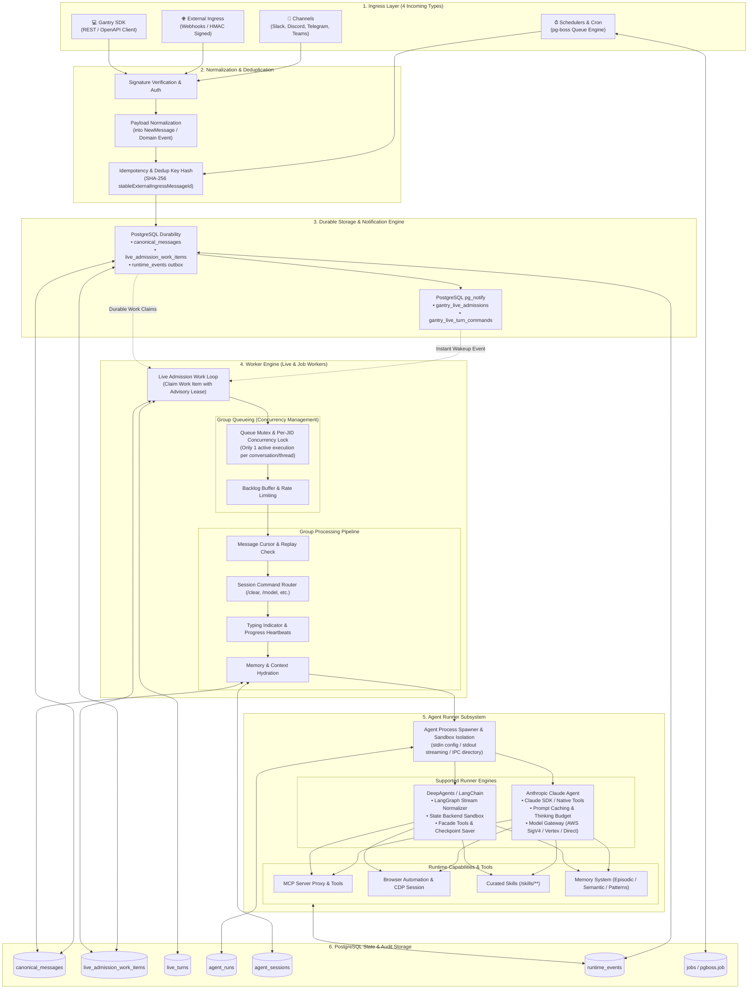
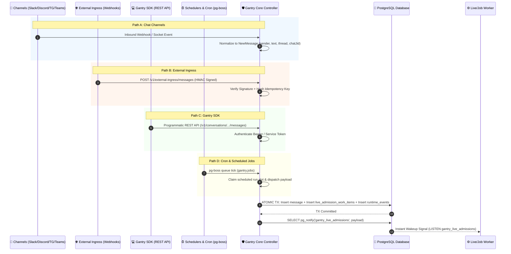
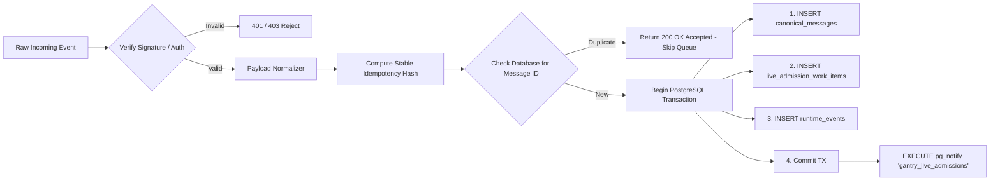
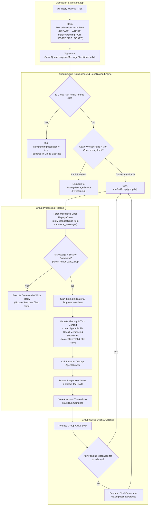
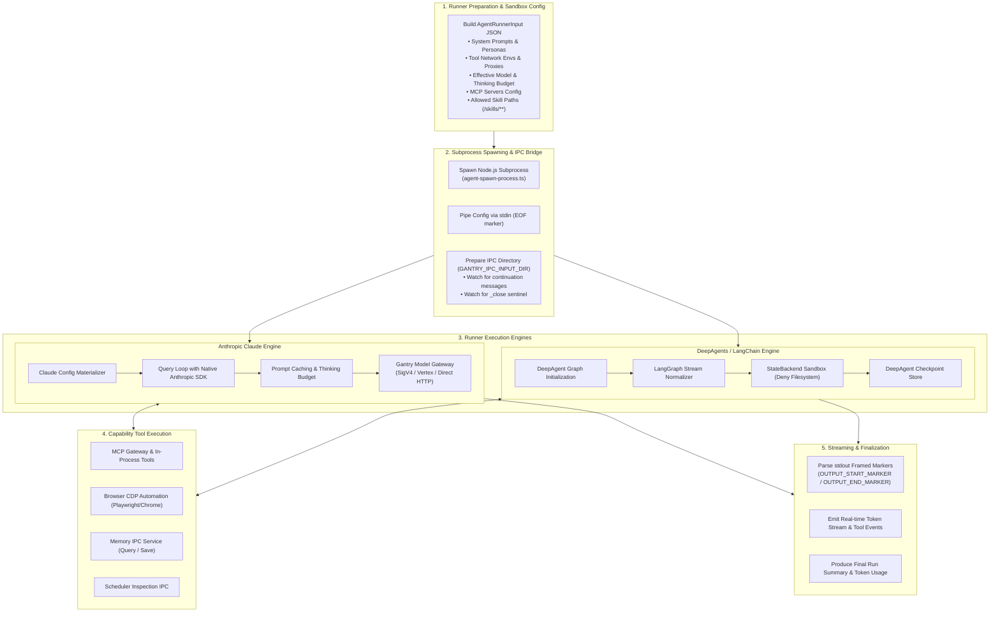
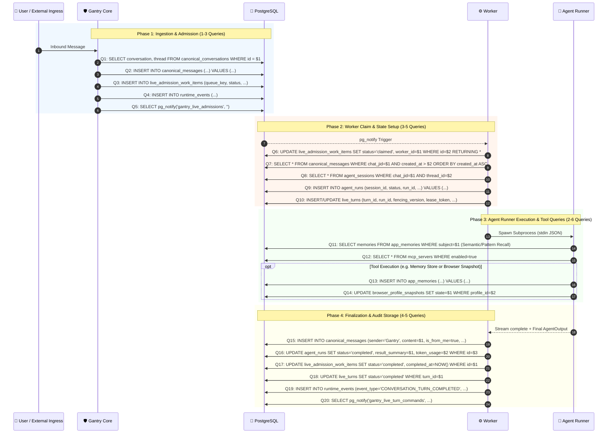

# Gantry Architecture Blueprint & Execution Flow

This document provides a deep architectural breakdown and end-to-end execution flow of the **Gantry** agent platform (`https://github.com/knacklabs/gantry.git`).

---

## 1. High-Level Architectural Flow

---

## 2. The 4 Incoming Entrypoints

Gantry accepts work through four distinct entry mechanisms, unified into a single durable processing pipeline:

### 2.1. Chat Channels (`apps/core/src/channels/`)
- **Supported Platforms**: Slack (Bolt / Socket Mode), Discord (`discord.js`), Telegram (`grammY`), Microsoft Teams (`botbuilder`).
- **Function**: Listens to mentions, direct messages, and group reactions.
- **Normalization**: Translates platform-specific user identities, attachments, and thread IDs into Gantry's canonical `chat_jid` and `thread_id` representations (e.g. `slack:T123:C456` or `discord:guild:channel`).

### 2.2. External Ingress (`apps/core/src/application/external-ingress/`)
- **Route**: `POST /v1/external-ingress/messages`
- **Security**: Cryptographically verified via HMAC SHA-256 signatures (`x-gantry-signature`, timestamp skew validation) using pre-shared secrets.
- **Deduplication**: Generates deterministic message IDs using `stableExternalIngressMessageId([appId, conversationId, threadId, externalMessageId])`.

### 2.3. Gantry SDK (`packages/sdk/`)
- **Clients**: TypeScript / Node.js SDK and generated OpenAPI bindings.
- **Function**: Programmatic creation of conversations, runs, tools, and message insertion.
- **Security**: OIDC / Bearer tokens validated against workspace permissions.

### 2.4. Cron & Schedulers (`apps/core/src/infrastructure/pgboss/`)
- **Engine**: `pg-boss` backed queue running inside PostgreSQL.
- **Job Types**: Recurring crons (`cron` expressions), interval timers, and one-off delayed tasks (`schedule_type: 'once'`).
- **Coordination**: Uses worker capacity locks (`tryAcquireRunSlot`) and lease management to guarantee single execution without duplicate scheduling.

---

## 3. Normalization, Deduplication & Durable Admission

Once an event arrives from any of the 4 entrypoints, Gantry ensures **zero message loss** and **idempotent execution**:

1. **Deterministic Hashing**: The idempotency key prevents duplicate webhook deliveries from external providers.
2. **Atomic Ingress Transaction**:
   - `canonical_messages`: Stores the user message text, metadata, sender ID, timestamp, and thread routing.
   - `live_admission_work_items`: Enqueues an admission work item containing the target `queue_key`, `app_id`, and `agent_id`.
   - `runtime_events`: Emits an event (`CONVERSATION_MESSAGE_INBOUND`) into the outbox for downstream streaming/audit.
3. **Instant Notification with Durable Fallback**:
   - Executes `SELECT pg_notify('gantry_live_admissions', '')` to trigger reactive wakeup in worker processes.
   - If workers are busy or restarting, the durable row in `live_admission_work_items` guarantees the message will be picked up on the next work loop tick.

---

## 4. Inside the Worker: Group Queueing & Processing

The worker subsystem manages concurrency, state recovery, and execution orchestration.

### Key Components of the Worker:
- **`GroupQueue` (`apps/core/src/runtime/group-queue.ts`)**:
  - Enforces **strict per-conversation FIFO serialization**: Only *one* agent run executes simultaneously for a given `queueJid` (conversation or thread).
  - Maintains separate queues for interactive chat messages and background tasks.
  - Exposes an interactive IPC control port for mid-flight steering, stop commands (`/stop`), and continuations.
- **`GroupProcessor` (`apps/core/src/runtime/group-processing.ts`)**:
  - Replays missed messages between the last processed cursor and now.
  - Intercepts built-in session slash commands before invoking the LLM.
  - Sends typing status indicators and progress update cards to the channel.
- **`LiveTurnAuthority` (`apps/core/src/runtime/live-turn-authority.ts`)**:
  - Issues distributed fencing tokens (`leaseToken`, `fencingVersion`) to prevent split-brain execution across multiple worker nodes.

---

## 5. Inside the Agent Runner Subsystem

When the worker decides to execute an agent turn, it delegates to the **Agent Runner**.

### 5.1. Anthropic Claude Runner (`adapters/llm/anthropic-claude-agent/`)
- Uses Anthropic's native SDK with Claude 3.5 / 3.7 models.
- Supports structured **prompt caching** (caching system prompts, tool schemas, and conversation histories).
- Supports **extended thinking mode** with dynamically configured token budgets.
- Integrates with the **Gantry Model Gateway** for multi-cloud routing (Anthropic direct, AWS Bedrock SigV4, Google Cloud Vertex AI).

### 5.2. DeepAgents Runner (`adapters/llm/deepagents-langchain/`)
- Built on top of **LangChain** and **LangGraph**.
- Provides graph execution with stream normalization (`normalizeDeepAgentStream`).
- Sandboxes tool execution by enforcing strict filesystem and shell boundaries, routing tool operations exclusively through Gantry's verified MCP layer.

### 5.3. MCP Tooling & Runtime Isolation
- **MCP Server Proxy**: Dispatches tools for file manipulation, memory search, web scraping, and database inspection.
- **Browser Automation**: CDP-controlled Chrome sessions for visual browsing, DOM scraping, and screenshot capture with profile snapshotting.
- **File-based IPC**: Live message injection, human-in-the-loop approvals, and cancellation signals are delivered via atomic files in `GANTRY_IPC_INPUT_DIR`.

---

## 6. Database Interactions & Query Breakdown per Turn

Gantry relies on PostgreSQL for state, queueing, concurrency leases, and long-term memory.

### Complete Turn Lifecycle DB Operations:

### Exact Database Call Breakdown:

| # | Step | Table / Target | Operation | Purpose | Frequency per Turn |
|---|---|---|---|---|---|
| **1** | Routing Check | `canonical_conversations`, `conversation_threads` | `SELECT` | Verify conversation and thread exist and are active | 1 |
| **2** | Message Persistence | `canonical_messages` | `INSERT / UPSERT` | Persist user message with idempotency key | 1 |
| **3** | Work Queueing | `live_admission_work_items` | `INSERT` | Queue admission item for distributed workers | 1 |
| **4** | Outbox Event | `runtime_events` | `INSERT` | Publish `CONVERSATION_MESSAGE_INBOUND` audit event | 1 |
| **5** | Real-time Wakeup | PostgreSQL Channel | `pg_notify` | Wake up listening live workers immediately | 1 |
| **6** | Work Item Claim | `live_admission_work_items` | `UPDATE ... FOR UPDATE SKIP LOCKED` | Claim work item with worker instance ID | 1 |
| **7** | Replay Retrieval | `canonical_messages` | `SELECT ... WHERE created_at > cursor` | Load missed messages to construct turn context | 1 |
| **8** | Session Resolution | `agent_sessions` | `SELECT / INSERT` | Retrieve or initialize conversation session | 1 |
| **9** | Agent Run Registration | `agent_runs` | `INSERT` | Mint new run row with status `running` | 1 |
| **10** | Fenced Turn Lease | `live_turns` | `INSERT / UPSERT` | Register active live turn with distributed fencing token | 1 |
| **11** | Memory Retrieval | `memories`, `pattern_candidates` | `SELECT` | Vector / keyword recall for relevant context | 1 |
| **12** | MCP / Capabilities | `mcp_servers`, `agent_capabilities` | `SELECT` | Load authorized tool definitions | 1 |
| **13-14** | Tool Invocations | `app_memories`, `browser_profiles` | `INSERT / UPDATE` | Tool operations (dynamic depending on model actions) | 0 - N |
| **15** | Assistant Transcript | `canonical_messages` | `INSERT` | Persist final assistant response message | 1 |
| **16** | Run Completion | `agent_runs` | `UPDATE` | Save token usage, execution duration, status | 1 |
| **17** | Admission Finalization | `live_admission_work_items` | `UPDATE` | Mark work item `completed` | 1 |
| **18** | Turn Lease Release | `live_turns` | `UPDATE` | Mark live turn `completed` and release lock | 1 |
| **19** | Completion Event | `runtime_events` | `INSERT` | Publish `CONVERSATION_TURN_COMPLETED` | 1 |
| **20** | Outbound Delivery | `canonical_message_deliveries` | `INSERT / UPDATE` | Settle channel delivery status to external chat app | 1 |

> **Total Database Queries per Standard Turn**: ~**15 to 20 queries**, fully transactional with zero polling delay under normal execution.

---

## 7. Summary of Gantry's Core Architectural Guarantees

1. **4 Unified Ingress Vectors**: Chat channels, external signed webhooks, REST SDK, and cron schedulers all funnel into a single normalized data pipeline.
2. **Durable-First Design**: No turn is executed strictly in memory; all inputs, state transitions, and outputs are durably committed to PostgreSQL before and after execution.
3. **Strict Per-Group Concurrency**: `GroupQueue` guarantees that only one agent runs at any time per conversation thread, preventing race conditions while queuing follow-ups cleanly.
4. **Isolated Runner Architecture**: The LLM runner executes in a separate subprocess with sandboxed capabilities, streaming chunks over framed stdout and accepting live steering via file IPC.
5. **Dual LLM Engines**: Seamless support for both Anthropic Claude SDK (with prompt caching and extended thinking) and DeepAgents/LangChain.
