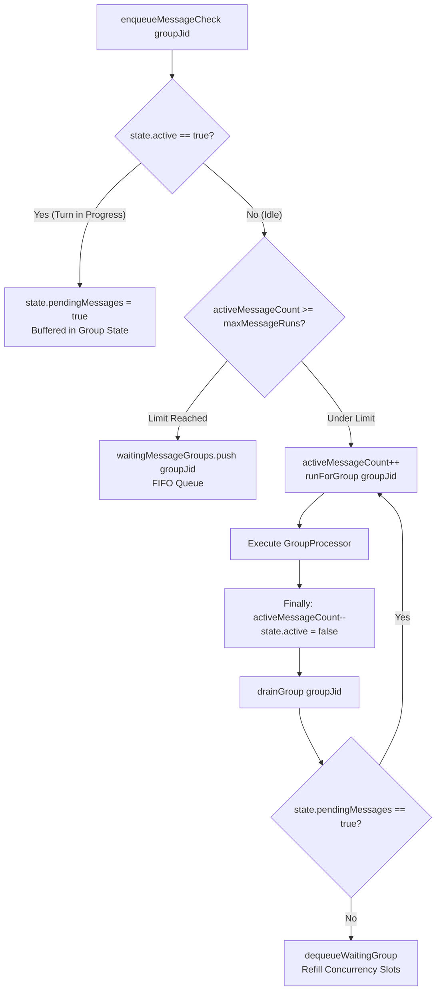
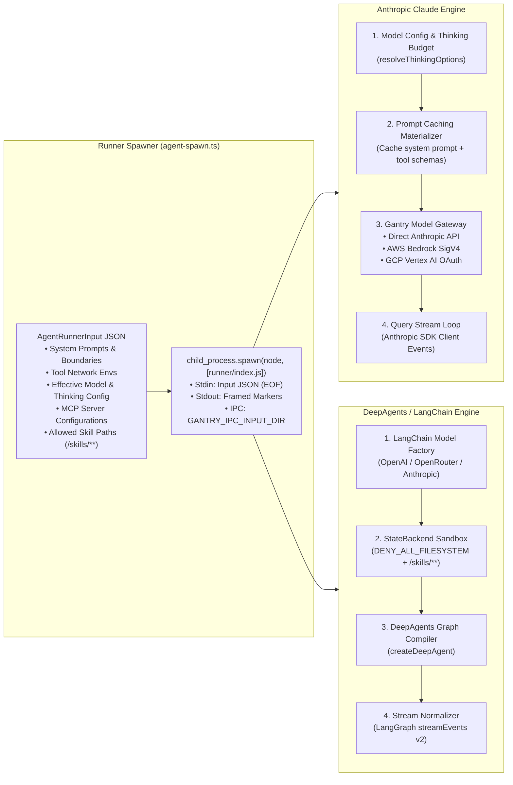
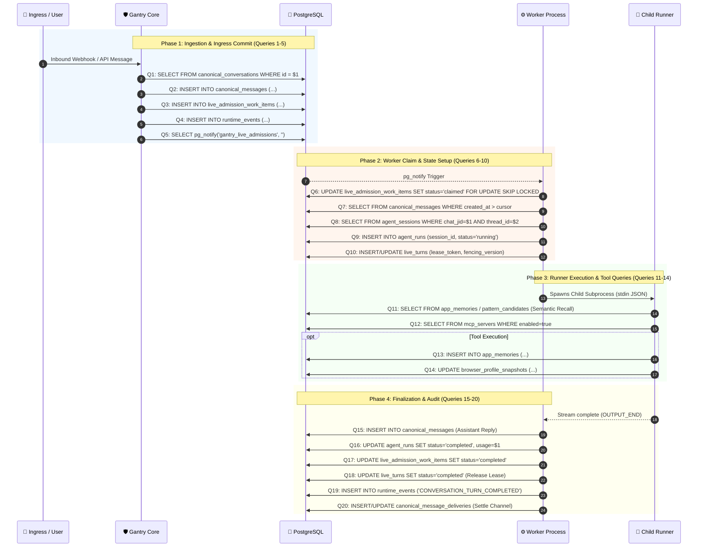

# Gantry Comprehensive Code-Level Deep Dive

This document details the exact internal mechanics, execution steps, and code implementations of the **Gantry** runtime platform.

---

## 1. Worker Subsystem: Group Queueing & Group Processing

The Worker subsystem manages work item claiming, concurrency serialization, state recovery, and execution orchestration.

### 1.1. Admission Loop & Claiming (`apps/core/src/runtime/live-admission-work-loop.ts`)
1. **Reactive Trigger via PostgreSQL `LISTEN`**:
   - `PostgresWakeupSource` in `live-admission-notify.postgres.ts` maintains a dedicated `PoolClient` listening on `gantry_live_admissions`.
   - When a notification arrives, it triggers `admissionLoop.trigger()`.
2. **Advisory Lease & Work Claim**:
   - Calls `claimLiveAdmissionWorkItems({ appId, workerInstanceId })`.
   - Executes atomic row claiming:
     ```sql
     UPDATE live_admission_work_items
     SET status = 'claimed',
         claimed_by_worker_instance_id = $1,
         claimed_at = NOW(),
         lease_expires_at = NOW() + INTERVAL '60 seconds'
     WHERE id IN (
       SELECT id FROM live_admission_work_items
       WHERE status = 'pending' AND app_id = $2
       ORDER BY created_at ASC
       LIMIT $3
       FOR UPDATE SKIP LOCKED
     )
     RETURNING *;
     ```
3. **Dispatch to `GroupQueue`**:
   - For each claimed work item, calls `app.queue.enqueueMessageCheck(queueJid)`.

---

### 1.2. `GroupQueue` Concurrency Engine (`apps/core/src/runtime/group-queue.ts`)
`GroupQueue` enforces **strict FIFO single-concurrency per conversation/thread**:



- **Per-JID Concurrency Mutex**:
  - `groups.get(groupJid)` tracks `active: boolean`, `pendingMessages: boolean`, `process: ChildProcess`, and `retryCount`.
  - If a message arrives while an agent run is active for that JID, `state.pendingMessages` is flagged `true` and the message check is deferred.
- **Mid-Flight Steering & IPC Control**:
  - `sendMessage(groupJid, text, options)`: If an agent run is active, writes a follow-up JSON file to the child process's IPC directory and invokes `continuationHandler()`.
  - `closeStdin(groupJid)`: Writes the `_close` sentinel to signal the running agent to conclude its turn.
  - `stopGroup(groupJid)`: Kills the active subprocess if a user issues `/stop`.
- **Exponential Backoff on Failure**:
  - `delayMs = baseRetryMs * 2^(retryCount - 1)`.

---

### 1.3. `GroupProcessor` Execution Pipeline (`apps/core/src/runtime/group-processing.ts`)
1. **Replay Cursor Reconciliation**:
   - Reads the last processed cursor for the queue.
   - Calls `collectPendingMessagesSince()` to query `canonical_messages` where `created_at > cursor`.
   - Guarantees zero dropped messages across worker crashes or reconnects.
2. **Session Command Interception (`handleSessionCommand`)**:
   - Checks if the user message matches built-in administrative or session commands:
     - `/clear` or `/reset`: Resets conversation memory and session state.
     - `/model <name>`: Updates the active model configuration for the thread.
     - `/stop` or `/abort`: Cancels any running agent turn.
     - `/job`: Inspects or configures scheduled recurring tasks.
   - If intercepted, executes the command directly without invoking the LLM.
3. **Typing Indicators & Progress Heartbeats**:
   - `createGroupTurnTypingSender`: Sends platform typing indicators (e.g. Slack typing or Discord typing) every 4 seconds.
   - `createProgressChannelSender`: Posts or updates ephemeral progress cards.
4. **Memory & Context Hydration**:
   - Queries `app_memories` and `pattern_candidates` using vector similarity or keyword recall for the conversation subject.
   - Materializes approved skills and tool capability rules.
5. **Invoking `spawnAgent`**:
   - Hands off the constructed prompt and runtime policy to the Agent Runner.

---

## 2. Agent Runner Subsystem: Claude SDK vs DeepAgents

Gantry supports two distinct agent execution engines isolated in separate child processes.



---

### 2.1. Anthropic Claude SDK Engine (`apps/core/src/adapters/llm/anthropic-claude-agent/`)

#### 1. Entry & IPC Setup (`runner/index.ts`)
- The subprocess reads the serialized `AgentRunnerInput` from `stdin` until EOF.
- Initializes `GANTRY_IPC_INPUT_DIR` to watch for interactive continuation messages.

#### 2. Prompt Caching & Thinking Budgets (`runner/model-config.ts` & `claude-config-materializer.ts`)
- **Prompt Caching**:
  - Injects `cache_control: { type: "ephemeral" }` at 3 strategic breakpoints:
    1. System prompt & base persona instructions.
    2. Materialized MCP tool definition schemas.
    3. Conversation message history boundary.
  - Achieves up to **90% token cost reduction** and **80% latency reduction** on long-running multi-turn sessions.
- **Extended Thinking**:
  - Configures Anthropic's native thinking budget (`thinking: { type: "enabled", budget_tokens: ... }`) based on agent effort settings.

#### 3. Gantry Model Gateway (`gantry-model-gateway.ts`)
Enables enterprise multi-cloud dispatch without rewriting prompt or tool code:
- **Direct Anthropic**: `https://api.anthropic.com/v1/messages` using standard API keys.
- **AWS Bedrock**: Signs HTTP requests on-the-fly with AWS Signature Version 4 (`SigV4`) using ambient AWS IAM credentials or Secrets Manager.
- **Google Cloud Vertex AI**: Obtains and refreshes GCP OAuth access tokens for Vertex Claude endpoints.

#### 4. Query Loop & Tool Execution (`runner/query-loop.js`)
- Consumes the native stream:
  - Text deltas are wrapped in `OUTPUT_START_MARKER` and `OUTPUT_END_MARKER` and written to `stdout`.
  - Tool invocations (e.g. `RunCommand`, `ReadFiles`, `BrowserAction`, `MemorySave`) are routed to the local MCP proxy.
- Polls `GANTRY_IPC_INPUT_DIR`:
  - If a user sends a message while the model is thinking or running tools, it injects the new text directly into the active session without aborting.

---

### 2.2. DeepAgents / LangChain Engine (`apps/core/src/adapters/llm/deepagents-langchain/`)

#### 1. Model Factory (`runner/model-factory.ts`)
- Instantiates LangChain chat models (`buildRunnerModel`):
  - Supports OpenAI, OpenRouter, Azure OpenAI, Anthropic, or custom local models.
  - Injects provider preferences and cache control headers.

#### 2. Sandboxing & StateBackend (`runner/deep-agent-runner.ts`)
- **Raw Filesystem Access Denied**:
  ```typescript
  const DENY_ALL_FILESYSTEM: FilesystemPermission[] = [
    { operations: ['read', 'write'], paths: ['/**'], mode: 'deny' },
  ];
  const READONLY_SKILLS_FILESYSTEM: FilesystemPermission[] = [
    { operations: ['read'], paths: ['/skills', '/skills/**'] },
    { operations: ['read', 'write'], paths: ['/**'], mode: 'deny' },
  ];
  ```
- **Unsafe Tool Exclusion**:
  - `createBuiltinToolExclusionMiddleware` strips internal subagent task tools (`task`, `write_todos`) to ensure all actions route through reviewed Gantry MCP tools.

#### 3. Graph Compilation & Stream Normalization (`runner/stream-normalizer.ts`)
- Compiles the LangGraph workflow (`createDeepAgent`).
- Subscribes to LangGraph's `streamEvents({ version: 'v2' })`:
  - `on_chat_model_stream`: Normalizes token deltas to Gantry stdout chunks.
  - `on_tool_start`: Emits tool call activity events (`tool_name`, `tool_input`, `tool_call_id`).
  - `on_tool_end`: Emits tool result summaries.
- **Session Checkpointing**:
  - `DeepAgentCheckpointSaver` saves intermediate LangGraph state checkpoints for session resumes.

---

## 3. Database State & 20 Queries per Turn Breakdown



### Complete Query Breakdown:

| # | Step | Table | SQL Operation | Purpose |
|---|---|---|---|---|
| **1** | Routing Verification | `canonical_conversations`, `conversation_threads` | `SELECT` | Verify conversation and thread exist and are active |
| **2** | Message Persistence | `canonical_messages` | `INSERT / UPSERT` | Persist user message with SHA-256 idempotency key |
| **3** | Work Queueing | `live_admission_work_items` | `INSERT` | Queue admission item for distributed workers |
| **4** | Inbound Audit Outbox | `runtime_events` | `INSERT` | Publish `CONVERSATION_MESSAGE_INBOUND` event |
| **5** | Reactive Wakeup | PostgreSQL Channel | `pg_notify` | Wake up listening live workers immediately |
| **6** | Work Item Claim | `live_admission_work_items` | `UPDATE ... FOR UPDATE SKIP LOCKED` | Claim work item with worker instance ID |
| **7** | Replay Retrieval | `canonical_messages` | `SELECT ... WHERE created_at > cursor` | Load missed messages to construct turn context |
| **8** | Session Resolution | `agent_sessions` | `SELECT / INSERT` | Retrieve or initialize conversation session |
| **9** | Agent Run Registration | `agent_runs` | `INSERT` | Mint new run row with status `running` |
| **10** | Fenced Turn Lease | `live_turns` | `INSERT / UPSERT` | Register active live turn with distributed fencing token |
| **11** | Memory Retrieval | `app_memories`, `pattern_candidates` | `SELECT` | Vector / keyword recall for relevant context |
| **12** | MCP / Capabilities | `mcp_servers`, `agent_capabilities` | `SELECT` | Load authorized tool definitions |
| **13-14** | Tool Invocations | `app_memories`, `browser_profile_snapshots` | `INSERT / UPDATE` | Tool operations (dynamic depending on model actions) |
| **15** | Assistant Transcript | `canonical_messages` | `INSERT` | Persist final assistant response message |
| **16** | Run Completion | `agent_runs` | `UPDATE` | Save token usage, execution duration, status |
| **17** | Admission Finalization | `live_admission_work_items` | `UPDATE` | Mark work item `completed` |
| **18** | Turn Lease Release | `live_turns` | `UPDATE` | Mark live turn `completed` and release lock |
| **19** | Completion Event | `runtime_events` | `INSERT` | Publish `CONVERSATION_TURN_COMPLETED` |
| **20** | Outbound Delivery | `canonical_message_deliveries` | `INSERT / UPDATE` | Settle channel delivery status to external chat app |
