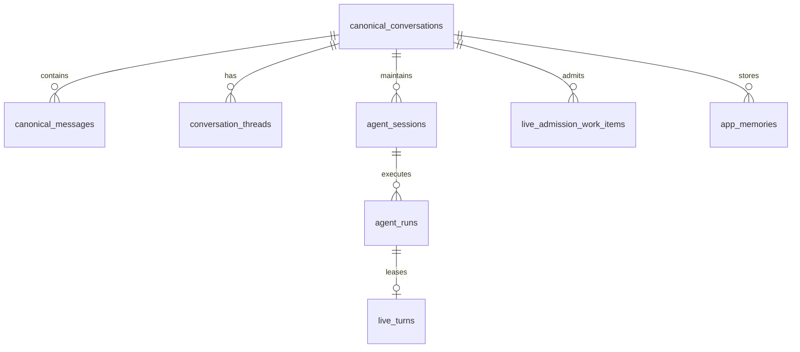

# Gantry Master Architecture & Developer Onboarding Manual

This document provides a comprehensive, function-by-function architectural guide to **Gantry** (`https://github.com/knacklabs/gantry.git`). It is designed for engineers who need to understand the internal mechanics before modifying, extending, or refactoring the codebase.

---

## 📑 Table of Contents
1. [High-Level System Topology](#1-high-level-system-topology)
2. [Codebase File & Directory Map](#2-codebase-file--directory-map)
3. [The 4 Ingress Channels (Code-Level Intake)](#3-the-4-ingress-channels-code-level-intake)
4. [Normalization & Deduplication Engine](#4-normalization--deduplication-engine)
5. [Durable Transaction & `pg_notify` Wakeup](#5-durable-transaction--pg_notify-wakeup)
6. [Worker Subsystem Deep-Dive (`GroupQueue` & `GroupProcessing`)](#6-worker-subsystem-deep-dive-groupqueue--groupprocessing)
7. [Agent Runner: Anthropic Claude SDK Engine](#7-agent-runner-anthropic-claude-sdk-engine)
8. [Agent Runner: DeepAgents / LangChain Engine](#8-agent-runner-deepagents--langchain-engine)
9. [Tool Execution, Sandboxing & MCP Proxy](#9-tool-execution-sandboxing--mcp-proxy)
10. [Database Schema & Exact 20-Query Turn Trace](#10-database-schema--exact-20-query-turn-trace)
11. [Developer Modification Guide (How to Add Features)](#11-developer-modification-guide-how-to-add-features)

---

## 1. High-Level System Topology

```mermaid
flowchart TD
    %% 1. INTAKE
    subgraph INTAKE["1. INGRESS INTAKE LAYER"]
        direction LR
        IN_CH["📱 Channels\n• Slack (Bolt Socket/HTTP)\n• Discord (discord.js)\n• Telegram (grammY)\n• Teams (botbuilder)"]
        IN_EXT["🌐 External Ingress\n• POST /v1/external-ingress/messages\n• HMAC SHA-256 Signature\n• Timestamp Skew Gate"]
        IN_SDK["💻 Gantry SDK\n• @knacklabs/gantry-sdk\n• REST & OpenAPI\n• OIDC / Bearer Auth"]
        IN_CRON["⏰ Schedulers & Cron\n• pg-boss Queue Engine\n• cron / interval / once\n• Slot Concurrency Lock"]
    end

    %% 2. NORMALIZATION
    subgraph NORM["2. INTEGRITY & NORMALIZATION LAYER"]
        direction TB
        AUTH_VERIFY["Auth & Signature Gate\n(HMAC / Bearer / Bot Token)"]
        MAKE_STRUCT["Map to Canonical Struct:\nNewMessage {\n  id, chat_jid, provider,\n  sender, content, thread_id\n}"]
        DEDUP_HASH["Deterministic Idempotency Hash:\nstableExternalIngressMessageId(\n  [appId, convId, threadId, extId]\n)"]
        AUTH_VERIFY --> MAKE_STRUCT --> DEDUP_HASH
    end

    %% 3. DURABILITY
    subgraph PERSIST["3. POSTGRESQL DURABLE COMMIT & NOTIFY"]
        direction TB
        TX_BEGIN["BEGIN PostgreSQL Transaction"]
        SQL_MSG["1. INSERT INTO canonical_messages"]
        SQL_WORK["2. INSERT INTO live_admission_work_items (status='pending')"]
        SQL_EVENT["3. INSERT INTO runtime_events (outbox)"]
        TX_COMMIT["COMMIT Transaction"]
        NOTIFY_CALL["SELECT pg_notify('gantry_live_admissions', '')"]
        TX_BEGIN --> SQL_MSG --> SQL_WORK --> SQL_EVENT --> TX_COMMIT --> NOTIFY_CALL
    end

    %% 4. WORKER
    subgraph WORKER_SYS["4. WORKER ENGINE (apps/core/src/runtime/)"]
        direction TB
        LISTEN_WAKE["LISTEN gantry_live_admissions (Wakeup Trigger)"]
        CLAIM_WORK["Atomic Row Claim:\nUPDATE live_admission_work_items\nSET status='claimed'\nWHERE ... FOR UPDATE SKIP LOCKED"]
        
        subgraph GQ["GroupQueue (group-queue.ts)"]
            MUTEX_CHK{"Is JID Active in groups map?"}
            BUFFER_PENDING["Set state.pendingMessages = true\n(Buffered in Group Backlog)"]
            CONCURRENCY_CHK{"Active Runs < maxMessageRuns?"}
            WAITING_QUEUE["waitingMessageGroups.push(groupJid)\n(FIFO Waiter Queue)"]
            RUN_GROUP["Lock Acquired:\nactiveMessageCount++\nrunForGroup(groupJid)"]
        end
        
        subgraph GP["GroupProcessing (group-processing.ts)"]
            REPLAY_CURSOR["Replay Cursor Check:\ncollectPendingMessagesSince()"]
            SLASH_ROUTER{"Session Slash Command?\n(/clear, /model, /stop, /job)"}
            EXEC_BUILTIN["Execute In-Process Command\n(Skip LLM invocation)"]
            TYPING_LOOP["Typing Heartbeat (every 4s)\nAdd 'seen' / 'eyes' Reaction"]
            HYDRATE_MEM["Memory & Boundary Hydration:\nRecall Vector Memories & Rules"]
        end
    end

    %% 5. AGENT RUNNER
    subgraph RUNNER_SYS["5. AGENT RUNNER SUBPROCESS (apps/core/src/runtime/agent-spawn.ts)"]
        direction TB
        SPAWN_CHILD["child_process.spawn(node, [runner/index.js])\n• Stdin: AgentRunnerInput JSON\n• Stdout: Framed Markers\n• IPC: GANTRY_IPC_INPUT_DIR"]
        
        subgraph CLAUDE_ENGINE["Anthropic Claude SDK (anthropic-claude-agent/)"]
            CL_CFG["Resolve Model (Opus/Sonnet) & Thinking Budget"]
            CL_CACHE["Prompt Caching Materializer (System, Tools, Messages)"]
            CL_GATE["Gantry Model Gateway (Direct HTTP / AWS SigV4 / Vertex)"]
            CL_LOOP["Native Stream Loop & Follow-Up IPC Poller"]
            CL_CFG --> CL_CACHE --> CL_GATE --> CL_LOOP
        end
        
        subgraph DA_ENGINE["DeepAgents / LangChain (deepagents-langchain/)"]
            DA_FACT["LangChain Model Factory (OpenAI / OpenRouter / Custom)"]
            DA_SAND["StateBackend Sandbox (DENY_ALL_FILESYSTEM + /skills/**)"]
            DA_GRAPH["LangGraph Compiler (createDeepAgent)"]
            DA_STREAM["Stream Normalizer (streamEvents v2 -> stdout frames)"]
            DA_FACT --> DA_SAND --> DA_GRAPH --> DA_STREAM
        end
        
        subgraph RUNTIME_CAPS["Runtime Tools & Capabilities"]
            MCP_PROXY["MCP Server Proxy (File, Shell, Database)"]
            BROWSER_RUN["Browser CDP Controller (Chrome Sessions)"]
            MEM_IPC["Memory IPC Service (Save / Recall)"]
        end
    end

    %% 6. FINALIZATION
    subgraph FINALIZE["6. TURN FINALIZATION & STATE AUDIT"]
        direction TB
        PERSIST_REPLY["1. INSERT INTO canonical_messages (Assistant Reply)"]
        UPDATE_RUN["2. UPDATE agent_runs SET status='completed', usage=..."]
        UPDATE_WORK["3. UPDATE live_admission_work_items SET status='completed'"]
        RELEASE_LEASE["4. UPDATE live_turns SET status='completed' (Release Lock)"]
        OUTBOX_EVENT["5. INSERT INTO runtime_events ('CONVERSATION_TURN_COMPLETED')"]
        DRAIN_GQ["6. GroupQueue.drainGroup(groupJid) -> Pick Next in FIFO"]
        PERSIST_REPLY --> UPDATE_RUN --> UPDATE_WORK --> RELEASE_LEASE --> OUTBOX_EVENT --> DRAIN_GQ
    end

    %% WIRING
    INTAKE --> NORM
    NORM --> PERSIST
    PERSIST --> LISTEN_WAKE
    LISTEN_WAKE --> CLAIM_WORK
    CLAIM_WORK --> MUTEX_CHK

    MUTEX_CHK -- Busy --> BUFFER_PENDING
    MUTEX_CHK -- Idle --> CONCURRENCY_CHK
    CONCURRENCY_CHK -- Max Capacity --> WAITING_QUEUE
    CONCURRENCY_CHK -- Slot Free --> RUN_GROUP

    RUN_GROUP --> REPLAY_CURSOR
    REPLAY_CURSOR --> SLASH_ROUTER
    SLASH_ROUTER -- Is Command --> EXEC_BUILTIN --> PERSIST_REPLY
    SLASH_ROUTER -- Normal Message --> TYPING_LOOP
    TYPING_LOOP --> HYDRATE_MEM --> SPAWN_CHILD

    SPAWN_CHILD --> CLAUDE_ENGINE & DA_ENGINE
    CLAUDE_ENGINE & DA_ENGINE <--> RUNTIME_CAPS
    CLAUDE_ENGINE & DA_ENGINE --> PERSIST_REPLY
```



---

## 2. Codebase File & Directory Map

| Path | Purpose & Responsibilities | Key Functions / Classes |
|---|---|---|
| [`apps/core/src/channels/`](file:///Users/yashkhurana/Desktop/Ats/Itops.Agent/Do/gantry/apps/core/src/channels/) | Platform adapters for chat apps. | `SlackChannel`, `DiscordChannel`, `TelegramChannel`, `TeamsChannel` |
| [`apps/core/src/application/external-ingress/`](file:///Users/yashkhurana/Desktop/Ats/Itops.Agent/Do/gantry/apps/core/src/application/external-ingress/) | Authenticated webhook ingress module. | `ConversationMessageIngressModule.acceptMessage()` |
| [`apps/core/src/infrastructure/pgboss/`](file:///Users/yashkhurana/Desktop/Ats/Itops.Agent/Do/gantry/apps/core/src/infrastructure/pgboss/) | Background cron & scheduler engine. | `PgBossSchedulerEngine`, `scheduler-admission.ts` |
| [`apps/core/src/adapters/storage/postgres/`](file:///Users/yashkhurana/Desktop/Ats/Itops.Agent/Do/gantry/apps/core/src/adapters/storage/postgres/) | PostgreSQL repositories, schemas, and notifications. | `PostgresLiveAdmissionNotifier`, `canonical-message-repository.postgres.ts` |
| [`apps/core/src/runtime/group-queue.ts`](file:///Users/yashkhurana/Desktop/Ats/Itops.Agent/Do/gantry/apps/core/src/runtime/group-queue.ts) | 1-active concurrency mutex lock per conversation. | `GroupQueue.enqueueMessageCheck()`, `runForGroup()`, `drainGroup()` |
| [`apps/core/src/runtime/group-processing.ts`](file:///Users/yashkhurana/Desktop/Ats/Itops.Agent/Do/gantry/apps/core/src/runtime/group-processing.ts) | Turn pipeline: replay cursor, commands, typing, memory. | `createGroupProcessor()`, `handleSessionCommand()` |
| [`apps/core/src/runtime/agent-spawn.ts`](file:///Users/yashkhurana/Desktop/Ats/Itops.Agent/Do/gantry/apps/core/src/runtime/agent-spawn.ts) | Subprocess preparation and spawning harness. | `prepareAgentSpawn()`, `spawnAgent()` |
| [`apps/core/src/adapters/llm/anthropic-claude-agent/`](file:///Users/yashkhurana/Desktop/Ats/Itops.Agent/Do/gantry/apps/core/src/adapters/llm/anthropic-claude-agent/) | Anthropic Claude SDK engine with prompt caching & SigV4. | `runner/index.ts`, `claude-config-materializer.ts`, `gantry-model-gateway.ts` |
| [`apps/core/src/adapters/llm/deepagents-langchain/`](file:///Users/yashkhurana/Desktop/Ats/Itops.Agent/Do/gantry/apps/core/src/adapters/llm/deepagents-langchain/) | LangChain & LangGraph engine with sandboxing. | `runner/deep-agent-runner.ts`, `stream-normalizer.ts`, `model-factory.ts` |
| [`apps/core/src/runner/mcp/`](file:///Users/yashkhurana/Desktop/Ats/Itops.Agent/Do/gantry/apps/core/src/runner/mcp/) | Model Context Protocol (MCP) server & tools surface. | `server.ts`, `mcp/tools/*.ts` |

---

## 3. The 4 Ingress Channels (Code-Level Intake)

Gantry ingests work from 4 distinct interfaces:

### 3.1. Channels (`apps/core/src/channels/`)
- **Slack**: Handled via `@slack/bolt` in socket mode or HTTP webhook. Incoming events invoke `channelPersistenceHandlers.onMessage()` which extracts user IDs, thread IDs, and attachments.
- **Discord**: Uses `discord.js` client listening on `messageCreate`. Disregards bot self-messages (`is_bot_message: false`).
- **Telegram**: Handled via `grammY` webhook / polling. Maps chat IDs to canonical `telegram:<chat_id>`.
- **Microsoft Teams**: Uses Bot Framework `ActivityHandler` to process mentions and adaptive cards.

### 3.2. External Ingress (`apps/core/src/application/external-ingress/conversation-message-ingress.ts`)
- **Endpoint**: `POST /v1/external-ingress/messages`
- **Security Check**:
  ```typescript
  // sdk/src/ingress-signature.ts
  const signature = req.headers['x-gantry-signature'];
  const timestamp = req.headers['x-gantry-timestamp'];
  verifyHmacSignature(rawBody, secret, signature, timestamp);
  ```
- **Execution Flow**:
  1. `requireConversation()`: Verifies that `conversationId` exists and is `active`.
  2. `resolveThreadRouting()`: Maps canonical thread IDs to internal runtime threads.
  3. `stableExternalIngressMessageId()`: Computes deterministic hash from `[appId, conversationId, threadId, externalMessageId]`.
  4. Calls `deps.runtimeEvents.publishWithLiveAdmissionMessage()`.

### 3.3. Gantry SDK (`packages/sdk/src/`)
- Programmatic TypeScript client exposing typed SDK methods (`gantry.conversations.sendMessage()`).
- Authenticated via OIDC Bearer tokens passed in `Authorization: Bearer <token>`.

### 3.4. Schedulers & Cron (`apps/core/src/infrastructure/pgboss/scheduler-engine.ts`)
- Managed by `PgBossSchedulerEngine` backed by the PostgreSQL queue `gantry.jobs`.
- When a cron fires or an interval tick occurs:
  1. Calls `tryAcquireRunSlot()` to enforce host concurrency limits.
  2. Resolves target agent workspace via `resolveAppSessionForJob()`.
  3. Enqueues a scheduled task into `GroupQueue.enqueueTask()`.

---

## 4. Normalization & Deduplication Engine

Every incoming payload is converted into the canonical `NewMessage` domain type:

```typescript
export type NewMessage = {
  id: string;                  // SHA-256 deterministic hash or UUID
  chat_jid: string;            // e.g. "slack:T01:C02" or "external:conv_123"
  provider: string;            // "slack" | "discord" | "telegram" | "teams" | "external"
  providerAccountId: string;   // Multi-account workspace identifier
  sender: string;              // Normalized user ID
  sender_name: string;         // User display name
  content: string;             // Message text payload
  timestamp: string;           // ISO 8601 UTC timestamp
  is_from_me: boolean;         // false for inbound messages
  is_bot_message: boolean;     // true if sent by an automated bot
  external_message_id?: string;// Original provider ID (prevents re-ingestion)
  thread_id?: string;          // Optional thread identifier
};
```

### Deterministic Deduplication:
```typescript
function stableExternalIngressMessageId(parts: string[]): string {
  return `external-ingress:${sha256Base64Url(parts.join('\0')).slice(0, 32)}`;
}
```
If a duplicate webhook arrives with the same `externalMessageId`, PostgreSQL hits the unique index on `canonical_messages(external_message_id)` and idempotently skips queueing.

---

## 5. Durable Transaction & `pg_notify` Wakeup

Gantry ensures zero in-memory message loss by committing to PostgreSQL before dispatching:

```typescript
// Transaction in canonical-message-repository.postgres.ts
await db.transaction(async (tx) => {
  // 1. Insert message
  await tx.insert(canonicalMessages).values(messageRow);
  
  // 2. Insert durable work item
  await tx.insert(liveAdmissionWorkItems).values({
    id: workItemId,
    appId,
    queueKey: queueJid,
    status: 'pending',
    createdAt: now,
  });
  
  // 3. Insert outbox event
  await tx.insert(runtimeEvents).values({
    eventType: 'CONVERSATION_MESSAGE_INBOUND',
    payload: { messageId, text, sender },
  });
});

// Real-time reactive signal (Zero Polling Delay)
await pool.query("SELECT pg_notify('gantry_live_admissions', '')");
```

---

## 6. Worker Subsystem Deep-Dive (`GroupQueue` & `GroupProcessing`)

### 6.1. `GroupQueue` Concurrency State Machine (`apps/core/src/runtime/group-queue.ts`)

`GroupQueue` maintains an in-memory registry of conversation states:

```typescript
type GroupState = {
  active: boolean;              // Is an agent run currently executing?
  pendingMessages: boolean;     // Are there queued messages waiting for this JID?
  pendingTasks: QueuedTask[];   // Background jobs queued for this JID
  process: ChildProcess | null; // Running child process handle
  runHandle: string | null;     // Unique run identifier
  workspaceFolder: string | null;
  threadId: string | null;
  retryCount: number;           // Exponential backoff attempt count
  continuationHandler: (() => void) | null;
};
```

#### Step-by-Step Queue Lifecycle:
1. `enqueueMessageCheck(groupJid)` is called by the admission loop.
2. If `state.active === true`, it flags `state.pendingMessages = true` and returns immediately.
3. If `activeMessageCount >= policy.maxMessageRuns`, it adds `groupJid` to `waitingMessageGroups[]`.
4. Otherwise, it increments `activeMessageCount++`, marks `state.active = true`, and starts `runForGroup()`.
5. When `runForGroup()` finishes in the `finally` block:
   - Sets `state.active = false`, `state.process = null`.
   - Decrements `activeMessageCount--`.
   - Calls `drainGroup()`: If `state.pendingMessages` is `true`, it immediately re-runs for the same group; otherwise, it pulls the next waiting group from `waitingMessageGroups[]`.

---

### 6.2. `GroupProcessor` Turn Pipeline (`apps/core/src/runtime/group-processing.ts`)
1. **Replay Cursor Query**:
   ```typescript
   const replay = await collectPendingMessagesSince({
     getMessagesSince: opsRepository.getMessagesSince,
     chatJid,
     sinceCursor: replayCursor,
   });
   ```
2. **Session Slash Commands (`handleSessionCommand`)**:
   - Matches regex patterns (e.g. `/^(\/clear|\/reset)\b/i`).
   - If matched, executes state reset and replies directly to the channel without starting an LLM run.
3. **Typing Heartbeat Loop**:
   - Fires typing indicators to Slack/Discord/TG every 4 seconds to maintain UX liveness.
4. **Memory Context Hydration**:
   - Calls `loadTurnContext()` to retrieve bounded semantic memories from `app_memories`.

---

## 7. Agent Runner: Anthropic Claude SDK Engine

Located in `apps/core/src/adapters/llm/anthropic-claude-agent/`.

### 7.1. Execution Flow:
1. **Subprocess Spawn**:
   - Parent process spawns `node .../anthropic-claude-agent/runner/index.js`.
   - Passes full configuration JSON via `stdin` and closes stdin (`EOF`).
2. **Prompt Caching (`claude-config-materializer.ts`)**:
   - Automatically marks static blocks with `cache_control: { type: "ephemeral" }`:
     - Block 1: Base instructions & system prompt.
     - Block 2: MCP Tool definitions surface.
     - Block 3: Prior turn conversation history.
3. **Gantry Model Gateway (`gantry-model-gateway.ts`)**:
   - **Direct Anthropic**: Passes API key to `https://api.anthropic.com`.
   - **AWS Bedrock**: Uses `gantry-model-gateway-auth-sigv4.ts` to compute HMAC SigV4 headers with AWS credentials.
   - **Google Cloud Vertex**: Uses `gantry-model-gateway-auth-vertex.ts` to fetch OAuth tokens.
4. **Framed Stdout Output (`runner/output.ts`)**:
   - Wraps streaming chunks:
     ```text
     ___GANTRY_OUTPUT_START___
     {"type":"text_delta","text":"Hello, I can help with that."}
     ___GANTRY_OUTPUT_END___
     ```
5. **Interactive IPC File Watcher (`runner/ipc-input.ts`)**:
   - Monitors `GANTRY_IPC_INPUT_DIR/*.json`. If the user types a mid-flight clarification, the runner ingests it as a continuation message without restarting the model.

---

## 8. Agent Runner: DeepAgents / LangChain Engine

Located in `apps/core/src/adapters/llm/deepagents-langchain/`.

### 8.1. Execution Flow:
1. **Model Factory (`runner/model-factory.ts`)**:
   - Builds chat models for OpenAI, OpenRouter, Mistral, Qwen, or custom endpoints.
2. **Strict Sandboxing (`runner/deep-agent-runner.ts`)**:
   - Blocks raw shell and filesystem calls:
     ```typescript
     const DENY_ALL_FILESYSTEM: FilesystemPermission[] = [
       { operations: ['read', 'write'], paths: ['/**'], mode: 'deny' },
     ];
     ```
3. **LangGraph Graph Compilation**:
   - Compiles graph with `createDeepAgent()`.
   - Binds Gantry MCP tools as LangChain `StructuredToolInterface`.
4. **Stream Normalization (`runner/stream-normalizer.ts`)**:
   - Listens to LangGraph `streamEvents({ version: 'v2' })`.
   - Translates `on_chat_model_stream` and `on_tool_start`/`on_tool_end` into standard Gantry output frames.
5. **Checkpoint Persistence (`runner/session-store.ts`)**:
   - Saves intermediate graph checkpoints in `DeepAgentCheckpointSaver`.

---

## 9. Tool Execution, Sandboxing & MCP Proxy

Gantry routes all capabilities through an isolated Model Context Protocol (MCP) proxy (`apps/core/src/runner/mcp/`):

1. **MCP Server Proxy (`mcp/server.ts`)**:
   - Runs in-process or via stdio to provide tool schemas (`ReadFiles`, `WriteFiles`, `RunCommand`, `SearchMemory`, `SchedulerInspect`).
2. **Browser Automation (`adapters/browser/`)**:
   - Manages headless Chrome instances via Chrome DevTools Protocol (CDP) and Playwright.
   - Captures DOM trees, takes screenshots, and persists browser cookie snapshots in `browser_profile_snapshots`.
3. **Human-in-the-Loop Policy Gates (`application/permissions/`)**:
   - If an agent requests a destructive tool (e.g. `DROP TABLE` or `rm -rf`), Gantry suspends the run, emits an `interaction_request` event, and waits for channel button approval before resuming.

---

## 10. Database Schema & Exact 20-Query Turn Trace

Gantry uses PostgreSQL for distributed coordination and state:



### Complete 20-Query Execution Sequence:

| Query # | Subsystem | SQL Statement / Operation | Target Table | Purpose |
|---|---|---|---|---|
| **Q1** | Ingress | `SELECT * FROM canonical_conversations WHERE id = $1` | `canonical_conversations` | Validate conversation is active |
| **Q2** | Ingress | `INSERT INTO canonical_messages (...) VALUES (...)` | `canonical_messages` | Persist user message |
| **Q3** | Ingress | `INSERT INTO live_admission_work_items (...) VALUES (...)` | `live_admission_work_items` | Queue durable work item |
| **Q4** | Ingress | `INSERT INTO runtime_events (...) VALUES (...)` | `runtime_events` | Inbound audit event |
| **Q5** | Ingress | `SELECT pg_notify('gantry_live_admissions', '')` | PostgreSQL Channel | Real-time worker wakeup |
| **Q6** | Worker | `UPDATE live_admission_work_items SET status='claimed' ... FOR UPDATE SKIP LOCKED` | `live_admission_work_items` | Claim work item with row lock |
| **Q7** | Worker | `SELECT * FROM canonical_messages WHERE chat_jid=$1 AND created_at > $2` | `canonical_messages` | Replay missed messages from cursor |
| **Q8** | Worker | `SELECT * FROM agent_sessions WHERE chat_jid=$1 AND thread_id=$2` | `agent_sessions` | Retrieve active session state |
| **Q9** | Worker | `INSERT INTO agent_runs (session_id, status, ...) VALUES (...)` | `agent_runs` | Register new agent run (`running`) |
| **Q10** | Worker | `INSERT INTO live_turns (lease_token, fencing_version, ...) VALUES (...)` | `live_turns` | Acquire distributed fencing lease |
| **Q11** | Runner | `SELECT memories FROM app_memories WHERE subject = $1` | `app_memories` | Vector / keyword memory recall |
| **Q12** | Runner | `SELECT * FROM mcp_servers WHERE enabled = true` | `mcp_servers` | Load authorized tool configurations |
| **Q13** | Runner | `INSERT INTO app_memories (...) VALUES (...)` | `app_memories` | (Optional) Store memory during run |
| **Q14** | Runner | `UPDATE browser_profile_snapshots SET state = $1 WHERE id = $2` | `browser_profile_snapshots` | (Optional) Save browser cookies |
| **Q15** | Finalize | `INSERT INTO canonical_messages (sender='Gantry', content=$1, ...)` | `canonical_messages` | Persist assistant reply |
| **Q16** | Finalize | `UPDATE agent_runs SET status='completed', usage=$1, duration=$2 WHERE id=$3` | `agent_runs` | Save execution metrics & tokens |
| **Q17** | Finalize | `UPDATE live_admission_work_items SET status='completed' WHERE id=$1` | `live_admission_work_items` | Mark admission work item completed |
| **Q18** | Finalize | `UPDATE live_turns SET status='completed' WHERE turn_id=$1` | `live_turns` | Release distributed lease lock |
| **Q19** | Finalize | `INSERT INTO runtime_events (event_type='CONVERSATION_TURN_COMPLETED', ...)` | `runtime_events` | Emit outbox completion event |
| **Q20** | Delivery | `INSERT INTO canonical_message_deliveries (...) VALUES (...)` | `canonical_message_deliveries` | Settle channel delivery receipt |

---

## 11. Developer Modification Guide (How to Add Features)

When you and your team modify Gantry, follow these architectural patterns:

### 1. How to Add a New Ingress Channel (e.g. WhatsApp / Matrix)
1. Create adapter in `apps/core/src/channels/<channel_name>/`.
2. Implement inbound event listener to extract `sender`, `chatJid`, `text`, and `threadId`.
3. Call `channelPersistenceHandlers.storeMessage(newMessage)` and `publishWithLiveAdmissionMessage()`.

### 2. How to Add a Custom LLM Provider (e.g. Cohere / Ollama)
- **For DeepAgents Lane**: Extend `apps/core/src/adapters/llm/deepagents-langchain/runner/model-factory.ts` to add the model mapping.
- **For Claude SDK / Direct Lane**: Add a gateway authorizer in `apps/core/src/adapters/llm/anthropic-claude-agent/gantry-model-gateway-*.ts`.

### 3. How to Add a Custom MCP Tool
1. Define schema in `apps/core/src/runner/mcp/tools/<tool_name>.ts`.
2. Register tool in `apps/core/src/runner/mcp/gantry-mcp-tool-surface.ts`.
3. Implement execution handler with permission checks.

### 4. How to Modify Worker Concurrency
- Update `maxMessageRuns` and `maxJobRuns` in `apps/core/src/config/index.ts` or set environment variable `GANTRY_MAX_MESSAGE_RUNS`.
