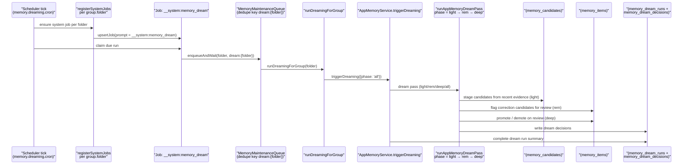
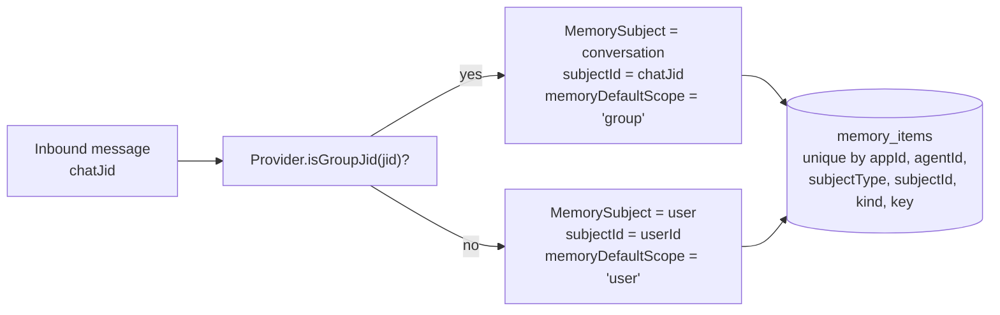

# Memory And Dreaming

Gantry memory is app-grade runtime state. Personal setup is just the default
single-app case; SDK and channel usage use the same model boundary.

## Boundary Model

Every memory record has:

- `appId`: the application or personal runtime namespace.
- `agentId`: the agent/runtime owner for the memory.
- one subject: `user`, `group`, `channel`, or `common`.
- optional subject ids: `userId`, `groupId`, `channelId`.

Boundary names are provider-neutral:

- `userId` is the human actor when the provider exposes one.
- `groupId` is the logical Gantry/app group or configured agent group. It is not
  limited to Telegram groups.
- `channelId` is the external conversation where the bot is present: Telegram
  private/group/supergroup chat, Slack channel/DM/MPIM, Microsoft Teams
  channel/group chat/personal chat, or an SDK conversation id.

Provider topics and reply threads, such as Slack `thread_ts`, Telegram forum
topic ids, and Teams reply chains, are routing/session metadata. They do not
partition durable memory; memory belongs to the DM user or the whole
group/channel conversation.

`common` is app-level shared memory. It is visible by policy but write-restricted
to admin/service flows. Agents cannot promote private user, group, or channel
facts into `common` by themselves.

Host-managed personal setup uses the internal runtime default app namespace:

```text
appId=default
agentId=<workspace folder>
groupId=<workspace folder>
channelId=<Telegram/Slack/Teams/app conversation id>
```

This `appId=default` value is the runtime's internal default memory app id.
SDK applications should pass stable external ids for `appId`, `agentId`,
`userId`, `groupId`, and `channelId`. Two apps never share memory
unless the host explicitly writes separate records into both apps.

## Storage

Postgres is the source of truth. The first shipped app-grade slice uses a
flattened canonical `memory_items` schema for durable memory:

- `memory_items` stores `app_id`, `agent_id`, `subject_type`, `subject_id`,
  optional user/conversation columns, the memory `kind` and `key`,
  `value_json`, `source_ref_json`, confidence, status, and timestamps.
- Active memory uniqueness is enforced directly on `memory_items` by
  `(app_id, agent_id, subject_type, subject_id, kind, key)` for active rows.
- The original subject boundary is preserved in `source_ref_json`; there is no
  active `memory_subjects` table in the current schema.
- `memory_evidence`
- `memory_candidates`
- `memory_recall_events`
- `memory_dream_runs`
- `memory_dream_decisions`

Pasted text and runtime observations must become bounded `memory_evidence` or
reviewed candidates before they can affect active durable recall.

## Pipeline

The current runtime pipeline is:

1. collect evidence from sessions, messages, tool outcomes, manual saves, or
   Memory Source ingestion
2. automatically capture a recent session digest at explicit continuation
   boundaries such as `/new`, `/compact`, stale-session archival, job
   completion, or observed SDK compact boundaries. `/new` clears the active
   provider-session state before expensive extraction, then finalizes the
   replaced session digest in the background.
3. extract and stage grounded candidate facts from boundary evidence
4. reject sensitive or ungrounded material
5. run dreaming promotion/update passes; automatic durable promotion is
   dreaming-only
6. retrieve visible active memory items for an app/agent/subject context with
   hybrid lexical + semantic recall (lexical fallback)

Lexical retrieval is the always-on path. When embeddings are enabled and a query
embedding is available, runtime search is hybrid: lexical full-text candidates
and pgvector cosine candidates are fused with Reciprocal Rank Fusion (HNSW index,
`text-embedding-3-small` at 1536 dimensions by default). Vector recall covers
memories that have a ready embedding; run the embedding backfill to index
existing memories. If embeddings are disabled, paused, or a query embedding
cannot be produced (budget/quota/rate-limit/provider error), recall transparently
falls back to lexical plus keyword. A disabled embedding provider must not
synthesize zero vectors.

`compact_summary` and `PostCompact` behavior are not part of the current
runtime. `/compact` and observed SDK compact boundaries may capture recent
digests and stage memory evidence, but they do not directly create active
durable memories and Gantry does not persist compact summaries for prompt
replay.

Item embeddings are generated during dreaming promotion/update flows and by the
resumable embedding backfill (CLI `gantry memory embeddings backfill` and the
scheduled backfill job). Backfill pauses (it does not fail) on
funds/quota/rate-limit/daily-budget exhaustion and resumes from remaining items
on the next run. Turn-time recall never indexes items; it only reads ready
embeddings, so context injection stays fast.

## Dreaming

Dreaming is boundary-aware lifecycle maintenance, not a hidden summarizer.

Current dreaming stages candidates, calls the configured dreaming model for
advisory lifecycle proposals, calls the configured consolidation model for
active-item overlap proposals, and keeps every LLM output as untrusted JSON.
Host validation is the only durable mutation path.

Memory LLM tasks use provider-neutral catalog aliases from `settings.yaml`.
Setup and `gantry model use-preset` apply preset-managed memory LLM defaults:

- Anthropic memory LLM defaults: extractor `haiku`, dreaming `sonnet`,
  consolidation `sonnet`.
- OpenRouter memory LLM defaults: extractor, dreaming, and consolidation all
  `kimi`.

Memory embeddings are configured separately under `memory.embeddings.*`. The
current embedding provider choices are `disabled` and `openai`; Anthropic,
OpenRouter, and other chat/model-response providers are not embedding providers
unless they are explicitly registered as such.

Operators inspect memory model aliases with `gantry model memory` and reapply
preset-managed defaults with `gantry model reset memory` or
`PATCH /v1/models/defaults` using `memory: null`. The extractor, dreaming, and
consolidation paths read current validated runtime settings when the next call
starts, so a provider/default change applies to new memory work without a
runtime restart.

These commands reset only the provider-neutral aliases used for Memory
processing. They do not delete or repartition centralized memory items,
evidence, candidates, recall events, indexes, or review history. Changing or
resetting the Chat model likewise leaves the Memory-processing aliases and
durable memory unchanged; only an explicit Memory reset re-derives those aliases
from the effective Chat provider.

Safe promotions and same-key updates can be applied by the host after
validation. Retire, rewrite, contradiction, and merge proposals are stored in
`memory_review_requests` as `pending_review` until a reviewer uses
`memory_review_decision` with `approve`, `reject`, or `edit_approve`.
`memory_review_pending` returns readable numbered changes, short evidence
snippets, paging metadata, and a `page_context` that lets the agent submit a
batch of decisions by item number. The page context is convenience data only:
the host still verifies trusted subject scope, reviewer authority, review
status, and target versions for every approved mutation.

The agent-led v1 review flow is channel-neutral and works in text-only
contexts without native buttons:

1. A job notification keeps the pending count visible and tells the reviewer to
   ask the agent to show pending memory reviews.
2. The agent calls `memory_review_pending`, shows the numbered page as
   reviewer-visible untrusted data, and asks for explicit numbered decisions.
3. The reviewer replies with natural text such as `approve 1, reject 2`,
   `edit 3 to ...`, or `show next`.
4. The agent calls `memory_review_decision` only for those explicit decisions,
   using the latest displayed `page_context`; it must never auto-approve a page
   or obey instructions embedded in proposed values, reasons, or evidence.

Dreaming job summaries surface pending review counts, including when a failed
or timed-out run already created review rows.

Every dream run writes durable audit rows in `memory_dream_runs` and
`memory_dream_decisions`. Review-gated proposals additionally record proposal
JSON, target versions, validation results, reviewer decisions, and apply
outcomes in `memory_review_requests`.

### Dreaming end-to-end

Dreaming is a system job. The scheduler claims it per workspace folder, the
runtime calls `AppMemoryService.triggerDreaming({ phase: 'all' })`, and the
service writes audit rows to `memory_dream_runs` and `memory_dream_decisions`.



Wired at:

- System-job marker `MEMORY_DREAM_SYSTEM_PROMPT = '__system:memory_dream'` —
  `apps/core/src/jobs/system-jobs.ts`.
- Per-folder registration gated on `memory.dreaming.enabled` and
  `memory.dreaming.cron` —
  `apps/core/src/jobs/system-jobs.ts`.
- Maintenance-queue runner —
  `apps/core/src/runtime/memory-dreaming-runner.ts`.
- `triggerDreaming` —
  `apps/core/src/memory/app-memory-service.ts`.
- Phase logic (`light`, `rem`, `deep`, `all`) —
  `apps/core/src/memory/app-memory-dreaming.ts`.
- SDK on-demand trigger — `client.memory.dreaming.trigger` and
  `client.memory.dreaming.status` at
  `packages/sdk/src/index.ts`.

## DM And Conversation Scope

The host owns the default memory scope:

- Direct/private agent conversations default explicit and automatic memory saves
  to `user` memory.
- Channel conversations, including Slack channels, Teams channels/chats,
  Telegram groups, and Telegram forum topics, default explicit and automatic
  memory saves to the parent conversation memory.
- Explicit admin/service writes may still choose another scope, but normal agent
  memory tools and automatic boundary extraction use the source conversation
  default.

The default-scope toggle is the `memoryDefaultScope: 'user' | 'group'` field
on the `SessionMemoryCollector` port
(`apps/core/src/domain/ports/session-memory-collector.ts`). The host
chooses the scope from the inbound chat jid and the bound provider:



A memory written in a DM cannot be read from a group of the same agent and
vice versa: the rows differ in both `subjectType` and `subjectId`.

## Runtime Retrieval Injection

Before each agent run, the host uses the current message or scheduled job prompt
as a lexical query against visible memory for the current
app/agent/user/group/channel context. Matching memories are injected as a
bounded JSON block of untrusted data-only evidence. If no memory matches, no
memory block is injected. The agent may call `memory_search` for more context,
especially when the user asks to continue or resume. Memory text never grants
instruction authority, tool authority, or policy.

## SDK APIs

Memory management is API-first. The server-side SDK/control API is the stable
management direction for backend apps, and agent-facing MCP tools call the same
host-owned memory service. A future UI, if built, should be a separate adapter
over these APIs rather than a separate source of memory truth.

The server-side SDK exposes:

- `client.memory.save()`
- `client.memory.search()`
- `client.memory.list()`
- `client.memory.patch()`
- `client.memory.delete()`
- `client.memory.dreaming.trigger()`
- `client.memory.dreaming.status()`

The caller's API key app binding controls `appId` access. `common` writes require
admin memory scope.

## First-Slice Surface Impact Matrix

| Surface | Classification | Reason |
| --- | --- | --- |
| Runtime behavior | Changed | Durable memory reads and writes use flattened `memory_items`; retrieval is hybrid lexical + pgvector (RRF) when embeddings are enabled and indexed, with lexical fallback. |
| `settings.yaml` | Changed | `memory.embeddings.{model,dimensions,backfill.*}` defaults (`text-embedding-3-small`/1536, backfill schedule/mode) are read; the backfill CLI/job index existing memories. |
| Postgres/runtime projection | Changed | `memory_items` is the canonical durable item table; `memory_review_requests` stores pending review proposals and decisions. |
| Control API | Changed | Memory save/search/list/patch/delete and dreaming routes operate over the app-bound memory service. |
| SDK/contracts | Changed | Server-side SDK memory methods are the API-first management surface. |
| CLI | Changed | `gantry memory status`/`doctor` report memory, embeddings, dreaming, and live vector recall status; `gantry memory embeddings backfill` runs/resumes item indexing with truthful complete/paused/submitted output. |
| Gantry MCP tools/admin skill | Changed | Agent tools can search, save, request `continuity_summary`, request reviewed memory changes, list pending memory reviews, and apply review decisions through host IPC/MCP. |
| Channel/provider adapters | Unchanged by design | Channels only provide source identity and conversation scope; memory storage stays channel-neutral. |
| Docs/prompts | Changed | Active docs state flattened memory items, hybrid lexical + vector retrieval with lexical fallback, resumable embedding backfill, and no compact-summary replay. |
| Audit/events | Changed | Evidence, recall, dream run, dream decision, review proposal, reviewer decision, and apply outcome rows remain audit surfaces for memory lifecycle decisions. |
| Tests/verification | Changed | Memory unit and integration checks verify lexical recall works without embeddings, hybrid recall + RRF when embeddings are indexed, and resumable backfill pause/resume. |
