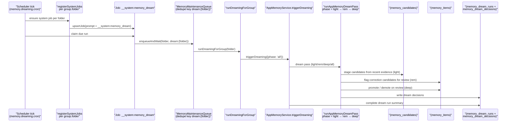
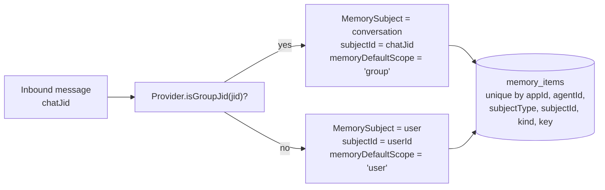

# Memory And Dreaming

MyClaw memory is app-grade runtime state. Personal setup is just the default
single-app case; SDK and channel usage use the same model.

## Boundary Model

Every memory record has:

- `appId`: the application or personal runtime namespace.
- `agentId`: the agent/runtime owner for the memory.
- one subject: `user`, `group`, `channel`, or `common`.
- optional subject ids: `userId`, `groupId`, `channelId`, `threadId`.

Boundary names are provider-neutral:

- `userId` is the human actor when the provider exposes one.
- `groupId` is the logical MyClaw/app group or configured agent group. It is not
  limited to Telegram groups.
- `channelId` is the external conversation where the bot is present: Telegram
  private/group/supergroup chat, Slack channel/DM/MPIM, Microsoft Teams
  channel/group chat/personal chat, or an SDK conversation id.
- `threadId` is the provider topic or reply boundary, such as Slack `thread_ts`,
  Telegram forum topic id, or a Teams reply chain id.

`common` is app-level shared memory. It is visible by policy but write-restricted
to admin/service flows. Agents cannot promote private user, group, or channel
facts into `common` by themselves.

Personal setup uses:

```text
appId=personal
agentId=<group folder>
groupId=<group folder>
channelId=<Telegram/Slack/Teams/app conversation id>
```

SDK applications should pass stable external ids for `appId`, `agentId`,
`userId`, `groupId`, `channelId`, and `threadId`. Two apps never share memory
unless the host explicitly writes separate records into both apps.

## Storage

Postgres is the source of truth. The memory tables are:

- `memory_subjects`
- `memory_evidence`
- `memory_candidates`
- `memory_items`
- `memory_recall_events`
- `memory_dream_runs`
- `memory_dream_decisions`

Markdown/file ingestion is an explicit knowledge-source feature. It is not the
primary memory store.

## Pipeline

The current runtime pipeline is:

1. collect evidence from sessions, messages, tool outcomes, manual saves, or
   knowledge-source ingestion
2. extract grounded durable facts at explicit boundaries such as `/new`,
   `/compact`, stale-session archival, job completion, or SDK compact
3. reject sensitive or ungrounded material
4. upsert durable memory by stable key
5. retrieve visible memory for an app/agent/subject context with lexical search
   and keyword fallback

Embeddings are optional index configuration today. Runtime search remains
lexical plus keyword fallback whether embeddings are disabled or configured;
vector retrieval will be enabled only when the runtime has an actual embedding
indexing and query path. A disabled embedding provider must not synthesize zero
vectors.

## Dreaming

Dreaming is boundary-aware lifecycle maintenance, not a hidden summarizer.

Current dreaming stages candidates, marks likely corrections for review, and
promotes reviewed memory. It does not automatically decay, retire, merge,
rewrite, pin, or rank memories by usefulness yet.

Every dream run writes durable audit rows in `memory_dream_runs` and
`memory_dream_decisions`. Destructive or corrective actions must be grounded in
evidence and auditable.

### Dreaming end-to-end

Dreaming is a system job. The scheduler claims it per group folder, the
runtime calls `AppMemoryService.triggerDreaming({ phase: 'all' })`, and the
service writes audit rows to `memory_dream_runs` and `memory_dream_decisions`.



Wired at:

- System-job marker `MEMORY_DREAM_SYSTEM_PROMPT = '__system:memory_dream'` —
  `apps/core/src/jobs/system-jobs.ts:23`.
- Per-folder registration gated on `memory.dreaming.enabled` and
  `memory.dreaming.cron` —
  `apps/core/src/jobs/system-jobs.ts:37`-`apps/core/src/jobs/system-jobs.ts:106`.
- Maintenance-queue runner —
  `apps/core/src/runtime/memory-dreaming-runner.ts:10`.
- `triggerDreaming` —
  `apps/core/src/memory/app-memory-service.ts:388`.
- Phase logic (`light`, `rem`, `deep`, `all`) —
  `apps/core/src/memory/app-memory-dreaming.ts:104`,
  `apps/core/src/memory/app-memory-dreaming.ts:144`,
  `apps/core/src/memory/app-memory-dreaming.ts:165`.
- SDK on-demand trigger — `client.memory.dreaming.trigger` and
  `client.memory.dreaming.status` at
  `packages/sdk/src/index.ts:663` and `packages/sdk/src/index.ts:673`.

## DM And Conversation Scope

The host owns the default memory scope:

- Direct/private agent conversations default explicit and automatic memory saves
  to `user` memory.
- Channel conversations, including Slack channels, Teams channels/chats,
  Telegram groups, and Telegram topics, default explicit and automatic memory
  saves to conversation memory.
- Explicit admin/service writes may still choose another scope, but normal agent
  memory tools and automatic boundary extraction use the source conversation
  default.

The default-scope toggle is the `memoryDefaultScope: 'user' | 'group'` field
on the `SessionMemoryCollector` port
(`apps/core/src/domain/ports/session-memory-collector.ts:2`). The host
chooses the scope from the inbound chat jid and the bound provider:



A memory written in a DM cannot be read from a group of the same agent and
vice versa: the rows differ in both `subjectType` and `subjectId`.

## Runtime Retrieval Injection

Before each agent run, the host uses the current message or scheduled job prompt
as a lexical query against visible memory for the current
app/agent/user/group/channel/thread context. Matching memories are injected as a
bounded JSON block of untrusted data-only evidence. If no memory matches, no
memory block is injected. The agent may call `memory_search` for more context,
especially when the user asks to continue or resume. Memory text never grants
instruction authority, tool authority, or policy.

## SDK APIs

The server-side SDK exposes:

- `client.memory.save()`
- `client.memory.search()`
- `client.memory.list()`
- `client.memory.patch()`
- `client.memory.delete()`
- `client.memory.dreaming.trigger()`
- `client.memory.dreaming.status()`

The caller's API key app binding controls `appId` access. `common` writes require
admin memory scope.
