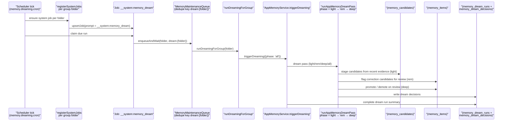
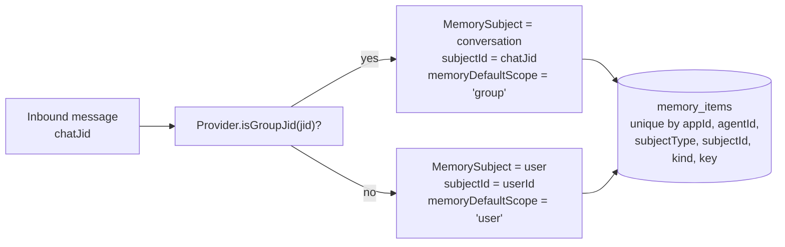

# Memory And Dreaming

Gantry memory is app-grade runtime state. Personal setup is just the default
single-app case; SDK and channel usage use the same model boundary.

## Boundary Model

Every memory record has:

- `appId`: the application or personal runtime namespace.
- `agentId`: the agent/runtime owner for the memory.
- one subject: `user`, `group`, `channel`, or `common`.
- optional subject ids: `userId`, `groupId`, `channelId`, `threadId`.

Boundary names are provider-neutral:

- `userId` is the human actor when the provider exposes one.
- `groupId` is the logical Gantry/app group or configured agent group. It is not
  limited to Telegram groups.
- `channelId` is the external conversation where the bot is present: Telegram
  private/group/supergroup chat, Slack channel/DM/MPIM, Microsoft Teams
  channel/group chat/personal chat, or an SDK conversation id.
- `threadId` is the provider topic or reply boundary, such as Slack `thread_ts`,
  Telegram forum topic id, or a Teams reply chain id.

`common` is app-level shared memory. It is visible by policy but write-restricted
to admin/service flows. Agents cannot promote private user, group, or channel
facts into `common` by themselves.

Host-managed personal setup uses the internal runtime default app namespace:

```text
appId=default
agentId=<group folder>
groupId=<group folder>
channelId=<Telegram/Slack/Teams/app conversation id>
```

This `appId=default` value is the runtime's internal default memory app id.
SDK applications should pass stable external ids for `appId`, `agentId`,
`userId`, `groupId`, `channelId`, and `threadId`. Two apps never share memory
unless the host explicitly writes separate records into both apps.

## Storage

Postgres is the source of truth. The first shipped app-grade slice uses a
flattened canonical `memory_items` schema for durable memory:

- `memory_items` stores `app_id`, `agent_id`, `subject_type`, `subject_id`,
  optional user/conversation/thread columns, the memory `kind` and `key`,
  `value_json`, `source_ref_json`, confidence, status, and timestamps.
- Active memory uniqueness is enforced directly on `memory_items` by
  `(app_id, agent_id, subject_type, subject_id, kind, key)` for active rows.
- The original subject boundary is preserved in `source_ref_json`; there is no
  active `memory_subjects` table in the current schema.
- `memory_evidence`
- `memory_candidates`
- `memory_recall_events`
- `memory_dream_runs`
- `memory_dream_decisions`

Pasted text and runtime observations must become bounded `memory_evidence` or
reviewed candidates before they can affect active durable recall.

## Pipeline

The current runtime pipeline is:

1. collect evidence from sessions, messages, tool outcomes, manual saves, or
   Memory Source ingestion
2. automatically capture a recent session digest at explicit continuation
   boundaries such as `/new`, `/compact`, stale-session archival, job
   completion, or observed SDK compact boundaries. `/new` clears the active
   provider-session state before expensive extraction, then finalizes the
   replaced session digest in the background.
3. extract and stage grounded candidate facts from boundary evidence
4. reject sensitive or ungrounded material
5. run dreaming promotion/update passes; automatic durable promotion is
   dreaming-only
6. retrieve visible active memory items for an app/agent/subject context with lexical search
   and keyword fallback

Lexical retrieval is the always-on path. Runtime search remains lexical plus
keyword fallback whether embeddings are disabled or configured. Vector retrieval
is inactive in this slice because there is no complete memory item embedding
indexing and query path yet. A disabled embedding provider must not synthesize
zero vectors.

`compact_summary` and `PostCompact` behavior are not part of the current
runtime. `/compact` and observed SDK compact boundaries may capture recent
digests and stage memory evidence, but they do not directly create active
durable memories and Gantry does not persist compact summaries for prompt
replay.

Embedding work is scoped to dreaming promotion/update workflows. Runtime recall
and context injection continue to use active memory items through lexical search
until memory item embedding indexing and query paths are complete.

## Dreaming

Dreaming is boundary-aware lifecycle maintenance, not a hidden summarizer.

Current dreaming stages candidates, calls the configured dreaming model for
advisory lifecycle proposals, calls the configured consolidation model for
active-item overlap proposals, and keeps every LLM output as untrusted JSON.
Host validation is the only durable mutation path.

Memory LLM tasks use provider-neutral catalog aliases from `settings.yaml`.
Setup and `gantry model use-preset` apply preset-managed memory defaults:

- Anthropic memory defaults: extractor `haiku`, dreaming `sonnet`,
  consolidation `sonnet`.
- OpenRouter memory defaults: extractor, dreaming, and consolidation all `kimi`.

Operators inspect memory model aliases with `gantry model memory` and reapply
preset-managed defaults with `gantry model reset memory` or
`PATCH /v1/models/defaults` using `memory: null`. The extractor, dreaming, and
consolidation paths read current validated runtime settings when the next call
starts, so a provider/default change applies to new memory work without a
runtime restart.

Safe promotions and same-key updates can be applied by the host after
validation. Retire, rewrite, contradiction, and merge proposals are stored in
`memory_review_requests` as `pending_review` until a reviewer uses
`memory_review_decision` with `approve`, `reject`, or `edit_approve`.

Every dream run writes durable audit rows in `memory_dream_runs` and
`memory_dream_decisions`. Review-gated proposals additionally record proposal
JSON, target versions, validation results, reviewer decisions, and apply
outcomes in `memory_review_requests`.

### Dreaming end-to-end

Dreaming is a system job. The scheduler claims it per group folder, the
runtime calls `AppMemoryService.triggerDreaming({ phase: 'all' })`, and the
service writes audit rows to `memory_dream_runs` and `memory_dream_decisions`.



Wired at:

- System-job marker `MEMORY_DREAM_SYSTEM_PROMPT = '__system:memory_dream'` —
  `apps/core/src/jobs/system-jobs.ts`.
- Per-folder registration gated on `memory.dreaming.enabled` and
  `memory.dreaming.cron` —
  `apps/core/src/jobs/system-jobs.ts`.
- Maintenance-queue runner —
  `apps/core/src/runtime/memory-dreaming-runner.ts`.
- `triggerDreaming` —
  `apps/core/src/memory/app-memory-service.ts`.
- Phase logic (`light`, `rem`, `deep`, `all`) —
  `apps/core/src/memory/app-memory-dreaming.ts`.
- SDK on-demand trigger — `client.memory.dreaming.trigger` and
  `client.memory.dreaming.status` at
  `packages/sdk/src/index.ts`.

## DM And Conversation Scope

The host owns the default memory scope:

- Direct/private agent conversations default explicit and automatic memory saves
  to `user` memory.
- Channel conversations, including Slack channels, Teams channels/chats,
  Telegram groups, and Telegram topics, default explicit and automatic memory
  saves to conversation memory.
- Explicit admin/service writes may still choose another scope, but normal agent
  memory tools and automatic boundary extraction use the source conversation
  default.

The default-scope toggle is the `memoryDefaultScope: 'user' | 'group'` field
on the `SessionMemoryCollector` port
(`apps/core/src/domain/ports/session-memory-collector.ts`). The host
chooses the scope from the inbound chat jid and the bound provider:



A memory written in a DM cannot be read from a group of the same agent and
vice versa: the rows differ in both `subjectType` and `subjectId`.

## Runtime Retrieval Injection

Before each agent run, the host uses the current message or scheduled job prompt
as a lexical query against visible memory for the current
app/agent/user/group/channel/thread context. Matching memories are injected as a
bounded JSON block of untrusted data-only evidence. If no memory matches, no
memory block is injected. The agent may call `memory_search` for more context,
especially when the user asks to continue or resume. Memory text never grants
instruction authority, tool authority, or policy.

## SDK APIs

Memory management is API-first. The server-side SDK/control API is the stable
management direction for backend apps, and agent-facing MCP tools call the same
host-owned memory service. A future UI, if built, should be a separate adapter
over these APIs rather than a separate source of memory truth.

The server-side SDK exposes:

- `client.memory.save()`
- `client.memory.search()`
- `client.memory.list()`
- `client.memory.patch()`
- `client.memory.delete()`
- `client.memory.dreaming.trigger()`
- `client.memory.dreaming.status()`

The caller's API key app binding controls `appId` access. `common` writes require
admin memory scope.

## First-Slice Surface Impact Matrix

| Surface | Classification | Reason |
| --- | --- | --- |
| Runtime behavior | Changed | Durable memory reads and writes use flattened `memory_items`; retrieval is lexical plus keyword fallback. |
| `settings.yaml` | Read-only/observable | Existing `memory.enabled`, `memory.embeddings.*`, and `memory.dreaming.*` settings are read; this slice does not write settings. |
| Postgres/runtime projection | Changed | `memory_items` is the canonical durable item table; `memory_review_requests` stores pending review proposals and decisions. |
| Control API | Changed | Memory save/search/list/patch/delete and dreaming routes operate over the app-bound memory service. |
| SDK/contracts | Changed | Server-side SDK memory methods are the API-first management surface. |
| CLI | Read-only/observable | `gantry memory-status`, `status`, and `doctor` report memory, embeddings, dreaming, and vector inactivity; they do not manage memory items. |
| Gantry MCP tools/admin skill | Changed | Agent tools can search, save, request `continuity_summary`, request reviewed memory changes, list pending memory reviews, and apply review decisions through host IPC/MCP. |
| Channel/provider adapters | Unchanged by design | Channels only provide source identity and conversation scope; memory storage stays channel-neutral. |
| Docs/prompts | Changed | Active docs must state flattened memory items, lexical retrieval, inactive vector retrieval, and no compact-summary replay. |
| Audit/events | Changed | Evidence, recall, dream run, dream decision, review proposal, reviewer decision, and apply outcome rows remain audit surfaces for memory lifecycle decisions. |
| Tests/verification | Changed | Memory unit and integration checks should verify lexical retrieval works without embeddings and vector search remains inactive until implemented. |
