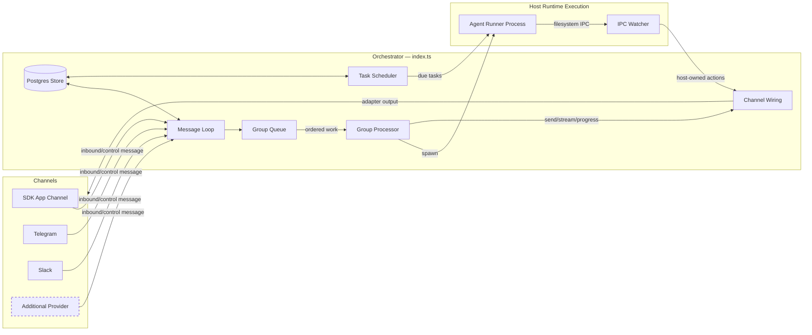

# Gantry Specification

A provider-neutral and channel-neutral agent runtime with multi-channel support, persistent memory per conversation, scheduled jobs, and host-runtime agent execution.

---

## Table of Contents

1. [Architecture](#architecture)
2. [Architecture: Channel System](#architecture-channel-system)
3. [Folder Structure](#folder-structure)
4. [Configuration](#configuration)
5. [Memory System](#memory-system)
6. [Session Management](#session-management)
7. [Message Flow](#message-flow)
8. [Commands](#commands)
9. [Scheduled Jobs](#scheduled-jobs)
10. [MCP Servers](#mcp-servers)
11. [Deployment](#deployment)
12. [Security Considerations](#security-considerations)

---

## Architecture

```
┌──────────────────────────────────────────────────────────────────────┐
│                        HOST (macOS / Linux)                           │
│                     (Main Node.js Process)                            │
├──────────────────────────────────────────────────────────────────────┤
│                                                                       │
│  ┌──────────────────┐                  ┌────────────────────┐        │
│  │ Channels         │─────────────────▶│   Postgres Store  │        │
│  │ (provider        │◀────────────────│   (runtime state) │        │
│  │  registry)       │  store/send      └─────────┬──────────┘        │
│  └──────────────────┘                            │                   │
│                                                   │                   │
│         ┌─────────────────────────────────────────┘                   │
│         │                                                             │
│         ▼                                                             │
│  ┌──────────────────┐    ┌──────────────────┐    ┌───────────────┐   │
│  │  Message Loop    │    │  Scheduler Loop  │    │  IPC Watcher  │   │
│  │  (polls Postgres)│    │  (pg-boss jobs)  │    │  (file-based) │   │
│  └────────┬─────────┘    └────────┬─────────┘    └───────────────┘   │
│           │                       │                                   │
│           └───────────┬───────────┘                                   │
│                       │ spawns host agent process                     │
│                       ▼                                               │
├──────────────────────────────────────────────────────────────────────┤
│                     HOST AGENT RUNTIME                                  │
├──────────────────────────────────────────────────────────────────────┤
│  ┌──────────────────────────────────────────────────────────────┐    │
│  │                    AGENT RUNNER                               │    │
│  │                                                                │    │
│  │  Working directory: /workspace/group (mounted from host)       │    │
│  │  Volume mounts:                                                │    │
│  │    • agents/{name}/ → /workspace/group                         │    │
│  │    • prompt FileArtifacts materialized into runtime context     │    │
│  │    • temp CLAUDE_CONFIG_DIR for settings, skills, artifacts     │    │
│  │    • Additional dirs → /workspace/extra/*                      │    │
│  │                                                                │    │
│  │  Default tool authority (all groups):                          │    │
│  │    • Gantry facades: WebSearch, WebRead, FileSearch, FileRead  │    │
│  │    • AgentDelegation, ToolSearch, Skill, worktree lifecycle    │    │
│  │    • Exact mcp__gantry__send_message / ask_user_question       │    │
│  │    • Exact capability request tools via Gantry MCP             │    │
│  │    • Optional tools only after approved next-run binding       │    │
│  │                                                                │    │
│  └──────────────────────────────────────────────────────────────┘    │
│                                                                       │
└───────────────────────────────────────────────────────────────────────┘
```

### Technology Stack

| Component          | Technology                                                        | Purpose                                                                |
| ------------------ | ----------------------------------------------------------------- | ---------------------------------------------------------------------- |
| Channel System     | Provider registry (`apps/core/src/channels/provider-registry.ts`) | Channels are looked up by provider id and JID prefix                   |
| Message Storage    | Postgres with Drizzle                                             | Store messages, jobs, events, memory, and runtime state                |
| Runtime Execution  | Host process execution                                            | Agent execution with runtime-home scoped paths                         |
| Agent              | Provider execution adapters (current default: Anthropic Claude)   | Run agent models with tools and MCP servers through adapter boundaries |
| Browser Automation | Gantry Browser capability + Chromium                              | Web interaction and screenshots through the projected Browser gateway  |
| Runtime            | Node.js 25+                                                       | Host process for routing and pg-boss job execution                     |

---

## Architecture: Channel System

The runtime supports multi-channel operation via a provider registry. The built-in providers in this codebase are `app`, `slack`, and `telegram`. Providers are registered at startup via `register-builtins.ts`; providers with missing credentials emit a WARN log and are skipped.

### System Diagram



### Provider Adapter Registry

The chat provider system is built on a provider registry in
`apps/core/src/channels/provider-registry.ts`. The abbreviated shape below
shows the current internal contract; use the source file for helper type
definitions and exact imports.

```typescript
export interface Provider {
  id: string;
  label: string;
  jidPrefix: string;
  folderPrefix: string;
  isGroupJid: (jid: string) => boolean;
  formatting: ChannelFormattingDialect;
  isEnabled: (settings: ChannelProviderSettingsLike) => boolean;
  create: ChannelFactory;
  setup: ChannelProviderSetup;
}

export function registerProvider(provider: Provider): void;
export function listChannelProviders(): readonly Provider[];
export function getProvider(id: string): Provider | undefined;
export function providerForJid(jid: string): Provider | undefined;
```

Each provider receives `ChannelOpts` through its `create` function and returns either a `ChannelAdapter` instance or `null` if the provider's credentials are not configured.

### Provider Adapter Interface

Every provider adapter implements the `ChannelAdapter` contract from
`apps/core/src/channels/channel-provider.ts`. It combines required lifecycle,
ownership, and message-sink ports with optional streaming, typing, progress,
group discovery, interaction, and plan-review ports from
`apps/core/src/domain/types.ts`:

```typescript
export type ChannelAdapter = ChannelLifecyclePort &
  ChannelOwnershipPort &
  MessageSink &
  Partial<
    StreamingSink &
      StreamingStateSink &
      TypingSink &
      ProgressSink &
      GroupDiscoverySource &
      InteractionSurface &
      PlanReviewSurface
  >;
```

### Registration Pattern

Providers are registered via `apps/core/src/channels/register-builtins.ts`:

1. Built-in providers (`app`, `slack`, and `telegram`) call `registerProvider(provider)`.
2. Startup wiring iterates `listChannelProviders()`, creates enabled providers, and connects returned channel instances.
3. Routing uses `providerForJid(jid)` to determine ownership and formatting behavior.

### Key Files

| File                                            | Purpose                                                  |
| ----------------------------------------------- | -------------------------------------------------------- |
| `apps/core/src/channels/provider-registry.ts`   | Provider adapter registry                                |
| `apps/core/src/channels/register-builtins.ts`   | Built-in provider registration                           |
| `apps/core/src/channels/channel-provider.ts`    | `ChannelAdapter`, `ChannelOpts`, and provider factory    |
| `apps/core/src/domain/types.ts`                 | Provider ports, message types, and group metadata        |
| `apps/core/src/index.ts`                        | Orchestrator — instantiates providers, runs message loop |
| `apps/core/src/app/bootstrap/channel-wiring.ts` | Owns provider output, streaming, progress, and approvals |

### Adding a New Provider Adapter

To add a new provider adapter, contribute a bundled or registered skill that:

1. Adds a `apps/core/src/channels/<name>.ts` file implementing the `ChannelAdapter` contract
2. Exposes a `Provider` entry with `id`, prefixes, setup metadata, and `create`
3. Returns `null` from `create` if credentials are missing
4. Registers the provider via `register-builtins.ts` (or equivalent provider registration module)

Provider-extension skills can follow this pattern when they are added to the
bundled package assets or registered skill catalog. Runtime-home Claude skill
folders are not the source of truth for runtime materialization.

---

## Folder Structure

```
gantry/
├── CLAUDE.md                      # Project context for Claude Code
├── docs/
│   ├── SPEC.md                    # This specification document
│   ├── REQUIREMENTS.md            # Architecture decisions
│   └── SECURITY.md                # Security model
├── README.md                      # User documentation
├── package.json                   # Node.js dependencies
├── tsconfig.json                  # TypeScript configuration
├── .mcp.json                      # MCP server configuration (reference)
├── .gitignore
│
├── apps/
│   └── core/
│       ├── src/
│       │   ├── index.ts           # Package/runtime entrypoint
│       │   ├── app/               # Process bootstrap, lifecycle, runtime composition
│       │   ├── channels/          # Provider registry and channel implementations
│       │   ├── config/            # Env, settings, credentials, redaction
│       │   ├── control/           # HTTP/SSE SDK control server
│       │   ├── domain/            # Pure domain types and repository contracts
│       │   ├── infrastructure/    # Postgres, pg-boss, IPC, logging, service wrappers
│       │   ├── jobs/              # Gantry job lifecycle and scheduler ports
│       │   ├── memory/            # Memory ingestion, retrieval, and storage logic
│       │   ├── messaging/         # Routing and formatting
│       │   ├── platform/          # Group folder and sender allowlist helpers
│       │   ├── runtime/           # Host orchestration, queues, agent spawn, permissions
│       │   ├── runner/            # Child runner, Claude Agent SDK, MCP tools
│       │   ├── session/           # Slash commands and transcript archive flow
│       │   └── shared/            # Small dependency-light helpers
│
├── ops/
│   ├── bootstrap.sh              # Local bootstrap script
│   └── launchd/
│       └── com.gantry.plist      # macOS service configuration
│
├── dist/                          # Compiled JavaScript (gitignored)
│
├── .claude/
│   └── skills/
│       └── gantry-admin/SKILL.md        # Internal runtime administration reference
│
├── agents/
│   └── {channel}_{group-name}/    # Per-agent runtime folder
│       └── logs/                  # Operational task logs
│
├── data/                          # Application state (gitignored)
│   ├── artifacts/                 # Provider artifact backend for single-node deployments
│   ├── env/env                    # Copy of .env for runtime loading
│   └── ipc/                       # Runtime IPC (messages/, tasks/)
│
├── logs/                          # Runtime logs (gitignored)
│   ├── gantry.log               # Host stdout
│   └── gantry.error.log         # Host stderr
│   # Note: Per-agent logs are in agents/{folder}/logs/
│
└── ops/launchd/
    └── com.gantry.plist         # macOS service configuration
```

---

## Configuration

Configuration constants are in `apps/core/src/config/index.ts`:

```typescript
import path from 'path';
import { getGantryHome } from './gantry-home.js';
import { ensureRuntimeSettings } from './settings/runtime-settings.js';

export const ASSISTANT_NAME = process.env.ASSISTANT_NAME || 'Andy';
// Fallback route-wide polling interval for runtimes without durable live
// admission claims. Normal live admission uses queue-scoped durable work items.
export const POLL_INTERVAL = 2000;

// Paths are absolute and resolve from the configured runtime home.
const GANTRY_HOME = getGantryHome(process.env.GANTRY_HOME);
export const AGENTS_DIR = path.resolve(GANTRY_HOME, 'agents');
export const DATA_DIR = path.resolve(GANTRY_HOME, 'data');

// Default model aliases are non-secret configuration in settings.yaml.
export const getConfiguredDefaultModel = () =>
  ensureRuntimeSettings(GANTRY_HOME).agent.defaultModel;
export const IPC_POLL_INTERVAL = 1000;
export const IDLE_TIMEOUT = parseInt(process.env.IDLE_TIMEOUT || '1800000', 10); // 30min — keep runtime worker alive after last result

export const TRIGGER_PATTERN = new RegExp(`^@${ASSISTANT_NAME}\\b`, 'i');
```

**Note:** Paths must be absolute for runtime path validation and scoped mounts.

### Agent Config

Groups can have additional directories exposed to the agent workspace through the registered group agent config. Example registration:

```typescript
setRegisteredGroup('telegram:dev-team', {
  name: 'Dev Team',
  folder: 'telegram_dev-team',
  trigger: '@Andy',
  added_at: new Date().toISOString(),
  agentConfig: {
    model: 'opus',
    additionalMounts: [
      {
        hostPath: '~/projects/webapp',
        readonly: false,
      },
    ],
    timeout: 600000,
  },
});
```

Folder names follow the convention `{channel}_{group-name}` (e.g., `slack_engineering`, `telegram_dev-team`). Trigger behavior is stored on each conversation binding as `requiresTrigger`.

Additional mounts appear under `/workspace/extra/` in the runtime workspace.

Interactive model precedence is:

1. `conversation.agentConfig.model`
2. `agent.default_model` in `settings.yaml`
3. system default `opus`

Job model precedence is:

1. explicit job `modelAlias`
2. `agent.one_time_job_default_model` or `agent.recurring_job_default_model`
3. `agent.default_model`
4. system default `opus`

Memory LLM aliases live under `memory.llm.models` and are preset-managed.
Provider presets set chat and memory LLM defaults together: `anthropic` uses
chat `opus`, job defaults inherit chat, and memory LLM tasks use
`haiku`/`sonnet`/`sonnet`; `openrouter` uses chat `kimi`, job defaults inherit
chat, and memory LLM tasks use `kimi` for extraction, dreaming, and
consolidation. Memory embeddings are separate from these LLM defaults; today
they support only `openai` or `disabled`. The OpenRouter catalog also includes
selectable `glm-5.2` without changing preset defaults.

Use `/model` in a group session to switch the live model (`/model`, `/model <alias>`, `/model default`). Use `/models` to list supported aliases and `/status` to inspect the current model, context window usage percentage, cache hit percentage, token usage, cache read/write tokens, cache state, top context contributors when available, and cost when the provider reports it.

### Model Access

Gantry uses an agent credential broker boundary for agent and memory LLM
credentials. `model_access.enabled` in `settings.yaml` controls whether Gantry
Model Gateway is active. Gantry Model Gateway is the default local/personal
model access adapter.
Runtime-owned secrets such as `GANTRY_DATABASE_URL`, channel tokens, webhook
secrets, control secrets, and `SECRET_ENCRYPTION_KEY` are read through runtime
secret configuration, not requested from the agent credential broker.

Runtime `.env` is for runtime-owned secrets only. It stores
`GANTRY_DATABASE_URL` and a generated base64-encoded 32-byte
`SECRET_ENCRYPTION_KEY` used by Gantry model credentials and capability
credentials, but not model access settings, default model, or raw model-provider
credentials. Non-secret model access and model configuration lives in
`settings.yaml`, for example `model_access.enabled`,
`model_access.gateway.bind_host`, or `agent.default_model`.

The model SDK credential lane receives only broker-safe model endpoint settings
from the selected broker. Raw provider tokens and runtime-owned database URLs
are not forwarded to tools, the general child runner environment, or MCP
servers. Provider access is projected to the Agent SDK through explicit
loopback model endpoint settings such as `ANTHROPIC_BASE_URL` and a run-local
gateway token. `NO_PROXY`/`no_proxy` defaults are cooperative-tool
compatibility hints only; vulnerable-tool protection remains capability,
permission, sandbox, and audit policy.
If `.env` or process env contains raw agent credentials such as
`ANTHROPIC_API_KEY`, `OPENAI_API_KEY`, or `CLAUDE_CODE_OAUTH_TOKEN`,
doctor/preflight reports a wrong-lane configuration error.

### Changing the Agent Mention Name

Set the `ASSISTANT_NAME` environment variable:

```bash
ASSISTANT_NAME=Bot npm start
```

Or edit the default in `apps/core/src/config/index.ts`. This changes:

- The trigger pattern (messages must start with `@YourName`)
- The response prefix (`YourName:` added automatically)

### Placeholder Values in launchd

Files with `{{PLACEHOLDER}}` values need to be configured:

- `{{RUNTIME_ENTRY}}` - Absolute path to the compiled Gantry runtime entry
- `{{MIGRATOR_ENTRY}}` - Absolute path to the compiled Postgres migrator entry
- `{{RUNTIME_HOME}}` - Runtime home, normally `~/gantry`
- `{{NODE_PATH}}` - Path to node binary (detected via `which node`)
- `{{HOME}}` - User's home directory

---

## Memory System

Gantry separates static prompt profile files from structured memory and runtime continuity context.

### Prompt Profile Layer

Prompt profile FileArtifacts are static guidance, not memory dumps:

| Layer             | Virtual path               | Purpose                                  |
| ----------------- | -------------------------- | ---------------------------------------- |
| **Soul**          | `<agent-folder>/SOUL.md`   | Agent personality, voice, and boundaries |
| **Agent context** | `<agent-folder>/AGENTS.md` | Stable agent-specific guidance           |

Dynamic facts, open loops, and raw transcripts must not be written into these
FileArtifacts. Durable facts go through structured memory. Active task state is
persisted through canonical Postgres messages, runs, jobs, events, memory,
runtime events, and digests.

Shared/default operating rules are not stored in `agents/shared`. The runtime
compiles them as built-in prompt guidance with memory, continuity, privacy,
tool-use, and communication defaults before appending agent `AGENTS.md`
content.

### Continuity Context

Continuity is the runtime behavior that helps the agent resume current work:

- live SDK streaming context for active chat turns
- current relevant durable memory
- prior decisions
- user/group preferences
- open loops when commitment tracking is enabled

Before a fresh agent run, the host builds a memory-only context block and passes
it to the agent runner with recent session digests first (when persisted),
followed by active durable memory items. Follow-up chat messages are then piped
into the same live SDK stream until `/new`, stop, shutdown, or idle expiry.
Postgres messages and run logs are not replayed into every prompt.

See [CONTINUITY.md](CONTINUITY.md) for the continuity model.

### Structured Memory Store

The structured memory store provides boundary-aware recall for durable
statements, learned procedures, evidence, recall signals, and auditable dreaming
decisions. It stores app-grade memory in Postgres.

#### Storage Backend

| Component           | Technology                          | Purpose                                                                                                                         |
| ------------------- | ----------------------------------- | ------------------------------------------------------------------------------------------------------------------------------- |
| **Memory items**    | Postgres (`memory_items`)           | Canonical durable statements with flattened app/agent/subject columns, confidence, status, version metadata, and evidence links |
| **Evidence**        | Postgres (`memory_evidence`)        | Grounding from sessions, messages, tools, manual saves, and sources                                                             |
| **Candidates**      | Postgres (`memory_candidates`)      | Extracted facts awaiting promotion or review                                                                                    |
| **Recall events**   | Postgres (`memory_recall_events`)   | Search/usefulness signals for future dreaming                                                                                   |
| **Dream runs**      | Postgres (`memory_dream_runs`)      | Dreaming lifecycle runs per boundary                                                                                            |
| **Dream decisions** | Postgres (`memory_dream_decisions`) | Auditable promotion, merge, rewrite, decay, retire, or review rows                                                              |
| **Lexical search**  | Postgres full-text search           | Always-on memory retrieval path                                                                                                 |
| **Vector search**   | Optional `pgvector` hybrid path     | Active when embeddings are enabled and items are indexed; otherwise full-text recall remains the always-on baseline             |

`memory_subjects` is not an active current-schema table. Subject identity is
flattened into `memory_items` and preserved in item metadata for visibility
checks.

#### MCP Tools (Exposed to Agents)

Agents interact with memory via MCP tools over IPC:

| Tool                 | Purpose                                                                                   |
| -------------------- | ----------------------------------------------------------------------------------------- |
| `memory_save`        | Save a durable preference, decision, fact, correction, or constraint in user/group scope  |
| `memory_search`      | Search scoped memory statements and source snippets                                       |
| `continuity_summary` | Summarize current durable memory continuity, staged candidates, and last injected context |
| `procedure_save`     | Save a reusable multi-step procedure                                                      |
| `file`               | List, read, write, or promote Gantry FileArtifacts by virtual scope/path                  |

Patch and review tools exist in the host protocol for reviewed/admin flows, but
they are not part of the default agent capability bundle.
Common/global memory writes are restricted to approved admin or service
workflows; default agent IPC/MCP memory saves must not write shared common
memory directly.

#### Memory Boundaries

Every memory record belongs to an `appId` and `agentId`. One subject determines
the primary visibility boundary:

| Subject   | Meaning                                                             |
| --------- | ------------------------------------------------------------------- |
| `user`    | Human actor preferences, corrections, or durable facts              |
| `group`   | Logical Gantry/app group or configured agent group                  |
| `channel` | External provider conversation where the bot is present             |
| `common`  | App-wide shared memory, write-restricted to admin/service workflows |

Provider ids are stored without changing the boundary meaning:

- `channelId` is the provider conversation id: Telegram private/group/supergroup
  chat, Slack channel/DM/MPIM, Microsoft Teams channel/chat, or SDK
  conversation.
- `groupId` is the configured Gantry/app group, not a Telegram-only group id.
- `threadId` is a topic or reply boundary such as Slack `thread_ts`, Telegram
  forum topic id, or Teams reply chain id.

#### Search Architecture

Search uses Postgres full-text lexical ranking over visible `memory_items` when
embeddings are disabled, which is the default local setup. When embeddings are
enabled and item vectors are ready for the configured provider/model/dimensions,
runtime recall fuses lexical and pgvector cosine candidates with reciprocal
rank fusion. Query embedding is deadline-bounded and falls back to lexical
retrieval on quota, rate-limit, provider error, or timeout.

Embedding writes happen outside turn-time recall through dreaming
promotion/update workflows and resumable embedding backfill.

#### Source Ingestion

Markdown/file ingestion is an explicit knowledge-source feature. It is not the
primary memory store. Runtime memories are captured as grounded evidence,
candidates, durable items, recall events, and dream decisions in Postgres.

#### Reflection (Auto-Capture)

At session boundaries, the system captures continuation digests and stages
memory extraction output from the conversation. `/new` uses a `session-end`
trigger, while manual `/compact` and observed SDK auto-compaction boundaries
use a `precompact` trigger:

- Uses a provider interface; the current extractor is LLM-backed and
  auth-gated, and can be replaced without changing storage or recall.
- Detects preferences, decisions, facts, corrections, and constraints.
- Stores real human-readable extraction output with reflection-derived confidence scores.
- Filters sensitive material (API keys, tokens, passwords)
- Records boundary/extraction metadata on `agent_session_digests`; zero facts is
  a typed successful-empty outcome when no qualifying durable facts are found.
  Extraction status is one of `facts_extracted`, `empty_qualified`,
  `auth_unavailable`, `sensitive_blocked`, `extractor_failed`, or
  `outcome_unavailable`; only `empty_qualified` with
  `no_qualifying_facts` means the extractor ran successfully and found nothing
  durable.
- Rejects prompt-injection style text before it becomes future context
- Controlled by memory extractor settings and the app-grade memory service.
- Automatic durable promotion/update is dreaming-only.
- Does not install `PostCompact` hooks and does not persist `compact_summary`
  records for prompt replay.

### Memory Storage

Gantry memory uses Postgres tables in the configured runtime schema.

- Runtime database: `GANTRY_DATABASE_URL`
- Runtime schema: `storage.postgres.schema` (default `gantry`)
- Lexical search: Postgres full-text search (always-on baseline)
- Vector search: optional semantic enhancement; active when embeddings are
  enabled and indexed, otherwise full-text recall remains the baseline

Transcript export, when needed, is generated from canonical Postgres messages
into a `FileArtifact`. Provider SDK JSONL files are not stored as durable
artifacts and are not memory, canonical message history, or runtime
continuation state.

### Memory Configuration Reference

| Setting                               | Default                  | Description                                                     |
| ------------------------------------- | ------------------------ | --------------------------------------------------------------- |
| `storage.postgres.url_env`            | `GANTRY_DATABASE_URL`    | Env key for Postgres connection URL                             |
| `storage.postgres.schema`             | `gantry`                 | Postgres schema name                                            |
| `agent.default_model`                 | empty                    | Default provider-neutral model alias                            |
| `agent.one_time_job_default_model`    | empty                    | One-time/manual job model alias; inherits `agent.default_model` |
| `agent.recurring_job_default_model`   | empty                    | Cron/interval job model alias; inherits `agent.default_model`   |
| `memory.llm.models.extractor`         | `haiku`                  | Memory extraction model alias                                   |
| `memory.llm.models.dreaming`          | `sonnet`                 | Memory dreaming model alias                                     |
| `memory.llm.models.consolidation`     | `sonnet`                 | Memory consolidation model alias                                |
| `model_access.enabled`                | `true`                   | Enables Gantry Model Gateway                                    |
| `model_access.gateway.bind_host`      | `127.0.0.1`              | Loopback bind host for Gantry Model Gateway                     |
| `memory.enabled`                      | `true`                   | Enables durable memory                                          |
| `memory.embeddings.enabled`           | `false`                  | Optional embedding toggle                                       |
| `memory.embeddings.provider`          | `disabled`               | Embedding provider (`disabled` or `openai`; OpenAI only today)  |
| `memory.embeddings.model`             | `text-embedding-3-small` | Embedding model                                                 |
| `memory.embeddings.batch_size`        | `16`                     | Texts per embedding API call                                    |
| `memory.embeddings.daily_limit`       | `500`                    | Daily embedding API call limit                                  |
| `memory.llm.extractor_max_facts`      | `8`                      | Max candidate facts extracted per evidence batch                |
| `memory.llm.extractor_min_confidence` | `0.6`                    | Min confidence for extracted candidates                         |
| `memory.dreaming.enabled`             | `false`                  | Enables scheduled dreaming maintenance                          |
| `memory.dreaming.cron`                | `15 3 * * *`             | Dreaming maintenance schedule                                   |
| `memory.maintenance.max_pending`      | `5000`                   | Max pending memory maintenance items per pass                   |

---

## Session Management

Sessions enable conversation continuity from Gantry-owned Postgres state.

### How Sessions Work

1. Each app/agent/conversation/thread scope resolves to a canonical
   `AgentSession` in Postgres.
2. Runtime hydrates only scoped durable memory for a fresh runner or scheduled
   job.
3. Live chat runs persist and resume provider SDK sessions as adapter metadata
   when a trusted provider handle exists; scheduled/autonomous jobs remain
   ephemeral with `persistSession: false` and no SDK `resume`,
   `resumeSessionAt`, or `continue` handles.
4. Active chat follow-ups are streamed into the same live SDK query. Provider
   transcript exports may exist for debugging, but they are not runtime state.

---

## Message Flow

### Incoming Message Flow

```
1. User sends a message via any connected channel
   │
   ▼
2. Channel adapter or SDK control server receives the message
   │
   ▼
3. Runtime stores chat metadata and the message in Postgres
   │
   ▼
4. Message loop polls Postgres or recovers pending messages after restart
   │
   ▼
5. Message loop checks:
   ├── Is chat_jid in registered groups? -> No: ignore
   ├── Is sender allowed to interact? -> No: drop or store only
   └── Does message match trigger/session command policy? -> No: store but don't process
   │
   ▼
6. GroupQueue enqueues ordered work for the group/thread
   │
   ▼
7. Group processor catches up conversation:
   ├── Fetch all messages since last agent interaction
   ├── Format with timestamp and sender name
   ├── Add job metadata when present
   └── Build prompt with durable memory context only
   │
   ▼
8. Agent spawn starts the child runner:
   ├── cwd: agents/{group-name}/
   ├── prompt: conversation history + current message
   ├── persistSession: true for live chat; false for scheduled/autonomous jobs
   ├── resume: trusted provider session ID when available for live chat
   └── mcpServers: gantry (runtime tools over IPC)
   │
   ▼
9. Child runner invokes Claude Agent SDK:
   ├── Uses injected prompt profile and durable memory context
   ├── Uses MessageStream for safe follow-up input
   └── Requests host permission for policy-gated tools
   │
   ▼
10. Group processor forwards streaming/progress/final output through channel wiring
   │
   ▼
11. Slack/Telegram send network responses; the app channel writes durable control events
   │
   ▼
12. Runtime advances cursor and stores Gantry-owned run/session events in Postgres
```

### Runtime Event Observability

Gantry stores runtime events as read-only evidence for SDK clients, webhooks,
status views, and audits. Public run event history projects these records from
`GET /v1/runs/:runId/events`; startup diagnostics use public run event
`type: 'diagnostic'` and retain the source runtime event type in metadata.

Current observable runtime event families include:

- `task.started`, `task.progress`, and `task.updated` for provider-neutral task
  lifecycle observations. Lifecycle payload text is bounded before persistence
  and excludes raw prompts, output paths, provider handles, credentials, and
  stack traces.
- `mcp.tool_activity` for MCP proxy attempt, denial, success, and failure
  evidence. Arguments and errors are summarized/redacted, and raw MCP tool
  result values are not persisted in the activity event.
- `run.startup_diagnostic` for count/timing startup diagnostics from host or
  runner setup.

Runtime events are observable-only. They must not decide permissions, selected
capabilities, MCP activation, model routing, channel delivery, or worker
ownership.

### Trigger Word Matching

Messages must start with the trigger pattern (default: `@Andy`):

- `@Andy what's the weather?` → ✅ Triggers Claude
- `@andy help me` → ✅ Triggers (case insensitive)
- `Hey @Andy` → ❌ Ignored (trigger not at start)
- `What's up?` → ❌ Ignored (no trigger)

### Conversation Catch-Up

When a triggered message arrives, the agent receives all messages since its last interaction in that chat. Each message is formatted with timestamp and sender name:

```
[Jan 31 2:32 PM] John: hey everyone, should we do pizza tonight?
[Jan 31 2:33 PM] Sarah: sounds good to me
[Jan 31 2:35 PM] John: @Andy what toppings do you recommend?
```

This allows the agent to understand the conversation context even if it wasn't mentioned in every message.

---

## Commands

### Commands Available in Any Group

| Command            | Example                     | Effect                       |
| ------------------ | --------------------------- | ---------------------------- |
| `@Agent [message]` | `@Andy what's the weather?` | Message the configured agent |

### Commands Available in Main Channel Only

| Command                      | Example                             | Effect                    |
| ---------------------------- | ----------------------------------- | ------------------------- |
| `@Agent add group "Name"`    | `@Andy add group "Family Chat"`     | Register a new group      |
| `@Agent remove group "Name"` | `@Andy remove group "Work Team"`    | Unregister a group        |
| `@Agent list groups`         | `@Andy list groups`                 | Show registered groups    |
| `@Agent remember [fact]`     | `@Andy remember I prefer dark mode` | Add scoped durable memory |

---

## Scheduled Jobs

Gantry has a built-in scheduler that runs jobs as full agents in the owning conversation's context.
Job definitions, job instances/runs, and notification routes are runtime
Postgres state and are never written to `settings.yaml`.

### How Scheduling Works

1. **Conversation Context**: Jobs created in a conversation run with that conversation's working directory and memory. A thread or topic can control delivery, but it does not own the job.
2. **Agent Capabilities**: Scheduled jobs inherit the selected target agent's
   selected capabilities plus attached sources. They do not carry job-specific
   capability grants, raw tool grants, or receive all tools by default.
   Job `accessRequirements` are readiness assertions that pause the job until
   the target agent has the required capability, scoped command fallback, or MCP
   source.
3. **Optional Messaging**: Jobs can send messages to their configured conversation or thread/topic route using the `send_message` tool, or complete silently
4. **Admin Privileges**: Admin-wide job management belongs to the Control API
   and local/admin CLI surfaces. Normal agent-facing scheduler MCP tools stay
   scoped to the calling agent and originating conversation.
5. **Browser Action Gating**: Browser actions use the selected canonical
   `Browser` capability and projected gateway tools: `browser_status`,
   `browser_open`, `browser_inspect`, `browser_act`, and `browser_close`.
   Private browser backend job tool names are rejected instead of creating
   browser action access.

### Schedule Types

| Type       | Value Format    | Example                      |
| ---------- | --------------- | ---------------------------- |
| `cron`     | Cron expression | `0 9 * * 1` (Mondays at 9am) |
| `interval` | Milliseconds    | `3600000` (every hour)       |
| `once`     | ISO timestamp   | `2024-12-25T09:00:00Z`       |

### Creating a Job

```
User: @Andy remind me every Monday at 9am to review the weekly metrics

Agent: [calls mcp__gantry__scheduler_upsert_job]
        {
          "name": "weekly-metrics-reminder",
          "prompt": "Send a reminder to review weekly metrics. Be encouraging!",
          "schedule_type": "cron",
          "schedule_value": "0 9 * * 1",
          "executionContext": {
            "conversationJid": "<current_chat_jid>"
          },
          "notificationRoutes": [
            {
              "conversationJid": "<current_chat_jid>",
              "label": "primary"
            }
          ]
        }

Agent: Done! I'll remind you every Monday at 9am.
```

### One-Time Jobs

```
User: @Andy at 5pm today, send me a summary of today's emails

Agent: [calls mcp__gantry__scheduler_upsert_job]
        {
          "name": "today-email-summary",
          "prompt": "Search for today's emails, summarize the important ones, and send the summary to the group.",
          "schedule_type": "once",
          "schedule_value": "2024-01-31T17:00:00Z",
          "executionContext": {
            "conversationJid": "<current_chat_jid>"
          },
          "notificationRoutes": [
            {
              "conversationJid": "<current_chat_jid>",
              "label": "primary"
            }
          ]
        }
```

### Managing Jobs

From any conversation:

- `@Andy list my scheduled jobs` - View jobs for this conversation
- `@Andy pause job [id]` - Pause a job
- `@Andy resume job [id]` - Resume a paused job
- `@Andy delete job [id]` - Delete a job

With selected scheduler capability and conversation approval:

- `@Andy list all jobs` - View jobs from all conversations
- `@Andy schedule job for "Family Chat": [prompt]` - Schedule for another conversation

---

## MCP Servers

### Gantry MCP (built-in)

The `gantry` MCP server is created dynamically per agent call with the current conversation context.

**Available Tools:**
| Tool | Purpose |
|------|---------|
| `scheduler_upsert_job` | Create or update a scheduler job |
| `scheduler_get_job` | Get job details |
| `scheduler_list_jobs` | List jobs |
| `scheduler_update_job` | Modify job prompt/schedule/policy |
| `scheduler_delete_job` | Delete a job |
| `scheduler_pause_job` | Pause a job |
| `scheduler_resume_job` | Resume a paused job |
| `scheduler_run_now` | Queue an immediate run of an existing job |
| `scheduler_list_runs` | List job run history |
| `scheduler_get_dead_letter` | List dead-lettered runs |
| `send_message` | Send a message to the configured conversation route |

Scheduler MCP job visibility and mutation are scoped to both the calling
agent's runtime scope and the current conversation: `workspace_key` must match the
agent, and `executionContext.conversationJid` must match the originating chat.
Thread/topic ids may be checked to prevent delivery retargeting, but they do
not create job visibility or run authority.

---

## Deployment

Gantry runs as one local runtime service. The installer chooses launchd on
macOS, systemd user units on Linux when available, and a nohup/background
fallback otherwise. Managed local services are started before the runtime when
they are configured.

### Startup Sequence

When Gantry starts, it:

1. Runs runtime preflight for host execution and emits actionable fix steps on failure
2. Auto-builds runner artifacts from `apps/core/src/runner` and fails startup if build fails
3. Initializes Postgres runtime storage
4. Loads state from runtime storage (registered groups, sessions, runtime cursor state)
5. **Connects channels** — loops through registered channels, instantiates those with credentials, calls `connect()` on each
6. Once at least one channel is connected:
   - Starts the scheduler loop
   - Starts the IPC watcher for runtime messages
   - Sets up the per-group queue with `processGroupMessages`
   - Recovers any unprocessed messages from before shutdown
   - Starts durable live-admission work claims when available; otherwise starts
     the fallback message polling loop

### Service Lifecycle

The generated service sets `GANTRY_HOME`, uses the resolved Node runtime entry,
and runs the local dependency prestart command before the main runtime:

```bash
gantry start
gantry
```

On macOS this is written into `com.gantry.plist` through a shell command. On
Linux systemd it is represented as `ExecStartPre`. The fallback script performs
the same prestart step before launching the runtime.

The Control API starts inside this same runtime process. Runtime control
settings such as `GANTRY_CONTROL_API_KEYS_JSON`, `GANTRY_CONTROL_PORT`, and
`GANTRY_CONTROL_SOCKET_PATH` are read from process env or `~/gantry/.env`. Each
API key entry must include `kid`, `token`, `appId`, and explicit `scopes`. The
launchd plist should not contain control API secrets; it only needs enough
environment to find the runtime home and executable path.

**launchd shape:**

```xml
<?xml version="1.0" encoding="UTF-8"?>
<!DOCTYPE plist PUBLIC "-//Apple//DTD PLIST 1.0//EN" "...">
<plist version="1.0">
<dict>
    <key>Label</key>
    <string>com.gantry</string>
    <key>ProgramArguments</key>
    <array>
        <string>/bin/sh</string>
        <string>-lc</string>
        <string>{{NODE_PATH}} {{MIGRATOR_ENTRY}} &amp;&amp; exec {{NODE_PATH}} {{RUNTIME_ENTRY}}</string>
    </array>
    <key>WorkingDirectory</key>
    <string>{{RUNTIME_HOME}}</string>
    <key>RunAtLoad</key>
    <true/>
    <key>KeepAlive</key>
    <true/>
    <key>EnvironmentVariables</key>
    <dict>
        <key>GANTRY_HOME</key>
        <string>{{RUNTIME_HOME}}</string>
        <key>PATH</key>
        <string>{{HOME}}/.local/bin:/usr/local/bin:/usr/bin:/bin</string>
        <key>HOME</key>
        <string>{{HOME}}</string>
    </dict>
    <key>StandardOutPath</key>
    <string>{{RUNTIME_HOME}}/logs/gantry.log</string>
    <key>StandardErrorPath</key>
    <string>{{RUNTIME_HOME}}/logs/gantry.error.log</string>
</dict>
</plist>
```

### Managing the Service

```bash
# Start, stop, or restart the whole local runtime stack
gantry start
gantry stop
gantry restart

# Install the background service
gantry service install

# Check status
gantry status

# View logs
gantry logs

# Manage local Postgres + Model Access together
gantry local status
docker compose logs --tail 160
```

---

## Security Considerations

### Runtime Isolation

Host runtime execution is the only supported runtime path today.
Security boundaries are enforced through per-group directory scope, runtime-home controls, authorization checks, and explicit operational hardening.

### Prompt Injection Risk

Inbound channel and SDK messages could contain malicious instructions attempting to manipulate Claude's behavior.

**Mitigations:**

- Only registered groups are processed
- Trigger word required (reduces accidental processing)
- Agents can only access their group's mounted directories
- Main can configure additional directories per group
- Claude's built-in safety training

**Recommendations:**

- Only register trusted groups
- Review additional directory mounts carefully
- Review scheduled jobs periodically
- Monitor logs for unusual activity

### Credential Storage

| Credential          | Storage Location         | Notes                                                            |
| ------------------- | ------------------------ | ---------------------------------------------------------------- |
| Model provider keys | Gantry model credentials | Encrypted in Postgres and projected through the loopback gateway |
| Channel secrets     | Runtime environment      | Loaded by provider setup and never exposed to agents             |

### File Permissions

The runtime agents and data directories contain personal context and should be protected:

```bash
chmod 700 ~/gantry/agents ~/gantry/data
```

---

## Troubleshooting

### Common Issues

| Issue                              | Cause                                 | Solution                                                          |
| ---------------------------------- | ------------------------------------- | ----------------------------------------------------------------- |
| No response to messages            | Service not running                   | Run `gantry status` and check the service line                    |
| Startup fails at runtime preflight | Runtime build or storage check failed | Run `gantry status` and follow the displayed next action          |
| Session not continuing             | Session state not persisted           | Run `gantry status` and verify Postgres runtime storage readiness |
| "No conversations connected"       | No Conversation connected             | Run `gantry setup` and connect one Conversation                   |

### Log Location

- `logs/gantry.log` - stdout
- `logs/gantry.error.log` - stderr

### Debug Mode

Run manually for verbose output:

```bash
npm run dev
npm start
```
