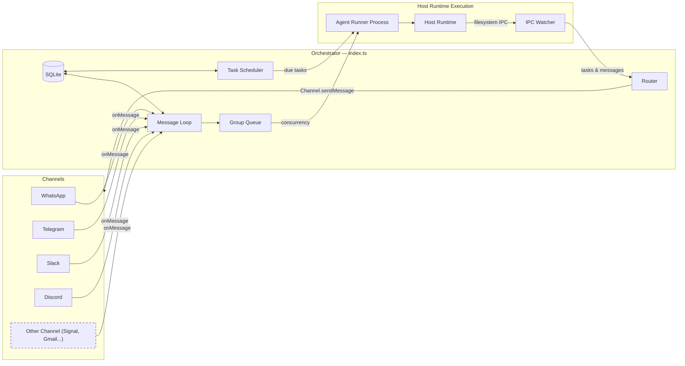

# MyClaw Specification

A personal Claude assistant with multi-channel support, persistent memory per conversation, scheduled jobs, and host-runtime agent execution.

---

## Table of Contents

1. [Architecture](#architecture)
2. [Architecture: Channel System](#architecture-channel-system)
3. [Folder Structure](#folder-structure)
4. [Configuration](#configuration)
5. [Memory System](#memory-system)
6. [Session Management](#session-management)
7. [Message Flow](#message-flow)
8. [Commands](#commands)
9. [Scheduled Jobs](#scheduled-jobs)
10. [MCP Servers](#mcp-servers)
11. [Deployment](#deployment)
12. [Security Considerations](#security-considerations)

---

## Architecture

```
┌──────────────────────────────────────────────────────────────────────┐
│                        HOST (macOS / Linux)                           │
│                     (Main Node.js Process)                            │
├──────────────────────────────────────────────────────────────────────┤
│                                                                       │
│  ┌──────────────────┐                  ┌────────────────────┐        │
│  │ Channels         │─────────────────▶│   Storage Database │        │
│  │ (provider        │◀────────────────│   (myclaw.db)      │        │
│  │  registry)       │  store/send      └─────────┬──────────┘        │
│  └──────────────────┘                            │                   │
│                                                   │                   │
│         ┌─────────────────────────────────────────┘                   │
│         │                                                             │
│         ▼                                                             │
│  ┌──────────────────┐    ┌──────────────────┐    ┌───────────────┐   │
│  │  Message Loop    │    │  Scheduler Loop  │    │  IPC Watcher  │   │
│  │  (polls SQLite)  │    │  (checks tasks)  │    │  (file-based) │   │
│  └────────┬─────────┘    └────────┬─────────┘    └───────────────┘   │
│           │                       │                                   │
│           └───────────┬───────────┘                                   │
│                       │ spawns host agent process                     │
│                       ▼                                               │
├──────────────────────────────────────────────────────────────────────┤
│                     HOST AGENT RUNTIME                                  │
├──────────────────────────────────────────────────────────────────────┤
│  ┌──────────────────────────────────────────────────────────────┐    │
│  │                    AGENT RUNNER                               │    │
│  │                                                                │    │
│  │  Working directory: /workspace/group (mounted from host)       │    │
│  │  Volume mounts:                                                │    │
│  │    • agents/{name}/ → /workspace/group                         │    │
│  │    • agents/shared/ → /workspace/shared/ (non-main only)       │    │
│  │    • data/sessions/{group}/.claude/ → /home/node/.claude/      │    │
│  │    • Additional dirs → /workspace/extra/*                      │    │
│  │                                                                │    │
│  │  Tools (all groups):                                           │    │
│  │    • Bash (host-executed runtime scope)                        │    │
│  │    • Read, Write, Edit, Glob, Grep (file operations)           │    │
│  │    • WebSearch, WebFetch (internet access)                     │    │
│  │    • agent-browser (browser automation)                        │    │
│  │    • mcp__myclaw__* (scheduler tools via IPC)                │    │
│  │                                                                │    │
│  └──────────────────────────────────────────────────────────────┘    │
│                                                                       │
└───────────────────────────────────────────────────────────────────────┘
```

### Technology Stack

| Component          | Technology                                                        | Purpose                                              |
| ------------------ | ----------------------------------------------------------------- | ---------------------------------------------------- |
| Channel System     | Provider registry (`apps/core/src/channels/provider-registry.ts`) | Channels are looked up by provider id and JID prefix |
| Message Storage    | SQLite (better-sqlite3)                                           | Store messages for polling                           |
| Runtime Execution  | Host process execution                                            | Agent execution with runtime-home scoped paths       |
| Agent              | @anthropic-ai/claude-agent-sdk (0.2.97)                           | Run Claude with tools and MCP servers                |
| Browser Automation | agent-browser + Chromium                                          | Web interaction and screenshots                      |
| Runtime            | Node.js 20+                                                       | Host process for routing and scheduling              |

---

## Architecture: Channel System

The runtime supports multi-channel operation via a provider registry. Telegram and Slack are available in this codebase, and additional channels (for example WhatsApp, Discord, Gmail) can be added through skills. Providers are registered at startup via `register-builtins.ts`; providers with missing credentials emit a WARN log and are skipped.

### System Diagram



### Channel Registry

The channel system is built on a provider registry in `apps/core/src/channels/provider-registry.ts`:

```typescript
export interface ChannelProvider {
  id: string;
  jidPrefix: string;
  folderPrefix: string;
  create: ChannelFactory;
}

export function registerChannelProvider(provider: ChannelProvider): void;
export function listChannelProviders(): readonly ChannelProvider[];
export function getChannelProvider(id: string): ChannelProvider | undefined;
export function providerForJid(jid: string): ChannelProvider | undefined;
```

Each provider receives `ChannelOpts` through its `create` function and returns either a `Channel` instance or `null` if the provider's credentials are not configured.

### Channel Interface

Every channel implements this interface (defined in `apps/core/src/core/types.ts`):

```typescript
interface Channel {
  name: string;
  connect(): Promise<void>;
  sendMessage(
    jid: string,
    text: string,
    options?: { threadId?: string },
  ): Promise<void>;
  isConnected(): boolean;
  ownsJid(jid: string): boolean;
  disconnect(): Promise<void>;
  setTyping?(jid: string, isTyping: boolean): Promise<void>;
  sendStreamingChunk?(
    jid: string,
    text: string,
    options?: { threadId?: string; done?: boolean },
  ): Promise<void>;
  sendProgressUpdate?(
    jid: string,
    text: string,
    options?: { threadId?: string; done?: boolean },
  ): Promise<void>;
  syncGroups?(force: boolean): Promise<void>;
  requestPermissionApproval?(jid: string, request: unknown): Promise<unknown>;
}
```

### Registration Pattern

Providers are registered via `apps/core/src/channels/register-builtins.ts`:

1. Built-in providers (Telegram/Slack) call `registerChannelProvider(provider)`.
2. Startup wiring iterates `listChannelProviders()`, creates enabled providers, and connects returned channel instances.
3. Routing uses `providerForJid(jid)` to determine ownership and formatting behavior.

### Key Files

| File                                          | Purpose                                                 |
| --------------------------------------------- | ------------------------------------------------------- |
| `apps/core/src/channels/provider-registry.ts` | Channel provider registry                               |
| `apps/core/src/channels/register-builtins.ts` | Built-in provider registration                          |
| `apps/core/src/core/types.ts`                 | `Channel` interface, `ChannelOpts`, message types       |
| `apps/core/src/index.ts`                      | Orchestrator — instantiates channels, runs message loop |
| `apps/core/src/messaging/router.ts`           | Finds the owning channel for a JID, formats messages    |

### Adding a New Channel

To add a new channel, contribute a skill to `.claude/skills/add-<name>/` that:

1. Adds a `apps/core/src/channels/<name>.ts` file implementing the `Channel` interface
2. Exposes a `ChannelProvider` entry with `id`, prefixes, setup metadata, and `create`
3. Returns `null` from `create` if credentials are missing
4. Registers the provider via `register-builtins.ts` (or equivalent provider registration module)

Channel-extension skills can follow this pattern when they are added to the bundled or user-installed skill set. The default npm package only ships the core command-discovery and administration skills.

---

## Folder Structure

```
myclaw/
├── CLAUDE.md                      # Project context for Claude Code
├── docs/
│   ├── SPEC.md                    # This specification document
│   ├── REQUIREMENTS.md            # Architecture decisions
│   └── SECURITY.md                # Security model
├── README.md                      # User documentation
├── package.json                   # Node.js dependencies
├── tsconfig.json                  # TypeScript configuration
├── .mcp.json                      # MCP server configuration (reference)
├── .gitignore
│
├── apps/
│   └── core/
│       ├── src/
│       │   ├── index.ts           # Orchestrator: state, message loop, agent invocation
│       │   ├── channels/          # Channel provider registry and channel implementations
│       │   ├── core/              # Config, logging, environment, shared types
│       │   ├── memory/            # Memory ingestion, retrieval, and storage logic
│       │   ├── messaging/         # Routing and formatting
│       │   ├── platform/          # Group folder and sender allowlist helpers
│       │   ├── runtime/           # Agent spawn, IPC, browser, queue, scheduler
│       │   ├── session/           # Slash commands and transcript archive flow
│       │   └── storage/           # SQLite persistence
│       ├── config-examples/       # Example config payloads
│       │   └── runner/            # Agent runner + MCP stdio runtime code
│       │       ├── index.ts       # Entry point (query loop, IPC polling, session resume)
│       │       └── ipc-mcp-stdio.ts # Stdio-based MCP server for host communication
│
├── ops/
│   ├── bootstrap.sh              # Local bootstrap script
│   └── launchd/
│       └── com.myclaw.plist      # macOS service configuration
│
├── dist/                          # Compiled JavaScript (gitignored)
│
├── .claude/
│   └── skills/
│       ├── commands/SKILL.md            # /commands - command discovery
│       └── myclaw-admin/SKILL.md        # Internal runtime administration reference
│
├── agents/
│   ├── shared/
│   │   └── CLAUDE.md              # Static shared prompt guidance
│   └── {channel}_{group-name}/    # Per-group folders (created on registration)
│       ├── SOUL.md                # Personality, voice, boundaries
│       ├── CLAUDE.md              # Static group-specific prompt guidance
│       └── logs/                  # Task execution logs
│
├── store/                         # Local data (gitignored)
│   └── myclaw.db                  # Default SQLite app database (messages, chats, jobs, job_runs, job_events, registered_groups, sessions, router_state)
│
├── memory/                        # Durable memory root (gitignored)
│   ├── .cache/memory.db           # Default SQLite memory database
│   └── .journal/                  # Memory journal events
│
├── data/                          # Application state (gitignored)
│   ├── sessions/                  # Per-group session data (.claude/ dirs with JSONL transcripts)
│   ├── env/env                    # Copy of .env for runtime loading
│   └── ipc/                       # Runtime IPC (messages/, tasks/)
│
├── logs/                          # Runtime logs (gitignored)
│   ├── myclaw.log               # Host stdout
│   └── myclaw.error.log         # Host stderr
│   # Note: Per-agent logs are in agents/{folder}/logs/
│
└── ops/launchd/
    └── com.myclaw.plist         # macOS service configuration
```

---

## Configuration

Configuration constants are in `apps/core/src/core/config.ts`:

```typescript
import path from 'path';

export const ASSISTANT_NAME = process.env.ASSISTANT_NAME || 'Andy';
export const POLL_INTERVAL = 2000;
export const SCHEDULER_POLL_INTERVAL = 60000;

// Paths are absolute (required for runtime path enforcement)
const MYCLAW_HOME = path.resolve(process.env.MYCLAW_HOME || '~/myclaw');
export const STORE_DIR = path.resolve(MYCLAW_HOME, 'store');
export const AGENTS_DIR = path.resolve(MYCLAW_HOME, 'agents');
export const DATA_DIR = path.resolve(MYCLAW_HOME, 'data');

// Runtime configuration
export const AGENT_TIMEOUT = parseInt(
  process.env.AGENT_TIMEOUT || '1800000',
  10,
); // 30min default
export const ANTHROPIC_MODEL = process.env.ANTHROPIC_MODEL;
export const IPC_POLL_INTERVAL = 1000;
export const IDLE_TIMEOUT = parseInt(process.env.IDLE_TIMEOUT || '1800000', 10); // 30min — keep runtime worker alive after last result

export const TRIGGER_PATTERN = new RegExp(`^@${ASSISTANT_NAME}\\b`, 'i');
```

**Note:** Paths must be absolute for runtime path validation and scoped mounts.

### Agent Config

Groups can have additional directories exposed to the agent workspace through the registered group agent config. Example registration:

```typescript
setRegisteredGroup('1234567890@g.us', {
  name: 'Dev Team',
  folder: 'whatsapp_dev-team',
  trigger: '@Andy',
  added_at: new Date().toISOString(),
  agentConfig: {
    model: 'opus',
    additionalMounts: [
      {
        hostPath: '~/projects/webapp',
        readonly: false,
      },
    ],
    timeout: 600000,
  },
});
```

Folder names follow the convention `{channel}_{group-name}` (e.g., `whatsapp_family-chat`, `telegram_dev-team`). The main group has `isMain: true` set during registration.

Additional mounts appear under `/workspace/extra/` in the runtime workspace.

Model precedence is:

1. `group.agentConfig.model`
2. `ANTHROPIC_MODEL`

Use `/model` in a group session to switch the live model (`/model`, `/model <alias-or-name>`, `/model default`).

### Claude Authentication

Configure authentication in a `.env` file in the project root. Two options:

**Option 1: Claude Subscription (OAuth token)**

```bash
CLAUDE_CODE_OAUTH_TOKEN=sk-ant-oat01-...
```

The token can be extracted from `~/.claude/.credentials.json` if you're logged in to Claude Code.

**Option 2: Pay-per-use API Key**

```bash
ANTHROPIC_API_KEY=sk-ant-api03-...
```

Only the authentication variables (`CLAUDE_CODE_OAUTH_TOKEN` and `ANTHROPIC_API_KEY`) are extracted from `.env` and written to `data/env/env` for runtime loading. This ensures other environment variables in `.env` are not exposed to agent prompts by default.

### Changing the Assistant Name

Set the `ASSISTANT_NAME` environment variable:

```bash
ASSISTANT_NAME=Bot npm start
```

Or edit the default in `apps/core/src/core/config.ts`. This changes:

- The trigger pattern (messages must start with `@YourName`)
- The response prefix (`YourName:` added automatically)

### Placeholder Values in launchd

Files with `{{PLACEHOLDER}}` values need to be configured:

- `{{RUNTIME_ENTRY}}` - Absolute path to the compiled MyClaw runtime entry
- `{{RUNTIME_HOME}}` - Runtime home, normally `~/myclaw`
- `{{NODE_PATH}}` - Path to node binary (detected via `which node`)
- `{{HOME}}` - User's home directory

---

## Memory System

MyClaw separates static prompt profile files from structured memory and runtime continuity context.

### Prompt Profile Layer

Prompt profile files are static guidance, not memory dumps:

| Layer              | Location                   | Purpose                                                         |
| ------------------ | -------------------------- | --------------------------------------------------------------- |
| **Shared context** | `agents/shared/CLAUDE.md`  | Stable operating rules, memory rules, communication conventions |
| **Soul**           | `agents/{group}/SOUL.md`   | Agent personality, voice, and boundaries                        |
| **Group context**  | `agents/{group}/CLAUDE.md` | Stable group-specific guidance                                  |

Dynamic facts, current task state, open loops, and raw transcripts must not be written into these files. Durable facts go through structured memory. Current task state belongs to continuity context.

### Continuity Context

Continuity is the runtime context that helps the agent resume current work:

- current relevant memory
- prior decisions
- user/group preferences
- recent work context
- open loops when commitment tracking is enabled

Before an agent run, the host builds a memory/continuity context block and passes it to the agent runner. The agent runner appends it to the prompt so the model can use remembered context without treating prompt profile files as mutable memory.

See [CONTINUITY.md](CONTINUITY.md) for the continuity model.

### Structured Memory Store

The structured memory store provides scoped recall for durable statements and learned procedures. It stores facts, decisions, preferences, corrections, constraints, and procedures in a dedicated memory SQLite database.

#### Storage Backend

| Component                          | Technology                                   | Purpose                                                            |
| ---------------------------------- | -------------------------------------------- | ------------------------------------------------------------------ |
| **Memory statements & procedures** | SQLite (`memory_items`, `memory_procedures`) | Human-readable memory entries with scoping, confidence, versioning |
| **Chunks**                         | SQLite (`memory_chunks`)                     | Chunked text from ingested source files                            |
| **Lexical search**                 | SQLite FTS5/BM25                             | Keyword search                                                     |
| **Vector search**                  | sqlite-vec                                   | Optional semantic similarity search on embeddings                  |
| **Audit log**                      | SQLite (`memory_events`)                     | All memory operations logged for debugging                         |

Default SQLite database path: `~/myclaw/memory/.cache/memory.db`

#### MCP Tools (Exposed to Agents)

Agents interact with memory via MCP tools over IPC:

| Tool              | Purpose                                                                            |
| ----------------- | ---------------------------------------------------------------------------------- |
| `memory_save`     | Save a durable fact, decision, preference, correction, constraint, or context item |
| `memory_search`   | Search scoped memory statements and source snippets                                |
| `memory_patch`    | Update an existing item (optimistic concurrency via version)                       |
| `procedure_save`  | Save a reusable multi-step procedure                                               |
| `procedure_patch` | Update an existing procedure                                                       |

#### Memory Scoping

Three-tier scope model with strict isolation:

| Scope    | Write Access | Read Access | Use Case                              |
| -------- | ------------ | ----------- | ------------------------------------- |
| `global` | Main only    | All groups  | Cross-group preferences, shared facts |
| `group`  | That group   | That group  | Group-specific knowledge              |
| `user`   | That group   | That group  | Per-user facts within a group         |

Default scope is controlled by `MEMORY_SCOPE_POLICY` (default: `group`).

#### Search Architecture (Hybrid Retrieval)

Search combines lexical recall with optional semantic recall using Reciprocal Rank Fusion (K=60):

1. **Lexical (BM25)**: SQLite FTS5 rank.
2. **Vector (Semantic)**: `sqlite-vec` when enabled and available. Score: `1 / (1 + distance)`
3. **Fusion**: RRF merges both ranked lists. For each result at rank i: `score += 1 / (K + i + 1)`. Top-K returned.

#### Source Ingestion

On each message or scheduled task, MyClaw auto-ingests group source files into the chunk store:

| Source                    | Path                              | Source Type |
| ------------------------- | --------------------------------- | ----------- |
| CLAUDE.md                 | `agents/{name}/CLAUDE.md`         | `claude_md` |
| Group knowledge directory | `agents/{name}/knowledge/**/*.md` | `local_doc` |

**Chunking**: Sliding window (default 1400 chars, 240 overlap). Chunks < 30 chars are filtered. Deduplication via SHA256 hash of `scope:group:source_type:source_id:text`.

**Embedding**: Optional batch embedding via the configured provider (default batch size 16). Only new chunks (not matching existing hashes) are embedded when embeddings are enabled.

**Retention**: Chunks older than `MEMORY_CHUNK_RETENTION_DAYS` (default 120) are pruned. Max `MEMORY_MAX_CHUNKS_PER_GROUP` (default 6000) per group.

#### Reflection (Auto-Capture)

After each successful agent turn, the system extracts durable memory statements from the conversation:

- Uses a provider interface; the default extractor is rule-based and can be replaced without changing storage or recall.
- Detects preferences, decisions, facts, corrections, and constraints.
- Stores real human-readable statements with reflection-derived confidence scores.
- Filters sensitive material (API keys, tokens, passwords)
- Rejects prompt-injection style text before it becomes future context
- Controlled by `MEMORY_REFLECTION_MIN_CONFIDENCE` (default 0.7) and `MEMORY_REFLECTION_MAX_FACTS_PER_TURN` (default 6)

### Memory Storage

MyClaw memory uses a dedicated SQLite database derived from `memory.root`.

- Default SQLite database: `~/myclaw/memory/.cache/memory.db`
- Memory artifact root: `~/myclaw/memory`
- Journal files: `~/myclaw/memory/.journal`
- Vector search: optional `sqlite-vec` support

**Filesystem layout**:

```
{MYCLAW_HOME}/
├── store/
│   └── myclaw.db     # App storage database
└── memory/
    ├── .cache/
    │   └── memory.db # Memory database
    ├── .journal/     # Daily audit log of memory operations
    └── ...           # Optional memory artifacts
```

### Memory Configuration Reference

| Setting                                | Default                  | Description                                                   |
| -------------------------------------- | ------------------------ | ------------------------------------------------------------- |
| `storage.provider`                     | `sqlite`                 | Host runtime storage backend                                 |
| `storage.sqlite.path`                  | `store/myclaw.db`        | SQLite DB path (runtime-home relative unless absolute)        |
| `memory.enabled`                       | `true`                   | Enables durable memory                                        |
| `memory.root`                          | `memory`                 | Memory root path, resolved under runtime home unless absolute |
| `memory.embeddings.enabled`            | `false`                  | Optional embedding toggle                                     |
| `memory.embeddings.provider`           | `disabled`               | Embedding provider (`disabled` or `openai`)                   |
| `memory.embeddings.model`              | `text-embedding-3-large` | Embedding model                                               |
| `MEMORY_VECTOR_DIMENSIONS`             | `3072`                   | Vector dimensions (must match model output)                   |
| `MEMORY_EMBED_BATCH_SIZE`              | `16`                     | Texts per embedding API call                                  |
| `MEMORY_CHUNK_SIZE`                    | `1400`                   | Characters per chunk                                          |
| `MEMORY_CHUNK_OVERLAP`                 | `240`                    | Overlap between chunks                                        |
| `MEMORY_RETRIEVAL_LIMIT`               | `8`                      | Default results per search                                    |
| `MEMORY_SCOPE_POLICY`                  | `group`                  | Default scope for new items                                   |
| `MEMORY_REFLECTION_MIN_CONFIDENCE`     | `0.7`                    | Min confidence for auto-captured facts                        |
| `MEMORY_REFLECTION_MAX_FACTS_PER_TURN` | `6`                      | Max facts extracted per turn                                  |
| `MEMORY_MAX_CHUNKS_PER_GROUP`          | `6000`                   | Chunk cap per group                                           |
| `MEMORY_CHUNK_RETENTION_DAYS`          | `120`                    | Days before chunks are pruned                                 |
| `MEMORY_MAX_EVENTS`                    | `20000`                  | Max audit log entries                                         |
| `MEMORY_MAX_PROCEDURES_PER_GROUP`      | `500`                    | Procedure cap per group                                       |

---

## Session Management

Sessions enable conversation continuity - Claude remembers what you talked about.

### How Sessions Work

1. Each group has a session ID stored in the runtime database (`sessions` table, keyed by `group_folder`)
2. Session ID is passed to Claude Agent SDK's `resume` option
3. Claude continues the conversation with full context
4. Session transcripts are stored as JSONL files in `data/sessions/{group}/.claude/`

---

## Message Flow

### Incoming Message Flow

```
1. User sends a message via any connected channel
   │
   ▼
2. Channel receives message (e.g. Baileys for WhatsApp, Bot API for Telegram)
   │
   ▼
3. Message stored in the runtime database (SQLite at `store/myclaw.db` by default)
   │
   ▼
4. Message loop polls the runtime database (every 2 seconds)
   │
   ▼
5. Router checks:
   ├── Is chat_jid in registered groups? → No: ignore
   └── Does message match trigger pattern? → No: store but don't process
   │
   ▼
6. Router catches up conversation:
   ├── Fetch all messages since last agent interaction
   ├── Format with timestamp and sender name
   └── Build prompt with full conversation context
   │
   ▼
7. Router invokes Claude Agent SDK:
   ├── cwd: agents/{group-name}/
   ├── prompt: conversation history + current message
   ├── resume: session_id (for continuity)
   └── mcpServers: myclaw (scheduler)
   │
   ▼
8. Claude processes message:
   ├── Uses injected prompt profile and memory/continuity context
   └── Uses tools as needed
   │
   ▼
9. Router prefixes response with assistant name and sends via the owning channel
   │
   ▼
10. Router updates last agent timestamp and saves session ID
```

### Trigger Word Matching

Messages must start with the trigger pattern (default: `@Andy`):

- `@Andy what's the weather?` → ✅ Triggers Claude
- `@andy help me` → ✅ Triggers (case insensitive)
- `Hey @Andy` → ❌ Ignored (trigger not at start)
- `What's up?` → ❌ Ignored (no trigger)

### Conversation Catch-Up

When a triggered message arrives, the agent receives all messages since its last interaction in that chat. Each message is formatted with timestamp and sender name:

```
[Jan 31 2:32 PM] John: hey everyone, should we do pizza tonight?
[Jan 31 2:33 PM] Sarah: sounds good to me
[Jan 31 2:35 PM] John: @Andy what toppings do you recommend?
```

This allows the agent to understand the conversation context even if it wasn't mentioned in every message.

---

## Commands

### Commands Available in Any Group

| Command                | Example                     | Effect         |
| ---------------------- | --------------------------- | -------------- |
| `@Assistant [message]` | `@Andy what's the weather?` | Talk to Claude |

### Commands Available in Main Channel Only

| Command                          | Example                             | Effect                 |
| -------------------------------- | ----------------------------------- | ---------------------- |
| `@Assistant add group "Name"`    | `@Andy add group "Family Chat"`     | Register a new group   |
| `@Assistant remove group "Name"` | `@Andy remove group "Work Team"`    | Unregister a group     |
| `@Assistant list groups`         | `@Andy list groups`                 | Show registered groups |
| `@Assistant remember [fact]`     | `@Andy remember I prefer dark mode` | Add to global memory   |

---

## Scheduled Jobs

MyClaw has a built-in scheduler that runs jobs as full agents in their group's context.

### How Scheduling Works

1. **Group Context**: Jobs created in a group run with that group's working directory and memory
2. **Full Agent Capabilities**: Scheduled jobs have access to all tools (WebSearch, file operations, etc.)
3. **Optional Messaging**: Jobs can send messages to their group using the `send_message` tool, or complete silently
4. **Main Channel Privileges**: The main channel can schedule jobs for any group and view all jobs

### Schedule Types

| Type       | Value Format    | Example                      |
| ---------- | --------------- | ---------------------------- |
| `cron`     | Cron expression | `0 9 * * 1` (Mondays at 9am) |
| `interval` | Milliseconds    | `3600000` (every hour)       |
| `once`     | ISO timestamp   | `2024-12-25T09:00:00Z`       |

### Creating a Job

```
User: @Andy remind me every Monday at 9am to review the weekly metrics

Claude: [calls mcp__myclaw__scheduler_upsert_job]
        {
          "name": "weekly-metrics-reminder",
          "prompt": "Send a reminder to review weekly metrics. Be encouraging!",
          "schedule_type": "cron",
          "schedule_value": "0 9 * * 1",
          "linked_sessions": ["<current_chat_jid>"]
        }

Claude: Done! I'll remind you every Monday at 9am.
```

### One-Time Jobs

```
User: @Andy at 5pm today, send me a summary of today's emails

Claude: [calls mcp__myclaw__scheduler_upsert_job]
        {
          "name": "today-email-summary",
          "prompt": "Search for today's emails, summarize the important ones, and send the summary to the group.",
          "schedule_type": "once",
          "schedule_value": "2024-01-31T17:00:00Z",
          "linked_sessions": ["<current_chat_jid>"]
        }
```

### Managing Jobs

From any group:

- `@Andy list my scheduled jobs` - View jobs for this group
- `@Andy pause job [id]` - Pause a job
- `@Andy resume job [id]` - Resume a paused job
- `@Andy delete job [id]` - Delete a job

From main channel:

- `@Andy list all jobs` - View jobs from all groups
- `@Andy schedule job for "Family Chat": [prompt]` - Schedule for another group

---

## MCP Servers

### MyClaw MCP (built-in)

The `myclaw` MCP server is created dynamically per agent call with the current group's context.

**Available Tools:**
| Tool | Purpose |
|------|---------|
| `scheduler_upsert_job` | Create or update a scheduler job |
| `scheduler_get_job` | Get job details |
| `scheduler_list_jobs` | List jobs |
| `scheduler_update_job` | Modify job prompt/schedule/policy |
| `scheduler_delete_job` | Delete a job |
| `scheduler_pause_job` | Pause a job |
| `scheduler_resume_job` | Resume a paused job |
| `scheduler_trigger_job` | Trigger immediate job run |
| `scheduler_list_runs` | List job run history |
| `scheduler_get_dead_letter` | List dead-lettered runs |
| `send_message` | Send a message to the group via its channel |

---

## Deployment

MyClaw runs as a single macOS launchd service.

### Startup Sequence

When MyClaw starts, it:

1. Runs runtime preflight for host execution and emits actionable fix steps on failure
2. Auto-builds runner artifacts from `apps/core/src/runner` and fails startup if build fails
3. Initializes the configured runtime database (SQLite by default)
4. Loads state from runtime storage (registered groups, sessions, router state)
5. **Connects channels** — loops through registered channels, instantiates those with credentials, calls `connect()` on each
6. Once at least one channel is connected:
   - Starts the scheduler loop
   - Starts the IPC watcher for runtime messages
   - Sets up the per-group queue with `processGroupMessages`
   - Recovers any unprocessed messages from before shutdown
   - Starts the message polling loop

### Service: com.myclaw

**ops/launchd/com.myclaw.plist:**

```xml
<?xml version="1.0" encoding="UTF-8"?>
<!DOCTYPE plist PUBLIC "-//Apple//DTD PLIST 1.0//EN" "...">
<plist version="1.0">
<dict>
    <key>Label</key>
    <string>com.myclaw</string>
    <key>ProgramArguments</key>
    <array>
        <string>{{NODE_PATH}}</string>
        <string>{{RUNTIME_ENTRY}}</string>
    </array>
    <key>WorkingDirectory</key>
    <string>{{RUNTIME_HOME}}</string>
    <key>RunAtLoad</key>
    <true/>
    <key>KeepAlive</key>
    <true/>
    <key>EnvironmentVariables</key>
    <dict>
        <key>MYCLAW_HOME</key>
        <string>{{RUNTIME_HOME}}</string>
        <key>PATH</key>
        <string>{{HOME}}/.local/bin:/usr/local/bin:/usr/bin:/bin</string>
        <key>HOME</key>
        <string>{{HOME}}</string>
    </dict>
    <key>StandardOutPath</key>
    <string>{{RUNTIME_HOME}}/logs/myclaw.log</string>
    <key>StandardErrorPath</key>
    <string>{{RUNTIME_HOME}}/logs/myclaw.error.log</string>
</dict>
</plist>
```

### Managing the Service

```bash
# Install service
myclaw service install

# Start service
myclaw service start

# Stop service
myclaw service stop

# Check status
myclaw status

# View logs
tail -f ~/myclaw/logs/myclaw.log
```

---

## Security Considerations

### Runtime Isolation

Host runtime execution is the only supported runtime path today.
Security boundaries are enforced through per-group directory scope, runtime-home controls, authorization checks, and explicit operational hardening.

### Prompt Injection Risk

WhatsApp messages could contain malicious instructions attempting to manipulate Claude's behavior.

**Mitigations:**

- Only registered groups are processed
- Trigger word required (reduces accidental processing)
- Agents can only access their group's mounted directories
- Main can configure additional directories per group
- Claude's built-in safety training

**Recommendations:**

- Only register trusted groups
- Review additional directory mounts carefully
- Review scheduled jobs periodically
- Monitor logs for unusual activity

### Credential Storage

| Credential       | Storage Location               | Notes                                               |
| ---------------- | ------------------------------ | --------------------------------------------------- |
| Claude CLI Auth  | data/sessions/{group}/.claude/ | Per-group isolation, mounted to /home/node/.claude/ |
| WhatsApp Session | store/auth/                    | Auto-created, persists ~20 days                     |

### File Permissions

The runtime agents and store directories contain personal context and should be protected:

```bash
chmod 700 ~/myclaw/agents ~/myclaw/store
```

---

## Troubleshooting

### Common Issues

| Issue                                    | Cause                             | Solution                                                                    |
| ---------------------------------------- | --------------------------------- | --------------------------------------------------------------------------- |
| No response to messages                  | Service not running               | Run `myclaw status` and check the service line                              |
| Startup fails at runtime preflight       | Host runtime prerequisites failed | Run `npm run build` and re-check runtime diagnostics                        |
| "Claude Code process exited with code 1" | Session mount path wrong          | Ensure mount is to `/home/node/.claude/` not `/root/.claude/`               |
| Session not continuing                   | Session ID not saved              | Check SQLite: `sqlite3 store/myclaw.db "SELECT * FROM sessions"`            |
| Session not continuing                   | Session path mismatch             | Ensure per-group session paths exist under `data/sessions/{group}/.claude/` |
| "No groups registered"                   | Haven't added groups              | Register a channel group with the current channel setup flow                |

### Log Location

- `logs/myclaw.log` - stdout
- `logs/myclaw.error.log` - stderr

### Debug Mode

Run manually for verbose output:

```bash
npm run dev
npm start
```
