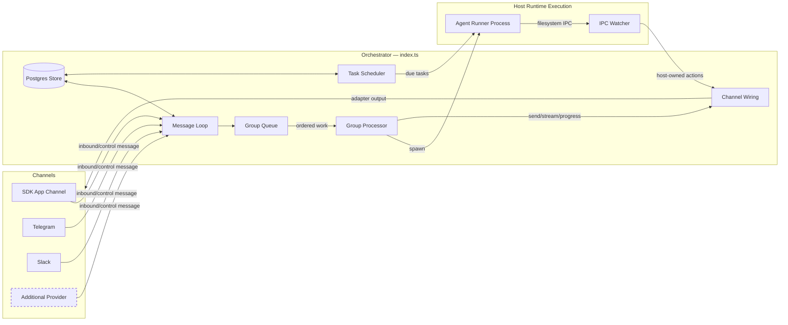

# MyClaw Specification

A personal Claude assistant with multi-channel support, persistent memory per conversation, scheduled jobs, and host-runtime agent execution.

---

## Table of Contents

1. [Architecture](#architecture)
2. [Architecture: Channel System](#architecture-channel-system)
3. [Folder Structure](#folder-structure)
4. [Configuration](#configuration)
5. [Memory System](#memory-system)
6. [Session Management](#session-management)
7. [Message Flow](#message-flow)
8. [Commands](#commands)
9. [Scheduled Jobs](#scheduled-jobs)
10. [MCP Servers](#mcp-servers)
11. [Deployment](#deployment)
12. [Security Considerations](#security-considerations)

---

## Architecture

```
┌──────────────────────────────────────────────────────────────────────┐
│                        HOST (macOS / Linux)                           │
│                     (Main Node.js Process)                            │
├──────────────────────────────────────────────────────────────────────┤
│                                                                       │
│  ┌──────────────────┐                  ┌────────────────────┐        │
│  │ Channels         │─────────────────▶│   Postgres Store  │        │
│  │ (provider        │◀────────────────│   (runtime state) │        │
│  │  registry)       │  store/send      └─────────┬──────────┘        │
│  └──────────────────┘                            │                   │
│                                                   │                   │
│         ┌─────────────────────────────────────────┘                   │
│         │                                                             │
│         ▼                                                             │
│  ┌──────────────────┐    ┌──────────────────┐    ┌───────────────┐   │
│  │  Message Loop    │    │  Scheduler Loop  │    │  IPC Watcher  │   │
│  │  (polls Postgres)│    │  (pg-boss jobs)  │    │  (file-based) │   │
│  └────────┬─────────┘    └────────┬─────────┘    └───────────────┘   │
│           │                       │                                   │
│           └───────────┬───────────┘                                   │
│                       │ spawns host agent process                     │
│                       ▼                                               │
├──────────────────────────────────────────────────────────────────────┤
│                     HOST AGENT RUNTIME                                  │
├──────────────────────────────────────────────────────────────────────┤
│  ┌──────────────────────────────────────────────────────────────┐    │
│  │                    AGENT RUNNER                               │    │
│  │                                                                │    │
│  │  Working directory: /workspace/group (mounted from host)       │    │
│  │  Volume mounts:                                                │    │
│  │    • agents/{name}/ → /workspace/group                         │    │
│  │    • agents/shared/ → /workspace/shared/ (non-main only)       │    │
│  │    • temp CLAUDE_CONFIG_DIR for settings, skills, artifacts     │    │
│  │    • Additional dirs → /workspace/extra/*                      │    │
│  │                                                                │    │
│  │  Default tools (all groups):                                   │    │
│  │    • Read, Glob, Grep, WebSearch, WebFetch                     │    │
│  │    • Task, ToolSearch, Skill, worktree lifecycle               │    │
│  │    • Exact mcp__myclaw__send_message / ask_user_question       │    │
│  │    • Exact capability request tools via MyClaw MCP             │    │
│  │    • Optional tools only after approved next-run binding       │    │
│  │                                                                │    │
│  └──────────────────────────────────────────────────────────────┘    │
│                                                                       │
└───────────────────────────────────────────────────────────────────────┘
```

### Technology Stack

| Component          | Technology                                                        | Purpose                                                        |
| ------------------ | ----------------------------------------------------------------- | -------------------------------------------------------------- |
| Channel System     | Provider registry (`apps/core/src/channels/provider-registry.ts`) | Channels are looked up by provider id and JID prefix           |
| Message Storage    | Postgres with Drizzle                                             | Store messages, jobs, events, memory, and runtime state        |
| Runtime Execution  | Host process execution                                            | Agent execution with runtime-home scoped paths                 |
| Agent              | @anthropic-ai/claude-agent-sdk                                    | Run Claude with tools and MCP servers                          |
| Browser Automation | agent-browser + Chromium                                          | Web interaction and screenshots with explicit CDP port handoff |
| Runtime            | Node.js 25+                                                       | Host process for routing and pg-boss job execution             |

---

## Architecture: Channel System

The runtime supports multi-channel operation via a provider registry. The built-in providers in this codebase are `app`, `slack`, and `telegram`. Providers are registered at startup via `register-builtins.ts`; providers with missing credentials emit a WARN log and are skipped.

### System Diagram



### Channel Registry

The channel system is built on a provider registry in `apps/core/src/channels/provider-registry.ts`. The abbreviated shape below shows the contract; use the source file for helper type definitions and exact imports.

```typescript
export interface ChannelProvider {
  id: string;
  label: string;
  jidPrefix: string;
  folderPrefix: string;
  isGroupJid: (jid: string) => boolean;
  formatting: ChannelFormattingDialect;
  isEnabled: (settings: ChannelProviderSettingsLike) => boolean;
  create: ChannelFactory;
  setup: ChannelProviderSetup;
}

export function registerChannelProvider(provider: ChannelProvider): void;
export function listChannelProviders(): readonly ChannelProvider[];
export function getChannelProvider(id: string): ChannelProvider | undefined;
export function providerForJid(jid: string): ChannelProvider | undefined;
```

Each provider receives `ChannelOpts` through its `create` function and returns either a `ChannelAdapter` instance or `null` if the provider's credentials are not configured.

### Channel Interface

Every channel implements the `ChannelAdapter` contract from `apps/core/src/channels/channel-provider.ts`. It combines required lifecycle, ownership, and message-sink ports with optional streaming, typing, progress, group discovery, interaction, and plan-review ports from `apps/core/src/domain/types.ts`:

```typescript
export type ChannelAdapter = ChannelLifecyclePort &
  ChannelOwnershipPort &
  MessageSink &
  Partial<
    StreamingSink &
      StreamingStateSink &
      TypingSink &
      ProgressSink &
      GroupDiscoverySource &
      InteractionSurface &
      PlanReviewSurface
  >;
```

### Registration Pattern

Providers are registered via `apps/core/src/channels/register-builtins.ts`:

1. Built-in providers (`app`, `slack`, and `telegram`) call `registerChannelProvider(provider)`.
2. Startup wiring iterates `listChannelProviders()`, creates enabled providers, and connects returned channel instances.
3. Routing uses `providerForJid(jid)` to determine ownership and formatting behavior.

### Key Files

| File                                            | Purpose                                                 |
| ----------------------------------------------- | ------------------------------------------------------- |
| `apps/core/src/channels/provider-registry.ts`   | Channel provider registry                               |
| `apps/core/src/channels/register-builtins.ts`   | Built-in provider registration                          |
| `apps/core/src/channels/channel-provider.ts`    | `ChannelAdapter`, `ChannelOpts`, and provider factory   |
| `apps/core/src/domain/types.ts`                 | Channel ports, message types, and group metadata        |
| `apps/core/src/index.ts`                        | Orchestrator — instantiates channels, runs message loop |
| `apps/core/src/app/bootstrap/channel-wiring.ts` | Owns channel output, streaming, progress, and approvals |

### Adding a New Channel

To add a new channel, contribute a bundled or registered skill that:

1. Adds a `apps/core/src/channels/<name>.ts` file implementing the `ChannelAdapter` contract
2. Exposes a `ChannelProvider` entry with `id`, prefixes, setup metadata, and `create`
3. Returns `null` from `create` if credentials are missing
4. Registers the provider via `register-builtins.ts` (or equivalent provider registration module)

Channel-extension skills can follow this pattern when they are added to the bundled package assets or registered skill catalog. Runtime-home Claude skill folders are not the source of truth for runtime materialization.

---

## Folder Structure

```
myclaw/
├── CLAUDE.md                      # Project context for Claude Code
├── docs/
│   ├── SPEC.md                    # This specification document
│   ├── REQUIREMENTS.md            # Architecture decisions
│   └── SECURITY.md                # Security model
├── README.md                      # User documentation
├── package.json                   # Node.js dependencies
├── tsconfig.json                  # TypeScript configuration
├── .mcp.json                      # MCP server configuration (reference)
├── .gitignore
│
├── apps/
│   └── core/
│       ├── src/
│       │   ├── index.ts           # Package/runtime entrypoint
│       │   ├── app/               # Process bootstrap, lifecycle, runtime composition
│       │   ├── channels/          # Channel provider registry and channel implementations
│       │   ├── config/            # Env, settings, credentials, redaction
│       │   ├── control/           # HTTP/SSE SDK control server
│       │   ├── domain/            # Pure domain types and repository contracts
│       │   ├── infrastructure/    # Postgres, pg-boss, IPC, OneCLI, logging, service wrappers
│       │   ├── jobs/              # MyClaw job lifecycle and scheduler ports
│       │   ├── memory/            # Memory ingestion, retrieval, and storage logic
│       │   ├── messaging/         # Routing and formatting
│       │   ├── platform/          # Group folder and sender allowlist helpers
│       │   ├── runtime/           # Host orchestration, queues, agent spawn, permissions
│       │   ├── runner/            # Child runner, Claude Agent SDK, MCP tools
│       │   ├── session/           # Slash commands and transcript archive flow
│       │   └── shared/            # Small dependency-light helpers
│
├── ops/
│   ├── bootstrap.sh              # Local bootstrap script
│   └── launchd/
│       └── com.myclaw.plist      # macOS service configuration
│
├── dist/                          # Compiled JavaScript (gitignored)
│
├── .claude/
│   └── skills/
│       ├── commands/SKILL.md            # /commands - command discovery
│       └── myclaw-admin/SKILL.md        # Internal runtime administration reference
│
├── agents/
│   ├── shared/
│   │   └── CLAUDE.md              # Static shared prompt guidance
│   └── {channel}_{group-name}/    # Per-group folders (created on registration)
│       ├── SOUL.md                # Personality, voice, boundaries
│       ├── CLAUDE.md              # Static group-specific prompt guidance
│       └── logs/                  # Task execution logs
│
├── data/                          # Application state (gitignored)
│   ├── artifacts/                 # Provider artifact backend for single-node deployments
│   ├── env/env                    # Copy of .env for runtime loading
│   └── ipc/                       # Runtime IPC (messages/, tasks/)
│
├── logs/                          # Runtime logs (gitignored)
│   ├── myclaw.log               # Host stdout
│   └── myclaw.error.log         # Host stderr
│   # Note: Per-agent logs are in agents/{folder}/logs/
│
└── ops/launchd/
    └── com.myclaw.plist         # macOS service configuration
```

---

## Configuration

Configuration constants are in `apps/core/src/config/index.ts`:

```typescript
import path from 'path';
import { getMyclawHome } from './myclaw-home.js';
import { ensureRuntimeSettings } from './settings/runtime-settings.js';

export const ASSISTANT_NAME = process.env.ASSISTANT_NAME || 'Andy';
export const POLL_INTERVAL = 2000;

// Paths are absolute and resolve from the configured runtime home.
const MYCLAW_HOME = getMyclawHome(process.env.MYCLAW_HOME);
export const AGENTS_DIR = path.resolve(MYCLAW_HOME, 'agents');
export const DATA_DIR = path.resolve(MYCLAW_HOME, 'data');

// Default model aliases are non-secret configuration in settings.yaml.
export const getConfiguredDefaultModel = () =>
  ensureRuntimeSettings(MYCLAW_HOME).agent.defaultModel;
export const IPC_POLL_INTERVAL = 1000;
export const IDLE_TIMEOUT = parseInt(process.env.IDLE_TIMEOUT || '1800000', 10); // 30min — keep runtime worker alive after last result

export const TRIGGER_PATTERN = new RegExp(`^@${ASSISTANT_NAME}\\b`, 'i');
```

**Note:** Paths must be absolute for runtime path validation and scoped mounts.

### Agent Config

Groups can have additional directories exposed to the agent workspace through the registered group agent config. Example registration:

```typescript
setRegisteredGroup('telegram:dev-team', {
  name: 'Dev Team',
  folder: 'telegram_dev-team',
  trigger: '@Andy',
  added_at: new Date().toISOString(),
  agentConfig: {
    model: 'opus',
    additionalMounts: [
      {
        hostPath: '~/projects/webapp',
        readonly: false,
      },
    ],
    timeout: 600000,
  },
});
```

Folder names follow the convention `{channel}_{group-name}` (e.g., `slack_engineering`, `telegram_dev-team`). The main group has `isMain: true` set during registration.

Additional mounts appear under `/workspace/extra/` in the runtime workspace.

Interactive model precedence is:

1. `group.agentConfig.model`
2. `agent.default_model` in `settings.yaml`
3. system default `opus`

Job model precedence is:

1. explicit job `modelAlias` or `modelProfileId`
2. `agent.one_time_job_default_model` or `agent.recurring_job_default_model`
3. `agent.default_model`
4. system default `opus`

Use `/model` in a group session to switch the live model (`/model`, `/model <alias>`, `/model default`). Use `/models` to list supported aliases and `/status` to inspect the current model, context window, token usage, cache read/write tokens, cache state, and cost when the provider reports it.

### Claude Authentication

MyClaw uses an agent credential broker boundary for agent and memory LLM
credentials. `credential_broker.mode` in `settings.yaml` supports `onecli`,
`external`, and `none`.
OneCLI is the default local/personal broker adapter, but enterprise deployments
can replace it with an external broker without changing the runtime agent-spawn
path. Runtime-owned secrets such as `MYCLAW_DATABASE_URL`, channel tokens,
webhook/control secrets, and OneCLI persistence secrets are read through runtime
secret configuration, not requested from the agent credential broker.

Runtime `.env` is for runtime-owned secrets only. In `onecli` mode it stores
`ONECLI_DATABASE_URL` and a generated base64-encoded 32-byte
`SECRET_ENCRYPTION_KEY`, but not the OneCLI URL, credential mode, default model,
or raw Claude credentials. Non-secret broker and model configuration lives in
`settings.yaml`, for example `credential_broker.onecli.url`,
`agent.default_model`, or
`credential_broker.external.base_url`. MyClaw and OneCLI can share one Postgres
database with separate schemas and roles: `myclaw`, `onecli`, and `pgboss`.
OneCLI owns its schema and migrations; MyClaw only provisions and verifies the
schema boundary. `MYCLAW_DATABASE_URL` and `ONECLI_DATABASE_URL` must use
different Postgres users.

The runner receives only broker-safe model endpoint settings from the selected
broker. Raw provider tokens and runtime-owned database URLs are not forwarded to
tools, the child runner, or the Agent SDK environment. Runner-wide proxy
environment variables are not accepted from OneCLI because they affect Bash,
hooks, MCP stdio servers, skills, monitors, and other tools. Provider access is
projected through explicit model endpoint settings such as `ANTHROPIC_BASE_URL`
and adapter-materialized CA certificate references.
If `.env` or process env contains raw agent credentials such as
`ANTHROPIC_API_KEY`, `OPENAI_API_KEY`, or `CLAUDE_CODE_OAUTH_TOKEN`,
doctor/preflight reports a wrong-lane configuration error.

### Changing the Assistant Name

Set the `ASSISTANT_NAME` environment variable:

```bash
ASSISTANT_NAME=Bot npm start
```

Or edit the default in `apps/core/src/config/index.ts`. This changes:

- The trigger pattern (messages must start with `@YourName`)
- The response prefix (`YourName:` added automatically)

### Placeholder Values in launchd

Files with `{{PLACEHOLDER}}` values need to be configured:

- `{{RUNTIME_ENTRY}}` - Absolute path to the compiled MyClaw runtime entry
- `{{RUNTIME_HOME}}` - Runtime home, normally `~/myclaw`
- `{{NODE_PATH}}` - Path to node binary (detected via `which node`)
- `{{HOME}}` - User's home directory

---

## Memory System

MyClaw separates static prompt profile files from structured memory and runtime continuity context.

### Prompt Profile Layer

Prompt profile files are static guidance, not memory dumps:

| Layer              | Location                   | Purpose                                                         |
| ------------------ | -------------------------- | --------------------------------------------------------------- |
| **Shared context** | `agents/shared/CLAUDE.md`  | Stable operating rules, memory rules, communication conventions |
| **Soul**           | `agents/{group}/SOUL.md`   | Agent personality, voice, and boundaries                        |
| **Group context**  | `agents/{group}/CLAUDE.md` | Stable group-specific guidance                                  |

Dynamic facts, open loops, and raw transcripts must not be written into these
files. Durable facts go through structured memory. Active task state stays in
the live SDK streaming session while the runner is alive.

### Continuity Context

Continuity is the runtime behavior that helps the agent resume current work:

- live SDK streaming context for active chat turns
- current relevant durable memory
- prior decisions
- user/group preferences
- open loops when commitment tracking is enabled

Before a fresh agent run, the host builds a memory-only context block and passes
it to the agent runner. Follow-up chat messages are then piped into the same
live SDK stream until `/new`, stop, shutdown, or idle expiry. Postgres messages,
run summaries, and session summaries are not replayed into every prompt.

See [CONTINUITY.md](CONTINUITY.md) for the continuity model.

### Structured Memory Store

The structured memory store provides boundary-aware recall for durable
statements, learned procedures, evidence, recall signals, and auditable dreaming
decisions. It stores app-grade memory in Postgres.

#### Storage Backend

| Component           | Technology                          | Purpose                                                             |
| ------------------- | ----------------------------------- | ------------------------------------------------------------------- |
| **Subjects**        | Postgres (`memory_subjects`)        | App/agent/user/group/channel/thread boundary registry               |
| **Evidence**        | Postgres (`memory_evidence`)        | Grounding from sessions, messages, tools, manual saves, and sources |
| **Candidates**      | Postgres (`memory_candidates`)      | Extracted facts awaiting promotion or review                        |
| **Memory items**    | Postgres (`memory_items`)           | Durable statements with confidence, versioning, and evidence links  |
| **Recall events**   | Postgres (`memory_recall_events`)   | Search/usefulness signals for future dreaming                       |
| **Dream runs**      | Postgres (`memory_dream_runs`)      | Dreaming lifecycle runs per boundary                                |
| **Dream decisions** | Postgres (`memory_dream_decisions`) | Auditable promotion, merge, rewrite, decay, retire, or review rows  |
| **Lexical search**  | Postgres full-text search           | Keyword search and filtering                                        |
| **Vector search**   | `pgvector`                          | Optional semantic similarity search when embeddings are enabled     |

#### MCP Tools (Exposed to Agents)

Agents interact with memory via MCP tools over IPC:

| Tool              | Purpose                                                                            |
| ----------------- | ---------------------------------------------------------------------------------- |
| `memory_save`     | Save a durable fact, decision, preference, correction, constraint, or context item |
| `memory_search`   | Search scoped memory statements and source snippets                                |
| `memory_patch`    | Update an existing item (optimistic concurrency via version)                       |
| `procedure_save`  | Save a reusable multi-step procedure                                               |
| `procedure_patch` | Update an existing procedure                                                       |

#### Memory Boundaries

Every memory record belongs to an `appId` and `agentId`. One subject determines
the primary visibility boundary:

| Subject   | Meaning                                                             |
| --------- | ------------------------------------------------------------------- |
| `user`    | Human actor preferences, corrections, or durable facts              |
| `group`   | Logical MyClaw/app group or configured agent group                  |
| `channel` | External provider conversation where the bot is present             |
| `common`  | App-wide shared memory, write-restricted to admin/service workflows |

Provider ids are stored without changing the boundary meaning:

- `channelId` is the provider conversation id: Telegram private/group/supergroup
  chat, Slack channel/DM/MPIM, Microsoft Teams channel/chat, or SDK
  conversation.
- `groupId` is the configured MyClaw/app group, not a Telegram-only group id.
- `threadId` is a topic or reply boundary such as Slack `thread_ts`, Telegram
  forum topic id, or Teams reply chain id.

#### Search Architecture (Hybrid Retrieval)

Search combines lexical recall with optional semantic recall using Reciprocal Rank Fusion (K=60):

1. **Lexical**: Postgres full-text rank.
2. **Vector (Semantic)**: `pgvector` cosine similarity when embeddings are enabled.
3. **Fusion**: RRF merges both ranked lists. For each result at rank i: `score += 1 / (K + i + 1)`. Top-K returned.

#### Source Ingestion

Markdown/file ingestion is an explicit knowledge-source feature. It is not the
primary memory store. Runtime memories are captured as grounded evidence,
candidates, durable items, recall events, and dream decisions in Postgres.

#### Reflection (Auto-Capture)

At session boundaries, the system extracts durable memory statements from the
conversation. `/new` uses a `session-end` trigger, while manual `/compact` and
observed SDK auto-compaction boundaries use a `precompact` trigger:

- Uses a provider interface; the default extractor is rule-based and can be replaced without changing storage or recall.
- Detects preferences, decisions, facts, corrections, and constraints.
- Stores real human-readable statements with reflection-derived confidence scores.
- Filters sensitive material (API keys, tokens, passwords)
- Rejects prompt-injection style text before it becomes future context
- Controlled by memory extractor settings and the app-grade memory service.

### Memory Storage

MyClaw memory uses Postgres tables in the configured runtime schema.

- Runtime database: `MYCLAW_DATABASE_URL`
- Runtime schema: `storage.postgres.schema` (default `myclaw`)
- Vector search: `pgvector` when embeddings are enabled
- Lexical search: Postgres full-text search

Provider transcript export artifacts may be stored through
`ProviderArtifactStore` for explicit debugging/export workflows; they are not
the memory store, canonical message history, or runtime continuation state.

### Memory Configuration Reference

| Setting                                     | Default                  | Description                                                 |
| ------------------------------------------- | ------------------------ | ----------------------------------------------------------- |
| `storage.postgres.url_env`                  | `MYCLAW_DATABASE_URL`    | Env key for Postgres connection URL                         |
| `storage.postgres.schema`                   | `myclaw`                 | Postgres schema name                                        |
| `agent.default_model`                       | empty                    | Default Claude Code model alias/name                        |
| `agent.one_time_job_default_model`          | empty                    | One-time/manual job model alias; inherits `agent.default_model` |
| `agent.recurring_job_default_model`         | empty                    | Cron/interval job model alias; inherits `agent.default_model` |
| `credential_broker.mode`                    | `onecli`                 | Agent credential broker mode (`onecli`, `external`, `none`) |
| `credential_broker.onecli.url`              | `http://localhost:10254` | OneCLI gateway URL                                          |
| `credential_broker.onecli.postgres.url_env` | `ONECLI_DATABASE_URL`    | Env key for the OneCLI Postgres URL with `schema=onecli`    |
| `credential_broker.onecli.postgres.schema`  | `onecli`                 | OneCLI-owned Postgres schema                                |
| `credential_broker.external.base_url`       | empty                    | External broker-safe endpoint URL for `external` mode       |
| `memory.enabled`                            | `true`                   | Enables durable memory                                      |
| `memory.embeddings.enabled`                 | `false`                  | Optional embedding toggle                                   |
| `memory.embeddings.provider`                | `disabled`               | Embedding provider (`disabled` or `openai`)                 |
| `memory.embeddings.model`                   | `text-embedding-3-large` | Embedding model                                             |
| `MEMORY_EMBED_BATCH_SIZE`                   | `16`                     | Texts per embedding API call                                |
| `MEMORY_EXTRACTOR_MAX_FACTS`                | `8`                      | Max candidate facts extracted per evidence batch            |
| `MEMORY_EXTRACTOR_MIN_CONFIDENCE`           | `0.6`                    | Min confidence for extracted candidates                     |
| `MEMORY_DREAMING_CRON`                      | `17 3 * * *`             | Dreaming maintenance schedule                               |
| `MEMORY_MAINTENANCE_MAX_PENDING`            | `100`                    | Max pending memory maintenance items per pass               |

---

## Session Management

Sessions enable conversation continuity from MyClaw-owned Postgres state.

### How Sessions Work

1. Each app/agent/conversation/thread scope resolves to a canonical
   `AgentSession` in Postgres.
2. Runtime hydrates only scoped durable memory for a fresh runner or scheduled
   job.
3. Claude Agent SDK runs are ephemeral with `persistSession: false`; MyClaw does
   not pass SDK `resume`, `resumeSessionAt`, or `continue` handles.
4. Active chat follow-ups are streamed into the same live SDK query. Provider
   transcript exports may exist for debugging, but they are not runtime state.

---

## Message Flow

### Incoming Message Flow

```
1. User sends a message via any connected channel
   │
   ▼
2. Channel adapter or SDK control server receives the message
   │
   ▼
3. Runtime stores chat metadata and the message in Postgres
   │
   ▼
4. Message loop polls Postgres or recovers pending messages after restart
   │
   ▼
5. Message loop checks:
   ├── Is chat_jid in registered groups? -> No: ignore
   ├── Is sender allowed to interact? -> No: drop or store only
   └── Does message match trigger/session command policy? -> No: store but don't process
   │
   ▼
6. GroupQueue enqueues ordered work for the group/thread
   │
   ▼
7. Group processor catches up conversation:
   ├── Fetch all messages since last agent interaction
   ├── Format with timestamp and sender name
   ├── Add job metadata when present
   └── Build prompt with durable memory context only
   │
   ▼
8. Agent spawn starts the child runner:
   ├── cwd: agents/{group-name}/
   ├── prompt: conversation history + current message
   ├── persistSession: false
   └── mcpServers: myclaw (runtime tools over IPC)
   │
   ▼
9. Child runner invokes Claude Agent SDK:
   ├── Uses injected prompt profile and durable memory context
   ├── Uses MessageStream for safe follow-up input
   └── Requests host permission for policy-gated tools
   │
   ▼
10. Group processor forwards streaming/progress/final output through channel wiring
   │
   ▼
11. Slack/Telegram send network responses; the app channel writes durable control events
   │
   ▼
12. Runtime advances cursor and stores MyClaw-owned run/session events in Postgres
```

### Trigger Word Matching

Messages must start with the trigger pattern (default: `@Andy`):

- `@Andy what's the weather?` → ✅ Triggers Claude
- `@andy help me` → ✅ Triggers (case insensitive)
- `Hey @Andy` → ❌ Ignored (trigger not at start)
- `What's up?` → ❌ Ignored (no trigger)

### Conversation Catch-Up

When a triggered message arrives, the agent receives all messages since its last interaction in that chat. Each message is formatted with timestamp and sender name:

```
[Jan 31 2:32 PM] John: hey everyone, should we do pizza tonight?
[Jan 31 2:33 PM] Sarah: sounds good to me
[Jan 31 2:35 PM] John: @Andy what toppings do you recommend?
```

This allows the agent to understand the conversation context even if it wasn't mentioned in every message.

---

## Commands

### Commands Available in Any Group

| Command                | Example                     | Effect         |
| ---------------------- | --------------------------- | -------------- |
| `@Assistant [message]` | `@Andy what's the weather?` | Talk to Claude |

### Commands Available in Main Channel Only

| Command                          | Example                             | Effect                 |
| -------------------------------- | ----------------------------------- | ---------------------- |
| `@Assistant add group "Name"`    | `@Andy add group "Family Chat"`     | Register a new group   |
| `@Assistant remove group "Name"` | `@Andy remove group "Work Team"`    | Unregister a group     |
| `@Assistant list groups`         | `@Andy list groups`                 | Show registered groups |
| `@Assistant remember [fact]`     | `@Andy remember I prefer dark mode` | Add to global memory   |

---

## Scheduled Jobs

MyClaw has a built-in scheduler that runs jobs as full agents in their group's context.

### How Scheduling Works

1. **Group Context**: Jobs created in a group run with that group's working directory and memory
2. **Full Agent Capabilities**: Scheduled jobs have access to all tools (WebSearch, file operations, etc.)
3. **Optional Messaging**: Jobs can send messages to their group using the `send_message` tool, or complete silently
4. **Main Channel Privileges**: The main channel can schedule jobs for any group and view all jobs

### Schedule Types

| Type       | Value Format    | Example                      |
| ---------- | --------------- | ---------------------------- |
| `cron`     | Cron expression | `0 9 * * 1` (Mondays at 9am) |
| `interval` | Milliseconds    | `3600000` (every hour)       |
| `once`     | ISO timestamp   | `2024-12-25T09:00:00Z`       |

### Creating a Job

```
User: @Andy remind me every Monday at 9am to review the weekly metrics

Claude: [calls mcp__myclaw__scheduler_upsert_job]
        {
          "name": "weekly-metrics-reminder",
          "prompt": "Send a reminder to review weekly metrics. Be encouraging!",
          "schedule_type": "cron",
          "schedule_value": "0 9 * * 1",
          "linked_sessions": ["<current_chat_jid>"]
        }

Claude: Done! I'll remind you every Monday at 9am.
```

### One-Time Jobs

```
User: @Andy at 5pm today, send me a summary of today's emails

Claude: [calls mcp__myclaw__scheduler_upsert_job]
        {
          "name": "today-email-summary",
          "prompt": "Search for today's emails, summarize the important ones, and send the summary to the group.",
          "schedule_type": "once",
          "schedule_value": "2024-01-31T17:00:00Z",
          "linked_sessions": ["<current_chat_jid>"]
        }
```

### Managing Jobs

From any group:

- `@Andy list my scheduled jobs` - View jobs for this group
- `@Andy pause job [id]` - Pause a job
- `@Andy resume job [id]` - Resume a paused job
- `@Andy delete job [id]` - Delete a job

From main channel:

- `@Andy list all jobs` - View jobs from all groups
- `@Andy schedule job for "Family Chat": [prompt]` - Schedule for another group

---

## MCP Servers

### MyClaw MCP (built-in)

The `myclaw` MCP server is created dynamically per agent call with the current group's context.

**Available Tools:**
| Tool | Purpose |
|------|---------|
| `scheduler_upsert_job` | Create or update a scheduler job |
| `scheduler_get_job` | Get job details |
| `scheduler_list_jobs` | List jobs |
| `scheduler_update_job` | Modify job prompt/schedule/policy |
| `scheduler_delete_job` | Delete a job |
| `scheduler_pause_job` | Pause a job |
| `scheduler_resume_job` | Resume a paused job |
| `scheduler_trigger_job` | Trigger immediate job run |
| `scheduler_list_runs` | List job run history |
| `scheduler_get_dead_letter` | List dead-lettered runs |
| `send_message` | Send a message to the group via its channel |

---

## Deployment

MyClaw runs as one local runtime service. The installer chooses launchd on
macOS, systemd user units on Linux when available, and a nohup/background
fallback otherwise. Managed local services are started before the runtime when
they are configured.

### Startup Sequence

When MyClaw starts, it:

1. Runs runtime preflight for host execution and emits actionable fix steps on failure
2. Auto-builds runner artifacts from `apps/core/src/runner` and fails startup if build fails
3. Initializes Postgres runtime storage
4. Loads state from runtime storage (registered groups, sessions, runtime cursor state)
5. **Connects channels** — loops through registered channels, instantiates those with credentials, calls `connect()` on each
6. Once at least one channel is connected:
   - Starts the scheduler loop
   - Starts the IPC watcher for runtime messages
   - Sets up the per-group queue with `processGroupMessages`
   - Recovers any unprocessed messages from before shutdown
   - Starts the message polling loop

### Service Lifecycle

The generated service sets `MYCLAW_HOME`, uses the resolved Node runtime entry,
and runs the local dependency prestart command before the main runtime:

```bash
myclaw start
myclaw
```

On macOS this is written into `com.myclaw.plist` through a shell command. On
Linux systemd it is represented as `ExecStartPre`. The fallback script performs
the same prestart step before launching the runtime.

The Control API starts inside this same runtime process. Runtime control
settings such as `MYCLAW_CONTROL_API_KEY`, `MYCLAW_CONTROL_API_KEYS_JSON`,
`MYCLAW_CONTROL_APP_ID`, `MYCLAW_CONTROL_PORT`, and
`MYCLAW_CONTROL_SOCKET_PATH` are read from process env or `~/myclaw/.env`. The
launchd plist should not contain control API secrets; it only needs enough
environment to find the runtime home and executable path.

**launchd shape:**

```xml
<?xml version="1.0" encoding="UTF-8"?>
<!DOCTYPE plist PUBLIC "-//Apple//DTD PLIST 1.0//EN" "...">
<plist version="1.0">
<dict>
    <key>Label</key>
    <string>com.myclaw</string>
    <key>ProgramArguments</key>
    <array>
        <string>/bin/sh</string>
        <string>-lc</string>
        <string>{{NODE_PATH}} {{RUNTIME_ENTRY}}</string>
    </array>
    <key>WorkingDirectory</key>
    <string>{{RUNTIME_HOME}}</string>
    <key>RunAtLoad</key>
    <true/>
    <key>KeepAlive</key>
    <true/>
    <key>EnvironmentVariables</key>
    <dict>
        <key>MYCLAW_HOME</key>
        <string>{{RUNTIME_HOME}}</string>
        <key>PATH</key>
        <string>{{HOME}}/.local/bin:/usr/local/bin:/usr/bin:/bin</string>
        <key>HOME</key>
        <string>{{HOME}}</string>
    </dict>
    <key>StandardOutPath</key>
    <string>{{RUNTIME_HOME}}/logs/myclaw.log</string>
    <key>StandardErrorPath</key>
    <string>{{RUNTIME_HOME}}/logs/myclaw.error.log</string>
</dict>
</plist>
```

### Managing the Service

```bash
# Start, stop, or restart the whole local runtime stack
myclaw start
myclaw stop
myclaw restart

# Install the background service
myclaw service install

# Check status
myclaw status

# View logs
myclaw logs

# Manage local Postgres + Model Access together
myclaw local status
docker compose logs --tail 160
```

---

## Security Considerations

### Runtime Isolation

Host runtime execution is the only supported runtime path today.
Security boundaries are enforced through per-group directory scope, runtime-home controls, authorization checks, and explicit operational hardening.

### Prompt Injection Risk

Inbound channel and SDK messages could contain malicious instructions attempting to manipulate Claude's behavior.

**Mitigations:**

- Only registered groups are processed
- Trigger word required (reduces accidental processing)
- Agents can only access their group's mounted directories
- Main can configure additional directories per group
- Claude's built-in safety training

**Recommendations:**

- Only register trusted groups
- Review additional directory mounts carefully
- Review scheduled jobs periodically
- Monitor logs for unusual activity

### Credential Storage

| Credential      | Storage Location              | Notes                                                |
| --------------- | ----------------------------- | ---------------------------------------------------- |
| Claude CLI Auth | Runtime credential adapter    | Shared config is copied into per-run temp dirs       |
| Channel secrets | Runtime environment or OneCLI | Loaded by provider setup and never exposed to agents |

### File Permissions

The runtime agents and data directories contain personal context and should be protected:

```bash
chmod 700 ~/myclaw/agents ~/myclaw/data
```

---

## Troubleshooting

### Common Issues

| Issue                              | Cause                             | Solution                                                          |
| ---------------------------------- | --------------------------------- | ----------------------------------------------------------------- |
| No response to messages            | Service not running               | Run `myclaw status` and check the service line                    |
| Startup fails at runtime preflight | Host runtime prerequisites failed | Run `npm run build` and re-check runtime diagnostics              |
| Session not continuing             | Session state not persisted       | Run `myclaw status` and verify Postgres runtime storage readiness |
| "No groups registered"             | Haven't added groups              | Register a channel group with the current channel setup flow      |

### Log Location

- `logs/myclaw.log` - stdout
- `logs/myclaw.error.log` - stderr

### Debug Mode

Run manually for verbose output:

```bash
npm run dev
npm start
```
