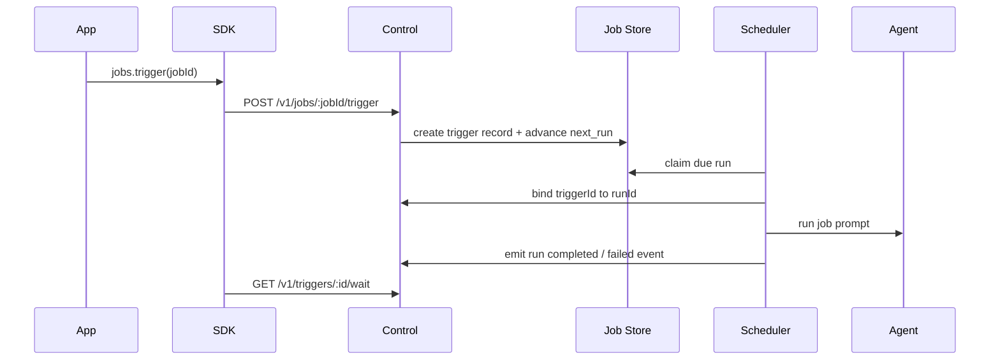
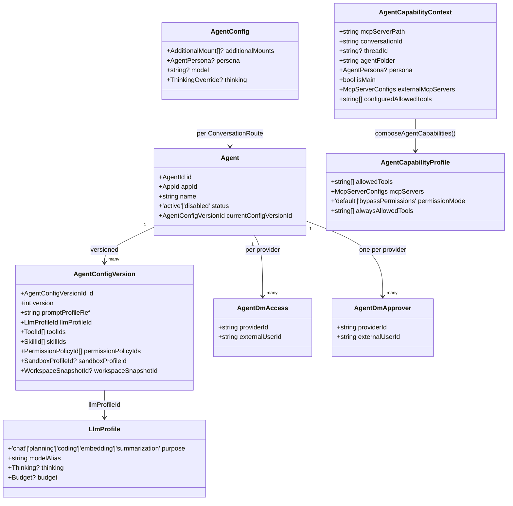

# Agent Runtime And SDK Control Plane

This document explains what the agent does and what the surrounding runtime does when an app uses `@myclaw/sdk`.

## Boundary

The agent is not the control plane.

The runtime owns:

- session lookup
- message persistence
- queueing
- scheduler/job claiming
- webhook delivery
- event storage
- auth and scopes

The agent owns:

- interpreting the prompt
- producing replies
- using runtime-exposed tools
- emitting structured output through normal runtime channels

ACP/ACPS are harness/runtime integration concerns. They are not part of the agent contract.

## Message lifecycle

1. A backend app calls `sessions.ensure()`.
2. The control server maps `(appId, conversationId)` to an `app:` JID and runtime group folder.
3. The app calls `sessions.sendMessage()`.
4. The runtime stores the inbound message in Postgres.
5. The runtime enqueues the group for normal processing.
6. The agent runs through the existing host-managed execution path.
7. Outbound replies are sent through the `app` channel adapter.
8. The adapter writes durable `control_events`.
9. Those events are visible through:
   - `sessions.wait()`
   - `sessions.stream()`
   - webhook delivery

## Job lifecycle

## Why the `app` channel exists

The `app` channel keeps app-originated conversations on the same runtime path as Slack and Telegram:

- same queue semantics
- same session model
- same agent runner
- same output delivery behavior

That avoids a second agent-output path with different behavior.

## Agent Composition

An agent is composed at spawn time, not stored as a single record. The runtime
brings together the persisted `Agent`, its current `AgentConfigVersion`, the
`LlmProfile`, the per-group `AgentConfig` (which carries persona and optional
model override), and the five built-in capability providers.

Sources:

- `Agent`, `AgentConfigVersion`, `LlmProfile`, `AgentDmAccess`,
  `AgentDmApprover` — `apps/core/src/domain/agent/agent.ts:41` through
  `apps/core/src/domain/agent/agent.ts:88`.
- `AgentConfig` (carrying `persona`, model override, additional mounts) —
  `apps/core/src/domain/types.ts:39`.
- `AgentPersona` enum and resolver —
  `apps/core/src/shared/agent-persona.ts:1`.
- `AgentCapabilityContext`, `AgentCapabilityProfile`, and the five built-in
  providers (`sdk-tools`, `permissions`, `myclaw-mcp`, `configured-tools`,
  `configured-mcp`) plus `composeAgentCapabilities` —
  `apps/core/src/runner/agent-capabilities.ts:7`,
  `apps/core/src/runner/agent-capabilities.ts:131`,
  `apps/core/src/runner/agent-capabilities.ts:249`.
- Persona compiled into the system prompt —
  `apps/core/src/runtime/prompt-profile.ts:111` and
  `apps/core/src/runtime/agent-spawn.ts:141`.
- Skill materialisation into the run env —
  `apps/core/src/adapters/llm/anthropic-claude-agent/claude-skill-materializer.ts:1`,
  imported by `apps/core/src/runtime/agent-spawn.ts:39`.

### Subagents

Native Anthropic-SDK subagents inherit the parent run by default. MyClaw
projects which `subagent_type` names are allowed for the current agent and
rejects cross-provider models, custom `tools`/`mcpServers`/`skills` input on
the Agent tool call, and unknown subagent types. See
`subagentTypeFromAgentInput`, `validateAgentModelRequest`, and
`validateAgentToolInput` at
`apps/core/src/runner/claude/agent-model-selection.ts:39`,
`apps/core/src/runner/claude/agent-model-selection.ts:45`, and
`apps/core/src/runner/claude/agent-model-selection.ts:71`. The rejection
message points the agent at a configured subagent definition for any input
that exceeds the native Agent override surface.

## Provider And Conversation Onboarding Control Surface

The control API exposes provider and conversation onboarding through
application-layer services:

- provider catalog and provider connection records
- provider discovery into canonical `Conversation` records
- `AgentConversationBinding` enable/update/disable for a conversation
- conversation, thread, and message reads for Web UI and SDK clients

Installation payloads store non-secret provider config and runtime secret
references only. Raw provider tokens stay behind `RuntimeSecretProvider`.
Disabling a binding marks it `disabled` so UI and CLI clients can re-enable it
without losing the binding policy, trigger, memory, or permission settings.
