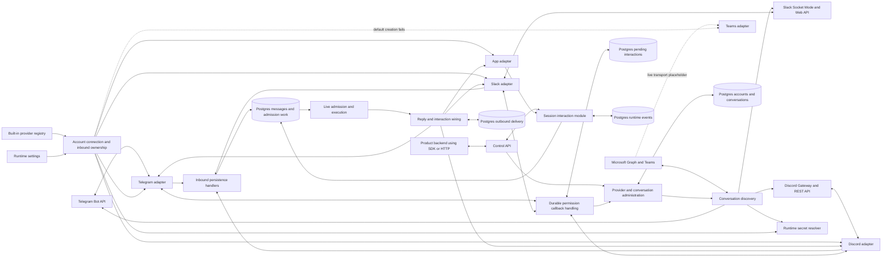
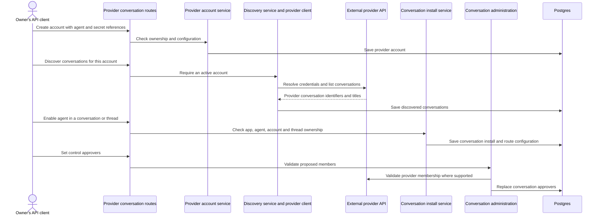
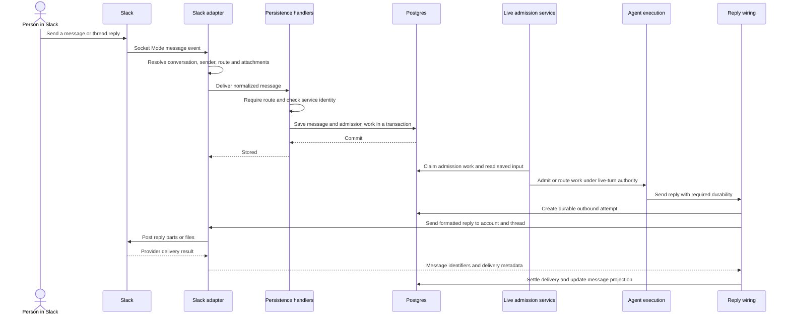

# Channel and provider adapters

## 1. What this area does

This area lets people talk to Gantry through Telegram, Slack and Discord, translating each service's messages into a common conversation format. It connects each provider account to the right agent and conversation or thread, then translates replies, progress updates and interactive cards back into that service's format. It also helps an owner discover conversations, install an agent and choose who can decide permission requests. Backend applications use a separate App adapter that publishes session events for the SDK and control API. Teams has setup and discovery support, but its default live transport is still a placeholder. A message describes work to attempt; selected capabilities and host policy determine what the agent may do.

Sources: `apps/core/src/channels/register-builtins.ts`, `apps/core/src/channels/channel-provider.ts`, `apps/core/src/channels/app.ts`, `apps/core/src/channels/teams/sdk-client.ts`, `apps/core/src/application/provider-conversations/provider-conversation-control-use-cases.ts`, `apps/core/src/application/provider-conversations/conversation-administration-service.ts`, `apps/core/src/app/bootstrap/runtime-services.ts`.

## 2. Architecture diagram

Arrows show calls or data movement, not separate containers. The Teams adapter's dashed connection is a boundary with an injectable client, not a working default live connection. The App adapter emits events; App input enters through the session API. Sources for every node follow the diagram.



| Diagram node                                   | Current code anchor                                                                                                                                                                                                                                                   |
| ---------------------------------------------- | --------------------------------------------------------------------------------------------------------------------------------------------------------------------------------------------------------------------------------------------------------------------- |
| Telegram Bot API; Telegram adapter             | `apps/core/src/channels/telegram/bot-setup.ts`, `apps/core/src/channels/telegram/channel-adapter.ts`, `apps/core/src/channels/telegram/channel-connect.ts`, `apps/core/src/channels/telegram/channel-delivery.ts`                                                     |
| Slack Socket Mode and Web API; Slack adapter   | `apps/core/src/channels/slack/channel-connect.ts`, `apps/core/src/channels/slack/channel-adapter.ts`, `apps/core/src/channels/slack/channel-delivery.ts`                                                                                                              |
| Discord Gateway and REST API; Discord adapter  | `apps/core/src/channels/discord/gateway.ts`, `apps/core/src/channels/discord/index.ts`, `apps/core/src/channels/discord/http-helpers.ts`                                                                                                                              |
| Microsoft Graph and Teams; Teams adapter       | `apps/core/src/channels/teams/setup-discovery.ts`, `apps/core/src/channels/teams/index.ts`, `apps/core/src/channels/teams/factory.ts`, `apps/core/src/channels/teams/sdk-client.ts`                                                                                   |
| Product backend using SDK or HTTP; Control API | `packages/sdk/src/index.ts`, `apps/core/src/control/server/routes/provider-conversation-routes.ts`, `apps/core/src/control/server/routes/sessions.ts`                                                                                                                 |
| Provider and conversation administration       | `apps/core/src/application/provider-conversations/provider-conversation-control-use-cases.ts`, `apps/core/src/application/provider-conversations/conversation-administration-service.ts`                                                                              |
| Conversation discovery                         | `apps/core/src/channels/control-provider-catalog.ts` delegates to `apps/core/src/cli/slack-chat-discovery.ts`, `apps/core/src/cli/telegram-chat-discovery.ts`, `apps/core/src/channels/discord/setup-discovery.ts`, `apps/core/src/channels/teams/setup-discovery.ts` |
| Postgres accounts and conversations            | `apps/core/src/adapters/storage/postgres/schema/providers.ts`, `apps/core/src/adapters/storage/postgres/schema/conversations.ts`                                                                                                                                      |
| Runtime secret resolver                        | `apps/core/src/channels/provider-runtime-secrets.ts`, `apps/core/src/domain/ports/runtime-secret-provider.ts`; discovery uses the resolver supplied in `apps/core/src/control/server/routes/provider-conversation-routes.ts`                                          |
| Built-in provider registry                     | `apps/core/src/channels/register-builtins.ts`, `apps/core/src/channels/provider-registry.ts`                                                                                                                                                                          |
| Runtime settings                               | `apps/core/src/config/settings/runtime-settings.ts`, `apps/core/src/app/bootstrap/fleet-boot.ts`                                                                                                                                                                      |
| Account connection and inbound ownership       | `apps/core/src/channels/provider-account-channel-connect.ts`, `apps/core/src/adapters/storage/postgres/runtime-store.ts`                                                                                                                                              |
| Inbound persistence handlers                   | `apps/core/src/app/bootstrap/channel-persistence-handlers.ts`                                                                                                                                                                                                         |
| Postgres messages and admission work           | `apps/core/src/adapters/storage/postgres/repositories/canonical-message-repository.postgres.ts`, `apps/core/src/adapters/storage/postgres/schema/messages.ts`, `apps/core/src/adapters/storage/postgres/schema/live-turns.ts`                                         |
| Live admission and execution                   | `apps/core/src/runtime/live-admission-work-loop.ts`, `apps/core/src/runtime/message-loop.ts`, `apps/core/src/app/bootstrap/live-execution.ts`                                                                                                                         |
| Reply and interaction wiring                   | `apps/core/src/app/bootstrap/channel-wiring.ts`, `apps/core/src/app/bootstrap/runtime-services.ts`                                                                                                                                                                    |
| App adapter; Session interaction module        | `apps/core/src/channels/app.ts`, `apps/core/src/application/sessions/session-interaction-module.ts`                                                                                                                                                                   |
| Durable permission callback handling           | `apps/core/src/application/interactions/pending-interaction-durability.ts`, `apps/core/src/channels/telegram/permission-callback.ts`, `apps/core/src/channels/slack/channel-interactions.ts`, `apps/core/src/channels/discord/permission-callback.ts`                 |
| Postgres pending interactions                  | `apps/core/src/adapters/storage/postgres/schema/worker-coordination.ts`                                                                                                                                                                                               |
| Postgres runtime events                        | `apps/core/src/application/runtime-events/runtime-event-exchange.ts`, `apps/core/src/adapters/storage/postgres/repositories/runtime-event-repository.postgres.ts`, `apps/core/src/adapters/storage/postgres/schema/events.ts`                                         |

The shared adapter contract requires lifecycle, destination ownership and message sending. Streaming, typing, reactions, progress, questions, rich cards, history hydration and other surfaces are optional; wiring checks whether a particular adapter supplies them. Provider-specific formatting and destination prefixes live in the registry, while account selection and reply dispatch live in channel wiring. Sources: `apps/core/src/channels/channel-provider.ts`, `apps/core/src/channels/register-builtins.ts`, `apps/core/src/app/bootstrap/channel-capability-ports.ts`, `apps/core/src/app/bootstrap/channel-wiring-route-provider-account.ts`.

The Postgres outbound delivery node is implemented by `apps/core/src/adapters/storage/postgres/schema/outbound-delivery.ts`, `apps/core/src/app/bootstrap/runtime-services.ts` and `apps/core/src/app/bootstrap/runtime-services-durable-outbound-attempt.ts`.

## 3. Key flows

### Discover and install a conversation



1. The routes authorize the caller and assemble app-scoped services. Creating an account checks the owning agent, rejects raw secrets in configuration and accepts only supported canonical runtime secret references. The database receives references rather than provider tokens. Sources: `apps/core/src/control/server/routes/provider-conversation-routes.ts`, `apps/core/src/application/provider-conversations/provider-conversation-control-use-cases.ts`.
2. Discovery requires an active account belonging to the caller's app. The provider client resolves its credentials, calls Slack, Telegram, Discord or Graph, and filters the result. App discovery returns an empty list. Sources: `apps/core/src/channels/control-provider-catalog.ts`, `apps/core/src/application/provider-conversations/provider-conversation-control-use-cases.ts`.
3. The discovery service checks provider prefixes, looks up conversations within the account and app, and saves their titles, external references and status. Discovery records a conversation; installation is a separate operation. Source: `apps/core/src/application/provider-conversations/provider-conversation-control-use-cases.ts`.
4. Enabling an install verifies the agent, conversation, optional thread and account match. It saves the memory scope, route configuration and permission policy references with the install. Source: `apps/core/src/application/provider-conversations/provider-conversation-control-use-cases.ts`.
5. Approver administration normalizes the proposed identifiers and checks membership before replacing the list. For App, Web and local providers it checks recorded participants; external providers use the supplied membership validator. Sources: `apps/core/src/application/provider-conversations/conversation-administration-service.ts`, `apps/core/src/channels/conversation-membership-validation.ts`.
6. Transport connection is a distinct runtime step: boot reads runtime settings, loads persisted routes and creates enabled account adapters. Saving an install does not itself open a new socket in this service. Sources: `apps/core/src/app/index.ts`, `apps/core/src/app/bootstrap/runtime-app.ts`, `apps/core/src/app/bootstrap/channel-wiring.ts`, `apps/core/src/channels/provider-account-channel-connect.ts`.

### A Slack message becomes work, then a reply



1. Slack's Socket Mode receiver registers message and action handlers. Ingestion ignores bot messages and unsupported message subtypes, handles attachment deletions separately, and resolves the conversation and sender. Sources: `apps/core/src/channels/slack/channel-connect.ts`, `apps/core/src/channels/slack/channel-delivery.ts`, `apps/core/src/channels/slack/channel-message-ingest.ts`.
2. Ingestion matches account and thread routes, adjusts a leading bot mention for the selected agent, enriches attachments and delivers the common message shape. Unregistered group conversations are dropped. Shared-credential accounts can share one inbound adapter, with explicit account selection or account fanout. Sources: `apps/core/src/channels/slack/channel-message-ingest.ts`, `apps/core/src/channels/provider-account-channel-connect.ts`.
3. The persistence handler requires a configured binding and drops service identities or identity lookup failures. Its bounded local queue waits for space and for persistence completion. For eligible incoming messages, the Postgres implementation saves the message and admission item together, then sends a wakeup. Sources: `apps/core/src/app/bootstrap/channel-persistence-handlers.ts`, `apps/core/src/adapters/storage/postgres/services/canonical-message-ops-service.ts`, `apps/core/src/adapters/storage/postgres/repositories/canonical-message-repository.postgres.ts`.
4. The live admission loop claims durable work rather than executing inside the Slack callback. Message-loop and live-turn processing handle trigger policy, capacity and active-turn routing; receiving a message does not mean a new model run immediately starts. Sources: `apps/core/src/runtime/live-admission-work-loop.ts`, `apps/core/src/runtime/message-loop.ts`, `apps/core/src/app/bootstrap/live-execution.ts`.
5. On a reply using required durability, wiring resolves the account and thread, formats the text and creates a durable outbound attempt before calling the provider. Missing durable storage prevents that send. Slack performs its own splitting and file/card handling. Sources: `apps/core/src/app/bootstrap/channel-wiring.ts`, `apps/core/src/app/bootstrap/runtime-services.ts`, `apps/core/src/channels/slack/channel-delivery.ts`, `apps/core/src/channels/slack/channel-delivery-helpers.ts`.
6. Wiring settles success, failure or partial delivery and updates the message projection when available. The durable record is distinct from that best-effort projection; provider success followed by settlement failure can leave an ambiguous outcome. Sources: `apps/core/src/app/bootstrap/channel-wiring.ts`, `apps/core/src/app/bootstrap/runtime-services-durable-outbound-attempt.ts`.

Telegram reaches the same persistence callback through polling, text and media handlers. Discord receives Gateway events, resolves native threads to their parent conversation plus thread, captures live attachments and calls the same boundary. Sources: `apps/core/src/channels/telegram/channel-polling.ts`, `apps/core/src/channels/telegram/text-message-handler.ts`, `apps/core/src/channels/telegram/media-ingestion.ts`, `apps/core/src/channels/discord/gateway-dispatch.ts`, `apps/core/src/channels/discord/index.ts`, `apps/core/src/channels/discord/conversation-context.ts`, `apps/core/src/channels/discord/live-attachment-capture.ts`.

### A Telegram permission card survives loss of local callback state

This journey shows durable callback recovery after a restart. It does not recreate the old process's waiting Promise.

```mermaid
sequenceDiagram
    participant Requester as Permission approval requester
    participant Adapter as Telegram adapter
    participant DB as Postgres interactions
    participant Telegram as Telegram
    actor Approver as Control approver
    participant Recovery as Durable callback recovery
    participant Admin as Conversation administration
    Requester->>Adapter: Request approval at the target conversation
    Adapter->>DB: Bind callback alias before transmission
    Adapter->>Telegram: Send permission card
    Telegram-->>Adapter: Message identifier
    Adapter->>DB: Bind provider message to the interaction
    Note over Adapter: Process restarts; local pending map is empty
    Approver->>Telegram: Tap a decision on the existing card
    Telegram->>Adapter: Callback with alias and message identity
    Adapter->>Recovery: Recover because no local prompt is pending
    Recovery->>DB: Locate durable request and callback binding
    Recovery->>Admin: Check approver against current context
    Admin->>Telegram: Check provider membership
    Recovery->>DB: Claim and resolve the decision
    Recovery->>Telegram: Delete or replace card with a receipt
    Recovery-->>Approver: Decision recorded, inactive, or retry feedback
```

1. The requester chooses the bound approval surface, coalesces requests and reports a delivery failure when the target or surface is unavailable. Telegram requires a connected bot with interaction callbacks enabled. Sources: `apps/core/src/channels/permission-approval-requester.ts`, `apps/core/src/channels/telegram/permission-approval-delivery.ts`.
2. Telegram binds a random callback alias before sending, then binds the returned message identifier and keeps a local resolver and optional timeout. The durable binding is managed by the interaction application layer. Sources: `apps/core/src/channels/telegram/permission-approval-delivery.ts`, `apps/core/src/channels/telegram/prompt-binding.ts`, `apps/core/src/application/interactions/pending-interaction-prompt-binding.ts`.
3. After restart, a tap has no corresponding entry in the new process's local map. The callback dispatcher switches to durable lookup using the app, provider, conversation, message, thread and alias. Sources: `apps/core/src/channels/telegram/callback-handlers.ts`, `apps/core/src/channels/telegram/permission-callback.ts`.
4. Recovery checks the target surface, current authorization and available decision options. Authorization follows the configured install and account; direct conversations use participants, while group conversations use control approvers, with membership validation. Sources: `apps/core/src/application/interactions/pending-interaction-permission-recovery-orchestrator.ts`, `apps/core/src/channels/telegram/channel-prompts.ts`, `apps/core/src/app/bootstrap/channel-wiring-approver.ts`, `apps/core/src/application/provider-conversations/conversation-administration-service.ts`.
5. A durable claim protects the decision from competing clicks. Recovery resolves it through the interaction layer before terminalizing the provider card; a subsequent tap can finish a previously failed card update using the recorded outcome. Sources: `apps/core/src/application/interactions/pending-interaction-permission-recovery-orchestrator.ts`, `apps/core/src/application/interactions/pending-interaction-permission-callback.ts`.
6. Telegram deletes an approved card where possible, otherwise edits it into a receipt or sends a fallback receipt. Missing or expired durable requests get inactive feedback; failed persistence or card updates request a retry. This recovered path differs from the ordinary live path, which resolves the local waiter after its provider receipt update. Sources: `apps/core/src/channels/telegram/permission-callback.ts`, `apps/core/src/channels/telegram/permission-prompt-settlement.ts`.

### A backend application receives an App session reply

```mermaid
sequenceDiagram
    participant Backend as Product backend
    participant API as Session API
    participant Session as Session interaction module
    participant DB as Postgres
    participant Live as Live execution
    participant App as App adapter
    Backend->>API: Send message to an existing session
    API->>Session: Validate app ownership and input
    Session->>DB: Save response route
    Session->>DB: Save message, accepted event and admission atomically
    API-->>Backend: Accepted with event identifier
    Live->>DB: Claim work and execute saved input
    Live->>App: Emit answer, stream or progress
    App->>Session: Publish outbound session event
    Session->>DB: Look up session and response route; append event
    Backend->>API: List or subscribe after event cursor
    API->>DB: Read durable session events
    API-->>Backend: Event list or HTTP SSE
```

1. Backend input enters the session API rather than an external chat socket. The routes authorize session access; the session module requires an existing app-owned session and validates message text and bound sender identity. Sources: `apps/core/src/control/server/routes/sessions.ts`, `apps/core/src/control/server/session-interaction-adapter.ts`, `apps/core/src/application/sessions/session-interaction-module.ts`.
2. The module saves the thread response route and, on the durable admission path, atomically records the inbound message, accepted event and admission work. An overloaded admission leaves history but returns a rate-limit error. The acceptance response means durable acceptance, not a completed answer. Sources: `apps/core/src/application/sessions/session-interaction-module.ts`, `apps/core/src/application/runtime-events/runtime-event-exchange.ts`, `apps/core/src/adapters/storage/postgres/repositories/runtime-event-repository.postgres.ts`.
3. Live execution handles admitted work. The App adapter translates outgoing text, streaming, typing, progress and rich descriptors into session event types, attaching ordering metadata. Sources: `apps/core/src/app/bootstrap/live-execution.ts`, `apps/core/src/channels/app.ts`.
4. Outbound publication looks up the persisted session by conversation destination, attaches the thread response route's correlation and delivery settings, and appends a runtime event. If no session exists, the App adapter logs a dropped event rather than sending to a chat provider. Sources: `apps/core/src/channels/app.ts`, `apps/core/src/application/sessions/session-interaction-module.ts`.
5. The backend reads or subscribes from an event cursor through HTTP SSE or SDK list/wait operations. Notifications are wakeup hints; subscriptions re-read Postgres, including when a wakeup is missed. Sources: `apps/core/src/control/server/routes/sessions.ts`, `apps/core/src/application/sessions/session-interaction-module.ts`, `apps/core/src/application/runtime-events/runtime-event-exchange.ts`, `apps/core/src/adapters/storage/postgres/runtime-event-notifier.postgres.ts`.

## 4. Data it owns

Provider and conversation administration owns the account/install configuration below. Message, execution, interaction and event stores are shared runtime contracts used by the adapters, not private adapter databases.

| Store or file                                                                                                     | What it holds and source                                                                                                                                                                                                                                                    |
| ----------------------------------------------------------------------------------------------------------------- | --------------------------------------------------------------------------------------------------------------------------------------------------------------------------------------------------------------------------------------------------------------------------- |
| `providers`                                                                                                       | Provider metadata and capability flags; schema in `apps/core/src/adapters/storage/postgres/schema/providers.ts`, runtime catalog in `apps/core/src/channels/control-provider-catalog.ts`.                                                                                   |
| `provider_accounts`                                                                                               | App/agent ownership, provider identity, status, configuration and runtime secret references; `apps/core/src/adapters/storage/postgres/schema/providers.ts`.                                                                                                                 |
| `conversation_installs`                                                                                           | Agent/account binding for a conversation or thread, status, sender policy, control policy, memory scope and policy references; `apps/core/src/adapters/storage/postgres/schema/providers.ts`.                                                                               |
| `conversations`, `conversation_threads`                                                                           | Provider conversation and thread references, titles, kinds and lifecycle status; `apps/core/src/adapters/storage/postgres/schema/conversations.ts`.                                                                                                                         |
| `conversation_participants`, `conversation_approvers`                                                             | Provider participant identities and configured human decision authority, including links to people; `apps/core/src/adapters/storage/postgres/schema/conversations.ts`.                                                                                                      |
| `messages`, `message_parts`                                                                                       | Common message envelope and structured content parts; `apps/core/src/adapters/storage/postgres/schema/messages.ts`.                                                                                                                                                         |
| `message_attachments`, `message_attachment_deletion_markers`                                                      | Attachment metadata/storage references and deletion evidence; `apps/core/src/adapters/storage/postgres/schema/messages.ts`.                                                                                                                                                 |
| `conversation_history_coverage`                                                                                   | Account/conversation/thread history completeness and provider generation; `apps/core/src/adapters/storage/postgres/schema/conversation-history-coverage.ts`.                                                                                                                |
| `live_admission_work_items`, `live_turns`, `live_turn_commands`                                                   | Durable received input, admission claims, turn state and commands; `apps/core/src/adapters/storage/postgres/schema/live-turns.ts`.                                                                                                                                          |
| `permission_prompts`, `pending_interactions`                                                                      | Permission envelopes, pending permissions/questions, callback bindings and resolution state; `apps/core/src/adapters/storage/postgres/schema/worker-coordination.ts`.                                                                                                       |
| `outbound_deliveries`, `outbound_delivery_items`, `outbound_delivery_receipts`, `outbound_delivery_final_answers` | Durable send plans, parts, receipts and stored final answers used by delivery/recovery; `apps/core/src/adapters/storage/postgres/schema/outbound-delivery.ts`.                                                                                                              |
| `control_http_sessions`, `control_http_response_routes`                                                           | App session identity and per-thread reply/correlation routing; `apps/core/src/adapters/storage/postgres/schema/control-http.ts`.                                                                                                                                            |
| `runtime_events`, `event_bus_outbox`                                                                              | Durable session/runtime events and transactional publication work; `apps/core/src/adapters/storage/postgres/schema/events.ts`.                                                                                                                                              |
| `runtime_lease_generations`                                                                                       | Increasing ownership generations; the actual provider ownership lock is a Postgres advisory lock, not this row; `apps/core/src/adapters/storage/postgres/schema/worker-coordination.ts`, `apps/core/src/adapters/storage/postgres/runtime-store.ts`.                        |
| Runtime settings file                                                                                             | Provider enablement and account secret references consumed at connection time; `apps/core/src/config/settings/runtime-settings.ts`, `apps/core/src/channels/provider-account-channel-connect.ts`.                                                                           |
| Slack and Telegram progress JSON under the runtime home's `run` directory                                         | Token-hash-keyed message identities used for local progress cleanup/restoration when `GANTRY_HOME` is set; `apps/core/src/channels/progress-state-file.ts`, `apps/core/src/channels/slack/channel-delivery-helpers.ts`, `apps/core/src/channels/telegram/channel-state.ts`. |

Downloaded attachment bytes are files, separate from the Postgres attachment metadata: the runtime materializer writes under its data directory's `provider-attachments` folder, and provider download paths can write into a bound workspace's attachments folder. Sources: `apps/core/src/app/bootstrap/runtime-services.ts`, `apps/core/src/shared/provider-attachment-materialization.ts`, `apps/core/src/shared/inbound-attachment-writer.ts`, `apps/core/src/channels/slack/inbound-attachment-download.ts`, `apps/core/src/channels/telegram/channel-prompts.ts`.

## 5. How it scales and fails

### Process roles

| Role          | What this area runs                                                                                                                                                 |
| ------------- | ------------------------------------------------------------------------------------------------------------------------------------------------------------------- |
| `all`         | Full control API, provider input/callbacks, live execution and scheduled job execution.                                                                             |
| `control`     | Full control API, including provider/conversation management and App session acceptance/observation; adapters connect outbound-only, with no live or job execution. |
| `live-worker` | Provider input/callbacks and live admission/execution; only the operations API, without scheduled job execution.                                                    |
| `job-worker`  | Scheduled job execution and outbound-only adapters; only the operations API, without live admission or provider callbacks.                                          |

Sources: `apps/core/src/app/bootstrap/roles/role-capabilities.ts`, `apps/core/src/app/index.ts`, `apps/core/src/app/bootstrap/runtime-services.ts`. Provider inbound also requires live turns to be enabled in settings. A send-only connection cannot collect a permission decision through its local chat surface. Sources: `apps/core/src/app/bootstrap/channel-wiring.ts`, `apps/core/src/channels/telegram/permission-approval-delivery.ts`, `apps/core/src/channels/slack/permission-approval-delivery.ts`.

**Ownership across replicas.** Connection wiring groups accounts with identical secret-reference sets so one inbound connection can fan out to their bindings. In fleet mode, external-provider inbound ownership uses an account-keyed advisory lease; another worker can still create an outbound-only adapter. App inbound ownership is leased even outside fleet mode. Lease loss disconnects an already connected adapter, and connection failure cleans up unpublished adapters and releases leases. Sources: `apps/core/src/channels/provider-account-channel-connect.ts`, `apps/core/src/adapters/storage/postgres/runtime-store.ts`.

Telegram additionally holds a polling lease keyed by a hash of the actual bot token. If another poller owns it, polling retries; on lease loss, it stops and drains the retained polling run before retrying. Discord reconnects its Gateway socket with bounded exponential delays and retains resume state only in memory. Slack uses Socket Mode transport events to mark inbound availability and invalidate history confidence. Sources: `apps/core/src/channels/telegram/channel-polling.ts`, `apps/core/src/channels/discord/gateway.ts`, `apps/core/src/channels/slack/channel-connect.ts`.

**Memory versus durable state.** Adapter objects, sockets, stream buffers, caches, typing targets, pending Promise resolvers and timers live in the current process. The persistence queue has four concurrent tasks and a capacity of 5,000; a full queue waits for space. Account and install state, accepted messages, admission items, callback records and runtime events live in Postgres. Only Slack/Telegram progress identities have the local JSON persistence described above. Sources: `apps/core/src/channels/telegram/channel-state.ts`, `apps/core/src/channels/slack/channel-state.ts`, `apps/core/src/channels/discord/index.ts`, `apps/core/src/channels/app.ts`, `apps/core/src/app/bootstrap/channel-wiring.ts`, `apps/core/src/app/bootstrap/channel-persistence-handlers.ts`, `apps/core/src/channels/progress-state-file.ts`.

**Restart and crash.** Boot reloads persisted routes and reconstructs adapters from runtime settings; fleet boot first applies a persisted settings revision. Durable admission work can be reclaimed after an expired claim, and the loop polls even without a wakeup. Turn recovery handles durable execution state separately from adapter reconnection. Unsaved work still waiting in a local callback or queue is not protected by Postgres, and this layer does not promise universal provider replay or exactly-once external delivery. Sources: `apps/core/src/app/bootstrap/runtime-app.ts`, `apps/core/src/app/bootstrap/fleet-boot.ts`, `apps/core/src/runtime/live-admission-work-loop.ts`, `apps/core/src/adapters/storage/postgres/repositories/live-admission-work-item-repository.postgres.ts`, `apps/core/src/runtime/live-turn-recovery.ts`.

History hydration is optional. Disconnects, reconnections and dispatch failures distrust coverage rather than silently treating cached history as complete; Slack and Discord report inbound liveness, while Telegram does not offer the history-hydration port. Sources: `apps/core/src/channels/conversation-history-coverage-lifecycle.ts`, `apps/core/src/app/bootstrap/conversation-history-coverage-distrust.ts`, `apps/core/src/channels/provider-account-channel-connect.ts`, `apps/core/src/channels/slack/conversation-context.ts`, `apps/core/src/channels/discord/conversation-context.ts`, `apps/core/src/channels/telegram/channel-adapter.ts`.

**Failure boundaries.** Missing account credentials skip ordinary adapter creation; enabling Teams live runtime instead throws because its default SDK client is absent. Unbound conversations and unauthorized interaction decisions fail closed. Persistence failures propagate from the inbound boundary, but failure after an external send can be ambiguous. Durable outbound recovery claims and retries eligible stored work; it treats uncertain visibility separately to avoid blindly repeating a send. Recovery services are wired before the live-execution role gate, so outbound recovery is not exclusive to live workers. Sources: `apps/core/src/channels/provider-account-channel-connect.ts`, `apps/core/src/channels/teams/sdk-client.ts`, `apps/core/src/app/bootstrap/channel-persistence-handlers.ts`, `apps/core/src/application/interactions/pending-interaction-permission-recovery-orchestrator.ts`, `apps/core/src/app/bootstrap/channel-wiring.ts`, `apps/core/src/app/bootstrap/runtime-services.ts`, `apps/core/src/jobs/outbound-delivery-recovery.ts`.

App subscribers can reconnect from their event cursor; missing notifications do not delete events. App typing is advertised only with a valid binding generation, and ordering envelopes let consumers reject older state. Durable callback lookup can recover a decision after local pending maps disappear, but it does not restore the old waiting stack or make an expired request active. Sources: `apps/core/src/application/runtime-events/runtime-event-exchange.ts`, `apps/core/src/channels/app.ts`, `apps/core/src/application/interactions/pending-interaction-permission-recovery-orchestrator.ts`.

## 6. Video script outline

1. “You can talk to Gantry where you already work: Telegram, Slack or Discord.” (`apps/core/src/channels/register-builtins.ts`)
2. “Each adapter translates that service's conversations, people and threads into Gantry's shared message format.” (`apps/core/src/channels/channel-provider.ts`, `apps/core/src/channels/inbound-conversation-identity.ts`)
3. “An owner connects an account and installs the right agent in the conversations it should serve.” (`apps/core/src/application/provider-conversations/provider-conversation-control-use-cases.ts`)
4. “An accepted chat message is saved with durable admission work before the agent handles it.” (`apps/core/src/app/bootstrap/channel-persistence-handlers.ts`, `apps/core/src/adapters/storage/postgres/repositories/canonical-message-repository.postgres.ts`)
5. “Replies and progress return in the service's own format, while sensitive decisions go to authorized control approvers.” (`apps/core/src/app/bootstrap/channel-wiring.ts`, `apps/core/src/application/provider-conversations/conversation-administration-service.ts`)
6. “Product backends get their own session event path through the SDK and HTTP API.” (`apps/core/src/channels/app.ts`, `apps/core/src/control/server/routes/sessions.ts`)
7. “Workers share durable records and claim ownership, while restarting rebuilds each worker's local connections.” (`apps/core/src/channels/provider-account-channel-connect.ts`, `apps/core/src/app/bootstrap/runtime-app.ts`)
8. “Teams discovery is available today, but its default live messaging transport still needs implementation.” (`apps/core/src/channels/teams/setup-discovery.ts`, `apps/core/src/channels/teams/sdk-client.ts`)

## 7. Duplication and simplification

### (a) Existing audit findings

The supplied [channel audit report](../audits/2026-10-02-area-audit/01-channels.md) contains these findings; these are links to its titles, not new findings or a claim that every audit location is unchanged in this worktree:

- [Text splitting has four implementations, and Discord splits emoji](../audits/2026-10-02-area-audit/01-channels.md)
- [“Archived” provider accounts are merely disabled](../audits/2026-10-02-area-audit/01-channels.md)
- [Slack repeatedly implements the same formatting safeguards](../audits/2026-10-02-area-audit/01-channels.md)
- [Reaction cache bookkeeping is copied six times](../audits/2026-10-02-area-audit/01-channels.md)
- [Seven hand-written fetch timeout wrappers](../audits/2026-10-02-area-audit/01-channels.md)
- [Teams Graph authentication and pagination are implemented twice](../audits/2026-10-02-area-audit/01-channels.md)
- [Slack retains obsolete error shapes and an unused fallback helper](../audits/2026-10-02-area-audit/01-channels.md)

### (b) New observations

1. **Telegram repeats the pending permission record shape in four files.** Copies are at `apps/core/src/channels/telegram/permission-approval-delivery.ts:15`, `apps/core/src/channels/telegram/prompt-binding.ts:14`, `apps/core/src/channels/telegram/permission-prompt-settlement.ts:22` and `apps/core/src/channels/telegram/channel-permission-cancellation.ts:12`. The first three make the timer optional; the exported cancellation type requires it, even though prompt binding can create a prompt without a timer. Keep one exported shape in `apps/core/src/channels/telegram/channel-permission-cancellation.ts`, already imported by channel state and callback handling, make its timer match the optional timer lifecycle, and replace the other three declarations with type imports. **Size: fix**; four implementation files, with no public contract change. This is local record duplication, separate from the audit's planned durable prompt-map work.
