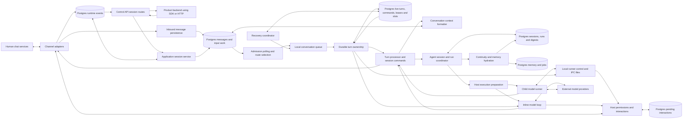
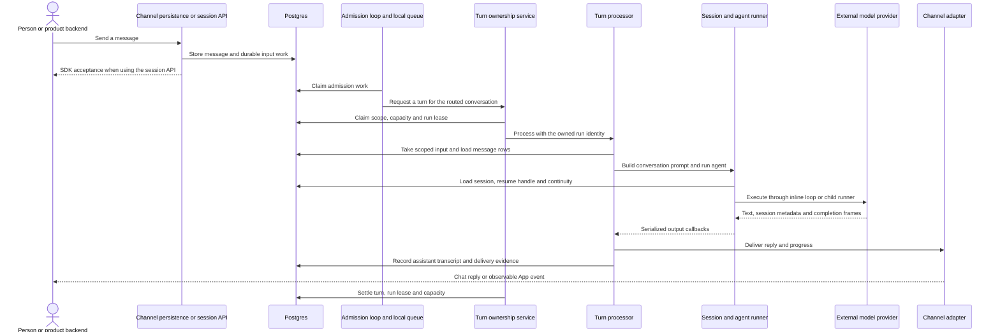
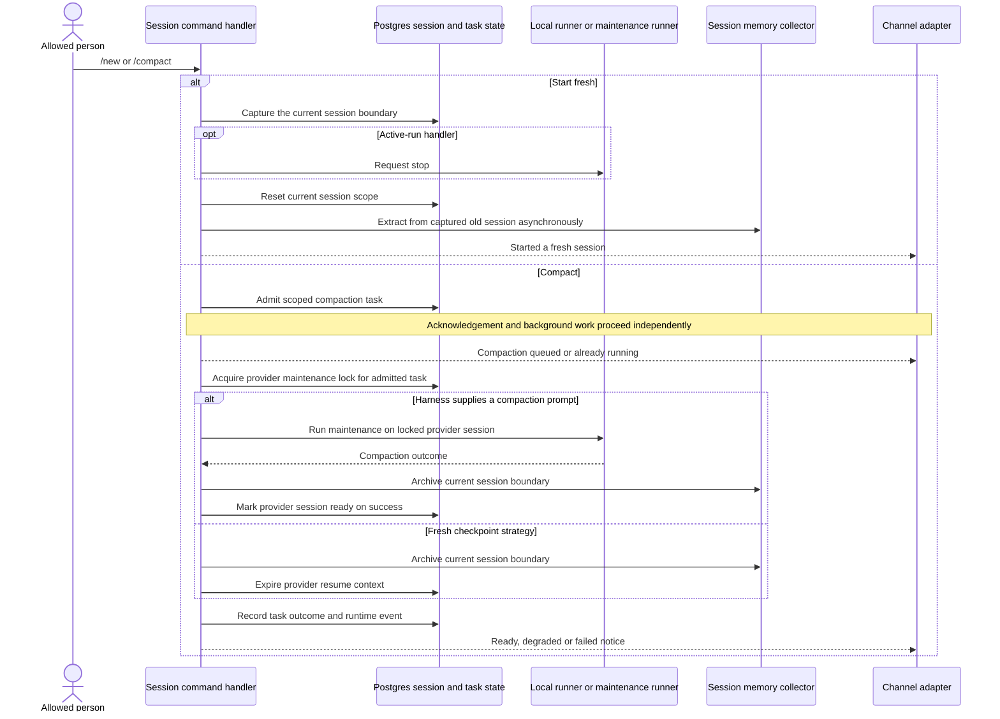

# Runtime turn engine and sessions

## 1. What this area does

This area turns saved messages into work for the right agent, conversation and thread. It remembers the agent's session so a later message can continue the conversation, and adds recent conversation history, session digests and relevant memory to the agent's context. When someone sends another message while the agent is working, it can pass that message to the running agent; session commands can also stop work, start fresh or prepare a shorter context. It turns the agent's output into replies and progress updates, while host policy decides which actions the agent may take. Postgres records who owns a turn and what remains to be handled, allowing another worker to recover work after an owner disappears, subject to available capacity and recoverable state.

Sources: `apps/core/src/runtime/group-processing.ts`, `apps/core/src/runtime/group-agent-runner.ts`, `apps/core/src/application/sessions/hydrate-agent-context-service.ts`, `apps/core/src/runtime/live-turn-authority.ts`, `apps/core/src/session/session-commands.ts`, `apps/core/src/runtime/permission-decision-coordinator.ts`, `apps/core/src/runtime/live-turn-recovery.ts`.

## 2. Architecture diagram

Arrows show calls and data movement. Components inside a worker can share one process; the model runner can instead be a child process. The Postgres nodes group related tables rather than represent separate databases.



| Node                                                          | Current code anchors                                                                                                                                                                                                                                 |
| ------------------------------------------------------------- | ---------------------------------------------------------------------------------------------------------------------------------------------------------------------------------------------------------------------------------------------------- |
| Human chat services; channel adapters                         | `apps/core/src/channels/register-builtins.ts`, `apps/core/src/app/bootstrap/channel-wiring.ts`                                                                                                                                                       |
| Product backend using SDK or HTTP; control API session routes | `packages/sdk/src/index.ts`, `apps/core/src/control/server/routes/sessions.ts`                                                                                                                                                                       |
| Application session service                                   | `apps/core/src/application/sessions/session-interaction-module.ts`                                                                                                                                                                                   |
| Inbound message persistence                                   | `apps/core/src/app/bootstrap/channel-persistence-handlers.ts`                                                                                                                                                                                        |
| Postgres messages and input work                              | `apps/core/src/adapters/storage/postgres/schema/messages.ts`, `apps/core/src/adapters/storage/postgres/schema/live-turns.ts`, `apps/core/src/adapters/storage/postgres/repositories/canonical-message-repository.postgres.ts`                        |
| Admission polling and route selection                         | `apps/core/src/runtime/live-admission-work-loop.ts`, `apps/core/src/runtime/message-loop.ts`                                                                                                                                                         |
| Local conversation queue                                      | `apps/core/src/runtime/group-queue.ts`                                                                                                                                                                                                               |
| Durable turn ownership                                        | `apps/core/src/app/bootstrap/live-execution.ts`, `apps/core/src/runtime/live-turn-authority.ts`, `apps/core/src/application/live-turns/live-turn-lease-service.ts`                                                                                   |
| Postgres live turns, commands, leases and slots               | `apps/core/src/adapters/storage/postgres/schema/live-turns.ts`, `apps/core/src/adapters/storage/postgres/schema/worker-coordination.ts`                                                                                                              |
| Turn processor and session commands                           | `apps/core/src/runtime/group-processing.ts`, `apps/core/src/runtime/group-processing-session-command-handlers.ts`, `apps/core/src/session/session-commands.ts`                                                                                       |
| Conversation context formatter                                | `apps/core/src/runtime/group-conversation-context.ts`, `apps/core/src/runtime/conversation-context.ts`, `apps/core/src/messaging/router.ts`                                                                                                          |
| Agent session and run coordinator                             | `apps/core/src/runtime/group-agent-runner.ts`, `apps/core/src/adapters/storage/postgres/services/canonical-session-ops-service.ts`                                                                                                                   |
| Postgres sessions, runs and digests                           | `apps/core/src/adapters/storage/postgres/schema/sessions.ts`, `apps/core/src/adapters/storage/postgres/schema/runs.ts`                                                                                                                               |
| Continuity and memory hydration                               | `apps/core/src/application/sessions/hydrate-agent-context-service.ts`                                                                                                                                                                                |
| Postgres memory and jobs                                      | `apps/core/src/adapters/storage/postgres/schema/memory.ts`, `apps/core/src/adapters/storage/postgres/schema/jobs.ts`, `apps/core/src/adapters/storage/postgres/services/canonical-session-ops-service.ts`                                            |
| Host execution preparation                                    | `apps/core/src/runtime/agent-spawn.ts`, `apps/core/src/runtime/agent-spawn-preparation.ts`, `apps/core/src/runtime/agent-spawn-admission.ts`                                                                                                         |
| Inline model loop                                             | `apps/core/src/runtime/agent-inline.ts`, `apps/core/src/app/bootstrap/runtime-default-adapters.ts`                                                                                                                                                   |
| Child model runner                                            | `apps/core/src/runtime/agent-spawn-process.ts`, `apps/core/src/adapters/llm/anthropic-claude-agent/execution-adapter.ts`, `apps/core/src/adapters/llm/deepagents-langchain/execution-adapter.ts`                                                     |
| Local runner control and IPC files                            | `apps/core/src/runtime/continuation-input.ts`, `apps/core/src/runtime/filesystem-runner-control-port.ts`, `apps/core/src/runtime/ipc.ts`, `apps/core/src/runtime/agent-spawn-layout.ts`                                                              |
| External model providers                                      | `apps/core/src/runtime/agent-spawn-model-resolution.ts`, `apps/core/src/adapters/llm/anthropic-claude-agent/execution-adapter.ts`, `apps/core/src/adapters/llm/deepagents-langchain/execution-adapter.ts`                                            |
| Postgres runtime events                                       | `apps/core/src/application/runtime-events/runtime-event-exchange.ts`, `apps/core/src/adapters/storage/postgres/schema/events.ts`, `apps/core/src/channels/app.ts`                                                                                    |
| Recovery coordinator                                          | `apps/core/src/app/bootstrap/live-recovery-coordinator.ts`, `apps/core/src/app/bootstrap/live-execution.ts`, `apps/core/src/runtime/live-turn-recovery.ts`                                                                                           |
| Host permissions and interactions                             | `apps/core/src/runtime/permission-decision-coordinator.ts`, `apps/core/src/runtime/ipc-interaction-processing.ts`, `apps/core/src/app/bootstrap/inline-agent-loop-tools.ts`, `apps/core/src/application/interactions/durable-interaction-handler.ts` |
| Postgres pending interactions                                 | `apps/core/src/application/interactions/pending-interaction-durability.ts`, `apps/core/src/adapters/storage/postgres/schema/worker-coordination.ts`                                                                                                  |

The App channel publishes outbound session events; ordinary chat adapters send through their external provider. SDK clients observe durable events through HTTP SSE or list/wait operations. An accepted SDK message means durable acceptance, not a completed answer or successful delivery. Sources: `apps/core/src/channels/app.ts`, `apps/core/src/application/sessions/session-interaction-module.ts`, `apps/core/src/control/server/routes/sessions.ts`.

Host policy applies to both inline and child execution. A message supplies work, not authority: selected capabilities and the permission coordinator govern tools. Child runners exchange permission, question, memory and browser requests through host IPC; inline execution supplies host callbacks. The `direct` runner provider supplies no Gantry OS sandbox or inner Claude SDK sandbox; enforcing outer confinement is an optional deployment choice such as `sandbox_runtime`. Sources: `apps/core/src/runtime/group-run-context.ts`, `apps/core/src/runtime/permission-decision-coordinator.ts`, `apps/core/src/runtime/ipc.ts`, `apps/core/src/runtime/agent-inline.ts`, `apps/core/src/app/bootstrap/inline-agent-loop-tools.ts`, `apps/core/src/adapters/sandbox/runner-sandbox-provider.ts`, `apps/core/src/runtime/agent-spawn-helpers.ts`.

## 3. Key flows

### A saved message becomes a reply



1. Channel persistence checks for a configured route and excludes service identities before storing eligible input. A message can create input work for multiple routed agents; it is not promised a turn merely because it was stored. SDK acceptance validates app/session ownership and response options, saves a response route, and uses the runtime-event exchange to persist the inbound event with message/admission work. An overloaded SDK submission reports a rate limit and leaves the message as history only. Sources: `apps/core/src/app/bootstrap/channel-persistence-handlers.ts`, `apps/core/src/application/sessions/session-interaction-module.ts`, `apps/core/src/application/runtime-events/runtime-event-exchange.ts`, `apps/core/src/adapters/storage/postgres/repositories/canonical-message-repository.postgres.ts`.
2. The admission loop claims durable work, renews its claim and resolves the configured agent, provider account and thread route. It asks `GroupQueue` to check that conversation; completing this admission claim is separate from consuming the input in an actual turn. Sources: `apps/core/src/runtime/live-admission-work-loop.ts`, `apps/core/src/runtime/message-loop.ts`, `apps/core/src/runtime/group-queue.ts`.
3. Before execution, the live processor finds or creates the agent session, checks for an active turn, and creates a run only when needed. The ownership service acquires capacity, claims the scope and obtains a run lease; a competing active owner receives a continuation instead. Sources: `apps/core/src/app/bootstrap/live-execution.ts`, `apps/core/src/application/live-turns/live-turn-lease-service.ts`, `apps/core/src/runtime/live-turn-authority.ts`.
4. The processor takes input under app, conversation, thread, agent and account scope and loads the corresponding message rows. Taking uses durable receive order, but the prompt batch is then sorted by provider timestamp to the second, with receive order as the tie breaker; a command/control message that ended the batch stays last. Session command and mention checks can finish handling without calling a model. Sources: `apps/core/src/runtime/group-processing.ts`, `apps/core/src/runtime/group-processing-flow.ts`, `apps/core/src/runtime/group-trigger-policy.ts`, `apps/core/src/session/session-commands.ts`.
5. Conversation context includes current messages, thread history and recent conversation history, with bounded rendering and optional provider history hydration. Separately, the session service hydrates recent persisted digests, active memory and related jobs, rendered in that order. Personal memory hydration is restricted to direct conversations. Sources: `apps/core/src/runtime/group-conversation-context.ts`, `apps/core/src/runtime/conversation-context.ts`, `apps/core/src/messaging/router.ts`, `apps/core/src/application/sessions/hydrate-agent-context-service.ts`, `apps/core/src/runtime/group-person-identity.ts`.
6. The runner loads the provider resume handle and selected access snapshot, prepares the selected harness, and executes inline or as a child. Provider session updates are persisted with reset/ownership checks; a recognized missing resume session can be expired and retried fresh. Sources: `apps/core/src/runtime/group-agent-runner.ts`, `apps/core/src/runtime/agent-spawn-preparation.ts`, `apps/core/src/runtime/agent-inline.ts`, `apps/core/src/runtime/agent-spawn.ts`, `apps/core/src/adapters/storage/postgres/repositories/canonical-session-repository.postgres.ts`.
7. Serialized callbacks distinguish visible text, interaction boundaries and true completion. The output buffer sanitizes and streams or sends the text; finalization records transcript/delivery status and settles the owned turn. Failed work releases its input for retry only when no output has reached the user. Sources: `apps/core/src/runtime/agent-output-callbacks.ts`, `apps/core/src/runtime/group-output-buffer.ts`, `apps/core/src/runtime/group-output-finalization.ts`, `apps/core/src/runtime/group-processing-flow.ts`, `apps/core/src/app/bootstrap/live-execution.ts`.

### A follow-up reaches the worker that owns the turn

```mermaid
sequenceDiagram
    actor Person as Person
    participant Receive as Receiving worker
    participant DB as Postgres input and command inbox
    participant Own as Owning worker and command pump
    participant Port as Local runner control port
    participant Run as Running model loop
    Person->>Receive: Send another message or allowed stop command
    Receive->>DB: Persist input and find active turn
    alt Follow-up message
        Receive->>DB: Take input and append sequenced continuation
    else Stop command
        Receive->>DB: Claim command input and append stop
    end
    DB-->>Own: Wakeup hint; owner also polls
    Own->>DB: Check current lease fence and pending sequence
    Own->>Port: Apply continuation or stop locally
    Port->>Run: Control file, inline callback or stop signal
    alt Local effect succeeds
        Own->>DB: Mark command applied under its fence
    else Runner no longer accepts continuation
        Own->>DB: Reject command and release its input
        Own->>Own: Queue a check for the next turn
    end
```

1. The admission processor detects the active scope and routes input to its owner, even when the receiving worker is different. Allowed `/stop` and `/new` commands also have an immediate control-handler path; the input item is claimed before acting to avoid two workers applying it. Sources: `apps/core/src/app/bootstrap/live-execution.ts`, `apps/core/src/runtime/message-loop.ts`, `apps/core/src/app/bootstrap/runtime-services.ts`.
2. Follow-up routing takes scoped input, formats it and appends a command with an idempotency key. The routing service checks any required continuation sender, and the repository allocates a sequence on the turn. Stop routes by scope or a registered stop alias. Sources: `apps/core/src/app/bootstrap/live-recovery-coordinator.ts`, `apps/core/src/app/bootstrap/live-turn-continuation.ts`, `apps/core/src/runtime/live-turn-routing.ts`, `apps/core/src/adapters/storage/postgres/repositories/live-turn-repository.postgres.ts`.
3. The owner renews its lease and capacity and drains commands in sequence, checking the active fence before applying each. Notifications accelerate the drain; polling remains a fallback. Sources: `apps/core/src/runtime/live-turn-authority.ts`, `apps/core/src/runtime/live-turn-command-pump.ts`.
4. Local hooks write continuation or close signals through a runner control port. The filesystem implementation writes JSON atomically into the workspace/thread input directory; the inline implementation invokes in-memory subscribers. Stop delegates to the local queue's runner termination path. Sources: `apps/core/src/runtime/group-queue-live-turn-hooks.ts`, `apps/core/src/runtime/continuation-input.ts`, `apps/core/src/runtime/filesystem-runner-control-port.ts`, `apps/core/src/runtime/agent-inline.ts`, `apps/core/src/runtime/group-queue-stop.ts`.
5. Applied status is written after the local effect, so a crash between those actions can leave a command for replay; this is not an exactly-once promise. A runner that can no longer take a continuation causes a fenced rejection and input release for the next turn. Sources: `apps/core/src/runtime/live-turn-command-pump.ts`, `apps/core/src/runtime/live-turn-continuation-command.ts`.

### Start fresh or compact the session



1. Command parsing recognizes the supported commands; sender control policy determines who may use them. Queued handling treats `/new` as a recovery command and does not run older messages before clearing the session. Other commands can first process messages that preceded them. Sources: `apps/core/src/application/sessions/session-command-parse.ts`, `apps/core/src/session/session-commands.ts`, `apps/core/src/runtime/group-session-command-state.ts`.
2. Queued `/new` prepares an archive finalizer, resets the scope and starts the finalizer asynchronously. The active handler separately captures the old session, requests stop, clears persisted session state and launches extraction. Boundary capture and extraction are best effort; reset failure produces a failure notice rather than claiming success. Sources: `apps/core/src/session/session-new-archive.ts`, `apps/core/src/runtime/group-session-command-state.ts`, `apps/core/src/app/bootstrap/runtime-services-active-new.ts`, `apps/core/src/adapters/storage/postgres/repositories/canonical-session-repository-context-mark.postgres.ts`.
3. `/compact` admits a scoped `session_compaction` task when the durable task repository is available and takes a provider maintenance lock. It acknowledges queueing without waiting for the background operation to complete. Duplicate admission and stale tasks are checked by the handlers; an in-memory dedupe set remains as a fallback. Sources: `apps/core/src/session/session-compaction-command.ts`, `apps/core/src/runtime/group-session-command-state.ts`.
4. A harness with a maintenance compaction prompt runs against the locked session, then archives the boundary and marks the provider context ready. A harness without that prompt uses a fresh checkpoint: archive the boundary and expire the old provider context. Memory extraction can leave a degraded outcome, and failures retain usable current continuity. Sources: `apps/core/src/runtime/group-agent-runner-maintenance-compaction.ts`, `apps/core/src/session/session-compaction-command.ts`, `apps/core/src/runtime/session-resume-runtime.ts`.
5. Later turns handle context accumulated during maintenance before promoting ready provider context. Task outcomes and session compaction events describe background progress; `/status` also consults provider maintenance state. Sources: `apps/core/src/runtime/group-agent-runner-compaction-delta.ts`, `apps/core/src/runtime/group-agent-runner.ts`, `apps/core/src/runtime/group-session-command-state.ts`, `apps/core/src/session/session-commands.ts`.

### Recover after a live worker disappears

```mermaid
sequenceDiagram
    participant Old as Previous live worker
    participant DB as Postgres turns and leases
    participant Coord as Recovery coordinator worker
    participant Queue as Coordinator's local queue
    participant Run as New runner execution
    Old->>DB: Heartbeat owned run and slots
    Note over Old: Process crashes; heartbeats stop
    Coord->>DB: List turns with expired leases or stale unleased claims
    alt Stale turn never acquired a lease
        Coord->>DB: Mark timed out and free scope
    else Eligible recovery with capacity
        Coord->>DB: Reclaim lease with higher fencing version
        Coord->>Coord: Adopt recovered ownership
        Coord->>DB: Inspect delivery evidence and release replayable input
        Coord->>Queue: Queue the saved conversation key
        Queue->>Run: Execute under recovered ownership
    else No capacity or no eligible worker
        Note over Coord,DB: Defer recovery; report capability starvation where configured
    end
    opt Previous owner is still alive after losing its lease
        Old->>DB: Heartbeat or capacity renewal fails
        Old->>Old: Stop local runner and discard local ownership
    end
```

1. Every eligible live worker can admit new turns. One worker holds the recovery-coordinator lease and runs startup pending-input recovery, the periodic recovery sweep and the waiting-status monitor. Losing the coordinator lease stops those coordinator services without stopping distributed admission. Sources: `apps/core/src/app/bootstrap/live-recovery-coordinator.ts`, `apps/core/src/app/bootstrap/live-execution.ts`.
2. Recovery lists expired leased turns and stale claims with no complete lease identity. Unleased stale claims become timed out; leased turns require eligible capabilities and available capacity before takeover at a higher fence. Sources: `apps/core/src/runtime/live-turn-recovery.ts`, `apps/core/src/application/live-turns/live-turn-lease-service.ts`, `apps/core/src/app/bootstrap/live-turn-recovery-capability-gate.ts`.
3. The coordinator adopts the recovered owner and requires a saved replayable queue key. It releases follow-up input, and releases the original input only if no delivered output is recorded for the run; then it enqueues a message check. Missing replay state fails closed. Recovery re-enters execution rather than resurrecting the old process or its in-memory buffers. Source: `apps/core/src/app/bootstrap/live-execution.ts`.
4. A previous owner that remains alive stops its runner after a failed ownership heartbeat or capacity renewal. Durable updates and command marking use the lease token, worker identity and fencing version to reject stale owners. Sources: `apps/core/src/runtime/live-turn-authority.ts`, `apps/core/src/runtime/live-turn-command-pump.ts`, `apps/core/src/application/live-turns/live-turn-lease-service.ts`.

## 4. Data it owns

Core runtime/session records and shared boundary records are distinguished below. Each row describes current storage, not a guarantee that every execution lane writes it.

| Table or file family                                    | What it holds                                                                                                  | Code anchor                                                                                                                                               |
| ------------------------------------------------------- | -------------------------------------------------------------------------------------------------------------- | --------------------------------------------------------------------------------------------------------------------------------------------------------- |
| `agent_sessions`                                        | Agent/app session scope, conversation/thread or job association, model override and reset boundary.            | `apps/core/src/adapters/storage/postgres/schema/sessions.ts`                                                                                              |
| `provider_sessions`                                     | External resume handle, provider identity, maintenance status, access metadata and context high-water mark.    | `apps/core/src/adapters/storage/postgres/schema/sessions.ts`                                                                                              |
| `agent_session_digests`                                 | Scoped session-boundary digests and extraction counts used for continuity hydration.                           | `apps/core/src/adapters/storage/postgres/schema/sessions.ts`, `apps/core/src/application/sessions/hydrate-agent-context-service.ts`                       |
| `agent_session_summaries`                               | Session summary text and source message/run ranges; distinct from the digest hydration path.                   | `apps/core/src/adapters/storage/postgres/schema/sessions.ts`                                                                                              |
| `agent_runs`                                            | Execution cause, session/provider references, status, timing, usage and outcome evidence.                      | `apps/core/src/adapters/storage/postgres/schema/runs.ts`                                                                                                  |
| `live_admission_work_items`                             | Durable input identity, receive order, consumption owner, admission claims, deferrals and failure counts.      | `apps/core/src/adapters/storage/postgres/schema/live-turns.ts`                                                                                            |
| `live_turns`                                            | One active turn per scope, lifecycle state, saved replay key and projected owner identity.                     | `apps/core/src/adapters/storage/postgres/schema/live-turns.ts`                                                                                            |
| `live_turn_commands`                                    | Sequenced, idempotent commands and their pending/applied/rejected outcomes.                                    | `apps/core/src/adapters/storage/postgres/schema/live-turns.ts`                                                                                            |
| `worker_instances`, `run_leases`, `run_slots`           | Shared worker presence, authoritative run fences and expiring capacity holds.                                  | `apps/core/src/adapters/storage/postgres/schema/worker-coordination.ts`                                                                                   |
| `agent_async_tasks`                                     | Shared async task state, including scoped session compaction admission, heartbeat and outcome.                 | `apps/core/src/adapters/storage/postgres/schema/async-tasks.ts`, `apps/core/src/runtime/group-session-command-state.ts`                                   |
| `control_http_sessions`, `control_http_response_routes` | App-facing session identity and per-thread response mode, webhook and correlation routing.                     | `apps/core/src/adapters/storage/postgres/schema/control-http.ts`                                                                                          |
| `messages`, `message_parts`                             | Shared canonical conversation transcript and its structured content parts.                                     | `apps/core/src/adapters/storage/postgres/schema/messages.ts`                                                                                              |
| `runtime_events`                                        | Shared durable observations, including accepted input, replies and compaction progress.                        | `apps/core/src/adapters/storage/postgres/schema/events.ts`                                                                                                |
| `pending_interactions`, `permission_prompts`            | Shared durable question/permission routing, ownership and resolution state.                                    | `apps/core/src/adapters/storage/postgres/schema/worker-coordination.ts`                                                                                   |
| Local workspace IPC directories                         | Continuation JSON, close signals and request/response files for child runner tools and interactions.           | `apps/core/src/runtime/agent-spawn-layout.ts`, `apps/core/src/runtime/continuation-input.ts`, `apps/core/src/runtime/ipc.ts`                              |
| Generated workspace `.llm-runtime` state                | Adapter-managed configuration and runtime materialization; it is not turn ownership authority.                 | `apps/core/src/adapters/llm/anthropic-claude-agent/claude-config-materializer.ts`, `apps/core/src/adapters/llm/deepagents-langchain/execution-adapter.ts` |
| DeepAgents checkpoint schema in Postgres                | Provider execution checkpoints created through the Postgres checkpointer, separate from Gantry's session rows. | `apps/core/src/adapters/llm/deepagents-langchain/checkpoint-setup.ts`, `apps/core/src/adapters/llm/deepagents-langchain/execution-adapter.ts`             |

Memory items, job definitions/runs and outbound deliveries belong to adjoining areas. This area reads memory/jobs for continuity and uses shared delivery services; it does not make a provider resume handle or a local IPC file the authority for durable ownership. Sources: `apps/core/src/adapters/storage/postgres/services/canonical-session-ops-service.ts`, `apps/core/src/runtime/group-processing.ts`, `apps/core/src/app/bootstrap/runtime-services.ts`, `apps/core/src/application/live-turns/live-turn-lease-service.ts`.

## 5. How it scales and fails

### Process roles

`GANTRY_PROCESS_ROLE` selects the role at boot; the default is `all`. Sources: `apps/core/src/app/bootstrap/roles/process-role.ts`, `apps/core/src/app/bootstrap/roles/role-resolver.ts`.

| Role          | What runs here                                                                                                                                  |
| ------------- | ----------------------------------------------------------------------------------------------------------------------------------------------- |
| `all`         | Full control API, provider inbound, live admission/execution, scheduler/job execution and toolchain bakes.                                      |
| `control`     | Full control API and desired-state writes; no live model execution, scheduler claiming, bakes or provider inbound.                              |
| `live-worker` | Provider inbound and callbacks, live admission/execution and worker registration; API is operational/read-only diagnostics.                     |
| `job-worker`  | Scheduler/job execution, bakes and worker registration; API is operational/read-only diagnostics, with provider connections used outbound-only. |

Sources: `apps/core/src/app/bootstrap/roles/role-capabilities.ts`, `apps/core/src/app/bootstrap/channel-wiring.ts`, `apps/core/src/app/bootstrap/runtime-services.ts`, `apps/core/src/app/bootstrap/fleet-boot.ts`. Scheduled execution enters the shared runner through the jobs area rather than live message admission: `apps/core/src/jobs/execution-phases-run.ts`, `apps/core/src/runtime/agent-spawn.ts`.

### Memory, capacity and durable authority

`GroupQueue` keeps local active-process handles, pending group/task lists, continuation hooks and retry timers. Output buffers, liveness timers, inline continuation subscribers and the compaction fallback set are also process memory and disappear on restart. Postgres holds input consumption, active scope uniqueness, command order, session context references, run evidence, leases and slots. Sources: `apps/core/src/runtime/group-queue.ts`, `apps/core/src/runtime/group-output-buffer.ts`, `apps/core/src/runtime/group-liveness-state.ts`, `apps/core/src/runtime/agent-inline.ts`, `apps/core/src/session/session-compaction-command.ts`, `apps/core/src/adapters/storage/postgres/schema/live-turns.ts`, `apps/core/src/adapters/storage/postgres/schema/worker-coordination.ts`.

Adding live workers increases available execution capacity: the live message slot key is worker-specific, so `runtime.queue.max_message_runs` bounds each worker rather than the whole fleet. Host budget and interactive-class slots add admission limits, while the partial unique index permits only one non-terminal turn for an app/session/conversation/thread scope. Provider inbound ownership is separately coordinated when connecting accounts; it does not make one worker the sole live executor. Sources: `apps/core/src/application/live-turns/live-turn-lease-service.ts`, `apps/core/src/shared/host-capacity.ts`, `apps/core/src/adapters/storage/postgres/schema/live-turns.ts`, `apps/core/src/channels/provider-account-channel-connect.ts`, `apps/core/src/app/bootstrap/live-execution.ts`.

### Failure and restart behavior

- **Busy or unavailable admission:** capacity deferrals do not count as admission failures. Missing routes/channels and exceptions defer claims and eventually mark admission work failed at the configured failure limit; polling and wakeups operate on durable work. Sources: `apps/core/src/runtime/live-admission-work-loop.ts`, `apps/core/src/runtime/message-loop.ts`.
- **Runner or model failure:** input returns for retry if no output reached the user; input is kept after visible delivery to avoid repeating that answer. Provider failover and a recognized missing-session retry happen in the runner coordinator. Delivery failure has its own final progress state. Sources: `apps/core/src/runtime/group-processing-flow.ts`, `apps/core/src/runtime/group-agent-runner.ts`, `apps/core/src/runtime/failover-candidate-loop.ts`, `apps/core/src/runtime/group-processing.ts`.
- **Ownership loss or database heartbeat failure:** the live owner stops its local runner and removes its registration. Recovery takes over expired leases with a higher fence and only replays input allowed by saved state and delivery evidence; command effects may be replayed after a crash before their applied marker. Sources: `apps/core/src/runtime/live-turn-authority.ts`, `apps/core/src/runtime/live-turn-recovery.ts`, `apps/core/src/app/bootstrap/live-execution.ts`, `apps/core/src/runtime/live-turn-command-pump.ts`.
- **Graceful shutdown:** stop fresh admissions and recovery, mark the worker draining, release the coordinator lease early, and allow local work to drain to a deadline before remaining teardown. Local queue shutdown closes runner input; remaining live registrations are settled/released by the authority shutdown. Sources: `apps/core/src/app/bootstrap/shutdown.ts`, `apps/core/src/runtime/group-queue.ts`, `apps/core/src/runtime/live-turn-authority.ts`.
- **Session maintenance interruption:** context lookup releases stale provider maintenance locks; compaction admission/status handling detects stale tasks using the ten-minute timeout. The background compaction promise itself does not survive a process exit. A failed or degraded extraction is surfaced separately from a usable compacted/fresh context. Sources: `apps/core/src/adapters/storage/postgres/repositories/canonical-session-repository.postgres.ts`, `apps/core/src/adapters/storage/postgres/repositories/canonical-session-repository-helpers.postgres.ts`, `apps/core/src/runtime/group-session-command-state.ts`, `apps/core/src/session/session-compaction-command.ts`.
- **Deployment boundary:** durable rows do not preserve a child process or local provider files. DeepAgents live checkpoints use Postgres; Claude runtime materialization is local adapter state. Successful resume still depends on the selected provider's supported session state. `direct` relies on host policy/credential controls and the deployment boundary; optional enforcing runner providers add outer OS confinement. Sources: `apps/core/src/adapters/llm/deepagents-langchain/execution-adapter.ts`, `apps/core/src/adapters/llm/anthropic-claude-agent/claude-config-materializer.ts`, `apps/core/src/runtime/group-agent-runner.ts`, `apps/core/src/adapters/sandbox/runner-sandbox-provider.ts`, `apps/core/src/runtime/agent-spawn-helpers.ts`.

## 6. Video script outline

1. A message arrives, and Gantry saves the work for the agent attached to that conversation.
2. A worker claims the turn, while a shared record prevents a second worker from owning the same turn.
3. Gantry gathers the conversation, recent session digests and relevant memory before asking the model to work.
4. The agent works inline or in a child runner, with host policy controlling the actions it can take.
5. Replies and progress flow back, and another message can reach the worker already handling the conversation.
6. Session commands let an allowed person stop work, start fresh or prepare shorter context in the background.
7. If a worker disappears, another can recover eligible work from shared records without treating its lost local memory as durable state.

These beats follow the code-backed components and journeys in sections 2–5.

## 7. Duplication and simplification

### Existing audit findings

The supplied [runtime audit](../audits/2026-10-02-area-audit/02-runtime.md) contains these findings; the titles link to that report rather than repeat its analysis:

- [Session commands mistake control frames for completion — duplicate](../audits/2026-10-02-area-audit/02-runtime.md)
- [Stopping the same runner follows different termination policies — parallel](../audits/2026-10-02-area-audit/02-runtime.md)
- [Compaction status has three authorities — over-complicated](../audits/2026-10-02-area-audit/02-runtime.md)
- [`/new` implements session-boundary capture twice — duplicate](../audits/2026-10-02-area-audit/02-runtime.md)
- [SDK resume status searches obsolete alternative shapes — over-complicated](../audits/2026-10-02-area-audit/02-runtime.md)
- [Streaming sanitization is copied inside its own accumulator — duplicate](../audits/2026-10-02-area-audit/02-runtime.md)
- [SDK sessions reimplement the shared thread queue key — duplicate](../audits/2026-10-02-area-audit/02-runtime.md)

The report is a prior audit, not verification that every finding remains unchanged in this worktree.

### New observation

1. **Conversation context repeats the same content-budget search.** The binary search and final rendering at `apps/core/src/messaging/router.ts:143` and `apps/core/src/messaging/router.ts:184` both find the largest per-message content budget fitting the same aggregate envelope. The second copy adds an omission marker after dropping older message envelopes. Keep the bounded context renderer, UTF-8 accounting, oldest-first dropping and explicit omission marker; use one local budget-search routine accepting the retained messages and optional marker. **Size: fix.** This is duplication found while tracing, not a demonstrated user-visible failure; any simplification must preserve complete message envelopes and the aggregate byte limit.
