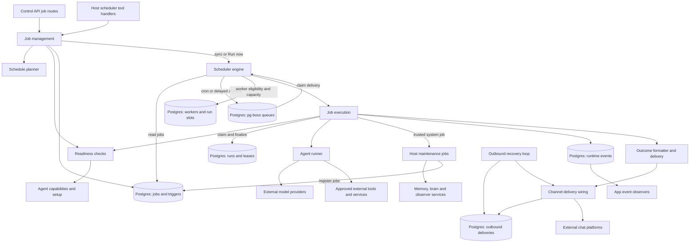
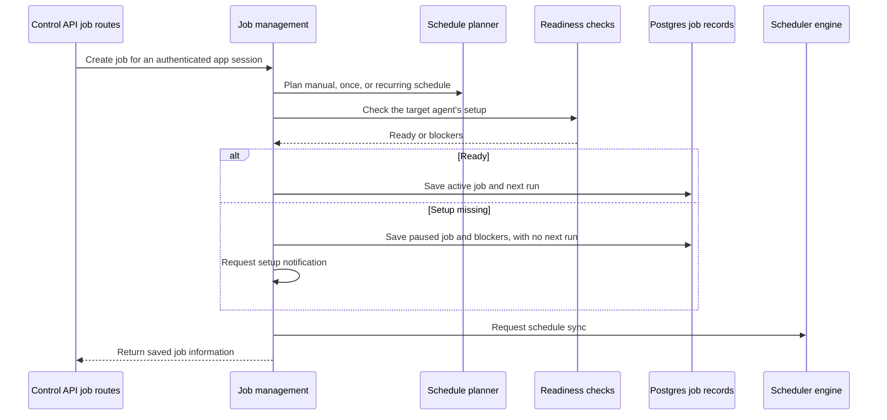
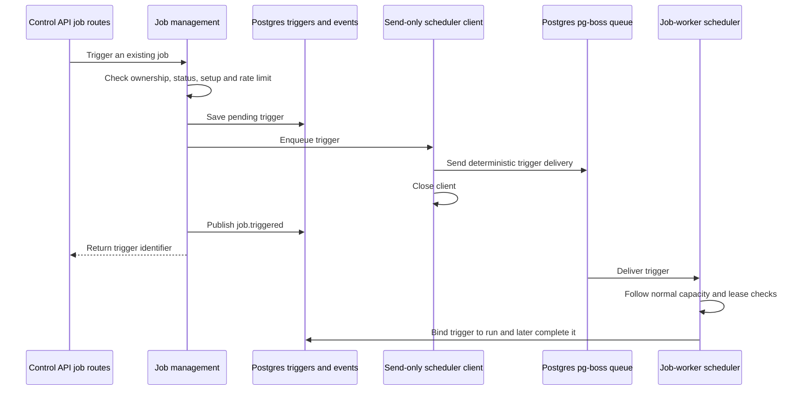

# Scheduled jobs and the scheduler

## 1. What this area does

Gantry remembers work to do later, whether it runs once, repeats on a timetable, or starts when someone presses Run now. Each job records the instructions, the agent and conversation it belongs to, and where to send its outcome. Before starting, Gantry checks that the agent has the approved capabilities and setup the work needs; a saved job does not grant access by itself. Available workers take turns claiming work, and Gantry records each run's result separately from its notifications. Failed work can retry or stop for attention, while silent jobs keep their ordinary outcome out of chat. The same scheduler also starts Gantry's memory, company-brain, and observer maintenance work. Sources: [job management](../../../apps/core/src/application/jobs/job-management-service.ts), [readiness](../../../apps/core/src/application/jobs/job-readiness-service.ts), [execution](../../../apps/core/src/jobs/execution.ts), [notifications](../../../apps/core/src/jobs/delivery.ts), and [system jobs](../../../apps/core/src/jobs/system-jobs.ts).

## 2. Architecture diagram

Arrows show calls or data movement, not separate deployments. Postgres holds both Gantry's records and pg-boss's scheduling records; the worker's timers and caches are local to its process.



Every diagram component has these code anchors:

| Diagram component                                                            | Current source path                                                                                                                                                                                                                                                                                                                                                                                            |
| ---------------------------------------------------------------------------- | -------------------------------------------------------------------------------------------------------------------------------------------------------------------------------------------------------------------------------------------------------------------------------------------------------------------------------------------------------------------------------------------------------------- |
| Control API job routes                                                       | [apps/core/src/control/server/routes/jobs.ts](../../../apps/core/src/control/server/routes/jobs.ts)                                                                                                                                                                                                                                                                                                            |
| Host scheduler tool handlers                                                 | [apps/core/src/jobs/ipc-scheduler-create-handlers.ts](../../../apps/core/src/jobs/ipc-scheduler-create-handlers.ts), [ipc-scheduler-mutate-handlers.ts](../../../apps/core/src/jobs/ipc-scheduler-mutate-handlers.ts), [ipc-scheduler-query-handlers.ts](../../../apps/core/src/jobs/ipc-scheduler-query-handlers.ts)                                                                                          |
| Job management                                                               | [apps/core/src/application/jobs/job-management-service.ts](../../../apps/core/src/application/jobs/job-management-service.ts), [job-management-create.ts](../../../apps/core/src/application/jobs/job-management-create.ts)                                                                                                                                                                                    |
| Schedule planner                                                             | [apps/core/src/jobs/job-schedule-planner.ts](../../../apps/core/src/jobs/job-schedule-planner.ts), [schedule-math.ts](../../../apps/core/src/jobs/schedule-math.ts)                                                                                                                                                                                                                                            |
| Readiness checks                                                             | [apps/core/src/application/jobs/job-readiness-service.ts](../../../apps/core/src/application/jobs/job-readiness-service.ts)                                                                                                                                                                                                                                                                                    |
| Agent capabilities and setup                                                 | [apps/core/src/application/jobs/job-tool-policy.ts](../../../apps/core/src/application/jobs/job-tool-policy.ts), [job-capability-requirements.ts](../../../apps/core/src/application/jobs/job-capability-requirements.ts)                                                                                                                                                                                      |
| Postgres: jobs and triggers                                                  | [apps/core/src/adapters/storage/postgres/schema/jobs.ts](../../../apps/core/src/adapters/storage/postgres/schema/jobs.ts)                                                                                                                                                                                                                                                                                      |
| Scheduler engine; Postgres: pg-boss queues                                   | [apps/core/src/jobs/scheduler.ts](../../../apps/core/src/jobs/scheduler.ts), [apps/core/src/infrastructure/pgboss/scheduler-engine.ts](../../../apps/core/src/infrastructure/pgboss/scheduler-engine.ts)                                                                                                                                                                                                       |
| Postgres: workers and run slots                                              | [apps/core/src/jobs/concurrency.ts](../../../apps/core/src/jobs/concurrency.ts), [worker-identity.ts](../../../apps/core/src/jobs/worker-identity.ts), [worker coordination schema](../../../apps/core/src/adapters/storage/postgres/schema/worker-coordination.ts)                                                                                                                                            |
| Job execution                                                                | [apps/core/src/jobs/execution.ts](../../../apps/core/src/jobs/execution.ts), [execution-phases-setup.ts](../../../apps/core/src/jobs/execution-phases-setup.ts), [execution-phases-run.ts](../../../apps/core/src/jobs/execution-phases-run.ts)                                                                                                                                                                |
| Postgres: runs and leases                                                    | [run insertion](../../../apps/core/src/adapters/storage/postgres/repositories/canonical-job-run-insert.postgres.ts), [run claim](../../../apps/core/src/adapters/storage/postgres/repositories/canonical-job-claim.postgres.ts), [run schema](../../../apps/core/src/adapters/storage/postgres/schema/runs.ts), [lease schema](../../../apps/core/src/adapters/storage/postgres/schema/worker-coordination.ts) |
| Agent runner; external model providers; approved external tools and services | [apps/core/src/runtime/agent-spawn.ts](../../../apps/core/src/runtime/agent-spawn.ts) prepares the selected execution adapter, credentials, skills and MCP connections; [job runner invocation](../../../apps/core/src/jobs/execution-phases-run.ts) supplies inherited authority                                                                                                                              |
| Host maintenance jobs                                                        | [apps/core/src/jobs/system-jobs.ts](../../../apps/core/src/jobs/system-jobs.ts), [execution-system-job.ts](../../../apps/core/src/jobs/execution-system-job.ts)                                                                                                                                                                                                                                                |
| Memory, brain and observer services                                          | [apps/core/src/memory/app-memory-service.ts](../../../apps/core/src/memory/app-memory-service.ts), [apps/core/src/brain/brain-runtime.ts](../../../apps/core/src/brain/brain-runtime.ts), [apps/core/src/jobs/observer-digest-job.ts](../../../apps/core/src/jobs/observer-digest-job.ts)                                                                                                                      |
| Postgres: runtime events; app event observers                                | [job event publishing](../../../apps/core/src/jobs/execution-runtime-events.ts), [apps/core/src/application/runtime-events/runtime-event-exchange.ts](../../../apps/core/src/application/runtime-events/runtime-event-exchange.ts), [event schema](../../../apps/core/src/adapters/storage/postgres/schema/events.ts)                                                                                          |
| Outcome formatter and delivery                                               | [apps/core/src/jobs/execution-notifications.ts](../../../apps/core/src/jobs/execution-notifications.ts), [status-formatting.ts](../../../apps/core/src/jobs/status-formatting.ts), [delivery.ts](../../../apps/core/src/jobs/delivery.ts)                                                                                                                                                                      |
| Channel delivery wiring; external chat platforms                             | [apps/core/src/app/bootstrap/runtime-scheduler-start.ts](../../../apps/core/src/app/bootstrap/runtime-scheduler-start.ts), [channel wiring](../../../apps/core/src/app/bootstrap/channel-wiring.ts)                                                                                                                                                                                                            |
| Postgres: outbound deliveries; outbound recovery loop                        | [outbound schema](../../../apps/core/src/adapters/storage/postgres/schema/outbound-delivery.ts), [apps/core/src/jobs/outbound-delivery-recovery.ts](../../../apps/core/src/jobs/outbound-delivery-recovery.ts), [bootstrap wiring](../../../apps/core/src/app/bootstrap/runtime-services.ts)                                                                                                                   |

The `jobs/` directory also contains host IPC for files, capabilities, and delegated or asynchronous tasks. Those handlers share runtime infrastructure, but are not all scheduled jobs: this document follows the scheduler's job-management, execution, maintenance, and outcome paths. See [handler dispatch](../../../apps/core/src/jobs/ipc-handler.ts) and [async task service](../../../apps/core/src/jobs/async-command-task-service.ts).

## 3. Key flows

### A. Save a job through the control API



1. The API constructs `JobManagementService`; creation verifies the app owns the session and pins execution to its conversation and workspace. A model override is an approved alias, with compatibility checked against the agent's harness. Sources: [API routes](../../../apps/core/src/control/server/routes/jobs.ts), [creation](../../../apps/core/src/application/jobs/job-management-create.ts), [model selection](../../../apps/core/src/application/jobs/job-model-selection.ts).
2. The planner creates manual, once, interval, or cron schedule data. API and agent-tool creation currently use different planner branches; their validation and first-run differences are already audited below. Sources: [planner](../../../apps/core/src/jobs/job-schedule-planner.ts), [agent-tool creation service](../../../apps/core/src/application/jobs/job-management-service.ts).
3. Readiness compares declared requirements with the target agent's tools, skills, MCP connections, credentials, and any required browser state. Requirements describe prerequisites; they do not create job-owned capability authority. Notification destinations beyond the authenticated context pass route approval before saving. Sources: [readiness](../../../apps/core/src/application/jobs/job-readiness-service.ts), [inherited policy](../../../apps/core/src/application/jobs/job-tool-policy.ts), [route approval](../../../apps/core/src/application/jobs/job-management-helpers.ts).
4. Creation writes the job as active or setup-paused; a blocked job keeps its setup state and has no next run. Setup notification starts asynchronously after persistence. Sources: [creation](../../../apps/core/src/application/jobs/job-management-create.ts), [creation notification port](../../../apps/core/src/jobs/execution-readiness.ts).
5. A local scheduler receives a sync request; other job workers discover persisted changes during their full sync, normally every minute. Chat-originated creation instead enters host IPC, requires a matching job-plan confirmation token, and calls `upsertJobFromIpc`. Sources: [scheduler engine](../../../apps/core/src/infrastructure/pgboss/scheduler-engine.ts), [scheduler facade](../../../apps/core/src/jobs/scheduler.ts), [IPC creation](../../../apps/core/src/jobs/ipc-scheduler-create-handlers.ts).

### B. A timed job runs and reports its outcome

```mermaid
sequenceDiagram
    participant Boss as Postgres pg-boss queue
    participant Scheduler as Scheduler engine
    participant DB as Postgres jobs, capacity and leases
    participant Execute as Job execution
    participant Runner as Agent runner
    participant Outcome as Outcome delivery
    Boss->>Scheduler: Deliver a scheduled job
    Scheduler->>DB: Load job, check eligibility and acquire capacity
    alt Worker unsuitable or capacity busy
        Scheduler->>Boss: Requeue for later without starting a run
    else Worker available
        Scheduler->>Execute: Start job execution
        Execute->>DB: Re-read active job
        Execute->>Execute: Resolve context and model; check setup
        Execute->>DB: Claim run and lease atomically
        DB-->>Execute: Lease token and version, or refusal
        opt Claim succeeds for an ordinary agent job
            Execute->>Runner: Run prompt with inherited agent capabilities
            loop While executing
                Execute->>DB: Renew lease and record runtime activity
            end
            Runner-->>Execute: Result or error
            Execute->>DB: Finalize run and job using the lease
            Execute->>Outcome: Format terminal receipt unless silent
            Outcome-->>Execute: Delivery outcome
            Execute->>DB: Mark notified when delivery reports success
        end
        Scheduler->>DB: Release capacity
        Scheduler->>Scheduler: Request schedule sync
    end
```

1. The scheduler installs cron expressions into pg-boss with Gantry's timezone; once and interval jobs become delayed deliveries using stored `next_run`. Manual jobs get no timer. Sources: [schedule sync](../../../apps/core/src/infrastructure/pgboss/scheduler-engine.ts), [next-run arithmetic](../../../apps/core/src/jobs/schedule-math.ts).
2. A worker reloads the job, checks fleet capability eligibility, and acquires leased workspace and host capacity. On a host sharing interactive capacity, queued live work delays background dispatch. Ineligible or busy workers requeue without claiming a run or consuming its failure budget. Sources: [dispatch](../../../apps/core/src/infrastructure/pgboss/scheduler-engine.ts), [capability dispatch](../../../apps/core/src/jobs/capability-dispatch.ts), [capacity leases](../../../apps/core/src/jobs/concurrency.ts).
3. Execution re-reads the active job, resolves its conversation and agent, selects the model, and checks readiness. Named provider accounts must resolve to a current conversation route; a thread supplies run/delivery context but does not choose the conversation registration. Missing execution context is dead-lettered; missing setup pauses the job. Sources: [fresh read](../../../apps/core/src/jobs/execution-log-context.ts), [execution context](../../../apps/core/src/jobs/execution-context.ts), [setup phases](../../../apps/core/src/jobs/execution-phases-setup.ts), [invalid target handling](../../../apps/core/src/jobs/execution-dead-letter.ts).
4. A transaction locks the job, verifies it is still claimable, inserts the run, creates a lease, and marks the job running. For scheduled dispatch it also compares the expected scheduled timestamp; explicit triggers bypass that comparison. Claim evidence is appended before running. Sources: [claim transaction](../../../apps/core/src/adapters/storage/postgres/repositories/canonical-job-claim.postgres.ts), [lease coordination](../../../apps/core/src/jobs/execution-lease.ts).
5. Ordinary jobs load the agent's current access snapshot and session/memory context, then call the runner with the job prompt and inherited authority. Streamed text accumulates into the result; raw assistant output is not streamed to notification routes. Trusted host system jobs instead call the memory, brain, or observer subsystem with an abortable deadline. Sources: [run phases](../../../apps/core/src/jobs/execution-phases-run.ts), [job prompt](../../../apps/core/src/jobs/job-run-prompt.ts), [host maintenance deadline](../../../apps/core/src/jobs/execution-system-job.ts), [system handlers](../../../apps/core/src/jobs/system-jobs.ts).
6. Finalization writes the run result and job transition with the lease token, worker identity, and fencing version. It calculates the next run or records a setup pause, retry, timeout, or dead letter; an old worker cannot settle a recovered lease. Sources: [terminal phases](../../../apps/core/src/jobs/execution-phases-run.ts), [outcome policy](../../../apps/core/src/jobs/execution-finalization.ts), [storage settlement](../../../apps/core/src/adapters/storage/postgres/services/canonical-job-ops-service.ts).
7. Execution emits durable lifecycle events, closes a used browser profile, formats the outcome, and updates an existing lifecycle message or sends a receipt to the notification routes. Silent jobs suppress ordinary receipts. A successful notification result stamps `notified_at` using the lease coordinates; that result is not an all-routes delivery guarantee. Sources: [terminal publishing](../../../apps/core/src/jobs/execution-phases-run.ts), [browser cleanup](../../../apps/core/src/jobs/execution-browser-cleanup.ts), [receipt policy](../../../apps/core/src/jobs/execution-notifications.ts), [route delivery](../../../apps/core/src/jobs/delivery.ts).

### C. Run now crosses from the control process to a job worker



1. `triggerJob` checks the app/session, scheduler availability, job status, readiness, and trigger rate limits. Paused or dead-lettered jobs must be resumed explicitly; a pending trigger is not proof the work has completed. Sources: [management service](../../../apps/core/src/application/jobs/job-management-service.ts), [API routes](../../../apps/core/src/control/server/routes/jobs.ts).
2. The service persists a trigger before enqueueing it. In a process that does not execute jobs, the scheduler facade starts a temporary send-only pg-boss client with scheduling, supervision, and migration disabled, then closes it after sending. The job worker must already have installed the pg-boss schema. Sources: [trigger creation](../../../apps/core/src/application/jobs/job-management-service.ts), [non-executing enqueue path](../../../apps/core/src/jobs/scheduler.ts).
3. The delivery identifier derives from the job and trigger, and its payload carries the trigger's requested time. If enqueueing throws, the API path marks the trigger failed and returns an error. After enqueueing, it publishes `job.triggered` and returns the trigger identifier. Sources: [trigger enqueue](../../../apps/core/src/infrastructure/pgboss/scheduler-engine.ts), [management service](../../../apps/core/src/application/jobs/job-management-service.ts).
4. A job worker claims the delivery and uses the same capacity, readiness, and lease path as timed work. Runtime-event binding links the trigger to its run; completion updates the trigger and publishes completion evidence. An app can wait through the trigger-wait service. Sources: [binding](../../../apps/core/src/jobs/execution-runtime-events.ts), [completion](../../../apps/core/src/jobs/execution-completion-events.ts), [wait service](../../../apps/core/src/application/jobs/job-management-trigger-wait.ts).
5. Agent tools have a separate authorized Run now entry and a one-run asking retry for setup-paused jobs whose blockers are askable tools. The latter records a deterministic trigger and overrides permission mode for that run; it does not install lasting authority. Sources: [IPC mutations](../../../apps/core/src/jobs/ipc-scheduler-mutate-handlers.ts), [run-now service](../../../apps/core/src/application/jobs/job-management-run-now.ts), [override binding](../../../apps/core/src/jobs/execution-runtime-events.ts), [runner input](../../../apps/core/src/jobs/execution-phases-run.ts).

### D. A worker crashes and surviving workers recover

```mermaid
sequenceDiagram
    participant Worker as Surviving scheduler worker
    participant DB as Postgres workers, slots, leases and runs
    participant Outcome as Timeout outcome delivery
    participant Boss as Postgres pg-boss queue
    Worker->>Worker: Startup or periodic full sync
    Worker->>DB: Mark heartbeat-lapsed workers unhealthy
    Worker->>DB: Expire abandoned run leases and release stale worker slots
    Worker->>DB: Release jobs with no live lease; time out running records
    DB-->>Worker: Released jobs and interrupted runs
    Worker->>Outcome: Publish timeout evidence and attempt receipt
    Worker->>DB: Read saved jobs
    Worker->>Boss: Reconcile active schedules
    Boss->>Worker: Deliver eligible work later
    Worker->>DB: Claim with a fresh lease
```

1. Startup and full sync register enabled system jobs, sweep retention, and recover worker ownership before reconciling schedules. Full sync runs every minute after startup. Sources: [scheduler startup](../../../apps/core/src/jobs/scheduler.ts), [full sync](../../../apps/core/src/infrastructure/pgboss/scheduler-engine.ts).
2. Worker recovery marks lapsed workers unhealthy, expires abandoned run leases, and releases their run slots. Job recovery then checks for the absence of a live lease, returns running jobs to active, clears their ownership, and marks still-running records as timeout. Sources: [worker recovery](../../../apps/core/src/infrastructure/pgboss/scheduler-worker-recovery.ts), [job recovery transaction](../../../apps/core/src/adapters/storage/postgres/repositories/canonical-job-lease-release.postgres.ts).
3. Released runs receive timeout lifecycle events and a best-effort terminal receipt. The stale-lease notification helper catches failures; it is not a general retry queue for every unstamped run. Sources: [stale terminal evidence](../../../apps/core/src/jobs/stale-lease-terminal.ts), [scheduler callback wiring](../../../apps/core/src/jobs/scheduler.ts).
4. Schedules are reconstructed from saved jobs. Missed once jobs are re-enqueued for immediate delivery; cron uses pg-boss's recurring timer. A reclaimed run gets a higher lease version when the same run is reclaimed, fencing the earlier owner. Recovery does not roll back external actions already performed. Sources: [reconciliation](../../../apps/core/src/infrastructure/pgboss/scheduler-engine.ts), [claim](../../../apps/core/src/adapters/storage/postgres/repositories/canonical-job-claim.postgres.ts), [lease implementation](../../../apps/core/src/adapters/storage/postgres/repositories/worker-coordination-lease.postgres.ts).

## 4. Data it owns

The scheduler owns job lifecycle state and uses shared runtime stores for execution and delivery. These are physical table names; the public `JobRun` view is currently backed by `agent_runs`.

| Store                                                                          | What it holds and source                                                                                                                                                                                                                                                                                                                                                                                                                      |
| ------------------------------------------------------------------------------ | --------------------------------------------------------------------------------------------------------------------------------------------------------------------------------------------------------------------------------------------------------------------------------------------------------------------------------------------------------------------------------------------------------------------------------------------- |
| `jobs`                                                                         | App/agent/conversation ownership, prompt, model alias override, schedule, status, retry policy, setup state, lease pointer, and next/last run; `target_json` carries execution context, notification routes, requirements and cleanup metadata ([schema](../../../apps/core/src/adapters/storage/postgres/schema/jobs.ts), [mapping](../../../apps/core/src/adapters/storage/postgres/services/canonical-job-ops-service.ts)).                |
| `job_triggers`                                                                 | Explicit run requests, requester, pending/bound/terminal state, and the linked run ([schema](../../../apps/core/src/adapters/storage/postgres/schema/jobs.ts), [event binding](../../../apps/core/src/jobs/execution-runtime-events.ts)).                                                                                                                                                                                                     |
| `agent_runs`                                                                   | Scheduler run status, times, result/error summaries, provider handles, short run number and `notified_at`; session execution can also create a separate agent-run record ([schema](../../../apps/core/src/adapters/storage/postgres/schema/runs.ts), [job insertion](../../../apps/core/src/adapters/storage/postgres/repositories/canonical-job-run-insert.postgres.ts), [run phases](../../../apps/core/src/jobs/execution-phases-run.ts)). |
| `job_runs`                                                                     | A separately declared job-to-agent-run table; the traced scheduler claim and terminal path writes `agent_runs`, not this table ([schema](../../../apps/core/src/adapters/storage/postgres/schema/jobs.ts), [claim](../../../apps/core/src/adapters/storage/postgres/repositories/canonical-job-claim.postgres.ts)).                                                                                                                           |
| `worker_instances`, `run_slots`, `run_leases`, `runner_control_events`         | Shared worker identity/capabilities/heartbeats, leased capacity, execution tokens and fencing versions, and append-only runner-control evidence ([schema](../../../apps/core/src/adapters/storage/postgres/schema/worker-coordination.ts)).                                                                                                                                                                                                   |
| pg-boss schema and queues                                                      | Durable cron schedules and trigger deliveries in `gantry.jobs`, plus its separate transport dead-letter queue `gantry.jobs.dead_letter` ([engine setup](../../../apps/core/src/infrastructure/pgboss/scheduler-engine.ts)).                                                                                                                                                                                                                   |
| `runtime_events`, `event_bus_outbox`                                           | Shared durable lifecycle/activity events and event publication state for app observers ([schema](../../../apps/core/src/adapters/storage/postgres/schema/events.ts), [job publisher](../../../apps/core/src/jobs/execution-runtime-events.ts)).                                                                                                                                                                                               |
| `permission_prompts`, `pending_interactions`                                   | Shared approval envelopes, setup fingerprints, external prompt locations and pending permission/question decisions ([schema](../../../apps/core/src/adapters/storage/postgres/schema/worker-coordination.ts), [setup prompt port](../../../apps/core/src/application/jobs/setup-pause-permission-prompt.ts)).                                                                                                                                 |
| `outbound_deliveries`, `outbound_delivery_items`, `outbound_delivery_receipts` | Shared durable messages, claimed send items, retry/partial-delivery state and delivery evidence ([schema](../../../apps/core/src/adapters/storage/postgres/schema/outbound-delivery.ts), [recovery](../../../apps/core/src/jobs/outbound-delivery-recovery.ts)).                                                                                                                                                                              |
| Agent workspace files                                                          | Job execution uses the agent workspace, logs and temporary runner/IPC configuration; these support the run, while job definitions and leases remain in Postgres ([spawn](../../../apps/core/src/runtime/agent-spawn.ts), [workspace setup](../../../apps/core/src/jobs/execution-phases-run.ts)).                                                                                                                                             |

Agent capability selection and settings are shared authority, not per-job settings. System-job enablement and default schedules come from runtime configuration and are registered into the same job store. Sources: [agent policy](../../../apps/core/src/application/jobs/job-tool-policy.ts), [system registration](../../../apps/core/src/jobs/system-jobs.ts), [operator edit preservation](../../../apps/core/src/jobs/system-job-reconcile.ts).

## 5. How it scales and fails

### Process roles

`GANTRY_PROCESS_ROLE` selects the role at boot. The current role matrix and startup gate are in [process roles](../../../apps/core/src/app/bootstrap/roles/process-role.ts), [role capabilities](../../../apps/core/src/app/bootstrap/roles/role-capabilities.ts), and [runtime services](../../../apps/core/src/app/bootstrap/runtime-services.ts).

| Role          | Work relevant to this area                                                                                                                                                      |
| ------------- | ------------------------------------------------------------------------------------------------------------------------------------------------------------------------------- |
| `all`         | Full control API, live conversations and callbacks, scheduler execution, host system jobs, and toolchain bakes in one host process; agent work launches runners.                |
| `control`     | Full control API and settings writes; can save jobs and enqueue explicit triggers through the send-only client, but does not claim jobs or receive provider messages/callbacks. |
| `live-worker` | Provider inbound, live agent execution and interaction callbacks; can enqueue scheduler-tool triggers, but does not start the scheduler or claim jobs.                          |
| `job-worker`  | Scheduler claims and job execution, host system jobs and bakes; operational API only, with channels connected for outbound delivery rather than provider inbound.               |

Outbound recovery is wired by runtime-services bootstrap when the outbound repository is available, rather than by the scheduler's job-execution flag. It claims across apps; destination checks quarantine cross-app external sends when the current adapter credentials do not belong to that app. Sources: [bootstrap](../../../apps/core/src/app/bootstrap/runtime-services.ts), [cross-app recovery](../../../apps/core/src/jobs/outbound-delivery-recovery.ts).

### Capacity and state

- **Durable:** job records, pg-boss deliveries, worker registrations, capacity slots, run leases, run outcomes, events, approvals and outbound items live in Postgres. Multiple job workers share this database. Claim transactions and unique active-lease constraints prevent two workers from owning the same job simultaneously; workspace and host slot leases bound concurrency. Sources: [engine](../../../apps/core/src/infrastructure/pgboss/scheduler-engine.ts), [claim transaction](../../../apps/core/src/adapters/storage/postgres/repositories/canonical-job-claim.postgres.ts), [coordination schema](../../../apps/core/src/adapters/storage/postgres/schema/worker-coordination.ts), [capacity](../../../apps/core/src/jobs/concurrency.ts).
- **In memory:** the active scheduler singleton, sync request set, schedule signatures, timers, abort controllers, result accumulator and lifecycle-message tracker are local. They are reconstructed or discarded on restart; they do not replace the durable job/lease records. Sources: [facade](../../../apps/core/src/jobs/scheduler.ts), [engine fields](../../../apps/core/src/infrastructure/pgboss/scheduler-engine.ts), [execution context](../../../apps/core/src/jobs/execution-phases-setup.ts), [lifecycle tracker](../../../apps/core/src/jobs/execution-notifications.ts).
- **Fleet eligibility:** an unsuitable worker requeues before run claim. A periodic fleet-wide starvation scan can pause a job when no healthy job-capable worker can satisfy its requirements. Workspace slots default to one parallel run; host budgets and configured job limits further restrict admission. Sources: [dispatch and scan](../../../apps/core/src/infrastructure/pgboss/scheduler-engine.ts), [starvation scan](../../../apps/core/src/jobs/capability-starvation-scan.ts), [capacity defaults](../../../apps/core/src/jobs/concurrency.ts).

### Failure and recovery boundaries

- **Storage/startup failure:** scheduler startup requires Postgres, installs pg-boss queues and schedules, and cleans up its engine/heartbeat on startup failure. Sync errors are logged; the periodic full sync offers another reconciliation attempt. Sources: [startup](../../../apps/core/src/jobs/scheduler.ts), [engine](../../../apps/core/src/infrastructure/pgboss/scheduler-engine.ts).
- **Ordinary execution failure:** terminal policy increments the failure count, applies bounded exponential backoff for once/interval jobs, and uses the next cron occurrence for cron failures. Exhausted scheduled-job budgets produce `dead_lettered`; manual job failure returns the job to active without an automatic next run. pg-boss transport retries are disabled, so transport dead letters and application job dead letters are distinct. Sources: [finalization](../../../apps/core/src/jobs/execution-finalization.ts), [queue configuration](../../../apps/core/src/infrastructure/pgboss/scheduler-engine.ts).
- **Setup or denied capability:** missing setup pauses dispatch. A durable tool-denial event makes the autonomous run fail and the job pause without spending its retry budget. Capability-update recovery rechecks paused jobs, uses a conditional update to resume only the current setup state, queues ready work through `next_run`, and leaves unresolved blockers visible. One-time approval on an asking retry does not make a recurring job ready for future unattended runs. Sources: [readiness](../../../apps/core/src/jobs/execution-readiness.ts), [finalization](../../../apps/core/src/jobs/execution-finalization.ts), [capability recovery](../../../apps/core/src/application/jobs/job-permission-recovery.ts), [recovery callback](../../../apps/core/src/application/interactions/pending-interaction-permission-recovery.ts).
- **Timeout or lost worker:** lease heartbeats stop at the deadline, can account for pending permission waits, and abort on a rejected renewal. Host maintenance work receives explicit abort/deadline controls. Surviving workers expire stale ownership as shown in flow D; an in-process exception also attempts a fenced failsafe terminal write. These mechanisms cannot undo external side effects or promise exactly-once business actions. Sources: [heartbeat](../../../apps/core/src/jobs/execution-lease.ts), [maintenance deadline](../../../apps/core/src/jobs/execution-system-job.ts), [failsafe](../../../apps/core/src/jobs/run-failsafe.ts), [worker recovery](../../../apps/core/src/infrastructure/pgboss/scheduler-worker-recovery.ts).
- **Notification failure:** run settlement and delivery are separate. The ordinary receipt path reports success if at least one route succeeds; silent jobs and missing routes return false. Durable channel sends and the outbound recovery loop preserve queued send evidence, retry known unsent tails, and treat ambiguous already-visible sends as non-retryable rather than blindly duplicating them. An unstamped run alone does not guarantee a later resend. Sources: [receipt delivery](../../../apps/core/src/jobs/delivery.ts), [durable send wiring](../../../apps/core/src/app/bootstrap/runtime-scheduler-start.ts), [outbound bootstrap](../../../apps/core/src/app/bootstrap/runtime-services.ts), [recovery settlement](../../../apps/core/src/jobs/outbound-delivery-recovery.ts).
- **Deletion and retention:** an execution deletion guard suppresses further delivery after deletion; completed or dead-lettered once jobs are cleaned up after their configured retention, defaulting to 24 hours, or immediately when retention is zero. Sources: [deletion guard](../../../apps/core/src/jobs/execution-deletion-guard.ts), [terminal cleanup](../../../apps/core/src/jobs/execution-phases-run.ts), [cleanup defaults](../../../apps/core/src/jobs/cleanup.ts), [retention sweep](../../../apps/core/src/adapters/storage/postgres/services/canonical-job-ops-service.ts).

## 6. Video script outline

These seven beats follow the code paths above and fit a 60–90 second explanation.

1. “Tell Gantry what to do, when to do it, and where you want the outcome.”
2. “It saves the job and checks that the chosen agent already has the access and setup it needs.”
3. “At the right time, the scheduler puts the work in a shared queue, where an available worker can pick it up.”
4. “The worker claims temporary ownership, so another worker cannot run that same job alongside it.”
5. “The agent performs the work, while Gantry records progress and keeps checking that the worker still owns the run.”
6. “Gantry saves the outcome, sends a concise receipt unless the job is silent, and sets the next run or explains what needs attention.”
7. “If a worker disappears, the saved records let surviving workers recover; Gantry's own maintenance work uses this scheduler too.”

## 7. Duplication and simplification

### (a) Existing audit findings

The links below cite the checked-in area audit's original titles without reproducing the findings.

- [API and chat calculate schedules differently — parallel / UX](../audits/2026-10-02-area-audit/03-jobs.md)
- [Failed-run inspection can hide the caller’s failures — UX / over-complicated](../audits/2026-10-02-area-audit/03-jobs.md)
- [Cron has two timing authorities — parallel / over-complicated](../audits/2026-10-02-area-audit/03-jobs.md)
- [IPC constructs the same job service four times — duplicate](../audits/2026-10-02-area-audit/03-jobs.md)
- [HTTP copies the existing job-control adapter — duplicate](../audits/2026-10-02-area-audit/03-jobs.md)
- [Unused priming service and model-default helper — dead](../audits/2026-10-02-area-audit/03-jobs.md)
- [Run-now reimplements existing dependency guards — duplicate](../audits/2026-10-02-area-audit/03-jobs.md)

The same audit also records existing coverage for separate job execution/outcome prompting, setup/job-card machinery, and durable-enqueue/direct-send notification paths.

### (b) New observations

1. **Unused lease-settlement wrapper — dead code / parallel path.** `settleSchedulerRunLease` at [apps/core/src/jobs/execution-lease.ts:431](../../../apps/core/src/jobs/execution-lease.ts#L431) has no production callers; its only consumers are the import at [apps/core/test/unit/jobs/execution-lease.test.ts:7](../../../apps/core/test/unit/jobs/execution-lease.test.ts#L7) and tests beginning at [line 55](../../../apps/core/test/unit/jobs/execution-lease.test.ts#L55). The live path already performs fenced settlement at [apps/core/src/jobs/execution-phases-run.ts:523](../../../apps/core/src/jobs/execution-phases-run.ts#L523) and [line 554](../../../apps/core/src/jobs/execution-phases-run.ts#L554), then records terminal control evidence in `publishActiveJobTerminal`. **Survive:** that live finalization path and the lease claim/heartbeat helpers. **Remove:** the unused wrapper and just its isolated test cases; retain coverage of active lease behavior. **Size:** fix, two files. Repository-wide symbol search establishes the caller boundary; no code changes were made here.
