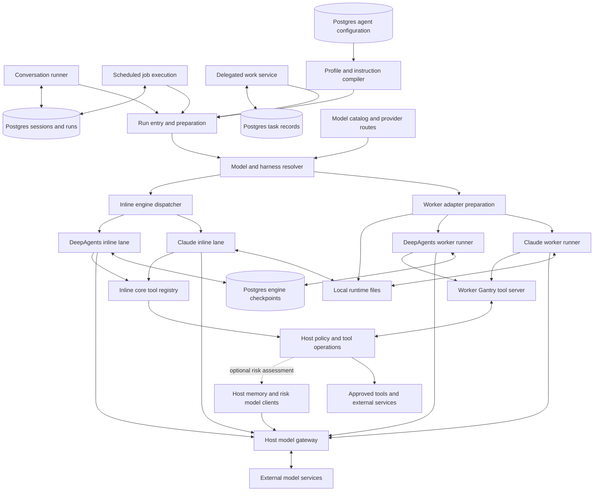
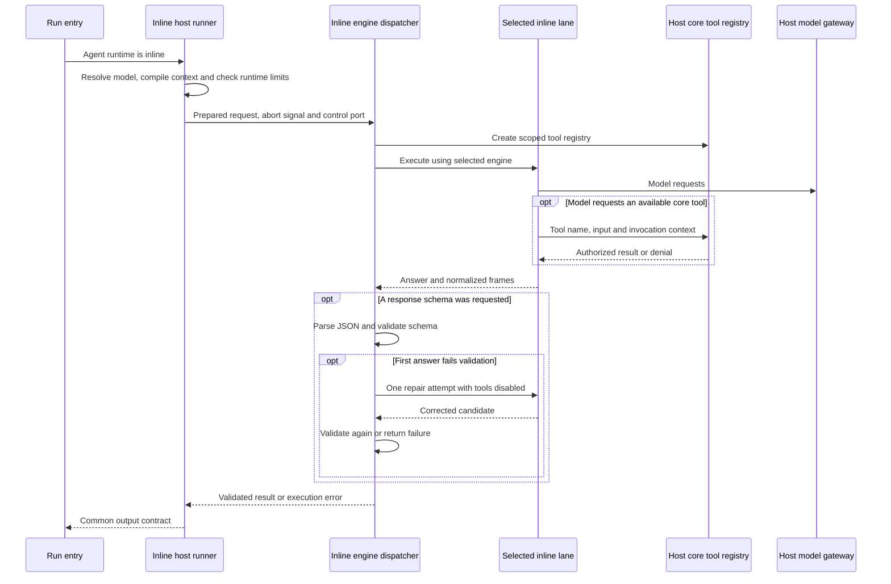
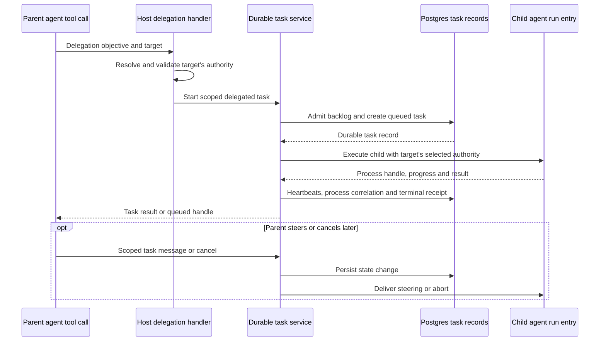

# Agents, runner and model engines

## 1. What this area does

This area gives each Gantry agent its working instructions, chosen model and approved abilities. It turns a conversation request or scheduled assignment into a model run, supplying the context the agent needs and collecting its answer and progress. Gantry supports two engines: the Claude Agent SDK and DeepAgents, which connects to OpenAI-compatible model services. Either engine can run through a separate runner process or an inline lane managed by the host, with different available tools. Gantry keeps session and work records so later conversations can continue and interrupted work can be identified; the model's request to use a tool still passes through Gantry's authority checks. Sources: [prompt profiles](../../../apps/core/src/application/agents/prompt-profile-service.ts), [runner entry](../../../apps/core/src/runtime/agent-spawn.ts), [engine registration](../../../apps/core/src/adapters/llm/default-runtime-adapters.ts), [inline admission](../../../apps/core/src/runtime/agent-spawn-admission.ts), and [session schema](../../../apps/core/src/adapters/storage/postgres/schema/sessions.ts).

## 2. Architecture diagram

The diagram has 25 nodes. “Worker” below means a child runner process; deployment roles such as `live-worker` are the host processes that launch or manage runs. `agentRuntime` chooses worker or inline execution; the agent-owned `agentHarness` chooses `auto`, `anthropic_sdk` or `deepagents`. With `auto`, the model provider determines the engine; an incompatible explicit harness fails before execution. Sources: [runtime selection](../../../apps/core/src/runtime/agent-spawn-preparation.ts), [model resolution](../../../apps/core/src/application/model-resolution/llm-profile-resolution-service.ts), and [execution route](../../../apps/core/src/shared/model-execution-route.ts).



Every node maps to the following current source. Edges show calls or projections, rather than granting authority merely by connecting components.

| Diagram node                                                          | Source paths and connection                                                                                                                                                                                                                                                                                                                                                                                                                                                                                     |
| --------------------------------------------------------------------- | --------------------------------------------------------------------------------------------------------------------------------------------------------------------------------------------------------------------------------------------------------------------------------------------------------------------------------------------------------------------------------------------------------------------------------------------------------------------------------------------------------------- |
| Conversation runner                                                   | [apps/core/src/runtime/group-agent-runner.ts](../../../apps/core/src/runtime/group-agent-runner.ts): loads session context, builds run input and invokes the run entry.                                                                                                                                                                                                                                                                                                                                         |
| Scheduled job execution                                               | [apps/core/src/jobs/execution-phases-run.ts](../../../apps/core/src/jobs/execution-phases-run.ts): prepares inherited agent authority and calls the same runner through job failover.                                                                                                                                                                                                                                                                                                                           |
| Delegated work service; Postgres task records                         | [apps/core/src/jobs/ipc-delegated-agent-execution.ts](../../../apps/core/src/jobs/ipc-delegated-agent-execution.ts), [async-delegated-agent-task.ts](../../../apps/core/src/jobs/async-delegated-agent-task.ts), and [task schema](../../../apps/core/src/adapters/storage/postgres/schema/async-tasks.ts): durable task before child execution.                                                                                                                                                                |
| Postgres sessions and runs                                            | [session schema](../../../apps/core/src/adapters/storage/postgres/schema/sessions.ts), [run schema](../../../apps/core/src/adapters/storage/postgres/schema/runs.ts), and [group-agent-runner.ts](../../../apps/core/src/runtime/group-agent-runner.ts): host session ownership, provider handles and run evidence.                                                                                                                                                                                             |
| Postgres agent configuration; Profile and instruction compiler        | [agent schema](../../../apps/core/src/adapters/storage/postgres/schema/agents.ts), [prompt-profile-service.ts](../../../apps/core/src/application/agents/prompt-profile-service.ts), and [agent-spawn-prompt.ts](../../../apps/core/src/runtime/agent-spawn-prompt.ts): role/configuration plus protected profile artifacts become bounded prompt sections. Profile content storage is detailed below.                                                                                                          |
| Run entry and preparation                                             | [apps/core/src/runtime/agent-spawn.ts](../../../apps/core/src/runtime/agent-spawn.ts), [agent-spawn-preparation.ts](../../../apps/core/src/runtime/agent-spawn-preparation.ts), and [agent-inline.ts](../../../apps/core/src/runtime/agent-inline.ts): runtime selection, preflight, prompt, credentials, skills and MCP projection.                                                                                                                                                                            |
| Model and harness resolver; Model catalog and provider routes         | [llm-profile-resolution-service.ts](../../../apps/core/src/application/model-resolution/llm-profile-resolution-service.ts), [model-catalog.ts](../../../apps/core/src/shared/model-catalog.ts), [model-provider-registry.ts](../../../apps/core/src/shared/model-provider-registry.ts), and [model-execution-route.ts](../../../apps/core/src/shared/model-execution-route.ts): alias, workload, provider route, credential modes and harness compatibility.                                                    |
| Worker adapter preparation                                            | [adapter registry](../../../apps/core/src/application/agent-execution/agent-execution-adapter-registry.ts), [Claude execution-adapter.ts](../../../apps/core/src/adapters/llm/anthropic-claude-agent/execution-adapter.ts), and [DeepAgents execution-adapter.ts](../../../apps/core/src/adapters/llm/deepagents-langchain/execution-adapter.ts): select runner entry and materialize engine-specific configuration.                                                                                            |
| Claude worker runner                                                  | [runner/index.ts](../../../apps/core/src/adapters/llm/anthropic-claude-agent/runner/index.ts) and [query-loop-phases-setup.ts](../../../apps/core/src/adapters/llm/anthropic-claude-agent/runner/query-loop-phases-setup.ts): SDK query, session persistence/resume, hooks and tool callback.                                                                                                                                                                                                                   |
| DeepAgents worker runner                                              | [runner/index.ts](../../../apps/core/src/adapters/llm/deepagents-langchain/runner/index.ts), [deep-agent-runner.ts](../../../apps/core/src/adapters/llm/deepagents-langchain/runner/deep-agent-runner.ts), and [model-factory.ts](../../../apps/core/src/adapters/llm/deepagents-langchain/runner/model-factory.ts): LangGraph execution, normalized stream and gateway-backed model construction.                                                                                                              |
| Inline engine dispatcher                                              | [apps/core/src/adapters/llm/inline-lane-dispatcher.ts](../../../apps/core/src/adapters/llm/inline-lane-dispatcher.ts) and [default-runtime-adapters.ts](../../../apps/core/src/adapters/llm/default-runtime-adapters.ts): engine dispatch and shared structured-response validation.                                                                                                                                                                                                                            |
| Claude inline lane; DeepAgents inline lane                            | [Claude inline-lane/index.ts](../../../apps/core/src/adapters/llm/anthropic-claude-agent/inline-lane/index.ts) and [DeepAgents inline-lane/index.ts](../../../apps/core/src/adapters/llm/deepagents-langchain/inline-lane/index.ts): project the host registry into each engine and authorize selected remote MCP tools.                                                                                                                                                                                        |
| Local runtime files                                                   | [claude-config-materializer.ts](../../../apps/core/src/adapters/llm/anthropic-claude-agent/claude-config-materializer.ts), [Claude inline lane](../../../apps/core/src/adapters/llm/anthropic-claude-agent/inline-lane/index.ts), and [agent-spawn.ts](../../../apps/core/src/runtime/agent-spawn.ts): generated settings/skills, SDK sessions, IPC and bounded logs.                                                                                                                                           |
| Postgres engine checkpoints                                           | [checkpoint-setup.ts](../../../apps/core/src/adapters/llm/deepagents-langchain/checkpoint-setup.ts), [session-store.ts](../../../apps/core/src/adapters/llm/deepagents-langchain/runner/session-store.ts), and [DeepAgents inline lane](../../../apps/core/src/adapters/llm/deepagents-langchain/inline-lane/index.ts): live LangGraph checkpoints keyed by provider session handle.                                                                                                                            |
| Host model gateway; External model services                           | [gantry-model-gateway.ts](../../../apps/core/src/adapters/llm/anthropic-claude-agent/gantry-model-gateway.ts), [gateway routing](../../../apps/core/src/adapters/llm/anthropic-claude-agent/gantry-model-gateway-routing.ts), and [provider registry](../../../apps/core/src/shared/model-provider-registry.ts): local run-scoped token, upstream credential injection, confined routes and forwarding. The gateway serves both engines despite its adapter directory name.                                     |
| Worker Gantry tool server                                             | [apps/core/src/runner/mcp/server.ts](../../../apps/core/src/runner/mcp/server.ts), [mcp/ipc.ts](../../../apps/core/src/runner/mcp/ipc.ts), and [DeepAgents mcp-tools.ts](../../../apps/core/src/adapters/llm/deepagents-langchain/runner/mcp-tools.ts): filtered tool registration and signed host requests; DeepAgents connects to the Gantry facade.                                                                                                                                                          |
| Inline core tool registry                                             | [apps/core/src/runtime/core-tools/registry.ts](../../../apps/core/src/runtime/core-tools/registry.ts) and [core-tool-permission-coordinator.ts](../../../apps/core/src/runtime/core-tools/core-tool-permission-coordinator.ts): tool definitions and host dispatch without the worker file transport. Selected remote MCP connections also use this registry's authorization callback.                                                                                                                          |
| Host policy and tool operations; Approved tools and external services | [permission-decision-coordinator.ts](../../../apps/core/src/runtime/permission-decision-coordinator.ts), [IPC dispatch](../../../apps/core/src/runtime/ipc.ts), [capability runner](../../../apps/core/src/jobs/ipc-capability-run-handler.ts), [browser tools](../../../apps/core/src/runner/mcp/tools/browser.ts), and [MCP proxy tools](../../../apps/core/src/runner/mcp/tools/mcp-proxy-tools.ts): host checks and scoped operations reach approved command, browser, memory, file and connector services. |

Model credentials stay in `modelCredentialEnv`; approved tool networking is projected through `toolNetworkEnv`. A request supplies work to attempt, while selected capabilities and host policy supply authority. Worker permission requests use signed request/response files; inline core tools call the host coordinator directly. The coordinator checks exact remembered denies, then hard deny, locked preset, fixed-image restrictions, reviewed authority and deterministic rails; trusted-root/remembered-allow handling and optional cached-classifier/risk-classifier stages depend on the caller, before durable human approval. The inline core-tool caller supplies no classifier stages. Sources: [spawn projection](../../../apps/core/src/runtime/agent-spawn.ts), [permission IPC client](../../../apps/core/src/runner/permission-ipc-client.ts), [host coordinator](../../../apps/core/src/runtime/permission-decision-coordinator.ts), [IPC permission service](../../../apps/core/src/runtime/ipc-permission-classifier-decision.ts), and [inline coordinator](../../../apps/core/src/runtime/core-tools/core-tool-permission-coordinator.ts).

The **Host memory and risk model clients** node is a separate host workload. The route-aware client chooses the model's transport, rather than an agent harness: Claude SDK for ordinary Anthropic memory queries, direct Anthropic Messages for requested single-shot queries, or gateway-backed HTTP chat completions for OpenAI-compatible routes. Supported provider batch operations also go through this client's batch capability. Sources: [route-aware-memory-llm-client.ts](../../../apps/core/src/adapters/llm/route-aware-memory-llm-client.ts), [default-runtime-adapters.ts](../../../apps/core/src/adapters/llm/default-runtime-adapters.ts), [memory-query.ts](../../../apps/core/src/adapters/llm/anthropic-claude-agent/memory-query.ts), [permission-classifier-llm-client.ts](../../../apps/core/src/adapters/llm/anthropic-claude-agent/permission-classifier-llm-client.ts), [openai-memory-llm-client.ts](../../../apps/core/src/adapters/llm/openai-memory/openai-memory-llm-client.ts), and [memory-gateway-injection.ts](../../../apps/core/src/adapters/llm/openai-memory/memory-gateway-injection.ts).

## 3. Key flows

### A live conversation turn through a worker runner

```mermaid
sequenceDiagram
    participant C as Conversation runner
    participant DB as Postgres session and run records
    participant E as Run entry
    participant A as Selected worker adapter
    participant W as Child engine runner
    participant G as Host model gateway
    participant M as External model service
    C->>DB: Load session and context; record run
    C->>E: Prompt, model alias, context and selected authority
    E->>E: Resolve harness and perform preflight
    E->>A: Prepare engine configuration and credentials
    A-->>E: Runner path, input patch and cleanup
    E->>W: Start process; send JSON on stdin
    W-->>C: Session-init frame through host parser
    C->>DB: Persist provider session handle
    W->>G: Model request with run-scoped token
    G->>M: Authorized upstream request
    M-->>G: Model stream
    G-->>W: Model stream
    W-->>C: Answer, activity, usage and terminal frames
    C->>DB: Session updates and run outcome
    E->>E: Revoke token and clean temporary projections
```

1. The conversation runner loads durable session context, memory context and selected access, then creates or adopts the run record. Its callers handle channel admission and delivery; this flow starts after admission. Source: [apps/core/src/runtime/group-agent-runner.ts](../../../apps/core/src/runtime/group-agent-runner.ts).
2. The run entry resolves the approved alias for the workload and checks agent harness compatibility, requested model controls and runtime/tool restrictions. A failure returns an error before runner launch. Sources: [agent-spawn-model-resolution.ts](../../../apps/core/src/runtime/agent-spawn-model-resolution.ts), [llm-profile-resolution-service.ts](../../../apps/core/src/application/model-resolution/llm-profile-resolution-service.ts), and [agent-spawn-admission.ts](../../../apps/core/src/runtime/agent-spawn-admission.ts).
3. The host compiles role, profile and generated operating guidance; profile instructions are advisory, not authority. It obtains model gateway credentials, materializes selected skills/MCP access and asks the chosen adapter for its runner specification. Sources: [agent-spawn.ts](../../../apps/core/src/runtime/agent-spawn.ts), [prompt-profile-service.ts](../../../apps/core/src/application/agents/prompt-profile-service.ts), [Claude adapter](../../../apps/core/src/adapters/llm/anthropic-claude-agent/execution-adapter.ts), and [DeepAgents adapter](../../../apps/core/src/adapters/llm/deepagents-langchain/execution-adapter.ts).
4. The host starts the child and writes JSON to stdin. Claude invokes the SDK; DeepAgents builds a model and graph. Both emit provider-neutral output frames; DeepAgents live runs read/write Postgres checkpoints, while Claude live queries persist SDK sessions. Sources: [agent-spawn-process.ts](../../../apps/core/src/runtime/agent-spawn-process.ts), [runner-frame.ts](../../../apps/core/src/runner/runner-frame.ts), [Claude setup](../../../apps/core/src/adapters/llm/anthropic-claude-agent/runner/query-loop-phases-setup.ts), [DeepAgents entry](../../../apps/core/src/adapters/llm/deepagents-langchain/runner/index.ts), and [DeepAgents graph](../../../apps/core/src/adapters/llm/deepagents-langchain/runner/deep-agent-runner.ts).
5. A session-init frame records the handle early without declaring the turn complete. The local model gateway validates its token and upstream route, obtains provider credentials on the host and streams the response back. Sources: [runner-frame.ts](../../../apps/core/src/runner/runner-frame.ts), [group-agent-runner.ts](../../../apps/core/src/runtime/group-agent-runner.ts), and [gantry-model-gateway.ts](../../../apps/core/src/adapters/llm/anthropic-claude-agent/gantry-model-gateway.ts).
6. Follow-up messages and close signals reach worker runners through watched IPC files. Claude feeds follow-ups into its SDK message stream; DeepAgents buffers mid-stream follow-ups and starts another graph turn after the current turn. The host consumes output frames and records the result; its `finally` block revokes run credentials and removes temporary MCP/sandbox configuration. Sources: [runtime-signal-pump.ts](../../../apps/core/src/runner/runtime-signal-pump.ts), [Claude setup](../../../apps/core/src/adapters/llm/anthropic-claude-agent/runner/query-loop-phases-setup.ts), [DeepAgents entry](../../../apps/core/src/adapters/llm/deepagents-langchain/runner/index.ts), [group-agent-runner.ts](../../../apps/core/src/runtime/group-agent-runner.ts), and [agent-spawn.ts](../../../apps/core/src/runtime/agent-spawn.ts).

### Inline execution and a structured answer



1. Runtime selection routes inline work to the host-managed inline runner. It prepares the prompt, model credentials, remote MCP selections, timeout and abort/control plumbing. “Inline” removes the Gantry child-runner boundary; Claude still uses the SDK's own subprocess internally. Sources: [agent-spawn-preparation.ts](../../../apps/core/src/runtime/agent-spawn-preparation.ts), [agent-inline.ts](../../../apps/core/src/runtime/agent-inline.ts), and [Claude inline lane](../../../apps/core/src/adapters/llm/anthropic-claude-agent/inline-lane/index.ts).
2. Preflight rejects worker-only tool authority and stdio MCP sources in inline mode. It also enforces the selected engine's skill restrictions; structured `response_schema` requests require inline runtime. Sources: [agent-spawn-admission.ts](../../../apps/core/src/runtime/agent-spawn-admission.ts) and [agent-runtime.ts](../../../apps/core/src/shared/agent-runtime.ts).
3. The dispatcher creates one scoped core-tool registry, then selects the Claude or DeepAgents lane from the resolved engine. Each lane translates those definitions for its library; selected remote MCP calls pass through host authorization. Sources: [default-runtime-adapters.ts](../../../apps/core/src/adapters/llm/default-runtime-adapters.ts), [inline-lane-dispatcher.ts](../../../apps/core/src/adapters/llm/inline-lane-dispatcher.ts), [core registry](../../../apps/core/src/runtime/core-tools/registry.ts), [Claude lane](../../../apps/core/src/adapters/llm/anthropic-claude-agent/inline-lane/index.ts), and [DeepAgents lane](../../../apps/core/src/adapters/llm/deepagents-langchain/inline-lane/index.ts).
4. Live Claude inline sessions use an isolated SDK configuration directory; live DeepAgents inline sessions use the same derived Postgres checkpoint schema as worker DeepAgents. Scheduled inline runs do not persist engine sessions. Sources: [Claude lane](../../../apps/core/src/adapters/llm/anthropic-claude-agent/inline-lane/index.ts), [DeepAgents lane](../../../apps/core/src/adapters/llm/deepagents-langchain/inline-lane/index.ts), and [default-runtime-adapters.ts](../../../apps/core/src/adapters/llm/default-runtime-adapters.ts).
5. If a response schema was supplied, the dispatcher validates JSON with Ajv. It permits one repair attempt with tools disabled and a bounded copy of the failed candidate; a second invalid answer becomes an explicit failure. Without a schema, the dispatcher returns the lane's result directly. Source: [apps/core/src/adapters/llm/inline-lane-dispatcher.ts](../../../apps/core/src/adapters/llm/inline-lane-dispatcher.ts).

### A scheduled assignment uses the same engines

```mermaid
sequenceDiagram
    participant S as Scheduler trigger
    participant J as Job execution
    participant DB as Postgres run and lease records
    participant E as Agent run entry
    participant W as Selected engine
    participant G as Host model gateway
    participant N as Outcome delivery
    S->>J: Due job dispatch
    J->>DB: Claim run lease and persist claim evidence
    DB-->>J: Lease token and fencing version
    J->>J: Read current agent access and check setup
    J->>E: Job prompt, alias, inherited authority; scheduled flag
    E->>W: Prepare worker or inline execution
    W->>G: Model requests for fresh engine session
    W-->>J: Progress, heartbeat, usage and result
    J->>DB: Finalize only while lease still belongs to worker
    DB-->>J: Accepted or fenced out
    J->>N: Deliver configured outcome after valid finalization
```

1. The pg-boss engine supplies a scheduler trigger; the execution code establishes the actual run and lease. A claim must have durable runner-control evidence before execution continues. Sources: [scheduler-engine.ts](../../../apps/core/src/infrastructure/pgboss/scheduler-engine.ts), [execution.ts](../../../apps/core/src/jobs/execution.ts), [execution-phases-setup.ts](../../../apps/core/src/jobs/execution-phases-setup.ts), and [execution-lease.ts](../../../apps/core/src/jobs/execution-lease.ts).
2. The run reads the bound agent's current access snapshot and inherits its selected tools, skills and MCP sources. Setup/readiness is checked again before invocation. A job's approved model alias can override defaults, but its harness remains agent-owned. Sources: [execution-phases-run.ts](../../../apps/core/src/jobs/execution-phases-run.ts), [model-resolution.ts](../../../apps/core/src/jobs/model-resolution.ts), and [agent-access-snapshot.ts](../../../apps/core/src/application/agent-execution/agent-access-snapshot.ts).
3. The runner receives `isScheduledJob`, lease identity, a job prompt and autonomous tool rules. Claude disables SDK session persistence and live follow-up input; DeepAgents executes without a checkpointer. Inline engines also skip live session persistence. Sources: [execution-phases-run.ts](../../../apps/core/src/jobs/execution-phases-run.ts), [Claude runner entry](../../../apps/core/src/adapters/llm/anthropic-claude-agent/runner/index.ts), [DeepAgents runner entry](../../../apps/core/src/adapters/llm/deepagents-langchain/runner/index.ts), [Claude inline lane](../../../apps/core/src/adapters/llm/anthropic-claude-agent/inline-lane/index.ts), and [DeepAgents inline lane](../../../apps/core/src/adapters/llm/deepagents-langchain/inline-lane/index.ts).
4. Runner activity/heartbeats inform liveness while the host renews its durable lease. Losing the lease aborts execution. Final state and notifications are guarded by lease token, worker identity and fencing version; an old worker cannot finalize a run another worker recovered. Sources: [execution-lease.ts](../../../apps/core/src/jobs/execution-lease.ts), [execution-phases-run.ts](../../../apps/core/src/jobs/execution-phases-run.ts), [Claude job heartbeat](../../../apps/core/src/adapters/llm/anthropic-claude-agent/runner/job-heartbeat.ts), [DeepAgents job heartbeat](../../../apps/core/src/adapters/llm/deepagents-langchain/runner/job-heartbeat.ts), and [inline runner](../../../apps/core/src/runtime/agent-inline.ts).
5. Outcome delivery uses the job's configured notification routes; run completion and notification success are separate facts. Sources: [execution-notifications.ts](../../../apps/core/src/jobs/execution-notifications.ts) and [delivery.ts](../../../apps/core/src/jobs/delivery.ts).

### Delegating work to another Gantry agent



1. The worker tool surface exposes delegation only when the host has task storage and the relevant authority; callable agent targets are projected from trusted configuration. The host resolves the target agent and its selected access rather than copying arbitrary permissions from the parent. Sources: [runner/mcp/server.ts](../../../apps/core/src/runner/mcp/server.ts), [agent-spawn-preparation.ts](../../../apps/core/src/runtime/agent-spawn-preparation.ts), [ipc-agent-delegation-target.ts](../../../apps/core/src/jobs/ipc-agent-delegation-target.ts), and [ipc-delegated-agent-execution.ts](../../../apps/core/src/jobs/ipc-delegated-agent-execution.ts).
2. The task service atomically checks app/agent backlog limits and saves a queued delegated task before enqueueing execution. This is Gantry task authority; provider-native subagent state does not replace it. Sources: [async-delegated-agent-task.ts](../../../apps/core/src/jobs/async-delegated-agent-task.ts) and [async-task-admission.ts](../../../apps/core/src/jobs/async-task-admission.ts).
3. The executor calls the same run entry with the target agent, selected tools/skills/MCP sources, a parent task identifier and an abort signal. It persists available process correlation and progress, then produces a terminal receipt. Sources: [ipc-delegated-agent-execution.ts](../../../apps/core/src/jobs/ipc-delegated-agent-execution.ts) and [async-delegated-agent-task.ts](../../../apps/core/src/jobs/async-delegated-agent-task.ts).
4. The parent can receive completion within a requested wait or receive a queued task handle. Callable delegation can persist an asynchronous follow-up after the wait expires. Task read, message and cancellation operations check scope; steering is recorded before delivery, and cancellation propagates to active execution and linked children. Sources: [task-lifecycle.ts](../../../apps/core/src/application/core-tools/task-lifecycle.ts), [async-delegated-agent-task.ts](../../../apps/core/src/jobs/async-delegated-agent-task.ts), [async-command-task-service.ts](../../../apps/core/src/jobs/async-command-task-service.ts), and [async-delegated-agent-follow-up.ts](../../../apps/core/src/jobs/async-delegated-agent-follow-up.ts).

## 4. Data it owns

Agent configuration and engine projections belong to this area. Session, run, artifact, task and coordination records are shared with the runtime, storage and scheduler areas; these engines consume or update them through the host.

| Table or file family                                | What it holds and source                                                                                                                                                                                                                                                                                                                                                                                                                 |
| --------------------------------------------------- | ---------------------------------------------------------------------------------------------------------------------------------------------------------------------------------------------------------------------------------------------------------------------------------------------------------------------------------------------------------------------------------------------------------------------------------------- |
| `agents`                                            | App-owned agent identity, active/offboarded status and current configuration pointer; [agents.ts](../../../apps/core/src/adapters/storage/postgres/schema/agents.ts).                                                                                                                                                                                                                                                                    |
| `agent_config_versions`                             | Versioned role/prompt references, LLM profile, selected capability/source references and runtime limits; [agents.ts](../../../apps/core/src/adapters/storage/postgres/schema/agents.ts).                                                                                                                                                                                                                                                 |
| `llm_profiles`                                      | Model alias, response family, thinking/budget settings and credential profile reference; [agents.ts](../../../apps/core/src/adapters/storage/postgres/schema/agents.ts).                                                                                                                                                                                                                                                                 |
| `custom_roles`                                      | App-owned role names and prompt text; [agents.ts](../../../apps/core/src/adapters/storage/postgres/schema/agents.ts) and [custom-role-service.ts](../../../apps/core/src/application/agents/custom-role-service.ts).                                                                                                                                                                                                                     |
| Protected `SOUL.md` / `AGENTS.md` profile artifacts | Agent-scoped advisory voice/instructions, with versioned `file_artifacts` descriptors and content storage references; [prompt-profile-service.ts](../../../apps/core/src/application/agents/prompt-profile-service.ts), [agent-profile-service.ts](../../../apps/core/src/application/agents/agent-profile-service.ts), and [file-artifacts.ts](../../../apps/core/src/adapters/storage/postgres/schema/file-artifacts.ts).              |
| `agent_sessions` / `provider_sessions`              | Host session ownership, model override and active provider resume handle/metadata; [sessions.ts](../../../apps/core/src/adapters/storage/postgres/schema/sessions.ts).                                                                                                                                                                                                                                                                   |
| `agent_runs`                                        | Configuration/model linkage, worker/provider correlation, status, result and error summaries; [runs.ts](../../../apps/core/src/adapters/storage/postgres/schema/runs.ts).                                                                                                                                                                                                                                                                |
| DeepAgents checkpoint schema                        | Library-owned live graph checkpoints and writes in the runtime storage schema with a derived `_deepagents` suffix; [execution-adapter.ts](../../../apps/core/src/adapters/llm/deepagents-langchain/execution-adapter.ts), [checkpoint-setup.ts](../../../apps/core/src/adapters/llm/deepagents-langchain/checkpoint-setup.ts), and [session-store.ts](../../../apps/core/src/adapters/llm/deepagents-langchain/runner/session-store.ts). |
| Claude worker runtime directory                     | Generated settings/selected skills and persistent live SDK project sessions under the workspace's `.llm-runtime` directory; [claude-config-materializer.ts](../../../apps/core/src/adapters/llm/anthropic-claude-agent/claude-config-materializer.ts).                                                                                                                                                                                   |
| Claude inline runtime directory                     | Isolated SDK configuration and live sessions under the runtime data directory's inline-Claude area; [inline-lane/index.ts](../../../apps/core/src/adapters/llm/anthropic-claude-agent/inline-lane/index.ts).                                                                                                                                                                                                                             |
| DeepAgents worker scratch directory                 | Per-run temporary configuration directory removed by normal cleanup; live continuity is in Postgres; [execution-adapter.ts](../../../apps/core/src/adapters/llm/deepagents-langchain/execution-adapter.ts).                                                                                                                                                                                                                              |
| IPC files and runner logs                           | Signed operation requests/replies, follow-up messages, close signals and bounded execution diagnostics; [mcp/ipc.ts](../../../apps/core/src/runner/mcp/ipc.ts), [runner-ipc-input.ts](../../../apps/core/src/runner/runner-ipc-input.ts), and [agent-spawn-process.ts](../../../apps/core/src/runtime/agent-spawn-process.ts).                                                                                                           |
| `agent_async_tasks`                                 | Delegated objective/correlation, task state, lease/fence, heartbeat, steering and terminal receipt; [async-tasks.ts](../../../apps/core/src/adapters/storage/postgres/schema/async-tasks.ts) and [async-delegated-agent-task.ts](../../../apps/core/src/jobs/async-delegated-agent-task.ts).                                                                                                                                             |
| Worker, lease, slot and control-event records       | Worker identity/capacity, expiring execution ownership and runner lifecycle evidence; [worker-coordination.ts](../../../apps/core/src/adapters/storage/postgres/schema/worker-coordination.ts).                                                                                                                                                                                                                                          |

The model catalog and provider registry are code-owned definitions, not engine-generated database state: [model-catalog.ts](../../../apps/core/src/shared/model-catalog.ts) and [model-provider-registry.ts](../../../apps/core/src/shared/model-provider-registry.ts). Selected access is loaded into an app/agent-scoped snapshot for a run: [agent-access-snapshot.ts](../../../apps/core/src/application/agent-execution/agent-access-snapshot.ts) and [group-run-context.ts](../../../apps/core/src/runtime/group-run-context.ts).

## 5. How it scales and fails

### Process roles and execution boundaries

| Host role     | What runs here                                                                                                                                            |
| ------------- | --------------------------------------------------------------------------------------------------------------------------------------------------------- |
| `all`         | Full control API, provider inbound, live execution, scheduled jobs and worker capability reconciliation.                                                  |
| `control`     | Full control API and settings writes; no provider inbound, live or scheduler execution.                                                                   |
| `live-worker` | Provider inbound and live turn execution, worker capability reconciliation and an operations-only API; no scheduler claiming.                             |
| `job-worker`  | Scheduler execution, toolchain bake consumption and worker capability reconciliation, with an operations-only API; no provider inbound or live admission. |

These are deployment-owned `GANTRY_PROCESS_ROLE` choices, with `all` as the default. Sources: [process-role.ts](../../../apps/core/src/app/bootstrap/roles/process-role.ts), [role-capabilities.ts](../../../apps/core/src/app/bootstrap/roles/role-capabilities.ts), and [runtime-services.ts](../../../apps/core/src/app/bootstrap/runtime-services.ts). Worker runners are child processes of an executing host; inline lanes are managed in that host and are not another deployment role. Sources: [agent-spawn-preparation.ts](../../../apps/core/src/runtime/agent-spawn-preparation.ts) and [agent-inline.ts](../../../apps/core/src/runtime/agent-inline.ts).

`direct` launches a runner without Gantry OS confinement or an inner Claude SDK sandbox. Its controls are host permissions, credential/protected-path rails and the deployment boundary. `sandbox_runtime` is optional outer whole-runner confinement on a supported host; its provider rejects Windows, requires a configuration file and requires the Gantry egress proxy for networked runs. DeepAgents uses a state backend for graph files and Gantry-owned shell/file/web facades rather than granting raw local filesystem or provider credential authority. Sources: [runner-sandbox-provider.ts](../../../apps/core/src/adapters/sandbox/runner-sandbox-provider.ts), [Claude query setup](../../../apps/core/src/adapters/llm/anthropic-claude-agent/runner/query-loop-phases-setup.ts), [DeepAgents graph](../../../apps/core/src/adapters/llm/deepagents-langchain/runner/deep-agent-runner.ts), and [gantry-facade-tools.ts](../../../apps/core/src/adapters/llm/deepagents-langchain/runner/gantry-facade-tools.ts).

### Capacity and durable ownership

Execution admission owns interactive, job and delegation model work. Current execution admission uses durable live-turn claims, job run leases/slots and delegated-task backlog admission. Live workers claim durable admission work and defer when capacity is unavailable. Scheduled work uses expiring Postgres slots for workspace/host limits and a fenced run lease. Delegation saves its task before launch and limits backlog per app and agent. Sources: [live-admission-work-loop.ts](../../../apps/core/src/runtime/live-admission-work-loop.ts), [live-turn-authority.ts](../../../apps/core/src/runtime/live-turn-authority.ts), [concurrency.ts](../../../apps/core/src/jobs/concurrency.ts), [execution-lease.ts](../../../apps/core/src/jobs/execution-lease.ts), and [async-task-admission.ts](../../../apps/core/src/jobs/async-task-admission.ts). pg-boss is the scheduled trigger; a job run record is execution evidence, not permission to bypass admission: [scheduler-engine.ts](../../../apps/core/src/infrastructure/pgboss/scheduler-engine.ts).

Agent/profile configuration, session/run ownership, task state and DeepAgents live checkpoints survive in durable storage. Adapter registries, active abort controllers, output accumulators, follow-up buffers, tool-success ledgers and gateway token maps are process memory. Worker IPC/configuration and Claude SDK continuity also depend on local files, so a durable host session handle alone does not make Claude portable to a worker without its SDK session files. Sources: [adapter registry](../../../apps/core/src/application/agent-execution/agent-execution-adapter-registry.ts), [inline runner](../../../apps/core/src/runtime/agent-inline.ts), [DeepAgents entry](../../../apps/core/src/adapters/llm/deepagents-langchain/runner/index.ts), [gateway](../../../apps/core/src/adapters/llm/anthropic-claude-agent/gantry-model-gateway.ts), [Claude materializer](../../../apps/core/src/adapters/llm/anthropic-claude-agent/claude-config-materializer.ts), and [session schema](../../../apps/core/src/adapters/storage/postgres/schema/sessions.ts).

### Restart, crash and invalid state

- **Before execution:** Unknown aliases, incompatible harnesses, unsupported controls, missing runner files/credentials and unsupported inline authority fail before model execution. Sources: [profile resolution](../../../apps/core/src/application/model-resolution/llm-profile-resolution-service.ts), [admission](../../../apps/core/src/runtime/agent-spawn-admission.ts), [Claude adapter](../../../apps/core/src/adapters/llm/anthropic-claude-agent/execution-adapter.ts), and [DeepAgents adapter](../../../apps/core/src/adapters/llm/deepagents-langchain/execution-adapter.ts).
- **During execution:** Worker timeout/idle-stall handling can kill the runner and return an error; inline cancellation aborts the lane. Normal cleanup revokes gateway credentials and removes temporary projections. A crash bypasses that cleanup and loses in-memory controls; gateway tokens are held in the crashed host's memory. Sources: [agent-spawn-process.ts](../../../apps/core/src/runtime/agent-spawn-process.ts), [agent-inline.ts](../../../apps/core/src/runtime/agent-inline.ts), [agent-spawn.ts](../../../apps/core/src/runtime/agent-spawn.ts), and [gateway](../../../apps/core/src/adapters/llm/anthropic-claude-agent/gantry-model-gateway.ts).
- **Resuming a conversation:** The host checks the provider session and its access fingerprint. A recognized missing engine session retires the stale reference and retries fresh on that provider; DeepAgents explicitly rejects a resume whose checkpoint is missing. Fresh context can come from persisted digests and memory. Sources: [group-agent-runner.ts](../../../apps/core/src/runtime/group-agent-runner.ts), [provider-session-access-fingerprint.ts](../../../apps/core/src/runtime/provider-session-access-fingerprint.ts), [session-store.ts](../../../apps/core/src/adapters/llm/deepagents-langchain/runner/session-store.ts), and [context hydration](../../../apps/core/src/application/sessions/hydrate-agent-context-service.ts).
- **Recovering ownership:** Live recovery has an elected coordinator; other live workers continue admitting turns. Scheduler leases/slots expire and fenced finalization rejects stale owners. Stale delegated tasks become failed receipts and tracked processes are terminated; queued tasks can be reconstructed by the recovery executor. Recovery does not guarantee exactly-once external tool side effects. Sources: [live-recovery-coordinator.ts](../../../apps/core/src/app/bootstrap/live-recovery-coordinator.ts), [execution-lease.ts](../../../apps/core/src/jobs/execution-lease.ts), [concurrency.ts](../../../apps/core/src/jobs/concurrency.ts), [async-command-task-service.ts](../../../apps/core/src/jobs/async-command-task-service.ts), and [runtime-services-async-task-recovery.ts](../../../apps/core/src/app/bootstrap/runtime-services-async-task-recovery.ts).

## 6. Video script outline

1. A conversation or scheduled assignment arrives with work for a named Gantry agent.
2. Gantry prepares that agent's role, voice, context and selected abilities before choosing the approved model.
3. The model's route leads to Claude Agent SDK or DeepAgents, while a separate choice determines worker or inline execution.
4. A local gateway supplies model access through a short-lived token, keeping provider credentials on the host.
5. The model can propose actions, but Gantry checks their authority and can request human approval before they proceed.
6. Progress and answers return through one common output contract, while durable records track the session and outcome.
7. When work is delegated or interrupted, saved task records and expiring ownership help Gantry report what finished, recover queued work or expose a failure.

These beats follow the four source-backed flows above and the gateway, policy and recovery boundaries in sections 2 and 5; they describe a 60–90 second explainer, not additional product behavior.

## 7. Duplication and simplification

### (a) Existing audit findings

The checked-in [Agents and engines audit][audit] is linked by its original titles below without repeating its findings or treating this documentation pass as a new runtime verification:

- [Inline agents cannot use the attachment reader their prompt requires][audit]
- [The second memory-save definition advertises unusable scopes][audit]
- [DeepAgents retains an unreachable direct-MCP implementation][audit]
- [Nine memory handlers copy an existing, unused response helper][audit]
- [Tool failure classification has four copies that already disagree][audit]
- [Skill-file reconciliation is implemented twice][audit]
- [OpenRouter preferences are translated twice][audit]

The report also identifies permission-gate work as covered by PERMFLOW-1, scheduled-denial/setup recovery by PERMFLOW-3/4, and acknowledgement/todo/progress instruction work by UX-1.

### (b) New items noticed during this trace

none new

[audit]: ../audits/2026-10-02-area-audit/04-agents-engines.md
