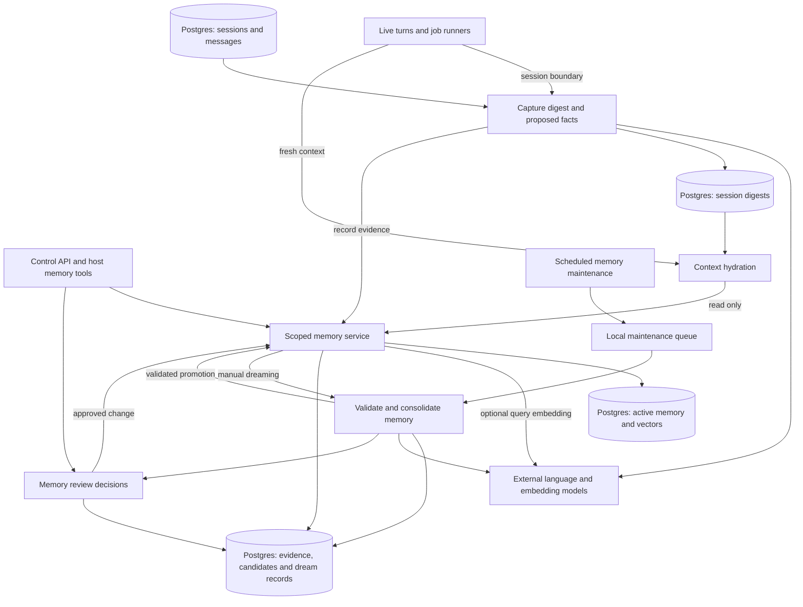
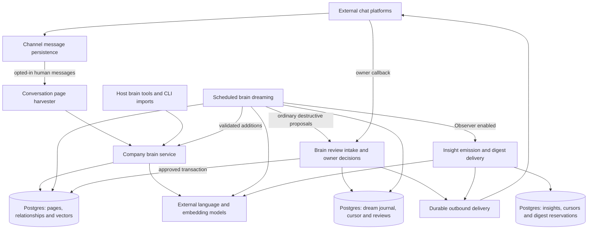
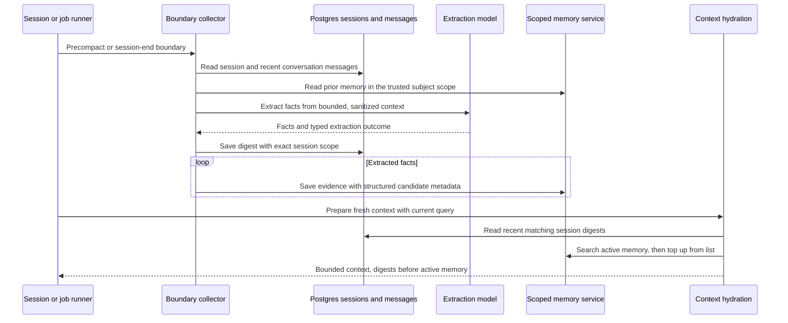
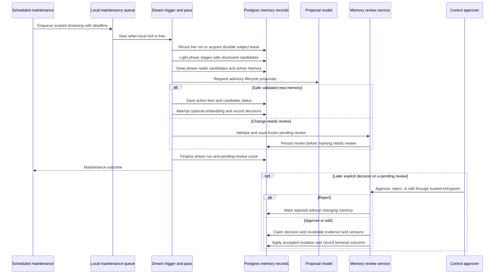
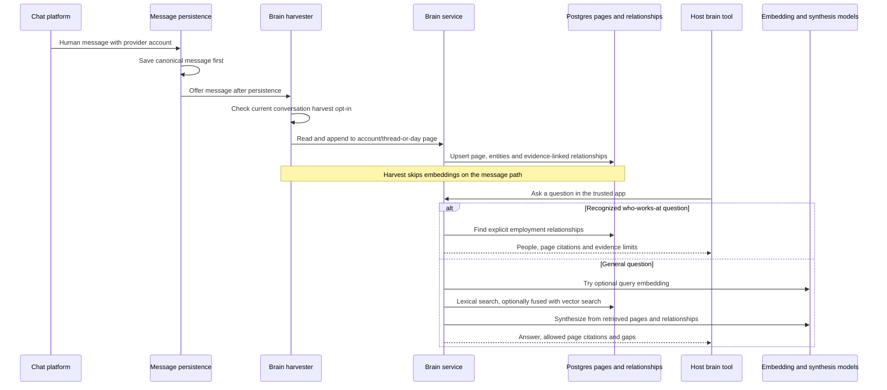
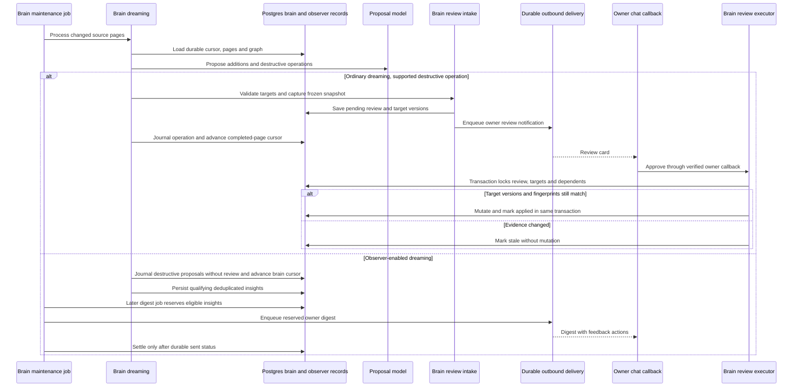

# Memory and company brain

## 1. What this area does

Gantry keeps useful preferences, facts, decisions, corrections, and constraints so an agent can remember them across conversations and fresh sessions. That memory belongs to an app, an agent, and a person or a whole conversation; a reply thread does not create a separate memory compartment. At session boundaries, Gantry captures a short digest and proposed facts, then background “dreaming” checks the evidence before making automatic durable changes. The company brain is a separate, app-wide collection of pages about people, companies, projects, and their relationships, populated by imports, agent writes, and explicitly opted-in conversations. It can answer questions with page citations, and its ordinary dreaming path asks the owner to review supported destructive changes; the current Observer-enabled path only journals those proposals. Sources: [memory service](../../../apps/core/src/memory/app-memory-service.ts), [subject resolver](../../../apps/core/src/memory/app-memory-subject-resolver.ts), [boundary capture](../../../apps/core/src/memory/boundary-extraction-core.ts), [dreaming](../../../apps/core/src/memory/app-memory-dreaming.ts), [brain service](../../../apps/core/src/brain/brain-service.ts), and [brain destructive handling](../../../apps/core/src/brain/brain-dream-destructive-op.ts).

## 2. Architecture diagram

These are calls and data movement, not separate deployments. Both diagrams use the same Postgres database and configured model/embedding services. The company brain does not replace scoped memory.

Every node is anchored below; stores are expanded in section 4.

| Node                                                                    | Current code                                                                                                                                                                                                                                                                                                                                                                                                    |
| ----------------------------------------------------------------------- | --------------------------------------------------------------------------------------------------------------------------------------------------------------------------------------------------------------------------------------------------------------------------------------------------------------------------------------------------------------------------------------------------------------- |
| Live turns and job runners                                              | [apps/core/src/runtime/group-processing.ts](../../../apps/core/src/runtime/group-processing.ts), [apps/core/src/jobs/compact-memory.ts](../../../apps/core/src/jobs/compact-memory.ts)                                                                                                                                                                                                                          |
| Capture digest and proposed facts; sessions and messages                | [apps/core/src/memory/app-memory-session-boundary-collector.ts](../../../apps/core/src/memory/app-memory-session-boundary-collector.ts), [boundary-extraction-core.ts](../../../apps/core/src/memory/boundary-extraction-core.ts), [session schema](../../../apps/core/src/adapters/storage/postgres/schema/sessions.ts), [message schema](../../../apps/core/src/adapters/storage/postgres/schema/messages.ts) |
| External language and embedding models, scoped memory                   | [apps/core/src/memory/memory-llm-port.ts](../../../apps/core/src/memory/memory-llm-port.ts), [apps/core/src/adapters/llm/default-runtime-adapters.ts](../../../apps/core/src/adapters/llm/default-runtime-adapters.ts), [apps/core/src/memory/memory-embeddings.ts](../../../apps/core/src/memory/memory-embeddings.ts)                                                                                         |
| Session digests; context hydration                                      | [apps/core/src/application/sessions/hydrate-agent-context-service.ts](../../../apps/core/src/application/sessions/hydrate-agent-context-service.ts), [apps/core/src/memory/app-memory-session-hydration.ts](../../../apps/core/src/memory/app-memory-session-hydration.ts), [session schema](../../../apps/core/src/adapters/storage/postgres/schema/sessions.ts)                                               |
| Control API and host memory tools                                       | [apps/core/src/control/server/routes/memory.ts](../../../apps/core/src/control/server/routes/memory.ts), [apps/core/src/memory/memory-ipc.ts](../../../apps/core/src/memory/memory-ipc.ts)                                                                                                                                                                                                                      |
| Scoped memory service; active memory and vectors                        | [apps/core/src/memory/app-memory-service.ts](../../../apps/core/src/memory/app-memory-service.ts), [memory schema](../../../apps/core/src/adapters/storage/postgres/schema/memory.ts), [embedding schema](../../../apps/core/src/adapters/storage/postgres/schema/schema.ts)                                                                                                                                    |
| Scheduled memory maintenance; local maintenance queue                   | [apps/core/src/jobs/system-jobs.ts](../../../apps/core/src/jobs/system-jobs.ts), [apps/core/src/memory/maintenance-queue.ts](../../../apps/core/src/memory/maintenance-queue.ts)                                                                                                                                                                                                                                |
| Validate and consolidate memory; evidence, candidates and dream records | [apps/core/src/memory/app-memory-trigger-dreaming.ts](../../../apps/core/src/memory/app-memory-trigger-dreaming.ts), [app-memory-dreaming.ts](../../../apps/core/src/memory/app-memory-dreaming.ts), [schema](../../../apps/core/src/adapters/storage/postgres/schema/schema.ts)                                                                                                                                |
| Memory review decisions                                                 | [apps/core/src/memory/app-memory-review-create.ts](../../../apps/core/src/memory/app-memory-review-create.ts), [app-memory-review.ts](../../../apps/core/src/memory/app-memory-review.ts), [memory-review-ipc.ts](../../../apps/core/src/memory/memory-review-ipc.ts)                                                                                                                                           |
| External chat platforms; channel message persistence                    | [apps/core/src/app/bootstrap/channel-wiring.ts](../../../apps/core/src/app/bootstrap/channel-wiring.ts), [channel-persistence-handlers.ts](../../../apps/core/src/app/bootstrap/channel-persistence-handlers.ts)                                                                                                                                                                                                |
| Conversation page harvester                                             | [apps/core/src/brain/brain-channel-harvest.ts](../../../apps/core/src/brain/brain-channel-harvest.ts), [brain-runtime.ts](../../../apps/core/src/brain/brain-runtime.ts)                                                                                                                                                                                                                                        |
| Host brain tools and CLI imports                                        | [apps/core/src/memory/memory-ipc-brain.ts](../../../apps/core/src/memory/memory-ipc-brain.ts), [apps/core/src/cli/brain.ts](../../../apps/core/src/cli/brain.ts)                                                                                                                                                                                                                                                |
| Company brain service; pages, relationships and vectors                 | [apps/core/src/brain/brain-service.ts](../../../apps/core/src/brain/brain-service.ts), [brain-page-ingest.ts](../../../apps/core/src/brain/brain-page-ingest.ts), [Postgres repository](../../../apps/core/src/adapters/storage/postgres/repositories/brain-repository.postgres.ts), [brain schema](../../../apps/core/src/adapters/storage/postgres/schema/brain.ts)                                           |
| External language and embedding models                                  | [apps/core/src/brain/brain-synthesis.ts](../../../apps/core/src/brain/brain-synthesis.ts), [brain-dream-proposer.ts](../../../apps/core/src/brain/brain-dream-proposer.ts), [apps/core/src/memory/memory-embeddings.ts](../../../apps/core/src/memory/memory-embeddings.ts)                                                                                                                                     |
| Scheduled brain dreaming; dream journal and cursor                      | [apps/core/src/jobs/system-jobs.ts](../../../apps/core/src/jobs/system-jobs.ts), [apps/core/src/brain/brain-dreaming.ts](../../../apps/core/src/brain/brain-dreaming.ts), [dream repository](../../../apps/core/src/adapters/storage/postgres/repositories/brain-dream-repository.postgres.ts)                                                                                                                  |
| Brain review intake and owner decisions; review records                 | [apps/core/src/brain/brain-dream-review-intake.ts](../../../apps/core/src/brain/brain-dream-review-intake.ts), [brain-dream-review-executor.ts](../../../apps/core/src/brain/brain-dream-review-executor.ts), [owner callback](../../../apps/core/src/app/bootstrap/runtime-brain-review-message-action.ts), [brain schema](../../../apps/core/src/adapters/storage/postgres/schema/brain.ts)                   |
| Durable outbound delivery                                               | [apps/core/src/brain/brain-dream-review-notify.ts](../../../apps/core/src/brain/brain-dream-review-notify.ts), [apps/core/src/app/bootstrap/brain-review-notify-gateway.ts](../../../apps/core/src/app/bootstrap/brain-review-notify-gateway.ts), [outbound recovery wiring](../../../apps/core/src/app/bootstrap/runtime-services.ts)                                                                          |
| Insight emission and digest delivery; insight stores                    | [apps/core/src/brain/observer-insight-emission.ts](../../../apps/core/src/brain/observer-insight-emission.ts), [observer-digest.ts](../../../apps/core/src/brain/observer-digest.ts), [apps/core/src/jobs/observer-digest-job.ts](../../../apps/core/src/jobs/observer-digest-job.ts), [observer schema](../../../apps/core/src/adapters/storage/postgres/schema/observer-insights.ts)                          |

## 3. Key flows

### A. Capture a session boundary, then remember it in a fresh run

1. Live compaction and successful job completion call the shared collector with a boundary reason; job completion adds the job prompt and result as turns. `/new` resets the provider session first and captures the replaced session in the background. Sources: [group-processing.ts](../../../apps/core/src/runtime/group-processing.ts), [compact-memory.ts](../../../apps/core/src/jobs/compact-memory.ts), and [runtime-services-active-new.ts](../../../apps/core/src/app/bootstrap/runtime-services-active-new.ts).
2. The collector reads the canonical session, up to 80 recent messages, and prior scoped memory. It bounds and sanitizes the context before extraction, including structural summaries of tool and large payloads. Sources: [app-memory-session-boundary-collector.ts](../../../apps/core/src/memory/app-memory-session-boundary-collector.ts), [boundary-extraction-core.ts](../../../apps/core/src/memory/boundary-extraction-core.ts), and [extractor-llm.ts](../../../apps/core/src/memory/extractor-llm.ts).
3. It writes the digest first, including exact session-scope and extraction-outcome metadata, then saves each extracted fact as evidence for dreaming. These are separate writes: a later evidence failure can leave a digest and only some evidence persisted. It does not automatically write active memory here. Sources: [boundary-extraction-core.ts](../../../apps/core/src/memory/boundary-extraction-core.ts) and [app-memory-service.ts](../../../apps/core/src/memory/app-memory-service.ts).
4. Fresh context loads recent persisted digests before active memory; digest scope must match app, agent, conversation, person, thread, and any job scope. Personal memory follows the person in a private conversation; group memory follows the whole conversation, across threads. Sources: [hydrate-agent-context-service.ts](../../../apps/core/src/application/sessions/hydrate-agent-context-service.ts), [app-memory-subject-resolver.ts](../../../apps/core/src/memory/app-memory-subject-resolver.ts), and [app-memory-session-hydration.ts](../../../apps/core/src/memory/app-memory-session-hydration.ts).
5. Query-aware hydration searches first and fills remaining places from a list, without recording recall events. Its `first_visible` mode disables query embeddings and defaults to a 250 ms statement timeout; full hydration can use hybrid recall. Missing digest or memory loaders supply empty sections. Sources: [app-memory-session-hydration.ts](../../../apps/core/src/memory/app-memory-session-hydration.ts) and [hydrate-agent-context-service.ts](../../../apps/core/src/application/sessions/hydrate-agent-context-service.ts).

### B. Dreaming turns evidence into durable memory or a review

1. Scheduled maintenance resolves the same person/conversation subject as live tools, joins the process-local queue, and passes an abortable deadline. Direct control-API and permitted host-tool dreaming calls reach the same durable trigger without requiring that queue. Sources: [system-jobs.ts](../../../apps/core/src/jobs/system-jobs.ts), [maintenance-queue.ts](../../../apps/core/src/memory/maintenance-queue.ts), [HTTP routes](../../../apps/core/src/control/server/routes/memory.ts), and [memory-ipc.ts](../../../apps/core/src/memory/memory-ipc.ts).
2. The trigger checks running subject/phase leases, expires stale runs, and acquires a new run when allowed. Light dreaming stages candidates only from validated structured evidence metadata, never by turning arbitrary raw evidence text into active memory. Sources: [app-memory-trigger-dreaming.ts](../../../apps/core/src/memory/app-memory-trigger-dreaming.ts), [app-memory-dreaming.ts](../../../apps/core/src/memory/app-memory-dreaming.ts), and [lease helpers](../../../apps/core/src/adapters/storage/postgres/schema/schema.ts).
3. Deep dreaming revalidates candidates, evidence, scope, allowed kinds, confidence, and sensitive material. Model proposals are advisory; contradictions and supported retire/rewrite/merge proposals go to review. A validated promotion can save an active item and attempt its embedding; embedding failure does not undo the saved item. Sources: [app-memory-dreaming.ts](../../../apps/core/src/memory/app-memory-dreaming.ts), [candidate guardrails](../../../apps/core/src/memory/app-memory-dreaming-candidate-guardrails.ts), and [memory-llm-proposals.ts](../../../apps/core/src/memory/memory-llm-proposals.ts).
4. Review intake stores the proposed change, evidence, target versions, and a readable snapshot before marking a candidate as needing review. Decision entrypoints verify control-approver authority and trusted scope; rejection leaves memory unchanged, while approval or editing rechecks evidence grounding and current item versions. Memory review claims and application are separate durable steps, unlike brain review's single transaction; see section 7. Sources: [app-memory-review-create.ts](../../../apps/core/src/memory/app-memory-review-create.ts), [review routing](../../../apps/core/src/memory/app-memory-dreaming-review-routing.ts), [memory-review-ipc.ts](../../../apps/core/src/memory/memory-review-ipc.ts), [channel callback](../../../apps/core/src/app/bootstrap/runtime-memory-review-message-action.ts), and [app-memory-review.ts](../../../apps/core/src/memory/app-memory-review.ts).
5. Dreaming records decisions and finalizes success or failure with pending-review counts. Dry runs can journal unapplied decisions but do not stage candidates or promote items. Sources: [app-memory-trigger-dreaming.ts](../../../apps/core/src/memory/app-memory-trigger-dreaming.ts) and [app-memory-dreaming.ts](../../../apps/core/src/memory/app-memory-dreaming.ts).

Explicit saves are a separate authorized path: `memory_save` and direct HTTP saves accept preference, decision, fact, correction, and constraint kinds; common/global writes require admin or service authority. They save directly, without turn-time item embedding writes. Host tools derive scope from trusted context rather than payload identity hints. Sources: [memory-ipc-parsing.ts](../../../apps/core/src/memory/memory-ipc-parsing.ts), [memory-ipc.ts](../../../apps/core/src/memory/memory-ipc.ts), [HTTP routes](../../../apps/core/src/control/server/routes/memory.ts), and [app-memory-service.ts](../../../apps/core/src/memory/app-memory-service.ts).

### C. An opted-in message becomes a company page that can answer questions

1. After saving a non-bot, non-self message, channel persistence offers it to harvesting. Harvest failure warns without failing the already-persisted message. The runtime tap reads current settings, so opt-in changes apply without restart. Sources: [channel-persistence-handlers.ts](../../../apps/core/src/app/bootstrap/channel-persistence-handlers.ts) and [brain-runtime.ts](../../../apps/core/src/brain/brain-runtime.ts).
2. Harvest requires an unambiguous provider account and a matching opted-in conversation. It appends a deduplicated, timestamped line to an account/conversation page partitioned by thread or UTC day, and refuses to overwrite a non-channel page at the same slug. Sources: [brain-channel-harvest.ts](../../../apps/core/src/brain/brain-channel-harvest.ts).
3. The brain service parses page metadata and Markdown, upserts the page, and derives entities and evidence-linked relationships. These normal writes are successive repository calls, not one page-and-graph transaction. Harvest disables immediate embedding; CLI imports and agent page writes also use this service. Sources: [brain-service.ts](../../../apps/core/src/brain/brain-service.ts), [brain-page-ingest.ts](../../../apps/core/src/brain/brain-page-ingest.ts), [brain repository](../../../apps/core/src/adapters/storage/postgres/repositories/brain-repository.postgres.ts), [CLI](../../../apps/core/src/cli/brain.ts), and [memory-ipc-brain.ts](../../../apps/core/src/memory/memory-ipc-brain.ts).
4. The recognized employment question uses stored `works_at` edges directly. Other questions search within the app, using lexical retrieval and optional vector rank fusion, then synthesize from the retrieved pages and graph. Returned model citation identifiers are restricted to retrieved pages. Sources: [brain-service.ts](../../../apps/core/src/brain/brain-service.ts), [brain-recall.ts](../../../apps/core/src/brain/brain-recall.ts), and [brain-synthesis.ts](../../../apps/core/src/brain/brain-synthesis.ts).

### D. Brain dreaming proposes an owner-reviewed change, or emits Observer insights

1. The app-wide system job scans source pages after the saved `(updated_at, page_id)` cursor; pages created by dreaming are excluded. It asks the configured proposal model for operations on each page and graph. Sources: [system-jobs.ts](../../../apps/core/src/jobs/system-jobs.ts), [brain-dreaming.ts](../../../apps/core/src/brain/brain-dreaming.ts), [brain-dream-proposer.ts](../../../apps/core/src/brain/brain-dream-proposer.ts), and [dream repository](../../../apps/core/src/adapters/storage/postgres/repositories/brain-dream-repository.postgres.ts).
2. Validated additions can apply immediately. In ordinary dreaming, supported destructive operations go through intake, capturing target versions, before/after information and dependent fingerprints; `retire_page` is deferred and only journaled. Notification enqueue is best effort after durable review creation. Sources: [brain-dreaming.ts](../../../apps/core/src/brain/brain-dreaming.ts), [brain-dream-destructive-op.ts](../../../apps/core/src/brain/brain-dream-destructive-op.ts), [brain-dream-review-intake.ts](../../../apps/core/src/brain/brain-dream-review-intake.ts), and [brain-dream-review-notify.ts](../../../apps/core/src/brain/brain-dream-review-notify.ts).
3. A channel callback must match the current verified owner's person, conversation, and provider account. Approval locks the review and its targets, verifies versions and dependent fingerprints, then applies the mutation and terminal state in one transaction. Drift becomes stale; retryable infrastructure errors roll back to pending. Sources: [runtime-brain-review-message-action.ts](../../../apps/core/src/app/bootstrap/runtime-brain-review-message-action.ts), [runtime-brain-review-wiring.ts](../../../apps/core/src/app/bootstrap/runtime-brain-review-wiring.ts), and [brain-dream-review-executor.ts](../../../apps/core/src/brain/brain-dream-review-executor.ts).
4. Observer-enabled dreaming uses another path: destructive proposals are journaled without review creation, while insight drafts are filtered and deduplicated against stored insights, patterns, and active memory. Missing embeddings pauses insight emission. Sources: [brain-dreaming.ts](../../../apps/core/src/brain/brain-dreaming.ts), [brain-dream-destructive-op.ts](../../../apps/core/src/brain/brain-dream-destructive-op.ts), and [observer-insight-emission.ts](../../../apps/core/src/brain/observer-insight-emission.ts).
5. A later digest tick applies owner-local timing, quiet hours, freshness checks, and a durable daily reservation. It retries unsettled reservations before selecting new insights, and settles members only after the outbound message is durably sent; feedback is handled through owner-only callbacks. Sources: [observer-digest.ts](../../../apps/core/src/brain/observer-digest.ts), [observer-evidence-freshness.ts](../../../apps/core/src/brain/observer-evidence-freshness.ts), [observer-digest-job.ts](../../../apps/core/src/jobs/observer-digest-job.ts), and [runtime-observer-feedback-message-action.ts](../../../apps/core/src/app/bootstrap/runtime-observer-feedback-message-action.ts).

## 4. Data it owns

All canonical area data below is in Postgres. Imported Markdown files are inputs, not the live company-brain store ([CLI import](../../../apps/core/src/cli/brain.ts)).

| Table or file                        | What it holds                                                                                                                                                                                                                                  |
| ------------------------------------ | ---------------------------------------------------------------------------------------------------------------------------------------------------------------------------------------------------------------------------------------------- |
| `memory_items`                       | Canonical flattened active/deleted scoped facts, kinds, confidence, evidence references and versions ([schema](../../../apps/core/src/adapters/storage/postgres/schema/memory.ts)).                                                            |
| `agent_session_digests`              | Boundary digest text, exact session scope, extraction outcome and counts; shared with session continuity ([schema](../../../apps/core/src/adapters/storage/postgres/schema/sessions.ts)).                                                      |
| `memory_evidence`                    | Scoped source text and structured candidate/safety metadata ([schema](../../../apps/core/src/adapters/storage/postgres/schema/schema.ts)).                                                                                                     |
| `memory_candidates`                  | Staged proposed items, evidence identifiers, confidence and promotion/review status ([schema](../../../apps/core/src/adapters/storage/postgres/schema/schema.ts)).                                                                             |
| `memory_recall_events`               | Recall use, query hash, subject metadata and score for returned items ([schema](../../../apps/core/src/adapters/storage/postgres/schema/schema.ts)).                                                                                           |
| `memory_dream_runs`                  | Subject, phase, lease expiry, run status and summary ([schema](../../../apps/core/src/adapters/storage/postgres/schema/schema.ts)).                                                                                                            |
| `memory_dream_decisions`             | Proposed/applied/skipped/blocked decisions, rationale and evidence references ([schema](../../../apps/core/src/adapters/storage/postgres/schema/schema.ts)).                                                                                   |
| `memory_review_requests`             | Frozen proposals and snapshots, versions, reviewer decisions and application outcomes ([schema](../../../apps/core/src/adapters/storage/postgres/schema/schema.ts)).                                                                           |
| `memory_item_embeddings`             | Provider/model/content-hash keyed item vectors, attempts, retry state and provider-batch identifiers ([schema](../../../apps/core/src/adapters/storage/postgres/schema/schema.ts)).                                                            |
| `embedding_cache`                    | Text-hash/model keyed reusable embeddings and last-use timestamps ([schema](../../../apps/core/src/adapters/storage/postgres/schema/schema.ts)).                                                                                               |
| `memory_embedding_backfill_runs`     | Backfill scope, mode, counters, pause reasons, resume times and errors ([schema](../../../apps/core/src/adapters/storage/postgres/schema/schema.ts)).                                                                                          |
| `pattern_candidates`                 | Repeated-intent candidates, scoped evidence, observation windows and status ([schema](../../../apps/core/src/adapters/storage/postgres/schema/pattern-candidates.ts)).                                                                         |
| `brain_pages`                        | App-wide Markdown bodies, slugs, titles, source identity and parsed metadata ([schema](../../../apps/core/src/adapters/storage/postgres/schema/brain.ts)).                                                                                     |
| `brain_entities`                     | App-wide normalized people, companies, projects and topics ([schema](../../../apps/core/src/adapters/storage/postgres/schema/brain.ts)).                                                                                                       |
| `brain_edges`                        | Typed relationships between entities, each tied to an evidence page ([schema](../../../apps/core/src/adapters/storage/postgres/schema/brain.ts)).                                                                                              |
| `brain_page_embeddings`              | Provider/model/content-hash keyed page vectors and indexing errors ([schema](../../../apps/core/src/adapters/storage/postgres/schema/brain.ts)).                                                                                               |
| `brain_dream_state`                  | The app's completed-page cursor ([schema](../../../apps/core/src/adapters/storage/postgres/schema/brain.ts)).                                                                                                                                  |
| `brain_dream_decisions`              | Brain operation proposals and applied/no-op/rejected/proposed outcomes ([schema](../../../apps/core/src/adapters/storage/postgres/schema/brain.ts)).                                                                                           |
| `brain_dream_reviews`                | Frozen destructive operation, review snapshot, owner identity and terminal outcome ([schema](../../../apps/core/src/adapters/storage/postgres/schema/brain.ts)).                                                                               |
| `brain_dream_review_targets`         | Each review's target kind, identifier, expected version and open-target conflict state ([schema](../../../apps/core/src/adapters/storage/postgres/schema/brain.ts)).                                                                           |
| `proactive_insights`                 | Observer insight content, evidence versions, embeddings and delivery/cooldown state ([schema](../../../apps/core/src/adapters/storage/postgres/schema/observer-insights.ts)).                                                                  |
| `observer_insight_cursors`           | Observer source-page progress, separate from brain dreaming progress ([schema](../../../apps/core/src/adapters/storage/postgres/schema/observer-insights.ts)).                                                                                 |
| `observer_deliveries`                | Per-app/recipient/local-day digest reservation, route, frozen rendered message and settlement state ([schema](../../../apps/core/src/adapters/storage/postgres/schema/observer-insights.ts)).                                                  |
| `observer_delivery_insights`         | Membership and claim time for insights reserved into a digest ([schema](../../../apps/core/src/adapters/storage/postgres/schema/observer-insights.ts)).                                                                                        |
| `observer_insight_feedback`          | Owner resolve/dismiss/snooze/less-like-this decisions ([schema](../../../apps/core/src/adapters/storage/postgres/schema/observer-insights.ts)).                                                                                                |
| `observer_insight_type_suppressions` | Per-recipient/type suppression windows from feedback ([schema](../../../apps/core/src/adapters/storage/postgres/schema/observer-insights.ts)).                                                                                                 |
| `chat_batches`                       | Submission intent, request/result snapshots, provider correlation, accounting and state for the currently unmounted chat-batch coordinator; see section 7 ([schema](../../../apps/core/src/adapters/storage/postgres/schema/chat-batches.ts)). |

Shared dependencies include sessions/messages for capture, scheduler jobs/runs for maintenance, and outbound delivery records for review cards and digests ([session schema](../../../apps/core/src/adapters/storage/postgres/schema/sessions.ts), [message schema](../../../apps/core/src/adapters/storage/postgres/schema/messages.ts), [job schema](../../../apps/core/src/adapters/storage/postgres/schema/jobs.ts), [outbound schema](../../../apps/core/src/adapters/storage/postgres/schema/outbound-delivery.ts)). Permission decision memory is a separate authority feature, not automatic fact memory ([permission decision service](../../../apps/core/src/application/permissions/human-decision-memory-service.ts)).

## 5. How it scales and fails

### Process roles

Roles come from `GANTRY_PROCESS_ROLE`, with `all` as the default. The role controls inbound/live/scheduler work, not where memory is stored. Sources: [process-role.ts](../../../apps/core/src/app/bootstrap/roles/process-role.ts), [role-capabilities.ts](../../../apps/core/src/app/bootstrap/roles/role-capabilities.ts), and [runtime-services.ts](../../../apps/core/src/app/bootstrap/runtime-services.ts).

| Role          | This area's work                                                                                                                                                                           |
| ------------- | ------------------------------------------------------------------------------------------------------------------------------------------------------------------------------------------ |
| `all`         | Full control API, provider inbound and live turns, session hydration/capture, review callbacks, scheduler maintenance and outbound recovery.                                               |
| `control`     | Full memory control API, including explicit admin mutations and dreaming triggers; no provider inbound, live execution or scheduler loop. API-triggered service work runs in this process. |
| `live-worker` | Provider inbound, harvesting, live-turn hydration/capture and interaction callbacks; ops-only API and no scheduler claiming.                                                               |
| `job-worker`  | Scheduler dreaming/backfills/digests and job boundary capture; outbound-only channel connections and ops-only API, without provider inbound or live execution.                             |

The gates and channel connection modes are implemented in [role-capabilities.ts](../../../apps/core/src/app/bootstrap/roles/role-capabilities.ts), [runtime-services.ts](../../../apps/core/src/app/bootstrap/runtime-services.ts), and [channel-wiring.ts](../../../apps/core/src/app/bootstrap/channel-wiring.ts); scheduler collector wiring is in [runtime-scheduler-start.ts](../../../apps/core/src/app/bootstrap/runtime-scheduler-start.ts).

### Durable state and local limits

- Postgres retains memory, digests, brain pages/graph, vectors, review decisions, maintenance progress and Observer reservations across process restarts. Scoped item uniqueness ignores thread identity; digests retain exact session scope. Sources: [memory schema](../../../apps/core/src/adapters/storage/postgres/schema/memory.ts), [brain schema](../../../apps/core/src/adapters/storage/postgres/schema/brain.ts), [session scope checks](../../../apps/core/src/application/sessions/hydrate-agent-context-service.ts), and [subject normalization](../../../apps/core/src/memory/app-memory-boundaries.ts).
- Each process has its own singleton memory facade, bounded serial maintenance queue, harvest per-page promise chains and continuity-injection status cache. Pending queue tasks and harvest chains disappear on crash; they are not durable scheduling authority. Multiple processes are coordinated for memory dreaming through Postgres leases, but harvesting's read-modify-write protection is local to one harvester. Sources: [app-memory-service.ts](../../../apps/core/src/memory/app-memory-service.ts), [maintenance-queue.ts](../../../apps/core/src/memory/maintenance-queue.ts), [brain-channel-harvest.ts](../../../apps/core/src/brain/brain-channel-harvest.ts), [brain-runtime.ts](../../../apps/core/src/brain/brain-runtime.ts), and [session-continuity-injection-status.ts](../../../apps/core/src/application/sessions/session-continuity-injection-status.ts).
- Memory uses lexical full-text retrieval even without embeddings. When a query vector is available, ready vectors matching current content hashes add semantic recall through rank fusion; query embedding failures fall back to lexical search. Live recall reads item vectors rather than indexing items. Sources: [app-memory-recall.ts](../../../apps/core/src/memory/app-memory-recall.ts), [app-memory-recall-hybrid.ts](../../../apps/core/src/memory/app-memory-recall-hybrid.ts), and [app-memory-recall-embedding.ts](../../../apps/core/src/memory/app-memory-recall-embedding.ts).
- Memory embedding writes occur during dreaming promotion/update and resumable backfill. Backfill can pause on budget, quota, rate-limit or retryable errors, and can submit provider batches for later polling/import. Brain page writes can embed immediately; harvest/dream callers deliberately skip that work and scheduled brain backfill catches up. Vectors use the current 1536-dimension schema. Sources: [app-memory-trigger-dreaming.ts](../../../apps/core/src/memory/app-memory-trigger-dreaming.ts), [app-memory-backfill.ts](../../../apps/core/src/memory/app-memory-backfill.ts), [provider batch polling](../../../apps/core/src/memory/app-memory-backfill-provider-batch.ts), [brain-service.ts](../../../apps/core/src/brain/brain-service.ts), [brain-dreaming.ts](../../../apps/core/src/brain/brain-dreaming.ts), and [vector schemas](../../../apps/core/src/adapters/storage/postgres/schema/schema.ts).

### Restart and crash behavior

- A memory dream deadline aborts work and records a failed run; a crashed process leaves a lease that a later trigger expires before replacing it. Promotion, candidate status, decision logging and embedding are separate writes, so a failure can leave partial progress rather than roll back the whole pass. Sources: [app-memory-trigger-dreaming.ts](../../../apps/core/src/memory/app-memory-trigger-dreaming.ts) and [app-memory-dreaming.ts](../../../apps/core/src/memory/app-memory-dreaming.ts).
- Brain dreaming saves its cursor after each completed page, so a crash before cursor advancement can revisit that page. Operation writes, journal writes and cursor advancement are separate; this is not an exactly-once batch transaction. Normal page writes can also leave the page saved before graph replacement finishes. Sources: [brain-dreaming.ts](../../../apps/core/src/brain/brain-dreaming.ts), [brain-dream-repository.postgres.ts](../../../apps/core/src/adapters/storage/postgres/repositories/brain-dream-repository.postgres.ts), and [brain-service.ts](../../../apps/core/src/brain/brain-service.ts).
- Brain review approval rolls back to pending on a crash or retryable database failure; deterministic mutation failures become failed without retaining partial mutation. Memory review approval currently has a claim/apply gap that can leave a review approved but unfinished; it should not be described as having the same recovery guarantee. Sources: [brain-dream-review-executor.ts](../../../apps/core/src/brain/brain-dream-review-executor.ts) and [app-memory-review.ts](../../../apps/core/src/memory/app-memory-review.ts).
- Startup re-enqueues pending brain reviews lacking an outbound record, and durable outbound recovery sends recorded deliveries. If owner notification setup is unavailable, the review remains stored and visible through the CLI; manual re-notify can send a new generation to the current owner. Observer digest ticks retry unsettled reservations, including previous days, subject to quiet hours. Sources: [brain-runtime.ts](../../../apps/core/src/brain/brain-runtime.ts), [brain-dream-review-notify.ts](../../../apps/core/src/brain/brain-dream-review-notify.ts), [CLI](../../../apps/core/src/cli/brain.ts), [runtime-services.ts](../../../apps/core/src/app/bootstrap/runtime-services.ts), and [observer-digest.ts](../../../apps/core/src/brain/observer-digest.ts).
- Brain query embedding failures fall back to lexical retrieval; page embedding failures are recorded. An unconfigured synthesis model or malformed synthesis JSON falls back to an extractive answer, but a thrown model request error propagates to the caller. Sources: [brain-service.ts](../../../apps/core/src/brain/brain-service.ts), [brain-recall.ts](../../../apps/core/src/brain/brain-recall.ts), and [brain-synthesis.ts](../../../apps/core/src/brain/brain-synthesis.ts).

## 6. Video script outline

These beats narrate the code-backed flows above, in order, for a 60–90 second explainer.

1. Gantry keeps a small set of useful facts and decisions so a fresh session can still remember what matters.
2. Personal memory belongs to the person and agent, while shared conversation memory follows the whole conversation across its reply threads.
3. At a session boundary, Gantry saves a short digest and proposed facts with their evidence instead of automatically accepting everything said.
4. Background dreaming checks those proposals, promotes safe memories, and puts changes needing a decision into a review queue.
5. The company brain is a shared library of pages and relationships built from imports, agent writes, and conversations the owner has opted in.
6. Questions search that library and return page citations, while ordinary brain dreaming sends supported destructive changes to the owner for review.
7. With Observer enabled, qualifying insights can become a timed owner digest, although destructive proposals currently stay in the journal without a review.
8. Postgres keeps the records across restarts, while local queues and unfinished steps still have the recovery limits described here.

## 7. Duplication and simplification

### (a) Existing audit findings

The links below point to the checked-in area audit. Titles are cited without reproducing the findings.

- [Enabling Observer removes the brain review path — parallel](../audits/2026-10-02-area-audit/05-memory-brain.md)
- [Brain rewrite reviews hide the actual change — UX](../audits/2026-10-02-area-audit/05-memory-brain.md)
- [The exposed `rem` dreaming phase does nothing — dead](../audits/2026-10-02-area-audit/05-memory-brain.md)
- [Hybrid recall implements rank fusion twice — duplicate](../audits/2026-10-02-area-audit/05-memory-brain.md)
- [Hydration duplicates ordinary read-only queries — duplicate](../audits/2026-10-02-area-audit/05-memory-brain.md)
- [Brain proposals accept redundant field spellings — over-complicated](../audits/2026-10-02-area-audit/05-memory-brain.md)
- [Harvest and dreaming duplicate frontmatter serialization — duplicate](../audits/2026-10-02-area-audit/05-memory-brain.md)

### (b) New observations

1. **Memory and brain reviews have different crash contracts — parallel / UX.** Memory commits an approved claim at [apps/core/src/memory/app-memory-review.ts:181](../../../apps/core/src/memory/app-memory-review.ts#L181), applies at [app-memory-review.ts:236](../../../apps/core/src/memory/app-memory-review.ts#L236), then finalizes at [app-memory-review.ts:245](../../../apps/core/src/memory/app-memory-review.ts#L245); [app-memory-service.ts:627](../../../apps/core/src/memory/app-memory-service.ts#L627) passes the normal database and non-transaction-bound mutation callbacks. A crash or thrown apply error between those calls can leave an approved row excluded from pending listings and unable to be claimed again. Brain's parallel decision path at [apps/core/src/brain/brain-dream-review-executor.ts:119](../../../apps/core/src/brain/brain-dream-review-executor.ts#L119) locks, applies and finalizes in one transaction. **Survive:** separate subject validation and mutation rules for the two stores, with the brain path's atomic decision contract also used for memory; remove memory's independently committed claim. **Size: story**, because memory mutation callbacks need a transaction-bound contract.
2. **The extracted core memory-tool helper is unused beside its live copy — duplicate / dead.** The live wrapper at [apps/core/src/runtime/core-tools/registry.ts:558](../../../apps/core/src/runtime/core-tools/registry.ts#L558) builds trusted context, calls memory IPC and formats the response; [apps/core/src/runtime/core-tools/memory-result.ts:26](../../../apps/core/src/runtime/core-tools/memory-result.ts#L26) repeats that work but has no imports in production or tests. Their identity handling already differs: the unused copy rejects a missing agent identifier while the live copy derives one from the folder. **Survive:** the live registry wrapper and canonical IPC subject validation; delete the unreferenced extracted file. **Size: fix.**
3. **The chat-batch coordinator has no production caller — dead / over-complicated.** [apps/core/src/memory/chat-batch-state-machine.ts:55](../../../apps/core/src/memory/chat-batch-state-machine.ts#L55) implements durable submit/poll/reconcile/apply coordination, and [apps/core/src/memory/chat-batch-mode.ts:14](../../../apps/core/src/memory/chat-batch-mode.ts#L14) selects batch mode, but repository-wide TypeScript imports occur only in tests. The current brain proposer calls the configured model client directly at [apps/core/src/brain/brain-dream-proposer.ts:84](../../../apps/core/src/brain/brain-dream-proposer.ts#L84), without this coordinator. **Survive:** the active proposal path and provider client capabilities; delete the unmounted coordinator and selector rather than depicting them as a deployed service. **Size: fix** for the unused modules; removing their [chat_batches schema](../../../apps/core/src/adapters/storage/postgres/schema/chat-batches.ts) would require separate schema cleanup.
