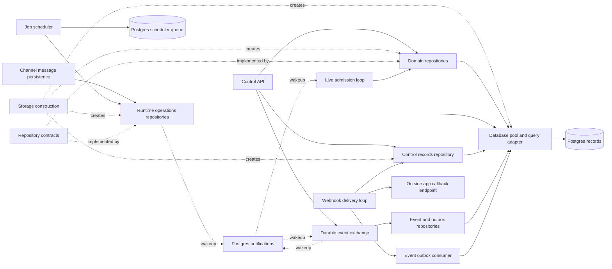
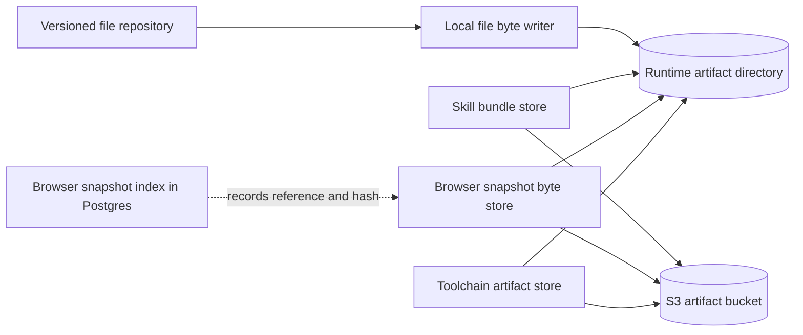
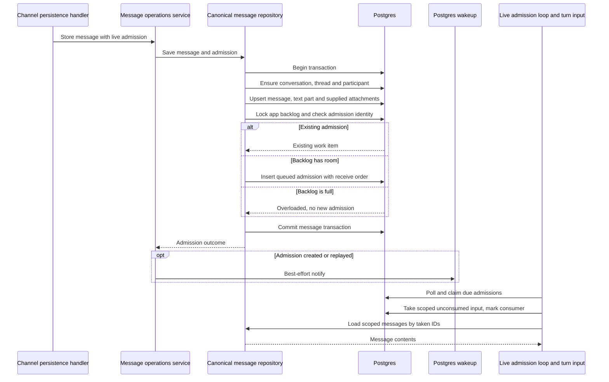
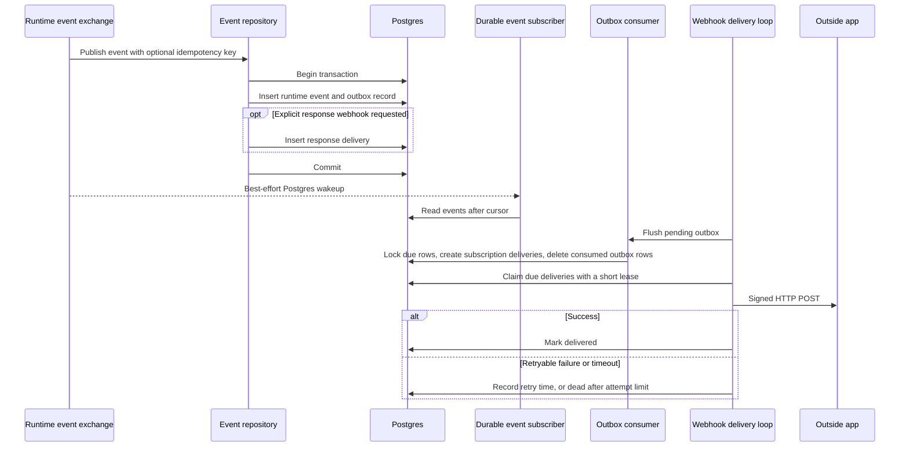
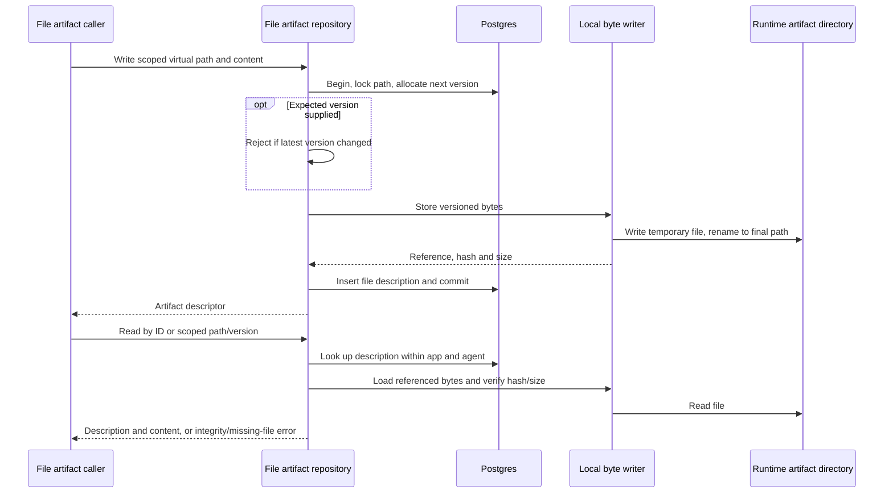

# Storage adapters and repositories

## 1. What this area does

Gantry's storage area keeps the records that let work continue beyond one running process: conversations, messages, agents, jobs, approvals and results. It translates the rest of Gantry's requests into reads and writes in Postgres, through repository contracts ([contracts][ports], [runtime operations][ops-port], [construction][factory]). It also records which worker owns a run, so a worker whose ownership has expired cannot overwrite the replacement worker's result ([lease implementation][leases]). File contents live separately from their database descriptions: generated files use local disk, while skill bundles and browser snapshots can use local disk or S3 ([storage selection][factory]). Notifications tell other processes that something changed, but those processes read the durable records to discover the actual work ([event exchange][exchange], [live admission notifications][live-notify]).

## 2. Architecture diagram

The first diagram shows records and coordination; the second shows artifact bytes. Dashed arrows mean construction, contract implementation or a wakeup, rather than a transfer of durable business records. Postgres and S3 are external services; repositories, listeners and consumers are objects inside Gantry processes, not separate deployed services ([construction][factory], [process wiring][app-index]).



| Diagram node                    | Current code or store definition                                                                                                                                                                   |
| ------------------------------- | -------------------------------------------------------------------------------------------------------------------------------------------------------------------------------------------------- |
| Channel message persistence     | `apps/core/src/app/bootstrap/channel-persistence-handlers.ts`; receiving code waits for persistence before returning.                                                                              |
| Control API                     | `apps/core/src/control/server/index.ts`; uses the runtime storage accessors and starts the webhook loop.                                                                                           |
| Job scheduler                   | `apps/core/src/infrastructure/pgboss/scheduler-engine.ts`.                                                                                                                                         |
| Postgres scheduler queue        | The `pgboss` schema, initialized in `apps/core/src/adapters/storage/postgres/storage-service.ts`; queue names are in the scheduler engine above.                                                   |
| Storage construction            | `apps/core/src/adapters/storage/postgres/factory.ts`.                                                                                                                                              |
| Repository contracts            | `apps/core/src/domain/ports/repositories.ts`, `apps/core/src/domain/ports/worker-coordination.ts`, `apps/core/src/domain/ports/live-turns.ts` and `apps/core/src/domain/repositories/ops-repo.ts`. |
| Domain repositories             | `apps/core/src/adapters/storage/postgres/repositories/domain-repositories.postgres.ts`, `createPostgresDomainRepositories`.                                                                        |
| Runtime operations repositories | `apps/core/src/adapters/storage/postgres/schema/canonical-ops-repo.postgres.ts`; delegates to canonical message, job, session and binding services.                                                |
| Control records repository      | `apps/core/src/adapters/storage/postgres/repositories/control-plane-repository.postgres.ts`.                                                                                                       |
| Database pool and query adapter | `apps/core/src/adapters/storage/postgres/storage-service.ts`: a `pg.Pool` and Drizzle database handle.                                                                                             |
| Postgres records                | `apps/core/src/adapters/storage/postgres/schema/schema.ts` and its exports through `apps/core/src/adapters/storage/postgres/schema/index.ts`.                                                      |
| Durable event exchange          | `apps/core/src/application/runtime-events/runtime-event-exchange.ts`.                                                                                                                              |
| Event and outbox repositories   | `apps/core/src/adapters/storage/postgres/repositories/runtime-event-repository.postgres.ts` and `apps/core/src/adapters/storage/postgres/repositories/event-bus-outbox.postgres.ts`.               |
| Postgres notifications          | `apps/core/src/adapters/storage/postgres/runtime-event-notifier.postgres.ts` and `apps/core/src/adapters/storage/postgres/live-admission-notify.postgres.ts`.                                      |
| Live admission loop             | `apps/core/src/runtime/live-admission-work-loop.ts`; reads and claims through the live-turn repository contract.                                                                                   |
| Event outbox consumer           | `apps/core/src/adapters/storage/postgres/repositories/event-bus-outbox.postgres.ts`; projects subscriptions into webhook delivery rows.                                                            |
| Webhook delivery loop           | `apps/core/src/control/server/webhook-delivery.ts`.                                                                                                                                                |
| Outside app callback endpoint   | The registered URL in `apps/core/src/adapters/storage/postgres/schema/control-http.ts`; HTTP POST implementation in `apps/core/src/control/server/webhook-delivery.ts`.                            |



| Diagram node                       | Current code or store definition                                                                                                                                                                                                                                                   |
| ---------------------------------- | ---------------------------------------------------------------------------------------------------------------------------------------------------------------------------------------------------------------------------------------------------------------------------------- |
| Versioned file repository          | `apps/core/src/adapters/storage/postgres/repositories/file-artifact-repository.postgres.ts`; database descriptions live in `file_artifacts`.                                                                                                                                       |
| Local file byte writer             | `apps/core/src/adapters/artifacts/files/local-file-artifact-bytes.ts`.                                                                                                                                                                                                             |
| Runtime artifact directory         | `ARTIFACTS_DIR` in `apps/core/src/config/index.ts`; file bytes are under its `files` directory, selected in `apps/core/src/adapters/storage/postgres/factory.ts`.                                                                                                                  |
| Skill bundle store                 | `apps/core/src/adapters/artifacts/skills/local-skill-artifact-store.ts`, `apps/core/src/adapters/artifacts/skills/s3-skill-artifact-store.ts` and `apps/core/src/adapters/artifacts/skills/remote-first-skill-artifact-store.ts`; selected in the storage factory.                 |
| S3 artifact bucket                 | `apps/core/src/adapters/artifacts/skills/s3-artifact-client.ts`; bucket/client settings supplied by the storage factory and toolchain bootstraps.                                                                                                                                  |
| Browser snapshot byte store        | `apps/core/src/adapters/artifacts/browser-profiles/local-browser-profile-artifact-store.ts` and `apps/core/src/adapters/artifacts/browser-profiles/s3-browser-profile-artifact-store.ts`; selected in the storage factory.                                                         |
| Browser snapshot index in Postgres | `apps/core/src/adapters/storage/postgres/repositories/browser-profile-snapshot-repository.postgres.ts` and `apps/core/src/adapters/storage/postgres/schema/browser.ts`.                                                                                                            |
| Toolchain artifact store           | `apps/core/src/adapters/artifacts/toolchains/local-toolchain-artifact-store.ts` and `apps/core/src/adapters/artifacts/toolchains/s3-toolchain-artifact-store.ts`; constructed in `apps/core/src/jobs/toolchain-bake-bootstrap.ts` and `apps/core/src/app/bootstrap/fleet-boot.ts`. |

The local/S3 arrows show configuration choices. Skills under S3 use remote authority with best-effort local cache warming; generated file artifacts still use local bytes even when the artifact driver is S3 ([factory][factory], [remote-first skills][remote-skills]). Toolchain stores are constructed outside the storage factory; Postgres holds their build status and byte references in `runtime_dependencies` ([bake bootstrap][bake], [fleet bootstrap][fleet], [schema][schema-fleet]).

## 3. Key flows

### A. Save a channel message and make it available for a turn



1. For a routed human message, the channel persistence handler calls `storeMessageWithLiveAdmission` once per matching agent route and waits for the persistence queue; an unrouted or bot message uses `storeMessage` ([`apps/core/src/app/bootstrap/channel-persistence-handlers.ts`][channel-persist]).
2. The runtime bundle delegates through `CanonicalMessageOpsService` to the canonical message repository. One transaction ensures the conversation graph and writes the message, its first text part and any supplied attachments ([`apps/core/src/adapters/storage/postgres/schema/canonical-ops-repo.postgres.ts`][ops-bundle], [`apps/core/src/adapters/storage/postgres/services/canonical-message-ops-service.ts`][message-service], [`apps/core/src/adapters/storage/postgres/repositories/canonical-message-repository.postgres.ts`][message-repo]).
3. Admission creation takes an app-scoped transaction lock before checking existing identity and active backlog. A duplicate returns the existing item; a full backlog returns `overloaded` without adding an item, while the message transaction can still commit. This is persistence of the message, not a guarantee that an agent has accepted it for execution ([`apps/core/src/adapters/storage/postgres/repositories/live-admission-work-item-repository.postgres.ts`][admissions]).
4. After commit, the service sends a best-effort notification for created or replayed admissions. The live admission loop also polls Postgres, claims queued/due/expired work with row locks that skip other workers' locks, and renews its claim during processing ([`apps/core/src/adapters/storage/postgres/live-admission-notify.postgres.ts`][live-notify], [`apps/core/src/runtime/live-admission-work-loop.ts`][admission-loop]).
5. Turn input consumption separately marks an owner on unconsumed records in database receive order, scoped by app, conversation, thread, agent and provider account. It then loads each message by its taken ID; message lookup checks the matching admission scope. Presentation can reorder a batch by provider timestamp, with receive order used for ties, so database take order and displayed order are distinct ([`apps/core/src/adapters/storage/postgres/repositories/live-admission-work-item-repository.postgres.ts`][admissions], [`apps/core/src/runtime/group-processing-flow.ts`][turn-input], [`apps/core/src/adapters/storage/postgres/repositories/canonical-message-repository.postgres.ts`][message-repo]).

### B. Claim and finish a scheduled job without accepting a stale worker's result

```mermaid
sequenceDiagram
    participant Queue as Postgres scheduler queue
    participant Worker as Scheduler worker
    participant Ops as Job operations service
    participant Repo as Job and lease repositories
    participant PG as Postgres
    Queue->>Worker: Due job trigger
    Worker->>Ops: Claim job run with worker identity
    Ops->>Repo: Claim due run
    Repo->>PG: Begin, lock job and check schedule/status
    Repo->>PG: Insert or recover agent run
    Repo->>PG: Issue token and higher ownership version
    Repo->>PG: Mark job running, commit
    Repo-->>Worker: Lease, or no claim
    opt Claim won
        Worker->>PG: Persist claimed runner-control evidence
        Worker->>Worker: Execute admitted work
        Worker->>Ops: Finish with token, worker and version
        Ops->>Repo: Finalize run and job under lease
        Repo->>PG: Check live fence; update run and job; settle lease
        PG-->>Worker: Committed, or stale completion refused
    end
```

1. The scheduler uses pg-boss to deliver due triggers, then runtime admission and capacity checks decide whether work can run. pg-boss is a trigger mechanism; the runtime admission queue governs execution, implemented in this checkout by `GroupQueue` and its admission helpers ([`apps/core/src/infrastructure/pgboss/scheduler-engine.ts`][scheduler], [`apps/core/src/infrastructure/pgboss/scheduler-admission.ts`][scheduler-admission], [`apps/core/src/runtime/group-queue.ts`][run-admission], [`apps/core/src/runtime/runtime-admission.ts`][admission-priority]).
2. `claimSchedulerRunLease` calls the operations port. The job service and repository reach `claimDueCanonicalJobRunStart`, which locks the job, verifies it is active and due, inserts or recovers its `agent_runs` record, and obtains a lease in the same transaction ([`apps/core/src/jobs/execution-lease.ts`][job-execution-lease], [`apps/core/src/adapters/storage/postgres/services/canonical-job-ops-service.ts`][job-service], [`apps/core/src/adapters/storage/postgres/repositories/canonical-job-claim.postgres.ts`][job-claim], [`apps/core/src/adapters/storage/postgres/repositories/canonical-job-run-insert.postgres.ts`][job-insert]).
3. A live lease blocks another claimant. Recovery expires lapsed leases and issues a fresh token with a higher fencing version, meaning a higher ownership number. The worker persists its `claimed` runner-control event before proceeding; failure to persist that evidence fails the claimed run ([`apps/core/src/adapters/storage/postgres/repositories/worker-coordination-lease.postgres.ts`][leases], [`apps/core/src/jobs/execution-lease.ts`][job-execution-lease]).
4. Terminal finalization updates the run and job and settles the lease in one transaction. It checks run ID, token, worker, version, active status and expiry; a stale fence returns false, and failure to finish the matching job/lease rolls the transaction back ([`apps/core/src/adapters/storage/postgres/repositories/canonical-job-repository.postgres.ts`][job-repo], [`apps/core/src/adapters/storage/postgres/repositories/run-lease-fence.postgres.ts`][run-fence], [`apps/core/src/jobs/execution-phases-run.ts`][job-run]).
5. Scheduler maintenance releases running jobs with no live run lease, marks still-running records timed out and expires their leases. It then reloads jobs and synchronizes scheduling; boot does not indiscriminately clear another worker's valid lease ([`apps/core/src/adapters/storage/postgres/repositories/canonical-job-lease-release.postgres.ts`][job-release], [`apps/core/src/infrastructure/pgboss/scheduler-engine.ts`][scheduler]).

### C. Record an event, wake readers and deliver an outside callback



1. The exchange publishes through `PostgresRuntimeEventRepository`. A transaction inserts the event and event-bus outbox record, plus any required explicit response-webhook delivery. Reusing an app/idempotency key returns the original event without inserting another outbox record ([`apps/core/src/application/runtime-events/runtime-event-exchange.ts`][exchange], [`apps/core/src/adapters/storage/postgres/repositories/runtime-event-repository.postgres.ts`][event-repo]).
2. After commit, notifications are best-effort. A durable subscription stores its current cursor in memory and repeatedly queries events after that cursor, checking at most every 15 seconds while waiting even if no notification arrives ([`apps/core/src/adapters/storage/postgres/runtime-event-notifier.postgres.ts`][event-notify], [`apps/core/src/application/runtime-events/runtime-event-exchange.ts`][exchange]).
3. The outbox consumer locks due rows with `SKIP LOCKED`, matches enabled app subscriptions and filters, inserts unique webhook/event delivery pairs and deletes consumed outbox rows in the same transaction. The durable event itself remains in `runtime_events`; this consumer projects to webhooks, rather than sending to an external message broker ([`apps/core/src/adapters/storage/postgres/repositories/event-bus-outbox.postgres.ts`][outbox]).
4. The delivery loop atomically claims due rows, increments attempts and sets a 15-second claim window before sending outside Postgres. It validates the destination and signs the body; a successful response marks the row delivered. Retryable HTTP responses and transport errors schedule another attempt, with failure becoming dead at the attempt limit; permanent HTTP failures can become dead earlier ([`apps/core/src/adapters/storage/postgres/repositories/control-plane-webhook-claim.postgres.ts`][webhook-claim], [`apps/core/src/control/server/webhook-delivery.ts`][webhook]).
5. If a process crashes after the receiver accepts the callback but before the delivered mark commits, the expired claim can be sent again. Delivery is therefore retryable, not exactly once; the event ID is sent as `x-gantry-webhook-id` for receiver deduplication. These are outbound callbacks, distinct from signed inbound `/v1/ingresses` ([`apps/core/src/control/server/webhook-delivery.ts`][webhook], [`apps/core/src/adapters/storage/postgres/repositories/control-plane-webhook-claim.postgres.ts`][webhook-claim], [`apps/core/src/adapters/storage/postgres/repositories/control-plane-external-ingress.postgres.ts`][ingress-repo]).

### D. Save and read a versioned file



1. Callers use the `FileArtifactStore` contract; for example, agent profile updates write through it. The factory binds that port to `PostgresFileArtifactStore` with `LocalFileArtifactBytes` ([`apps/core/src/domain/ports/file-artifact-store.ts`][file-port], [`apps/core/src/application/agents/agent-profile-service.ts`][agent-profile], [`apps/core/src/adapters/storage/postgres/factory.ts`][factory]).
2. The repository normalizes scope and virtual path, locks the app/agent/scope/path within a transaction and allocates the next version. An optional expected version detects a concurrent edit before byte writing ([`apps/core/src/adapters/storage/postgres/repositories/file-artifact-repository.postgres.ts`][file-repo]).
3. The byte writer creates a temporary file under the artifact root and renames it into place, returning a hash and size. The repository then inserts the database description. Known constraint rejection removes the new bytes; an uncertain database outcome retains them rather than risking deletion of committed content. Postgres and disk do not share one atomic commit, so a crash can leave unreferenced bytes ([`apps/core/src/adapters/artifacts/files/local-file-artifact-bytes.ts`][file-bytes], [`apps/core/src/adapters/storage/postgres/repositories/file-artifact-repository.postgres.ts`][file-repo]).
4. Reads always filter by app and agent, select the requested or latest non-deleted version, and verify bytes against the stored hash and size. Missing files and integrity mismatches surface as errors; a database description alone cannot recreate the contents ([`apps/core/src/adapters/storage/postgres/repositories/file-artifact-repository.postgres.ts`][file-repo], [`apps/core/src/adapters/artifacts/files/local-file-artifact-bytes.ts`][file-bytes]).

## 4. Data it owns

These are physical schema responsibilities; the corresponding feature areas own their business rules. Each source link identifies the schema file under `apps/core/src/adapters/storage/postgres/schema/`. Schema-only records are called out rather than presented as active runtime stores.

| Table                                         | What it holds                                                                                                          | Source                                                        |
| --------------------------------------------- | ---------------------------------------------------------------------------------------------------------------------- | ------------------------------------------------------------- |
| `apps`                                        | Application boundaries and status.                                                                                     | [apps.ts][schema-apps]                                        |
| `users`                                       | Canonical people, including service people linked to agents.                                                           | [apps.ts][schema-apps]                                        |
| `user_aliases`                                | Provider/account-specific external identities, evidence and retirement state.                                          | [apps.ts][schema-apps]                                        |
| `person_merge_audit`                          | Person merge results and conflict decisions.                                                                           | [apps.ts][schema-apps]                                        |
| `identity_offboarding_audit`                  | Durable person/agent offboarding results.                                                                              | [apps.ts][schema-apps]                                        |
| `agents`                                      | Agent names, status and current configuration reference.                                                               | [agents.ts][schema-agents]                                    |
| `agent_config_versions`                       | Versioned agent model, prompt, capability and runtime-limit snapshots.                                                 | [agents.ts][schema-agents]                                    |
| `llm_profiles`                                | Model aliases, response families, budgets and credential-profile references.                                           | [agents.ts][schema-agents]                                    |
| `custom_roles`                                | App-owned role names and prompts.                                                                                      | [agents.ts][schema-agents]                                    |
| `providers`                                   | Provider names and capability flags.                                                                                   | [providers.ts][schema-providers]                              |
| `provider_accounts`                           | Agent-owned provider installation configuration and runtime-secret references.                                         | [providers.ts][schema-providers]                              |
| `conversation_installs`                       | Agent bindings to conversations/topics, sender policy and control policy.                                              | [providers.ts][schema-providers]                              |
| `conversations`                               | Conversation identity, kind, title and provider account.                                                               | [conversations.ts][schema-conversations]                      |
| `conversation_threads`                        | Thread/topic identity within a conversation.                                                                           | [conversations.ts][schema-conversations]                      |
| `conversation_participants`                   | Provider participant identities and membership status.                                                                 | [conversations.ts][schema-conversations]                      |
| `conversation_approvers`                      | Conversation-scoped control approvers and person/alias references.                                                     | [conversations.ts][schema-conversations]                      |
| `messages`                                    | Message identity, route, sender, direction and delivery state.                                                         | [messages.ts][schema-messages]                                |
| `message_parts`                               | Ordered text or structured message payloads.                                                                           | [messages.ts][schema-messages]                                |
| `message_attachments`                         | Attachment metadata, byte references, provider-fetch details and deletion state.                                       | [messages.ts][schema-messages]                                |
| `message_attachment_deletion_markers`         | Durable deletion evidence used to keep removed attachments from being restored by replay.                              | [messages.ts][schema-messages]                                |
| `conversation_history_coverage`               | Provider-generation-scoped progress and completeness for fetched history.                                              | [conversation-history-coverage.ts][schema-coverage]           |
| `agent_sessions`                              | Agent-owned conversation/person/job scope, reset state and latest provider-session pointer.                            | [sessions.ts][schema-sessions]                                |
| `provider_sessions`                           | Provider resume handles, status, metadata and context high-water mark.                                                 | [sessions.ts][schema-sessions]                                |
| `agent_session_summaries`                     | Stored extractive session summaries and their source ranges.                                                           | [sessions.ts][schema-sessions]                                |
| `agent_session_digests`                       | Persisted session digests with explicit scope metadata.                                                                | [sessions.ts][schema-sessions]                                |
| `agent_runs`                                  | Canonical live and scheduler run history, ownership metadata and terminal evidence.                                    | [runs.ts][schema-runs]                                        |
| `jobs`                                        | Runtime prompts, schedules, execution context, notification routes, setup and lease state.                             | [jobs.ts][schema-jobs]                                        |
| `job_triggers`                                | Requested job starts and their run linkage.                                                                            | [jobs.ts][schema-jobs]                                        |
| `job_runs`                                    | Separate schema-defined job history; current canonical scheduler writes go to `agent_runs`, as discussed in section 7. | [jobs.ts][schema-jobs], [run insertion][job-insert]           |
| `agent_async_tasks`                           | Durable task authority, parent links, heartbeat, output and receipts.                                                  | [async-tasks.ts][schema-async]                                |
| `live_turns`                                  | Non-terminal turn scope, pending continuation context and owner projection.                                            | [live-turns.ts][schema-live]                                  |
| `live_turn_commands`                          | Per-turn ordered stop, continuation, session and interaction commands.                                                 | [live-turns.ts][schema-live]                                  |
| `live_admission_work_items`                   | Message-backed work queue, receive order, consumption ownership and claim/retry state.                                 | [live-turns.ts][schema-live]                                  |
| `worker_instances`                            | Worker boot identity, role, capabilities, status and heartbeat.                                                        | [worker-coordination.ts][schema-workers]                      |
| `run_leases`                                  | Run/job ownership tokens, fencing versions and expiry history.                                                         | [worker-coordination.ts][schema-workers]                      |
| `run_slots`                                   | Capacity reservations with expiring holders.                                                                           | [worker-coordination.ts][schema-workers]                      |
| `runtime_lease_generations`                   | Durable ownership generations for advisory-lease keys.                                                                 | [worker-coordination.ts][schema-workers]                      |
| `runner_control_events`                       | Persisted runner lifecycle/control evidence and exposure state.                                                        | [worker-coordination.ts][schema-workers]                      |
| `runner_control_nonces`                       | Expiring control-event replay protection.                                                                              | [worker-coordination.ts][schema-workers]                      |
| `transient_grants`                            | Temporary authority tied to a specific run lease.                                                                      | [worker-coordination.ts][schema-workers]                      |
| `permission_prompts`                          | Rendered permission envelopes, callback locators, claim and settlement state.                                          | [worker-coordination.ts][schema-workers]                      |
| `pending_interactions`                        | Pending questions/approvals, callback routes and durable resolutions.                                                  | [worker-coordination.ts][schema-workers]                      |
| `permission_policies`                         | Named app permission policies.                                                                                         | [permissions.ts][schema-permissions]                          |
| `permission_rules`                            | Ordered allow/deny matching rules attached to policies.                                                                | [permissions.ts][schema-permissions]                          |
| `permission_decisions`                        | Policy decision evidence and approver references.                                                                      | [permissions.ts][schema-permissions]                          |
| `permission_audit_events`                     | Permission-related audit payloads.                                                                                     | [permissions.ts][schema-permissions]                          |
| `permission_promotion_counters`               | Allow counts and denial timing for promotion suggestions.                                                              | [schema.ts][schema-main]                                      |
| `permission_decision_memory`                  | Classifier/risk records and durable human decisions with scope and expiry/revocation.                                  | [schema.ts][schema-main]                                      |
| `pending_access_requests`                     | Expiring requests for agent access changes.                                                                            | [pending-access-requests.ts][schema-access]                   |
| `capability_template_amendment_proposals`     | Proposed reviewed command-template changes and decision state.                                                         | [capability-template-amendments.ts][schema-amendments]        |
| `capability_template_amendment_history`       | Approved template changes linked to permission audit evidence.                                                         | [capability-template-amendments.ts][schema-amendments]        |
| `capability_template_approval_intents`        | Durable retry/claim state for applying approved changes.                                                               | [capability-template-amendments.ts][schema-amendments]        |
| `capability_template_approval_intent_targets` | Per-job expected setup fingerprints and application outcomes.                                                          | [capability-template-amendments.ts][schema-amendments]        |
| `tool_catalog`                                | Durable Gantry capability/tool definitions and manifests.                                                              | [tools.ts][schema-tools]                                      |
| `agent_tool_bindings`                         | Selected agent/person tool bindings.                                                                                   | [tools.ts][schema-tools]                                      |
| `agent_tool_sources`                          | Versioned agent capability sources.                                                                                    | [tools.ts][schema-tools]                                      |
| `skill_catalog`                               | Skill definitions, status, permissions and artifact references.                                                        | [skills.ts][schema-skills]                                    |
| `agent_skill_bindings`                        | Selected skills attached to agents.                                                                                    | [skills.ts][schema-skills]                                    |
| `mcp_servers`                                 | MCP connection definitions, reviewed tool patterns and credential references.                                          | [mcp-servers.ts][schema-mcp]                                  |
| `agent_mcp_server_bindings`                   | Agent-specific selected MCP access and policy.                                                                         | [mcp-servers.ts][schema-mcp]                                  |
| `mcp_server_audit_events`                     | MCP server/binding lifecycle audit evidence.                                                                           | [mcp-servers.ts][schema-mcp]                                  |
| `capability_secrets`                          | Encrypted tool/channel secrets with allowed capability IDs.                                                            | [capability-secrets.ts][schema-secrets]                       |
| `model_credentials`                           | Encrypted model access payloads and field fingerprints.                                                                | [model-credentials.ts][schema-credentials]                    |
| `memory_items`                                | Canonical flattened app/agent/subject memory and status.                                                               | [memory.ts][schema-memory]                                    |
| `memory_evidence`                             | Subject-scoped source text and metadata for memory decisions.                                                          | [schema.ts][schema-main]                                      |
| `memory_candidates`                           | Staged memory proposals, confidence and evidence links.                                                                | [schema.ts][schema-main]                                      |
| `memory_recall_events`                        | Item recall scores and query hashes.                                                                                   | [schema.ts][schema-main]                                      |
| `memory_dream_runs`                           | Memory processing phases, status and leases.                                                                           | [schema.ts][schema-main]                                      |
| `memory_dream_decisions`                      | Proposed/applied memory changes and rationale.                                                                         | [schema.ts][schema-main]                                      |
| `memory_review_requests`                      | Human review proposals, immutable display snapshots and outcomes.                                                      | [schema.ts][schema-main]                                      |
| `embedding_cache`                             | Model/text-hash embedding cache.                                                                                       | [schema.ts][schema-main]                                      |
| `memory_item_embeddings`                      | Versioned memory vectors and embedding retry/backfill state.                                                           | [schema.ts][schema-main]                                      |
| `memory_embedding_backfill_runs`              | Embedding backfill progress, counts and resumable failure state.                                                       | [schema.ts][schema-main]                                      |
| `brain_pages`                                 | App-owned knowledge pages, source references and searchable text.                                                      | [brain.ts][schema-brain]                                      |
| `brain_entities`                              | Named knowledge entities.                                                                                              | [brain.ts][schema-brain]                                      |
| `brain_edges`                                 | Entity relationships backed by evidence pages.                                                                         | [brain.ts][schema-brain]                                      |
| `brain_page_embeddings`                       | Page vectors and embedding status.                                                                                     | [brain.ts][schema-brain]                                      |
| `brain_dream_state`                           | Per-app knowledge processing cursor.                                                                                   | [brain.ts][schema-brain]                                      |
| `brain_dream_decisions`                       | Knowledge change operations and outcomes.                                                                              | [brain.ts][schema-brain]                                      |
| `brain_dream_reviews`                         | Destructive-operation proposals and owner review snapshots.                                                            | [brain.ts][schema-brain]                                      |
| `brain_dream_review_targets`                  | Target version/ownership reservations for pending reviews.                                                             | [brain.ts][schema-brain]                                      |
| `pattern_candidates`                          | Repeated-work observations and proposal/user-decision state.                                                           | [pattern-candidates.ts][schema-patterns]                      |
| `proactive_surfacing_opt_ins`                 | Subject-scoped consent to proactive suggestions.                                                                       | [proactive-surfacing.ts][schema-proactive]                    |
| `proactive_insights`                          | Evidence-backed suggestions, priority and delivery lifecycle.                                                          | [observer-insights.ts][schema-observer]                       |
| `observer_insight_cursors`                    | Per-subject knowledge scan cursor.                                                                                     | [observer-insights.ts][schema-observer]                       |
| `observer_deliveries`                         | Daily recipient digest reservations, rendered views and delivery state.                                                | [observer-insights.ts][schema-observer]                       |
| `observer_delivery_insights`                  | Insights claimed into each digest.                                                                                     | [observer-insights.ts][schema-observer]                       |
| `observer_insight_feedback`                   | Recipient feedback on a delivered insight.                                                                             | [observer-insights.ts][schema-observer]                       |
| `observer_insight_type_suppressions`          | Time-limited suggestion-type suppression after negative feedback.                                                      | [observer-insights.ts][schema-observer]                       |
| `chat_batches`                                | Provider batch request/result snapshots, recovery state and usage accounting.                                          | [chat-batches.ts][schema-batches]                             |
| `outbound_deliveries`                         | Durable channel delivery identity, destination and settlement state.                                                   | [outbound-delivery.ts][schema-outbound]                       |
| `outbound_delivery_final_answers`             | Canonical final answer text and segment count.                                                                         | [outbound-delivery.ts][schema-outbound]                       |
| `outbound_delivery_items`                     | Ordered delivery segments, claims, send-begun evidence and retries.                                                    | [outbound-delivery.ts][schema-outbound]                       |
| `outbound_delivery_receipts`                  | Provider message receipts and send evidence.                                                                           | [outbound-delivery.ts][schema-outbound]                       |
| `runtime_events`                              | Cursor-addressed durable runtime facts, usage payloads and correlation.                                                | [events.ts][schema-events]                                    |
| `event_bus_outbox`                            | Pending event projection work; consumed rows are deleted transactionally.                                              | [events.ts][schema-events], [consumer][outbox]                |
| `control_http_sessions`                       | Outside-app sessions bound to canonical conversations and agents.                                                      | [control-http.ts][schema-control]                             |
| `control_http_response_routes`                | Per-session/topic outbound response mode and correlation.                                                              | [control-http.ts][schema-control]                             |
| `control_http_webhooks`                       | Registered outside callback URLs, signing secrets and subscriptions.                                                   | [control-http.ts][schema-control]                             |
| `control_http_webhook_deliveries`             | Event callback attempt, retry and terminal state.                                                                      | [control-http.ts][schema-control]                             |
| `external_ingresses`                          | Signed inbound system registrations.                                                                                   | [external-ingress.ts][schema-ingress]                         |
| `external_ingress_invocations`                | Signed request/idempotency evidence and recorded results.                                                              | [external-ingress.ts][schema-ingress]                         |
| `external_ingress_nonces`                     | Expiring inbound replay protection.                                                                                    | [external-ingress.ts][schema-ingress]                         |
| `local_authorization_codes`                   | Hashed, expiring one-use local console login codes.                                                                    | [authentication.ts][schema-auth]                              |
| `oidc_transactions`                           | OIDC state/nonce hashes, encrypted PKCE verifier and expiry.                                                           | [authentication.ts][schema-auth]                              |
| `console_access_grants`                       | Person console roles and access approval status.                                                                       | [authentication.ts][schema-auth]                              |
| `browser_sessions`                            | Hashed console session/CSRF tokens, expiry and revocation.                                                             | [authentication.ts][schema-auth]                              |
| `console_invitations`                         | Hashed invitation tokens, invited address, role and expiry.                                                            | [authentication.ts][schema-auth]                              |
| `file_artifacts`                              | App/agent-scoped versioned file descriptions, hashes and local byte references.                                        | [file-artifacts.ts][schema-files]                             |
| `browser_profiles`                            | Current browser snapshot hash/reference and publishing ownership generations.                                          | [browser.ts][schema-browser]                                  |
| `runtime_dependencies`                        | Toolchain build requests, status, manifest hashes and artifact references.                                             | [fleet-capability-state.ts][schema-fleet]                     |
| `settings_revisions`                          | Per-app ordered desired-state documents and minimum reader version.                                                    | [fleet-capability-state.ts][schema-fleet]                     |
| `group_join_onboarding`                       | Provider-account group join prompts and onboarding decisions.                                                          | [group-join-onboarding.ts][schema-onboarding]                 |
| `sandbox_profiles`                            | Schema-defined sandbox settings; a default profile is seeded.                                                          | [sandbox.ts][schema-sandbox], [seeds][seeds]                  |
| `workspace_snapshots`                         | Schema-defined workspace root, mounts and prompt/context references.                                                   | [sandbox.ts][schema-sandbox]                                  |
| `sandbox_leases`                              | Schema-defined sandbox grants; its unused repository is an existing audit finding.                                     | [sandbox.ts][schema-sandbox]                                  |
| `router_state`                                | Durable router key/value state.                                                                                        | [schema.ts][schema-main]                                      |
| `storage_meta`                                | Schema-defined storage metadata key/value rows; no production reader/writer was found.                                 | [schema.ts][schema-main]                                      |
| `__drizzle_migrations`                        | Applied migration hashes/timestamps in the configured Gantry schema.                                                   | [storage-service.ts][storage-service]                         |
| `pgboss` schema                               | Scheduler queue jobs, retry/dead-letter and pg-boss maintenance state.                                                 | [storage-service.ts][storage-service], [scheduler][scheduler] |

| File or object location                                      | What it holds                                                                   | Source                                                                                     |
| ------------------------------------------------------------ | ------------------------------------------------------------------------------- | ------------------------------------------------------------------------------------------ |
| Runtime artifact root, `files/...`                           | Versioned file bytes, separate from `file_artifacts`.                           | [factory][factory], [byte writer][file-bytes]                                              |
| Artifact root or S3, `apps/<app>/skills/<skill>/<hash>/...`  | Content-addressed skill bundle assets; S3 mode also warms a local cache.        | [local skills][local-skills], [S3 skills][s3-skills], [remote-first skills][remote-skills] |
| Artifact root or S3, `browser-profiles/<profile>/<hash>/...` | Browser profile snapshot bytes.                                                 | [local browser snapshots][local-browser], [S3 browser snapshots][s3-browser]               |
| Artifact root or S3, `toolchains/<manifestHash>/...`         | Built toolchain assets referenced by runtime dependency records.                | [local toolchains][local-toolchains], [S3 toolchains][s3-toolchains]                       |
| Runtime data root, `provider-attachments/...`                | Locally materialized provider attachment bytes; deletion is retried at startup. | [startup][startup], [attachment cleanup][attachment-cleanup]                               |
| `apps/core/src/adapters/storage/postgres/schema/migrations/` | Tracked SQL migrations and Drizzle journal/snapshot metadata.                   | [storage-service.ts][storage-service]                                                      |

## 5. How it scales and fails

### Process roles

Every role opens the storage runtime and checks database readiness. The roles change which callers execute, not which database is authoritative ([`apps/core/src/app/index.ts`][app-index], [`apps/core/src/app/bootstrap/startup.ts`][startup], [`apps/core/src/adapters/storage/postgres/runtime-store.ts`][runtime-store]).

| Role          | Storage-related work                                                                                                                      |
| ------------- | ----------------------------------------------------------------------------------------------------------------------------------------- |
| `all`         | Full control API, inbound channel persistence/live execution, scheduler jobs, worker registration and toolchain baking.                   |
| `control`     | Full control API and desired-state writes; channels connect outbound-only; no live execution, scheduler execution or worker registration. |
| `live-worker` | Inbound persistence, live admission/turns, interaction callbacks and worker registration; operational API; no scheduler or baking.        |
| `job-worker`  | Scheduler execution, worker registration and toolchain baking; outbound-only channels and operational API; no live inbound execution.     |

Role evidence: [`apps/core/src/app/bootstrap/roles/role-capabilities.ts`][roles] and [`apps/core/src/app/index.ts`][app-index]. **Current detail:** all these roles start a control server, and its webhook flush and ingress-expiry maintenance timers are started regardless of full/operational route profile. Webhook flushing is therefore not exclusive to the `control` role; transactional claims arbitrate concurrent senders ([`apps/core/src/control/server/index.ts`][control-server], [webhook claims][webhook-claim]).

### Memory, capacity and shared state

- The storage runtime singleton, database pool, listeners, reconnect timers, subscription cursors and scheduler signature cache live in process memory. Restart constructs them again; an event subscriber must supply its prior cursor to continue from that position ([runtime storage][runtime-store], [event exchange][exchange], [notifier][event-notify], [scheduler][scheduler]).
- Messages, work items and consumed owners, sessions, run history, leases, slots, permissions, outbox rows, callback attempts and settings revisions live in Postgres. The runtime admission queue (`GroupQueue` in current code) controls execution in memory, while repositories preserve durable coordination and evidence ([schema inventory above][schema-main], [run admission][run-admission], [worker coordination contract][worker-port]).
- The pool defaults to 20 connections **per storage-service instance**, configurable through `GANTRY_POSTGRES_POOL_MAX`. More processes mean more pools and listener/lease connections; the database must have capacity for their combined demand ([`apps/core/src/adapters/storage/postgres/storage-service.ts`][storage-service], [advisory leases][runtime-store]).
- Work claims use transactions, partial unique indexes, row locks and expiring tokens; workers skip locked admission/outbox/delivery records rather than blocking behind another claimant. Enqueuing admissions takes an app-wide backlog lock, and run slots serialize allocation per slot key ([admissions][admissions], [outbox][outbox], [webhook claims][webhook-claim], [lease/slot helpers][leases], [worker schema][schema-workers]).
- Artifact persistence is separate: local files require the same durable/shared bytes to remain reachable after restart or on another worker. Configuring S3 changes skill, browser and toolchain storage, but the factory's generated-file store remains local. S3-backed skills read from remote authority even if local cache warming fails ([factory][factory], [remote-first skills][remote-skills], [bake][bake], [fleet][fleet]).

### Restart, crash and unavailable stores

1. **Startup fails closed on an unprepared database.** The explicit migrator creates the schema, installs/locates `pgcrypto`, serializes SQL migrations with a Postgres advisory lock, seeds defaults and initializes pg-boss. Runtime initialization verifies the latest tracked migration hash/timestamp, seeds and required vector/text-search, queue, event and outbox capabilities; it does not silently replace Postgres with an in-memory store ([`apps/core/src/postgres-migrate.ts`][migrator], [storage service][storage-service], [readiness][readiness], [runtime storage][runtime-store]).
2. **Wakeups can be lost without losing committed records.** Runtime event and live admission notifications are best-effort. Listeners reconnect; event subscriptions query by cursor and live admission workers poll durable records ([event notifier][event-notify], [live notifications][live-notify], [exchange][exchange], [admission loop][admission-loop]).
3. **Expired ownership permits recovery, not uninterrupted execution.** Admission claims become claimable after expiry. Live recovery reclaims leased turns under a higher fence; a stale turn that never attached a lease is timed out. One eligible live process coordinates recovery through an advisory lease, while other live workers continue admission. Job maintenance expires lost leases and reconstructs schedules from records; a resumed run may repeat external work, so repository fencing is not exactly-once execution of outside effects ([admissions][admissions], [`apps/core/src/runtime/live-turn-recovery.ts`][live-recovery], [`apps/core/src/app/bootstrap/live-recovery-coordinator.ts`][recovery-coordinator], [job recovery][job-release], [scheduler][scheduler]).
4. **Connection-bound locks disappear on connection loss.** Arbitrary runtime advisory leases keep a checked-out connection; ownership acquisition increments a durable generation on that same connection. Lost connections invalidate the local lease. Browser snapshot publication compares the issued generation under a row lock, preventing an older owner from publishing over its successor ([runtime storage lease implementation][runtime-store], [browser snapshot repository][browser-index]).
5. **Database writes and outside I/O have different failure boundaries.** Transactions protect related database records, but disk writes and HTTP sends happen outside a shared atomic commit. File reads fail if bytes are missing or corrupt; callback claims can be retried after an uncertain send. Browser and toolchain S3 materializers verify hashes and quarantine mismatched downloads rather than activate them ([file repository][file-repo], [file byte writer][file-bytes], [webhook sender][webhook], [S3 browser snapshots][s3-browser], [S3 toolchains][s3-toolchains]).
6. **Retry behavior is selective.** The Postgres read-retry helper allows two delayed retries by default for classified transient connection/plan errors on wrapped non-transactional reads; it is not a blanket write retry. Initialization closes storage resources on failure, and normal shutdown closes listeners before the pool ([`apps/core/src/adapters/storage/postgres/postgres-read-retry.ts`][read-retry], [runtime storage][runtime-store]).

## 6. Video script outline

1. Gantry keeps conversations, work and decisions in a durable record book, so they outlast a running process ([records][schema-main]).
2. Its repositories translate a message, job or approval into the database records the rest of Gantry needs ([contracts][ports], [construction][factory]).
3. A routed message and its queued work are saved together, while duplicate arrivals reuse the same work record ([message repository][message-repo], [admissions][admissions]).
4. Workers take time-limited ownership, and a replacement gets a newer ownership number that prevents late results from the old worker ([leases][leases]).
5. Notifications act like a doorbell: if the bell is missed, workers can still look in Postgres for the saved work ([event exchange][exchange], [admission loop][admission-loop]).
6. File contents have their own shelves on disk or S3, while the database keeps their names, versions and integrity checks ([artifact selection][factory], [toolchain construction][bake]).
7. After a crash, Gantry checks what remains unfinished and recovers eligible work, while outside callbacks may need a retry ([live recovery][live-recovery], [job recovery][job-release], [webhook delivery][webhook]).

## 7. Duplication and simplification

### (a) Existing audit findings

The owner's supplied external audit is linked by its original finding titles below; its descriptions are not reproduced here. This external report lives outside the repository and is not a shipped documentation dependency.

- [Unused embedding copies — parallel][storage-audit].
- [Sandbox persistence API has no production callers — dead][storage-audit].
- [Message-list hydration copied twice — duplicate][storage-audit].
- [Retired webhook list-and-mark path remains — dead][storage-audit].
- [Single and batch MCP bindings repeat the same write — duplicate][storage-audit].
- [Wrapped Postgres errors inspected eight ways — duplicate][storage-audit].
- [Uncalled memory-subject mapper — dead][storage-audit].

The report also notes planned work on setup-prompt/job-permission-card persistence under its “Planned work noticed” entry ([audit][storage-audit]).

### (b) New observations

1. **Two job-run stores, with async parents pointing at the unwritten one — story.** The parallel history shapes are [`apps/core/src/adapters/storage/postgres/schema/jobs.ts:110`][schema-jobs] (`job_runs`) and [`apps/core/src/adapters/storage/postgres/schema/runs.ts:24`][schema-runs] (`agent_runs`). Current scheduler insertion writes only `agent_runs` at [`apps/core/src/adapters/storage/postgres/repositories/canonical-job-run-insert.postgres.ts:35`][job-insert]; a production TypeScript search for `jobRunsPostgres` and `job_runs` found the separate declaration and async-task schema reference, with no writer or history reader for that table. Yet [`apps/core/src/adapters/storage/postgres/schema/async-tasks.ts:31`][schema-async] points `parent_job_run_id` at `job_runs`. Both [`apps/core/src/jobs/ipc-agent-task-lifecycle-handlers.ts:367`][async-command-parent] and [`apps/core/src/jobs/async-mcp-tool-task.ts:101`][async-mcp-parent] pass the scheduler's run ID as that parent, and [`apps/core/src/adapters/storage/postgres/repositories/async-task-repository.postgres.ts:319`][async-repo] persists it unchanged. This can reject a scheduler-origin async task with a foreign-key failure when its parent exists only in `agent_runs`. Keep `agent_runs` as canonical run history and point task parents there; audit existing data and migrate the foreign key before deleting the unused history shape. Size is a story because it changes persisted parent linkage and needs migration/recovery proof; existing database contents were not inspected and the failure was established by code tracing, not a live reproduction.
2. **Toolchain storage selection copied across producer and reader — fix.** [`apps/core/src/jobs/toolchain-bake-bootstrap.ts:134`][bake] and [`apps/core/src/app/bootstrap/fleet-boot.ts:474`][fleet] repeat the same settings lookup, S3 client options and local/S3 class construction. Both concrete classes implement the store and materializer contracts ([local implementation][local-toolchains], [S3 implementation][s3-toolchains]), so the two selectors must change together when storage configuration changes. Keep both producer and reader roles, with one toolchain adapter constructor returning the existing store/materializer implementation; remove the second selection body. Size is a fix; preserve the current settings source and backend options, without merging the different artifact formats.
3. **Unused storage metadata table — fix.** [`apps/core/src/adapters/storage/postgres/schema/schema.ts:25`][schema-main] declares `storage_meta`; a production TypeScript search for both `storageMetaPostgres` and `storage_meta` found only that declaration. Remove the unused schema/table through a migration after checking existing contents; no replacement metadata API is needed. Keep the actual migration readiness checks in [`apps/core/src/adapters/storage/postgres/storage-service.ts:188`][storage-service], which query `__drizzle_migrations` directly. Size is a fix; this is a dead schema surface, not evidence of lost application data.

[ports]: ../../../apps/core/src/domain/ports/repositories.ts
[ops-port]: ../../../apps/core/src/domain/repositories/ops-repo.ts
[worker-port]: ../../../apps/core/src/domain/ports/worker-coordination.ts
[file-port]: ../../../apps/core/src/domain/ports/file-artifact-store.ts
[factory]: ../../../apps/core/src/adapters/storage/postgres/factory.ts
[runtime-store]: ../../../apps/core/src/adapters/storage/postgres/runtime-store.ts
[storage-service]: ../../../apps/core/src/adapters/storage/postgres/storage-service.ts
[readiness]: ../../../apps/core/src/adapters/storage/postgres/readiness.ts
[read-retry]: ../../../apps/core/src/adapters/storage/postgres/postgres-read-retry.ts
[migrator]: ../../../apps/core/src/postgres-migrate.ts
[seeds]: ../../../apps/core/src/adapters/storage/postgres/seeds.ts
[app-index]: ../../../apps/core/src/app/index.ts
[startup]: ../../../apps/core/src/app/bootstrap/startup.ts
[roles]: ../../../apps/core/src/app/bootstrap/roles/role-capabilities.ts
[channel-persist]: ../../../apps/core/src/app/bootstrap/channel-persistence-handlers.ts
[ops-bundle]: ../../../apps/core/src/adapters/storage/postgres/schema/canonical-ops-repo.postgres.ts
[message-service]: ../../../apps/core/src/adapters/storage/postgres/services/canonical-message-ops-service.ts
[message-repo]: ../../../apps/core/src/adapters/storage/postgres/repositories/canonical-message-repository.postgres.ts
[admissions]: ../../../apps/core/src/adapters/storage/postgres/repositories/live-admission-work-item-repository.postgres.ts
[live-notify]: ../../../apps/core/src/adapters/storage/postgres/live-admission-notify.postgres.ts
[admission-loop]: ../../../apps/core/src/runtime/live-admission-work-loop.ts
[turn-input]: ../../../apps/core/src/runtime/group-processing-flow.ts
[run-admission]: ../../../apps/core/src/runtime/group-queue.ts
[admission-priority]: ../../../apps/core/src/runtime/runtime-admission.ts
[scheduler]: ../../../apps/core/src/infrastructure/pgboss/scheduler-engine.ts
[scheduler-admission]: ../../../apps/core/src/infrastructure/pgboss/scheduler-admission.ts
[job-execution-lease]: ../../../apps/core/src/jobs/execution-lease.ts
[job-service]: ../../../apps/core/src/adapters/storage/postgres/services/canonical-job-ops-service.ts
[job-claim]: ../../../apps/core/src/adapters/storage/postgres/repositories/canonical-job-claim.postgres.ts
[job-insert]: ../../../apps/core/src/adapters/storage/postgres/repositories/canonical-job-run-insert.postgres.ts
[job-repo]: ../../../apps/core/src/adapters/storage/postgres/repositories/canonical-job-repository.postgres.ts
[job-release]: ../../../apps/core/src/adapters/storage/postgres/repositories/canonical-job-lease-release.postgres.ts
[job-run]: ../../../apps/core/src/jobs/execution-phases-run.ts
[leases]: ../../../apps/core/src/adapters/storage/postgres/repositories/worker-coordination-lease.postgres.ts
[run-fence]: ../../../apps/core/src/adapters/storage/postgres/repositories/run-lease-fence.postgres.ts
[exchange]: ../../../apps/core/src/application/runtime-events/runtime-event-exchange.ts
[event-repo]: ../../../apps/core/src/adapters/storage/postgres/repositories/runtime-event-repository.postgres.ts
[event-notify]: ../../../apps/core/src/adapters/storage/postgres/runtime-event-notifier.postgres.ts
[outbox]: ../../../apps/core/src/adapters/storage/postgres/repositories/event-bus-outbox.postgres.ts
[control-server]: ../../../apps/core/src/control/server/index.ts
[webhook]: ../../../apps/core/src/control/server/webhook-delivery.ts
[webhook-claim]: ../../../apps/core/src/adapters/storage/postgres/repositories/control-plane-webhook-claim.postgres.ts
[ingress-repo]: ../../../apps/core/src/adapters/storage/postgres/repositories/control-plane-external-ingress.postgres.ts
[agent-profile]: ../../../apps/core/src/application/agents/agent-profile-service.ts
[file-repo]: ../../../apps/core/src/adapters/storage/postgres/repositories/file-artifact-repository.postgres.ts
[file-bytes]: ../../../apps/core/src/adapters/artifacts/files/local-file-artifact-bytes.ts
[local-skills]: ../../../apps/core/src/adapters/artifacts/skills/local-skill-artifact-store.ts
[s3-skills]: ../../../apps/core/src/adapters/artifacts/skills/s3-skill-artifact-store.ts
[remote-skills]: ../../../apps/core/src/adapters/artifacts/skills/remote-first-skill-artifact-store.ts
[local-browser]: ../../../apps/core/src/adapters/artifacts/browser-profiles/local-browser-profile-artifact-store.ts
[s3-browser]: ../../../apps/core/src/adapters/artifacts/browser-profiles/s3-browser-profile-artifact-store.ts
[browser-index]: ../../../apps/core/src/adapters/storage/postgres/repositories/browser-profile-snapshot-repository.postgres.ts
[local-toolchains]: ../../../apps/core/src/adapters/artifacts/toolchains/local-toolchain-artifact-store.ts
[s3-toolchains]: ../../../apps/core/src/adapters/artifacts/toolchains/s3-toolchain-artifact-store.ts
[bake]: ../../../apps/core/src/jobs/toolchain-bake-bootstrap.ts
[fleet]: ../../../apps/core/src/app/bootstrap/fleet-boot.ts
[attachment-cleanup]: ../../../apps/core/src/adapters/storage/postgres/repositories/provider-attachment-cleanup.postgres.ts
[live-recovery]: ../../../apps/core/src/runtime/live-turn-recovery.ts
[recovery-coordinator]: ../../../apps/core/src/app/bootstrap/live-recovery-coordinator.ts
[async-command-parent]: ../../../apps/core/src/jobs/ipc-agent-task-lifecycle-handlers.ts
[async-mcp-parent]: ../../../apps/core/src/jobs/async-mcp-tool-task.ts
[async-repo]: ../../../apps/core/src/adapters/storage/postgres/repositories/async-task-repository.postgres.ts
[schema-apps]: ../../../apps/core/src/adapters/storage/postgres/schema/apps.ts
[schema-agents]: ../../../apps/core/src/adapters/storage/postgres/schema/agents.ts
[schema-providers]: ../../../apps/core/src/adapters/storage/postgres/schema/providers.ts
[schema-conversations]: ../../../apps/core/src/adapters/storage/postgres/schema/conversations.ts
[schema-messages]: ../../../apps/core/src/adapters/storage/postgres/schema/messages.ts
[schema-coverage]: ../../../apps/core/src/adapters/storage/postgres/schema/conversation-history-coverage.ts
[schema-sessions]: ../../../apps/core/src/adapters/storage/postgres/schema/sessions.ts
[schema-runs]: ../../../apps/core/src/adapters/storage/postgres/schema/runs.ts
[schema-jobs]: ../../../apps/core/src/adapters/storage/postgres/schema/jobs.ts
[schema-async]: ../../../apps/core/src/adapters/storage/postgres/schema/async-tasks.ts
[schema-live]: ../../../apps/core/src/adapters/storage/postgres/schema/live-turns.ts
[schema-workers]: ../../../apps/core/src/adapters/storage/postgres/schema/worker-coordination.ts
[schema-permissions]: ../../../apps/core/src/adapters/storage/postgres/schema/permissions.ts
[schema-access]: ../../../apps/core/src/adapters/storage/postgres/schema/pending-access-requests.ts
[schema-amendments]: ../../../apps/core/src/adapters/storage/postgres/schema/capability-template-amendments.ts
[schema-tools]: ../../../apps/core/src/adapters/storage/postgres/schema/tools.ts
[schema-skills]: ../../../apps/core/src/adapters/storage/postgres/schema/skills.ts
[schema-mcp]: ../../../apps/core/src/adapters/storage/postgres/schema/mcp-servers.ts
[schema-secrets]: ../../../apps/core/src/adapters/storage/postgres/schema/capability-secrets.ts
[schema-credentials]: ../../../apps/core/src/adapters/storage/postgres/schema/model-credentials.ts
[schema-memory]: ../../../apps/core/src/adapters/storage/postgres/schema/memory.ts
[schema-main]: ../../../apps/core/src/adapters/storage/postgres/schema/schema.ts
[schema-brain]: ../../../apps/core/src/adapters/storage/postgres/schema/brain.ts
[schema-patterns]: ../../../apps/core/src/adapters/storage/postgres/schema/pattern-candidates.ts
[schema-proactive]: ../../../apps/core/src/adapters/storage/postgres/schema/proactive-surfacing.ts
[schema-observer]: ../../../apps/core/src/adapters/storage/postgres/schema/observer-insights.ts
[schema-batches]: ../../../apps/core/src/adapters/storage/postgres/schema/chat-batches.ts
[schema-outbound]: ../../../apps/core/src/adapters/storage/postgres/schema/outbound-delivery.ts
[schema-events]: ../../../apps/core/src/adapters/storage/postgres/schema/events.ts
[schema-control]: ../../../apps/core/src/adapters/storage/postgres/schema/control-http.ts
[schema-ingress]: ../../../apps/core/src/adapters/storage/postgres/schema/external-ingress.ts
[schema-auth]: ../../../apps/core/src/adapters/storage/postgres/schema/authentication.ts
[schema-files]: ../../../apps/core/src/adapters/storage/postgres/schema/file-artifacts.ts
[schema-browser]: ../../../apps/core/src/adapters/storage/postgres/schema/browser.ts
[schema-fleet]: ../../../apps/core/src/adapters/storage/postgres/schema/fleet-capability-state.ts
[schema-onboarding]: ../../../apps/core/src/adapters/storage/postgres/schema/group-join-onboarding.ts
[schema-sandbox]: ../../../apps/core/src/adapters/storage/postgres/schema/sandbox.ts
[storage-audit]: ../audits/2026-10-02-area-audit/06-storage.md
