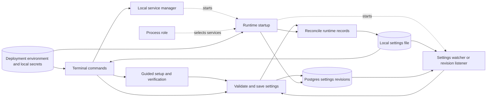
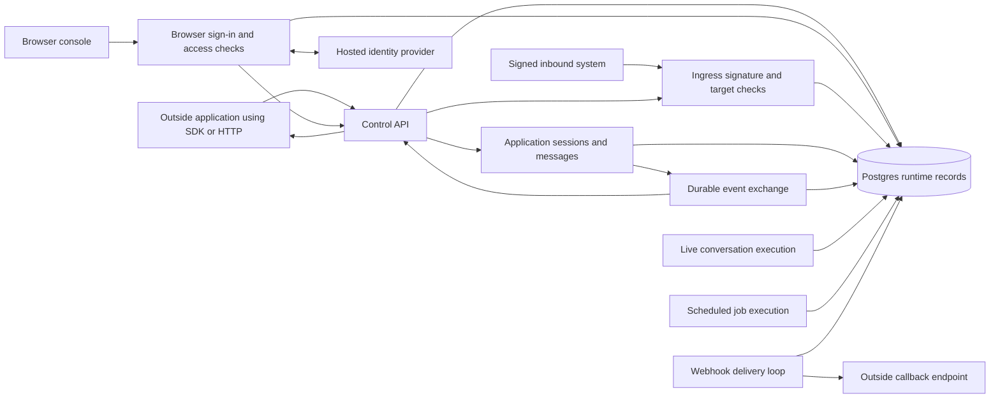
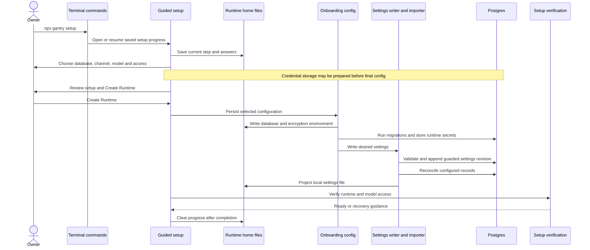
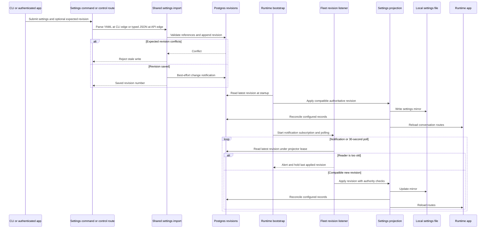
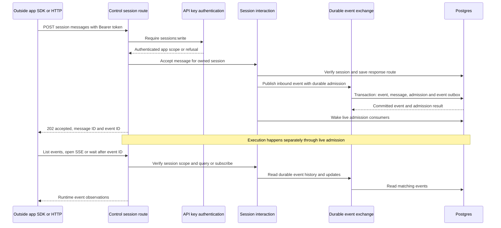

# Control plane, CLI, config and bootstrap

## 1. What this area does

This area is Gantry's operations desk: it helps an owner set up the service, choose its settings and see whether it is ready ([CLI][cli], [setup][setup], [health routes][system]). Owners can use terminal commands or a browser console, while outside applications use an authenticated control API or `@gantry/sdk` ([CLI client][cli-client], [browser routes][browser-dispatch], [SDK][sdk]). Changes to managed settings are saved as numbered Postgres revisions and projected into the records and local files that the runtime reads ([settings imports][imports], [projection][projection]). At startup, Gantry connects storage, restores configuration and starts the parts assigned to that process, allowing the operations desk, live conversations and scheduled jobs to run separately ([bootstrap][boot], [roles][roles]). Accepting an application message saves work to attempt; it does not promise an immediate answer or grant tool access ([session interaction][session], [capability reconciliation][capabilities]).

## 2. Architecture diagram

Arrows show calls, reads, writes or delivery; dotted arrows select or start a component. Components are modules within CLI or runtime processes, not one container per box. The two diagrams contain 25 distinct nodes; the numbered revision store is part of the same Postgres service as the runtime records ([bootstrap][boot], [storage construction][storage]).

The second diagram's API-to-ingress edge is route dispatch; the signed system supplies its own signature. Event-to-API-to-application is outbound observation through HTTP SSE, event lists or waits. Webhooks are outbound callbacks. Ingress is inbound authority governed by target policy. Browser sign-in uses browser routes; it does not turn its cookie into a `/v1/` API key ([server dispatch][server], [session routes][session-routes], [ingress routes][ingress-routes], [browser boundary][browser-boundary]).

| Diagram node                             | Code or store anchor                                                                                                                                                                                                 |
| ---------------------------------------- | -------------------------------------------------------------------------------------------------------------------------------------------------------------------------------------------------------------------- |
| Terminal commands                        | `apps/core/src/cli/index.ts`; `apps/core/src/cli/control-api.ts` provides the HTTP client used by commands such as MCP and skill management.                                                                         |
| Guided setup and verification            | `apps/core/src/cli/setup-flow.ts`, `apps/core/src/cli/setup-flow-final-steps.ts`, `apps/core/src/cli/doctor.ts`.                                                                                                     |
| Local service manager                    | `apps/core/src/infrastructure/service/manager.ts`; selects launchd, systemd user service or a fallback process according to platform support.                                                                        |
| Runtime startup                          | `apps/core/src/app/index.ts`, `apps/core/src/app/bootstrap/startup.ts`; executable entry is `apps/core/src/index.ts`.                                                                                                |
| Process role                             | `apps/core/src/app/bootstrap/roles/role-resolver.ts`, `apps/core/src/app/bootstrap/roles/role-capabilities.ts`.                                                                                                      |
| Deployment environment and local secrets | `apps/core/src/config/env/index.ts`, `apps/core/src/config/env/file.ts`; process environment and the runtime home's `.env`.                                                                                          |
| Local settings file                      | `apps/core/src/config/settings/runtime-home.ts`, `apps/core/src/config/settings/runtime-settings.ts`; runtime-home `settings.yaml`.                                                                                  |
| Validate and save settings               | `apps/core/src/config/settings/settings-import-service.ts`, `apps/core/src/config/settings/settings-fleet-import.ts`.                                                                                                |
| Postgres settings revisions              | `apps/core/src/adapters/storage/postgres/schema/fleet-capability-state.ts`, `settings_revisions`; implementation in `apps/core/src/adapters/storage/postgres/repositories/settings-revision-repository.postgres.ts`. |
| Reconcile runtime records                | `apps/core/src/config/settings/restart-sync.ts`, `apps/core/src/config/settings/desired-state-service.ts`.                                                                                                           |
| Settings watcher or revision listener    | `apps/core/src/runtime/settings-reload-watcher.ts`, `apps/core/src/runtime/settings-revision-listener.ts`; fleet wiring in `apps/core/src/app/bootstrap/fleet-boot.ts`.                                              |
| Outside application using SDK or HTTP    | Client edge represented by `packages/sdk/src/index.ts`, `packages/sdk/src/sessions.ts`, `packages/sdk/src/session-events.ts`.                                                                                        |
| Control API                              | `apps/core/src/control/server/index.ts`, `apps/core/src/control/server/auth.ts`; API descriptions in `apps/core/src/control/server/openapi.ts`.                                                                      |
| Browser console                          | `apps/web/src/main.tsx`; static serving in `apps/core/src/control/server/ui-static.ts`.                                                                                                                              |
| Browser sign-in and access checks        | `apps/core/src/control/server/browser-route-dispatch.ts`, `apps/core/src/control/server/routes/browser-auth.ts`, `apps/core/src/control/server/browser-auth-boundary.ts`.                                            |
| Hosted identity provider                 | External OIDC issuer accessed by `apps/core/src/adapters/auth/oidc-adapter.ts`, wired in `apps/core/src/control/server/browser-oidc.ts`.                                                                             |
| Signed inbound system                    | External caller represented by `packages/sdk/src/ingress-signature.ts`; received by `apps/core/src/control/server/routes/external-ingress.ts`.                                                                       |
| Ingress signature and target checks      | `apps/core/src/application/external-ingress/external-ingress-module.ts`, `apps/core/src/application/external-ingress/target-policy.ts`, `apps/core/src/control/server/external-ingress-adapter.ts`.                  |
| Application sessions and messages        | `apps/core/src/application/sessions/session-interaction-module.ts`, `apps/core/src/control/server/session-interaction-adapter.ts`.                                                                                   |
| Durable event exchange                   | `apps/core/src/application/runtime-events/runtime-event-exchange.ts`, `apps/core/src/adapters/storage/postgres/repositories/runtime-event-repository.postgres.ts`.                                                   |
| Postgres runtime records                 | `apps/core/src/adapters/storage/postgres/factory.ts` constructs repositories; definitions exported through `apps/core/src/adapters/storage/postgres/schema/index.ts`.                                                |
| Live conversation execution              | `apps/core/src/app/bootstrap/runtime-services.ts`, `apps/core/src/runtime/live-admission-work-loop.ts`; claims persisted admissions.                                                                                 |
| Scheduled job execution                  | `apps/core/src/app/bootstrap/runtime-scheduler-start.ts`, `apps/core/src/jobs/scheduler.ts`; pg-boss supplies scheduler triggers.                                                                                    |
| Webhook delivery loop                    | `apps/core/src/control/server/webhook-delivery.ts`; each control server starts its delivery timer.                                                                                                                   |
| Outside callback endpoint                | External webhook URL stored in `apps/core/src/adapters/storage/postgres/schema/control-http.ts` and called by `apps/core/src/control/server/webhook-delivery.ts`.                                                    |

## 3. Key flows

### A. An owner creates a runtime

1. The published `gantry` command points at the CLI entry; `npx gantry setup` reaches `runSetupCommand` and resumes a saved step when present ([package manifest][package], [CLI][cli], [progress file][progress]). Runtime-home selection honors the command argument, then `GANTRY_HOME`, then the default home; the early CLI import sets the argument before configuration modules load ([home selection][home], [early bootstrap][early-env]).
2. Setup records progress before each step and selects the channel and model before model credentials; first-run harness intent is `auto` ([flow][setup], [draft state][setup-state]). Credential collection may prepare database/environment material and migrations for credential storage before the final review ([credential preparation][onboarding-config], [credential step][setup-credentials]).
3. The review step explicitly says that creation cannot be cancelled transactionally. After confirmation, onboarding writes the database/encryption environment, runs migrations, stores channel runtime secrets and calls the desired settings writer ([review and verification][setup-final], [onboarding persistence][onboarding-config]). The CLI installs a storage provider, so this path requires Postgres rather than silently saving only a file ([CLI storage provider][cli], [writer][writer]).
4. The shared import validates settings and capability references, checks the base revision, appends durable intent and projects it under a settings projector lease. Projection writes YAML and reconciles agents, provider accounts, conversations and bindings; it is a multi-step operation after the revision append ([import][imports], [validation and append][fleet-import], [projector lease][projector], [reconciliation][desired], [projection][projection]).
5. The later group step creates conversation runtime data; verification runs doctor and model-access checks and can return to an earlier step or pause with recovery guidance. Completion clears the progress file, and choosing start now hands control back to the CLI's start path ([final steps][setup-final], [flow completion][setup], [CLI start][cli]).

### B. A settings change reaches a split fleet process

1. CLI fleet import reads a YAML file; `/v1/settings/desired-state` accepts a typed JSON document under `agents:admin`. The API uses the authenticated key's app scope, preserves the private observability block and returns a conflict when an explicit expected revision is stale ([settings CLI][settings-cli], [settings routes][settings-routes]). `/v1/settings` itself is read-only; PATCH returns the documented refusal ([settings routes][settings-routes]).
2. Fleet import validates references, appends a numbered revision and sends a best-effort Postgres notification. Returning a revision means durable intent was saved, not that every process has adopted it ([fleet import][fleet-import], [revision repository][revision-repo], [notification][revision-notify]).
3. Bootstrap resolves `GANTRY_PROCESS_ROLE` before preflight. The default `all` role restores workstation revision authority through startup; split roles fetch the fleet revision through `prepareFleetSettings`. With no revision, or a revision needing a newer reader, fleet readiness stays red and scheduler/capability startup is held ([bootstrap][boot], [startup][startup], [fleet preparation][fleet], [role resolver][role-resolver]).
4. Applying a compatible revision checks MCP binding authority, renders local settings, reconciles records and reloads conversation routes. A rejected MCP approval can cause a corrective successor revision instead of restoring stale authority ([revision application][imports], [projection][projection], [route reload][runtime-app]).
5. Every fleet process runs a revision listener, including the control role. Notifications wake it promptly; its 30-second default poll recovers missed wakeups, and its projector lease serializes application for an app. A newer unreadable revision is held and reported; application failures mark settings not loaded and are retried ([fleet wiring][fleet], [listener][listener], [projector lease][projector]).
6. Workstation mode uses a five-second file watcher instead. It retains the last good snapshot on invalid edits, rebases pending edits against a newer revision and retries revision or authority conflicts ([watcher][watcher]). Changes are classified into live conversation policies/agent defaults and restart-required storage, model access, topology, agents, memory, runtime, observability and observer settings; adoption is not a wholesale replacement of already constructed services ([classification][classification], [bootstrap's effective snapshot][boot], [route reload][runtime-app]).

### C. An outside app submits work and observes it

1. API keys carry an app and scopes; authentication hashes the supplied Bearer token and compares it with the configured hash. Message submission requires `sessions:write`; a browser session cookie cannot authenticate this API ([authentication][api-auth], [server boundary][server], [message route][session-routes]). Browser routes separately reject Bearer credentials and use browser access checks, including origin and CSRF protection for mutations ([browser dispatch][browser-dispatch], [browser boundary][browser-boundary]).
2. The session interaction module verifies session ownership, sender identity and requested response options. It stores conversation metadata and the thread's response route before accepting input. Sessions are created through `/v1/sessions`, which also registers their conversation route ([session routes][session-routes], [session adapter][session-adapter], [session module][session]).
3. On the durable live-admission path, the event exchange delegates to a transaction that inserts the runtime event, canonical message/admission, event-bus record and applicable webhook delivery. After commit, admission consumers are notified. Overload preserves the input as history and returns a rate-limit error instead of successful acceptance ([session module][session], [exchange][events], [transaction][event-repo]). When live turns are disabled, the adapter uses message persistence plus event publication and queues a local message check ([session adapter][session-adapter]).
4. The API returns HTTP 202 and the accepted event ID. This proves acceptance, not model completion or successful delivery. Live execution is started only in its assigned roles, with persisted admissions and worker coordination; the host execution queue and durable lease/slot services own model-work admission, while pg-boss is a scheduled-job trigger ([session routes][session-routes], [live wiring][services], [live loop][live-loop], [admission queue][admission], [scheduler engine][scheduler-engine]). Selected capabilities and policy govern tool access independently of the request ([capability reconciliation][capabilities]).
5. Clients can resume observation after an event ID through event lists, SSE or wait. Reads and subscriptions verify session scope; stream/wait limits and counters are local to each server process ([session routes][session-routes], [session module][session], [exchange][events]). Outbound callbacks use the webhook delivery loop, which reads durable delivery rows, signs requests and retries transient failures ([delivery][delivery]). Signed inbound systems instead use ingress records and signature/target checks. Their supported targets are session messages, conversation messages, job triggers and job templates; those messages can describe scoped application actions to attempt under selected capabilities and policy ([ingress module][ingress-module], [target policy][target-policy], [capability reconciliation][capabilities]).

## 4. Data it owns

Ownership here means configuration and control surfaces manage these records; the storage adapters implement them. Messages, runs, jobs and approvals are shared runtime data, described separately in [storage](./06-storage.md), [runtime](./02-runtime.md) and [jobs](./03-jobs.md).

| Table or file                                                           | What it holds and source                                                                                                                                                                                                                  |
| ----------------------------------------------------------------------- | ----------------------------------------------------------------------------------------------------------------------------------------------------------------------------------------------------------------------------------------- |
| Runtime-home `settings.yaml`                                            | Human-readable configuration and local revision projection; parser, validation and atomic replacement in [runtime settings][runtime-settings].                                                                                            |
| Runtime-home `.env`                                                     | Database/bootstrap secrets and control transport/key configuration; file permissions and writes in [environment file][env-file], resolution in [environment lookup][env].                                                                 |
| Runtime-home `.onboarding-state.json`                                   | Resumable setup step and draft answers, removed on cancellation/completion; [onboarding state][progress].                                                                                                                                 |
| Runtime-home `run/control.sock`                                         | Default Unix socket endpoint, recreated on startup and removed on close; [server][server].                                                                                                                                                |
| Runtime-home `logs/gantry.log` and `logs/gantry.error.log`              | Service output/error destinations; [path helpers][home], [service manager][service].                                                                                                                                                      |
| `settings_revisions`                                                    | Per-app numbered settings documents, minimum reader version, author and note; [fleet schema][fleet-schema], [revision repository][revision-repo].                                                                                         |
| `agents`, `provider_accounts`, `conversations`, `conversation_installs` | Configured agents, provider connections, conversation policies and agent installations projected by [desired-state service][desired]; [agent][agent-schema], [provider][provider-schema] and [conversation schemas][conversation-schema]. |
| `control_http_sessions`                                                 | Outside-app session ownership, canonical links, default response mode and external references; [control HTTP schema][control-schema].                                                                                                     |
| `control_http_response_routes`                                          | Per-session/thread observation or callback choice and correlation ID; [control HTTP schema][control-schema].                                                                                                                              |
| `control_http_webhooks`                                                 | Outbound callback URLs, signing secrets, filters and enabled status; [control HTTP schema][control-schema].                                                                                                                               |
| `control_http_webhook_deliveries`                                       | Delivery status, attempts, next retry and last error for a durable event; [control HTTP schema][control-schema].                                                                                                                          |
| `external_ingresses`                                                    | Signed inbound authority records and metadata; [ingress schema][ingress-schema].                                                                                                                                                          |
| `external_ingress_invocations`                                          | Signed request, idempotency key, result/error and expiry; [ingress schema][ingress-schema].                                                                                                                                               |
| `external_ingress_nonces`                                               | Expiring replay protection for signed requests; [ingress schema][ingress-schema].                                                                                                                                                         |
| `local_authorization_codes`                                             | Hashed, expiring, single-use local browser authorization codes; [authentication schema][auth-schema].                                                                                                                                     |
| `oidc_transactions`                                                     | Hosted sign-in state/nonce hashes, encrypted PKCE verifier and expiry; [authentication schema][auth-schema].                                                                                                                              |
| `console_access_grants`                                                 | A person's administrator/viewer role and awaiting/active/disabled console access; [authentication schema][auth-schema].                                                                                                                   |
| `browser_sessions`                                                      | Session/CSRF hashes, idle/absolute expiry, revocation and reauthentication; [authentication schema][auth-schema].                                                                                                                         |
| `console_invitations`                                                   | Hashed invitation tokens, invited email, console role and lifecycle; [authentication schema][auth-schema].                                                                                                                                |
| `model_credentials`, `capability_secrets`                               | Managed model access and referenced runtime/tool secrets, written by credential/setup surfaces; [model credential schema][credential-schema], [capability secret schema][secret-schema], [onboarding persistence][onboarding-config].     |
| `worker_instances`, `run_leases`, `run_slots`, `runtime_dependencies`   | Worker presence (including advertised capabilities), execution ownership/slots and toolchain bake state; [worker schema][worker-schema], [fleet schema][fleet-schema], [fleet bootstrap][fleet].                                          |

## 5. How it scales and fails

`GANTRY_PROCESS_ROLE` belongs to the deployment environment, not desired settings. Missing/empty means `all`; an unknown value aborts startup. The role table expresses enabled subsystems, still subject to settings and readiness gates ([role resolver][role-resolver], [role capabilities][roles], [bootstrap][boot]).

| Role          | Control HTTP routes                                                   | Provider connections | Execution and fleet capability work                                                                                            |
| ------------- | --------------------------------------------------------------------- | -------------------- | ------------------------------------------------------------------------------------------------------------------------------ |
| `all`         | Full control and browser surfaces                                     | Inbound and outbound | Live turns, scheduler jobs, worker registration; fleet mode also enables bakes and capability reconciliation.                  |
| `control`     | Full control, settings writes and browser surfaces                    | Outbound only        | No live or scheduler execution; fleet settings listener runs, without worker registration, bakes or capability reconciliation. |
| `live-worker` | Operational/diagnostic routes, plus the signed live-ingress exception | Inbound and outbound | Live turns and worker registration; fleet capability reconciliation, no scheduler or bakes.                                    |
| `job-worker`  | Operational/diagnostic routes, plus the signed live-ingress exception | Outbound only        | Scheduler jobs and worker registration; fleet bakes and capability reconciliation, no live-turn execution.                     |

The worker route exception is the actual `/webhooks/<id>` and optional `/wait` signed invocation path, selected by `isLiveIngressRoute`; administrative `/v1/ingresses` routes remain unmounted on workers. Ingress records are managed through `/v1/ingresses`; this signed invocation spelling does not make `/v1/webhooks` inbound authority. Every role starts a control server, whose webhook flush and ingress expiry timers are currently unconditional ([dispatch and timers][server], [ingress parser][ingress-routes], [roles][roles], [channel startup][boot], [fleet wiring][fleet]).

**Memory and disk.** Each process has its own configuration cache, conversation-route map, execution queue, connections, stream/wait counters and listener progress. `loadState()` reloads routes, not the constructed queue. The queue is built before authoritative revision restoration; this is already identified in the supplied audit. Environment-file lookup is also initialized in module state. Local YAML and setup progress live on disk; numbered revisions, authentication records, input/events, delivery state and worker ownership live in Postgres ([config cache][config], [runtime app][runtime-app], [environment lookup][env], [server state][server], [listener][listener], [audit][audit]).

**Scaling.** Separate control processes can accept API work while live and job workers execute it using the shared database. This wiring does not itself partition provider-native inbound subscriptions: live-worker roles enable inbound channel connections, so provider topology and adapter coordination still matter. Model work passes through host admission (`GroupQueue` and durable lease/slot services in this checkout); worker registration and leases coordinate execution, and a separate advisory lease elects one live recovery coordinator. Multiple control servers claim webhook deliveries from durable storage rather than owning a unique in-memory delivery queue ([bootstrap][boot], [services][services], [admission][admission], [recovery coordinator][recovery-coordinator], [webhook claims][delivery]).

**Readiness and errors.** Startup errors log and exit nonzero. Control startup uses a Unix socket by default or configured TCP; production/non-loopback exposure passes the keyed security gate, and local browser authentication rejects a non-loopback host. Unversioned health/readiness/metrics routes are deliberately unauthenticated operational surfaces. Readiness checks include database/migrations, settings and draining state. The control role also gates on configured API keys; worker roles gate on registration, and the job worker also gates on scheduler readiness. The live worker reports available or saturated capacity, but saturation does not fail readiness. The `all` role explicitly omits those extra role requirements ([entry][entry], [control startup][server], [health routes][system], [health evaluation][health], [role readiness][readiness], [bootstrap][boot]).

**Settings recovery and restart.** A workstation startup restores the latest compatible saved revision and reinitializes storage using it; without a revision, it can seed one from local workstation settings. Fleet does not promote an unseeded local file into authority. Notifications are wakeups, not saved state: fleet polls recover dropped notifications, and reader-version skew holds the last applied revision. Later projection can reload routes and dynamic configuration lookups, while boot-owned services and the effective control settings snapshot remain restart-owned; the change classifier reports restart-required categories. The CLI recovery limitation recorded in the existing audit still matters: some commands parse the current mirror before reaching their intended recovery handling ([startup][startup], [fleet boot][fleet], [notification][revision-notify], [listener][listener], [classification][classification], [bootstrap][boot], [audit][audit]).

**Crash and shutdown.** SIGTERM/SIGINT mark readiness draining, stop new scheduler/live admission and recovery, stop fleet listeners, release the recovery coordinator lease and wait for the queue within its configured deadline before closing channels, HTTP, browsers, tracing and storage. Duplicate signals share one drain. A crash loses those in-memory objects and open SSE/wait connections; persisted revisions, events, admissions and leases remain available for startup, recovery and cursor-based observation. This is not a promise of exactly-once external effects ([shutdown][shutdown], [startup][startup], [live recovery][recovery-coordinator], [session event observation][session-routes]). Webhooks process batches of 20 with concurrency four and a ten-second request timeout; retryable failures use durable backoff and become dead after the attempt limit, while nonretryable HTTP errors become dead immediately ([delivery][delivery]).

## 6. Video script outline

1. Gantry's operations desk lets an owner set up, configure and check the service from a terminal or browser ([CLI][cli], [browser console][ui]).
2. Guided setup collects the database, conversation channel and model choices, then asks the owner to review before creating the runtime ([setup][setup], [review][setup-final]).
3. Managed settings become numbered database revisions, with a readable local file showing the projected configuration ([imports][imports], [revision schema][fleet-schema]).
4. One deployment can do everything, or separate processes can handle control requests, live conversations and scheduled jobs ([roles][roles], [bootstrap][boot]).
5. Outside applications submit work through an authenticated API, receive durable acceptance and follow progress through saved events ([session routes][session-routes], [session interaction][session]).
6. Signed inbound integrations request work under target policy, while outbound webhooks carry callbacks back to outside systems ([ingress policy][target-policy], [delivery][delivery]).
7. Readiness, revision polling and orderly draining help operators see trouble and restore service, with restart required for changes to boot-owned services ([health][health], [listener][listener], [shutdown][shutdown], [classification][classification]).

## 7. Duplication and simplification

### (a) Existing audit findings

These links cite the supplied external audit's titles without reproducing its findings. This owner-supplied artifact is outside the repository; its embedded source links refer to another checkout.

- [Bootstrap captures settings before restoring authoritative settings — over-complicated / UX][audit]
- [Settings recovery requires the broken settings to parse — UX / duplicate][audit]
- [Setup probes model credentials twice — duplicate / UX][audit]
- [Four copies of conversation registration have drifted — duplicate][audit]
- [CLI and control API implement model-default changes separately — parallel][audit]
- [Retired sender mode is still translated into current behavior — dead/legacy][audit]

### (b) New observations

1. **The CLI control client repeats the environment-file reader — fix.** Both `apps/core/src/cli/control-api.ts:92` and `apps/core/src/config/env/file.ts:9` read UTF-8, call the same shared parser and return an empty map on read/parse failure. Keep the exported config reader and the shared parser; remove the CLI-local reader and its now-unneeded imports. Preserve the control client's environment-over-file precedence at `apps/core/src/cli/control-api.ts:81`. MCP and skill commands already share this client (`apps/core/src/cli/mcp.ts:3`, `apps/core/src/cli/skills.ts:5`), so the simplification belongs there once, not in each command.

[cli]: ../../../apps/core/src/cli/index.ts
[setup]: ../../../apps/core/src/cli/setup-flow.ts
[setup-state]: ../../../apps/core/src/cli/setup-flow-state.ts
[setup-final]: ../../../apps/core/src/cli/setup-flow-final-steps.ts
[setup-credentials]: ../../../apps/core/src/cli/setup-credentials.ts
[onboarding-config]: ../../../apps/core/src/cli/onboarding-config.ts
[progress]: ../../../apps/core/src/cli/onboarding-state.ts
[early-env]: ../../../apps/core/src/cli/runtime-home-env-bootstrap.ts
[cli-client]: ../../../apps/core/src/cli/control-api.ts
[settings-cli]: ../../../apps/core/src/cli/settings.ts
[package]: ../../../package.json
[sdk]: ../../../packages/sdk/src/index.ts
[ui]: ../../../apps/web/src/main.tsx
[service]: ../../../apps/core/src/infrastructure/service/manager.ts
[home]: ../../../apps/core/src/config/settings/runtime-home.ts
[env]: ../../../apps/core/src/config/env/index.ts
[env-file]: ../../../apps/core/src/config/env/file.ts
[config]: ../../../apps/core/src/config/index.ts
[runtime-settings]: ../../../apps/core/src/config/settings/runtime-settings.ts
[writer]: ../../../apps/core/src/config/settings/desired-settings-writer.ts
[imports]: ../../../apps/core/src/config/settings/settings-import-service.ts
[fleet-import]: ../../../apps/core/src/config/settings/settings-fleet-import.ts
[revision-notify]: ../../../apps/core/src/config/settings/settings-revision-notify.ts
[projection]: ../../../apps/core/src/config/settings/restart-sync.ts
[desired]: ../../../apps/core/src/config/settings/desired-state-service.ts
[capabilities]: ../../../apps/core/src/config/settings/desired-state-capability-reconcile.ts
[classification]: ../../../apps/core/src/config/settings/desired-state-service-helpers.ts
[projector]: ../../../apps/core/src/domain/ports/settings-projector-lease.ts
[boot]: ../../../apps/core/src/app/index.ts
[entry]: ../../../apps/core/src/index.ts
[startup]: ../../../apps/core/src/app/bootstrap/startup.ts
[fleet]: ../../../apps/core/src/app/bootstrap/fleet-boot.ts
[roles]: ../../../apps/core/src/app/bootstrap/roles/role-capabilities.ts
[role-resolver]: ../../../apps/core/src/app/bootstrap/roles/role-resolver.ts
[readiness]: ../../../apps/core/src/app/bootstrap/roles/role-readiness.ts
[runtime-app]: ../../../apps/core/src/app/bootstrap/runtime-app.ts
[services]: ../../../apps/core/src/app/bootstrap/runtime-services.ts
[watcher]: ../../../apps/core/src/runtime/settings-reload-watcher.ts
[listener]: ../../../apps/core/src/runtime/settings-revision-listener.ts
[shutdown]: ../../../apps/core/src/app/bootstrap/shutdown.ts
[recovery-coordinator]: ../../../apps/core/src/app/bootstrap/live-recovery-coordinator.ts
[live-loop]: ../../../apps/core/src/runtime/live-admission-work-loop.ts
[admission]: ../../../apps/core/src/runtime/group-queue.ts
[scheduler-engine]: ../../../apps/core/src/infrastructure/pgboss/scheduler-engine.ts
[server]: ../../../apps/core/src/control/server/index.ts
[api-auth]: ../../../apps/core/src/control/server/auth.ts
[browser-dispatch]: ../../../apps/core/src/control/server/browser-route-dispatch.ts
[browser-boundary]: ../../../apps/core/src/control/server/browser-auth-boundary.ts
[settings-routes]: ../../../apps/core/src/control/server/routes/settings.ts
[system]: ../../../apps/core/src/control/server/routes/system.ts
[health]: ../../../apps/core/src/control/server/system-health.ts
[session-routes]: ../../../apps/core/src/control/server/routes/sessions.ts
[session-adapter]: ../../../apps/core/src/control/server/session-interaction-adapter.ts
[session]: ../../../apps/core/src/application/sessions/session-interaction-module.ts
[ingress-routes]: ../../../apps/core/src/control/server/routes/external-ingress.ts
[ingress-module]: ../../../apps/core/src/application/external-ingress/external-ingress-module.ts
[target-policy]: ../../../apps/core/src/application/external-ingress/target-policy.ts
[events]: ../../../apps/core/src/application/runtime-events/runtime-event-exchange.ts
[event-repo]: ../../../apps/core/src/adapters/storage/postgres/repositories/runtime-event-repository.postgres.ts
[delivery]: ../../../apps/core/src/control/server/webhook-delivery.ts
[storage]: ../../../apps/core/src/adapters/storage/postgres/factory.ts
[revision-repo]: ../../../apps/core/src/adapters/storage/postgres/repositories/settings-revision-repository.postgres.ts
[fleet-schema]: ../../../apps/core/src/adapters/storage/postgres/schema/fleet-capability-state.ts
[control-schema]: ../../../apps/core/src/adapters/storage/postgres/schema/control-http.ts
[ingress-schema]: ../../../apps/core/src/adapters/storage/postgres/schema/external-ingress.ts
[auth-schema]: ../../../apps/core/src/adapters/storage/postgres/schema/authentication.ts
[agent-schema]: ../../../apps/core/src/adapters/storage/postgres/schema/agents.ts
[provider-schema]: ../../../apps/core/src/adapters/storage/postgres/schema/providers.ts
[conversation-schema]: ../../../apps/core/src/adapters/storage/postgres/schema/conversations.ts
[credential-schema]: ../../../apps/core/src/adapters/storage/postgres/schema/model-credentials.ts
[secret-schema]: ../../../apps/core/src/adapters/storage/postgres/schema/capability-secrets.ts
[worker-schema]: ../../../apps/core/src/adapters/storage/postgres/schema/worker-coordination.ts
[audit]: ../audits/2026-10-02-area-audit/07-control-cli-config.md
