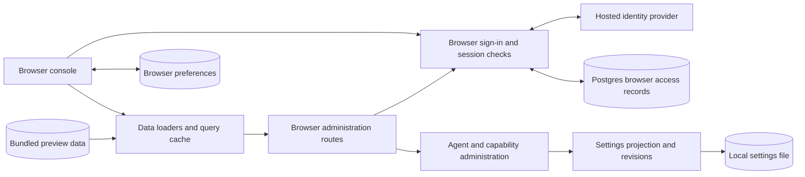
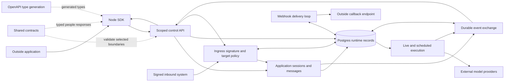
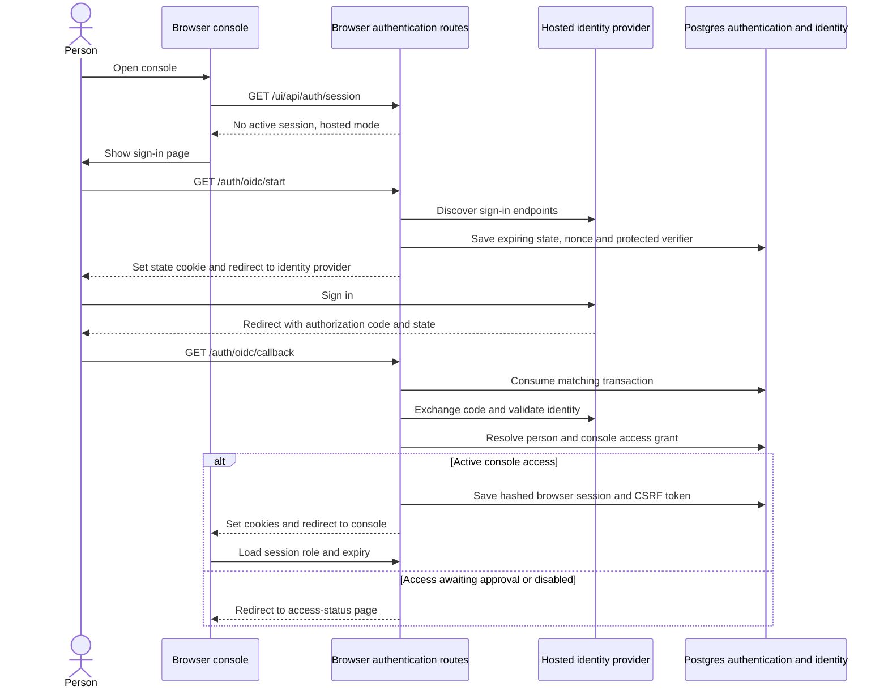
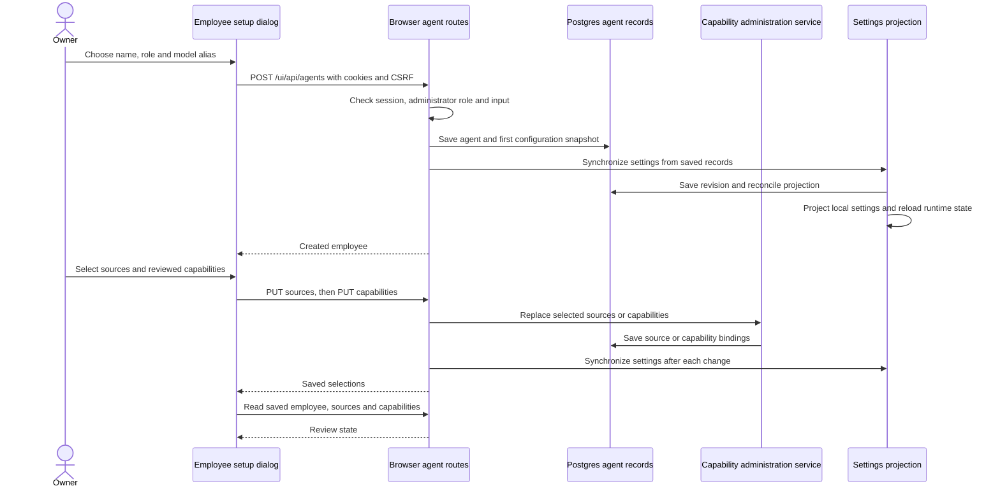
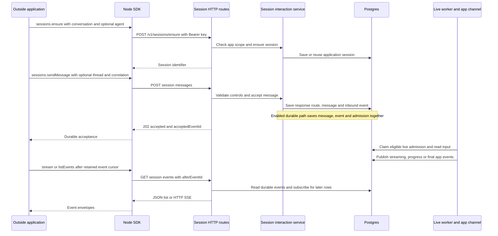
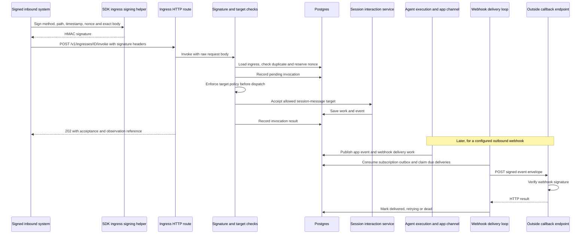

# Web console, SDK and contracts

## 1. What this area does

This area gives people a browser console for managing Gantry and gives other applications a way to request work through the Node.js SDK ([console entry][web], [SDK client][sdk]). The working console screens manage AI employees, people, channel accounts, model credentials, skills, MCP connections and browser access; several chat, jobs and monitoring screens still display preview data ([browser routes][browser-dispatch], [preview queries][runtime-queries], [chat queries][chat-queries], [operations queries][operations-queries]). Outside applications can submit conversation messages or requests to act through an agent's approved capabilities, manage jobs and memory, and observe saved events or receive callbacks ([SDK client][sdk], [session service][sessions], [agent capability administration][capability-admin]). Browser sign-in and application API keys have separate access checks, and submitting a request does not itself grant tool access ([browser boundary][browser-boundary], [API authentication][api-auth], [capability administration][capability-admin]). Shared contracts describe request and response shapes, while Postgres stores sessions and events so applications can reconnect and read what happened ([contract exports][contracts], [control HTTP schema][http-schema], [event exchange][events]).

## 2. Architecture diagram

These two views contain 25 nodes in total. Solid arrows show calls, reads, writes or outbound delivery; dotted arrows show build-time type relationships. Boxes are responsibilities, not separate containers: browser JavaScript runs on the person's device, the SDK runs in the outside application's Node process, and server responsibilities run inside Gantry ([web entry][web], [SDK transport][sdk], [server][server]).

The first view's administration and settings components also use the second view's Postgres service. The event-to-API-to-SDK path is HTTP SSE, event lists or waits; webhooks are outbound callbacks, while signed ingress is inbound authority restricted by target policy ([session routes][session-routes], [webhook delivery][delivery], [ingress policy][ingress-policy]). The execution box includes scheduling and runner orchestration beyond this area's packages; the SDK itself never runs a model ([SDK client][sdk], [runtime services][runtime-services], [scheduler][scheduler]).

| Diagram node                        | Current code or storage anchor                                                                                                                                                                                                                                                                                         |
| ----------------------------------- | ---------------------------------------------------------------------------------------------------------------------------------------------------------------------------------------------------------------------------------------------------------------------------------------------------------------------- |
| Browser console                     | `apps/web/src/main.tsx`, `apps/web/src/app/app.tsx`, `apps/web/src/app/router.tsx`; server serves its built assets through `apps/core/src/control/server/ui-static.ts`.                                                                                                                                                |
| Data loaders and query cache        | `apps/web/src/lib/query/query-client.ts`, `apps/web/src/features/agents/agents-queries.ts`, `apps/web/src/features/operations/skills-queries.ts`.                                                                                                                                                                      |
| Bundled preview data                | `apps/web/src/features/chat/chat-preview.ts`, `apps/web/src/features/runtime/jobs-preview.ts`, `apps/web/src/features/runtime/runtime-preview.ts`, `apps/web/src/features/operations/operations-preview.ts`, `apps/web/src/features/workflows/workflows-preview.ts`, `apps/web/src/features/people/people-preview.ts`. |
| Browser preferences                 | `apps/web/src/features/preferences/preferences.ts`, `apps/web/src/features/preferences/preferences-provider.tsx`; localStorage key `gantry.ui.preferences.v1`.                                                                                                                                                         |
| Browser administration routes       | `apps/core/src/control/server/browser-route-dispatch.ts`; browser queries use `apps/web/src/lib/auth/browser-auth.ts`.                                                                                                                                                                                                 |
| Browser sign-in and session checks  | `apps/core/src/control/server/routes/browser-auth.ts`, `apps/core/src/control/server/browser-auth-boundary.ts`, `apps/web/src/app/root-route.tsx`.                                                                                                                                                                     |
| Hosted identity provider            | External OIDC issuer called through `apps/core/src/control/server/browser-oidc.ts` and `apps/core/src/adapters/auth/oidc-adapter.ts`.                                                                                                                                                                                  |
| Postgres browser access records     | `apps/core/src/adapters/storage/postgres/schema/authentication.ts`; identity linkage uses `apps/core/src/adapters/storage/postgres/repositories/person-identity-repository.postgres.ts`.                                                                                                                               |
| Agent and capability administration | `apps/core/src/control/server/routes/browser-agents.ts`, `apps/core/src/application/agents/agent-capability-administration-service.ts`; skills use `apps/core/src/control/server/routes/browser-skills.controller.ts`.                                                                                                 |
| Settings projection and revisions   | `apps/core/src/control/server/index.ts` wires `syncSettingsFromProjection`; `apps/core/src/config/settings/restart-sync.ts`, `apps/core/src/config/settings/settings-import-service.ts` apply it.                                                                                                                      |
| Local settings file                 | Runtime-home `settings.yaml`, resolved by `apps/core/src/config/settings/runtime-home.ts` and projected by `apps/core/src/config/settings/restart-sync.ts`.                                                                                                                                                            |
| Outside application                 | External caller represented by `packages/sdk/src/index.ts` and the session operations in `packages/sdk/src/sessions.ts`.                                                                                                                                                                                               |
| Node SDK                            | `packages/sdk/src/index.ts`; transport uses Node HTTP/HTTPS or a Unix socket and Bearer credentials.                                                                                                                                                                                                                   |
| Scoped control API                  | `apps/core/src/control/server/index.ts`, `apps/core/src/control/server/auth.ts`; per-route scope checks through `apps/core/src/control/server/handler-context.ts`.                                                                                                                                                     |
| Shared contracts                    | `packages/contracts/src/index.ts`; Zod schemas and inferred types, including `packages/contracts/src/sessions/index.ts` and `packages/contracts/src/skills/browser-skills.dto.ts`; SDK people types import contracts in `packages/sdk/src/people.ts`.                                                                  |
| OpenAPI type generation             | `apps/core/src/control/server/openapi.ts`, `apps/core/src/control/server/openapi-schemas.ts`, `packages/sdk/scripts/generate-openapi-types.ts`, `packages/sdk/src/generated/openapi.ts`, `packages/sdk/src/openapi-types.ts`.                                                                                          |
| Application sessions and messages   | `apps/core/src/control/server/session-interaction-adapter.ts`, `apps/core/src/application/sessions/session-interaction-module.ts`.                                                                                                                                                                                     |
| Durable event exchange              | `apps/core/src/application/runtime-events/runtime-event-exchange.ts`, `apps/core/src/adapters/storage/postgres/runtime-event-notifier.postgres.ts`; app responses are published through `apps/core/src/channels/app.ts`.                                                                                               |
| Postgres runtime records            | Schemas in `apps/core/src/adapters/storage/postgres/schema/control-http.ts`, `apps/core/src/adapters/storage/postgres/schema/events.ts`, `apps/core/src/adapters/storage/postgres/schema/external-ingress.ts`; repositories constructed in `apps/core/src/adapters/storage/postgres/factory.ts`.                       |
| Live and scheduled execution        | `apps/core/src/app/bootstrap/runtime-services.ts`, `apps/core/src/runtime/live-admission-work-loop.ts`, `apps/core/src/jobs/scheduler.ts`; role selection in `apps/core/src/app/bootstrap/roles/role-capabilities.ts`.                                                                                                 |
| External model providers            | Provider execution adapters in `apps/core/src/adapters/llm/anthropic-claude-agent/execution-adapter.ts` and `apps/core/src/adapters/llm/deepagents-langchain/execution-adapter.ts`.                                                                                                                                    |
| Signed inbound system               | External sender uses `packages/sdk/src/ingress-signature.ts`; ingress management is `packages/sdk/src/ingresses.ts`.                                                                                                                                                                                                   |
| Ingress signature and target policy | `apps/core/src/control/server/routes/external-ingress.ts`, `apps/core/src/application/external-ingress/external-ingress-module.ts`, `apps/core/src/application/external-ingress/target-policy.ts`.                                                                                                                     |
| Webhook delivery loop               | `apps/core/src/control/server/webhook-delivery.ts`, `apps/core/src/adapters/storage/postgres/repositories/event-bus-outbox.postgres.ts`, `apps/core/src/adapters/storage/postgres/repositories/control-plane-webhook-claim.postgres.ts`.                                                                               |
| Outside callback endpoint           | External URL registered through `apps/core/src/control/server/routes/webhooks.ts`; receiver verification helper is `packages/sdk/src/webhook-signature.ts`.                                                                                                                                                            |

## 3. Key flows

### A. A person signs in to the hosted console

1. Before opening a protected page, the router fetches `/ui/api/auth/session` with same-origin cookies; absent sessions redirect to the hosted sign-in page or the local authorization page according to mode ([router guard][root], [auth routes][browser-auth]).
2. Hosted sign-in discovers the configured issuer, saves a ten-minute transaction with hashed state/nonce and an encrypted proof-key verifier, and sets a state cookie before redirecting the person ([OIDC setup][oidc], [identity adapter][oidc-adapter]).
3. The callback checks the state cookie, consumes the transaction once, exchanges the authorization code and validates the returned identity. It resolves a person through the identity repository; provider identity alone does not establish unrestricted console access ([callback][browser-auth], [identity repository][identity-repo]).
4. Access comes from a console grant. The handler can accept an invitation or create a viewer grant for the configured company domain; other people are directed to awaiting-approval or disabled pages. An active grant allows issuance of a browser session ([access decisions][browser-auth], [authentication schema][auth-schema]).
5. Postgres receives token hashes and expiry timestamps; the browser receives an HttpOnly session cookie and a readable CSRF cookie. Mutations require a valid session, the canonical Origin, a matching CSRF header and the appropriate browser role; protected agent mutations also require recent hosted reauthentication ([cookie boundary][browser-boundary], [mutation checks][browser-auth], [browser role policy][browser-scope], [agent routes][browser-agents]).
6. Local mode instead consumes a one-use, host-bound authorization code at `/auth/local/authorize` and issues the local cookie names; it does not call the identity provider ([local authorization][browser-auth], [auth pages][auth-pages]).

### B. An administrator creates and equips an AI employee

1. `AgentCreateDialog` holds the draft name, role, model and current setup step in browser memory. Its first save posts cookies, JSON and the CSRF header to the browser API; it moves to source selection only after receiving an agent ID ([setup dialog][create-agent], [browser fetch helper][browser-fetch]).
2. The server checks administrator access, recent hosted reauthentication, the name, selected role snapshot and model alias. It saves an active agent and its first configuration version, then optionally writes the model setting and synchronizes settings before returning success ([agent creation][browser-agents], [agent helpers][agent-helpers]). These operations are successive writes, rather than one transaction covering the whole setup wizard ([agent creation][browser-agents], [settings sync][settings-sync]).
3. Source selection and capability selection use separate PUT requests. The setup manager submits skill/MCP/tool sources or reviewed capability IDs and versions; the shared administration service persists those selections, and the route synchronizes settings afterward ([setup manager][setup-manager], [browser routes][browser-agents], [capability service][capability-admin]).
4. Synchronization exports the current database projection, imports a settings revision, projects the local settings file and reloads runtime state; stale settings conflicts are retried within the sync helper's bounded loop ([server wiring][server], [settings sync][settings-sync], [settings import][settings-import]).
5. The later wizard steps can create a channel account, discover conversations, install the employee and verify/save conversation-scoped control approvers; channel setup can also be deferred. The review step reads the saved employee, sources and capabilities, rather than treating its draft as the saved result ([setup dialog][create-agent], [channel account requests][account-queries]). Sources make capabilities available to select; a conversation message does not add capability authority ([capability service][capability-admin]).

### C. An outside application sends work and observes the answer

1. The SDK's Node transport uses HTTP/HTTPS or a Unix socket and sends a Bearer API key. Ensure and send require `sessions:write`; event reads require `sessions:read`. Browser cookies are explicitly rejected on `/v1/` routes ([SDK transport][sdk], [session routes][session-routes], [server boundary][server]).
2. Ensure checks the authenticated app, constructs an app conversation address and creates/reuses a session. An optional agent must be active and belong to that app; an `appUser` assertion can bind a direct-message session to an application identity. The adapter registers the resulting conversation with the runtime ([ensure service][sessions], [control adapter][session-adapter], [session contract][session-contract]).
3. Sending validates the message, bound sender, requested response schema and model controls. The service saves the response route for the session/thread, including correlation and webhook choice. With durable live admission enabled, the repository saves the inbound event, message, admission and delivery/outbox work in a single database transaction; without that path it saves the message and event separately and the adapter enqueues a local message check ([HTTP validation][session-routes], [accept service][sessions], [atomic repository][event-repo], [control adapter][session-adapter]).
4. A `202` reply with `acceptedEventId` proves durable acceptance, not model completion or callback delivery. An overloaded durable admission returns a rate-limit error and leaves the message as history without a turn taking it ([accept service][sessions], [HTTP response][session-routes]). Enabled live execution claims saved admission work; the app channel turns output into saved session events with thread context and response-route correlation ([live admission loop][live-loop], [app channel][app-channel], [outbound event publication][sessions]).
5. Event list and SSE reads share the durable event exchange, using the caller's event cursor. Session feeds are filtered by the app and the conversation rows associated with the session, rather than solely by the event's session ID. `sessions.wait` returns the next visible streaming or outbound message event; it does not mean “wait until the entire answer is finished” ([feed and wait service][sessions], [session routes][session-routes], [SDK session methods][sdk-sessions]).
6. The SDK optionally applies events to a caller-owned typing tracker while still yielding the raw durable stream. That tracker rejects stale generation/sequence updates and reports typing as false after fifteen seconds; a cursor-restoring consumer must also restore its typing order baseline ([SDK stream][sdk-sessions], [typing tracker][typing]).

### D. A signed request enters, and a callback leaves

1. Ingress management uses API-key scopes, but invocation uses the ingress's own HMAC signature. The SDK signs the uppercase method, path, timestamp, nonce, body hash and exact body. The route reads the signature headers and limits the raw body to 256 KiB ([SDK ingress management][sdk-ingresses], [signing helper][ingress-sign], [ingress routes][ingress-routes]). The SDK provides signing and management helpers; the sender makes the signed invoke HTTP request itself ([SDK ingress methods][sdk-ingresses]).
2. The module verifies the signature and enabled registration, checks any asserted app, compares an existing idempotency record and reserves the nonce for replay protection. It records a pending invocation before dispatch; matching completed/failed duplicates can return the stored result, while a pending duplicate conflicts ([ingress service][ingress], [signature verification][ingress-verify], [ingress schema][ingress-schema]).
3. Dispatch enforces the ingress's allowed target kinds and IDs. This example uses a session-message target, but conversation messages, job triggers and job templates also have dispatch branches. The result records submission/dispatch outcome; it does not promise the agent's eventual action succeeded or confer tool access ([target policy][ingress-policy], [dispatch][ingress], [session service][sessions]).
4. Later, app output publishes a runtime event. Selected session response routes can enqueue a webhook directly; subscription webhooks are matched through the event-bus outbox. A callback is therefore an outbound delivery path independent of the earlier inbound signature ([app channel][app-channel], [event repository][event-repo], [subscription outbox][outbox]).
5. Delivery claims due rows under database locks, validates and pins the destination address, and signs an envelope containing the event ID/type, context and payload. The receiver can use `verifyWebhookSignature` with the exact body and request headers ([delivery loop][delivery], [delivery claims][delivery-claims], [destination validation][webhook-target], [receiver helper][webhook-sign]).
6. A successful HTTP response marks delivery complete; selected HTTP failures and transport errors retry with backoff until the attempt ceiling, after which the row is dead. Management endpoints can replay or purge dead letters ([delivery outcomes][delivery], [webhook management][webhook-routes]).

## 4. Data it owns

The web app, SDK and contracts package do not each have a database. Their own persistent artifacts are browser preferences, source schemas and generated types; server-side records below belong to the shared core storage and implement this area's access, session and delivery boundaries ([preferences][preferences], [contracts][contracts], [type generation][generate], [storage factory][storage]). Agent configuration and settings are shared with agent/control areas; canonical message, admission and execution state remain runtime-owned ([agent schema][agent-schema], [message schema][message-schema], [live-turn schema][live-schema]).

| Table or file                                              | What it holds                                                                                                                                                                                          |
| ---------------------------------------------------------- | ------------------------------------------------------------------------------------------------------------------------------------------------------------------------------------------------------ |
| Browser localStorage key `gantry.ui.preferences.v1`        | Theme choice and reduced-motion preference; [preferences source][preferences].                                                                                                                         |
| `packages/contracts/src/index.ts` and its exported modules | Shared Zod wire schemas and inferred TypeScript types; [exports][contracts].                                                                                                                           |
| `packages/sdk/src/generated/openapi.ts`                    | Generated API operation, request and response types from the server's OpenAPI document; [generator][generate].                                                                                         |
| Preview source modules listed in the diagram               | Bundled sample screen data, not runtime history; [chat queries][chat-queries], [runtime queries][runtime-queries], [workflow queries][workflow-queries], [people queries][people-queries].             |
| `local_authorization_codes`                                | One-use token hashes, person/app binding, canonical host and expiry; [auth schema][auth-schema].                                                                                                       |
| `oidc_transactions`                                        | Sign-in state/nonce hashes, protected proof-key verifier, expiry and invitation/reauthentication context; [auth schema][auth-schema].                                                                  |
| `console_access_grants`                                    | Person/app administrator or viewer grants and active, awaiting-approval or disabled status; [auth schema][auth-schema].                                                                                |
| `browser_sessions`                                         | Session and CSRF token hashes, person/app binding, expiry, revocation and reauthentication time; [auth schema][auth-schema].                                                                           |
| `console_invitations`                                      | Invited email, role, hashed invitation token, expiry and consumption/revocation times; [auth schema][auth-schema].                                                                                     |
| `control_http_sessions`                                    | External conversation mapping to canonical conversation, agent and agent-session records, plus default response delivery; [HTTP schema][http-schema].                                                  |
| `control_http_response_routes`                             | Session/thread response mode, webhook and correlation for later output; [HTTP schema][http-schema].                                                                                                    |
| `control_http_webhooks`                                    | App-owned callback URL, signing secret, enabled state and optional event/subject subscription filters; [HTTP schema][http-schema].                                                                     |
| `control_http_webhook_deliveries`                          | Event-to-webhook delivery status, attempt count, due time and last error; [HTTP schema][http-schema].                                                                                                  |
| `external_ingresses`                                       | App-owned inbound signing secret, enabled state and metadata containing target policy/templates; [ingress schema][ingress-schema].                                                                     |
| `external_ingress_invocations`                             | Idempotency/body hash, request context, status, saved result/error and expiry; raw request body is represented by its hash and the signature is redacted; [schema][ingress-schema], [writer][ingress]. |
| `external_ingress_nonces`                                  | Expiring nonce reservations for each app/ingress; [ingress schema][ingress-schema].                                                                                                                    |
| `runtime_events`                                           | Ordered durable event envelopes and payloads consumed through list, wait, SSE and delivery; [event schema][event-schema].                                                                              |
| `event_bus_outbox`                                         | Pending event fanout work; subscription delivery rows are created and settled outbox rows deleted by the consumer; [event schema][event-schema], [outbox consumer][outbox].                            |
| `agents`                                                   | Employee identity/status and current configuration pointer managed through browser administration; [agent schema][agent-schema].                                                                       |
| `agent_config_versions`                                    | Numbered employee configuration and role/model snapshots; [agent schema][agent-schema].                                                                                                                |
| `custom_roles`                                             | App-owned reusable role names, prompts and source role references; [agent schema][agent-schema].                                                                                                       |
| `settings_revisions`                                       | Numbered durable settings documents synchronized after supported administration changes; [revision schema][revision-schema], [settings sync][settings-sync].                                           |
| Runtime-home `settings.yaml`                               | Local settings projection read by runtime configuration; [settings sync][settings-sync], [runtime-home resolution][home].                                                                              |

## 5. How it scales and fails

### Process roles

| Role          | What runs for this area                                                                                                                                                                              |
| ------------- | ---------------------------------------------------------------------------------------------------------------------------------------------------------------------------------------------------- |
| `all`         | Full browser/static and control API routes, live conversation execution and scheduler job execution.                                                                                                 |
| `control`     | Full browser/static and control API routes and settings writes; no live or scheduler execution.                                                                                                      |
| `live-worker` | Live execution and inbound channel callbacks; operational HTTP routes, plus the signed `/webhooks/…` invoke/wait routes. Browser/static and full `/v1/` administration/session routes are unmounted. |
| `job-worker`  | Scheduler job execution and outbound channel connectivity; the same operational HTTP profile and signed ingress route exception, with no browser/static or full administration API.                  |

The role capability map selects these responsibilities, and app startup passes the selected route profile to the HTTP server ([role capabilities][roles], [app startup][app-root], [server dispatcher][server]). The operational profile's signed route exception is specifically `/webhooks/…`; `/v1/ingresses/…` is served by the full profile ([route predicate][server], [ingress route parser][ingress-routes]). Every `startControlServer` instance starts webhook delivery and ingress maintenance timers, including worker-role instances; delivery is not exclusively a control-role loop ([server timers][server]). React runs in the browser and the Node SDK in its caller regardless of the Gantry role; contracts and generated OpenAPI types do not introduce another server process ([web entry][web], [SDK client][sdk], [contract exports][contracts], [generator][generate]).

### Memory, restart and partial failure

- **Browser memory:** The query client retains results indefinitely by default, disables automatic window-focus refresh and query retry, and individual features explicitly invalidate changed queries. Connection status overrides those defaults with a thirty-second poll and navigation summary with a sixty-second poll. Forms and setup steps are React state; a page reload recreates them and the cache, while localStorage preserves display preferences and cookies retain the browser session token ([query defaults][query-client], [setup dialog][create-agent], [connection state][connection], [navigation summary][navigation], [preferences][preferences], [cookies][browser-boundary]).
- **Durable access:** Restarting a Gantry process does not erase browser sessions or pending OIDC transactions because they live in Postgres. Expired, revoked or disabled access still fails validation; the authentication repository checks session lifetimes and current access grants on reads ([auth repository][auth-repo], [auth schema][auth-schema], [browser authentication][browser-auth]). Static serving returns the HTML shell without caching and built assets with immutable caching; missing build output leaves the static handler unable to serve the console ([static handler][static]). Development can use Vite's optional proxy to a separate core origin ([Vite configuration][vite]).
- **Durable observation:** Runtime events are saved before best-effort notifications. Postgres LISTEN/NOTIFY wakes subscribers across processes; notifier failures reconnect, and subscriptions re-read by cursor after at most a fifteen-second wake wait. HTTP connections and subscription cursors are in memory and disappear on disconnect; clients must retain `afterEventId` and reconnect themselves, because the SDK stream has no automatic reconnect loop ([exchange][events], [Postgres notifier][notifier], [SDK transport][sdk]).
- **Admission and execution:** Enabled durable message acceptance saves admission work in Postgres, separate from the model run. The live loop claims and heartbeats work and releases in-flight claims on orderly shutdown; expired claims are reclaimable by storage on later worker processing. Runtime run admission is implemented through the local `GroupQueue` and durable live-turn authority with lease/slot checks; the SDK and event subscriber do not admit model execution ([event repository][event-repo], [live loop][live-loop], [admission repository][live-repo], [queue][queue], [live authority][live-authority], [runtime services][runtime-services]). Saving a message with live turns disabled uses the separate message/event writes and a local queue check; it must not be described as the enabled atomic admission path ([control adapter][session-adapter], [session acceptance][sessions]).
- **HTTP limits and errors:** Active SSE and wait counters are per server process, so additional API processes have their own limits; excess clients receive 429. SDK requests default to a sixty-second timeout, convert structured HTTP errors into errors with code/details, and do not automatically retry failed requests. A lost HTTP response can leave already-saved work behind, so a transport timeout alone cannot prove that submission failed ([session routes][session-routes], [server state][server], [SDK transport][sdk], [session acceptance][sessions]).
- **Callback recovery:** Delivery claims use `FOR UPDATE SKIP LOCKED`, with a fifteen-second reclaim time in the delivery row. The loop claims batches of twenty and runs four sends concurrently, with a ten-second request timeout. A crash after the receiver accepts but before the row is marked delivered can resend the same event; receivers should deduplicate by event ID. Retryable responses are 408, 429 and server errors, and failed attempts stop retrying at five attempts ([claims][delivery-claims], [delivery loop][delivery]).
- **Administration and ingress are multi-step:** The setup wizard commits each successful step, and a later projection failure can leave saved records even when the request returns an error; the skill routes explicitly report that attachments were saved but settings refresh failed. Ingress reserves replay/idempotency state before target dispatch and records the result afterward; a crash in between can leave a pending invocation whose duplicate conflicts. Pending invocation expiry cleanup is not proof of model cancellation or rollback ([agent writes][browser-agents], [skill writes][browser-skills], [ingress lifecycle][ingress], [maintenance timer][server]).

## 6. Video script outline

1. Open on two doors into Gantry: a browser console for people and a Node SDK for other applications ([web][web], [SDK][sdk]).
2. Show the console's working administration screens, then visibly mark chat, jobs and some monitoring views as previews ([browser routes][browser-dispatch], [preview queries][runtime-queries], [chat queries][chat-queries]).
3. Follow a person through sign-in and an access grant, while the application door checks its own scoped API key ([browser authentication][browser-auth], [API authentication][api-auth]).
4. Build an AI employee by choosing a role, model, sources and approved capabilities, then save the configuration ([setup dialog][create-agent], [capability service][capability-admin]).
5. Send an application request into Postgres and pause on “accepted,” showing that the answer and approved actions happen afterward ([session service][sessions], [live loop][live-loop]).
6. Bring results back through a saved event stream or a signed outbound callback, with signed ingress shown as a separate incoming request ([event exchange][events], [delivery][delivery], [ingress][ingress]).
7. End with separate control, live and job processes reading shared durable state, while reconnecting clients resume from their saved event cursor ([roles][roles], [storage][storage], [SDK session methods][sdk-sessions]).

## 7. Duplication and simplification

### (a) Existing audit findings

The supplied audit is an external review artifact, not a repo document; these links cite its existing finding titles rather than duplicating the findings:

- [Connected console still serves demo data — UX / parallel][audit]
- [The shell blocks every console page on phones — UX][audit]
- [Account pages mistake pagination for missing ownership — duplicate / UX][audit]
- [Handwritten SDK DTOs already disagree with canonical contracts — duplicate][audit]
- [Agent administration has three conflicting descriptions — parallel][audit]
- [Model defaults return every selection twice — parallel / over-complicated][audit]
- [An unused directory table duplicates the live table — dead][audit]

The audit also records permission-button rendering under the existing permission-flow work and form interactions under the existing UX work ([audit][audit]). These are audit references, not an assertion that every finding's disposition is unchanged in other worktrees.

### (b) Newly noticed while tracing

1. **Web skill response types duplicate the shared contracts and omit an allowed status.** Copies: `apps/web/src/features/operations/skills-queries.ts:6` mirrors the skill/action/attached-agent shapes in `packages/contracts/src/skills/browser-skills.dto.ts:5`, `:21` and `:32`; the web attached-agent status at `skills-queries.ts:26` omits `offboarded`, which the contract allows at `browser-skills.dto.ts:25`. Inventory, file metadata and attachment response copies are at `skills-queries.ts:32`, `:37`, `:44`, `:49`, versus `browser-skills.dto.ts:48`, `:58`, `:123`, `:131`; inline install/list-files/read-file response copies at `skills-queries.ts:118`, `:148`, `:157`, `:173`, `:182` mirror `browser-skills.dto.ts:97`, `:70`, `:80`. The server already uses those contract types in `apps/core/src/control/server/routes/browser-skills.mapper.ts:3` and forwards agent status at `:81`, so this is a client declaration mismatch, not a new required response shape. **Survive:** the canonical contract types and the existing browser HTTP/query functions; import the inferred response types instead of maintaining the web mirrors. **Size: fix**; no public interface change is needed ([web copies][skill-queries], [canonical copies][skill-contract], [server mapper][skill-mapper]).

[web]: ../../../apps/web/src/main.tsx
[sdk]: ../../../packages/sdk/src/index.ts
[contracts]: ../../../packages/contracts/src/index.ts
[root]: ../../../apps/web/src/app/root-route.tsx
[browser-fetch]: ../../../apps/web/src/lib/auth/browser-auth.ts
[query-client]: ../../../apps/web/src/lib/query/query-client.ts
[preferences]: ../../../apps/web/src/features/preferences/preferences.ts
[create-agent]: ../../../apps/web/src/features/agents/routes/agent-create-route.tsx
[setup-manager]: ../../../apps/web/src/features/agents/components/agent-setup-manager.tsx
[account-queries]: ../../../apps/web/src/features/channel-accounts/channel-account-queries.ts
[skill-queries]: ../../../apps/web/src/features/operations/skills-queries.ts
[runtime-queries]: ../../../apps/web/src/features/runtime/runtime-queries.ts
[chat-queries]: ../../../apps/web/src/features/chat/chat-queries.ts
[operations-queries]: ../../../apps/web/src/features/operations/operations-queries.ts
[workflow-queries]: ../../../apps/web/src/features/workflows/workflows-queries.ts
[people-queries]: ../../../apps/web/src/features/people/people-queries.ts
[connection]: ../../../apps/web/src/ui/compositions/connection-state.tsx
[navigation]: ../../../apps/web/src/features/navigation/navigation-summary-query.ts
[auth-pages]: ../../../apps/web/src/features/auth/auth-pages.tsx
[vite]: ../../../apps/web/vite.config.ts
[server]: ../../../apps/core/src/control/server/index.ts
[static]: ../../../apps/core/src/control/server/ui-static.ts
[browser-dispatch]: ../../../apps/core/src/control/server/browser-route-dispatch.ts
[browser-auth]: ../../../apps/core/src/control/server/routes/browser-auth.ts
[browser-boundary]: ../../../apps/core/src/control/server/browser-auth-boundary.ts
[browser-scope]: ../../../apps/core/src/control/server/browser-scope-policy.ts
[api-auth]: ../../../apps/core/src/control/server/auth.ts
[oidc]: ../../../apps/core/src/control/server/browser-oidc.ts
[oidc-adapter]: ../../../apps/core/src/adapters/auth/oidc-adapter.ts
[identity-repo]: ../../../apps/core/src/adapters/storage/postgres/repositories/person-identity-repository.postgres.ts
[auth-repo]: ../../../apps/core/src/adapters/storage/postgres/repositories/authentication-repository.postgres.ts
[browser-agents]: ../../../apps/core/src/control/server/routes/browser-agents.ts
[agent-helpers]: ../../../apps/core/src/control/server/routes/browser-agents-helpers.ts
[capability-admin]: ../../../apps/core/src/application/agents/agent-capability-administration-service.ts
[browser-skills]: ../../../apps/core/src/control/server/routes/browser-skills.controller.ts
[skill-mapper]: ../../../apps/core/src/control/server/routes/browser-skills.mapper.ts
[skill-contract]: ../../../packages/contracts/src/skills/browser-skills.dto.ts
[settings-sync]: ../../../apps/core/src/config/settings/restart-sync.ts
[settings-import]: ../../../apps/core/src/config/settings/settings-import-service.ts
[home]: ../../../apps/core/src/config/settings/runtime-home.ts
[generate]: ../../../packages/sdk/scripts/generate-openapi-types.ts
[sdk-sessions]: ../../../packages/sdk/src/sessions.ts
[typing]: ../../../packages/sdk/src/session-events.ts
[session-contract]: ../../../packages/contracts/src/sessions/index.ts
[session-routes]: ../../../apps/core/src/control/server/routes/sessions.ts
[session-adapter]: ../../../apps/core/src/control/server/session-interaction-adapter.ts
[sessions]: ../../../apps/core/src/application/sessions/session-interaction-module.ts
[app-channel]: ../../../apps/core/src/channels/app.ts
[events]: ../../../apps/core/src/application/runtime-events/runtime-event-exchange.ts
[event-repo]: ../../../apps/core/src/adapters/storage/postgres/repositories/runtime-event-repository.postgres.ts
[notifier]: ../../../apps/core/src/adapters/storage/postgres/runtime-event-notifier.postgres.ts
[storage]: ../../../apps/core/src/adapters/storage/postgres/factory.ts
[sdk-ingresses]: ../../../packages/sdk/src/ingresses.ts
[ingress-sign]: ../../../packages/sdk/src/ingress-signature.ts
[ingress-routes]: ../../../apps/core/src/control/server/routes/external-ingress.ts
[ingress]: ../../../apps/core/src/application/external-ingress/external-ingress-module.ts
[ingress-verify]: ../../../apps/core/src/application/external-ingress/signature.ts
[ingress-policy]: ../../../apps/core/src/application/external-ingress/target-policy.ts
[outbox]: ../../../apps/core/src/adapters/storage/postgres/repositories/event-bus-outbox.postgres.ts
[delivery]: ../../../apps/core/src/control/server/webhook-delivery.ts
[delivery-claims]: ../../../apps/core/src/adapters/storage/postgres/repositories/control-plane-webhook-claim.postgres.ts
[webhook-target]: ../../../apps/core/src/control/server/webhook-target.ts
[webhook-routes]: ../../../apps/core/src/control/server/routes/webhooks.ts
[webhook-sign]: ../../../packages/sdk/src/webhook-signature.ts
[auth-schema]: ../../../apps/core/src/adapters/storage/postgres/schema/authentication.ts
[http-schema]: ../../../apps/core/src/adapters/storage/postgres/schema/control-http.ts
[ingress-schema]: ../../../apps/core/src/adapters/storage/postgres/schema/external-ingress.ts
[event-schema]: ../../../apps/core/src/adapters/storage/postgres/schema/events.ts
[agent-schema]: ../../../apps/core/src/adapters/storage/postgres/schema/agents.ts
[message-schema]: ../../../apps/core/src/adapters/storage/postgres/schema/messages.ts
[live-schema]: ../../../apps/core/src/adapters/storage/postgres/schema/live-turns.ts
[revision-schema]: ../../../apps/core/src/adapters/storage/postgres/schema/fleet-capability-state.ts
[roles]: ../../../apps/core/src/app/bootstrap/roles/role-capabilities.ts
[app-root]: ../../../apps/core/src/app/index.ts
[runtime-services]: ../../../apps/core/src/app/bootstrap/runtime-services.ts
[live-loop]: ../../../apps/core/src/runtime/live-admission-work-loop.ts
[live-repo]: ../../../apps/core/src/adapters/storage/postgres/repositories/live-admission-work-item-repository.postgres.ts
[queue]: ../../../apps/core/src/runtime/group-queue.ts
[live-authority]: ../../../apps/core/src/runtime/live-turn-authority.ts
[scheduler]: ../../../apps/core/src/jobs/scheduler.ts
[audit]: ../audits/2026-10-02-area-audit/08-web-sdk.md
