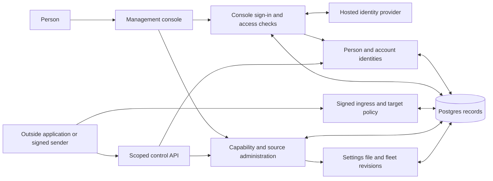
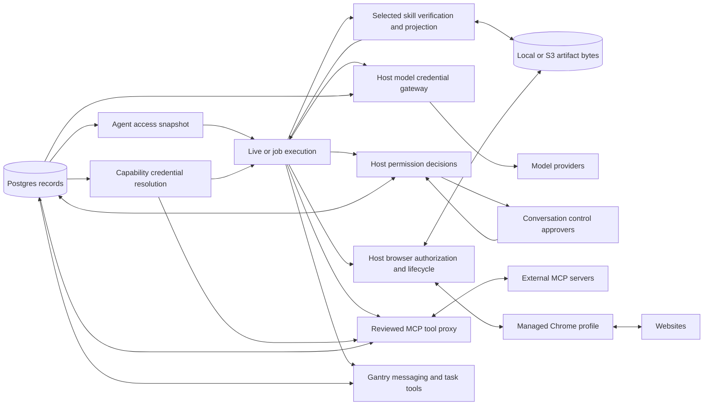
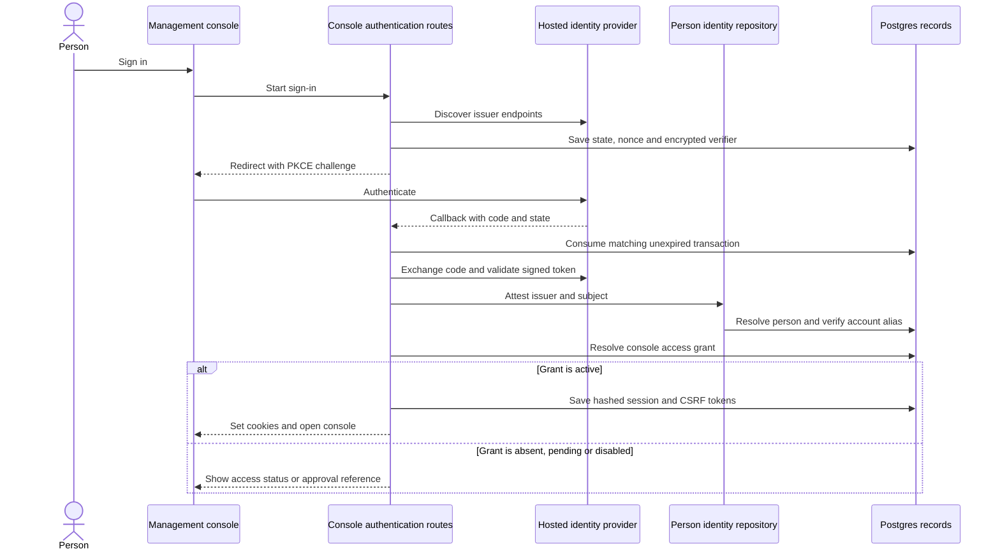
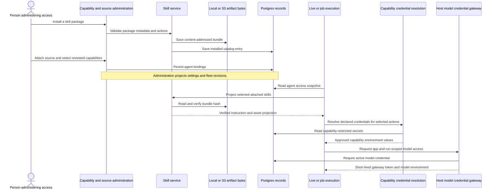
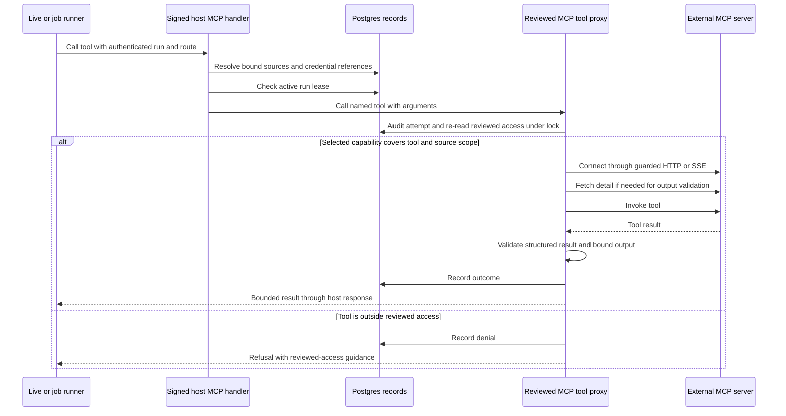
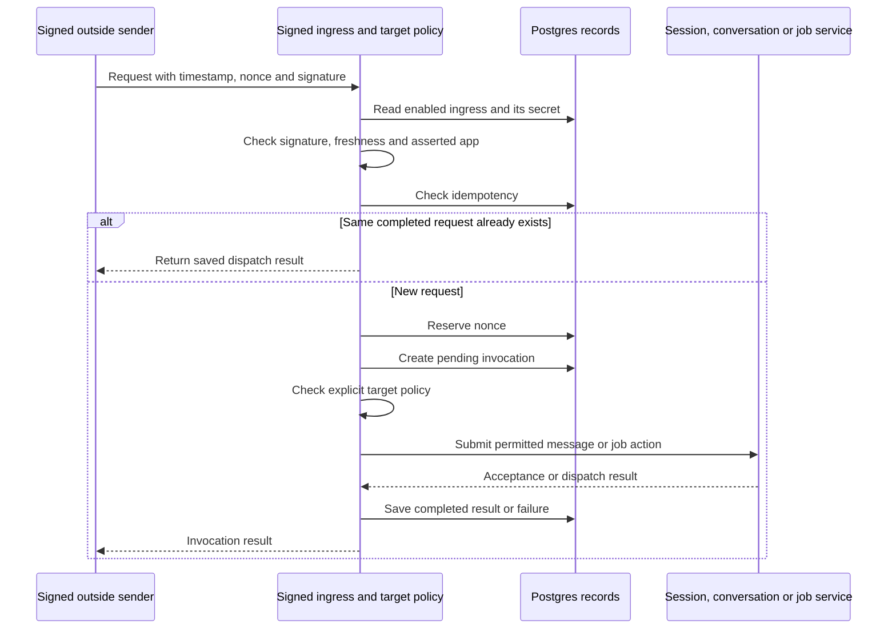

# Identity, credentials, capabilities, MCP and skills

## 1. What this area does

Gantry keeps track of which person is speaking, who may enter its management console, and what each AI employee may do ([person service][identity], [browser authentication][auth], [capability administration][admin]). A person can have several account identities, but matching names or email addresses does not automatically join those identities ([identity repository][identity-repo]). Owners choose reviewed capabilities, connect outside tools through MCP, and attach skills that teach an employee how to work; attaching a source or submitting a request does not itself grant permission to act ([capability selection][selection], [MCP access][proxy-capabilities], [skill service][skills]). Credentials are kept in host-managed storage and supplied through separate model and capability paths, rather than handed out as unrestricted access ([credential encryption][crypto], [model gateway][gateway], [capability secrets][secrets]). Browser work uses Gantry-managed persistent profiles, while signed requests from outside systems are limited to explicitly allowed targets ([browser lifecycle][browser], [ingress policy][target-policy]).

## 2. Architecture diagram

The two views contain 26 distinct nodes. They show responsibilities and calls, not one container per box; Postgres is the same shared store in both views ([bootstrap][app], [storage construction][storage]).

An ingress request dispatches to session, conversation or job services; execution happens through the runtime, not inside signature verification ([ingress module][ingress]). Capability/source administration calls the skill and MCP services, while runtime preparation reads their persisted bindings ([administration][admin], [skill service][skills], [MCP service][mcp-service]). The permission box describes host decisions used by execution lanes; it is not an extra approval after every already-approved MCP call ([permission coordinator][permission], [MCP authorization][mcp-authorization]).

| Diagram node                                  | Current file paths                                                                                                                                                                                                                |
| --------------------------------------------- | --------------------------------------------------------------------------------------------------------------------------------------------------------------------------------------------------------------------------------- |
| Person; Person and account identities         | `apps/core/src/application/identity/person-identity-service.ts`; `apps/core/src/adapters/storage/postgres/repositories/person-identity-repository.postgres.ts`; `apps/core/src/domain/identity/principal-ref.ts`.                 |
| Management console                            | `apps/web/src/app/app.tsx`; authentication requests reach `apps/core/src/control/server/routes/browser-auth.ts`.                                                                                                                  |
| Console sign-in and access checks             | `apps/core/src/control/server/routes/browser-auth.ts`; `apps/core/src/control/server/browser-auth-boundary.ts`; `apps/core/src/application/auth/auth-foundations.ts`.                                                             |
| Hosted identity provider                      | External OIDC issuer, discovery, token and signing-key endpoints called by `apps/core/src/adapters/auth/oidc-adapter.ts`.                                                                                                         |
| Outside application or signed sender          | `packages/sdk/src/index.ts`; `packages/sdk/src/ingress-signature.ts` represents the external caller's signing side.                                                                                                               |
| Scoped control API                            | `apps/core/src/control/server/index.ts`; `apps/core/src/control/server/auth.ts`; `apps/core/src/application/app-scope/resolve-app-scope.ts`.                                                                                      |
| Signed ingress and target policy              | `apps/core/src/control/server/routes/external-ingress.ts`; `apps/core/src/application/external-ingress/external-ingress-module.ts`; `apps/core/src/application/external-ingress/target-policy.ts`.                                |
| Capability and source administration          | `apps/core/src/application/agents/agent-capability-administration-service.ts`; `apps/core/src/application/skills/skill-service.ts`; `apps/core/src/application/mcp/mcp-server-service.ts`.                                        |
| Settings file and fleet revisions             | `apps/core/src/config/settings/restart-sync.ts`; `apps/core/src/config/settings/runtime-home.ts`; `apps/core/src/adapters/storage/postgres/schema/fleet-capability-state.ts`.                                                     |
| Postgres records                              | `apps/core/src/adapters/storage/postgres/factory.ts`; schema files listed in section 4.                                                                                                                                           |
| Agent access snapshot                         | `apps/core/src/runtime/group-agent-access-context.ts`; `apps/core/src/runtime/group-run-context.ts`; `apps/core/src/application/agent-execution/agent-access-snapshot.ts`.                                                        |
| Live or job execution                         | `apps/core/src/runtime/group-agent-runner.ts`; `apps/core/src/runtime/agent-spawn.ts`; `apps/core/src/runtime/agent-inline.ts`; `apps/core/src/jobs/execution.ts`.                                                                |
| Selected skill verification and projection    | `apps/core/src/application/skills/selected-skill-projection.ts`; `apps/core/src/adapters/llm/anthropic-claude-agent/claude-skill-materializer.ts`; `apps/core/src/adapters/llm/deepagents-langchain/skill-projection.ts`.         |
| Local or S3 artifact bytes                    | `apps/core/src/adapters/artifacts/skills/local-skill-artifact-store.ts`; `apps/core/src/adapters/artifacts/skills/s3-skill-artifact-store.ts`; browser profile stores under `apps/core/src/adapters/artifacts/browser-profiles/`. |
| Capability credential resolution              | `apps/core/src/application/capability-secrets/capability-secret-service.ts`; `apps/core/src/application/capability-secrets/mcp-secret-projection.ts`; `apps/core/src/application/capability-secrets/skill-secret-projection.ts`.  |
| Host model credential gateway                 | `apps/core/src/application/credentials/agent-credential-service.ts`; `apps/core/src/adapters/credentials/agent-credential-broker-factory.ts`; `apps/core/src/adapters/llm/anthropic-claude-agent/gantry-model-gateway.ts`.        |
| Model providers                               | External provider endpoints selected by `apps/core/src/shared/model-provider-registry.ts`, called through `apps/core/src/adapters/llm/anthropic-claude-agent/gantry-model-gateway.ts`.                                            |
| Host permission decisions                     | `apps/core/src/runtime/permission-decision-coordinator.ts`; `apps/core/src/runtime/core-tools/core-tool-permission-coordinator.ts`; `apps/core/src/application/interactions/durable-interaction-handler.ts`.                      |
| Conversation control approvers                | `apps/core/src/adapters/storage/postgres/schema/conversations.ts`; callback authorization in `apps/core/src/runtime/ipc-permission-decision-identity.ts`.                                                                         |
| Reviewed MCP tool proxy; External MCP servers | `apps/core/src/application/mcp/mcp-tool-proxy.ts`; `apps/core/src/application/mcp/mcp-tool-proxy-connection.ts` connects external HTTP/SSE servers using the MCP SDK.                                                             |
| Host browser authorization and lifecycle      | `apps/core/src/runtime/ipc-browser-handler.ts`; `apps/core/src/runtime/browser-capability.ts`; `apps/core/src/runtime/browser-profile-sync.ts`.                                                                                   |
| Managed Chrome profile; Websites              | `apps/core/src/runtime/browser-profiles.ts`; `apps/core/src/runtime/browser-config.ts`; `apps/core/src/adapters/browser/browser-direct-driver.ts` drives Chrome and its open website pages.                                       |
| Gantry messaging and task tools               | `apps/core/src/application/core-tools/send-message.ts`; `apps/core/src/application/core-tools/task-lifecycle.ts`; `apps/core/src/application/core-tools/callable-agent-tools.ts`.                                                 |

### The access boundaries

Identity is app-scoped and account-scoped: an alias matches its provider, provider account and external person identifier. The service normalizes provider names, email and international phone numbers; the repository creates missing human identities under an alias-key lock, refuses retired aliases, and distinguishes service people from human personal-memory subjects. Ordinary new aliases are unverified but may still resolve personal memory; verification is not a blanket prerequisite for that lookup ([person service][identity], [identity repository][identity-repo], [alias lookup][alias-lookup]). Person merge previews and fingerprint-checked changes move aliases and personal memory; unmerge checks that merge-owned data is still intact before restoring it ([person service][identity], [identity repository][identity-repo]).

Console access and API access are separate. The console checks a browser session, current access grant, origin and CSRF token for mutations; its grant roles are administrator and viewer. API calls authenticate a Bearer token against configured hashed keys and required scopes, and an asserted app must agree with the key's app. Local sign-in consumes an expiring, host-bound authorization code instead of using OIDC ([authentication][auth], [browser boundary][browser-boundary], [API authentication][api-auth], [app scope][app-scope], [authentication repository][auth-repo]).

Selected reviewed `capability:<id>` records are the authority model; manifests can bind actions from tools, skills, MCP sources, adapters or local CLIs. Sources supply instructions or discoverable tools, while selected capabilities supply action authority; a job inherits its bound agent's access. Local CLI declarations require pinned executable identity and reviewed command templates, with auth preflight, protected paths and denied environment overrides forming the credential boundary ([selection][selection], [semantic capabilities][semantic], [structured invocation][local-cli], [job access preparation][job-execution]).

Host permission decisions apply hard deny, locked preset, fixed-image restriction, reviewed agent authority, deterministic rails, optional cached classifier allow, optional risk classifier, and finally durable human approval. The coordinator also consults exact remembered denials before those restrictions, and consults learned roots and remembered human allows after rails; cache/classifier stages run only when the calling lane supplies them. Classifier cache is parent-conversation scoped, human **Allow once** is not reusable, and durable learned authority belongs to the agent and is mirrored through settings. One-time approval, durable granular access and **Cancel** are separate decisions ([coordinator][permission], [classifier stage][classifier], [human memory][human-memory], [remember settlement][remember], [permission decisions][permission-decisions]).

The control-plane read model summarizes configured readiness and chooses a next action; it is not a live connector-health probe. Guided actions return a preview and an execution receipt, or a manual instruction if that surface has no executor. Core messaging and task facades use injected runtime backends: callable-agent tools revalidate their target, and scheduled-job message sends are suppressed so the scheduler can send the completion notification ([read model][read-model], [storage inputs][read-storage], [guided actions][guided], [callable agents][callable], [core messaging][core-message]).

## 3. Key flows

### A. A person signs in to the hosted console

1. The start route discovers the issuer and saves a ten-minute transaction containing hashed state/nonce and an encrypted PKCE verifier before redirecting the browser ([sign-in preparation][oidc-flow]).
2. The callback matches the browser's state cookie, consumes the transaction, decrypts the verifier and exchanges the code. The OIDC adapter validates signature, issuer, audience, expiry, nonce and subject ([authentication routes][auth], [OIDC adapter][oidc]).
3. The repository resolves the person by app, issuer and subject, then verifies that account alias. A verified email may be attached to this person; it never selects or silently merges the person ([identity repository][identity-repo]).
4. The route processes an invitation when present, or may create an active viewer grant for the configured company domain; otherwise missing or pending access gets an approval reference and disabled access is refused. Active access receives an opaque session cookie and CSRF cookie, with hashes stored in Postgres ([authentication routes][auth], [authentication schema][auth-schema]).
5. Later requests re-read session expiry, revocation and the current access grant. Mutations also require the canonical origin and matching CSRF token ([authentication repository][auth-repo], [browser boundary][browser-boundary]).

### B. An owner equips an employee with a skill and approved access

1. Installation parses `SKILL.md`, required credential names and declared action permissions, rejects reserved materialization names, and stores an immutable bundle before saving its catalog entry. Reinstallation reuses the matching skill identity and disables installed materialization duplicates ([skill service][skills], [local artifact store][local-artifacts], [S3 artifact store][s3-artifacts]).
2. Attaching the skill creates an active agent binding and handles same-directory collisions; selecting reviewed capabilities validates durable access rules and replaces agent capability bindings. Source attachment and action selection remain separate operations. Administration callers synchronize the settings projection afterward ([skill service][skills], [capability administration][admin], [selection][selection], [browser skill routes][browser-skills], [approval/settings synchronization][ipc-admin]).
3. Runtime preparation loads tool, skill and MCP access together into a host snapshot and validates row ownership. Selected-skill projection requires an enabled, materializable artifact, unique normalized asset paths, `SKILL.md`, no directory collision and the recorded bundle hash ([runtime access context][access], [access snapshot][snapshot], [skill projection][projection]).
4. Claude materializes verified skill assets into its runner skill layout; DeepAgents projects UTF-8 text into its virtual `/skills/` files and rejects unsupported binary assets. Both start from the same verified projection ([Claude skill materializer][claude-skills], [DeepAgents skill projection][deep-skills]).
5. Skill secret projection derives credential names from selected skill-action runtime access and checks each secret's capability restrictions. MCP credential references similarly become configured environment keys or HTTP headers, and missing MCP values stop materialization ([skill secret projection][skill-secrets], [secret service][secrets], [MCP materialization][materialization]).
6. Model access uses the separate broker: it requires an active app/provider credential and issues an expiring scoped gateway token. `modelCredentialEnv` carries model access, while approved tool networking uses `toolNetworkEnv`; model broker proxies and raw provider tokens are excluded from tool subprocess environments ([broker service][broker], [gateway][gateway], [runner preparation][spawn]).

### C. An employee calls a connected MCP tool

1. The host handler requires signed app scope, the originating conversation, an authenticated route and a live run lease. It builds a proxy with current source bindings, credential values, the configured egress denylist and audit publishing ([host handlers][mcp-handler], [proxy construction][ipc-admin]).
2. Listing/searching can discover tools from bound source inventory without granting action authority. At call time the proxy re-reads selected capability bindings under the repository's authorization lock, intersects reviewed tool names/patterns with source scope, and rejects uncovered tools; transient exact rules cannot create MCP action authority ([source discovery][mcp-sources], [proxy capabilities][proxy-capabilities], [reviewed resolution][reviewed], [tool authorization][mcp-authorization]).
3. HTTP/SSE connection checks destination policy and uses guarded fetch with redirects refused; host-owned loopback HTTP is handled explicitly. The current-session proxy refuses stdio-template execution until sandboxed stdio execution is implemented ([connection][mcp-connection], [network guard][mcp-network]).
4. A direct call does not require a prior describe request: the proxy obtains missing tool detail before preparing output-schema validation, then invokes the remote tool with its timeout and optional cancellation signal ([proxy][mcp-proxy], [detail resolution][mcp-detail], [result validation][mcp-result]).
5. The host validates structured output, bounds returned data and records the outcome. Once a remote result has returned, a failed outcome-audit append does not turn completed external work into a retryable call failure ([proxy][mcp-proxy], [output bounds][mcp-bounds]).

### D. An outside system submits a signed request

1. The HTTP route passes raw request bytes to the module, which loads an enabled ingress and checks an HMAC over method, path, timestamp, nonce, body hash and raw body. Default timestamp tolerance is five minutes, and a supplied app must match the ingress app ([ingress route][ingress-route], [ingress module][ingress], [signature][signature]).
2. Idempotency lookup happens before nonce reservation. Matching completed requests return their saved response; changed bodies and duplicate pending requests conflict. A new request reserves a durable nonce and creates a pending invocation that stores the body hash and a redacted signature ([ingress module][ingress], [ingress repository][ingress-repo]).
3. Target policy explicitly allows kinds and target identifiers; absent policy sets allow nothing. Supported targets are session messages, conversation messages, existing job triggers and configured job templates ([target policy][target-policy], [dispatch][ingress]).
4. Session targets call the session-interaction service; conversation targets use the conversation ingress path and runtime dispatch port; job targets use job management. A successful dispatch is saved as completed, which does not mean the model has finished or gained extra tools. A failed dispatch is saved as failed ([ingress module][ingress], [conversation ingress][conversation-ingress], [runtime dispatch port][dispatch-port], [job requirements][job-access]).

## 4. Data it owns

These are implementation table names; the public identity noun is **person** and its public identifier is `personId` ([person service][identity]). Runtime events, settings revisions, leases and memory are shared with neighboring areas rather than separate identity-owned databases ([storage][storage]).

| Table or file                       | What it holds and current owner path                                                                                                                                                                                                                                                                                             |
| ----------------------------------- | -------------------------------------------------------------------------------------------------------------------------------------------------------------------------------------------------------------------------------------------------------------------------------------------------------------------------------- |
| `users`                             | App-scoped human/service person records, status and optional agent association; `apps/core/src/adapters/storage/postgres/schema/apps.ts`.                                                                                                                                                                                        |
| `user_aliases`                      | Provider/account/external-person links, verification, retirement and evidence; `apps/core/src/adapters/storage/postgres/schema/apps.ts`.                                                                                                                                                                                         |
| `person_merge_audit`                | Merge idempotency, actor, conflicts and restoration evidence; `apps/core/src/adapters/storage/postgres/schema/apps.ts`.                                                                                                                                                                                                          |
| `identity_offboarding_audit`        | Agent/person offboarding results and idempotency; `apps/core/src/adapters/storage/postgres/schema/apps.ts`.                                                                                                                                                                                                                      |
| `local_authorization_codes`         | Hashed single-use local sign-in codes, canonical host and expiry; `apps/core/src/adapters/storage/postgres/schema/authentication.ts`.                                                                                                                                                                                            |
| `oidc_transactions`                 | Hashed state/nonce, encrypted verifier, invitation/reauthentication context and expiry; `apps/core/src/adapters/storage/postgres/schema/authentication.ts`.                                                                                                                                                                      |
| `console_access_grants`             | Person's console role and active/pending/disabled access; `apps/core/src/adapters/storage/postgres/schema/authentication.ts`.                                                                                                                                                                                                    |
| `browser_sessions`                  | Hashed console session/CSRF tokens, expiry, revocation and reauthentication time; `apps/core/src/adapters/storage/postgres/schema/authentication.ts`.                                                                                                                                                                            |
| `console_invitations`               | Hashed invitation token, invited email, role and lifecycle; `apps/core/src/adapters/storage/postgres/schema/authentication.ts`.                                                                                                                                                                                                  |
| `model_credentials`                 | Encrypted provider payload, auth mode, status and fingerprints; `apps/core/src/adapters/storage/postgres/schema/model-credentials.ts`.                                                                                                                                                                                           |
| `capability_secrets`                | Encrypted named values and allowed capability identifiers; `apps/core/src/adapters/storage/postgres/schema/capability-secrets.ts`.                                                                                                                                                                                               |
| `tool_catalog`                      | Tool/action definitions, schemas, risk and adapter bindings, including semantic capability records; `apps/core/src/adapters/storage/postgres/schema/tools.ts`.                                                                                                                                                                   |
| `agent_tool_bindings`               | Agent selection of tool authority, optionally person/config scoped; `apps/core/src/adapters/storage/postgres/schema/tools.ts`.                                                                                                                                                                                                   |
| `agent_tool_sources`                | Agent-attached tool source identity, kind and version; `apps/core/src/adapters/storage/postgres/schema/tools.ts`.                                                                                                                                                                                                                |
| `skill_catalog`                     | Installed skill metadata, action declarations, required credentials and artifact reference/hash; `apps/core/src/adapters/storage/postgres/schema/skills.ts`.                                                                                                                                                                     |
| `agent_skill_bindings`              | Active/disabled skill attachments per agent; `apps/core/src/adapters/storage/postgres/schema/skills.ts`.                                                                                                                                                                                                                         |
| `mcp_servers`                       | Transport configuration, tool patterns, network hosts and credential references; `apps/core/src/adapters/storage/postgres/schema/mcp-servers.ts`.                                                                                                                                                                                |
| `agent_mcp_server_bindings`         | Agent MCP attachments, optional conversation/thread restrictions and required flag; `apps/core/src/adapters/storage/postgres/schema/mcp-servers.ts`.                                                                                                                                                                             |
| `mcp_server_audit_events`           | MCP connection/materialization and tool activity evidence; `apps/core/src/adapters/storage/postgres/schema/mcp-servers.ts`.                                                                                                                                                                                                      |
| `external_ingresses`                | Enabled inbound signing authority, encrypted secret and target/template policy; `apps/core/src/adapters/storage/postgres/schema/external-ingress.ts`; encryption in `apps/core/src/adapters/storage/postgres/repositories/control-plane-external-ingress.postgres.ts`.                                                           |
| `external_ingress_invocations`      | Request digest, redacted signature, idempotency, dispatch result/error and expiry; `apps/core/src/adapters/storage/postgres/schema/external-ingress.ts`.                                                                                                                                                                         |
| `external_ingress_nonces`           | Replay reservations and expiry; `apps/core/src/adapters/storage/postgres/schema/external-ingress.ts`.                                                                                                                                                                                                                            |
| `browser_profiles`                  | Durable profile snapshot hash/reference, auth markers and lease/run fencing metadata; `apps/core/src/adapters/storage/postgres/schema/browser.ts`.                                                                                                                                                                               |
| Shared permission/settings records  | Permission prompts, interactions, decision memory and fleet settings revisions support approval and projection; `apps/core/src/adapters/storage/postgres/schema/worker-coordination.ts`, `apps/core/src/adapters/storage/postgres/schema/schema.ts`, `apps/core/src/adapters/storage/postgres/schema/fleet-capability-state.ts`. |
| Skill artifact bundles              | Immutable `apps/<app>/skills/<skill>/<hash>/` assets on local disk or S3; `apps/core/src/adapters/artifacts/skills/local-skill-artifact-store.ts`, `apps/core/src/adapters/artifacts/skills/s3-skill-artifact-store.ts`.                                                                                                         |
| Managed profile files and snapshots | Local `profile.json`, Chrome `user-data/`, session record and snapshot marker; shared snapshot bytes in the browser-profile artifact store; `apps/core/src/runtime/browser-profiles.ts`, `apps/core/src/runtime/browser-session-record.ts`, `apps/core/src/runtime/browser-profile-sync.ts`.                                     |
| Settings file and revisions         | Desired agent access and source selection projected to runtime-home `settings.yaml` and fleet revisions; `apps/core/src/config/settings/restart-sync.ts`; `apps/core/src/adapters/storage/postgres/schema/fleet-capability-state.ts`.                                                                                            |

## 5. How it scales and fails

### Process roles

The role table is executable bootstrap policy; workers still expose operational/read-only diagnostic HTTP routes, while full administration belongs to `all` and `control` ([role capabilities][roles], [bootstrap][app]).

| Role          | Responsibilities relevant to this area                                                                                                                                    |
| ------------- | ------------------------------------------------------------------------------------------------------------------------------------------------------------------------- |
| `all`         | Full control API and settings writes, inbound channel callbacks, live turns and jobs, worker registration/capability reconciliation and toolchain bake execution.         |
| `control`     | Full control API, console authentication, source/credential administration and settings writes; no live/job execution, inbound provider callbacks or worker registration. |
| `live-worker` | Inbound channels, live turns and interaction callbacks, worker registration/reconciliation; operational API only, no desired-state writes or scheduler execution.         |
| `job-worker`  | Scheduled execution, outbound-only channel connections, worker registration/reconciliation and bake execution; operational API only and no desired-state writes.          |

Each executing process prepares its own runs, model gateway, MCP connections and browser sessions; these boxes are not centrally shared live connections. Fleet boot registers shared browser snapshot coordination after fleet settings load, and capability reconciliation prepares workers for desired access ([runtime app][runtime-app], [spawn][spawn], [MCP cache][mcp-cache], [browser lifecycle][browser], [fleet boot][fleet]). The `direct` runner is not OS-contained by Gantry or an inner Claude SDK sandbox: host permission/credential rails and the deployment boundary are its controls. `sandbox_runtime` is optional outer whole-runner confinement, not a prerequisite for a fleet ([runner providers][runner-providers], [runner preparation][spawn]).

### Durable state, local state and recovery

- **Identity and console access:** people, aliases, grants, invitations and browser sessions survive restart in Postgres. Alias creation serializes by the app/provider/account/external identity key; person merges and restores use transactions. Session reads recheck grant status, expiry and revocation, so keeping a cookie does not preserve revoked access ([identity repository][identity-repo], [authentication repository][auth-repo]).
- **Credentials:** capability/model values and OIDC verifiers use authenticated AES-256-GCM ciphertext bound to their app, subject and schema context. The active encryption key/keyring comes from the runtime secret provider, not from the credential row. Missing keys, unsupported ciphertext or authentication failure prevent decryption; ingress has its own encrypted envelope and keyring reader. Administrative credential responses/audits expose metadata rather than secret payloads ([credential crypto][crypto], [secret service][secrets], [model credential service][model-credentials], [ingress repository][ingress-repo]).
- **Model gateway:** the HTTP listener, issued-token map, expiration sweep and rate-limit state are process-local. Tokens carry app/provider/purpose/run scope; each request rechecks the active stored credential and its fingerprint/auth mode/schema. Disable/remove/rotate can reject existing tokens; shutdown clears them and restart requires fresh injection ([gateway][gateway]).
- **Skills:** catalog/bindings live in Postgres; executable bundle bytes live in the configured local or S3 store. The factory selects `S3SkillArtifactStore` directly for S3; bundle reads list and fetch S3 objects without warming a local cache. Missing or hash-mismatched selected bundles stop runner preparation. Installation writes artifact bytes before metadata, so an interrupted install can leave unreferenced bytes rather than an installed catalog entry ([skill service][skills], [verified projection][projection], [S3 artifact store][s3-artifacts]).
- **MCP:** inventory/detail caches and client connections are in memory; restart rebuilds them from durable definitions/bindings. Client keys include app, agent, route, source revision and materialized configuration; idle connections close after two minutes, tool-change notifications invalidate inventory, and call failures close the cached client. Requests use timeouts and bounded output; an external side effect can still have happened if the connection dies before its result reaches Gantry ([proxy][mcp-proxy], [client cache][mcp-cache], [inventory cache][mcp-inventory], [connection][mcp-connection]).
- **Browser:** Chrome processes, CDP sessions, pending launches and usage state are local; the host chooses the profile from agent/conversation/account context, with thread and job execution policy rather than arbitrary agent-supplied folders. Profile leases serialize ownership. Fleet turns snapshot quiescent profile bytes after browser use and restore on another worker before launch, using hashes and lease-generation fences; workstation profiles remain local. A crash before snapshot can lose the latest cross-worker profile changes. Lease loss suppresses stale snapshots; a busy profile can skip finalization snapshot. Restore I/O failures block launch, while corrupt snapshots are quarantined and launch proceeds from local state ([profile resolver][profile-resolver], [profile leases][profiles], [lifecycle][browser], [snapshot coordinator][browser-sync], [live finalizer][browser-finalize], [job cleanup][browser-cleanup]).
- **Approvals:** durable prompts and interactions outlive an HTTP connection or local waiter. The host checks run ownership and persists settlement; it refuses unresolved durable permission settlement and reports delivery failure instead of pretending permission was granted. Remembered classifier allows and durable human authority have different scopes; a one-time grant is not reusable ([durable interaction][interaction], [core permission boundary][core-permission], [permission coordinator][permission], [human memory][human-memory]).
- **Signed ingress:** nonce/idempotency reservations and results survive restart, but reservation, target dispatch and final status are separate operations. A crash between them leaves pending state; same-body duplicates conflict while pending. The repository sweep marks pending rows older than five minutes failed and removes expired state; it does not roll back or cancel already-dispatched work ([ingress module][ingress], [ingress recovery][ingress-repo], [maintenance timer][server]).

## 6. Video script outline

1. Introduce three checks: which person is here, whether they can manage Gantry, and what their AI employee may do ([identity][identity], [console authentication][auth], [capability selection][selection]).
2. Show accounts linking to one person, then show sign-in checking a separate console access grant ([identity repository][identity-repo], [authentication][auth]).
3. Equip an employee with a skill and connector, then separately select the reviewed actions it may perform ([skills][skills], [administration][admin]).
4. Put model credentials and tool credentials into separate host-managed lanes before work starts ([model gateway][gateway], [capability secrets][secrets], [runner preparation][spawn]).
5. Follow a connector action through current access checks, or pause at a conversation approval when the permission lane needs a human decision ([MCP proxy][mcp-proxy], [permission coordination][permission], [durable approval][interaction]).
6. Show Browser opening Gantry's managed Chrome profile and carrying saved login state between workers through verified snapshots ([browser lifecycle][browser], [snapshot coordination][browser-sync]).
7. End with signed outside requests entering through allowed targets and shared Postgres retaining identities, access and results across process restarts ([ingress][ingress], [target policy][target-policy], [storage][storage]).

## 7. Duplication and simplification

### (a) Existing audit findings

The supplied audit is an external artifact. Its findings are linked by title, without repeating their reports:

- [Disabled connections still count as ready — UX / parallel][audit]
- [Skill receipts request credentials without checking whether they exist — UX][audit]
- [Credential-binding setup is a wired no-op — dead / over-complicated][audit]
- [The remote skill cache only writes — over-complicated][audit]
- [Skill frontmatter parsing exists three times — duplicate][audit]
- [Skill artifact path validation exists three times — duplicate][audit]

The audit also lists engine permission gates, job setup-state plumbing and alternative ingress persistence branches as covered by existing work ([audit][audit]).

### (b) Newly noticed while tracing

1. **Encryption keyring configuration has four parallel validators.** Copies: `apps/core/src/adapters/storage/postgres/repositories/credential-secret-crypto.ts:42` resolves the configured key and `:185` validates the keyring; `apps/core/src/adapters/storage/postgres/repositories/control-plane-external-ingress.postgres.ts:422` resolves the same configuration and `:460` repeats its JSON shape, active-key and base64/32-byte checks; `apps/core/src/jobs/async-task-execution-payload.ts:215` resolves keys and `:254` repeats the parser; `apps/core/src/shared/security-posture.ts:110` checks configuration and `:117` repeats keyring validation before applying its additional key-strength check. **Survive:** one shared structural keyring parser based on the credential implementation, plus the security-posture strength predicate. Keep each caller's secret source, error contract, ciphertext envelope, key identifier derivation and authenticated context; ingress currently tries available keys rather than looking up an envelope key identifier. This is duplicated configuration logic, not a claim that the ciphertext formats are interchangeable. **Size: fix** ([credential copy][crypto], [ingress copy][ingress-repo], [task payload copy][task-payload], [security posture copy][security-posture]).

[identity]: ../../../apps/core/src/application/identity/person-identity-service.ts
[identity-repo]: ../../../apps/core/src/adapters/storage/postgres/repositories/person-identity-repository.postgres.ts
[alias-lookup]: ../../../apps/core/src/adapters/storage/postgres/repositories/person-identity-alias-lookup.postgres.ts
[auth]: ../../../apps/core/src/control/server/routes/browser-auth.ts
[auth-repo]: ../../../apps/core/src/adapters/storage/postgres/repositories/authentication-repository.postgres.ts
[auth-schema]: ../../../apps/core/src/adapters/storage/postgres/schema/authentication.ts
[browser-boundary]: ../../../apps/core/src/control/server/browser-auth-boundary.ts
[oidc-flow]: ../../../apps/core/src/control/server/browser-oidc.ts
[oidc]: ../../../apps/core/src/adapters/auth/oidc-adapter.ts
[api-auth]: ../../../apps/core/src/control/server/auth.ts
[app-scope]: ../../../apps/core/src/application/app-scope/resolve-app-scope.ts
[admin]: ../../../apps/core/src/application/agents/agent-capability-administration-service.ts
[selection]: ../../../apps/core/src/application/agents/agent-capability-selection.ts
[semantic]: ../../../apps/core/src/shared/semantic-capabilities.ts
[local-cli]: ../../../apps/core/src/jobs/structured-local-cli-invocation.ts
[job-access]: ../../../apps/core/src/application/jobs/job-capability-requirements.ts
[job-execution]: ../../../apps/core/src/jobs/execution-phases-run.ts
[skills]: ../../../apps/core/src/application/skills/skill-service.ts
[projection]: ../../../apps/core/src/application/skills/selected-skill-projection.ts
[claude-skills]: ../../../apps/core/src/adapters/llm/anthropic-claude-agent/claude-skill-materializer.ts
[deep-skills]: ../../../apps/core/src/adapters/llm/deepagents-langchain/skill-projection.ts
[browser-skills]: ../../../apps/core/src/control/server/routes/browser-skills.controller.ts
[secrets]: ../../../apps/core/src/application/capability-secrets/capability-secret-service.ts
[skill-secrets]: ../../../apps/core/src/application/capability-secrets/skill-secret-projection.ts
[model-credentials]: ../../../apps/core/src/application/model-credentials/model-credential-service.ts
[crypto]: ../../../apps/core/src/adapters/storage/postgres/repositories/credential-secret-crypto.ts
[task-payload]: ../../../apps/core/src/jobs/async-task-execution-payload.ts
[security-posture]: ../../../apps/core/src/shared/security-posture.ts
[broker]: ../../../apps/core/src/application/credentials/agent-credential-service.ts
[gateway]: ../../../apps/core/src/adapters/llm/anthropic-claude-agent/gantry-model-gateway.ts
[storage]: ../../../apps/core/src/adapters/storage/postgres/factory.ts
[app]: ../../../apps/core/src/app/index.ts
[server]: ../../../apps/core/src/control/server/index.ts
[runtime-app]: ../../../apps/core/src/app/bootstrap/runtime-app.ts
[roles]: ../../../apps/core/src/app/bootstrap/roles/role-capabilities.ts
[fleet]: ../../../apps/core/src/app/bootstrap/fleet-boot.ts
[access]: ../../../apps/core/src/runtime/group-agent-access-context.ts
[snapshot]: ../../../apps/core/src/application/agent-execution/agent-access-snapshot.ts
[spawn]: ../../../apps/core/src/runtime/agent-spawn.ts
[runner-providers]: ../../../apps/core/src/adapters/sandbox/runner-sandbox-provider.ts
[permission]: ../../../apps/core/src/runtime/permission-decision-coordinator.ts
[classifier]: ../../../apps/core/src/runtime/ipc-permission-classifier-decision.ts
[human-memory]: ../../../apps/core/src/runtime/permission-human-memory-stage.ts
[remember]: ../../../apps/core/src/runtime/permission-remember-settlement.ts
[permission-decisions]: ../../../apps/core/src/domain/permission-decision.ts
[interaction]: ../../../apps/core/src/application/interactions/durable-interaction-handler.ts
[core-permission]: ../../../apps/core/src/runtime/core-tools/core-tool-permission-coordinator.ts
[core-message]: ../../../apps/core/src/application/core-tools/send-message.ts
[callable]: ../../../apps/core/src/application/core-tools/callable-agent-tools.ts
[read-model]: ../../../apps/core/src/application/control-plane/control-plane-read-model.ts
[read-storage]: ../../../apps/core/src/application/control-plane/control-plane-storage-model.ts
[guided]: ../../../apps/core/src/application/guided-actions/guided-action-service.ts
[local-artifacts]: ../../../apps/core/src/adapters/artifacts/skills/local-skill-artifact-store.ts
[s3-artifacts]: ../../../apps/core/src/adapters/artifacts/skills/s3-skill-artifact-store.ts
[mcp-service]: ../../../apps/core/src/application/mcp/mcp-server-service.ts
[materialization]: ../../../apps/core/src/application/mcp/mcp-server-materialization.ts
[mcp-sources]: ../../../apps/core/src/application/mcp/mcp-authorized-servers.ts
[proxy-capabilities]: ../../../apps/core/src/application/mcp/mcp-tool-proxy-capabilities.ts
[mcp-authorization]: ../../../apps/core/src/application/mcp/mcp-tool-authorization.ts
[reviewed]: ../../../apps/core/src/application/mcp/mcp-reviewed-tool-resolution.ts
[mcp-proxy]: ../../../apps/core/src/application/mcp/mcp-tool-proxy.ts
[mcp-handler]: ../../../apps/core/src/jobs/ipc-mcp-tool-handlers.ts
[ipc-admin]: ../../../apps/core/src/jobs/ipc-admin-handlers.ts
[mcp-connection]: ../../../apps/core/src/application/mcp/mcp-tool-proxy-connection.ts
[mcp-network]: ../../../apps/core/src/application/mcp/mcp-tool-proxy-network.ts
[mcp-detail]: ../../../apps/core/src/application/mcp/mcp-tool-detail-fetch.ts
[mcp-result]: ../../../apps/core/src/application/mcp/mcp-tool-result-validation.ts
[mcp-bounds]: ../../../apps/core/src/application/mcp/mcp-tool-output-bounds.ts
[mcp-cache]: ../../../apps/core/src/application/mcp/mcp-tool-proxy-client-cache.ts
[mcp-inventory]: ../../../apps/core/src/application/mcp/mcp-tool-inventory.ts
[browser]: ../../../apps/core/src/runtime/browser-capability.ts
[profiles]: ../../../apps/core/src/runtime/browser-profiles.ts
[profile-resolver]: ../../../apps/core/src/shared/browser-profile-scope.ts
[browser-sync]: ../../../apps/core/src/runtime/browser-profile-sync.ts
[browser-finalize]: ../../../apps/core/src/app/bootstrap/live-turn-browser-finalizer.ts
[browser-cleanup]: ../../../apps/core/src/jobs/execution-browser-cleanup.ts
[ingress]: ../../../apps/core/src/application/external-ingress/external-ingress-module.ts
[ingress-route]: ../../../apps/core/src/control/server/routes/external-ingress.ts
[target-policy]: ../../../apps/core/src/application/external-ingress/target-policy.ts
[signature]: ../../../apps/core/src/application/external-ingress/signature.ts
[conversation-ingress]: ../../../apps/core/src/application/external-ingress/conversation-message-ingress.ts
[dispatch-port]: ../../../apps/core/src/application/external-ingress/runtime-dispatch.ts
[ingress-repo]: ../../../apps/core/src/adapters/storage/postgres/repositories/control-plane-external-ingress.postgres.ts
[audit]: ../audits/2026-10-02-area-audit/09-identity-access.md
