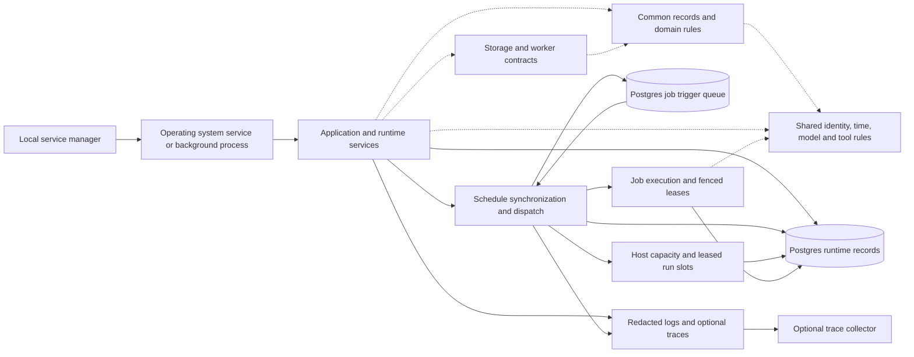
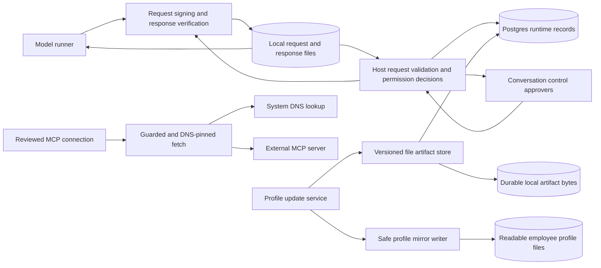
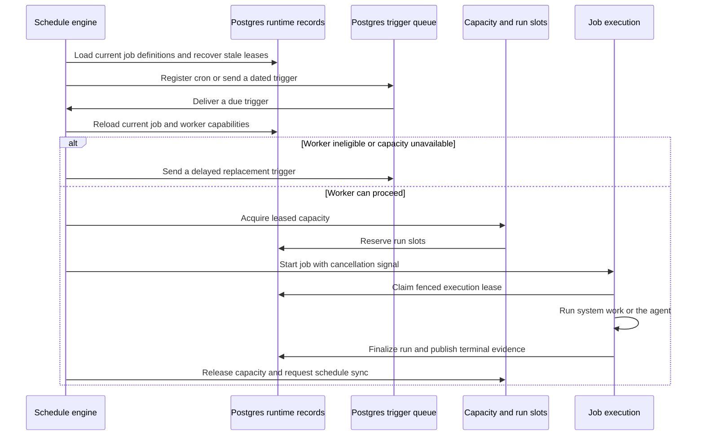
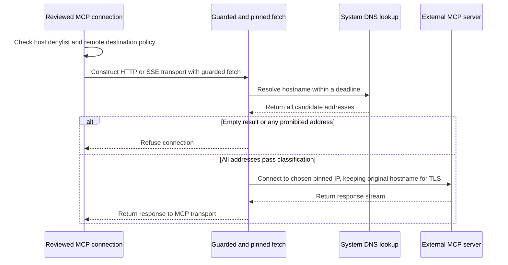

# Shared utilities and domain types

## 1. What this area does

This area gives Gantry a common vocabulary for people’s conversations, AI employees, messages, jobs, permissions and saved files, so different parts of the product can exchange the same kinds of records ([domain contracts][types], [messages][messages], [jobs][job-types]). It provides reusable rules for choosing models, checking reviewed tool access, handling time and identifying work ([model selection][catalog], [model routing][model-route], [tool policy][tool-policy], [time helpers][time], [work identity][queue-key]). Its infrastructure turns saved job schedules into execution triggers and helps recover work when a worker disappears ([scheduler][scheduler], [worker recovery][recovery]). It also signs requests between runners and their host, checks remote network destinations, and writes readable copies of durable employee profiles ([signing][signing], [network checks][pinned-fetch], [profile mirrors][mirror]). Logging, optional tracing and local background-service management help operators see what happened and keep the runtime running ([logger][logger], [tracing][tracing], [service manager][service]).

## 2. Architecture diagram

These are responsibility maps, not one process per box. Dashed arrows mean a code dependency on a shared rule or contract; solid arrows show runtime calls or data movement. The two views contain 27 distinct nodes, with the same Postgres store in both ([layer map][layers], [runtime composition][bootstrap], [storage construction][storage-factory]).





The request signer is shared; the host uses the infrastructure response signer and the runner uses the shared response verifier. The signing box groups those complementary functions, not a single network service ([shared signing][signing], [host request verifier][request-signing], [host response signer][response-signing]). The MCP connection shown is the HTTP/SSE transport to an outside MCP server; it is separate from Gantry’s public realtime event API ([connection construction][mcp-connection]).

| Diagram node                                                          | Current code or external-system boundary                                                                                                                                                                                                                     |
| --------------------------------------------------------------------- | ------------------------------------------------------------------------------------------------------------------------------------------------------------------------------------------------------------------------------------------------------------ |
| Common records and domain rules                                       | `apps/core/src/domain/types.ts`, `apps/core/src/domain/messages/messages.ts`, `apps/core/src/domain/job-types.ts`, `apps/core/src/domain/permission-deterministic-rails.ts`.                                                                                 |
| Shared identity, time, model and tool rules                           | `apps/core/src/shared/ids/branded-id.ts`, `apps/core/src/shared/thread-queue-key.ts`, `apps/core/src/shared/time/datetime.ts`, `apps/core/src/shared/model-catalog.ts`, `apps/core/src/shared/tool-execution-policy-service.ts`.                             |
| Application and runtime services                                      | `apps/core/src/app/bootstrap/runtime-services.ts`, `apps/core/src/app/index.ts`; concrete profile and MCP callers appear in the second view.                                                                                                                 |
| Storage and worker contracts                                          | `apps/core/src/domain/ports/repositories.ts`, `apps/core/src/domain/ports/worker-coordination.ts`, `apps/core/src/domain/ports/runtime-lease.ts`, `apps/core/src/domain/ports/file-artifact-store.ts`; interfaces, not running services.                     |
| Postgres runtime records                                              | `apps/core/src/adapters/storage/postgres/factory.ts`, `apps/core/src/adapters/storage/postgres/schema/jobs.ts`, `apps/core/src/adapters/storage/postgres/schema/worker-coordination.ts`, `apps/core/src/adapters/storage/postgres/schema/file-artifacts.ts`. |
| Schedule synchronization and dispatch; Postgres job trigger queue     | `apps/core/src/infrastructure/pgboss/scheduler-engine.ts`; pg-boss manages the separate `pgboss` schema and `gantry.jobs` queue.                                                                                                                             |
| Host capacity and leased run slots                                    | `apps/core/src/shared/host-capacity.ts`, `apps/core/src/jobs/concurrency.ts`, `apps/core/src/domain/ports/worker-coordination.ts`.                                                                                                                           |
| Job execution and fenced leases                                       | `apps/core/src/jobs/execution.ts`, `apps/core/src/jobs/execution-phases-setup.ts`, `apps/core/src/jobs/execution-lease.ts`.                                                                                                                                  |
| Redacted logs and optional traces; Optional trace collector           | `apps/core/src/infrastructure/logging/logger.ts`, `apps/core/src/infrastructure/observability/tracing.ts`; the latter exports to a configured external OTLP HTTP endpoint.                                                                                   |
| Local service manager; Operating system service or background process | `apps/core/src/infrastructure/service/manager.ts`, `apps/core/src/infrastructure/service/launchd.ts`, `apps/core/src/infrastructure/service/platform.ts`; launchd, systemd user service or detached-process fallback.                                        |
| Model runner; Request signing and response verification               | `apps/core/src/runner/permission-ipc-client.ts`, `apps/core/src/shared/ipc-signing.ts`, `apps/core/src/infrastructure/ipc/request-signing.ts`, `apps/core/src/infrastructure/ipc/response-signing.ts`.                                                       |
| Local request and response files                                      | `apps/core/src/platform/workspace-folder.ts`, `apps/core/src/runner/permission-ipc-client.ts`, `apps/core/src/runtime/ipc-interaction-handler.ts`; per-workspace directories under the configured data directory.                                            |
| Host request validation and permission decisions                      | `apps/core/src/runtime/ipc-auth-validation.ts`, `apps/core/src/runtime/ipc-interaction-processing.ts`, `apps/core/src/runtime/permission-decision-coordinator.ts`.                                                                                           |
| Conversation control approvers                                        | Human recipients reached through `apps/core/src/app/bootstrap/runtime-services.ts` and `apps/core/src/app/bootstrap/inline-agent-loop-tools.ts`; channel delivery is outside this area.                                                                      |
| Profile update service; Versioned file artifact store                 | `apps/core/src/application/agents/agent-profile-service.ts`, `apps/core/src/adapters/storage/postgres/repositories/file-artifact-repository.postgres.ts`; the contract is `apps/core/src/domain/ports/file-artifact-store.ts`.                               |
| Durable local artifact bytes                                          | `apps/core/src/adapters/artifacts/files/local-file-artifact-bytes.ts`, wired by `apps/core/src/adapters/storage/postgres/factory.ts`.                                                                                                                        |
| Safe profile mirror writer; Readable employee profile files           | `apps/core/src/platform/profile-file-mirror.ts`, `apps/core/src/platform/runtime-layout.ts`; copies live in the runtime home’s employee workspace folders.                                                                                                   |
| Reviewed MCP connection                                               | `apps/core/src/application/mcp/mcp-tool-proxy-connection.ts`, `apps/core/src/application/mcp/mcp-tool-proxy-network.ts`.                                                                                                                                     |
| Guarded and DNS-pinned fetch                                          | `apps/core/src/shared/dns-pinned-fetch.ts`, `apps/core/src/shared/hostname-lookup-deadline.ts`, `apps/core/src/shared/network-host-declaration.ts`.                                                                                                          |
| System DNS lookup; External MCP server                                | `apps/core/src/infrastructure/network/hostname-lookup.ts` calls the system resolver; `apps/core/src/shared/dns-pinned-fetch.ts` makes the HTTP(S) connection to the configured server.                                                                       |

## 3. Key flows

Other shared building blocks are called inside these services rather than running as separate components. Branded IDs distinguish record identities at type-check time; they do not validate arbitrary input at runtime (`apps/core/src/shared/ids/branded-id.ts`). Model aliases resolve through the catalog and provider registry, and an explicitly incompatible agent harness is refused by route resolution (`apps/core/src/shared/model-catalog.ts`, `apps/core/src/shared/model-execution-route.ts`). Reviewed tool matching uses the Bash parser and protected-path rules, while the memory boundary supplies prompt guidance plus a conditional high-risk tool-use guard when instruction-like memory was suppressed (`apps/core/src/shared/tool-execution-policy-service.ts`, `apps/core/src/shared/bash-command-parser.ts`, `apps/core/src/shared/memory-boundary.ts`). Platform helpers also derive separate sender policy and control approvers from settings, and read workspace message attachments with containment, file-size and open-file checks (`apps/core/src/platform/sender-allowlist.ts`, `apps/core/src/platform/workspace-message-attachment.ts`).

### A. A saved job becomes executable work



1. Bootstrap starts the scheduler only for a role with job execution enabled. `startSchedulerLoop` registers a worker, configures the durable slot backend and starts `PgBossSchedulerEngine` ([role gating][bootstrap], [scheduler startup][scheduler-start]).
2. The engine synchronizes persisted jobs at startup and every 60 seconds. It registers cron schedules or dated once/interval deliveries, skips manual schedules and marks invalid schedule configurations as dead-lettered ([scheduler][scheduler]).
3. A delivery reloads its current job rather than trusting a saved payload as the full job definition. Ordinary background work sorts before trusted maintenance work ([dispatch loading][scheduler-admission]).
4. Fleet workers check advertised capabilities; an ineligible worker sends a delayed replacement without taking an execution lease or consuming the job failure budget. Capacity contention and a shared interactive backlog also defer work ([scheduler][scheduler], [delayed delivery][scheduler-delay]).
5. A leased run slot bounds capacity, and the job execution path separately claims its fenced run lease. Losing the slot or execution lease aborts the running work; the job path finalizes terminal records and the scheduler releases its slot in `finally` ([slot lifecycle][concurrency], [execution][execution], [lease setup][execution-setup], [run lease][run-lease]).

The queue delivery is a trigger, not proof that a job ran. Execution ownership comes from the slot/lease contracts, and terminal evidence comes from the job execution path ([worker contracts][worker-ports], [execution][execution]).

### B. A runner sends an authenticated permission request

```mermaid
sequenceDiagram
    participant R as Model runner
    participant F as Local IPC files
    participant H as Host validation and decision path
    participant P as Postgres interactions
    participant A as Conversation control approver
    R->>R: Add request identity, nonce and authentication expiry; sign
    R->>F: Write temporary request, then rename into place
    F->>H: Host claims and parses request
    H->>H: Verify scope, signature, freshness and replay protection
    alt Invalid request or locked authority
        H->>H: Refuse before prompting
    else Request can enter decision processing
        H->>P: Save pending interaction and callback route
        H->>H: Evaluate host authority and safety rules
        opt Human decision is required
            H->>A: Ask with scoped choices
            A->>H: Allow once, always allow a granular rule, or cancel
        end
        H->>P: Persist resolved outcome
        H->>F: Write signed terminal response
        F->>R: Poll and read response
        R->>R: Check request identity, response nonce, shape and signature
    end
```

1. The host creates scoped authentication material and an Ed25519 response key pair. The runner receives a request-signing credential and the public response-verification key; the host retains the private signing key ([host credentials][ipc-auth], [response signing][response-signing]).
2. The shared helper signs canonical JSON using HMAC-SHA256 and supplies a fresh nonce. Ordinary authentication lasts five minutes; an explicitly unbounded interaction uses a separate authentication expiry tied to the 24-hour retention window ([shared signing][signing], [interaction lifetime][interaction-lifetime]).
3. The runner writes then renames its request file. Host parsing verifies the trusted scope, signature and expiry and reserves a replay marker; a locked or unreadable agent lock status is refused before pending authority state or a prompt is created ([runner client][permission-client], [parser][ipc-parsing], [host authentication][ipc-validation], [interaction processing][interaction-processing]).
4. For eligible requests, the host records the pending interaction before any prompt. Its decision order preserves hard deny, locked preset, fixed-image restriction, reviewed agent authority, deterministic rails, optional cached classifier allow, optional risk classification, then durable human approval; current code also consults remembered denies, trusted roots and remembered human allows at their explicit stages. Cache and classifier stages depend on the caller’s supplied lane/context ([decision coordinator][permission-coordinator], [IPC decision path][permission-classifier], [durable interaction processing][interaction-processing]).
5. Durable resolution must succeed before the host writes the signed response. The runner checks the matching request and response nonce, a valid decision shape and the Ed25519 signature; cancellation, timeout or malformed responses produce a refusal ([interaction processing][interaction-processing], [response writer][interaction-handler], [runner client][permission-client]).

This sequence describes the file-IPC lane. Runtime composition also wires an inline interaction requester; it uses host interaction services without this file round trip ([runtime composition][bootstrap], [inline interactions][inline-interactions]). A signed request describes work to evaluate, not a grant of tool access ([tool policy][tool-policy], [decision coordinator][permission-coordinator]).

### C. A profile change gets a readable workspace copy

```mermaid
sequenceDiagram
    participant A as Profile update service
    participant S as Versioned artifact store
    participant P as Postgres artifact records
    participant B as Durable artifact bytes
    participant M as Profile mirror writer
    participant F as Readable workspace files
    A->>S: Write profile with optional expected version
    S->>P: Lock version path and check current version
    S->>B: Write bytes through temporary file and rename
    S->>P: Save version, hash, size and storage reference; commit
    S-->>A: Return durable artifact version
    A->>M: Mirror committed content and version
    M->>M: Validate folder and filename; serialize current writes
    M->>F: Write managed header and atomically rename mirror
    alt Mirror fails
        M-->>A: Report side-effect error
        Note over A,P: Durable profile version remains saved
    end
```

1. `AgentProfileService.writeProfileFile` checks content size and the caller’s expected version, then writes through `FileArtifactStore`. The Postgres implementation rechecks that version under a transaction-scoped advisory lock ([profile service][profile], [artifact contract][artifact-port], [artifact store][artifact-store]).
2. Artifact bytes go to the local byte store and metadata goes to Postgres. Reads verify the bytes against the stored hash and size; the profile’s durability requires both stores ([artifact store][artifact-store], [byte store][artifact-bytes]).
3. Only after the artifact write returns does the profile service ask for a visible mirror. The writer validates the folder and simple filename, refuses a symlink/non-directory target folder, writes a private temporary file and renames it into place ([profile service][profile], [mirror writer][mirror], [folder validation][workspace]).
4. The writer serializes overlapping writes to the same target and skips stale numbered writes while that chain is active. It adds a managed-file header and names the instructions mirror `AGENTS.profile.md`; direct disk edits do not activate a profile change ([mirror writer][mirror]).
5. A mirror failure is reported as a side effect rather than undoing the durable profile. During default-profile initialization, a missing mirror can be recreated from the current artifact when mirror callbacks are configured ([profile service][profile], [default initialization][prompt-profile]).

### D. A remote MCP connection uses a checked address



1. The MCP connection path checks the egress denylist even before returning a cached client. New remote transports undergo destination validation and receive a guarded fetch with redirects configured as errors ([connection setup][mcp-connection], [network wrapper][mcp-network]).
2. For a hostname, the injected lookup normally calls Node’s system DNS resolver for all addresses. The shared deadline helper bounds lookup time; an IP literal needs no DNS query ([lookup adapter][dns], [pinned fetch][pinned-fetch], [lookup deadline][dns-deadline]).
3. The pinned fetch refuses an empty answer or any address classified as private/non-routable. It selects the first acceptable address only when all answers pass, then supplies a custom connection lookup so the socket uses that address while HTTPS keeps the original hostname for TLS ([pinned fetch][pinned-fetch], [address classification][network-host]).
4. Abort cancels the request/response streams; a 60-second request timer is cleared when response headers arrive. Redirect responses are refused when the caller requests that policy. An explicitly enabled local loopback HTTP transport uses ordinary fetch instead of this public-address path ([pinned fetch][pinned-fetch], [network wrapper][mcp-network]).

## 4. Data it owns

Domain types define records and ports; they do not create a second database. The physical schema and repository implementations live in the storage area. These are the durable stores directly involved in the infrastructure and platform flows above ([domain ports][worker-ports], [storage construction][storage-factory]).

| Table or file                                                                       | What it holds and source                                                                                                                                                                                            |
| ----------------------------------------------------------------------------------- | ------------------------------------------------------------------------------------------------------------------------------------------------------------------------------------------------------------------- |
| `pgboss` schema, `gantry.jobs` and `gantry.jobs.dead_letter` queues                 | Scheduler trigger deliveries, schedules and dead letters managed by pg-boss; queue retention is configured for 14 days ([scheduler][scheduler]).                                                                    |
| `jobs`, `job_triggers`, `job_runs`                                                  | Runtime job definitions/schedules, explicit requested triggers and execution outcomes ([job schema][jobs-schema]).                                                                                                  |
| `worker_instances`                                                                  | Worker identity, process role, health/heartbeat and advertised capabilities ([coordination schema][coordination-schema]).                                                                                           |
| `run_leases`                                                                        | Execution ownership token, expiry, status and fencing version ([coordination schema][coordination-schema]).                                                                                                         |
| `run_slots`                                                                         | Leased capacity holders for workspace and host budgets ([coordination schema][coordination-schema], [capacity use][concurrency]).                                                                                   |
| `runtime_lease_generations`                                                         | Monotonic ownership generations used by runtime leases ([coordination schema][coordination-schema], [lease contract][runtime-lease]).                                                                               |
| `pending_interactions`                                                              | Pending/resolved/expired/cancelled interaction, idempotency key, callback route and resolution ([coordination schema][coordination-schema]).                                                                        |
| `permission_prompts`                                                                | Durable prompt envelope, members’ grouping context, provider message aliases and callback claim/settlement state ([coordination schema][coordination-schema], [interaction contracts][worker-ports]).               |
| `runner_control_events`, `runner_control_nonces`                                    | Lease-bound runner lifecycle events and replay-protection nonces ([coordination schema][coordination-schema]).                                                                                                      |
| `transient_grants`                                                                  | Expiring run/lease-bound grants, usable only through active-lease checks ([coordination schema][coordination-schema], [grant contract][worker-ports]).                                                              |
| `runtime_events`, `event_bus_outbox`                                                | Runtime evidence and durable event-bus publication envelopes ([event schema][events-schema], [event contract][events], [outbox contract][event-bus]).                                                               |
| `file_artifacts`                                                                    | App/agent/scoped path, version, hash, size and byte-store reference ([artifact schema][artifact-schema], [artifact contract][artifact-model]).                                                                      |
| Configured artifact root’s file-artifact directory                                  | Durable local artifact bytes; the factory wires the byte store to the Postgres artifact store ([storage construction][storage-factory], [byte store][artifact-bytes]).                                              |
| Runtime home’s `agents/` profile mirrors                                            | Managed readable copies, including `AGENTS.profile.md`; direct edits are inactive ([layout][layout], [mirror writer][mirror]).                                                                                      |
| Configured data directory’s `ipc/` workspace folders and `ipc-replay/`              | Request/response transport files and hashed replay markers that survive a host restart while storage persists ([workspace paths][workspace], [runner client][permission-client], [replay storage][ipc-validation]). |
| `service-meta.json`, `gantry.pid`, `start-gantry.sh`, launchd plist or systemd unit | Local service entry paths, fallback process tracking/start script, or OS service definition ([service manager][service], [launchd adapter][launchd]).                                                               |
| Runtime home’s `logs/`                                                              | Local service stdout/stderr log destinations; logger itself writes to process streams ([runtime home][runtime-home], [service manager][service], [logger][logger]).                                                 |

The model catalog, custom alias index, formatting helpers, hashing, redaction and typed identifiers live in code or process memory, rather than dedicated tables ([model catalog][catalog], [human formatting][format], [canonical JSON][canonical], [stable hashing][hash], [provider-session redaction][redaction], [branded IDs][ids]). Domain contracts also cover conversations, sessions, memory, credentials, capabilities and artifact ports; their storage belongs to the corresponding repositories ([conversation types][conversations], [session types][sessions], [memory types][memory], [credential types][credentials], [capability-secret types][capability-secrets]).

## 5. How it scales and fails

### Process roles

Shared helpers and domain contracts run wherever imported, including standalone runner paths; they have no dedicated worker. Runtime role flags decide which executing services start ([shared signing][signing], [role capabilities][roles], [runtime composition][bootstrap]).

| Role          | Responsibilities relevant here                                                                                                          |
| ------------- | --------------------------------------------------------------------------------------------------------------------------------------- |
| `all`         | Full control API, provider inbound/live execution, scheduler/job execution, bake execution and worker registration.                     |
| `control`     | Full control API and settings writes; no live/job/bake execution or worker registration; provider connections are outbound-only.        |
| `live-worker` | Live execution, provider inbound and interaction callbacks, worker registration; operational API only, no scheduler/job/bake execution. |
| `job-worker`  | Scheduler/jobs, bakes and worker registration; operational API only, no live/provider inbound execution.                                |

These flags come from `apps/core/src/app/bootstrap/roles/role-capabilities.ts` and gate startup in `apps/core/src/app/bootstrap/runtime-services.ts`. Control and live-worker processes can enqueue explicit job triggers using a short-lived, send-only pg-boss client; they do not start its scheduler, supervisor or migrations ([scheduler facade][scheduler-start]).

### Capacity and durable recovery

Host capacity is derived from available CPU threads, configured live/job limits and role. In a combined process it reserves capacity for background work when possible; with an explicit `GANTRY_HOST_ID`, a job worker reserves the configured interactive allowance against that host’s budget. Actual capacity holders are leased Postgres rows, not just counters in a worker’s memory ([capacity planner][capacity], [run slots][concurrency]).

The scheduler’s signature cache, pending synchronization requests, timer and starvation-alert state are in memory. On restart it reloads jobs and rebuilds queue registrations; periodic maintenance recovers stale workers, expired run leases and stale slots. Worker heartbeat constants are 30 seconds with a 90-second stale threshold, and recovery permits later execution with a higher fencing version; it does not resume a dead process’s JavaScript stack ([scheduler][scheduler], [heartbeat constants][heartbeat], [recovery][recovery], [worker contracts][worker-ports]). Fleet capability starvation pauses unsatisfiable work through the setup-readiness path, while transient worker ineligibility merely defers delivery ([scheduler][scheduler]). This is lease-based recovery, not an exactly-once promise for outside-system side effects ([run lease][run-lease], [execution][execution]).

### Local files, security state and diagnostics

Profile mirrors serialize only within one process’s active write chain; that map disappears on restart and is removed when the chain settles. Durable artifact version locking happens in Postgres, while artifact content remains local filesystem data; losing those bytes makes the corresponding record unreadable, and a database backup alone cannot restore them. A crash between byte creation and metadata commit can leave unreferenced bytes because the two stores do not share a transaction ([mirror writer][mirror], [artifact store][artifact-store], [byte store][artifact-bytes]).

IPC response keys and active run/browser restrictions are held in memory, but pending interactions and their callback routes are durable. The permission path stores a sealed response private key for recovery, and file replay markers survive restart. Production/remote-control mode requires a stable `GANTRY_IPC_AUTH_SECRET`; local mode can generate an ephemeral secret, explicitly making prior tokens unusable after restart ([authentication][ipc-auth], [interaction processing][interaction-processing], [replay protection][ipc-validation]). No signed response is released when durable resolution fails ([interaction processing][interaction-processing]).

Network lookup failures, prohibited addresses, explicit redirect refusal and aborts propagate as connection errors; pinning is applied per fetch even though the MCP layer also caches clients and destination-validation results ([connection setup][mcp-connection], [pinned fetch][pinned-fetch]). Logs redact configured sensitive patterns and provider session handles before writing to stdout/stderr. Uncaught exceptions log and exit; unhandled rejections log an error without that handler forcing exit ([logger][logger]). Optional traces are sampled and buffered in process memory, exported to an OTLP collector and flushed on graceful tracer shutdown; an abrupt crash can lose buffered traces ([tracing][tracing]). The runtime also starts an event-loop delay monitor that warns when the main thread blocks ([application boot][app], [delay monitor][delay-monitor]).

For local installation, launchd uses `KeepAlive` and systemd uses `Restart=always`; the nohup/background fallbacks have no comparable restart supervisor. All service start paths run the migration entry before the runtime, and fallback stop/status operations inspect the saved PID; stopping requires verified process ownership ([service manager][service], [launchd][launchd]).

## 6. Video script outline

1. Gantry’s shared vocabulary lets messages, jobs, permissions and saved files move between its services without losing their meaning ([domain contracts][types]).
2. Common rules give each service the same building blocks for time, work identity, model selection and reviewed tool access ([time][time], [work identity][queue-key], [models][catalog], [tool policy][tool-policy]).
3. A saved schedule creates a trigger, and an eligible worker must obtain capacity and a fenced lease before doing the job ([scheduler][scheduler], [execution][execution]).
4. A runner’s permission request is authenticated, saved before prompting and answered with a verifiable signed decision ([signing][signing], [interaction processing][interaction-processing]).
5. Employee profile changes become versioned artifacts first, then readable workspace copies that clearly mark direct edits as inactive ([profile service][profile], [mirror writer][mirror]).
6. Remote MCP requests resolve and check their destination before connecting to the selected address ([pinned fetch][pinned-fetch]).
7. Durable records support recovery while logs, optional traces and local service management show operators what happened ([recovery][recovery], [logger][logger], [tracing][tracing], [service manager][service]).

## 7. Duplication and simplification

### (a) Existing audit findings

The checked-in area audit contains these eight findings; the links preserve its original titles rather than repeating its analysis.

1. [Five canonical JSON implementations — duplicate / parallel][audit]
2. [Artifact files have three identical types and duplicated hashing — duplicate][audit]
3. [Artifact path guards are copied seven times — duplicate][audit]
4. [Logger copies the provider-session scrubber — duplicate][audit]
5. [IPC signing has duplicated cryptographic helpers — duplicate / dead][audit]
6. [Seven timestamp normalizers repeat the same conversion — duplicate][audit]
7. [Two incompatible interfaces both named Clock — parallel][audit]
8. [Formatting baggage has no production consumer — dead / over-complicated][audit]

### (b) New observations from this trace

1. **Public-address classification now has one shared implementation.** `apps/core/src/shared/public-address-policy.ts` owns hostname normalization, IP recognition and private-address checks. `apps/core/src/shared/network-host-declaration.ts` imports and re-exports it, and `apps/core/src/domain/network/public-address-policy.ts` re-exports the same functions. DNS-pinned fetch, system DNS lookup and MCP loopback policy therefore share the classifier while retaining their distinct declaration and transport rules. The dated audit records the earlier duplication; no classifier consolidation remains to do in this checkout.
2. **DNS-answer validation is repeated inside the pinned-fetch helper.** `apps/core/src/shared/dns-pinned-fetch.ts:62` and `apps/core/src/shared/dns-pinned-fetch.ts:211` both find the first public address, reject empty or mixed public/private answers and return the selected address. The second copy exists only because its caller adds the DNS deadline. **Survive:** one answer-validation path used by both resolution functions, with the deadline and abort wrapper retained. **Size: fix**; preserve the rejection of any prohibited answer and the selected-address order.

[types]: ../../../apps/core/src/domain/types.ts
[messages]: ../../../apps/core/src/domain/messages/messages.ts
[job-types]: ../../../apps/core/src/domain/job-types.ts
[catalog]: ../../../apps/core/src/shared/model-catalog.ts
[model-route]: ../../../apps/core/src/shared/model-execution-route.ts
[tool-policy]: ../../../apps/core/src/shared/tool-execution-policy-service.ts
[time]: ../../../apps/core/src/shared/time/datetime.ts
[queue-key]: ../../../apps/core/src/shared/thread-queue-key.ts
[scheduler]: ../../../apps/core/src/infrastructure/pgboss/scheduler-engine.ts
[recovery]: ../../../apps/core/src/infrastructure/pgboss/scheduler-worker-recovery.ts
[signing]: ../../../apps/core/src/shared/ipc-signing.ts
[pinned-fetch]: ../../../apps/core/src/shared/dns-pinned-fetch.ts
[mirror]: ../../../apps/core/src/platform/profile-file-mirror.ts
[logger]: ../../../apps/core/src/infrastructure/logging/logger.ts
[tracing]: ../../../apps/core/src/infrastructure/observability/tracing.ts
[service]: ../../../apps/core/src/infrastructure/service/manager.ts
[layers]: ../../../scripts/architecture-map.json
[bootstrap]: ../../../apps/core/src/app/bootstrap/runtime-services.ts
[storage-factory]: ../../../apps/core/src/adapters/storage/postgres/factory.ts
[request-signing]: ../../../apps/core/src/infrastructure/ipc/request-signing.ts
[response-signing]: ../../../apps/core/src/infrastructure/ipc/response-signing.ts
[mcp-connection]: ../../../apps/core/src/application/mcp/mcp-tool-proxy-connection.ts
[scheduler-start]: ../../../apps/core/src/jobs/scheduler.ts
[scheduler-admission]: ../../../apps/core/src/infrastructure/pgboss/scheduler-admission.ts
[scheduler-delay]: ../../../apps/core/src/infrastructure/pgboss/scheduler-delay-notification.ts
[concurrency]: ../../../apps/core/src/jobs/concurrency.ts
[execution]: ../../../apps/core/src/jobs/execution.ts
[execution-setup]: ../../../apps/core/src/jobs/execution-phases-setup.ts
[run-lease]: ../../../apps/core/src/jobs/execution-lease.ts
[worker-ports]: ../../../apps/core/src/domain/ports/worker-coordination.ts
[ipc-auth]: ../../../apps/core/src/runtime/ipc-auth.ts
[interaction-lifetime]: ../../../apps/core/src/shared/ipc-interaction-lifetime.ts
[permission-client]: ../../../apps/core/src/runner/permission-ipc-client.ts
[ipc-parsing]: ../../../apps/core/src/runtime/ipc-parsing.ts
[ipc-validation]: ../../../apps/core/src/runtime/ipc-auth-validation.ts
[interaction-processing]: ../../../apps/core/src/runtime/ipc-interaction-processing.ts
[permission-coordinator]: ../../../apps/core/src/runtime/permission-decision-coordinator.ts
[permission-classifier]: ../../../apps/core/src/runtime/ipc-permission-classifier-decision.ts
[interaction-handler]: ../../../apps/core/src/runtime/ipc-interaction-handler.ts
[inline-interactions]: ../../../apps/core/src/app/bootstrap/inline-agent-loop-tools.ts
[profile]: ../../../apps/core/src/application/agents/agent-profile-service.ts
[artifact-port]: ../../../apps/core/src/domain/ports/file-artifact-store.ts
[artifact-store]: ../../../apps/core/src/adapters/storage/postgres/repositories/file-artifact-repository.postgres.ts
[artifact-bytes]: ../../../apps/core/src/adapters/artifacts/files/local-file-artifact-bytes.ts
[workspace]: ../../../apps/core/src/platform/workspace-folder.ts
[prompt-profile]: ../../../apps/core/src/application/agents/prompt-profile-service.ts
[mcp-network]: ../../../apps/core/src/application/mcp/mcp-tool-proxy-network.ts
[dns]: ../../../apps/core/src/infrastructure/network/hostname-lookup.ts
[dns-deadline]: ../../../apps/core/src/shared/hostname-lookup-deadline.ts
[network-host]: ../../../apps/core/src/shared/network-host-declaration.ts
[jobs-schema]: ../../../apps/core/src/adapters/storage/postgres/schema/jobs.ts
[coordination-schema]: ../../../apps/core/src/adapters/storage/postgres/schema/worker-coordination.ts
[runtime-lease]: ../../../apps/core/src/domain/ports/runtime-lease.ts
[events-schema]: ../../../apps/core/src/adapters/storage/postgres/schema/events.ts
[events]: ../../../apps/core/src/domain/events/events.ts
[event-bus]: ../../../apps/core/src/domain/events/event-bus.ts
[artifact-schema]: ../../../apps/core/src/adapters/storage/postgres/schema/file-artifacts.ts
[artifact-model]: ../../../apps/core/src/domain/file-artifacts/file-artifact.ts
[layout]: ../../../apps/core/src/platform/runtime-layout.ts
[launchd]: ../../../apps/core/src/infrastructure/service/launchd.ts
[runtime-home]: ../../../apps/core/src/config/settings/runtime-home.ts
[format]: ../../../apps/core/src/shared/human-format.ts
[canonical]: ../../../apps/core/src/shared/canonical-json.ts
[hash]: ../../../apps/core/src/shared/stable-hash.ts
[redaction]: ../../../apps/core/src/shared/provider-session-redaction.ts
[ids]: ../../../apps/core/src/shared/ids/branded-id.ts
[conversations]: ../../../apps/core/src/domain/conversation/conversation.ts
[sessions]: ../../../apps/core/src/domain/sessions/sessions.ts
[memory]: ../../../apps/core/src/domain/memory/memory.ts
[credentials]: ../../../apps/core/src/domain/model-credentials/model-credentials.ts
[capability-secrets]: ../../../apps/core/src/domain/capability-secrets/capability-secrets.ts
[roles]: ../../../apps/core/src/app/bootstrap/roles/role-capabilities.ts
[capacity]: ../../../apps/core/src/shared/host-capacity.ts
[heartbeat]: ../../../apps/core/src/shared/worker-heartbeat.ts
[app]: ../../../apps/core/src/app/index.ts
[delay-monitor]: ../../../apps/core/src/infrastructure/logging/event-loop-delay-monitor.ts
[audit]: ../audits/2026-10-02-area-audit/10-shared-domain.md
