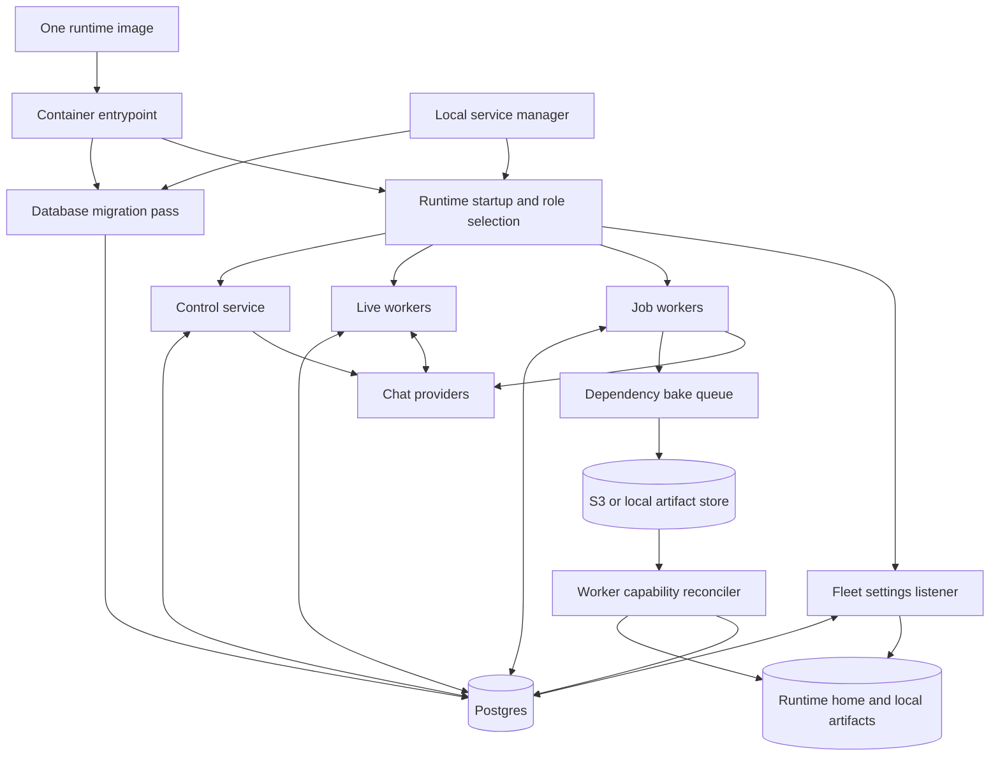
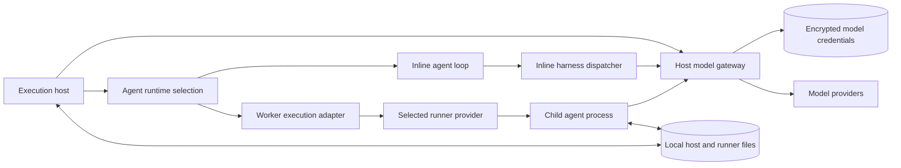
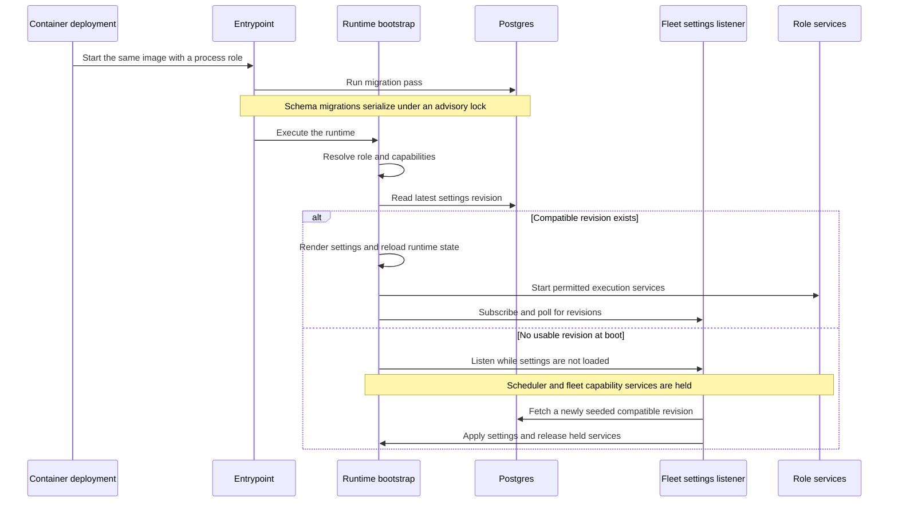
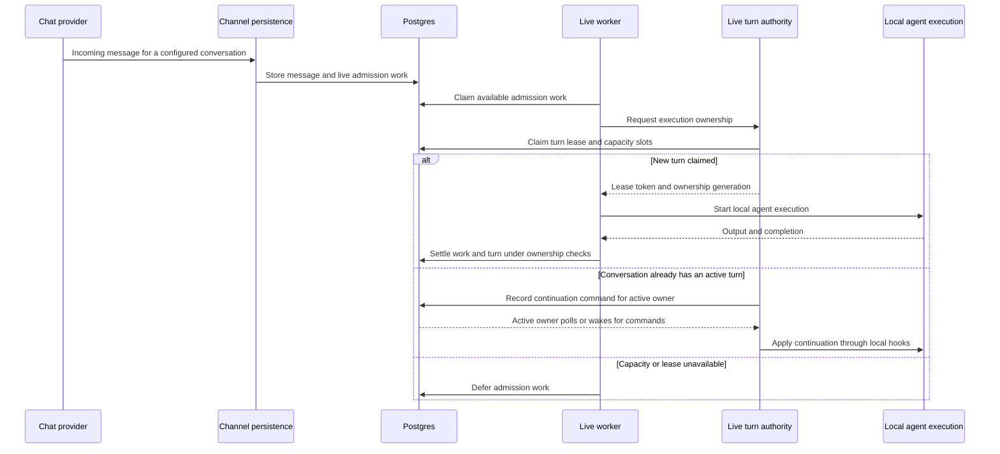
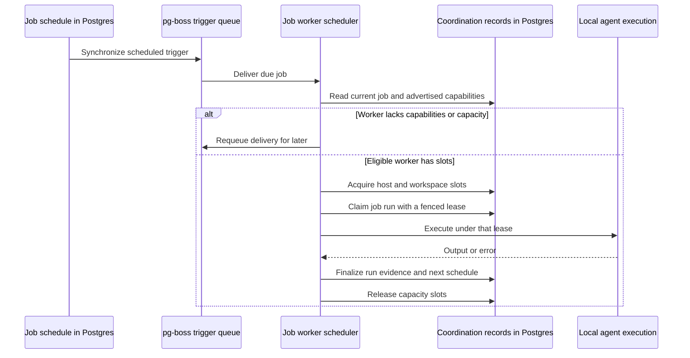
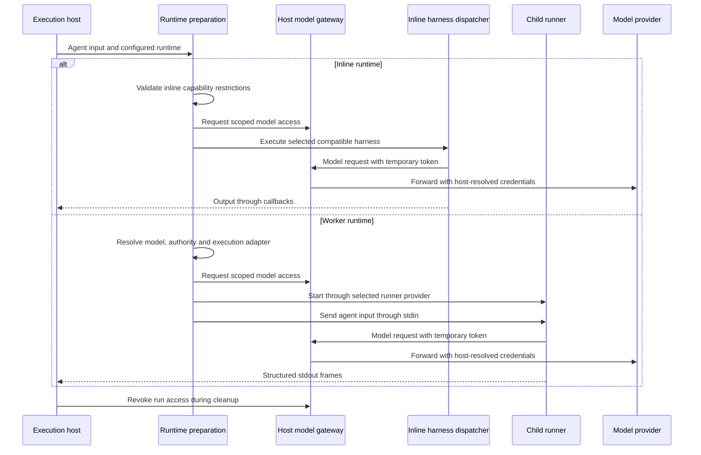

# Deployment, run modes and scaling

## 1. What this area does

Gantry can run on one computer or divide its work among several services built from the same software image. In a split deployment, the control service handles administration, live workers handle conversations, and job workers handle scheduled work. Postgres keeps the settings, work records and ownership information that those services share. An agent can execute inside its host process or in a separate child process, depending on its configured runtime and capabilities. Startup checks, capacity limits and shutdown handling help workers join, leave and recover work without treating a lost process as a successful result. These boundaries are implemented in [role-capabilities.ts](../../../apps/core/src/app/bootstrap/roles/role-capabilities.ts), [fleet-boot.ts](../../../apps/core/src/app/bootstrap/fleet-boot.ts), [agent-spawn-preparation.ts](../../../apps/core/src/runtime/agent-spawn-preparation.ts) and [shutdown.ts](../../../apps/core/src/app/bootstrap/shutdown.ts).

## 2. Architecture diagram

The diagrams separate deployment from agent execution. A deployment role selects services; it is independent of the agent's execution mode and model harness.

`all` combines the control, live and job services in one process; bake and capability reconciliation in this diagram are fleet subsystems. Control and job roles connect channels for outbound delivery, while live workers also receive provider input. [app/index.ts](../../../apps/core/src/app/index.ts), [fleet-boot.ts](../../../apps/core/src/app/bootstrap/fleet-boot.ts) and [docker-compose.fleet.yml](../../../ops/docker/docker-compose.fleet.yml) supply these connections.

The model gateway issues scoped temporary access; provider credentials are resolved on the host. Child tools receive the separately projected `toolNetworkEnv`, while model access belongs in `modelCredentialEnv`. The selected runner provider is either `direct` or optional `sandbox_runtime`; only the latter declares OS enforcement. [agent-spawn.ts](../../../apps/core/src/runtime/agent-spawn.ts), [agent-inline.ts](../../../apps/core/src/runtime/agent-inline.ts), [gantry-model-gateway.ts](../../../apps/core/src/adapters/llm/anthropic-claude-agent/gantry-model-gateway.ts) and [runner-sandbox-provider.ts](../../../apps/core/src/adapters/sandbox/runner-sandbox-provider.ts) implement these boundaries.

Every diagram node has a code anchor:

| Node                               | Current implementation or deployment definition                                                                                                                                                                                     |
| ---------------------------------- | ----------------------------------------------------------------------------------------------------------------------------------------------------------------------------------------------------------------------------------- |
| One runtime image                  | [ops/docker/Dockerfile](../../../ops/docker/Dockerfile)                                                                                                                                                                             |
| Container entrypoint               | [ops/docker/entrypoint.sh](../../../ops/docker/entrypoint.sh)                                                                                                                                                                       |
| Database migration pass            | [postgres-migrate.ts](../../../apps/core/src/postgres-migrate.ts), [storage-service.ts](../../../apps/core/src/adapters/storage/postgres/storage-service.ts)                                                                        |
| Postgres                           | [runtime-store.ts](../../../apps/core/src/adapters/storage/postgres/runtime-store.ts), [docker-compose.yml](../../../docker-compose.yml)                                                                                            |
| Local service manager              | [service/manager.ts](../../../apps/core/src/infrastructure/service/manager.ts), [service/launchd.ts](../../../apps/core/src/infrastructure/service/launchd.ts)                                                                      |
| Runtime startup and role selection | [app/index.ts](../../../apps/core/src/app/index.ts), [role-resolver.ts](../../../apps/core/src/app/bootstrap/roles/role-resolver.ts)                                                                                                |
| Control service                    | [control/server/index.ts](../../../apps/core/src/control/server/index.ts)                                                                                                                                                           |
| Live workers                       | [live-execution.ts](../../../apps/core/src/app/bootstrap/live-execution.ts)                                                                                                                                                         |
| Job workers                        | [scheduler.ts](../../../apps/core/src/jobs/scheduler.ts), [scheduler-engine.ts](../../../apps/core/src/infrastructure/pgboss/scheduler-engine.ts)                                                                                   |
| Fleet settings listener            | [fleet-boot.ts](../../../apps/core/src/app/bootstrap/fleet-boot.ts), [settings-revision-listener.ts](../../../apps/core/src/runtime/settings-revision-listener.ts)                                                                  |
| Runtime home and local artifacts   | [config/index.ts](../../../apps/core/src/config/index.ts), [runtime-home.ts](../../../apps/core/src/config/settings/runtime-home.ts)                                                                                                |
| Dependency bake queue              | [toolchain-bake-bootstrap.ts](../../../apps/core/src/jobs/toolchain-bake-bootstrap.ts), [toolchain-bake-queue.ts](../../../apps/core/src/jobs/toolchain-bake-queue.ts)                                                              |
| S3 or local artifact store         | [fleet-boot.ts](../../../apps/core/src/app/bootstrap/fleet-boot.ts), [s3-toolchain-artifact-store.ts](../../../apps/core/src/adapters/artifacts/toolchains/s3-toolchain-artifact-store.ts)                                          |
| Worker capability reconciler       | [worker-capability-reconciler.ts](../../../apps/core/src/jobs/worker-capability-reconciler.ts)                                                                                                                                      |
| Chat providers                     | [channel-wiring.ts](../../../apps/core/src/app/bootstrap/channel-wiring.ts), [runtime-app-channel-runtime.ts](../../../apps/core/src/app/bootstrap/runtime-app-channel-runtime.ts)                                                  |
| Execution host                     | [runtime-app.ts](../../../apps/core/src/app/bootstrap/runtime-app.ts), [runtime-services.ts](../../../apps/core/src/app/bootstrap/runtime-services.ts)                                                                              |
| Agent runtime selection            | [agent-spawn-preparation.ts](../../../apps/core/src/runtime/agent-spawn-preparation.ts)                                                                                                                                             |
| Inline agent loop                  | [agent-inline.ts](../../../apps/core/src/runtime/agent-inline.ts)                                                                                                                                                                   |
| Worker execution adapter           | [agent-spawn-execution-adapter.ts](../../../apps/core/src/runtime/agent-spawn-execution-adapter.ts), [agent-spawn.ts](../../../apps/core/src/runtime/agent-spawn.ts)                                                                |
| Inline harness dispatcher          | [inline-lane-dispatcher.ts](../../../apps/core/src/adapters/llm/inline-lane-dispatcher.ts)                                                                                                                                          |
| Selected runner provider           | [runner-sandbox-provider.ts](../../../apps/core/src/adapters/sandbox/runner-sandbox-provider.ts)                                                                                                                                    |
| Child agent process                | [agent-spawn-process.ts](../../../apps/core/src/runtime/agent-spawn-process.ts)                                                                                                                                                     |
| Host model gateway                 | [gantry-model-gateway.ts](../../../apps/core/src/adapters/llm/anthropic-claude-agent/gantry-model-gateway.ts), [agent-credential-broker-factory.ts](../../../apps/core/src/adapters/credentials/agent-credential-broker-factory.ts) |
| Encrypted model credentials        | [model-credentials.ts](../../../apps/core/src/adapters/storage/postgres/schema/model-credentials.ts)                                                                                                                                |
| Model providers                    | [model-provider-registry.ts](../../../apps/core/src/shared/model-provider-registry.ts), [gantry-model-gateway.ts](../../../apps/core/src/adapters/llm/anthropic-claude-agent/gantry-model-gateway.ts)                               |
| Local host and runner files        | [agent-spawn.ts](../../../apps/core/src/runtime/agent-spawn.ts), [ipc.ts](../../../apps/core/src/runtime/ipc.ts), [filesystem-runner-control-port.ts](../../../apps/core/src/runtime/filesystem-runner-control-port.ts)             |

The shared Postgres node appears only in the first diagram; encrypted model credentials in the second diagram are rows in that same database.

## 3. Key flows

### A. Starting a deployment split across containers

1. The fleet rehearsal starts Postgres, MinIO, a bucket bootstrap and a settings seed before the three runtime roles. Only control publishes a host port; live and job replicas can be scaled independently. See [docker-compose.fleet.yml](../../../ops/docker/docker-compose.fleet.yml).
2. The entrypoint prepares the runtime home, drops root privileges to the Node user, runs the migrator and replaces itself with the runtime process. A migration failure stops startup. The schema migration portion uses a Postgres advisory lock, so simultaneous container starts serialize that work. See [entrypoint.sh](../../../ops/docker/entrypoint.sh), [postgres-migrate.ts](../../../apps/core/src/postgres-migrate.ts) and [storage-service.ts](../../../apps/core/src/adapters/storage/postgres/storage-service.ts).
3. Bootstrap reads `GANTRY_PROCESS_ROLE` once; absent or empty means `all`, and an unrecognized value throws. Split roles defer their final preflight until authoritative fleet settings have been fetched. See [role-resolver.ts](../../../apps/core/src/app/bootstrap/roles/role-resolver.ts) and [app/index.ts](../../../apps/core/src/app/index.ts).
4. Fleet boot fetches the latest app settings revision under a settings-projector lease, checks reader compatibility, renders the local settings file and reconciles runtime state. Missing settings or an incompatible first revision keep settings readiness red; the scheduler, bake queue and capability reconciler wait for settings. This is not a universal gate on every bootstrap side effect; background-task recovery is discussed below. See [fleet-boot.ts](../../../apps/core/src/app/bootstrap/fleet-boot.ts) and [app/index.ts](../../../apps/core/src/app/index.ts).
5. The listener uses database notifications plus a 30-second fallback poll. A first compatible revision releases held services; later compatible revisions reload runtime state, while a newer reader requirement holds the last applied revision and emits an alert. Some effective runtime settings remain the boot snapshot until restart. See [settings-revision-listener.ts](../../../apps/core/src/runtime/settings-revision-listener.ts) and [app/index.ts](../../../apps/core/src/app/index.ts).

### B. A conversation reaches one execution owner

1. For eligible inbound messages with configured routes, channel persistence writes the message with durable live admission work for the routed agent. It waits for persistence completion; service identities, bot messages and missing bindings follow explicit filtering paths. See [channel-persistence-handlers.ts](../../../apps/core/src/app/bootstrap/channel-persistence-handlers.ts).
2. Every live worker runs an admission loop. Database claims use `FOR UPDATE SKIP LOCKED`, and the loop renews claims while processing; unavailable work is deferred rather than held only in a worker's memory. See [live-admission-work-loop.ts](../../../apps/core/src/runtime/live-admission-work-loop.ts) and [live-admission-work-item-repository.postgres.ts](../../../apps/core/src/adapters/storage/postgres/repositories/live-admission-work-item-repository.postgres.ts).
3. The processor resolves the conversation route and requests a live turn lease and capacity slots. A claimed turn becomes locally owned; a scope that already has an owner routes new input to that owner instead. See [live-execution.ts](../../../apps/core/src/app/bootstrap/live-execution.ts), [live-turn-authority.ts](../../../apps/core/src/runtime/live-turn-authority.ts) and [live-turn-lease-service.ts](../../../apps/core/src/application/live-turns/live-turn-lease-service.ts).
4. The owner connects durable continuation and stop commands to its local runner hooks. Inline execution receives them through an in-memory control port; child execution uses local continuation files. Those local mechanisms deliver commands to the current process; the database retains cross-worker ownership and command records. See [live-turn-command-pump.ts](../../../apps/core/src/runtime/live-turn-command-pump.ts), [agent-inline.ts](../../../apps/core/src/runtime/agent-inline.ts) and [filesystem-runner-control-port.ts](../../../apps/core/src/runtime/filesystem-runner-control-port.ts).
5. Admission claims are settled, deferred or failed by the work loop, and live turn finalization uses the current lease fence. One elected live recovery coordinator handles recovery sweeps; that election does not restrict normal admission to a single worker. See [live-admission-work-loop.ts](../../../apps/core/src/runtime/live-admission-work-loop.ts), [live-turn-authority.ts](../../../apps/core/src/runtime/live-turn-authority.ts) and [live-recovery-coordinator.ts](../../../apps/core/src/app/bootstrap/live-recovery-coordinator.ts).

### C. A scheduled job finds an eligible worker

1. The scheduler registers a worker and configures its durable slot backend. The pg-boss engine synchronizes current jobs at startup and during maintenance, using the `pgboss` schema and `gantry.jobs` queue. pg-boss supplies triggers; a delivery alone does not authorize model execution. See [scheduler.ts](../../../apps/core/src/jobs/scheduler.ts) and [scheduler-engine.ts](../../../apps/core/src/infrastructure/pgboss/scheduler-engine.ts).
2. The receiving worker loads the current job. In fleet mode it checks required capabilities against its advertised inventory; ineligible deliveries are requeued without consuming the job's failure retry budget. Maintenance can pause and alert on fleet-wide capability starvation. See [scheduler-engine.ts](../../../apps/core/src/infrastructure/pgboss/scheduler-engine.ts), [capability-dispatch.ts](../../../apps/core/src/jobs/capability-dispatch.ts) and [capability-starvation-scan.ts](../../../apps/core/src/jobs/capability-starvation-scan.ts).
3. Before starting, it acquires leased workspace and host capacity slots. Capacity failures, and live backlog when sharing interactive capacity, cause delayed delivery. See [concurrency.ts](../../../apps/core/src/jobs/concurrency.ts), [host-capacity.ts](../../../apps/core/src/shared/host-capacity.ts) and [scheduler-engine.ts](../../../apps/core/src/infrastructure/pgboss/scheduler-engine.ts).
4. The job executor claims a due run with a lease token and fencing version, records claim evidence and maintains the lease heartbeat. Only then does local agent execution proceed. See [execution.ts](../../../apps/core/src/jobs/execution.ts) and [execution-lease.ts](../../../apps/core/src/jobs/execution-lease.ts).
5. Terminal writes must still match the active lease; a stale worker's terminal writes are rejected. Job run records hold results, while finalization computes retry, pause or next-run state and the scheduler releases its slots. See [execution-lease.ts](../../../apps/core/src/jobs/execution-lease.ts), [execution-finalization.ts](../../../apps/core/src/jobs/execution-finalization.ts) and [scheduler-engine.ts](../../../apps/core/src/infrastructure/pgboss/scheduler-engine.ts).

### D. One agent request chooses inline or child-process execution

1. Runtime preparation chooses `inline` or `worker`; this is an agent execution choice, independent of `GANTRY_PROCESS_ROLE`. See [agent-spawn.ts](../../../apps/core/src/runtime/agent-spawn.ts), [agent-spawn-preparation.ts](../../../apps/core/src/runtime/agent-spawn-preparation.ts) and [agent-runtime.ts](../../../apps/core/src/shared/agent-runtime.ts).
2. Inline preflight rejects worker-only capabilities, including commands, Browser, file tools, local CLI and skill actions, plus selected stdio MCP sources. Attached skills require the DeepAgents engine for inline execution. Both modes validate model controls and projected authority before execution. See [agent-spawn-admission.ts](../../../apps/core/src/runtime/agent-spawn-admission.ts) and [agent-runtime.ts](../../../apps/core/src/shared/agent-runtime.ts).
3. The gateway checks the active app/provider credential and issues a temporary token. Model credentials are encrypted database records; runtime-owned secret references separately resolve through the Gantry secret repository, AWS Secrets Manager or environment/runtime-home `.env`. See [gantry-model-gateway.ts](../../../apps/core/src/adapters/llm/anthropic-claude-agent/gantry-model-gateway.ts), [model-credentials.ts](../../../apps/core/src/adapters/storage/postgres/schema/model-credentials.ts), [repository-runtime-secret-provider.ts](../../../apps/core/src/adapters/credentials/repository-runtime-secret-provider.ts), [aws-secrets-manager-runtime-secret-provider.ts](../../../apps/core/src/adapters/credentials/aws-secrets-manager-runtime-secret-provider.ts) and [env-runtime-secret-provider.ts](../../../apps/core/src/adapters/credentials/env-runtime-secret-provider.ts).
4. Inline runs in the host process with an abort controller and in-memory continuation port. Its dispatcher selects the resolved Anthropic SDK or DeepAgents harness; a requested response schema is validated with one repair retry. See [agent-inline.ts](../../../apps/core/src/runtime/agent-inline.ts) and [inline-lane-dispatcher.ts](../../../apps/core/src/adapters/llm/inline-lane-dispatcher.ts).
5. Worker execution prepares an adapter, separate model/tool environment projections and local IPC files, then starts a child through the configured runner provider. The host writes input through stdin and parses structured stdout frames; aborts, timeouts and process errors produce explicit outcomes. Cleanup revokes access and removes temporary configuration. See [agent-spawn.ts](../../../apps/core/src/runtime/agent-spawn.ts), [agent-spawn-process.ts](../../../apps/core/src/runtime/agent-spawn-process.ts) and [runner-sandbox-provider.ts](../../../apps/core/src/adapters/sandbox/runner-sandbox-provider.ts).

## 4. Data it owns

This area owns deployment files and coordination behavior; it also uses durable records whose broader contracts belong to storage, runtime and jobs.

| Table or file                                                    | What it holds and source                                                                                                                                                                                                                                                  |
| ---------------------------------------------------------------- | ------------------------------------------------------------------------------------------------------------------------------------------------------------------------------------------------------------------------------------------------------------------------- |
| `worker_instances`                                               | Worker boot identity, role, image/version, capabilities, health and heartbeat; [worker-coordination.ts](../../../apps/core/src/adapters/storage/postgres/schema/worker-coordination.ts).                                                                                  |
| `run_leases`                                                     | Run owner, lease token, expiry and increasing fencing version; [worker-coordination.ts](../../../apps/core/src/adapters/storage/postgres/schema/worker-coordination.ts).                                                                                                  |
| `run_slots`                                                      | Expiring workspace and host capacity reservations; [worker-coordination.ts](../../../apps/core/src/adapters/storage/postgres/schema/worker-coordination.ts).                                                                                                              |
| `runtime_lease_generations`                                      | Durable ownership generations for advisory-lease keys such as settings projection; [worker-coordination.ts](../../../apps/core/src/adapters/storage/postgres/schema/worker-coordination.ts).                                                                              |
| `settings_revisions`                                             | App settings documents, revision numbers and minimum reader versions; [fleet-capability-state.ts](../../../apps/core/src/adapters/storage/postgres/schema/fleet-capability-state.ts).                                                                                     |
| `runtime_dependencies`                                           | Approved package manifests, bake status and artifact location/hash; [fleet-capability-state.ts](../../../apps/core/src/adapters/storage/postgres/schema/fleet-capability-state.ts).                                                                                       |
| `live_admission_work_items`, `live_turns`, `live_turn_commands`  | Durable chat work, ordered input consumption, active ownership and commands; [live-turns.ts](../../../apps/core/src/adapters/storage/postgres/schema/live-turns.ts).                                                                                                      |
| `jobs`, `job_runs`, `agent_runs`                                 | Schedules, job terminal evidence and agent run identity/status; [jobs.ts](../../../apps/core/src/adapters/storage/postgres/schema/jobs.ts), [runs.ts](../../../apps/core/src/adapters/storage/postgres/schema/runs.ts).                                                   |
| `agent_async_tasks`                                              | Background command, MCP and delegated-task state, lease coordinates and private recovery metadata; [async-tasks.ts](../../../apps/core/src/adapters/storage/postgres/schema/async-tasks.ts).                                                                              |
| `runner_control_events`, `runner_control_nonces`                 | Durable runner evidence and replay-protection nonces; [worker-coordination.ts](../../../apps/core/src/adapters/storage/postgres/schema/worker-coordination.ts).                                                                                                           |
| `permission_prompts`, `pending_interactions`, `transient_grants` | Durable approval/interaction state and lease-bound temporary authority; [worker-coordination.ts](../../../apps/core/src/adapters/storage/postgres/schema/worker-coordination.ts).                                                                                         |
| `model_credentials`, `capability_secrets`                        | Encrypted provider credentials and app-owned named secrets; [model-credentials.ts](../../../apps/core/src/adapters/storage/postgres/schema/model-credentials.ts), [capability-secrets.ts](../../../apps/core/src/adapters/storage/postgres/schema/capability-secrets.ts). |
| `pgboss` schema                                                  | Persistent trigger queues, scheduling and queue delivery state; [scheduler-engine.ts](../../../apps/core/src/infrastructure/pgboss/scheduler-engine.ts).                                                                                                                  |
| Runtime-home settings file and `.env`                            | Local settings input/mirror and runtime-owned secrets; [fleet-boot.ts](../../../apps/core/src/app/bootstrap/fleet-boot.ts), [env-runtime-secret-provider.ts](../../../apps/core/src/adapters/credentials/env-runtime-secret-provider.ts).                                 |
| Runtime data/session/IPC directories                             | Local sessions, runner logs, continuation files and temporary MCP/sandbox configuration; [config/index.ts](../../../apps/core/src/config/index.ts), [agent-spawn.ts](../../../apps/core/src/runtime/agent-spawn.ts).                                                      |
| Runtime artifacts directory or S3 objects                        | Toolchain and skill artifacts materialized onto workers; [fleet-boot.ts](../../../apps/core/src/app/bootstrap/fleet-boot.ts).                                                                                                                                             |
| Service metadata, PID, launchd plist or systemd unit             | Installed launch paths, fallback process identity and service supervision; [service/manager.ts](../../../apps/core/src/infrastructure/service/manager.ts), [service/launchd.ts](../../../apps/core/src/infrastructure/service/launchd.ts).                                |

## 5. How it scales and fails

### Three independent choices

- **Process role:** deployment-owned `GANTRY_PROCESS_ROLE`, resolved once at boot; [process-role.ts](../../../apps/core/src/app/bootstrap/roles/process-role.ts) and [role-resolver.ts](../../../apps/core/src/app/bootstrap/roles/role-resolver.ts).
- **Deployment mode:** `runtime.deployment_mode` selects workstation or fleet settings behavior. Split roles also enter the fleet bootstrap path, allowing an empty local home to load database revisions; [app/index.ts](../../../apps/core/src/app/index.ts).
- **Agent execution and harness:** `inline` versus `worker` selects same-process or child-process execution; the selected model alias and agent harness determine the compatible model engine. A `worker` runtime is not itself a fleet process role; [agent-spawn-preparation.ts](../../../apps/core/src/runtime/agent-spawn-preparation.ts), [agent-spawn-model-resolution.ts](../../../apps/core/src/runtime/agent-spawn-model-resolution.ts) and [inline-lane-dispatcher.ts](../../../apps/core/src/adapters/llm/inline-lane-dispatcher.ts).

### What runs in each role

| Subsystem                                    | all                       | control                | live-worker            | job-worker             |
| -------------------------------------------- | ------------------------- | ---------------------- | ---------------------- | ---------------------- |
| Control API                                  | Full                      | Full                   | Operations/diagnostics | Operations/diagnostics |
| Settings desired-state API writes            | Yes                       | Yes                    | No                     | No                     |
| Provider inbound and interaction callbacks   | Yes                       | No                     | Yes                    | No                     |
| Outbound channel connections                 | Yes                       | Yes                    | Yes                    | Yes                    |
| Live admission and execution                 | Yes                       | No                     | Yes                    | No                     |
| Scheduler/job claiming                       | Yes                       | No                     | No                     | Yes                    |
| Worker registration                          | Live or scheduler startup | No normal registration | Live startup           | Scheduler startup      |
| Fleet dependency bakes                       | Yes                       | No                     | No                     | Yes                    |
| Fleet capability reconciliation              | Yes                       | No                     | Yes                    | Yes                    |
| Fleet settings revision listener             | Yes                       | Yes                    | Yes                    | Yes                    |
| Background-task recovery, as currently wired | Yes                       | Yes                    | Yes                    | Yes                    |

The capability contract is [role-capabilities.ts](../../../apps/core/src/app/bootstrap/roles/role-capabilities.ts); actual startup gates are in [app/index.ts](../../../apps/core/src/app/index.ts), [runtime-services.ts](../../../apps/core/src/app/bootstrap/runtime-services.ts) and [scheduler.ts](../../../apps/core/src/jobs/scheduler.ts). Live settings can disable live execution, and fleet settings readiness can hold scheduler/bake/reconciliation startup. Worker registration happens on the paths shown, rather than unconditionally from the role table. Fleet-only rows do not apply to workstation mode. Background-task recovery currently starts without role gating and can launch recovered queued work; see new item 1 below.

### Capacity and shared state

Live workers compete for durable admission work and acquire fenced live ownership; only recovery sweeps have a single elected coordinator. Job workers compete for scheduler deliveries and require capability eligibility, slots and a run lease. Adding replicas adds potential execution capacity, bounded by CPU budgets, host/workspace slots and available capabilities; replicas on one host do not guarantee linear throughput. Shared-host deployments must supply the same `GANTRY_HOST_ID` for host budget accounting, as the fleet rehearsal does. See [live-recovery-coordinator.ts](../../../apps/core/src/app/bootstrap/live-recovery-coordinator.ts), [live-turn-authority.ts](../../../apps/core/src/runtime/live-turn-authority.ts), [scheduler-engine.ts](../../../apps/core/src/infrastructure/pgboss/scheduler-engine.ts), [host-capacity.ts](../../../apps/core/src/shared/host-capacity.ts) and [docker-compose.fleet.yml](../../../ops/docker/docker-compose.fleet.yml).

Execution admission is the authority to run work. In this checkout that authority is implemented by live-turn ownership, scheduler slots/run leases, and durable async-task claims for delegation; there is no implementation named `RunAdmissionQueue`. pg-boss is the job trigger mechanism, `job_runs` is terminal evidence, and provider-native subagent state is not the cross-worker authority. See [live-turn-authority.ts](../../../apps/core/src/runtime/live-turn-authority.ts), [execution-lease.ts](../../../apps/core/src/jobs/execution-lease.ts), [async-task-admission.ts](../../../apps/core/src/jobs/async-task-admission.ts) and [async-command-task-drainer.ts](../../../apps/core/src/jobs/async-command-task-drainer.ts).

Active child handles, inline continuation subscribers, abort controllers, local queues, timers, gateway tokens and gateway rate windows live in memory. Postgres keeps admission/task records, run ownership, settings revisions, slots and terminal evidence; local files still carry child-runner IPC and session/log material. A replacement worker reconstructs work from durable state, not from the lost process's handles. Gateway limits are per broker instance, not a deployment-wide provider quota. See [agent-inline.ts](../../../apps/core/src/runtime/agent-inline.ts), [group-queue.ts](../../../apps/core/src/runtime/group-queue.ts), [gantry-model-gateway.ts](../../../apps/core/src/adapters/llm/anthropic-claude-agent/gantry-model-gateway.ts), [concurrency.ts](../../../apps/core/src/jobs/concurrency.ts) and [live-turns.ts](../../../apps/core/src/adapters/storage/postgres/schema/live-turns.ts).

Fleet workers restore settings from revisions and materialize capabilities from configured local/S3 artifacts; hashes that fail integrity checks are not advertised. The rehearsal shares a runtime-home volume, but that does not turn filesystem host/runner IPC into a network transport between machines. See [fleet-boot.ts](../../../apps/core/src/app/bootstrap/fleet-boot.ts), [worker-capability-reconciler.ts](../../../apps/core/src/jobs/worker-capability-reconciler.ts), [docker-compose.fleet.yml](../../../ops/docker/docker-compose.fleet.yml) and [agent-spawn.ts](../../../apps/core/src/runtime/agent-spawn.ts).

### Startup, health, shutdown and crash

- **Packaging and launch:** the Docker image builds core/contracts/SDK/web assets and migrations, prunes development dependencies and includes Python, bubblewrap, socat and ripgrep. The root Compose file starts only local Postgres; its WSL overlay selects amd64. Local services select launchd on macOS, user systemd where available on Linux, then Linux nohup or a detached background launcher; launchd/systemd provide restart supervision. See [Dockerfile](../../../ops/docker/Dockerfile), [docker-compose.yml](../../../docker-compose.yml), [docker-compose.wsl.yml](../../../docker-compose.wsl.yml), [service/manager.ts](../../../apps/core/src/infrastructure/service/manager.ts) and [service/launchd.ts](../../../apps/core/src/infrastructure/service/launchd.ts).
- **Image and deploy paths:** [image.yml](../../../.github/workflows/image.yml) builds, generates an SBOM and scans images, then publishes on push events to main/tags. The separate [dev deployment](../../../.github/workflows/gantry_dev_deployment.yml) and [production deployment](../../../.github/workflows/gantry_prod_deployment.yml) build/push to ECR and update an existing ECS task definition; both currently trigger on `develop` or manual dispatch. [ecs_service_set/main.tf](../../../ops/terraform/modules/ecs_service_set/main.tf) defines role-based ECS services, and [worker_pool/user_data.sh.tftpl](../../../ops/terraform/modules/worker_pool/user_data.sh.tftpl) launches role-configured containers on hosts. Image policy checks live in [check_runtime_images.py](../../../scripts/check_runtime_images.py).
- **Readiness:** `/readyz` checks database access, migration count, loaded settings and draining. Split roles add applicable worker/scheduler checks; control additionally requires an API key. Live saturation is reported without failing readiness, so an owner can keep handling continuations. `all` explicitly omits these role-specific checks, even when hosted. See [system-health.ts](../../../apps/core/src/control/server/system-health.ts), [role-readiness.ts](../../../apps/core/src/app/bootstrap/roles/role-readiness.ts) and [app/index.ts](../../../apps/core/src/app/index.ts).
- **Graceful shutdown:** the first SIGTERM/SIGINT marks draining, stops new scheduler/live intake and recovery, stops fleet subsystems, releases the recovery-coordinator lease, and waits for the local queue up to its drain deadline. It then closes browsers, channels, server, delivery recovery, live authority, tracing and storage; duplicate signals share one drain. Fleet Compose allows 130 seconds before forced termination. See [shutdown.ts](../../../apps/core/src/app/bootstrap/shutdown.ts), [group-queue.ts](../../../apps/core/src/runtime/group-queue.ts) and [docker-compose.fleet.yml](../../../ops/docker/docker-compose.fleet.yml).
- **Worker crash:** heartbeats lapse, recovery marks workers unhealthy and expires recoverable run leases; reclaimed runs use higher fencing versions, and stale writes cannot settle the replacement's run. Scheduler slots also expire and stale-worker slots are released. Live recovery uses its own coordinator and durable turn records. This protects Gantry's records; it does not promise exactly-once effects in external systems. See [worker-identity.ts](../../../apps/core/src/jobs/worker-identity.ts), [scheduler-worker-recovery.ts](../../../apps/core/src/infrastructure/pgboss/scheduler-worker-recovery.ts), [execution-lease.ts](../../../apps/core/src/jobs/execution-lease.ts), [concurrency.ts](../../../apps/core/src/jobs/concurrency.ts) and [live-turn-recovery.ts](../../../apps/core/src/runtime/live-turn-recovery.ts).
- **Background-task crash:** queued command/delegation tasks are reconstructed from encrypted recovery payloads and claimed durably; unreadable payloads fail explicitly. Stale running tasks are failed, with tracked processes terminated when present, rather than resumed as though still running. See [async-command-queue-recovery.ts](../../../apps/core/src/jobs/async-command-queue-recovery.ts), [async-command-task-service.ts](../../../apps/core/src/jobs/async-command-task-service.ts) and [runtime-services-async-task-recovery.ts](../../../apps/core/src/app/bootstrap/runtime-services-async-task-recovery.ts).
- **Confinement:** `direct` launches a child without a Gantry OS sandbox or inner Claude SDK sandbox; host permission/credential rails and the deployment boundary are its controls. Optional `sandbox_runtime` confines the whole child runner on supported hosts and needs working host/container namespace support; inline execution stays inside the host process. See [runner-sandbox-provider.ts](../../../apps/core/src/adapters/sandbox/runner-sandbox-provider.ts), [query-loop-phases-setup.ts](../../../apps/core/src/adapters/llm/anthropic-claude-agent/runner/query-loop-phases-setup.ts), [agent-inline.ts](../../../apps/core/src/runtime/agent-inline.ts), [Dockerfile](../../../ops/docker/Dockerfile) and [docker-compose.fleet.yml](../../../ops/docker/docker-compose.fleet.yml).

## 6. Video script outline

These seven beats target a 60–90 second explanation; their code anchors are the corresponding flows and scaling notes above.

1. Gantry starts as one application, and the same image can become separate control, conversation and scheduled-work services.
2. Each service checks the database and loads shared settings before its permitted work begins, with background recovery currently needing a role-boundary fix.
3. A conversation is saved as durable work so available live workers can compete to handle it.
4. An ownership record keeps one active turn in charge while later messages reach that turn as continuations.
5. Scheduled work waits for a worker with the right capabilities and enough capacity before it gets a run lease.
6. Agents run either inside their host or as child processes, with model access supplied through a host gateway and optional confinement around child runners.
7. On shutdown workers stop taking new work, and after a crash durable records let recovery identify unfinished work and reject outdated owners.

## 7. Duplication and simplification

### (a) Existing audit findings

The checked-in [deployment and scaling audit](../audits/2026-10-02-area-audit/11-deploy-scaling.md) has these existing finding titles:

- [Encryption-key loading diverges between credentials and background tasks — duplicate / UX](../audits/2026-10-02-area-audit/11-deploy-scaling.md).
- [Two fallback service launchers have different process-safety rules — parallel / UX](../audits/2026-10-02-area-audit/11-deploy-scaling.md).
- [Four gateway owners divide the same model-provider budget — duplicate / parallel](../audits/2026-10-02-area-audit/11-deploy-scaling.md).
- [Hosted `all` mode retains a weaker readiness policy — parallel](../audits/2026-10-02-area-audit/11-deploy-scaling.md).
- [Credential-binding setup still runs around a no-op — dead / over-complicated](../audits/2026-10-02-area-audit/11-deploy-scaling.md).

### (b) New observations

These observations come from code tracing, not live service experiments.

1. **Background-task recovery bypasses process-role execution gates — parallel path.** Scheduled execution is guarded at `apps/core/src/app/bootstrap/runtime-services.ts:1100`, and live execution at `apps/core/src/app/bootstrap/runtime-services.ts:1109`, but the initial async recovery call at `apps/core/src/app/bootstrap/runtime-services.ts:354` and periodic recovery start at `apps/core/src/app/bootstrap/runtime-services.ts:358` are unconditional. Recovery executes commands at `apps/core/src/app/bootstrap/runtime-services-async-task-recovery.ts:78`, reconstructs delegated execution at `apps/core/src/app/bootstrap/runtime-services-async-task-recovery.ts:275`, calls the agent runner at `apps/core/src/app/bootstrap/runtime-services-async-task-recovery.ts:332`, and recovers MCP calls at `apps/core/src/app/bootstrap/runtime-services-async-task-recovery.ts:147`. Queued reconstruction drains immediately at `apps/core/src/jobs/async-command-task-service.ts:398`; durable claiming and execution occur at `apps/core/src/jobs/async-command-task-drainer.ts:28` and `apps/core/src/jobs/async-command-task-drainer.ts:39`. Consequently control can execute recovered work despite its role contract. **Survive:** durable task claims, recovery payload validation and one recovery service running only in explicitly eligible execution roles; apply the same role/settings boundary to first recovery and timer recovery. **Size:** story, because recovered command, delegation and MCP ownership across roles needs one explicit contract.
2. **A test-only loopback parser duplicates the production parser — dead / duplicate.** `apps/core/src/runtime/agent-spawn-runtime-policy.ts:355` and `apps/core/src/runtime/agent-spawn-runtime-policy.ts:411` repeat URL parsing, IPv6 bracket removal, loopback classification and default-port selection. The first export has only a test consumer at `apps/core/test/unit/runtime/agent-spawn-runtime-policy.test.ts:93`; production projection calls the second at `apps/core/src/runtime/agent-spawn-runtime-policy.ts:392`. **Survive:** the parser used by `projectSandboxRuntimeModelGatewayEnv`; remove the test-only export and cover IPv6 behavior through that real projection boundary. **Size:** fix.
3. **Development and production deployment workflows repeat the same delivery steps — duplicate.** Build/push, task-definition download, image substitution and deployment are copied beginning at `.github/workflows/gantry_dev_deployment.yml:42` and `.github/workflows/gantry_prod_deployment.yml:42`. **Survive:** one reusable deployment job with explicit environment, runner and deployment-target inputs; keep the separate environment approvals and triggers in the callers. **Size:** fix; preserve their different runners and environments rather than silently changing deployment policy.
