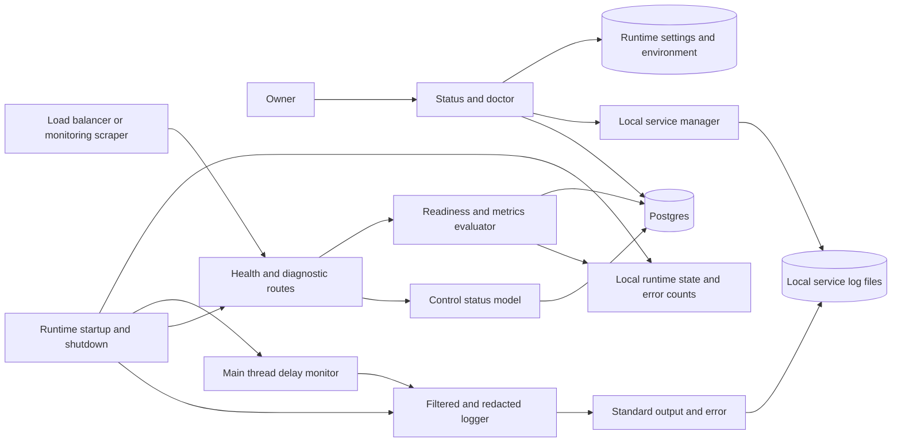
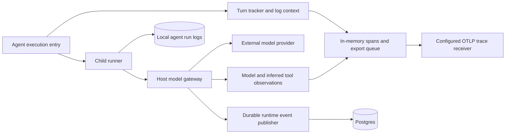
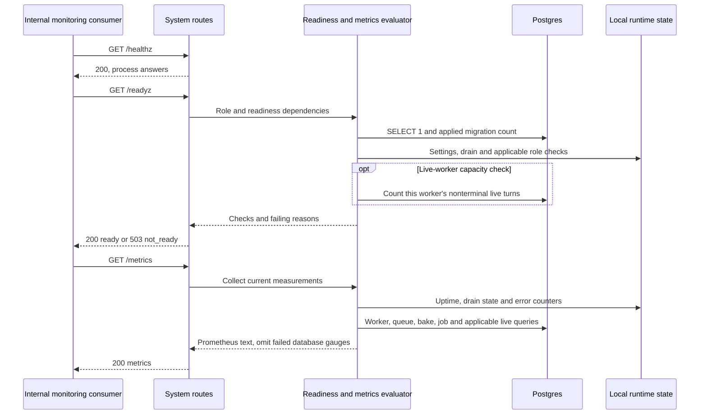
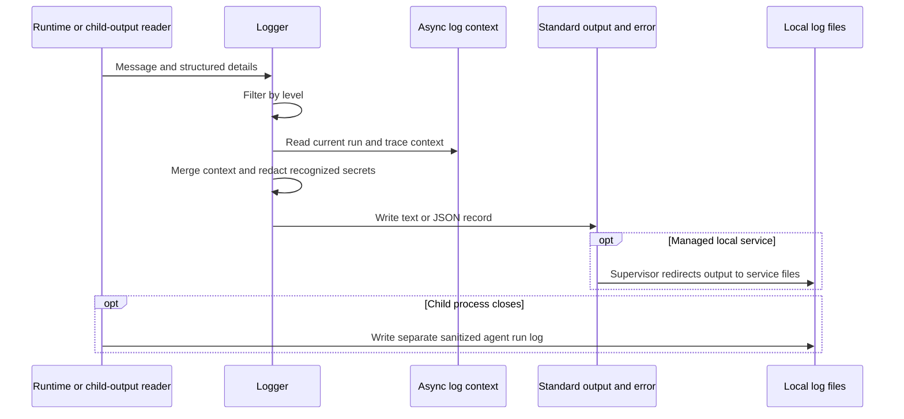

# Observability and operations

## 1. What this area does

Gantry gives its owner several ways to see whether the system is working and where work gets stuck. Logs describe what happened, while status and doctor summarize setup, service state and problems that need attention. Health checks distinguish a process that answers requests from one that is ready to serve its assigned work. Metrics expose worker, queue and capacity measurements, and optional traces connect an agent turn with its model calls and inferred tool activity. Logs hide recognized secrets; trace content has a separate capture setting, so it should not be treated as automatically sanitized log output.

These behaviors come from [logger.ts](../../../apps/core/src/infrastructure/logging/logger.ts), [status.ts](../../../apps/core/src/cli/status.ts), [doctor.ts](../../../apps/core/src/cli/doctor.ts), [system.ts](../../../apps/core/src/control/server/routes/system.ts), [system-health.ts](../../../apps/core/src/control/server/system-health.ts) and [genai-spans.ts](../../../apps/core/src/adapters/llm/observability/genai-spans.ts).

## 2. Architecture diagram

The two views contain 25 distinct nodes. External monitoring consumers are integration points, not services created by the Gantry runtime. The path tables identify every node.



| Node                                                              | Current code anchor                                                                                                                                                                                                                                                                                                                                           |
| ----------------------------------------------------------------- | ------------------------------------------------------------------------------------------------------------------------------------------------------------------------------------------------------------------------------------------------------------------------------------------------------------------------------------------------------------- |
| Owner; status and doctor                                          | Command dispatch and exit codes in [cli/index.ts](../../../apps/core/src/cli/index.ts); collection in [status.ts](../../../apps/core/src/cli/status.ts) and [doctor.ts](../../../apps/core/src/cli/doctor.ts).                                                                                                                                                |
| Runtime settings and environment                                  | [runtime-home.ts](../../../apps/core/src/config/settings/runtime-home.ts), [runtime-settings-observability-parser.ts](../../../apps/core/src/config/settings/runtime-settings-observability-parser.ts).                                                                                                                                                       |
| Local service manager; local service log files                    | [service/manager.ts](../../../apps/core/src/infrastructure/service/manager.ts), [service/launchd.ts](../../../apps/core/src/infrastructure/service/launchd.ts).                                                                                                                                                                                               |
| Postgres                                                          | Operational queries in [system-health.ts](../../../apps/core/src/control/server/system-health.ts), CLI checks in [storage-readiness.ts](../../../apps/core/src/adapters/storage/postgres/storage-readiness.ts).                                                                                                                                               |
| Load balancer or monitoring scraper; health and diagnostic routes | The internal probe/scrape contract and HTTP responses in [routes/system.ts](../../../apps/core/src/control/server/routes/system.ts).                                                                                                                                                                                                                          |
| Readiness and metrics evaluator                                   | [system-health.ts](../../../apps/core/src/control/server/system-health.ts).                                                                                                                                                                                                                                                                                   |
| Control status model                                              | [control-plane-request-model.ts](../../../apps/core/src/control/server/control-plane-request-model.ts).                                                                                                                                                                                                                                                       |
| Local runtime state and error counts                              | [draining-state.ts](../../../apps/core/src/app/bootstrap/draining-state.ts), [settings-load-state.ts](../../../apps/core/src/runtime/settings-load-state.ts), [operational-error-counters.ts](../../../apps/core/src/shared/operational-error-counters.ts); worker/scheduler/capacity callbacks wired in [app/index.ts](../../../apps/core/src/app/index.ts). |
| Runtime startup and shutdown                                      | [app/index.ts](../../../apps/core/src/app/index.ts), [startup.ts](../../../apps/core/src/app/bootstrap/startup.ts), [shutdown.ts](../../../apps/core/src/app/bootstrap/shutdown.ts).                                                                                                                                                                          |
| Main thread delay monitor                                         | [event-loop-delay-monitor.ts](../../../apps/core/src/infrastructure/logging/event-loop-delay-monitor.ts).                                                                                                                                                                                                                                                     |
| Filtered and redacted logger; standard output and error           | [logger.ts](../../../apps/core/src/infrastructure/logging/logger.ts).                                                                                                                                                                                                                                                                                         |



Postgres is the same store shown in the first view; the second view adds ten distinct nodes.

| Node                                                             | Current code anchor                                                                                                                                                                                                                                                                                                                                                                                             |
| ---------------------------------------------------------------- | --------------------------------------------------------------------------------------------------------------------------------------------------------------------------------------------------------------------------------------------------------------------------------------------------------------------------------------------------------------------------------------------------------------- |
| Agent execution entry                                            | [agent-spawn.ts](../../../apps/core/src/runtime/agent-spawn.ts), [agent-spawn-entry.ts](../../../apps/core/src/runtime/agent-spawn-entry.ts).                                                                                                                                                                                                                                                                   |
| Turn tracker and log context                                     | [spawn-log-context.ts](../../../apps/core/src/infrastructure/observability/spawn-log-context.ts), [spawn-turn-tracker.ts](../../../apps/core/src/infrastructure/observability/spawn-turn-tracker.ts).                                                                                                                                                                                                           |
| Child runner; local agent run logs                               | Launch, output handling and log writing in [agent-spawn-process.ts](../../../apps/core/src/runtime/agent-spawn-process.ts); workspace log directory in [agent-spawn.ts](../../../apps/core/src/runtime/agent-spawn.ts).                                                                                                                                                                                         |
| Host model gateway; external model provider                      | Authenticated upstream forwarding in [gantry-model-gateway.ts](../../../apps/core/src/adapters/llm/anthropic-claude-agent/gantry-model-gateway.ts).                                                                                                                                                                                                                                                             |
| Model and inferred tool observations                             | [gantry-model-gateway-observability.ts](../../../apps/core/src/adapters/llm/anthropic-claude-agent/gantry-model-gateway-observability.ts), [genai-spans.ts](../../../apps/core/src/adapters/llm/observability/genai-spans.ts), [genai-tool-spans.ts](../../../apps/core/src/adapters/llm/observability/genai-tool-spans.ts).                                                                                    |
| In-memory spans and export queue; configured OTLP trace receiver | The OpenTelemetry provider, batch processor and HTTP exporter in [tracing.ts](../../../apps/core/src/infrastructure/observability/tracing.ts), configured by [startup.ts](../../../apps/core/src/app/bootstrap/startup.ts).                                                                                                                                                                                     |
| Durable runtime event publisher; Postgres                        | Gateway audit callback wiring in [agent-credential-broker-factory.ts](../../../apps/core/src/adapters/credentials/agent-credential-broker-factory.ts); [runtime-event-exchange.ts](../../../apps/core/src/application/runtime-events/runtime-event-exchange.ts) and [runtime-event-repository.postgres.ts](../../../apps/core/src/adapters/storage/postgres/repositories/runtime-event-repository.postgres.ts). |

## 3. Key flows

### A. Decide whether a process is ready, then measure its work



1. The HTTP handler returns `/healthz` immediately; it does not query storage. `/healthz`, `/readyz` and `/metrics` are deliberately unauthenticated operational endpoints whose exposure is left to deployment routing. See [routes/system.ts](../../../apps/core/src/control/server/routes/system.ts).
2. Readiness probes the database and compares the applied migration count with the shipped journal count. It also requires loaded settings and a process that is not draining. This is a count-based check, not the stronger migration hash and capability validation used by CLI doctor. See [system-health.ts](../../../apps/core/src/control/server/system-health.ts), [routes/system.ts](../../../apps/core/src/control/server/routes/system.ts) and [storage-service.ts](../../../apps/core/src/adapters/storage/postgres/storage-service.ts).
3. Split roles add their applicable checks: control needs configured API keys, workers need a registered worker identity, and job workers need a ready scheduler. Live workers report available or saturated capacity; saturation alone does not fail readiness because existing turns still need continuations. `all` explicitly omits role-specific checks. See [role-readiness.ts](../../../apps/core/src/app/bootstrap/roles/role-readiness.ts), [app/index.ts](../../../apps/core/src/app/index.ts) and [system-health.ts](../../../apps/core/src/control/server/system-health.ts).
4. A metrics scrape reads fresh aggregates, including recent worker heartbeats, pg-boss queue states, dependency build states, overdue jobs requiring capabilities, and run slots. Live processes additionally expose active/recoverable turns and admission backlog. Each database query group is guarded; an unavailable measurement disappears rather than becoming a fabricated zero. Process-up, uptime, role and draining measurements remain available. See [system-health.ts](../../../apps/core/src/control/server/system-health.ts).

### B. Follow one agent turn through the model gateway

```mermaid
sequenceDiagram
    participant E as Agent execution entry
    participant T as Turn tracker
    participant G as Host model gateway
    participant O as Model observation
    participant P as External model provider
    participant D as Runtime event publisher
    participant X as OpenTelemetry export
    participant B as Configured OTLP receiver
    E->>T: Open turn and correlation context
    T->>X: Start agent span if tracing enabled
    E->>G: Runner model request with correlated gateway token
    G->>O: Begin observation
    O->>X: Start model span under matching local turn
    G->>P: Forward authorized request
    P-->>G: Response headers and body
    Note over G,D: Streaming audit starts before piping; JSON audit follows parsing
    G->>O: Observe response and finalize model span
    O->>X: Usage, outcome and optional bounded content
    Note over O,X: Complete streamed tool calls can open spans before model finalization
    G->>D: Await model-use audit when sink configured
    opt Complete tool call observed
        O->>X: Open inferred tool span
        E->>G: Later model request includes tool result
        G->>O: Match result to pending call
        O->>X: End inferred tool span
    end
    E->>T: Execution finishes
    T->>X: End turn and any unresolved tool children
    X-->>B: Batch export finished spans
```

1. The agent entry wraps execution in a turn tracker and asynchronous log context carrying run, app, agent and optional trace identifiers. The correlation value is also supplied to credential preparation so gateway calls can find the same turn. The entry wraps the inline early-return path too; child-process handling applies only when a child is launched. See [agent-spawn-entry.ts](../../../apps/core/src/runtime/agent-spawn-entry.ts), [agent-spawn.ts](../../../apps/core/src/runtime/agent-spawn.ts) and [spawn-log-context.ts](../../../apps/core/src/infrastructure/observability/spawn-log-context.ts).
2. The gateway begins an observation before injecting provider authentication and fetching upstream. A model span attaches to a turn found by run identifier in this process; calls without a matching turn have separate component attribution. Batch/file transports and generation-excluded endpoints such as embeddings and token counting are not traced as chat generations. Disabled tracing or a nonrecording span skips request rewriting and stream observation. See [gantry-model-gateway.ts](../../../apps/core/src/adapters/llm/anthropic-claude-agent/gantry-model-gateway.ts), [gantry-model-gateway-observability.ts](../../../apps/core/src/adapters/llm/anthropic-claude-agent/gantry-model-gateway-observability.ts) and [genai-spans.ts](../../../apps/core/src/adapters/llm/observability/genai-spans.ts).
3. JSON and streaming responses take separate observation paths. The streaming accumulator understands Anthropic and OpenAI events, retaining bounded text, tool fragments, usage and errors. For recorded OpenAI streaming calls lacking an explicit usage option, observation requests usage and strips the injected usage-only frames before returning the stream. Other taps pass bytes through. See [genai-spans.ts](../../../apps/core/src/adapters/llm/observability/genai-spans.ts), [sse-accumulator.ts](../../../apps/core/src/adapters/llm/observability/sse-accumulator.ts) and [sse-frame-splitter.ts](../../../apps/core/src/adapters/llm/observability/sse-frame-splitter.ts).
4. Finalization records status, model, token usage and estimated cost when available. Message attributes and tool payloads depend on content capture and size bounds. Tool spans are reconstructed from completed model tool calls and results in later requests; their timing is not a direct measurement from execution callbacks. Missing results become `tool_result_missing` when the turn ends. See [genai-message-attributes.ts](../../../apps/core/src/adapters/llm/observability/genai-message-attributes.ts), [genai-tool-spans.ts](../../../apps/core/src/adapters/llm/observability/genai-tool-spans.ts) and [tracing.ts](../../../apps/core/src/infrastructure/observability/tracing.ts).
5. Gateway model-use audits use the separate durable runtime event path even when tracing is disabled, if its audit sink is configured. The exchange appends before notifying consumers; failed notifications can be recovered by cursor polling. Gateway audit failure is logged; a missing run foreign key gets one retry without that run link. See [gantry-model-gateway.ts](../../../apps/core/src/adapters/llm/anthropic-claude-agent/gantry-model-gateway.ts), [gantry-model-gateway-audit.ts](../../../apps/core/src/adapters/llm/anthropic-claude-agent/gantry-model-gateway-audit.ts) and [runtime-event-exchange.ts](../../../apps/core/src/application/runtime-events/runtime-event-exchange.ts).
6. The tracker ends the turn in a `finally` block. A streamed terminal frame marked as continuing into a follow-up rotates the turn span; delegation may supply the parent span. OpenTelemetry batches finished spans for HTTP export, with no Postgres replay queue for traces. See [spawn-turn-tracker.ts](../../../apps/core/src/infrastructure/observability/spawn-turn-tracker.ts), [spawn-log-context.ts](../../../apps/core/src/infrastructure/observability/spawn-log-context.ts) and [tracing.ts](../../../apps/core/src/infrastructure/observability/tracing.ts).

### C. Turn runtime diagnostics into operator logs



1. The logger filters before building a record, then combines base, asynchronous and child context with supplied details. It adds timestamp, level, message and process identifier. See [logger.ts](../../../apps/core/src/infrastructure/logging/logger.ts).
2. Structured fields with sensitive names and recognized secret patterns in strings are redacted; errors include sanitized message, stack and selected database details, with depth limits. `LOG_LEVEL` controls filtering, `LOG_FORMAT=json` selects JSON, and `GANTRY_LOG_STDERR=1` sends all records to standard error. Otherwise warning and higher levels go to standard error, and lower levels to standard output. See [logger.ts](../../../apps/core/src/infrastructure/logging/logger.ts).
3. The child-output reader sanitizes stderr and forwards its lines at debug level. It bounds retained stdout/stderr and writes a separate agent log when the child closes; debug runs or nonzero exits include fuller sanitized output. Local service launchers redirect runtime streams into service log files. See [agent-spawn-process.ts](../../../apps/core/src/runtime/agent-spawn-process.ts), [service/launchd.ts](../../../apps/core/src/infrastructure/service/launchd.ts) and [service/manager.ts](../../../apps/core/src/infrastructure/service/manager.ts).
4. Every runtime role starts the event-loop delay monitor. By default, each ten-second window warns if the maximum main-thread delay exceeds one second. This warns through the logger; it does not itself change readiness. See [app/index.ts](../../../apps/core/src/app/index.ts) and [event-loop-delay-monitor.ts](../../../apps/core/src/infrastructure/logging/event-loop-delay-monitor.ts).

### D. Ask status or doctor what needs attention

```mermaid
sequenceDiagram
    actor U as Owner
    participant C as CLI command
    participant D as Doctor
    participant S as Settings and service manager
    participant P as Postgres
    participant N as Credential and channel validators
    U->>C: gantry doctor or gantry status
    C->>D: Collect diagnostic checks
    D->>S: Runtime files, settings and local prerequisites
    D->>P: Assert current migrations and storage capabilities
    opt Doctor command with live checks enabled
        D->>N: Validate configured Telegram, Slack and model credentials
    end
    D-->>C: Pass, warning, failure and next actions
    opt Status command
        C->>S: Read service state and effective local settings
        C->>P: Read approvals, capacity and control status facts
        C->>C: Format repository model or settings fallback
    end
    C-->>U: Report; exit 0 if doctor passes, otherwise 1
```

1. CLI doctor checks Node version, installed runtime files, writable runtime home/IPC, settings, storage configuration, environment policy, memory, credentials and runner prerequisites, with platform-specific service checks. See [doctor.ts](../../../apps/core/src/cli/doctor.ts), [doctor-runtime-config.ts](../../../apps/core/src/cli/doctor-runtime-config.ts) and [doctor-runner-sandbox.ts](../../../apps/core/src/cli/doctor-runner-sandbox.ts).
2. Its asynchronous path validates current migrations and actual storage capabilities. By default, the doctor command also enables configured Telegram/Slack token checks and live model credential checks; status explicitly disables those three live checks. We did not run them to write this document. See [doctor.ts](../../../apps/core/src/cli/doctor.ts), [status.ts](../../../apps/core/src/cli/status.ts) and [storage-readiness.ts](../../../apps/core/src/adapters/storage/postgres/storage-readiness.ts).
3. Status combines service state, settings, credentials, memory and Postgres facts, then adds role and capacity summaries. Storage failures can remove repository/capacity detail or produce an undercount warning. Its repository-model path currently differs from its fallback handling of doctor blockers, as recorded in the existing audit. Both CLI commands choose their exit code from doctor success. See [status.ts](../../../apps/core/src/cli/status.ts), [control-plane-storage-model.ts](../../../apps/core/src/application/control-plane/control-plane-storage-model.ts) and [cli/index.ts](../../../apps/core/src/cli/index.ts).
4. The API diagnostic routes are separate: `/v1/health` and `/v1/doctor` require `sessions:read`, and `/v1/status` requires `agents:admin`. API doctor currently hardcodes storage success; it does not run CLI doctor or readiness. `gantry local doctor` is narrower again: it checks Docker and Compose prerequisites. See [routes/system.ts](../../../apps/core/src/control/server/routes/system.ts), [local-doctor.ts](../../../apps/core/src/cli/local-doctor.ts) and [local.ts](../../../apps/core/src/cli/local.ts).

## 4. Data it owns

Observability does not own a dedicated Postgres trace, log or metrics table. It produces the following output and contributes gateway audit records to the shared runtime event store.

| Output                                                     | What it holds and where it comes from                                                                                                                                                                                                                                                                                                                                                                                                                                     |
| ---------------------------------------------------------- | ------------------------------------------------------------------------------------------------------------------------------------------------------------------------------------------------------------------------------------------------------------------------------------------------------------------------------------------------------------------------------------------------------------------------------------------------------------------------- |
| Standard output/error                                      | Filtered text or JSON runtime records; [logger.ts](../../../apps/core/src/infrastructure/logging/logger.ts).                                                                                                                                                                                                                                                                                                                                                              |
| Runtime-home `logs/gantry.log` and `logs/gantry.error.log` | Redirected local service output and errors; [runtime-home.ts](../../../apps/core/src/config/settings/runtime-home.ts), [service/manager.ts](../../../apps/core/src/infrastructure/service/manager.ts), [service/launchd.ts](../../../apps/core/src/infrastructure/service/launchd.ts).                                                                                                                                                                                    |
| Workspace `logs/agent-<timestamp>.log`                     | Child-run duration, exit/signal, startup timing and runtime details, with fuller sanitized output on debug/error paths; [agent-spawn.ts](../../../apps/core/src/runtime/agent-spawn.ts), [agent-spawn-process.ts](../../../apps/core/src/runtime/agent-spawn-process.ts).                                                                                                                                                                                                 |
| Exported OTLP spans                                        | Sampled turn, model and reconstructed tool observations, with optional bounded content; [tracing.ts](../../../apps/core/src/infrastructure/observability/tracing.ts), [genai-spans.ts](../../../apps/core/src/adapters/llm/observability/genai-spans.ts).                                                                                                                                                                                                                 |
| Shared `runtime_events` and `event_bus_outbox`             | Gateway credential/token/use audit events and their durable event-bus projection, written through the event repository; [gantry-model-gateway.ts](../../../apps/core/src/adapters/llm/anthropic-claude-agent/gantry-model-gateway.ts), [runtime-event-repository.postgres.ts](../../../apps/core/src/adapters/storage/postgres/repositories/runtime-event-repository.postgres.ts), [schema/events.ts](../../../apps/core/src/adapters/storage/postgres/schema/events.ts). |

The area's operational endpoints read these stores without owning their lifecycle:

| Read source                                                           | What is measured                                                                                                                                                                                                                                                                                                                        |
| --------------------------------------------------------------------- | --------------------------------------------------------------------------------------------------------------------------------------------------------------------------------------------------------------------------------------------------------------------------------------------------------------------------------------- |
| `__drizzle_migrations` and shipped migration journal                  | Applied-count readiness; CLI storage validation additionally checks latest migration timestamp/hash and seeded defaults; [routes/system.ts](../../../apps/core/src/control/server/routes/system.ts), [storage-service.ts](../../../apps/core/src/adapters/storage/postgres/storage-service.ts).                                         |
| `worker_instances`, `run_slots`, `run_leases`, `runtime_dependencies` | Worker heartbeat inventory, held capacity, ownership validity and toolchain build states; [system-health.ts](../../../apps/core/src/control/server/system-health.ts), [schema/worker-coordination.ts](../../../apps/core/src/adapters/storage/postgres/schema/worker-coordination.ts).                                                  |
| `live_turns`, `live_admission_work_items`                             | Active/owner-lost turns and queued or eligible deferred admission work; [system-health.ts](../../../apps/core/src/control/server/system-health.ts), [schema/live-turns.ts](../../../apps/core/src/adapters/storage/postgres/schema/live-turns.ts).                                                                                      |
| `pgboss.job`, `jobs`                                                  | Queue-state counts and overdue scheduled work with required capabilities; [system-health.ts](../../../apps/core/src/control/server/system-health.ts).                                                                                                                                                                                   |
| Settings, model credentials, jobs and pending access requests         | Inputs to operator status rather than a new status table; [status.ts](../../../apps/core/src/cli/status.ts), [control-plane-storage-model.ts](../../../apps/core/src/application/control-plane/control-plane-storage-model.ts), [control-plane-request-model.ts](../../../apps/core/src/control/server/control-plane-request-model.ts). |

## 5. How it scales and fails

### Process roles

All four runtime roles start the logger/delay monitor and serve operational diagnostics. Optional tracing is initialized after authoritative settings are available; a fleet process awaiting its first settings revision stays not ready and defers tracing initialization. CLI diagnostics run as their own command process. See [app/index.ts](../../../apps/core/src/app/index.ts), [startup.ts](../../../apps/core/src/app/bootstrap/startup.ts) and [cli/index.ts](../../../apps/core/src/cli/index.ts).

| Role          | API surface and work                                                                    | Additional readiness checks                                            |
| ------------- | --------------------------------------------------------------------------------------- | ---------------------------------------------------------------------- |
| `all`         | Full control API, live conversations and scheduler jobs; live metrics enabled.          | None beyond database, migrations, settings and draining.               |
| `control`     | Full control API; live execution and scheduler execution disabled by role capabilities. | Configured API keys.                                                   |
| `live-worker` | Operational/read-only diagnostic API and live execution; live metrics enabled.          | Worker registration; live capacity reported without failing readiness. |
| `job-worker`  | Operational/read-only diagnostic API, scheduler execution and toolchain baking.         | Worker registration and scheduler readiness.                           |

This table describes bootstrap role capabilities and diagnostic checks, not a guarantee that every unrelated recovery path obeys those gates. Sources: [role-capabilities.ts](../../../apps/core/src/app/bootstrap/roles/role-capabilities.ts), [role-readiness.ts](../../../apps/core/src/app/bootstrap/roles/role-readiness.ts), [app/index.ts](../../../apps/core/src/app/index.ts) and [system-health.ts](../../../apps/core/src/control/server/system-health.ts).

### Memory, Postgres and external storage

- **Per process:** log correlation uses `AsyncLocalStorage`; error counters use a map; delay monitoring uses a histogram/timer. Turn spans, pending tool spans, delegation parent hints, stream buffers and the OpenTelemetry batch queue are in memory. Delegation parent hints expire after 30 minutes and are capped at 1,024 entries. These structures are not shared between workers. See [logger.ts](../../../apps/core/src/infrastructure/logging/logger.ts), [operational-error-counters.ts](../../../apps/core/src/shared/operational-error-counters.ts), [event-loop-delay-monitor.ts](../../../apps/core/src/infrastructure/logging/event-loop-delay-monitor.ts), [tracing.ts](../../../apps/core/src/infrastructure/observability/tracing.ts), [genai-tool-spans.ts](../../../apps/core/src/adapters/llm/observability/genai-tool-spans.ts) and [sse-accumulator.ts](../../../apps/core/src/adapters/llm/observability/sse-accumulator.ts).
- **Shared measurements:** database aggregates may describe the whole deployment even when exposed by multiple processes; active-turn/local-slot metrics describe the current worker. Scrapers must preserve process identity for local counters and avoid treating repeated global aggregates as independent totals. See the query scopes in [system-health.ts](../../../apps/core/src/control/server/system-health.ts).
- **Tracing configuration:** tracing defaults to disabled. When enabled, content capture defaults to true and sampling to 1; disabling content capture removes prompt/result and tool-payload export, but retains metadata and bounded in-memory delegation correlation hints. The runtime uses parent-based sampling and HTTP OTLP export with service name `gantry-runtime`; optional authentication headers come from `GANTRY_OTEL_TRACES_HEADERS` through runtime secret environment lookup. See [runtime-settings-observability-parser.ts](../../../apps/core/src/config/settings/runtime-settings-observability-parser.ts), [startup.ts](../../../apps/core/src/app/bootstrap/startup.ts), [tracing.ts](../../../apps/core/src/infrastructure/observability/tracing.ts) and [sse-accumulator.ts](../../../apps/core/src/adapters/llm/observability/sse-accumulator.ts).

### Failure and restart

- **Database outage:** readiness fails and returns 503. Metrics still returns 200 with process measurements and any successful query groups; omitted gauges mean unavailable evidence. API doctor can still claim storage success because of its hardcoded check. See [routes/system.ts](../../../apps/core/src/control/server/routes/system.ts) and [system-health.ts](../../../apps/core/src/control/server/system-health.ts).
- **Trace/stream trouble:** trace construction and finalization catch failures; initialization/export diagnostics go to warnings. Malformed or oversized SSE data stops or reduces observation while forwarding continues; retained frame, content and tool data have caps. There is no durable trace retry/replay store in Gantry. Captured trace content goes through bounding/encoding, not logger secret redaction. See [startup.ts](../../../apps/core/src/app/bootstrap/startup.ts), [tracing.ts](../../../apps/core/src/infrastructure/observability/tracing.ts), [genai-spans.ts](../../../apps/core/src/adapters/llm/observability/genai-spans.ts), [sse-accumulator.ts](../../../apps/core/src/adapters/llm/observability/sse-accumulator.ts) and [sse-frame-splitter.ts](../../../apps/core/src/adapters/llm/observability/sse-frame-splitter.ts).
- **Graceful stop:** the first SIGTERM/SIGINT marks draining, stops intake/recovery, waits for the queue's drain deadline, then tears down services. Readiness turns red while the process drains. Tracing shutdown ends registered tool children, clears local registries and asks the provider to shut down before storage closes; failures are logged. See [shutdown.ts](../../../apps/core/src/app/bootstrap/shutdown.ts) and [tracing.ts](../../../apps/core/src/infrastructure/observability/tracing.ts).
- **Crash/restart:** in-memory counters, correlation and unexported spans are lost; finished local files survive only if their filesystem survives. Registered global uncaught-exception handling logs fatal and exits, while unhandled rejection handling logs an error. Worker heartbeats and durable ownership records let recovery identify stale workers and leases, independently of traces. Durable runtime events can be read again by cursor, but tracing does not reconstruct the crashed process's unfinished spans. See [logger.ts](../../../apps/core/src/infrastructure/logging/logger.ts), [worker-identity.ts](../../../apps/core/src/jobs/worker-identity.ts), [scheduler-worker-recovery.ts](../../../apps/core/src/infrastructure/pgboss/scheduler-worker-recovery.ts), [runtime-event-exchange.ts](../../../apps/core/src/application/runtime-events/runtime-event-exchange.ts) and [tracing.ts](../../../apps/core/src/infrastructure/observability/tracing.ts).

## 6. Video script outline

These seven beats target a 60–90 second explainer; the numbered flows above provide their code anchors.

1. Gantry gives its owner logs, diagnostics and measurements to understand whether work is moving.
2. A health ping says the process answers, while readiness checks the database, settings and responsibilities of that service.
3. Status summarizes setup and capacity, and doctor checks prerequisites and suggests what to fix.
4. Runtime logs connect events to a run and hide recognized secrets before writing output.
5. Optional traces follow an agent turn through model calls, usage and tool activity inferred from the conversation.
6. Shared database records show the backlog and ownership, while each worker keeps its own counters and trace buffers.
7. A planned stop marks the service as draining, but after a crash durable work records outlive the lost in-memory diagnostics.

## 7. Duplication and simplification

### (a) Existing audit findings

The checked-in [observability and operations audit][audit] has these existing finding titles:

- [API doctor reports success without checking — parallel / UX][audit].
- [Status discards doctor failures on its normal path — parallel / UX][audit].
- [Tool execution has two independent diagnostic accounts — parallel / over-complicated][audit].
- [Runner diagnostics require different switches — parallel / UX][audit].
- [Telemetry exports legacy and current representations together — parallel / legacy][audit].
- [Status repeats storage setup and approval counting — duplicate][audit].
- [Tool-payload bounding is copied and has drifted — duplicate][audit].
- [Provider-session redaction is duplicated exactly — duplicate][audit].

[audit]: ../audits/2026-10-02-area-audit/12-observability-ops.md

### (b) New observations

1. **Tracing defaults are maintained twice — duplication.** The same four defaults (`enabled`, `endpoint`, `captureContent`, `sampleRate`) are created independently at `apps/core/src/config/settings/runtime-settings-defaults.ts:250` and `apps/core/src/config/settings/runtime-settings-observability-parser.ts:46`. They currently agree, but a change can make generated settings and an omitted observability block behave differently. **Survive:** one shared observability defaults value used by the default-settings builder and parser, preserving today's values and validation. **Size:** fix. This is a code-tracing observation, not a demonstrated runtime failure.
