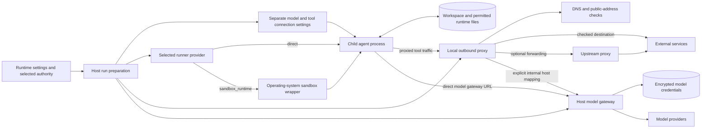
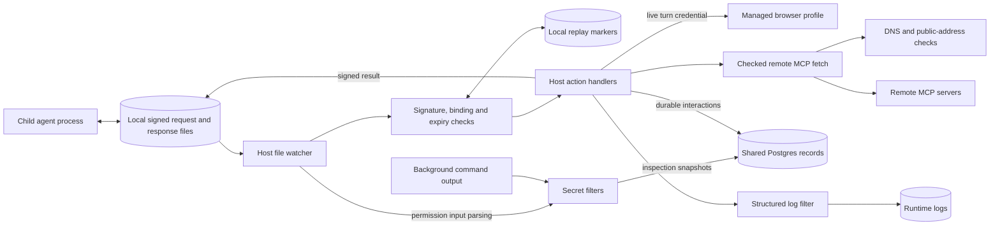
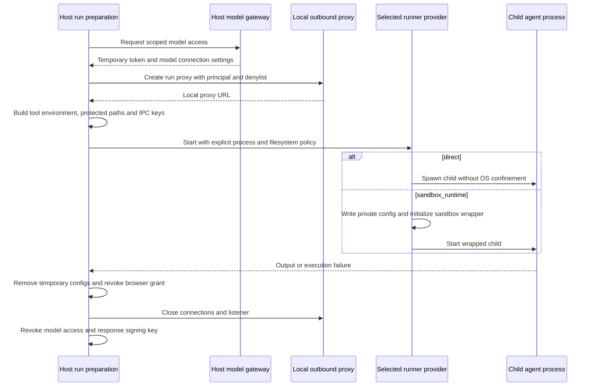
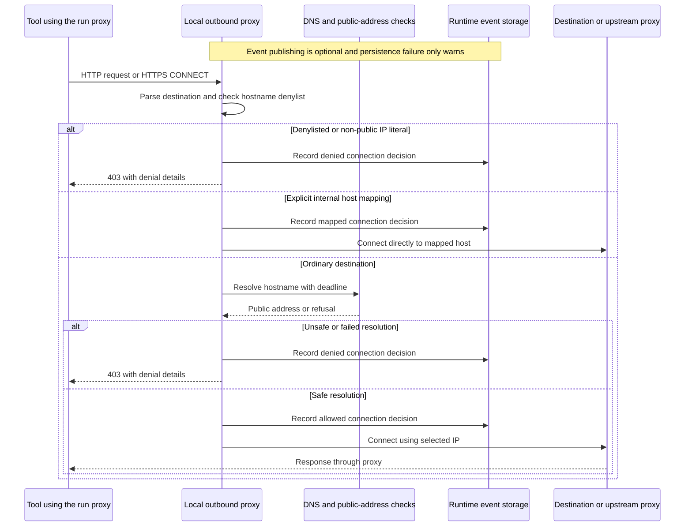
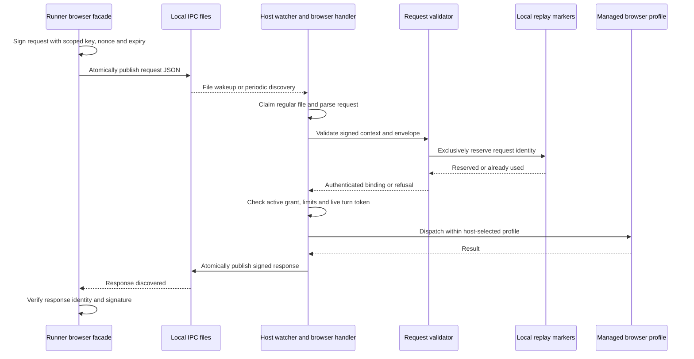
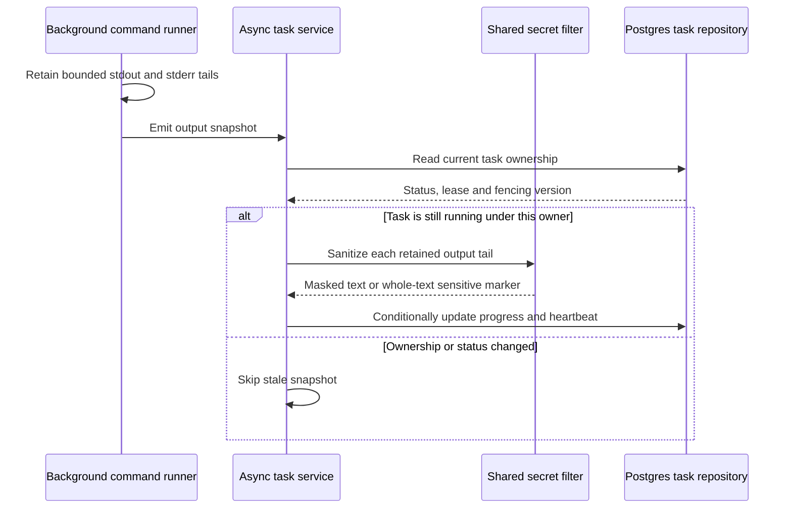

# Security boundaries

## 1. What this area does

Gantry puts checks between an agent and the computer, network, credentials and browser it can use. Before starting a separate agent process, the host prepares its working folders, selected tools and connection settings. An optional operating-system sandbox restricts that whole process; the direct execution option relies on host permission and credential checks and the deployment boundary. Requests back to the host carry signatures, expiry times and checks against reuse, and browser requests must belong to a currently active turn. Secret filters hide recognized sensitive material in selected summaries, permission details and logs, although the filters differ between paths.

These boundaries are implemented by [agent-spawn.ts](../../../apps/core/src/runtime/agent-spawn.ts), [runner-sandbox-provider.ts](../../../apps/core/src/adapters/sandbox/runner-sandbox-provider.ts), [ipc-auth-validation.ts](../../../apps/core/src/runtime/ipc-auth-validation.ts), [ipc-browser-requests.ts](../../../apps/core/src/runtime/ipc-browser-requests.ts), [sensitive-material.ts](../../../apps/core/src/shared/sensitive-material.ts) and [logger.ts](../../../apps/core/src/infrastructure/logging/logger.ts).

## 2. Architecture diagram

### Starting a runner and connecting outward

The outbound proxy applies a hostname denylist and rejects non-public destinations. Its capability host metadata supplies attribution, rather than a general destination allowlist. The sandbox wrapper forwards network requests to that proxy; its destination callback permits forwarding when a parent proxy exists. Tool proxy settings are a routing contract in `direct` mode, not operating-system network confinement. See [egress-gateway.ts](../../../apps/core/src/runtime/egress-gateway.ts), [egress-gateway-audit.ts](../../../apps/core/src/runtime/egress-gateway-audit.ts), [sandbox-runtime-runner.ts](../../../apps/core/src/adapters/sandbox/sandbox-runtime-runner.ts) and [tool-network-env.ts](../../../apps/core/src/shared/tool-network-env.ts).

### Requests back to the host and filtered records

Node anchors below identify the backing code for each component, external system and store. Connections depict the paths named on the arrows.

| Node                                                       | Current code anchor                                                                                                                                                                                                                                                                                                                        |
| ---------------------------------------------------------- | ------------------------------------------------------------------------------------------------------------------------------------------------------------------------------------------------------------------------------------------------------------------------------------------------------------------------------------------ |
| Runtime settings and selected authority                    | [agent-spawn.ts](../../../apps/core/src/runtime/agent-spawn.ts), [agent-spawn-runtime-policy.ts](../../../apps/core/src/runtime/agent-spawn-runtime-policy.ts)                                                                                                                                                                             |
| Host run preparation                                       | [agent-spawn.ts](../../../apps/core/src/runtime/agent-spawn.ts)                                                                                                                                                                                                                                                                            |
| Separate model and tool connection settings                | [agent-spawn-helpers.ts](../../../apps/core/src/runtime/agent-spawn-helpers.ts), [tool-network-env.ts](../../../apps/core/src/shared/tool-network-env.ts)                                                                                                                                                                                  |
| Selected runner provider                                   | [runner-sandbox-provider.ts](../../../apps/core/src/adapters/sandbox/runner-sandbox-provider.ts)                                                                                                                                                                                                                                           |
| Operating-system sandbox wrapper                           | [sandbox-runtime-runner.ts](../../../apps/core/src/adapters/sandbox/sandbox-runtime-runner.ts)                                                                                                                                                                                                                                             |
| Child agent process                                        | [agent-spawn-process.ts](../../../apps/core/src/runtime/agent-spawn-process.ts)                                                                                                                                                                                                                                                            |
| Workspace and permitted runtime files                      | [agent-spawn-helpers.ts](../../../apps/core/src/runtime/agent-spawn-helpers.ts), [runner-sandbox-provider.ts](../../../apps/core/src/adapters/sandbox/runner-sandbox-provider.ts)                                                                                                                                                          |
| Local outbound proxy                                       | [egress-gateway.ts](../../../apps/core/src/runtime/egress-gateway.ts)                                                                                                                                                                                                                                                                      |
| DNS and public-address checks                              | [egress-target-resolution.ts](../../../apps/core/src/shared/egress-target-resolution.ts), [hostname-lookup.ts](../../../apps/core/src/infrastructure/network/hostname-lookup.ts), [dns-pinned-fetch.ts](../../../apps/core/src/shared/dns-pinned-fetch.ts)                                                                                 |
| External services; upstream proxy                          | [egress-gateway-proxying.ts](../../../apps/core/src/runtime/egress-gateway-proxying.ts)                                                                                                                                                                                                                                                    |
| Host model gateway; model providers                        | [gantry-model-gateway.ts](../../../apps/core/src/adapters/llm/anthropic-claude-agent/gantry-model-gateway.ts)                                                                                                                                                                                                                              |
| Encrypted model credentials                                | [model-credentials.ts](../../../apps/core/src/adapters/storage/postgres/schema/model-credentials.ts)                                                                                                                                                                                                                                       |
| Local signed request and response files                    | [runner/mcp/ipc.ts](../../../apps/core/src/runner/mcp/ipc.ts), [filesystem-runner-control-port.ts](../../../apps/core/src/runtime/filesystem-runner-control-port.ts)                                                                                                                                                                       |
| Host file watcher                                          | [ipc.ts](../../../apps/core/src/runtime/ipc.ts)                                                                                                                                                                                                                                                                                            |
| Signature, binding and expiry checks; local replay markers | [ipc-auth-validation.ts](../../../apps/core/src/runtime/ipc-auth-validation.ts), [request-signing.ts](../../../apps/core/src/infrastructure/ipc/request-signing.ts)                                                                                                                                                                        |
| Host action handlers                                       | [ipc.ts](../../../apps/core/src/runtime/ipc.ts), [ipc-browser-requests.ts](../../../apps/core/src/runtime/ipc-browser-requests.ts), [ipc-handler.ts](../../../apps/core/src/jobs/ipc-handler.ts)                                                                                                                                           |
| Managed browser profile                                    | [ipc-browser-handler.ts](../../../apps/core/src/runtime/ipc-browser-handler.ts), [ipc-auth.ts](../../../apps/core/src/runtime/ipc-auth.ts)                                                                                                                                                                                                 |
| Checked remote MCP fetch; remote MCP servers               | [mcp-tool-proxy-connection.ts](../../../apps/core/src/application/mcp/mcp-tool-proxy-connection.ts), [mcp-tool-proxy-network.ts](../../../apps/core/src/application/mcp/mcp-tool-proxy-network.ts)                                                                                                                                         |
| Background command output                                  | [async-command-sandbox-runner.ts](../../../apps/core/src/jobs/async-command-sandbox-runner.ts)                                                                                                                                                                                                                                             |
| Secret filters                                             | [ipc-parsing.ts](../../../apps/core/src/runtime/ipc-parsing.ts), [ipc-tool-input-sanitization.ts](../../../apps/core/src/runtime/ipc-tool-input-sanitization.ts), [async-command-task-helpers.ts](../../../apps/core/src/jobs/async-command-task-helpers.ts), [sensitive-material.ts](../../../apps/core/src/shared/sensitive-material.ts) |
| Shared Postgres records                                    | [async-tasks.ts](../../../apps/core/src/adapters/storage/postgres/schema/async-tasks.ts), [worker-coordination.ts](../../../apps/core/src/adapters/storage/postgres/schema/worker-coordination.ts)                                                                                                                                         |
| Structured log filter; runtime logs                        | [logger.ts](../../../apps/core/src/infrastructure/logging/logger.ts)                                                                                                                                                                                                                                                                       |

## 3. Key flows

### A. Start a separate agent process with explicit boundaries

1. The host resolves the model and prepares its execution adapter. The model gateway reads the app's active credential and issues scoped temporary access; provider credentials are handled on the host. See [agent-spawn.ts](../../../apps/core/src/runtime/agent-spawn.ts) and [gantry-model-gateway.ts](../../../apps/core/src/adapters/llm/anthropic-claude-agent/gantry-model-gateway.ts).
2. The host starts a run-specific outbound proxy. In the sandboxed lane, a model gateway loopback URL is rewritten to an internal hostname whose exact host-and-port mapping points back to the host gateway. See [agent-spawn.ts](../../../apps/core/src/runtime/agent-spawn.ts), [agent-spawn-runtime-policy.ts](../../../apps/core/src/runtime/agent-spawn-runtime-policy.ts) and [egress-gateway-access-policy.ts](../../../apps/core/src/runtime/egress-gateway-access-policy.ts).
3. Model access stays in `modelCredentialEnv`; approved tool networking is projected through `toolNetworkEnv`. Host environment selection is restricted, and the active spawn path reduces `NO_PROXY` to loopback entries. Tools must not inherit broker proxies or raw model-provider tokens. See [agent-spawn-runtime-policy.ts](../../../apps/core/src/runtime/agent-spawn-runtime-policy.ts), [agent-spawn-helpers.ts](../../../apps/core/src/runtime/agent-spawn-helpers.ts), [tool-network-env.ts](../../../apps/core/src/shared/tool-network-env.ts) and [no-proxy.ts](../../../apps/core/src/shared/no-proxy.ts).
4. The provider receives a workspace, runtime read/write paths, protected paths and resource limits. `sandbox_runtime` denies reads of common home credential folders and environment files, permits configured workspace/runtime writes, and initializes the outer sandbox. `direct` spawns without these OS filesystem/network restrictions; configured resource limits use a shell wrapper. See [runner-sandbox-provider.ts](../../../apps/core/src/adapters/sandbox/runner-sandbox-provider.ts), [sandbox-runtime-runner.ts](../../../apps/core/src/adapters/sandbox/sandbox-runtime-runner.ts) and [agent-spawn-helpers.ts](../../../apps/core/src/runtime/agent-spawn-helpers.ts).
5. Missing providers or provider startup errors return an execution failure and a sandbox-blocked event, without switching providers. Finalization removes temporary config files, revokes browser and response-signing grants, closes the egress gateway and revokes projected model access. See [agent-spawn-process.ts](../../../apps/core/src/runtime/agent-spawn-process.ts), [agent-spawn-sandbox-events.ts](../../../apps/core/src/runtime/agent-spawn-sandbox-events.ts) and [agent-spawn.ts](../../../apps/core/src/runtime/agent-spawn.ts).

### B. Check an outward connection before opening it

1. The server accepts ordinary HTTP proxy requests and HTTPS CONNECT tunnels on a loopback listener. Invalid targets receive 400; matching denylist entries or non-public IP literals receive 403. See [egress-gateway.ts](../../../apps/core/src/runtime/egress-gateway.ts) and [egress-policy.ts](../../../apps/core/src/shared/egress-policy.ts).
2. An explicit internal mapping is checked before ordinary DNS resolution and connects directly, bypassing an optional upstream proxy. This is how the rewritten model gateway address reaches its local host endpoint. See [egress-gateway-access-policy.ts](../../../apps/core/src/runtime/egress-gateway-access-policy.ts) and [agent-spawn-runtime-policy.ts](../../../apps/core/src/runtime/agent-spawn-runtime-policy.ts).
3. Ordinary destinations reject localhost names, DNS failure and any returned address classified as non-public. Resolution has a 30-second deadline; the first accepted address becomes the connection target. See [egress-target-resolution.ts](../../../apps/core/src/shared/egress-target-resolution.ts), [hostname-lookup-deadline.ts](../../../apps/core/src/shared/hostname-lookup-deadline.ts) and [network-host-declaration.ts](../../../apps/core/src/shared/network-host-declaration.ts).
4. The proxy connects to that selected IP, directly or through its configured upstream proxy. Direct HTTPS requests keep the original hostname for TLS validation, and HTTP forwarding keeps the destination Host header; CONNECT carries the caller's encrypted stream. Upstream connection failures return 502. See [egress-gateway-proxying.ts](../../../apps/core/src/runtime/egress-gateway-proxying.ts).
5. Connection decisions go to the logger and, when a publisher is supplied, the durable runtime event stream. Audit persistence failure is logged and does not change the connection decision. The event records principal, run/conversation context, destination and available capability attribution. See [egress-gateway-audit.ts](../../../apps/core/src/runtime/egress-gateway-audit.ts) and [events.ts](../../../apps/core/src/adapters/storage/postgres/schema/events.ts).

Other outbound paths have their own boundaries. Remote MCP uses a DNS-pinned HTTP client that rejects mixed public/private DNS answers and preserves the original TLS hostname; an explicitly permitted local HTTP MCP endpoint can use the loopback exception. Outbound webhooks require HTTPS by default, reject URL credentials, support a configured host allowlist and return a resolved target address for delivery. These are implemented in [mcp-tool-proxy-network.ts](../../../apps/core/src/application/mcp/mcp-tool-proxy-network.ts), [dns-pinned-fetch.ts](../../../apps/core/src/shared/dns-pinned-fetch.ts), [hostname-lookup.ts](../../../apps/core/src/infrastructure/network/hostname-lookup.ts), [webhook-target.ts](../../../apps/core/src/control/server/webhook-target.ts) and [webhook-delivery.ts](../../../apps/core/src/control/server/webhook-delivery.ts).

### C. A runner asks the host to use its managed browser

1. The runner browser facade signs the request using its browser-specific key, includes its turn token and response-key identifier, and renames a private temporary file into the request folder. See [runner/mcp/ipc.ts](../../../apps/core/src/runner/mcp/ipc.ts), [ipc-signing.ts](../../../apps/core/src/shared/ipc-signing.ts) and [private-fs.ts](../../../apps/core/src/shared/private-fs.ts).
2. The host watches registered workspace folders, with periodic scanning as a fallback. It rejects untrusted directories and claims regular request files by rename before reading them. See [ipc.ts](../../../apps/core/src/runtime/ipc.ts), [filesystem-runner-control-port.ts](../../../apps/core/src/runtime/filesystem-runner-control-port.ts) and [ipc-filesystem.ts](../../../apps/core/src/runtime/ipc-filesystem.ts).
3. The browser validator derives a key bound to workspace, conversation and optional thread, checks the HMAC signature and freshness, and creates an exclusive replay marker. Ordinary requests have a five-minute maximum future expiry; purpose-limited longer lifetimes apply only to selected general interaction/cancellation requests, not the browser or memory validator. See [ipc-auth.ts](../../../apps/core/src/runtime/ipc-auth.ts), [ipc-auth-validation.ts](../../../apps/core/src/runtime/ipc-auth-validation.ts), [request-signing.ts](../../../apps/core/src/infrastructure/ipc/request-signing.ts) and [ipc-interaction-lifetime.ts](../../../apps/core/src/shared/ipc-interaction-lifetime.ts).
4. The host checks browser authorization, rate/concurrency limits and the live turn credential. That credential resolves the profile and queue key recorded at spawn; the runner cannot choose another profile by naming a folder. Missing or revoked turn credentials fail. See [ipc-browser-requests.ts](../../../apps/core/src/runtime/ipc-browser-requests.ts), [ipc-auth.ts](../../../apps/core/src/runtime/ipc-auth.ts) and [ipc-browser-handler.ts](../../../apps/core/src/runtime/ipc-browser-handler.ts).
5. The browser handler applies usage policy and action deadlines before dispatching actions. It signs the response with the host's Ed25519 private key and publishes it by rename. The runner verifies the matching request identifier and signature using its public verification key before accepting the result. See [ipc-browser-handler.ts](../../../apps/core/src/runtime/ipc-browser-handler.ts), [response-signing.ts](../../../apps/core/src/infrastructure/ipc/response-signing.ts), [ipc-signing.ts](../../../apps/core/src/shared/ipc-signing.ts) and [runner/mcp/ipc.ts](../../../apps/core/src/runner/mcp/ipc.ts).

Signing proves the request's binding, not permission to perform every action. Memory requests additionally bind app, agent, person, allowed actions and reviewer authority. Message delivery resolves the registered conversation/thread/provider-account route and refuses ambiguous or unauthorized routes. Permission requests pass through the parent-side locked-agent and run-restriction checks, then create durable pending state before a prompt is rendered. See [ipc-auth-validation.ts](../../../apps/core/src/runtime/ipc-auth-validation.ts), [ipc-route-authorization.ts](../../../apps/core/src/runtime/ipc-route-authorization.ts) and [ipc-interaction-processing.ts](../../../apps/core/src/runtime/ipc-interaction-processing.ts).

### D. Filter a background command's inspection snapshot

1. The command runner keeps bounded in-memory stdout/stderr tails and schedules snapshots at one-second intervals. A snapshot callback failure is swallowed, so this inspection path is best-effort. See [async-command-sandbox-runner.ts](../../../apps/core/src/jobs/async-command-sandbox-runner.ts).
2. The task service supplies the persistence callback. It re-reads the task and requires matching running status, lease token and fencing version. See [async-command-task-service.ts](../../../apps/core/src/jobs/async-command-task-service.ts) and [async-command-task-helpers.ts](../../../apps/core/src/jobs/async-command-task-helpers.ts).
3. The shared filter masks recognized provider tokens, AWS access-key identifiers, JWTs, private-key blocks, bearer tokens and secret assignments. If a remaining opaque token looks sensitive, it replaces the whole submitted text with a sensitive marker. The snapshot helper sanitizes the already-retained tails before applying its own output limit. See [sensitive-material.ts](../../../apps/core/src/shared/sensitive-material.ts) and [async-command-task-helpers.ts](../../../apps/core/src/jobs/async-command-task-helpers.ts).
4. A conditional repository transition writes the filtered tails into the task's private progress data with a heartbeat; the helper retries once if concurrent private-data updates win. See [async-command-task-helpers.ts](../../../apps/core/src/jobs/async-command-task-helpers.ts) and [async-tasks.ts](../../../apps/core/src/adapters/storage/postgres/schema/async-tasks.ts).

Filtering is specific to each output path. Permission input sanitization masks sensitive keys and records redaction/truncation paths. Structured logging recursively masks sensitive keys, strings and Error details; provider-session summaries have a separate text helper. The approved-command adapter accepts reviewed argv and scrubbed environment, handles cancellation/timeouts, and sanitizes failure diagnostics including truncated key fragments; successful output has only the caller-supplied optional redactor. These contracts are in [ipc-tool-input-sanitization.ts](../../../apps/core/src/runtime/ipc-tool-input-sanitization.ts), [logger.ts](../../../apps/core/src/infrastructure/logging/logger.ts), [provider-session-redaction.ts](../../../apps/core/src/shared/provider-session-redaction.ts) and [approved-command-runner.ts](../../../apps/core/src/adapters/sandbox/approved-command-runner.ts).

## 4. Data it owns

Security boundary state uses both local files and shared stores. Paths below are runtime-relative descriptions, not additional repository files.

| File or table                                       | What it holds and code owner                                                                                                                                                                                                                                                                                                                          |
| --------------------------------------------------- | ----------------------------------------------------------------------------------------------------------------------------------------------------------------------------------------------------------------------------------------------------------------------------------------------------------------------------------------------------- |
| DATA_DIR → ipc → workspace → request/response lanes | Signed JSON messages, tasks, browser/memory requests, permission/question requests and replies; [agent-spawn-layout.ts](../../../apps/core/src/runtime/agent-spawn-layout.ts), [filesystem-runner-control-port.ts](../../../apps/core/src/runtime/filesystem-runner-control-port.ts).                                                                 |
| DATA_DIR → ipc → .lock                              | Local watcher PID and start time; [ipc-filesystem.ts](../../../apps/core/src/runtime/ipc-filesystem.ts).                                                                                                                                                                                                                                              |
| DATA_DIR → ipc-replay → hashed JSON markers         | Consumed scoped request identities and expiry timestamps; [ipc-auth-validation.ts](../../../apps/core/src/runtime/ipc-auth-validation.ts).                                                                                                                                                                                                            |
| DATA_DIR → ipc → errors                             | Failed claimed requests, retained under a 30-day/500-entry pruning policy; [ipc-filesystem.ts](../../../apps/core/src/runtime/ipc-filesystem.ts).                                                                                                                                                                                                     |
| Workspace IPC → per-run sandbox-runtime JSON        | Generated filesystem/network policy for the optional wrapper, removed by normal finalization; [agent-spawn.ts](../../../apps/core/src/runtime/agent-spawn.ts), [runner-sandbox-provider.ts](../../../apps/core/src/adapters/sandbox/runner-sandbox-provider.ts).                                                                                      |
| Workspace → logs                                    | Runner diagnostics, alongside host logger sinks; [agent-spawn.ts](../../../apps/core/src/runtime/agent-spawn.ts), [agent-spawn-process.ts](../../../apps/core/src/runtime/agent-spawn-process.ts), [logger.ts](../../../apps/core/src/infrastructure/logging/logger.ts).                                                                              |
| `model_credentials`                                 | Encrypted app/provider credential payloads, fingerprints and status; [model-credentials.ts](../../../apps/core/src/adapters/storage/postgres/schema/model-credentials.ts).                                                                                                                                                                            |
| `runtime_events`                                    | Shared durable egress decisions and sandbox/permission runtime evidence when published; [events.ts](../../../apps/core/src/adapters/storage/postgres/schema/events.ts), [egress-gateway-audit.ts](../../../apps/core/src/runtime/egress-gateway-audit.ts), [runtime-event-forwarding.ts](../../../apps/core/src/runtime/runtime-event-forwarding.ts). |
| `pending_interactions`                              | Shared durable request state, result and callback route, including the sealed response private key for permission IPC; [worker-coordination.ts](../../../apps/core/src/adapters/storage/postgres/schema/worker-coordination.ts), [ipc-interaction-processing.ts](../../../apps/core/src/runtime/ipc-interaction-processing.ts).                       |
| `agent_async_tasks`                                 | Shared task authority, ownership, progress snapshots and terminal summaries; [async-tasks.ts](../../../apps/core/src/adapters/storage/postgres/schema/async-tasks.ts), [async-command-task-helpers.ts](../../../apps/core/src/jobs/async-command-task-helpers.ts).                                                                                    |
| `sandbox_profiles`                                  | Stored filesystem, network, process, browser, credential-access and timeout descriptors; [sandbox.ts](../../../apps/core/src/adapters/storage/postgres/schema/sandbox.ts).                                                                                                                                                                            |
| `workspace_snapshots`                               | Stored root, mount, prompt and context references; [sandbox.ts](../../../apps/core/src/adapters/storage/postgres/schema/sandbox.ts).                                                                                                                                                                                                                  |
| `sandbox_leases`                                    | Stored run/profile/permission-decision association, status and expiry/release times; [sandbox.ts](../../../apps/core/src/adapters/storage/postgres/schema/sandbox.ts).                                                                                                                                                                                |

The last three tables have repository support in [domain-repositories.postgres.ts](../../../apps/core/src/adapters/storage/postgres/repositories/domain-repositories.postgres.ts). The runner start path builds its `runner-default` policy directly in [agent-spawn-helpers.ts](../../../apps/core/src/runtime/agent-spawn-helpers.ts); the diagrams do not imply that launching this wrapper acquires a row in `sandbox_leases`.

## 5. How it scales and fails

### Process roles and execution location

| Responsibility                | all                      | control              | live-worker              | job-worker               |
| ----------------------------- | ------------------------ | -------------------- | ------------------------ | ------------------------ |
| Normal conversation execution | Yes                      | No                   | Yes                      | No                       |
| Normal scheduled execution    | Yes                      | No                   | No                       | Yes                      |
| IPC watcher startup           | Yes                      | Yes                  | Yes                      | Yes                      |
| Control API                   | Full                     | Full                 | Operations routes        | Operations routes        |
| Runner provider and run proxy | On runner/command launch | On any actual launch | On runner/command launch | On runner/command launch |

The role contract is [role-capabilities.ts](../../../apps/core/src/app/bootstrap/roles/role-capabilities.ts). Actual wiring starts IPC before the scheduler/live gates in [runtime-services.ts](../../../apps/core/src/app/bootstrap/runtime-services.ts); a local root lock can prevent a second watcher from starting. Background-task recovery is also currently wired before these role gates and can launch recovered work, including in control. See [runtime-services-async-task-recovery.ts](../../../apps/core/src/app/bootstrap/runtime-services-async-task-recovery.ts) and the existing observation in [deployment and scaling](./11-deploy-scaling.md#b-new-observations).

`direct` and `sandbox_runtime` are runner providers, independent of process role. `direct` has no Gantry OS confinement or inner Claude SDK sandbox; the optional wrapper confines the whole child runner on supported hosts. Windows is rejected by `sandbox_runtime`; networked wrapper runs require a loopback Gantry proxy. Inline agents execute within the host process rather than through this child wrapper. Production/remote posture requires persistent strong secrets and control API keys, but does not force the optional sandbox provider. See [runner-sandbox-provider.ts](../../../apps/core/src/adapters/sandbox/runner-sandbox-provider.ts), [query-loop-phases-setup.ts](../../../apps/core/src/adapters/llm/anthropic-claude-agent/runner/query-loop-phases-setup.ts), [agent-inline.ts](../../../apps/core/src/runtime/agent-inline.ts) and [security-posture.ts](../../../apps/core/src/shared/security-posture.ts).

### Memory, durable state and capacity

- **Per-process memory:** egress listeners/sockets/policy, response private keys, browser grants/turn-profile bindings, IPC counters/in-flight requests, model gateway tokens and rate windows. These are not shared deployment-wide limits. See [egress-gateway.ts](../../../apps/core/src/runtime/egress-gateway.ts), [ipc-auth.ts](../../../apps/core/src/runtime/ipc-auth.ts), [ipc-rate-limit.ts](../../../apps/core/src/runtime/ipc-rate-limit.ts) and [gantry-model-gateway.ts](../../../apps/core/src/adapters/llm/anthropic-claude-agent/gantry-model-gateway.ts).
- **Local disk:** request/response files, watcher lock, replay markers and generated configs. Replay prevention survives a process restart only where the same replay directory is retained; it is not a Postgres replay ledger. Filesystem IPC requires host and runner access to the same files. See [ipc-auth-validation.ts](../../../apps/core/src/runtime/ipc-auth-validation.ts), [ipc-filesystem.ts](../../../apps/core/src/runtime/ipc-filesystem.ts) and [runner/mcp/ipc.ts](../../../apps/core/src/runner/mcp/ipc.ts).
- **Postgres:** credential payloads, runtime audit events, pending interactions and async-task state are durable. IPC permission callbacks store an AES-GCM-sealed private response key using a key derived from the IPC secret; this persisted callback material is distinct from the active in-memory signing-key map. See [ipc-auth.ts](../../../apps/core/src/runtime/ipc-auth.ts), [ipc-interaction-processing.ts](../../../apps/core/src/runtime/ipc-interaction-processing.ts) and the schema links above.
- **Local bounds:** general IPC processing has a 300-file/minute bucket per workspace and kind; browser IPC has four concurrent slots, and permission/question IPC shares a 100-request in-flight bound. Egress probes at most 50 loopback port candidates per gateway. See [ipc-rate-limit.ts](../../../apps/core/src/runtime/ipc-rate-limit.ts), [ipc-browser-requests.ts](../../../apps/core/src/runtime/ipc-browser-requests.ts), [ipc.ts](../../../apps/core/src/runtime/ipc.ts) and [egress-gateway.ts](../../../apps/core/src/runtime/egress-gateway.ts).

### Restart and failure behavior

- Normal run finalization closes proxy sockets/listeners, revokes model/browser/response credentials and deletes temporary configs. The async-command policy registry currently retains completed-run entries until process exit; that is existing audit finding 2 below. See [agent-spawn.ts](../../../apps/core/src/runtime/agent-spawn.ts), [egress-gateway.ts](../../../apps/core/src/runtime/egress-gateway.ts) and [async-command-sandbox-policy.ts](../../../apps/core/src/runtime/async-command-sandbox-policy.ts).
- Watcher shutdown clears in-memory rate/replay state while retaining disk replay markers, stops wakeups and releases its root lock. Startup recovers a lock only after its recorded PID is no longer running; an invalid/missing PID or a live holder prevents recovery. See [ipc.ts](../../../apps/core/src/runtime/ipc.ts), [ipc-root-lock-acquisition.ts](../../../apps/core/src/runtime/ipc-root-lock-acquisition.ts) and [ipc-filesystem.ts](../../../apps/core/src/runtime/ipc-filesystem.ts).
- A crash loses active browser grants, response-key maps and gateway tokens. A runner cannot use a lost turn token to recover a browser binding. Claimed files use a processing prefix excluded from ordinary pending scans, so local IPC does not promise automatic replay of interrupted actions or exactly-once external effects. See [ipc-auth.ts](../../../apps/core/src/runtime/ipc-auth.ts), [ipc-browser-requests.ts](../../../apps/core/src/runtime/ipc-browser-requests.ts), [ipc-filesystem.ts](../../../apps/core/src/runtime/ipc-filesystem.ts) and [gantry-model-gateway.ts](../../../apps/core/src/adapters/llm/anthropic-claude-agent/gantry-model-gateway.ts).
- Local development without an IPC secret generates an ephemeral secret, invalidating old derived tokens and sealed callback keys after restart. Production/remote startup requires a persistent secret. Missing signature keys prevent signed browser responses from being written; the runner rejects invalid replies or times out. See [ipc-auth.ts](../../../apps/core/src/runtime/ipc-auth.ts), [security-posture.ts](../../../apps/core/src/shared/security-posture.ts), [ipc-browser-handler.ts](../../../apps/core/src/runtime/ipc-browser-handler.ts) and [runner/mcp/ipc.ts](../../../apps/core/src/runner/mcp/ipc.ts).
- Permission persistence/grant failures withhold successful IPC responses; egress audit persistence failure only warns. These intentionally different failure contracts protect authority changes while allowing a checked connection to continue if its audit write fails. See [ipc-interaction-processing.ts](../../../apps/core/src/runtime/ipc-interaction-processing.ts) and [egress-gateway-audit.ts](../../../apps/core/src/runtime/egress-gateway-audit.ts).

## 6. Video script outline

These seven beats use the code-backed flows above for a 60–90 second explainer.

1. Gantry prepares an agent's working space and approved tools before letting it act.
2. The owner can add an operating-system sandbox around the separate agent process.
3. Model credentials stay behind a host gateway, while tools receive separate connection settings.
4. Outbound proxy traffic is checked for blocked hosts and unsafe network destinations.
5. Requests back to the host must carry a valid signature, expire on time and pass the reuse check.
6. Browser actions belong to an active turn and its managed profile, while selected records and logs filter sensitive details.
7. Durable records survive restarts, but temporary browser grants and connection tokens must be issued again.

## 7. Duplication and simplification

### (a) Existing audit findings

The checked-in area audit has these existing titles, linked without repeating their findings:

- [Sandbox errors use a weaker redaction fork — duplicate](../audits/2026-10-02-area-audit/13-security-boundaries.md).
- [Completed runs retain sandbox policies indefinitely — over-complicated](../audits/2026-10-02-area-audit/13-security-boundaries.md).
- [Public-address classification is copied wholesale — duplicate](../audits/2026-10-02-area-audit/13-security-boundaries.md).
- [Shell-child environment construction has two copies — duplicate](../audits/2026-10-02-area-audit/13-security-boundaries.md).
- [Provider-session redaction duplicates an existing helper — duplicate](../audits/2026-10-02-area-audit/13-security-boundaries.md).
- [IPC envelope validation is repeated per lane — duplicate](../audits/2026-10-02-area-audit/13-security-boundaries.md).
- [IPC cryptography is split, with unused verification APIs — parallel](../audits/2026-10-02-area-audit/13-security-boundaries.md).

The same audit also lists work already covered by the permission-flow and runner-transport plans.

### (b) New observations

1. **MCP DNS-answer validation is repeated inside one fetch helper — duplicate.** Both `apps/core/src/shared/dns-pinned-fetch.ts:62` and `apps/core/src/shared/dns-pinned-fetch.ts:211` select the first public address, reject empty/mixed-private answers and construct the same error. The first path follows an unbounded lookup in the exported resolver; production fetch uses the second, deadline-aware path. **Survive:** one DNS-answer validation step shared by both entry points, retaining production lookup deadlines, cancellation and connection pinning. **Size:** fix. This is separate from the audit's copied IP-classifier implementations; no new exploit is claimed.
