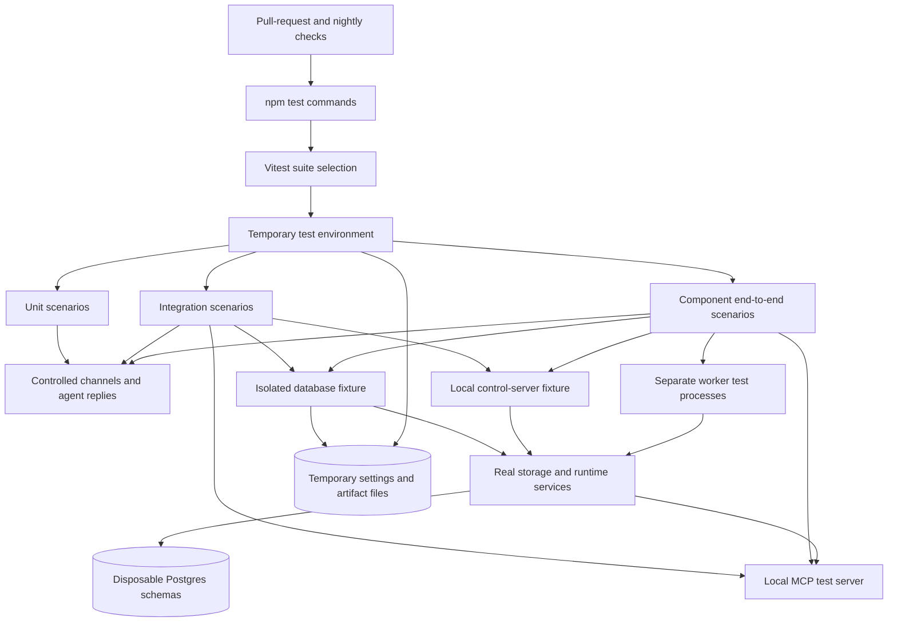
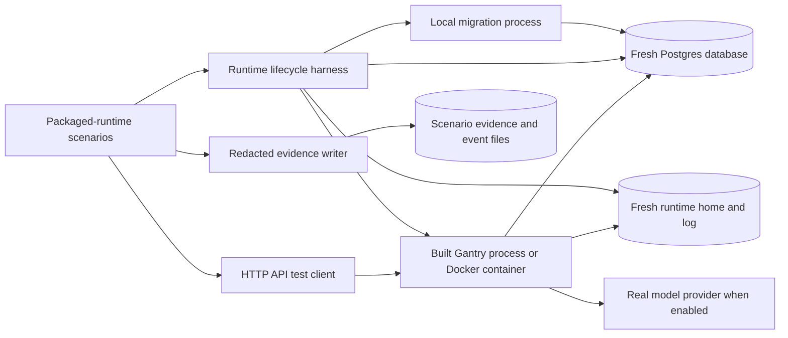
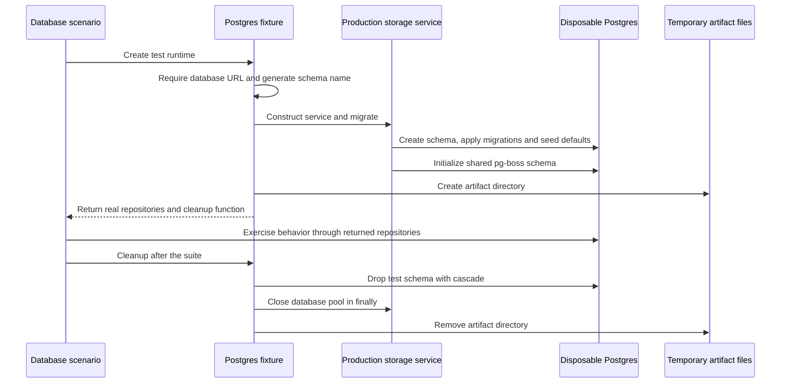
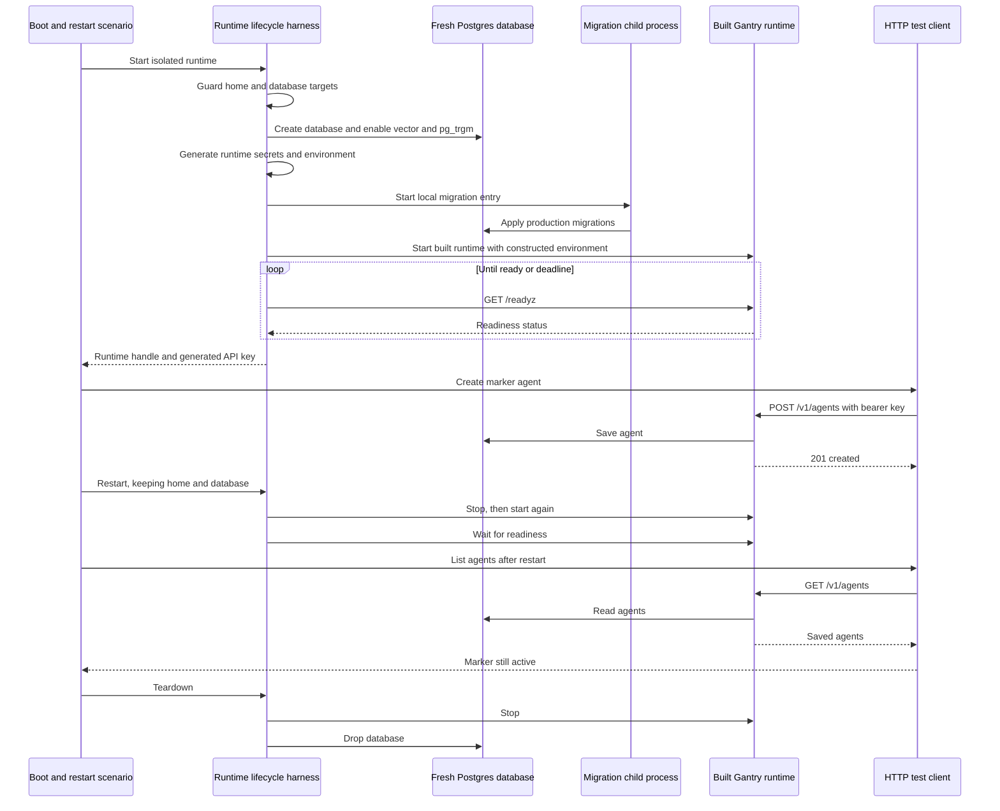

# Tests and test harnesses

## 1. What this area does

Gantry's tests check that a change still does what people expect before it reaches them. Small tests check individual decisions, while database tests check that messages, jobs and other records are really saved and coordinated. Shared test helpers create temporary settings, record pretend channel activity and supply controlled agent replies, so tests can repeat difficult situations without contacting customers. Larger tests start Gantry itself with a fresh home and database, then check its public API, restart behavior or competing workers. Pull requests run unit and integration checks; end-to-end checks run nightly, with an additional real-model turn when its credentials and prerequisites are available. These boundaries are defined by [the test scripts][package], [shared harnesses][pg-harness], [the packaged-runtime harness][agent-harness], [PR CI][ci] and [nightly CI][nightly].

## 2. Architecture diagram

The two diagrams contain 25 nodes in total. The source map beneath each identifies every node; arrows show calls or resource use, rather than separate deployed services for every box.

### Component tests and shared fixtures



| Diagram node                                                          | Current code                                                                                                                                                                                                                                                                                                                            |
| --------------------------------------------------------------------- | --------------------------------------------------------------------------------------------------------------------------------------------------------------------------------------------------------------------------------------------------------------------------------------------------------------------------------------- |
| Pull-request and nightly checks; npm test commands                    | [.github/workflows/ci.yml][ci], [.github/workflows/nightly-e2e.yml][nightly], [package.json][package].                                                                                                                                                                                                                                  |
| Vitest suite selection                                                | [vitest.shared.ts][vitest-shared] and the configuration table below; optional `VITEST_JUNIT` reporting includes the test file attribute.                                                                                                                                                                                                |
| Temporary test environment                                            | [apps/core/test/setup/runtime-env.ts][runtime-env] writes settings and sets `GANTRY_HOME`.                                                                                                                                                                                                                                              |
| Unit scenarios; integration scenarios; component end-to-end scenarios | [apps/core/test/unit/](../../../apps/core/test/unit/), [apps/core/test/integration/](../../../apps/core/test/integration/), [apps/core/test/e2e/](../../../apps/core/test/e2e/).                                                                                                                                                        |
| Controlled channels and agent replies                                 | [fake-channel.ts][fake-channel], [runtime-flow-harness.ts][flow-harness], [stateful-liveness-provider.ts][liveness].                                                                                                                                                                                                                    |
| Isolated database fixture; disposable Postgres schemas                | [postgres-integration-runtime.ts][pg-harness] creates a unique schema using [storage-service.ts][storage].                                                                                                                                                                                                                              |
| Temporary settings and artifact files                                 | [runtime-env.ts][runtime-env], [runtime-home-fixture.ts][home-fixture], and the artifact root in [postgres-integration-runtime.ts][pg-harness].                                                                                                                                                                                         |
| Real storage and runtime services                                     | [domain-repositories.postgres.ts][repositories], [canonical-ops-repo.postgres.ts][ops], [runtime-app.ts][runtime-app], [mcp-server-service.ts](../../../apps/core/src/application/mcp/mcp-server-service.ts) and [mcp-tool-proxy.ts](../../../apps/core/src/application/mcp/mcp-tool-proxy.ts); tests choose which owners to construct. |
| Local control-server fixture                                          | [control-http-server.ts][http-harness] calls the production [control/server/index.ts][control-server]; [observer-control-api.postgres.e2e.test.ts][observer-e2e] is an SDK round-trip consumer.                                                                                                                                         |
| Separate worker test processes                                        | [claim-protocol-two-process.postgres.e2e.test.ts][claims-e2e] spawns [worker-claim-process.ts][worker-fixture] using `tsx`.                                                                                                                                                                                                             |
| Local MCP test server                                                 | [agent-e2e/fixtures/mcp-test-server.ts][mcp-fixture], used by [mcp-client-loop.postgres.e2e.test.ts][mcp-e2e] and [mcp-capability-authoring.postgres.integration.test.ts][mcp-integration].                                                                                                                                             |

### Packaged-runtime tests



| Diagram node                                                                   | Current code                                                                                                                                                                                                                                                |
| ------------------------------------------------------------------------------ | ----------------------------------------------------------------------------------------------------------------------------------------------------------------------------------------------------------------------------------------------------------- |
| Packaged-runtime scenarios                                                     | [apps/core/test/agent-e2e/scenarios/](../../../apps/core/test/agent-e2e/scenarios/), selected by [vitest.agent-e2e.config.ts][agent-config].                                                                                                                |
| Runtime lifecycle harness; fresh Postgres database; fresh runtime home and log | [agent-e2e/harness/runtime-harness.ts][agent-harness] owns creation, startup, readiness, stop, restart and teardown.                                                                                                                                        |
| Local migration process                                                        | The harness spawns the built output of [apps/core/src/postgres-migrate.ts][migrate] before the first local runtime start.                                                                                                                                   |
| Built Gantry process or Docker container                                       | The harness starts the built output of [apps/core/src/index.ts][entry] or invokes Docker; [ops/docker/Dockerfile][dockerfile] and [ops/docker/entrypoint.sh][entrypoint] define the image startup.                                                          |
| HTTP API test client                                                           | [agent-e2e/harness/api-client.ts][api-client] uses authenticated `fetch` against the public control API.                                                                                                                                                    |
| Real model provider when enabled                                               | [haiku-turn.agent-e2e.test.ts][haiku] seeds a model credential through the control API and requests a real turn; [model-credential-fixture.ts][model-credential] gates credential availability. This arrow is conditional, not part of every packaged test. |
| Redacted evidence writer; scenario evidence and event files                    | [agent-e2e/harness/evidence.ts][evidence] writes scenario metadata and optional captured events, replacing supplied secrets and their JSON-escaped forms.                                                                                                   |

### Suite selection and execution

All these configurations call [makeVitestConfig in vitest.shared.ts][vitest-shared], which supplies source aliases, the shared environment setup and a 30-second default test timeout. Individual slower tests set larger timeouts. Commands below are the current [package.json scripts][package]; database-specific commands first run [require-postgres-integration-env.mjs][require-pg] to reject a missing or malformed Postgres URL.

| Command                                      | Selector and behavior                                                                                                                                                                                       |
| -------------------------------------------- | ----------------------------------------------------------------------------------------------------------------------------------------------------------------------------------------------------------- |
| `npm test`                                   | Builds contracts, then runs `test:unit` and `test:integration`; it does not invoke the required-Postgres or E2E commands.                                                                                   |
| `npm run test:unit`                          | [vitest.unit.config.ts](../../../vitest.unit.config.ts): core unit tests and contracts unit tests.                                                                                                          |
| `npm run test:integration`                   | [vitest.integration.config.ts](../../../vitest.integration.config.ts): all integration filenames; disables file parallelism when a test database URL is present. DB-gated suites can skip without that URL. |
| `npm run test:integration:postgres`          | [vitest.integration.postgres.config.ts][pg-config]: named Postgres integration tests, serially, with explicit exclusions.                                                                                   |
| `npm run test:integration:postgres:chaos`    | Same config, `GANTRY_POSTGRES_LANE=chaos`: only the fleet-capability chaos combination suite.                                                                                                               |
| `npm run test:integration:postgres:hot-path` | Same config, `GANTRY_POSTGRES_LANE=hot-path` and `GANTRY_POSTGRES_HOT_PATH=1`: Postgres explain suites.                                                                                                     |
| `npm run test:e2e`                           | [vitest.e2e.config.ts](../../../vitest.e2e.config.ts): component E2E tests excluding Postgres E2E filenames.                                                                                                |
| `npm run test:e2e:postgres`                  | [vitest.e2e.postgres.config.ts](../../../vitest.e2e.postgres.config.ts): named Postgres E2E tests, serially.                                                                                                |
| `npm run test:e2e:agent:hermetic`            | [vitest.agent-e2e.config.ts][agent-config]: all packaged-runtime scenario filenames, serially; credential-gated real-model files are also selected and may skip.                                            |
| `npm run test:e2e:agent:turn`                | Same config, narrowed to the Haiku scenario.                                                                                                                                                                |
| `npm run test:watch`                         | [vitest.config.ts](../../../vitest.config.ts): unit, contracts unit and integration selection, with V8 coverage configuration.                                                                              |

[PR CI][ci] runs `npm test`, then the required Postgres default and chaos lanes. [Nightly CI][nightly] runs ordinary E2E, Postgres E2E and packaged-runtime selection, followed by the supplementary Haiku command when its model key and Linux sandbox prerequisites exist. The hot-path command exists but neither workflow invokes it. The existing audit below records selection gaps; a successful command does not imply every database-backed or real-model scenario ran.

Other shared helpers serve narrower contracts: [response-latency-harness.ts][latency] supplies manual time, barriers, scripted frames and delivery observations; [response-latency-scenarios.ts][latency-scenarios] assembles those simulations; [response-latency-postgres.ts][latency-pg] counts database operations within an async measurement scope and restores its instrumentation; [postgres-explain.ts][explain] normalizes, redacts and walks query plans. [async-task-repository-contract.ts][async-contract] exercises concurrent admission and capacity against a supplied repository, and [test-skill-zip.ts][zip] builds archive fixtures. Simulated time and scripted replies are controlled evidence, not measurements of a real provider's speed.

## 3. Key flows

### A. Give a database test its own workspace, then remove it



1. A suite uses the database-availability flag to skip ordinary local execution without `GANTRY_TEST_DATABASE_URL`, or calls the fixture with the URL configured; the explicit database command instead requires it before Vitest starts ([postgres-integration-runtime.ts][pg-harness], [require-postgres-integration-env.mjs][require-pg]).
2. The fixture generates a sanitized, at-most-63-character schema name from a prefix, process ID, timestamp and random suffix. It constructs `PostgresStorageService` and awaits migration ([postgres-integration-runtime.ts][pg-harness]).
3. Production migration creates the schema, ensures `pgcrypto`, applies Drizzle migrations under a cross-instance advisory lock, seeds defaults and initializes pg-boss in its separate `pgboss` schema. Schema isolation therefore does not isolate every database-wide resource ([storage-service.ts][storage]).
4. The fixture builds real domain repositories, control/session services and a runtime-event exchange with a Postgres notifier; file bytes and skill bundles use a temporary local artifact root ([postgres-integration-runtime.ts][pg-harness]).
5. The test exercises its chosen boundary and requests cleanup. Cleanup drops the generated schema, closes the pool in `finally`, then removes the artifact root; it does not drop the enclosing database or the shared pg-boss schema ([postgres-integration-runtime.ts][pg-harness]).

### B. Boot the packaged product and verify an agent survives restart



1. The boot/restart scenario calls `startRuntimeHarness`. Before creating resources, the harness rejects the exact real workstation home and the database name `gantry`; it creates a fresh home and a random per-run database on the configured throwaway Postgres server ([boot-restart.agent-e2e.test.ts][boot-restart], [runtime-harness.ts][agent-harness]).
2. The harness enables `vector` and `pg_trgm`, generates a control API key, encryption key and IPC secret, and constructs the runtime environment from scratch. Parent model credentials are not automatically inherited; a scenario can explicitly pass environment additions ([runtime-harness.ts][agent-harness]).
3. In local mode it runs the built migration entry, then the built runtime entry. Docker mode starts the chosen image with a mounted home and host networking, and relies on the image entrypoint for migrations; the sequence above shows local mode ([runtime-harness.ts][agent-harness], [postgres-migrate.ts][migrate], [index.ts][entry], [entrypoint.sh][entrypoint]).
4. Startup polls `/readyz` every 500 ms until it returns HTTP 200 and `status: ready`; default deadlines are 90 seconds locally and 180 seconds for Docker. The scenario additionally checks health, migration records and bearer authentication ([runtime-harness.ts][agent-harness], [boot-restart.agent-e2e.test.ts][boot-restart]).
5. The HTTP client posts a marker agent. The production route validates authority and input, saves the agent through its repository and synchronizes settings from the projection for this request ([api-client.ts][api-client], [control/server/routes/agents.ts][agent-routes]).
6. `restart()` preserves the same home, database, API key and control port. The scenario lists agents again and checks that the same marker is active; this is a graceful restart proof, not an arbitrary crash-mid-turn proof ([runtime-harness.ts][agent-harness], [boot-restart.agent-e2e.test.ts][boot-restart]).
7. Teardown stops the process/container, drops the database and removes the home. The scenario checks both deletion outcomes and writes redacted evidence outside the disposable home ([boot-restart.agent-e2e.test.ts][boot-restart], [evidence.ts][evidence]).

### C. Two operating-system processes compete for one scheduled run

```mermaid
sequenceDiagram
    participant Test as Claim protocol scenario
    participant Fixture as Shared Postgres fixture
    participant A as Worker process A
    participant B as Worker process B
    participant DB as Shared test schema
    Test->>Fixture: Create and migrate isolated schema
    Test->>DB: Register two workers and save active manual job
    Test->>A: Spawn tsx worker with job and run identifiers
    Test->>B: Spawn tsx worker with the same identifiers
    par Independent pools and competing claims
        A->>DB: Claim run through production job operations
    and
        B->>DB: Claim run through production job operations
    end
    Note over A,B: Either process may win; A illustrates the winner
    DB-->>A: Lease token and fencing version
    DB-->>B: No claim, including after a terminal run
    A->>DB: Lease-fenced finalization of run, job and lease
    A-->>Test: JSON claimed and completed outcome
    B-->>Test: JSON refused outcome
    Test->>DB: Read completed run and confirm no active lease
    Test->>Fixture: Cleanup schema and artifacts
```

1. The parent suite creates an isolated schema, registers two worker instances and saves an active manual job. It does not pre-create the run: the production claim must create it ([claim-protocol-two-process.postgres.e2e.test.ts][claims-e2e]).
2. The parent spawns two real `tsx` processes with the same job, run and schema. Each child creates its own database pool and real repository bundle; a shared future timestamp encourages overlap without being necessary for correctness ([claim-protocol-two-process.postgres.e2e.test.ts][claims-e2e], [worker-claim-process.ts][worker-fixture]).
3. `claimDueJobRunStart` delegates through the runtime operations bundle and job service to the canonical job repository. Its claim helper locks the job row in a transaction, checks status and any existing run, inserts the run when needed, issues the lease and marks the job running ([canonical-ops-repo.postgres.ts][ops], [canonical-job-ops-service.ts][job-service], [canonical-job-repository.postgres.ts][job-repository], [canonical-job-claim.postgres.ts][job-claim]).
4. The winner calls `finalizeJobRunWithLease`; the repository checks the active lease fence, updates the run and job, and settles the lease in one transaction. The loser returns no claim even if it reaches the database after the winner has completed ([worker-claim-process.ts][worker-fixture], [canonical-job-repository.postgres.ts][job-repository], [canonical-job-claim.postgres.ts][job-claim]).
5. The parent drains child output, parses each outcome and checks exactly one claim, fencing version one, successful completion, a durable completed run and no active lease. This exercises scheduler storage coordination across processes; the child fixture does not boot a full job-worker service or call a model ([claim-protocol-two-process.postgres.e2e.test.ts][claims-e2e], [worker-claim-process.ts][worker-fixture]).

## 4. Data it owns

The harness owns disposable resources and observations, not a separate production test-data schema. Domain tables below remain owned by production storage; tests create temporary copies using the same migrations ([postgres-integration-runtime.ts][pg-harness], [runtime-harness.ts][agent-harness]).

| Data or resource                                                          | What it holds and its owner                                                                                                                                                                                                                                                                                                                                                                               |
| ------------------------------------------------------------------------- | --------------------------------------------------------------------------------------------------------------------------------------------------------------------------------------------------------------------------------------------------------------------------------------------------------------------------------------------------------------------------------------------------------- |
| Generated integration schema                                              | Real migrated Gantry tables and seeded defaults for one fixture; dropped by [postgres-integration-runtime.ts][pg-harness].                                                                                                                                                                                                                                                                                |
| Per-run packaged database                                                 | A fresh database, extensions, Gantry schema and pg-boss state for a packaged scenario; dropped by [runtime-harness.ts][agent-harness].                                                                                                                                                                                                                                                                    |
| `__drizzle_migrations`                                                    | Applied schema migration history; managed by [storage-service.ts][storage] and directly checked by [boot-restart.agent-e2e.test.ts][boot-restart].                                                                                                                                                                                                                                                        |
| `agents` in the test database                                             | Marker agents used for restart assertions; defined by [schema/agents.ts](../../../apps/core/src/adapters/storage/postgres/schema/agents.ts).                                                                                                                                                                                                                                                              |
| `jobs`, `agent_runs`, `worker_instances`, `run_leases` in the test schema | Seeded work, execution outcomes, worker identities and fenced ownership for competing-process tests; defined by [schema/jobs.ts](../../../apps/core/src/adapters/storage/postgres/schema/jobs.ts), [schema/runs.ts](../../../apps/core/src/adapters/storage/postgres/schema/runs.ts) and [schema/worker-coordination.ts](../../../apps/core/src/adapters/storage/postgres/schema/worker-coordination.ts). |
| `runtime_events` in the test database                                     | Durable activity and reply observations read through the API client; defined by [schema/events.ts](../../../apps/core/src/adapters/storage/postgres/schema/events.ts), consumed by [api-client.ts][api-client].                                                                                                                                                                                           |
| Shared test home                                                          | A PID-named temporary directory containing settings and runtime subdirectories; initialized by [runtime-env.ts][runtime-env], whose `afterAll` cleans browsers but does not remove this directory.                                                                                                                                                                                                        |
| Per-fixture settings and environment file                                 | Fresh settings plus optional environment entries; [runtime-home-fixture.ts][home-fixture] provides updates and recursive cleanup.                                                                                                                                                                                                                                                                         |
| Temporary artifact root                                                   | Local attachment bytes and skill bundles paired with real database metadata; created and removed by [postgres-integration-runtime.ts][pg-harness].                                                                                                                                                                                                                                                        |
| Packaged home and `runtime-harness.log`                                   | Runtime settings/state and captured process output; created by [runtime-harness.ts][agent-harness] and removed on normal teardown.                                                                                                                                                                                                                                                                        |
| Scenario evidence JSON and optional events JSON                           | Phase timings, selected skills, tool/decision/audit references and recorded events; [evidence.ts][evidence] writes redacted copies where its caller requests.                                                                                                                                                                                                                                             |
| In-memory fake state                                                      | Messages, streaming chunks, questions, approval requests, cards, reactions, typing history and injected failures; [fake-channel.ts][fake-channel], [runtime-flow-harness.ts][flow-harness], [stateful-liveness-provider.ts][liveness].                                                                                                                                                                    |
| CI command and debug logs                                                 | Captured test output and failure process snapshots uploaded by [ci.yml][ci] and [nightly-e2e.yml][nightly].                                                                                                                                                                                                                                                                                               |

## 5. How it scales and fails

### Processes and roles

Vitest executes the harness code in its test workers; those workers are not Gantry deployment roles. Component tests can construct only the services they need, start the real HTTP server in the same test process, or spawn explicit fixture children. Packaged tests start another Gantry process or container, and local startup adds a migration child first ([vitest.shared.ts][vitest-shared], [control-http-server.ts][http-harness], [worker-claim-process.ts][worker-fixture], [runtime-harness.ts][agent-harness]).

The packaged harness does not inherit the parent's `GANTRY_PROCESS_ROLE`: its constructed environment defaults to `all` unless the scenario supplies an override. Actual runtime boot resolves the deployment variable once and derives its capabilities; the control-server fixture can also explicitly pass a role and route profile for component tests ([runtime-harness.ts][agent-harness], [app/index.ts][app-entry], [role-resolver.ts][role-resolver], [control-http-server.ts][http-harness]).

| Gantry role   | Production responsibilities exercised when a test boots that role                                                                   |
| ------------- | ----------------------------------------------------------------------------------------------------------------------------------- |
| `all`         | Full control API and settings writes, provider inbound, live execution, job execution, toolchain bakes and worker registration.     |
| `control`     | Full control API and settings writes; no live/job execution, provider inbound, bakes or worker registration.                        |
| `live-worker` | Provider inbound and live execution, operational/read-only API and worker registration; no job execution, settings writes or bakes. |
| `job-worker`  | Job execution, bakes, operational/read-only API and worker registration; no live execution, provider inbound or settings writes.    |

This matrix comes from [role-capabilities.ts][role-capabilities]. Passing a role to an HTTP fixture configures that server surface; it does not itself launch a complete worker service.

Database integration and Postgres/packaged E2E selectors serialize test files because migration and other shared database resources can contend. Unique integration schemas separate Gantry rows; packaged tests instead get a whole database per harness. The two-process claim flow intentionally introduces concurrency inside a serially selected suite. Advisory migration locks serialize concurrent migrators and release automatically when their database session dies ([vitest.integration.config.ts](../../../vitest.integration.config.ts), [vitest.integration.postgres.config.ts][pg-config], [vitest.e2e.postgres.config.ts](../../../vitest.e2e.postgres.config.ts), [vitest.agent-e2e.config.ts][agent-config], [storage-service.ts][storage], [claims-e2e][claims-e2e]).

### Memory, persistence and failure boundaries

- **Controlled observations live in memory.** Fake messages, approval decisions, clock markers, provider histories and operation counters disappear with the Vitest process. The liveness fake can explicitly snapshot progress state to exercise reconstruction; that is a simulation of provider state, not Postgres persistence ([fake-channel.ts][fake-channel], [flow-harness][flow-harness], [stateful-liveness-provider.ts][liveness], [response-latency-harness.ts][latency]).
- **Product records live in real Postgres.** The fixture uses real repositories, transactions and runtime-event notification; API polling reads durable events by cursor. The client treats HTTP 202 as acceptance and waits separately for terminal events or a durable reply; a live turn may remain open after replying ([postgres-integration-runtime.ts][pg-harness], [api-client.ts][api-client]).
- **Restart preserves only the chosen resources.** Packaged `restart()` keeps the database and home, while replacing the local runtime process or restarting the Docker container. Local restart skips the initial migration subprocess. The boot/restart marker proves saved agent state survives that path ([runtime-harness.ts][agent-harness], [boot-restart.agent-e2e.test.ts][boot-restart]).
- **Lease recovery is a separate contract.** Another case in the claim-protocol suite explicitly expires a live-run lease, acquires a higher fencing version and verifies that the prior owner cannot settle it. That case exercises real durable lease rules directly; it is not evidence that the harness automatically resumes a crashed test ([claim-protocol-two-process.postgres.e2e.test.ts][claims-e2e], [worker-coordination-lease.postgres.ts](../../../apps/core/src/adapters/storage/postgres/repositories/worker-coordination-lease.postgres.ts)).
- **Startup fails visibly.** Missing built output, migration failure, child exit or readiness deadline rejects packaged startup. Its startup failure handler stops the runtime, removes the container when applicable, attempts to drop the database, removes the home and includes a log tail in the error ([runtime-harness.ts][agent-harness]).
- **Normal stop is bounded; abrupt termination can leave resources.** The local harness sends SIGTERM and sends SIGKILL after ten seconds if necessary; Docker stop uses a ten-second grace period. Normal teardown removes resources, while `KEEP_EVIDENCE=1` with a failed scenario retains its home and database after stopping. A killed test worker cannot be assumed to run `afterAll`, so disposable resources may remain; the harness has no startup scavenger ([runtime-harness.ts][agent-harness], [boot-restart.agent-e2e.test.ts][boot-restart]).
- **A skip is not a pass on the underlying behavior.** Ordinary DB-gated suites can skip without a URL; explicit Postgres commands reject its absence. Real-model scenarios require a separate credential, and the nightly Haiku step can skip for missing sandbox tools or key. Provider quota failures are identified explicitly in the Haiku failure path ([require-postgres-integration-env.mjs][require-pg], [model-credential-fixture.ts][model-credential], [haiku-turn.agent-e2e.test.ts][haiku], [nightly-e2e.yml][nightly]).
- **Failure evidence has two paths.** CI wraps each test command with a 900-second timeout and captures output; packaged scenarios can also write redacted JSON outside the runtime home. Nightly currently uploads only its failure logs, not that JSON, as recorded below ([ci.yml][ci], [nightly-e2e.yml][nightly], [evidence.ts][evidence]).

## 6. Video script outline

These seven beats target a 60–90 second explainer; their code anchors are the diagrams and flows above.

1. Every Gantry change faces repeatable checks before it reaches people.
2. Small tests check decisions, while real database tests check that work is saved and shared correctly.
3. Test helpers create temporary homes and record pretend channel activity so difficult cases can be replayed safely.
4. Larger checks start the packaged product and speak to the same public API an outside application uses.
5. A restart check brings Gantry back with the same database and confirms its saved agent is still there.
6. Two separate workers race for one job, and the database lets just one own and finish that run.
7. Fast checks run on pull requests, larger journeys run nightly, and logs explain failures while normal cleanup removes disposable state.

## 7. Duplication and simplification

### (a) Existing audit findings

The owner-supplied [tests and harnesses audit][audit] is an external working artifact. Its existing finding titles are linked here without repeating the findings:

- [Database tests stranded outside PR checks][audit].
- [“Hermetic” selection strands a real-model scenario][audit].
- [Authentication security checks assert source spelling][audit].
- [Backlog test preserves a production-only-for-tests wrapper][audit].
- [Two ZIP fixture encoders have drifted][audit].
- [Eight integration suites hand-roll schema lifecycle][audit].
- [Digest settlement is replayed across layers][audit].

### (b) New observations

1. **Redacted scenario evidence is disconnected from nightly artifacts — UX / parallel paths.** Both writers choose the environment-configured directory or the same temporary default: `apps/core/test/agent-e2e/scenarios/boot-restart.agent-e2e.test.ts:56` and `apps/core/test/agent-e2e/scenarios/haiku-turn.agent-e2e.test.ts:117`. The shared writer creates redacted metadata and optional events at `apps/core/test/agent-e2e/harness/evidence.ts:66`, but the only nightly upload at `.github/workflows/nightly-e2e.yml:146` selects command/debug logs, and only when the earlier E2E step failed. Evidence JSON is therefore unavailable as a workflow artifact on success or failure, and a supplementary Haiku-only failure does not trigger that log upload when the earlier step succeeded. **Survive:** the shared redacted writer and command logs; configure one evidence directory in nightly and upload it on completion, with failure logs covering either test step. **Size:** fix. This is verified routing in code, not an observed CI failure.
2. **Two packaged scenarios repeat the same boot proof — duplication.** `apps/core/test/agent-e2e/scenarios/runtime-boot.agent-e2e.test.ts:21` and `apps/core/test/agent-e2e/scenarios/boot-restart.agent-e2e.test.ts:65` each create a fresh packaged runtime, check health/readiness and query the migration journal. Both are selected by `vitest.agent-e2e.config.ts:7`; the runtime-boot case uses the same harness defaults, including the same scopes explicitly supplied by boot/restart. **Survive:** the boot/restart scenario's boot, authentication, saved-agent restart and cleanup assertions; remove the standalone repeat after confirming no separate workflow selects it. Current workflow commands select the shared glob, and repository history added the standalone boot case after the boot/restart scenario already existed. **Size:** fix. Consolidation would remove one unnecessary packaged startup without removing a distinct observed contract.

[package]: ../../../package.json
[ci]: ../../../.github/workflows/ci.yml
[nightly]: ../../../.github/workflows/nightly-e2e.yml
[vitest-shared]: ../../../vitest.shared.ts
[pg-config]: ../../../vitest.integration.postgres.config.ts
[agent-config]: ../../../vitest.agent-e2e.config.ts
[require-pg]: ../../../scripts/require-postgres-integration-env.mjs
[runtime-env]: ../../../apps/core/test/setup/runtime-env.ts
[pg-harness]: ../../../apps/core/test/harness/postgres-integration-runtime.ts
[home-fixture]: ../../../apps/core/test/harness/runtime-home-fixture.ts
[http-harness]: ../../../apps/core/test/harness/control-http-server.ts
[fake-channel]: ../../../apps/core/test/harness/fake-channel.ts
[flow-harness]: ../../../apps/core/test/harness/runtime-flow-harness.ts
[liveness]: ../../../apps/core/test/harness/stateful-liveness-provider.ts
[latency]: ../../../apps/core/test/harness/response-latency-harness.ts
[latency-scenarios]: ../../../apps/core/test/harness/response-latency-scenarios.ts
[latency-pg]: ../../../apps/core/test/harness/response-latency-postgres.ts
[explain]: ../../../apps/core/test/harness/postgres-explain.ts
[async-contract]: ../../../apps/core/test/harness/async-task-repository-contract.ts
[zip]: ../../../apps/core/test/harness/test-skill-zip.ts
[agent-harness]: ../../../apps/core/test/agent-e2e/harness/runtime-harness.ts
[api-client]: ../../../apps/core/test/agent-e2e/harness/api-client.ts
[evidence]: ../../../apps/core/test/agent-e2e/harness/evidence.ts
[model-credential]: ../../../apps/core/test/agent-e2e/fixtures/model-credential-fixture.ts
[mcp-fixture]: ../../../apps/core/test/agent-e2e/fixtures/mcp-test-server.ts
[mcp-e2e]: ../../../apps/core/test/e2e/mcp-client-loop.postgres.e2e.test.ts
[mcp-integration]: ../../../apps/core/test/integration/mcp-capability-authoring.postgres.integration.test.ts
[haiku]: ../../../apps/core/test/agent-e2e/scenarios/haiku-turn.agent-e2e.test.ts
[boot-restart]: ../../../apps/core/test/agent-e2e/scenarios/boot-restart.agent-e2e.test.ts
[observer-e2e]: ../../../apps/core/test/e2e/observer-control-api.postgres.e2e.test.ts
[claims-e2e]: ../../../apps/core/test/e2e/claim-protocol-two-process.postgres.e2e.test.ts
[worker-fixture]: ../../../apps/core/test/e2e/fixtures/worker-claim-process.ts
[storage]: ../../../apps/core/src/adapters/storage/postgres/storage-service.ts
[repositories]: ../../../apps/core/src/adapters/storage/postgres/repositories/domain-repositories.postgres.ts
[ops]: ../../../apps/core/src/adapters/storage/postgres/schema/canonical-ops-repo.postgres.ts
[job-service]: ../../../apps/core/src/adapters/storage/postgres/services/canonical-job-ops-service.ts
[job-repository]: ../../../apps/core/src/adapters/storage/postgres/repositories/canonical-job-repository.postgres.ts
[job-claim]: ../../../apps/core/src/adapters/storage/postgres/repositories/canonical-job-claim.postgres.ts
[runtime-app]: ../../../apps/core/src/app/bootstrap/runtime-app.ts
[control-server]: ../../../apps/core/src/control/server/index.ts
[agent-routes]: ../../../apps/core/src/control/server/routes/agents.ts
[migrate]: ../../../apps/core/src/postgres-migrate.ts
[entry]: ../../../apps/core/src/index.ts
[app-entry]: ../../../apps/core/src/app/index.ts
[role-resolver]: ../../../apps/core/src/app/bootstrap/roles/role-resolver.ts
[role-capabilities]: ../../../apps/core/src/app/bootstrap/roles/role-capabilities.ts
[dockerfile]: ../../../ops/docker/Dockerfile
[entrypoint]: ../../../ops/docker/entrypoint.sh
[audit]: ../audits/2026-10-02-area-audit/14-tests-harness.md
