# Boondi + Gantry Architect Handoff

Date: 2026-06-18

Audience: an architect taking over Gantry/Boondi with no prior mental model.

Source of truth for this document: current code in this checkout plus the live
verification evidence in `docs/architecture/customer-worker-flow-live-verification-plan.md`.
This document is intentionally reason-based: each component is described by what
it does, why it earns its place, what breaks without it, and where to inspect it.

## 0. Guided Reading Path

This document is written like a guided system walk, not like an API dictionary.
Read it in this order:

1. Start with the customer story.
2. Follow one incoming WhatsApp message through the runtime.
3. Learn which component owns each decision.
4. Learn what evidence proves the component worked.
5. Learn the failure patterns and the exact place to debug them.

That is the correct architect mental model. Do not start from "which file should
I edit?" Start from "where did the message go wrong?"

### 0.1 The Layman Picture

Imagine Boondi support as a service desk.

The customer only sees the front desk. They ask a question, get a reply, ask a
follow-up, and expect the same conversation to continue naturally.

Behind that simple chat, Gantry runs the operations room:

| Real System Part | Layman Picture | What It Means |
| --- | --- | --- |
| Customer WhatsApp message | Customer walks to the front desk | A new inbound provider event arrives |
| Interakt webhook | Doorbell and visitor register | Gantry verifies the message came from the channel and records it |
| Postgres | Shared logbook | Every message, owner, cursor, trace, and runtime row must be inspectable |
| Route projection | Desk assignment board | This WhatsApp conversation belongs to Boondi support |
| Ownership lease | "This desk is serving this customer" ticket | Exactly one core may process that customer's pending work |
| Cursor | Bookmark in the customer file | Gantry knows which messages have already been consumed |
| Warm worker | Staff member already logged in and ready | A runner can start replying faster |
| Bound worker | Staff member temporarily assigned to one customer | Follow-ups can reuse context while idle timeout has not expired |
| MCP tool | Back-office system | Boondi asks Shopify/CRM/etc. for facts through controlled tool calls |
| Outbound fence | Exit guard before a reply leaves | A stale or wrong owner cannot send a customer-visible reply |
| Latency trace | CCTV timeline | Shows exactly where reply time was spent |
| Admin panel | Operations dashboard | Lets the developer see runtime health, worker state, and traces |

This picture matters because it prevents the common wrong fix. If a reply is
missing, do not jump straight to prompts. The message may have failed at the
doorbell, logbook, assignment board, ownership ticket, cursor, runner, MCP, exit
guard, or trace layer.

### 0.2 One Message, From Customer To Reply

This is the core story. Everything else in the document is just a deeper
explanation of one of these boxes.

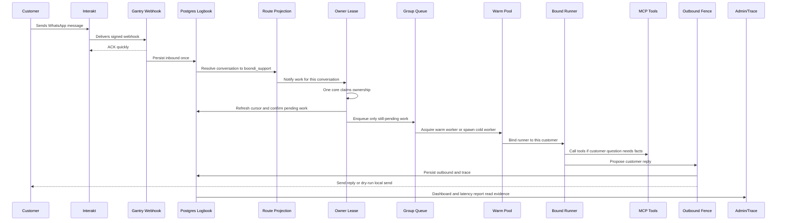

The important point: Gantry does not "just call an LLM." It first establishes
identity, persistence, route, ownership, cursor position, execution capacity,
tool capability, outbound safety, and observability.

### 0.3 Why The System Is Split This Way

The split is intentional:

- Gantry is the generic runtime.
- Boondi is one customer-support agent running on that runtime.

If Gantry learns too much about Bombay Sweet Shop behavior, every future customer
will inherit Boondi-specific assumptions. That would make Gantry a custom Boondi
app instead of a reusable runtime.

If Boondi owns runtime mechanics, customer behavior files would start deciding
leases, cursors, concurrency, SDK process lifecycle, and outbound fencing. That
would make production safety depend on prompt/application behavior instead of
deterministic runtime code.

Correct architecture:

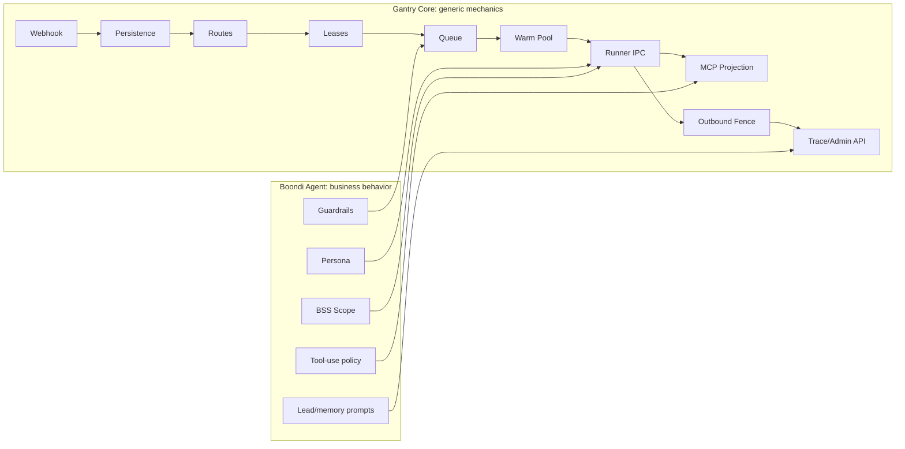

### 0.4 Section-By-Section Map

Use this table as the table of contents with intent. Each later section answers
a specific architect question.

| Section | Architect Question It Answers | Why You Need It |
| --- | --- | --- |
| `1. Overview` | What is Gantry, what is Boondi, and where is the boundary? | Prevents editing the wrong layer |
| `2. Explore The System` | What happens in the happy path? | Gives the first map before code details |
| `3. Deep Dive` | How does each runtime mechanism actually work? | Lets you debug without guessing |
| `4. Nitty Gritties` | What do dashboard fields, settings, traces, and edge states mean? | Removes ambiguity from production operations |
| `5. Production Debug Runbooks` | What should I inspect when something breaks? | Turns incidents into evidence-driven checks |
| `6. Clarifying Questions And Answers` | What are the common confusing points? | Settles repeated questions in one place |
| `7. Production Readiness Checklist` | What must be true before calling the platform healthy? | Gives a release gate |
| `8. Architect's Operating Principle` | What habit keeps fixes correct? | Forces full-path reasoning |
| `9. Guided Production Reasoning Paths` | How do I walk from symptom to root cause? | Gives practical decision trees |

### 0.5 Evidence Ladder

When there is a production issue, trust evidence in this order:

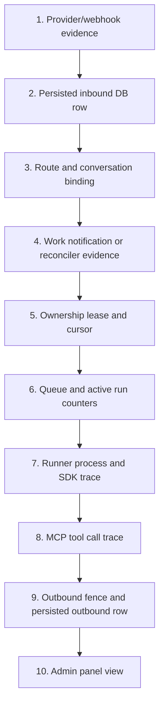

The admin panel is useful, but it is not the first source of truth. It is a
window over runtime/API state. If it looks stale, inspect the underlying API and
database before assuming the runtime itself is wrong.

### 0.6 The Three Non-Negotiable Customer Guarantees

Everything in this architecture is earning one of these guarantees:

1. Exactly one reply per customer message.
2. The right reply goes to the right customer.
3. Follow-ups keep context while the session is still alive.

If a mechanism does not support one of those guarantees, it should be questioned.
If a proposed simplification weakens one of those guarantees, it is not a
simplification. It is a production bug waiting to happen.

## 1. Overview

### 1.1 One-Sentence Mental Model

Boondi is the Bombay Sweet Shop customer-support agent; Gantry is the generic
runtime that receives WhatsApp messages, persists them, routes them to the right
agent, owns worker processes, protects multi-core concurrency, calls the
Anthropic SDK and MCP tools, sends replies, and records latency/debug evidence.

### 1.2 What Gantry Owns

Gantry owns runtime mechanics:

- channel ingress and egress
- Interakt webhook verification
- message persistence and dedupe
- conversation route projection
- queueing
- multi-core ownership leases
- warm worker pool
- Anthropic SDK runner process lifecycle
- MCP capability projection and tool tracing
- outbound safety and ownership fence
- latency trace persistence
- runtime/admin API data
- stale worker exclusion

Gantry must stay provider-neutral and agent-neutral. It should not know Bombay
Sweet Shop business rules.

Code anchors:

- `apps/core/src/control/server/routes/interakt-webhook.ts`
- `apps/core/src/channels/interakt/channel.ts`
- `apps/core/src/app/bootstrap/channel-persistence-handlers.ts`
- `apps/core/src/runtime/group-processing.ts`
- `apps/core/src/runtime/message-loop.ts`
- `apps/core/src/runtime/conversation-work-dispatcher.ts`
- `apps/core/src/runtime/conversation-work-reconciler.ts`
- `apps/core/src/runtime/warm-pool-manager.ts`
- `apps/core/src/runtime/reply-trace.ts`

### 1.3 What Boondi Owns

Boondi owns customer behavior:

- Bombay Sweet Shop persona
- customer-facing tone
- business scope
- Shopify/CRM tool-use policy
- deterministic and inline guardrail content
- agent-owned commands
- memory extraction prompt and lead taxonomy

Code anchors:

- `agents/boondi_support/CLAUDE.md`
- `agents/boondi_support/SOUL.md`
- `agents/boondi_support/AGENTS.md`
- `agents/boondi_support/guardrails/guardrail.ts`
- `agents/boondi_support/commands/extract-leads-queries.ts`

### 1.4 Boundary Rule

If the behavior is about "how a BSS customer should be answered", it belongs in
Boondi-owned files.

If the behavior is about "how any agent receives, processes, and replies to a
message safely", it belongs in Gantry core.

This boundary is not cosmetic. It keeps Gantry reusable and prevents every new
customer deployment from becoming a fork of Gantry.

### 1.5 The Customer's View

The customer only sees a normal WhatsApp chat:

1. They send a message.
2. Boondi replies.
3. Follow-ups work.
4. Context is remembered while the session is alive.
5. There are no duplicate replies.
6. There is no leakage from another customer's chat.

The customer never needs to know about cores, workers, leases, queues, prewarm,
MCPs, Shopify, CRM, prompt cache, or latency sections.

### 1.6 The Developer's View

The developer must reason about:

- which channel received the message
- which conversation id it became
- whether it was persisted or deduped
- which agent route owns it
- which core claimed it
- whether it used a warm or cold runner
- whether follow-ups went to the same bound runner
- whether MCP tools were called
- whether the outbound was fenced and persisted
- whether the trace explains latency
- whether dashboard counts match runtime truth

## 2. Explore The System

This section gives the first-pass map. The deep dive later explains each part.

### 2.1 Main Runtime Path

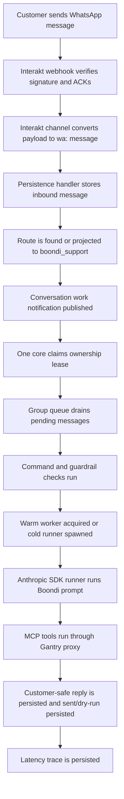

### 2.2 Important Identifiers

| Identifier | Example | Meaning | Why It Exists |
| --- | --- | --- | --- |
| Interakt phone | `+910000000001` | Customer phone from provider payload | Provider input |
| Gantry conversation JID | `wa:0000000001` | Runtime conversation key | One stable key for route, queue, lease, cursor, memory |
| Conversation id in APIs/docs | `conversation:wa:0000000001` | App-facing label | Human-readable wrapper around JID |
| Provider message id | `phase10-...-4` | Inbound id from provider/test | Dedupes provider retries |
| Persisted message id | `message:wa:...:outbound:...` | DB primary key style | Joins transcript and trace |
| Run handle | generated id | Runner-process identity | Ties IPC/MCP/trace records to one run |
| Lease version | integer | Ownership generation | Blocks stale outbound sends |

### 2.3 Primary Data Planes

There are four planes:

1. Message plane
   - inbound and outbound messages
   - transcript
   - dedupe

2. Work plane
   - notifications
   - queue
   - pending work
   - active runs

3. Ownership plane
   - per-conversation lease
   - lease version
   - heartbeat
   - takeover after expiry

4. Observability plane
   - worker inventory
   - latency traces
   - payload traces when enabled
   - dashboard/admin API

Keeping these separate is important. For example, a message can be persisted
while work notification fails; the reconciler exists to bridge that gap.

### 2.4 Current Verified Runtime Shape

The local verification plan proved:

- one-core and two-core flows
- warm-pool off/on behavior
- follow-up routing
- MCP smoke through Shopify and CRM
- stale runtime exclusion
- core death recovery
- repeated-flow soak
- final two-core load with eight customers

The latest post-fix load evidence used:

- two cores
- eight synthetic customers
- four reply-gated turns per customer
- `maxMessageRuns=6`
- final counts of exactly four inbound, four outbound, and four traces per
  customer
- zero active or pending work after settle

Evidence anchor:

- `docs/architecture/customer-worker-flow-live-verification-plan.md`

## 3. Deep Dive

### 3.1 Interakt Webhook

What it does:

- receives `POST /v1/channels/interakt/webhook`
- reads the raw body
- verifies the Interakt signature
- returns HTTP 200 quickly
- parses and processes the message after ACK

Code anchors:

- `apps/core/src/control/server/routes/interakt-webhook.ts`
- `apps/core/src/channels/interakt/interakt-webhook-signature.ts`
- `apps/core/src/channels/interakt/channel.ts`

Why it earns its place:

Interakt expects a fast ACK. If Gantry waits for LLM work before ACK, the
provider can treat the webhook as failed.

What breaks without it:

- inbound reliability drops
- provider retry/disable behavior can trigger
- customer messages may not enter the runtime

Architectural note:

The webhook route does not use Gantry control API keys. Its auth is the HMAC
signature on the raw Interakt body.

### 3.2 Interakt Channel Adapter

What it does:

- accepts parsed Interakt webhook payloads
- ignores non-customer messages
- ignores non-text messages in current phase
- converts phone into `wa:<digits>`
- stores session-window information for outbound WhatsApp send eligibility
- builds Gantry `NewMessage`

Code anchor:

- `apps/core/src/channels/interakt/channel.ts`

Why it earns its place:

Provider payloads are not Gantry concepts. The adapter converts provider-specific
shape into runtime-neutral message shape.

What breaks without it:

- Gantry core would need to understand Interakt-specific fields
- provider-specific logic would leak into runtime
- outbound WhatsApp policy checks would be scattered

### 3.3 Conversation Route Projection

What it does:

- decides which agent owns a direct WhatsApp customer
- for Boondi, projects new Interakt DMs to `boondi_support` when
  `providers.interakt.default_agent` is set
- supports explicit `wa:*` templates

Code anchor:

- `apps/core/src/app/bootstrap/channel-persistence-handlers.ts`

Why it earns its place:

A new WhatsApp customer is not known ahead of time. The runtime must safely map
that customer to an agent before processing.

What breaks without it:

- new customers get dropped
- or worse, new customers inherit the wrong route

Architectural rule:

For Boondi-only traffic, route Interakt default agent to `boondi_support`. Do
not keep a Gantry default/main worker in the path unless you intentionally need
that separate route.

### 3.4 Message Persistence And Dedupe

What it does:

- persists inbound messages before processing
- persists outbound replies after generation
- detects duplicate provider message ids
- does not wake work for duplicate inbound messages

Code anchor:

- `apps/core/src/app/bootstrap/channel-persistence-handlers.ts`

Why it earns its place:

Persistence is the durable truth. Queue state is not enough because queues are
process-local and can disappear on restart.

What breaks without it:

- restarts lose messages
- provider retries produce duplicate replies
- admin transcript cannot be trusted
- latency traces cannot join to replies

### 3.5 Conversation Work Notification

What it does:

- publishes a Postgres notification after a new inbound is persisted
- includes conversation id, thread id, message id, and owner lease info
- wakes runtime workers without waiting for polling

Code anchors:

- `apps/core/src/runtime/conversation-work-notification-publisher.ts`
- `apps/core/src/adapters/storage/postgres/conversation-work-notifier.postgres.ts`
- `apps/core/src/runtime/conversation-work-dispatcher.ts`

Why it earns its place:

In two-core mode, any core can receive notification. Work must be visible across
processes.

What breaks without it:

- latency increases
- persisted messages can wait for recovery
- active/pending dashboard state becomes harder to reason about

### 3.6 Conversation Ownership Lease

What it does:

- stores one current owner per conversation/thread
- lets a core claim ownership
- refreshes ownership with heartbeat
- allows takeover when owner expires or drains
- increments lease version on takeover

Code anchors:

- `apps/core/src/domain/ports/conversation-owner-lease-repository.ts`
- `apps/core/src/adapters/storage/postgres/repositories/conversation-owner-lease-repository.postgres.ts`
- `apps/core/src/runtime/conversation-work-claim-gate.ts`

Why it earns its place:

Two cores can observe the same persisted inbound. Only one core may process and
reply. A local in-memory lock cannot solve this because the cores are separate
processes.

What breaks without it:

- duplicate replies
- stale core sends
- cross-core races
- unclear dashboard truth

Core rule:

Message processing must claim ownership before processing, then refresh cursor
and re-check whether there is still pending work.

This is not redundant. It is the production fix for delayed duplicate replies.

### 3.7 Cursor

What it does:

- records the latest inbound message accepted by the agent path
- prevents re-reading already accepted messages
- is merged from durable state before reads/saves in multi-core mode

Code anchor:

- `apps/core/src/app/bootstrap/runtime-app.ts`

Why it earns its place:

Lease says who may work. Cursor says what work remains. Both are required.

What breaks without it:

- old inbound messages replay
- delayed recovery can reprocess a message already answered
- one core can clobber another core's newer position

Production lesson:

Ownership without cursor is not enough. Cursor without ownership is not enough.

### 3.8 Group Queue

What it does:

- serializes work per conversation/thread
- tracks active message runs
- routes follow-ups into active runners when possible
- starts a new processing path when no active runner can accept the message

Code anchors:

- `apps/core/src/runtime/group-processing.ts`
- `apps/core/src/runtime/message-loop.ts`

Why it earns its place:

Customer chats are ordered conversations. The same customer can send follow-ups
while Boondi is still working. The runtime must keep order and route follow-ups
to the right active session.

What breaks without it:

- follow-ups can race
- context is lost
- active runner may not receive continuation
- customer sees hangs or irrelevant replies

### 3.9 Pre-Agent Commands

What they do:

- inspect inbound messages before main agent run
- handle slash/operator commands
- can send command replies without spawning Boondi LLM

Boondi command example:

- `agents/boondi_support/commands/extract-leads-queries.ts`

Why they earn their place:

Operator/admin flows are different from customer chat. A command should not be
treated as ordinary customer intent.

What breaks without it:

- commands may go to the customer-facing LLM
- operator workflows would be mixed into normal customer responses

### 3.10 Boondi Guardrail

What it does:

- deterministic checks for hard obvious cases
- direct customer response for empty/off-topic/internal-probe cases
- inline scope block for unresolved cases
- lets complex valid BSS conversations proceed to main Boondi LLM

Code anchor:

- `agents/boondi_support/guardrails/guardrail.ts`

Why it earns its place:

It protects the customer-facing agent without overblocking. The deterministic
stage is intentionally boring; the LLM handles nuanced BSS context.

What breaks without it:

- internal prompt/tool questions can leak into agent work
- off-topic messages burn tokens
- overly aggressive deterministic logic blocks valid BSS follow-ups

### 3.11 Boondi Prompt Stack

What it does:

- defines Boondi identity and tone
- defines customer-safe reply style
- defines Shopify and CRM tool routing
- defines privacy behavior
- defines product/order/gifting behavior

Code anchors:

- `agents/boondi_support/CLAUDE.md`
- `agents/boondi_support/SOUL.md`
- `agents/boondi_support/AGENTS.md`

Why it earns its place:

This is business behavior. Keeping it outside Gantry means Gantry can serve
other agents without inheriting BSS rules.

What breaks if moved into Gantry:

- Gantry becomes Boondi-specific
- future deployments inherit wrong business behavior
- runtime tests become mixed with business semantics

### 3.12 Warm Pool

What it does:

- keeps generic Anthropic SDK runner processes already booted
- replenishes generic workers after one is acquired
- optionally runs cache-prewarm preparation
- exposes inventory for dashboard/API

Code anchors:

- `apps/core/src/runtime/warm-pool-manager.ts`
- `apps/core/src/adapters/llm/anthropic-claude-agent/warm-pool.ts`
- `apps/core/src/runtime/agent-spawn.ts`

Why it earns its place:

Anthropic SDK startup is expensive. A warm worker removes startup from the first
customer reply when available.

What breaks without it:

- first replies pay SDK startup every time
- latency is worse, though correctness can still work through cold spawn

Important distinction:

Warm pool is a latency optimization. It must not be the only correctness path.
Cold fallback must remain valid.

### 3.13 Generic Worker

What it is:

A generic worker is an Anthropic SDK runner process booted without a customer.
It has the agent/system shape ready but is not yet bound to a conversation.

Why it earns its place:

It gives low startup latency without committing to a customer too early.

What breaks without it:

Every first reply starts cold.

Dashboard meaning:

- `genericAvailable`: ready generic workers
- `genericStarting`: generic workers being booted
- `availableTarget`: desired generic warm worker count

### 3.14 Bound Worker

What it is:

A bound worker is a generic worker that has been assigned to a specific
conversation.

Binding includes:

- chat JID
- thread id
- first message
- memory block
- guardrail preface
- run handle
- IPC auth tokens
- response verification key

Code anchors:

- `apps/core/src/runtime/warm-bind-delivery.ts`
- `apps/core/src/adapters/llm/anthropic-claude-agent/warm-pool.ts`

Why it earns its place:

Generic workers cannot safely call tools or reply until they know the customer.
Binding supplies the missing customer identity and routing information.

What breaks without it:

- wrong customer context
- wrong MCP caller identity
- unsafe memory/user routing
- follow-ups cannot attach to the right live runner

Dashboard meaning:

- `boundActive`: workers currently bound to conversations

### 3.15 Idle Timeout

What it does:

- keeps a bound runner alive after it becomes idle
- closes/stops it after `runtime.runner.idle_timeout_ms`
- allows same-customer follow-ups to reuse the live context during that window

Code anchor:

- `apps/core/src/runtime/group-processing.ts`

Why it earns its place:

Customers naturally send follow-ups. Killing the runner immediately would force
every follow-up into a new session and lose live context.

What breaks without it:

- follow-ups become cold starts
- provider session continuity is weaker
- user sees "new session" behavior too often

Important clarification:

The timer starts after the runner becomes idle after replying. It is not
measured from the customer's original inbound timestamp.

### 3.16 Cache Prewarm

What it does:

- optionally prepares the provider prompt-cache shape before customer traffic
  with a throwaway synthetic Agent SDK query
- is controlled by `runtime.warm_pool.cache_prewarm_enabled`
- concurrency is controlled by `runtime.warm_pool.cache_prewarm_concurrency`
- runs once per `cacheShapeKey`, not once per warm worker
- refreshes a successful active shape after the prompt-cache TTL, currently
  45 minutes by default, by running one more throwaway synthetic query for that
  shape
- destroys the synthetic runner before customer traffic so the customer session
  is never polluted by the prewarm prompt

Code anchor:

- `apps/core/src/runtime/warm-pool-manager.ts`
- `apps/core/src/adapters/llm/anthropic-claude-agent/warm-pool.ts`

Why it earns its place:

When enabled and supported, it reduces first-token/model cost for repeated
prompt shapes.

What breaks without it:

Correctness should not break. Latency may be worse.

Important clarification:

`startup()` alone is not provider cache prewarm. Gantry cache prewarm is proven
only when the throwaway synthetic runner reports provider cache usage evidence
(`cacheWriteTokens > 0` or `cacheReadTokens > 0`) before customer traffic.
The Anthropic throwaway runner must run with `GANTRY_PROVIDER_CACHE_PREWARM=1`
and `warmGenericBoot: false`; if it enters the warm-generic `startup()` and
bind-wait path, it is not doing provider-cache prewarm.
Provider prompt-cache read/write chips during a customer LLM call are still
provider usage counters for that call; they prove customer benefit only when the
same `cacheShapeKey` had a prior successful Gantry prewarm.

### 3.17 Anthropic SDK Runner Path

What it does:

- prepares model credentials through Gantry model access
- prepares MCP config and runtime env
- chooses warm path if eligible and available
- falls back to cold spawn if warm bind fails or pool is empty
- captures LLM turns and tool calls for trace

Code anchor:

- `apps/core/src/runtime/agent-spawn.ts`

Why it earns its place:

This isolates provider-specific execution behind a runtime adapter. Gantry core
does not call Anthropic APIs directly from business flow code.

What breaks without it:

- model provider details leak everywhere
- warm/cold behavior becomes duplicated
- tracing and permissions become inconsistent

### 3.18 MCP Tool Calls

What they do:

Boondi calls MCP tools through Gantry's MCP proxy surface, especially:

- `shopify-api`
- `boondi-crm`

The Boondi prompt instructs the agent to call `mcp_call_tool` rather than direct
provider-specific tool names.

Why it earns its place:

The proxy path lets Gantry enforce capability, identity, logging, and trace
capture consistently.

What breaks without it:

- direct tools bypass runtime authority
- tool calls become harder to trace
- caller identity can be wrong
- Boondi-specific tool behavior leaks into Gantry core

### 3.19 Outbound Reply And Ownership Fence

What it does:

- formats customer-visible output
- strips/guards internal text
- persists outbound message
- checks current ownership lease before provider send
- sends through channel or persists dry-run
- records send timing

Code anchor:

- `apps/core/src/app/bootstrap/channel-wiring.ts`

Why it earns its place:

The runner may be stale. Ownership must be checked again at send time, not only
when work starts.

What breaks without it:

- stale runner can send after ownership moved
- duplicate replies can escape even if processing is mostly correct
- customer-visible internal leaks are less protected

### 3.20 Latency Trace

What it does:

- writes one trace per outbound reply
- ties trace to persisted outbound message id
- records queue, guardrail, startup, LLM, tool, send, gap, cache sections
- optionally stores payloads when enabled

Code anchors:

- `apps/core/src/runtime/reply-trace.ts`
- `apps/core/src/runtime/reply-trace-persist.ts`
- `apps/core/src/adapters/storage/postgres/schema/message-traces.ts`

Why it earns its place:

Production latency cannot be fixed if time is hidden behind vague buckets.
The trace tells whether latency came from queueing, startup, model wait,
generation, MCP, send, or internal handoff.

What breaks without it:

- a 20-second reply is unexplained
- engineers guess at model vs queue vs tool causes
- customer-side latency optimization becomes blind

Hard rule:

Do not collapse unexplained latency into `runtime wait`. If a top-level group is
shown, the report must expose the detailed breakup underneath.

### 3.21 Worker Inventory And Dashboard

What it does:

- reports healthy runtime instances
- reports generic/bound worker counts
- reports active/pending message work
- excludes stale runtime rows from healthy totals

Code anchors:

- `apps/core/src/runtime/worker-inventory-heartbeat.ts`
- `apps/core/src/runtime/worker-inventory-snapshot.ts`
- `apps/core/src/adapters/storage/postgres/schema/runtime-worker-inventory.ts`

Why it earns its place:

Operators need to know if the runtime is healthy, if workers are available, and
if customer messages are stuck.

What breaks without it:

- stale workers look alive
- capacity looks larger than reality
- active/pending counts cannot be trusted

## 4. Nitty Gritties

### 4.1 Settings That Matter

Runtime settings are represented in code as:

- `RuntimeQueueSettings`
- `RuntimeWarmPoolSettings`
- `RuntimeRunnerSettings`
- `RuntimeOwnershipSettings`
- `RuntimeTraceSettings`

Code anchor:

- `apps/core/src/config/settings/runtime-settings-types.ts`

Typical tested shape:

```yaml
runtime:
  queue:
    max_message_runs: 3
  warm_pool:
    enabled: true
    size: 3
    idle_ttl_ms: 240000
    max_bound_workers: 3
    cache_prewarm_enabled: false
    cache_prewarm_concurrency: 1
  runner:
    idle_timeout_ms: 30000
  ownership:
    lease_ttl_ms: 45000
    heartbeat_interval_ms: 15000
    reconciler_interval_ms: 15000
    reconciler_limit: 100
    shutdown_claim_wait_ms: 1000
```

Note:

This checkout does not have a root `settings.yaml`. Local dev mode normally
reads settings from the configured Gantry home, such as `$GANTRY_HOME/settings.yaml`.
Do not assume a repo-local settings file exists.

### 4.2 `size`

`runtime.warm_pool.size` is the generic idle target per warm-pool shape/core.

It is not the total worker process cap.

Example:

- size = 3
- one customer gets a worker
- pool replenishes generic workers

Dashboard can show:

```text
genericAvailable = 3
boundActive = 1
```

That means there can be four live worker processes for that core/shape.

### 4.3 `max_bound_workers`

This caps how many workers can be retained as conversation-bound at once.

Why it exists:

Without a bound cap, many customers could hold warm workers idle and exhaust
local resources.

### 4.4 `idle_timeout_ms`

This controls how long a bound runner remains alive after it is idle.

It does not mean:

- "runner dies 2.5 seconds after customer message"

It means:

- "after the runner has replied and become idle, keep it for this many ms for
  follow-ups"

### 4.5 `cache_prewarm_concurrency`

This controls how many Gantry cache-prewarm calls may run at the same time.

If set to `1`, cache prewarm happens one at a time.

Why it exists:

Prewarm calls can consume model/provider budget. Concurrency prevents startup
from stampeding the model provider.

### 4.6 `max_message_runs`

This controls active message processing slots.

If active slots are full:

- new customer work waits as pending
- it should not be dropped
- it should process when capacity frees

This is separate from warm worker count.

### 4.7 `lease_ttl_ms`

This controls how long another core must wait before taking over a conversation
whose owner stopped heartbeating.

Why it exists:

If a core dies, another core must eventually recover the conversation.

### 4.8 Why Queue Alone Is Not Enough

Queue is process-local.

In two-core mode:

- core 1 has its own queue
- core 2 has its own queue

Only Postgres-backed leases coordinate between them.

### 4.9 Why Lease Alone Is Not Enough

Lease says who owns the conversation. It does not say which messages are already
accepted.

Cursor says what remains.

Both are required.

### 4.10 Why Reconciler Exists

Notifications can fail or be missed.

The reconciler periodically scans for:

- missed persisted inbound work
- expired owner leases
- draining owner leases

Then it claims and enqueues work.

Important production fix:

After claiming, it must re-check pending work before enqueueing. Otherwise it
can resurrect stale work that another runner already accepted.

### 4.11 Why Outbound Fence Exists

Even after correct claim logic, stale processes are possible in distributed
systems.

The outbound fence checks:

- owner instance id
- lease version
- active lease state

before provider send.

It is the last gate before a customer-visible reply.

### 4.12 Why Admin Can Look Stale

Common reasons:

- UI auto-refresh paused or stale
- historical runtime rows still visible
- process restarted and old rows remain stale
- admin API is healthy but UI process has stale client state
- runtime worker heartbeat interval has not updated yet

Correct interpretation:

Healthy totals must exclude stale rows. If stale rows show in a table, they are
historical evidence, not usable capacity.

### 4.13 Why A Reply Can Hang

Common root causes:

- inbound was persisted but notification failed
- no core claimed the conversation
- a different core owns the lease
- active message slots are full
- warm bind failed and cold fallback is slow
- MCP call is slow or unavailable
- outbound send failed
- trace exists but UI did not refresh

Debug in this order:

1. Check inbound persisted.
2. Check duplicate status.
3. Check conversation route.
4. Check owner lease.
5. Check active/pending worker API.
6. Check agent run.
7. Check outbound persisted.
8. Check message trace.
9. Check MCP logs if tool section is slow/missing.

### 4.14 Why Duplicate Replies Happened

The observed failure was:

1. a valid path replied to a customer
2. a delayed recovery/cold path still saw stale pending work
3. that stale path processed the already-answered inbound
4. customer saw duplicate reply

The fix:

```text
scan pending
claim ownership
refresh cursor
scan pending again
enqueue/process only if still pending
```

Plus:

- warm continuation claims before piping
- accepted warm-run cursors are saved durably
- reconciler revalidates pending work after claim

### 4.15 Why First Load Attempt Was Invalid

One aggressive test sent turn 2 before some queued runners had started. For
those customers, the two pending inbound messages were legitimately batched into
one prompt and produced one outbound reply.

That did not satisfy the requirement "four user turns, four Boondi replies".

The corrected test was reply-gated:

- send turn 1 to all customers
- wait for all replies
- send turn 2
- wait for all replies
- repeat

This proved routing under load without confusing batching behavior with missing
replies.

## 5. Production Debug Runbooks

### 5.1 If Customer Says "I Did Not Get A Reply"

Ask:

- Did the inbound reach Interakt webhook?
- Was webhook ACK 200?
- Was inbound persisted?
- Was it marked duplicate?
- Does conversation route exist?
- Did any core claim lease?
- Is it pending or active?
- Did the runner produce output?
- Was outbound persisted?
- Was provider send attempted or dry-run persisted?

Inspect:

- messages table / admin transcript
- conversation owner lease
- runtime workers API
- `message_traces`
- core logs
- MCP logs if a tool is involved

Likely fixes:

- route/default agent misconfig
- notification/reconciler issue
- stuck lease
- active slot saturation
- MCP outage
- outbound fence rejection

### 5.2 If Customer Gets Duplicate Reply

Ask:

- Same provider message id or different inbound ids?
- Did duplicate inbound dedupe fire?
- Were there two agent runs for same inbound?
- Did lease owner change?
- Did stale recovery enqueue old work?
- Did cursor advance after first reply?

Inspect:

- provider message id
- persisted inbound ids
- outbound ids
- agent runs
- lease version history
- cursor state

Likely fixes:

- dedupe failure
- cursor not saved
- stale reconciler enqueue
- missing outbound fence check

### 5.3 If Follow-Up Loses Context

Ask:

- Was follow-up within `idle_timeout_ms` after previous reply idle?
- Did same provider session continue?
- Did bound worker remain active?
- Did queue pipe to active runner?
- Was `/new` or session reset triggered?
- Did the runner die/restart?

Inspect:

- `boundActive`
- agent run provider session id
- message trace startup section
- core logs for idle timeout
- session state

Likely fixes:

- idle timeout too low
- warm runner not retained
- provider session not persisted
- cursor/session mismatch
- stale worker killed unexpectedly

### 5.4 If Dashboard Shows Workers But Core Was Restarted

Ask:

- Are rows healthy or stale?
- What is heartbeat age?
- Do healthy totals include stale rows?
- Did new runtime instance heartbeat?

Correct expectation:

Old rows can remain visible as stale. They must not count in healthy capacity.

### 5.5 If Latency Spikes

Do not guess.

Open the latency trace and classify time:

- queue: waiting to be picked up
- guardrail: pre-agent screening
- assistant startup: cold runner startup
- main LLM: provider wait + generation
- tool: MCP calls
- send: outbound send
- gap: runtime handoff/overhead
- cache prewarm: Gantry prewarm only
- provider prompt-cache usage: provider token counters

Fix depends on section:

- queue high: capacity/ownership/active slots
- startup high: warm pool/prewarm/bind failure
- LLM high: model/provider/prompt/tool-use pattern
- tool high: Shopify/CRM MCP
- send high: Interakt/outbound
- gap high: runtime handoff bug

### 5.6 If MCP Tools Do Not Work

Ask:

- Is the MCP server process running?
- Is Gantry configured to expose it to Boondi?
- Is Boondi using `mcp_call_tool` with correct `serverName`?
- Is caller identity being signed?
- Are credentials in the MCP service env, not incorrectly forced into Gantry?

Important boundary:

External HTTP/SSE MCP services own their own credentials. Gantry signs caller
identity and routes calls; it should not directly own Shopify/CRM secrets unless
the transport requires it.

## 6. Clarifying Questions And Answers

### Q1. What is Gantry in this system?

Gantry is the runtime platform. It receives messages, persists them, routes
them, manages workers, calls the LLM adapter, controls MCP access, sends replies,
and records traces.

### Q2. What is Boondi?

Boondi is a configured agent in Gantry. It has BSS-specific prompts, guardrails,
commands, and tool-routing rules.

### Q3. Why not put Boondi rules in Gantry?

Because Gantry must remain generic. If BSS behavior enters core runtime, Gantry
becomes harder to reuse, test, and reason about.

### Q4. What is the first thing to check for a production issue?

Check whether the inbound message was persisted and whether it has exactly one
corresponding outbound reply and trace.

### Q5. What proves a customer turn worked?

Minimum proof:

- inbound persisted
- outbound persisted
- trace persisted
- no duplicate outbound for same inbound
- no pending work left

### Q6. What proves multi-core safety?

For the same conversation:

- only one core owns the active lease
- outbound fence uses current lease version
- cursor advances once
- no duplicate agent run processes the same inbound

### Q7. What is `genericAvailable`?

Generic warm workers ready to bind to a new conversation.

### Q8. What is `boundActive`?

Workers currently bound to customer conversations.

### Q9. Can `genericAvailable=3` and `boundActive=1` mean four workers?

Yes. Generic target can replenish while a bound worker remains alive.

### Q10. What is `genericStarting`?

Workers being booted/prewarmed.

### Q11. What is `availableTarget`?

Desired generic warm pool size for the current inventory view.

### Q12. What is `maxBoundWorkers`?

The cap on simultaneously retained bound workers.

### Q13. What is `activeMessageRuns`?

How many message-processing runs are currently active.

### Q14. What is `pendingConversationKeys`?

How many conversation/thread queues have pending work waiting to process.

### Q15. What happens when all active message slots are full?

New work waits. It should not be dropped.

### Q16. What happens if a customer sends a follow-up while the runner is warm?

The message loop tries to pipe the follow-up into the active runner after
claiming ownership and screening guardrails.

### Q17. What happens after idle timeout?

The bound runner is closed/stopped. A later message must use a new warm or cold
runner and recover continuity from persisted session/memory where available.

### Q18. Is cache prewarm required for correctness?

No. It is a latency optimization.

### Q19. Is ownership lease required for correctness?

Yes. It prevents multi-core duplicate processing.

### Q20. Is cursor required for correctness?

Yes. It prevents replay of already accepted messages.

### Q21. Is outbound fence required?

Yes. It is the final safety check before customer-visible send.

### Q22. Why did `runtime wait` become unacceptable?

Because it hides where latency came from. The trace must expose specific
sections so production latency can be fixed.

### Q23. Why does provider prompt-cache read not mean Gantry prewarm?

Because provider prompt-cache counters are usage reported during an LLM call.
Gantry prewarm is a separate runtime action before customer traffic: a
throwaway synthetic Agent SDK query for the same `cacheShapeKey`, followed by
destroying that synthetic runner. Successful active shapes are refreshed after
the prompt-cache TTL by another throwaway synthetic query for the same shape.
Customer cache reads prove benefit only when they can be matched to that prior
successful shape-level prewarm.

### Q24. What is the most dangerous class of bug here?

Duplicate or misrouted customer replies. That breaks trust immediately. The
lease, cursor, outbound fence, and load tests all exist to prevent this.

### Q25. What should final customer acceptance test look like?

A real WhatsApp customer should:

1. ask a BSS question
2. ask a follow-up
3. ask Boondi to remember a specific order/gift detail
4. return within idle timeout and ask what was remembered
5. get exactly one correct reply per message

Then inspect admin/API:

- four inbound
- four outbound
- four traces
- no pending work
- no duplicate reply
- no unrelated customer context

## 7. Production Readiness Checklist

Before calling the platform healthy:

- Interakt webhook returns 200 quickly.
- New WhatsApp customers route to `boondi_support`.
- Inbound messages persist once.
- Duplicate provider message ids do not wake work.
- Conversation owner lease is claimed before processing.
- Cursor is refreshed after claim.
- Reconciler revalidates pending work after claim.
- Warm workers bind to the right conversation.
- Follow-ups route to active bound runner.
- Idle timeout releases bound workers.
- Outbound fence blocks stale owner sends.
- Message traces exist for replies.
- Latency sections are detailed.
- Stale runtime rows are excluded from healthy totals.
- Shopify and CRM MCPs are reachable.
- Admin/API transcript matches database evidence.
- Load test proves more customers than active capacity still drain correctly.

## 8. Architect's Operating Principle

Do not optimize or refactor this system by looking at one layer only.

For every production issue, trace the full path:

```text
webhook -> persistence -> route -> notification -> lease -> cursor -> queue
-> guardrail/command -> runner -> MCP -> outbound fence -> message row -> trace
```

If you cannot say where in that path the failure happened, you do not yet have
a fix. You only have a guess.

## 9. Guided Production Reasoning Paths

This section is deliberately written as a step-by-step public reasoning path.
It is not meant to hide behind generic labels like "runtime wait" or "the worker
hung." The goal is to make every production symptom traceable to one concrete
layer.

### 9.1 Path A: Customer Says "I Did Not Get A Reply"

Start from the customer's visible symptom and move inward.

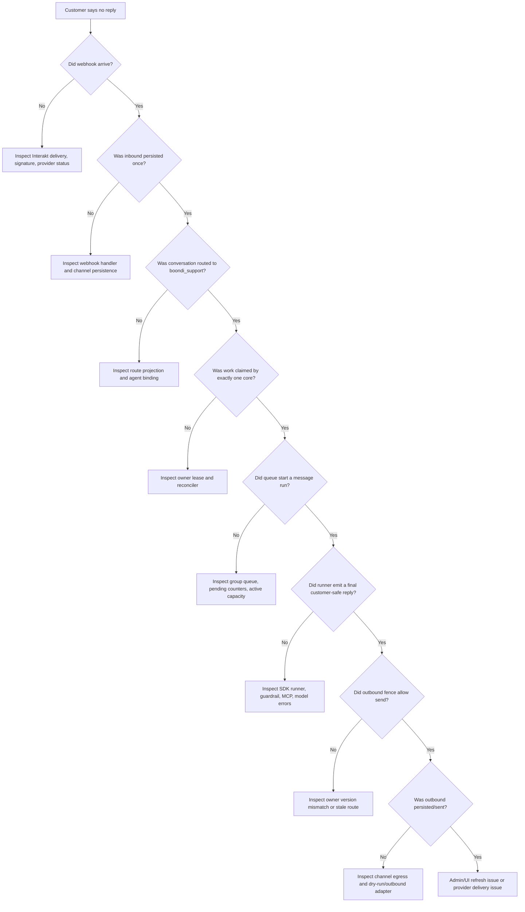

Layman explanation:

- Webhook arrival means the customer reached the building.
- Inbound persistence means the message was written in the logbook.
- Route projection means the message was assigned to Boondi.
- Ownership lease means only one runtime desk can work on it.
- Queue start means the work was actually handed to a worker.
- Runner output means the worker produced a reply.
- Outbound fence means the reply was allowed to leave.
- Outbound persistence means there is durable proof of what Gantry attempted.

Do not skip levels. If you skip directly from "no reply" to "prompt issue", you
will miss queue, lease, cursor, and outbound problems.

### 9.2 Path B: Customer Gets Two Replies

Duplicate replies are worse than slow replies because they prove ownership was
not enforced somewhere.

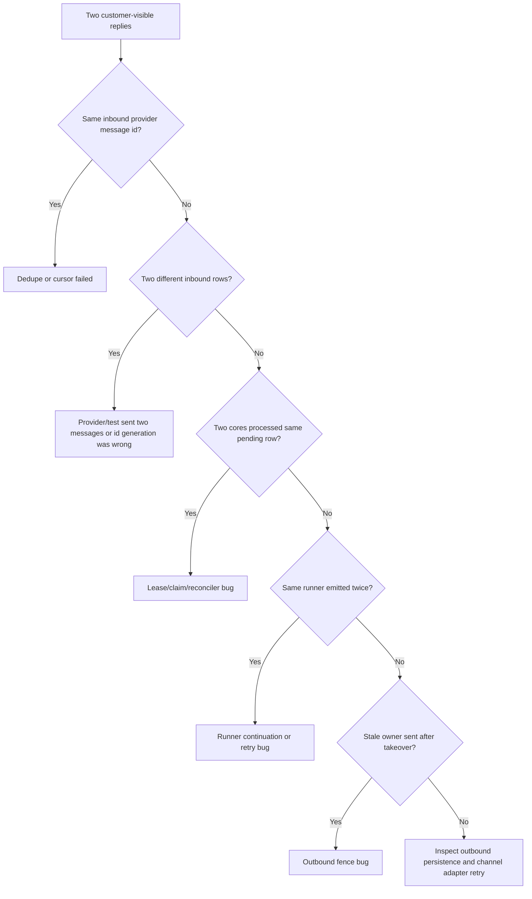

The intended protection chain is:

```text
provider message id dedupe
-> persisted inbound uniqueness
-> pending cursor
-> ownership lease
-> still-pending recheck after claim
-> outbound owner fence
```

Each protection catches a different duplicate path:

| Protection | Duplicate It Prevents |
| --- | --- |
| Provider id dedupe | Provider retries same webhook |
| Inbound uniqueness | Same external event written twice |
| Cursor | Already-consumed inbound processed again |
| Ownership lease | Two cores processing same conversation at once |
| Still-pending recheck | Work enqueued after another owner already consumed it |
| Outbound fence | Stale worker sends after ownership changed |

### 9.3 Path C: Follow-Up Loses Context

This is the failure pattern where the first reply works, but the second customer
message is treated like a brand-new conversation.

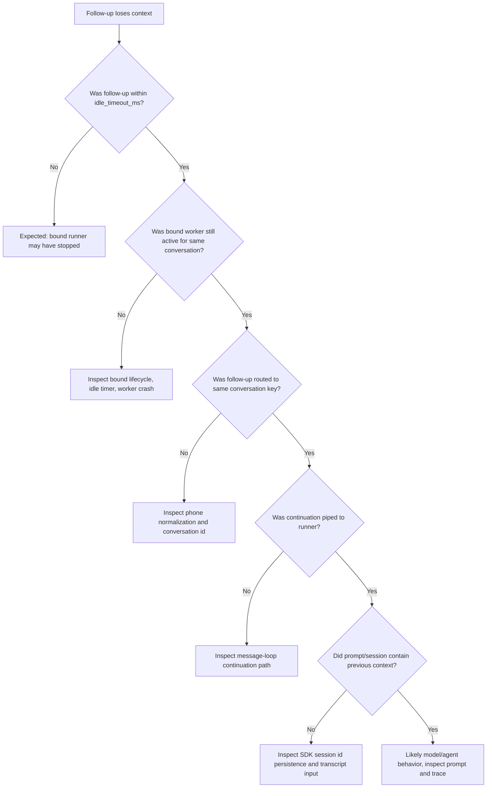

Plain-English version:

- `idle_timeout_ms` is the "how long should this staff member stay assigned to
  the customer after the last customer message" timer.
- If the customer returns before that timer, the preferred path is to reuse the
  bound runner.
- If the customer returns after that timer, Gantry may assign a new warm worker.
  Then continuity depends on persisted transcript/session/memory, not on the
  still-running process.

Critical distinction:

| Case | Expected Mechanism |
| --- | --- |
| Follow-up before idle timeout | Same bound runner should receive continuation |
| Follow-up after idle timeout | New worker may start, but should recover durable context if designed |
| Core restart | Process-local runner context is gone; durable session/transcript becomes source |

### 9.4 Path D: Dashboard Looks Wrong Or Stale

The dashboard is a lens, not the source of truth.

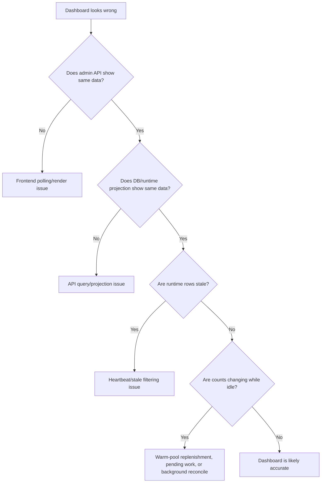

The architect rule:

1. Compare UI to admin API.
2. Compare admin API to database/runtime rows.
3. Compare runtime rows to process reality.
4. Only then decide whether the UI is stale.

This matters because a browser in dev mode can be stale for normal frontend
reasons, while the runtime may be correct.

### 9.5 Path E: Latency Is High

Latency must be broken down. A single vague section is not acceptable because it
does not tell you what to fix.

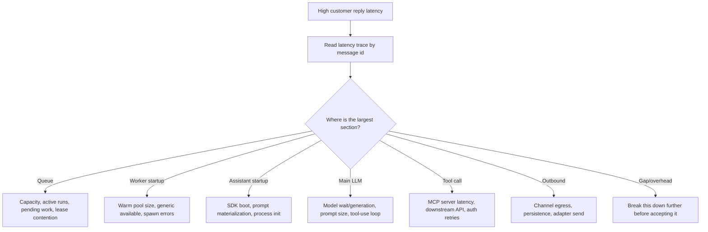

Required trace quality:

| Trace Section | What It Should Mean | Why It Matters |
| --- | --- | --- |
| `queue` | Time waiting before processing starts | Shows capacity pressure |
| `claim/lease` | Time to own conversation work | Shows contention or DB slowness |
| `runner acquire` | Time to get warm/cold runner | Shows warm-pool health |
| `assistant startup` | SDK/process startup before useful work | Shows whether warm path actually helped |
| `guardrail` | Safety classification time | Separates app checks from model time |
| `main LLM` | Actual model wait and generation | Shows provider/model cost |
| `MCP tool call` | Tool execution time | Shows downstream dependency cost |
| `outbound persist/send` | Reply leaving Gantry | Shows channel egress cost |
| `provider prompt-cache read/write` | Provider-reported cache usage during an LLM call | Does not prove Gantry prewarm ran |

If the UI shows a broad `runtime wait`, the trace is not actionable enough. It
must be split into concrete sections so the fix is obvious.

### 9.6 Path F: Generic Workers Keep Moving Between 2 And 3

This can be normal.

Layman explanation: if Gantry wants three ready workers and one worker gets
bound to a customer, the generic ready count can fall. The warm-pool manager may
then start a replacement. During that replacement:

- `genericAvailable` can go from `3` to `2`
- `genericStarting` can go from `0` to `1`
- once boot completes, `genericAvailable` returns to `3`
- `genericStarting` returns to `0`

That does not automatically mean customer work is happening. It can mean the
warm pool is maintaining its target.

Expected state movement:

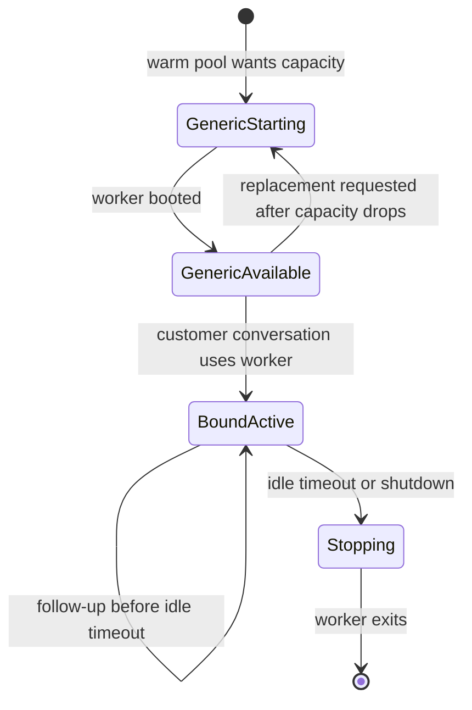

Dashboard interpretation:

| Field | Meaning In Plain English |
| --- | --- |
| `Generic available` | Ready unassigned workers |
| `Generic starting` | Workers currently being booted |
| `Bound active` | Workers currently assigned to customer conversations |
| `Available target` | Desired number of ready unassigned workers |
| `Max message runs` | Active processing capacity limit |
| `Active message runs` | Runs currently processing messages |
| `Pending conversations` | Conversations waiting for processing |

The key mistake is to add `genericAvailable + boundActive` and assume it always
equals a fixed worker count. Depending on replacement policy, a bound worker can
coexist with replenished generic workers.

### 9.7 Path G: Cache Prewarm Confusion

There are two different ideas that sound similar:

1. Gantry cache prewarm.
2. Provider prompt-cache read/write inside an LLM call.

They are not the same.

| Term | What It Means | Where It Happens | What It Proves |
| --- | --- | --- | --- |
| Gantry cache prewarm | Gantry intentionally runs prewarm work before customer traffic | Warm-pool/cache-prewarm path | The runtime attempted to prepare cache earlier |
| Provider prompt-cache read | Anthropic reports tokens were read from provider cache during this LLM call | Main LLM call usage | The provider reused cached prompt tokens |
| Provider prompt-cache write | Anthropic reports tokens were written to provider cache during this LLM call | Main LLM call usage | The provider stored prompt tokens for later |

So the UI should not label provider counters as `cache r` or `cache w` if that
looks like evidence of Gantry prewarm. Better wording is:

- `provider cache read`
- `provider cache write`
- `Gantry prewarm`

Reason: production debugging needs to know whether time was spent before the
customer arrived or during the customer-facing reply.

### 9.8 Path H: Multi-Core Isolation

When two Gantry core processes are running, the system must behave as if there
is one coordinated runtime.

The correct model:

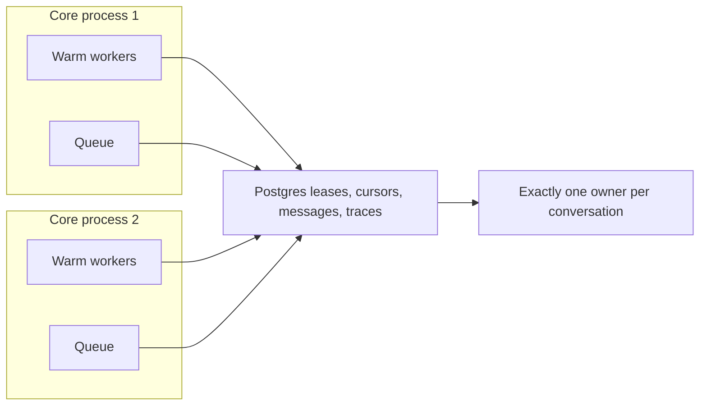

The rule is not "core 1 owns customer A forever." The rule is "at any point in
time, only the valid owner version may process and send for that conversation."

That is why the lease version and outbound fence both exist:

- The lease chooses who may work now.
- The version proves the sender is still that owner when the reply leaves.

### 9.9 Path I: What To Inspect For A Real Customer Acceptance Test

A final customer test should prove the whole platform, not just unit tests.

Minimum human-facing scenario:

1. Customer asks about gifting sweets.
2. Boondi replies with relevant help.
3. Customer asks a follow-up.
4. Boondi answers using the same context.
5. Customer asks Boondi to remember a specific gift plan.
6. Boondi confirms the remembered plan.
7. Customer returns before idle timeout and asks what was remembered.
8. Boondi recalls the correct plan and does not mix another customer's context.

After the chat, inspect evidence:

| Evidence | Expected |
| --- | --- |
| Transcript | 4 customer messages and 4 Boondi replies |
| Message ids | Every reply trace includes the relevant message id |
| Duplicate check | No duplicate outbound rows for one inbound |
| Routing | Same customer conversation id throughout |
| Worker binding | Follow-ups before idle timeout stay on the bound path |
| Isolation | No facts from another customer appear |
| Latency | Every reply has detailed section breakdown |
| Dashboard | No stuck pending conversations after drain |
| Admin/API | Matches transcript and runtime state |

Do not mark a phase complete only because tests passed. For this product, the
acceptance bar includes live-like customer flow through the actual request path.

### 9.10 The Smallest Correct Fix Rule

When a failure is found, fix the smallest layer that owns the failure.

Examples:

| Symptom | Wrong Fix | Correct Owner To Inspect First |
| --- | --- | --- |
| Duplicate reply | Change prompt to "do not repeat yourself" | Deduplication, cursor, lease, outbound fence |
| No reply | Tune model or prompt | Webhook, persistence, route, queue, runner, outbound |
| Context lost before idle timeout | Add more memory prompt text | Bound runner lifecycle and continuation routing |
| Dashboard stale | Restart every service blindly | Compare UI, admin API, DB, heartbeat filtering |
| High `runtime wait` | Accept vague bucket | Split trace into concrete runtime sections |
| Provider cache chips confusing | Disable cache | Rename usage chips and separate Gantry prewarm |

This is the takeover mindset: every component earns its place only if it
protects customer correctness, developer observability, or production recovery.
