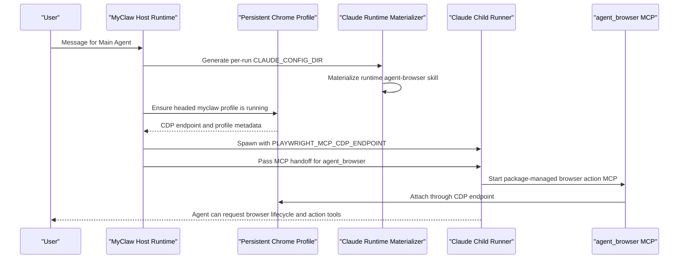

# Browser Capability

MyClaw browser support has two separate responsibilities:

- MyClaw owns the browser session lifecycle.
- Runtime-installed browser action tooling owns browser actions.

This keeps MyClaw from becoming a browser automation framework while still
giving the Main Agent a ready, persistent browser by default.

## End-To-End Flow



The default path is automatic for the Main Agent. Users do not install a
browser skill, copy files into `.claude/skills`, or configure Playwright
manually.

## Runtime Responsibilities

The host browser capability owns:

- the persistent `myclaw` browser profile
- headed local Chrome launch by default
- CI-like headless default when no explicit mode is provided
- CDP readiness checks
- profile lock acquisition and stale lock recovery
- persisted browser session records
- host-crash adoption of a still-healthy Chrome process
- orphan cleanup when the persisted Chrome process has unhealthy CDP
- signed IPC handling for lifecycle requests
- loopback proxy bypass through `NO_PROXY` and `no_proxy`

The lifecycle MCP surface remains intentionally small:

- `mcp__myclaw__browser_profile_list`
- `mcp__myclaw__browser_launch`
- `mcp__myclaw__browser_status`
- `mcp__myclaw__browser_close`

These tools do not click, type, navigate, inspect the DOM, or take browser
screenshots. They manage the host-owned browser session only.

## Action Tooling

Browser actions are provided by the runtime-installed browser action
capability:

- MyClaw materializes a small `agent-browser` skill into the generated per-run
  Claude config.
- MyClaw registers the package-managed `agent_browser` MCP server in the runner
  MCP handoff file.
- MyClaw passes `PLAYWRIGHT_MCP_CDP_ENDPOINT` so the action MCP attaches to the
  already-running persistent Chrome profile.
- The action MCP owns workflows such as navigate, click, type, wait, snapshot,
  and screenshot.

The `@playwright/mcp` package is pinned in `package.json` so the installed
action behavior is reproducible. MyClaw should not vendor or reimplement those
action tools inside the lifecycle MCP.

## Persistent Profile State

The browser profile lives under MyClaw runtime data, not under the generated
per-run Claude config. The generated config is scratch state and is deleted
after the run.

The persistent profile keeps:

- Chrome user data, including cookies after the user logs in
- profile metadata such as creation time, last-used time, CDP port, and auth
  markers
- a profile lock used to prevent concurrent launches against the same profile
- a browser session record with PID, CDP port, target id, headless flag, and
  last-used time

On host restart, MyClaw reads the browser session record. If the PID is still
alive, belongs to the same Chrome user-data directory, and the recorded CDP port
is healthy, MyClaw adopts that browser session. If the process is dead, the
record is cleared. If the process is owned by the profile but CDP is unhealthy,
MyClaw terminates it and launches a fresh browser. If the PID has been reused by
another process, MyClaw clears the stale record without terminating that
process.

## First-Use Login

The default browser launch is headed for local user sessions. If a site needs
authentication:

1. The agent launches or reuses the persistent `myclaw` profile.
2. The user completes login in the visible Chrome window.
3. Cookies remain in that profile for later runs and restarts.
4. Future browser action tools attach to the same profile through CDP.

MyClaw does not ask users to paste credentials into chat, does not scrape
credentials, and does not bypass site authentication.

## Permissions

Browser lifecycle tools and browser action tools go through the existing Claude
Agent SDK permission path and MyClaw channel approval surface. MyClaw does not
add a separate browser-specific permission system.

The Main Agent receives the browser action MCP as an allowed MCP capability, but
auto-approval remains empty. Risky actions continue to be evaluated by the
existing `canUseTool` and channel approval flow.

## Proxy Boundary

Provider credential brokers may inject proxy environment variables into the
runner so provider SDK calls work. Browser loopback traffic must not go through
those proxies.

MyClaw sets loopback bypass values in both host-projected browser env and the
runner env:

- `NO_PROXY=127.0.0.1,localhost,::1`
- `no_proxy=127.0.0.1,localhost,::1`

Runner-side lifecycle MCP tools must not perform their own direct CDP health
checks. The host browser capability is the authority for CDP readiness.

## Non-Main Agents

Default browser support is only wired for the Main Agent. Non-main agents do
not receive the runtime `agent-browser` skill, browser CDP environment, or
`agent_browser` MCP projection unless a future explicit binding model adds
that capability.

## Operational Checks

Useful checks during browser-related changes:

```bash
npm run test:unit -- apps/core/test/unit/runtime/browser-capability.test.ts apps/core/test/unit/runtime/ipc-browser-handler.test.ts apps/core/test/unit/runtime/agent-browser-run-wiring.test.ts apps/core/test/unit/runtime/agent-spawn.test.ts
npm run typecheck
npm run build
python3 .codex/scripts/check_architecture.py
```

Stale-reference checks should confirm that browser action tools are not added
to the lifecycle MCP and that direct runner-side CDP probes are not reintroduced.
