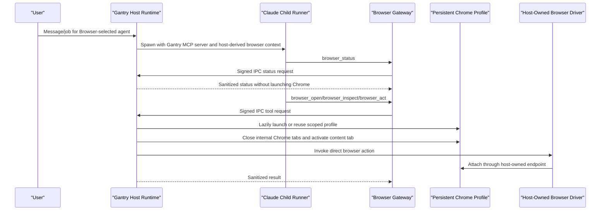

# Browser Capability

Gantry exposes browser control through one durable capability: `Browser`.
Durable settings and Postgres bindings store `Browser`, not private browser
backend names or concrete browser subtool names.

At runtime, `Browser` projects into the compact Gantry browser gateway:
`browser_status`, `browser_open`, `browser_inspect`, `browser_act`, and
`browser_close`. These tool names are audited as concrete actions, but they are
runtime projections, not durable authority.

The projected tools use Gantry-owned schemas. `browser_open` launches or reuses
the headed profile and opens a provided URL. Broad discovery should use normal
search tools first, then open a selected URL in Browser when login-gated,
visual, or interactive verification is needed. `browser_inspect` returns page
state and defaults to compact basic output; full output requires a reason.
`browser_act` handles page interactions after inspection. Long-running tools may
pass `timeout_ms`; Gantry clamps it and applies the resulting budget to signed
IPC and host-owned browser dispatch.
The host caches browser connections by profile and endpoint, de-dupes
concurrent connection attempts, and reconnects once when browser handles are
stale.

Gantry is an assistive browser controller for an owner-managed Chrome profile,
not an undetectable automation system. Browser launch is visible by default and
the agent-facing gateway does not expose a headless option. Gantry does not
override user agent, client hints, `Accept-Language`, or fetch headers as a
browser hardening feature.

Direct browser navigation does not add an adapter-level URL gate. Gantry lets
the owner-managed Chrome profile navigate normally and keeps browser usage
policy outside the direct Playwright driver.

Browser tools that accept `filename` write only under the run browser artifact
root. When `browser_inspect` or `browser_act` saves output to that file, the
model-facing result is a compact file reference with path, optional MIME type,
and size. Screenshot responses must strip inline base64 image data after
persisting the file, because screenshots can exceed the model context budget.

`browser_act` supports `action: "file_attach"` for upload controls. The action
requires `profile: "full"` and a reason, then the host resolves the source and
hands a Gantry-owned staged path to Playwright `setInputFiles`. Supported
sources are `bytes` (small base64 or UTF-8 content, staged under the run browser
artifact root), `artifact` (a FileArtifact read through the signed app/agent
scope and staged under the artifact root), and `path` (regular files only under
the run browser artifact root or the host temp directory). Paths outside those
allowlisted roots, symlinks, hidden browser state, settings, credentials, and
browser IPC directories fail closed before Playwright sees a path. Browser
activity audit records the public `browser_act` call and backend
`file_attach` action; durable authority remains the single `Browser`
capability.

Downloads are intentionally deferred in this slice. The direct driver does not
add download tools until download roots, retention, and result disclosure have a
separate scoped policy and test plan.

Private browser backend tools are not Gantry browser authority. They must not be
persisted, requested, advertised, or projected into the model-facing tool
surface.

## Capability Doctrine

This rule is general, not browser-specific:

- Durable authorization stores human-level capabilities: `Browser`, exact
  reviewed semantic capability entries such as `capability:acme.records.append`, exact
  Gantry-owned file/web facades such as `FileRead` and `WebRead`, scoped
  command rules such as `RunCommand(npm test *)`, connected MCP server ids, skill
  ids, scheduler grants, and future tool-family grants.
- Runtime projects approved capabilities into concrete tools for that run.
- Concrete backend tool names are audited but are not persisted as durable
  authority.
- Backend subtools run without per-subaction approval inside the approved
  capability envelope.
- Gantry enforces the outer boundary: filesystem, network, credentials,
  timeout, process, display, redaction, audit, and selected-capability checks.
- The same durable-vs-projected rule applies to Browser, `RunCommand`,
  third-party CLIs invoked through harness command tools, MCP servers, skills,
  scheduler tools, and future IDE, DB, Kubernetes, or document-editor tools.

## End-To-End Flow



Ordinary runs do not launch Chrome. `browser_status` is read-only and uses the
host browser status path. Actions that require a page lazily ensure the
host-derived profile is CDP-ready. Before action dispatch, the host closes
internal Chrome targets such as `chrome://new-tab-page` and
`chrome://omnibox-popup`, activates the real content tab, and rechecks after
activation so internal tabs do not pollute tab-list output.
Tab and page-state results are filtered at the projection boundary. Gantry
removes internal Chrome targets such as `chrome://new-tab-page` and
`chrome://omnibox-popup`, presents stable model-facing state, and translates
gateway requests into backend-specific actions internally. Raw backend indices
must not leak into model-facing structured or text results. Numeric select and
close requests fail closed unless a current visible-to-backend mapping exists.
The direct driver returns adapter-owned structured tab metadata; text-only tab
lists are not trusted and fail closed instead of being treated as stable
model-facing indices. Successful tab-set mutations invalidate that mapping
unless the backend returns a fresh structured tab list, which replaces it.

Viewport changes must preserve the user's visible browser session. Any
non-visible browser mode remains an internal test harness detail rather than an
agent-facing launch option.

## Runtime Responsibilities

The host browser capability owns persistent browser profiles, headed Chrome
launch, readiness checks, profile locks, persisted session records, crash
adoption, orphan cleanup, signed IPC handling, browser artifact file roots,
connection caching, per-action audit logging, and redaction of backend details
from model-visible responses.

The model cannot choose browser profile paths or arbitrary profile names. The
profile comes from the agent, conversation, thread/job context, and host routing
metadata.

Chrome launch uses a concrete loopback debug port instead of
`--remote-debugging-port=0`; Chrome exposes `navigator.webdriver=true` when the
debugging port is `0`. The visible headed launch path must not use
`--disable-blink-features=AutomationControlled` because Chrome can show Blink
feature toggles as unsupported command-line flags. Backend patches can improve
other automation-detection signals later, but the first-party launch path
should avoid Chrome's standardized webdriver trigger without adding visible
unsupported-flag warnings.

Browser status reports the persistent profile path, Chrome executable, visible
mode, stored state markers, and detected auth markers without launching a new
tab. The runtime discovers Chrome from known Chrome/Chromium executable paths;
`CHROME_PATH` is not a supported runtime `.env` knob because arbitrary wrapper
executables can undermine visible-browser guarantees. Browser action audit
records are neutral: they include the tool name, normalized site, profile name,
timing, result, and policy mode without any built-in protected-site list.
For URL-less page actions, enabled usage policy asks the browser backend for its
current tab list before metering so redirects, in-page cross-site navigation,
and multi-tab selection are attributed to the same backend page the action will
use. If an enforce rule is active and the runtime cannot verify that page site,
the action fails closed before backend dispatch.

`browser.usage` in `settings.yaml` is optional and disabled by default. When an
owner enables it, the default rolling-window and per-site concurrency limits are
the same for every normalized site, and the default policy mode is `audit`
rather than denial. Owner-defined overrides may target specific site keys, but
Gantry ships no preloaded site rules. Override keys are canonicalized to the
same public-suffix-aware registrable site keys used by runtime URL audit, and
public settings responses redact override site names.

```yaml
browser:
  usage:
    enabled: false
    mode: audit
    window_ms: 60000
    max_actions_per_window: 120
    max_concurrent_per_site: 1
    overrides: {}
```

## First-Use Login

The default browser launch is headed for local user sessions. If a site needs
authentication:

1. The agent uses `browser_open`.
2. The user completes login in the visible Chrome window.
3. Cookies remain in that host-derived profile for later runs and restarts.
4. Future browser tools reuse the same profile.

Gantry does not ask users to paste credentials into chat, does not scrape
credentials, and does not bypass site authentication.

## Permissions

Selecting `Browser` controls whether the compact browser gateway is visible.
Individual browser calls do not require separate persistent approvals inside the
selected Browser envelope. Jobs may use browser tools only when their effective
selected capabilities include canonical `Browser`; jobs without `Browser` fail
closed because no browser tools are exposed.

## Operational Checks

Useful checks during browser-related changes:

```bash
npm run test:unit -- apps/core/test/unit/runtime/browser-capability.test.ts apps/core/test/unit/runtime/ipc-browser-handler.test.ts apps/core/test/unit/runtime/agent-spawn.test.ts apps/core/test/unit/runner/browser-tools.test.ts apps/core/test/unit/runner/agent-capabilities.test.ts
npm run typecheck
npm run build
python3 .codex/scripts/check_architecture.py
```

Cleanup searches should confirm that phrase-based browser intent, old action
facades, and model-facing private browser backend authority are not active.
