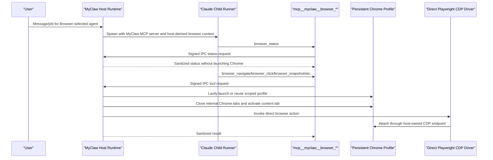

# Browser Capability

MyClaw exposes browser control through one durable capability: `Browser`.
Durable settings and Postgres bindings store `Browser`, not Playwright,
Puppeteer, `agent_browser`, or concrete browser subtool names.

At runtime, `Browser` projects into MyClaw-owned browser tools such as
`mcp__myclaw__browser_status`, `mcp__myclaw__browser_launch`,
`mcp__myclaw__browser_navigate`, `mcp__myclaw__browser_tabs`,
`mcp__myclaw__browser_snapshot`, `mcp__myclaw__browser_click`,
`mcp__myclaw__browser_type`, `mcp__myclaw__browser_wait_for`,
`mcp__myclaw__browser_take_screenshot`, `mcp__myclaw__browser_resize`, and
`mcp__myclaw__browser_close`. These tool names are audited as concrete
actions, but they are runtime projections, not durable authority.

The projected tools use MyClaw-owned schemas. Element actions use `element` for
audit context and `target` for either a snapshot ref or selector. Long-running
tools may pass `timeout_ms`; MyClaw clamps it and applies the resulting budget
to the signed IPC and direct Playwright action dispatch. The host caches direct
Playwright `connectOverCDP` connections by profile and CDP endpoint, de-dupes
concurrent connection attempts, and reconnects once when page, context, or
browser handles are stale.

MyClaw is an assistive browser controller for an owner-managed Chrome profile,
not an undetectable automation system. Browser launch is visible by default and
the agent-facing `browser_launch` tool does not expose a headless option. MyClaw
does not override user agent, client hints, `Accept-Language`, or fetch headers
as a browser hardening feature.

Direct browser navigation does not add an adapter-level URL gate. MyClaw lets
the owner-managed Chrome profile navigate normally and keeps browser usage
policy outside the direct Playwright driver.

Browser tools that accept `filename` write only under the run browser artifact
root. When `browser_take_screenshot`, `browser_snapshot`,
`browser_console_messages`, `browser_network_requests`, or `browser_evaluate`
save output to that file, the model-facing result is a compact file reference
with path, optional MIME type, and size. Screenshot responses must strip inline
base64 image data after persisting the file, because screenshots can exceed the
model context budget.

Downloads are intentionally deferred in this slice. The direct driver does not
add download tools until download roots, retention, and result disclosure have a
separate scoped policy and test plan.

Raw Playwright, Puppeteer, or `agent_browser` tools are not MyClaw browser
authority. They must not be persisted, requested, advertised, or projected into
the model-facing tool surface.

## Capability Doctrine

This rule is general, not browser-specific:

- Durable authorization stores human-level capabilities: `Browser`, exact
  semantic capability entries such as `capability:google.sheets.write`, exact
  non-Bash SDK tool names, scoped Bash rules such as `Bash(npm test *)`,
  approved MCP server ids, skill ids, scheduler grants, and future tool-family
  grants.
- Runtime projects approved capabilities into concrete tools for that run.
- Concrete backend tool names are audited but are not persisted as durable
  authority.
- Backend subtools run without per-subaction approval inside the approved
  capability envelope.
- MyClaw enforces the outer boundary: filesystem, network, credentials,
  timeout, process, display, redaction, audit, and selected-capability checks.
- The same durable-vs-projected rule applies to Browser, Bash, third-party CLIs
  invoked by Bash, MCP servers, skills, scheduler tools, and future IDE, DB,
  Kubernetes, or document-editor tools.

## End-To-End Flow



Ordinary runs do not launch Chrome. `browser_status` is read-only and uses the
host browser status path. Actions that require a page lazily ensure the
host-derived profile is CDP-ready. Before action dispatch, the host closes
internal Chrome targets such as `chrome://new-tab-page` and
`chrome://omnibox-popup`, activates the real content tab, and rechecks after
activation so internal tabs do not pollute tab-list output.
Tab-list results are additionally filtered at the projection boundary. MyClaw
removes internal Chrome targets such as `chrome://new-tab-page` and
`chrome://omnibox-popup`, presents stable 0-based visible tab indices to the
model, and translates `browser_tabs` select and close requests from those
visible indices back to the backend's raw tab indices internally. Raw backend
tab indices must not leak into model-facing structured or text results. Numeric
select and close requests fail closed unless a current visible-to-backend tab
mapping exists. The direct driver returns adapter-owned structured tab metadata;
text-only tab lists are not trusted and fail closed instead of being treated as
stable model-facing indices.
Successful tab-set mutations such as close and new invalidate that mapping
unless the backend returns a fresh structured tab list, which replaces it.

`browser_resize` must preserve the user's visible browser session. The action
ensures a page target exists and then uses Playwright `page.setViewportSize`.
MyClaw does not call browser-level CDP `Emulation.setDeviceMetricsOverride`,
and any non-visible browser mode remains an internal test harness detail rather
than an agent-facing launch option.

## Runtime Responsibilities

The host browser capability owns persistent browser profiles, headed Chrome
launch, CDP readiness checks, profile locks, persisted session records, crash
adoption, orphan cleanup, signed IPC handling, browser artifact file roots,
direct Playwright CDP connection caching, per-action audit logging, and
redaction of backend details from model-visible responses.

The model cannot choose browser profile paths or arbitrary profile names. The
profile comes from the agent, conversation, thread/job context, and host routing
metadata.

Chrome launch uses a concrete loopback CDP port instead of
`--remote-debugging-port=0`; Chrome exposes `navigator.webdriver=true` when the
debugging port is `0`. The visible headed launch path must not use
`--disable-blink-features=AutomationControlled` because Chrome can show Blink
feature toggles as unsupported command-line flags. Rebrowser/Playwright patches
can improve other automation-detection signals later, but the first-party launch
path should avoid Chrome's standardized webdriver trigger without adding visible
unsupported-flag warnings.

Browser status reports the persistent profile path, Chrome executable, visible
mode, stored state markers, and detected auth markers without launching a new
tab. The runtime discovers Chrome from known Chrome/Chromium executable paths;
`CHROME_PATH` is not a supported runtime `.env` knob because arbitrary wrapper
executables can undermine visible-browser guarantees. Browser action audit
records are neutral: they include the tool name, normalized site, profile name,
timing, result, and policy mode without any built-in protected-site list.
For URL-less page actions such as click, type, snapshot, screenshot, and upload,
enabled usage policy asks the browser backend for its current tab list before
metering so redirects, in-page cross-site navigation, and multi-tab selection
are attributed to the same backend page the action will use. If an enforce rule
is active and the runtime cannot verify that page site, the action fails closed
before backend dispatch.

`browser.usage` in `settings.yaml` is optional and disabled by default. When an
owner enables it, the default rolling-window and per-site concurrency limits are
the same for every normalized site, and the default policy mode is `audit`
rather than denial. Owner-defined overrides may target specific site keys, but
MyClaw ships no preloaded site rules. Override keys are canonicalized to the
same public-suffix-aware registrable site keys used by runtime URL audit, and
public settings responses redact override site names.

```yaml
browser:
  usage:
    enabled: false
    mode: audit
    window_ms: 60000
    max_actions_per_window: 120
    max_concurrent_per_site: 1
    overrides: {}
```

## First-Use Login

The default browser launch is headed for local user sessions. If a site needs
authentication:

1. The agent uses `mcp__myclaw__browser_launch`.
2. The user completes login in the visible Chrome window.
3. Cookies remain in that host-derived profile for later runs and restarts.
4. Future browser tools reuse the same profile.

MyClaw does not ask users to paste credentials into chat, does not scrape
credentials, and does not bypass site authentication.

## Permissions

Selecting `Browser` controls whether the projected `browser_*` tools are
visible. Individual browser calls do not require separate persistent approvals
inside the selected Browser envelope. Jobs may use browser tools only when their
effective selected capabilities include canonical `Browser`; jobs without
`Browser` fail closed because no browser tools are exposed.

## Operational Checks

Useful checks during browser-related changes:

```bash
npm run test:unit -- apps/core/test/unit/runtime/browser-capability.test.ts apps/core/test/unit/runtime/ipc-browser-handler.test.ts apps/core/test/unit/runtime/agent-spawn.test.ts apps/core/test/unit/runner/browser-tools.test.ts apps/core/test/unit/runner/agent-capabilities.test.ts
npm run typecheck
npm run build
python3 .codex/scripts/check_architecture.py
```

Cleanup searches should confirm that phrase-based browser intent, old action
facades, and model-facing raw browser backend authority are not active.
