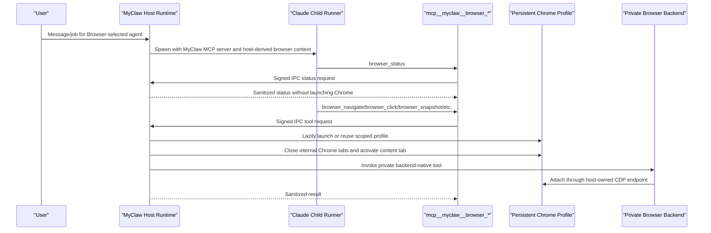

# Browser Capability

MyClaw exposes browser control through one durable capability: `Browser`.
Durable settings and Postgres bindings store `Browser`, not Playwright,
Puppeteer, `agent_browser`, or concrete browser subtool names.

At runtime, `Browser` projects into MyClaw-owned browser tools such as
`mcp__myclaw__browser_status`, `mcp__myclaw__browser_launch`,
`mcp__myclaw__browser_navigate`, `mcp__myclaw__browser_tabs`,
`mcp__myclaw__browser_snapshot`, `mcp__myclaw__browser_click`,
`mcp__myclaw__browser_type`, `mcp__myclaw__browser_wait_for`,
`mcp__myclaw__browser_take_screenshot`, `mcp__myclaw__browser_resize`, and
`mcp__myclaw__browser_close`. These tool names are audited as concrete
actions, but they are runtime projections, not durable authority.

The projected tools use backend-native schemas. Element actions use the
backend's `element` and `target` fields directly; MyClaw does not translate
model-facing `ref`, `selector`, or action-dispatch fields. Long-running tools
may pass `timeout_ms`; MyClaw clamps it and applies the resulting budget to the
signed IPC/backend call timeout. The private Playwright MCP process is reused by
profile, CDP endpoint, and output root with a stable maximum action timeout, so
per-call timeout changes do not fan out subprocesses while longer requests still
fit inside the backend budget. Timeout errors name whether the IPC layer or
backend layer timed out.

Browser tools that accept `filename` write only under the run browser artifact
root. When `browser_take_screenshot`, `browser_snapshot`,
`browser_console_messages`, `browser_network_requests`, or `browser_evaluate`
save output to that file, the model-facing result is a compact file reference
with path, optional MIME type, and size. Screenshot responses must strip inline
base64 image data after persisting the file, because screenshots can exceed the
model context budget.

Raw Playwright, Puppeteer, or `agent_browser` tools are host-private backend
details. They must not be persisted, requested, advertised, or projected into
the model-facing tool surface.

## Capability Doctrine

This rule is general, not browser-specific:

- Durable authorization stores human-level capabilities: `Browser`, scoped
  `Bash(...)`, approved MCP server ids, skill ids, scheduler grants, and future
  tool-family grants.
- Runtime projects approved capabilities into concrete tools for that run.
- Concrete backend tool names are audited but are not persisted as durable
  authority.
- Backend subtools run without per-subaction approval inside the approved
  capability envelope.
- MyClaw enforces the outer boundary: filesystem, network, credentials,
  timeout, process, display, redaction, audit, and selected-capability checks.
- The same durable-vs-projected rule applies to Browser, Bash, third-party CLIs
  invoked by Bash, MCP servers, skills, scheduler tools, and future IDE, DB,
  Kubernetes, or document-editor tools.

## End-To-End Flow



Ordinary runs do not launch Chrome. `browser_status` is read-only and uses the
host browser status path. Actions that require a page lazily ensure the
host-derived profile is CDP-ready. Before action dispatch, the host closes
internal Chrome targets such as `chrome://new-tab-page` and
`chrome://omnibox-popup`, activates the real content tab, and rechecks after
activation so internal tabs do not pollute tab-list output.
Tab-list results are additionally filtered at the projection boundary. MyClaw
removes internal Chrome targets such as `chrome://new-tab-page` and
`chrome://omnibox-popup`, presents stable 0-based visible tab indices to the
model, and translates `browser_tabs` select and close requests from those
visible indices back to the backend's raw tab indices internally. Raw backend
tab indices must not leak into model-facing structured or text results. Numeric
select and close requests fail closed unless a current visible-to-backend tab
mapping exists. If a backend returns tab metadata only as provider-specific
text, the browser adapter must first parse it into adapter-owned structured
metadata, then apply the same visible-index projection; unparseable text-only
tab lists fail closed instead of presenting backend indices as stable
model-facing indices.
Successful tab-set mutations such as close and new invalidate that mapping
unless the backend returns a fresh structured tab list, which replaces it.

`browser_resize` must preserve the user's visible headed browser session. For
headed Chrome, MyClaw resizes the outer browser window through CDP
`Browser.setWindowBounds`; for headless or emulated browser contexts, resize
stays backend-native so viewport emulation continues to follow the backend's
own contract.

## Runtime Responsibilities

The host browser capability owns persistent browser profiles, headed Chrome
launch, CDP readiness checks, profile locks, persisted session records, crash
adoption, orphan cleanup, signed IPC handling, browser artifact file roots,
per-action audit logging, and redaction of backend details from model-visible
responses.

The model cannot choose browser profile paths or arbitrary profile names. The
profile comes from the agent, conversation, thread/job context, and host routing
metadata.

## First-Use Login

The default browser launch is headed for local user sessions. If a site needs
authentication:

1. The agent uses `mcp__myclaw__browser_launch`.
2. The user completes login in the visible Chrome window.
3. Cookies remain in that host-derived profile for later runs and restarts.
4. Future browser tools reuse the same profile.

MyClaw does not ask users to paste credentials into chat, does not scrape
credentials, and does not bypass site authentication.

## Permissions

Selecting `Browser` controls whether the projected `browser_*` tools are
visible. Individual browser calls do not require separate persistent approvals
inside the selected Browser envelope. Jobs may use browser tools only when their
effective selected capabilities include canonical `Browser`; jobs without
`Browser` fail closed because no browser tools are exposed.

## Operational Checks

Useful checks during browser-related changes:

```bash
npm run test:unit -- apps/core/test/unit/runtime/browser-capability.test.ts apps/core/test/unit/runtime/ipc-browser-handler.test.ts apps/core/test/unit/runtime/agent-spawn.test.ts apps/core/test/unit/runner/browser-tools.test.ts apps/core/test/unit/runner/agent-capabilities.test.ts
npm run typecheck
npm run build
python3 .codex/scripts/check_architecture.py
```

Cleanup searches should confirm that phrase-based browser intent, old action
facades, and model-facing raw browser backend authority are not active.
