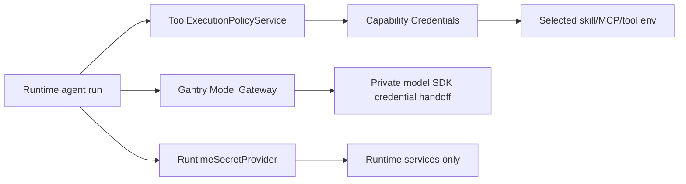

# Credential Management

Gantry separates runtime-owned secrets, model gateway credentials, and
capability environment secrets projected to installed skills, MCP servers, and
tools.

## Source Lanes

Gantry uses four source lanes:

- `settings.yaml` stores non-secret configuration, such as model gateway
  mode, channel enablement, schemas, allowlists, and model selections.
- `RuntimeSecretProvider` resolves runtime-owned secrets from explicit refs.
  Supported runtime refs are `env:<NAME>` (runtime `.env` or process env),
  `gantry-secret:<NAME>` (encrypted Gantry secret rows), and
  `aws-sm:<name-or-arn>` (AWS Secrets Manager).
- Gantry Credential Center stores capability env var values for selected skills, MCP
  servers, and reviewed tools. Values are encrypted in Postgres and projected
  only when a selected capability declares the matching env var or credential
  ref.
- `AgentCredentialBroker` resolves model-provider access and broker-safe model
  adapter injections such as loopback provider gateway URLs and run-local
  gateway tokens. Model credentials must not be reused as tool env.

There is no global `.env > database > broker` precedence. Precedence is
lane-specific: settings choose behavior, runtime secret providers resolve
runtime secrets, capability credentials resolve capability env vars, and model
credentials come from the Gantry Model Gateway. If a value appears in the wrong lane,
Gantry reports it as a configuration error instead of silently ignoring or
overriding it.

Wrong-lane checks apply to both runtime `.env` and the process environment used
to start Gantry. Process env may override local `.env` only inside
runtime-secret resolution; it is not ambient agent tool env. If a local shell
already has a capability secret, import it explicitly with
`gantry credentials access import-env NAME`.

## Runtime-Owned Secrets

Runtime-owned secrets are needed to start and operate Gantry or its connected
services. They are read through `RuntimeSecretProvider`.

Examples:

- `GANTRY_DATABASE_URL`
- `SLACK_BOT_TOKEN`
- `SLACK_APP_TOKEN`
- `TELEGRAM_BOT_TOKEN`
- webhook secret
- control API secret
- `SECRET_ENCRYPTION_KEY`
- `SECRET_ENCRYPTION_KEYRING_JSON`

Runtime-owned secrets are never injected into an agent runner. They are checked
by runtime preflight, doctor, channel setup, storage readiness, and credential
encryption readiness.

Guided provider setup stores channel credentials as encrypted
`gantry-secret:` refs by default. Runtime `.env` and process env remain valid
only when settings explicitly reference `env:<NAME>`; they must not contain
non-secret settings such as model access state or gateway URLs.

## Capability Credentials

Capability credentials are the central store for simple env-var-shaped secrets
needed by approved agent capabilities. They are encrypted with
the Gantry credential secret envelope in Postgres and are never written to
`settings.yaml`. The envelope format is `gcred:v2:<key-id>:...` and uses
AES-256-GCM with metadata-bound AAD. Operator-pasted values that look like an
envelope are still encrypted as plaintext input; there is no prefix passthrough.

`SECRET_ENCRYPTION_KEY` may hold one active base64-encoded 32-byte key. For
rotation, use `SECRET_ENCRYPTION_KEYRING_JSON` with an `active` key id and a
`keys` object of key-id to base64 key values. New writes use the active key;
reads can decrypt any configured key id in the keyring.

Examples:

- `GITHUB_TOKEN` for a GitHub MCP server
- `LINKEDIN_ACCESS_TOKEN` for a LinkedIn posting skill
- `GOOGLE_APPLICATION_CREDENTIALS_JSON` for a reviewed local tool that expects
  an env var

CLI management:

```bash
gantry credentials access list
gantry credentials access set LINKEDIN_ACCESS_TOKEN
gantry credentials access import-env GITHUB_TOKEN
gantry credentials access unset GITHUB_TOKEN
```

These are host/admin CLI commands. Agent runs must not execute
`gantry credentials ...`, read `settings.yaml`, or write runtime credential
state directly. When a skill/MCP/local-CLI credential is missing, the agent
reports `Setup required: credential missing: NAME` and waits for a human or
approved admin surface to set the value in Credential Center.

Agents do not edit `.env`, `settings.yaml`, skill directories, or MCP config to
manage these values. When a selected skill or MCP server needs a missing secret,
the runtime fails closed with `gantry credentials access set NAME`
guidance. If the value already exists in the host shell, an admin can run
`gantry credentials access import-env NAME` to move it into the central
store.

Skill action manifests declare required env-var names and scoped commands; they
must not instruct agents to set shell env vars inline. Runtime injects approved
skill secrets and neutral CA trust aliases for approved tool calls, so skill
commands should stay argv-shaped, such as
`python3 skills/linkedin-posting/post.py --file ...`.

## Agent-Accessed Credentials

Agent-accessed credentials are credentials an agent may use after policy allows
the action. They include LLM provider access and tool or API credentials, but
those two categories are not scoped the same way. Model-provider credentials
come from the Gantry Model Gateway. Tool env vars come from capability
credentials when a selected
capability declares a need. Reviewed `local_cli` capabilities are valid when
the CLI already owns its own authenticated account state and Gantry pins the
executable, command templates, preflight, protected paths, and denied
environment overrides before projecting scoped command authority.

Model-provider access is account-level Model Access. Gantry always requests it
with `purpose=model_runtime` through the Gantry Model Gateway; it is not bound
to an individual agent, conversation, memory worker, subagent, or job. Agents,
subagents, jobs, and memory workers select catalog model aliases only. Model
credentials are configured once with `gantry credentials model set <provider>`
for providers such as `anthropic`, `openrouter`, `openai`, `bedrock`, and
`vertex`, then projected through the Gantry Model Gateway according to the
selected model provider or embedding provider. Each provider exposes explicit
credential modes through the control API as `credentialModes`; Anthropic
supports `api_key` and `claude_code_oauth`, OpenRouter and OpenAI use
`api_key`, Amazon Bedrock uses `aws_default_chain`, `bedrock_api_key_ref`, or
`bedrock_api_key`, and Google Vertex AI uses `google_adc`,
`service_account_ref`, or `service_account`. `PUT
/v1/credentials/models/:providerId` replaces a credential and selects the auth
mode, `PATCH` rotates fields for the existing auth mode, and all read/mutation
responses return only redacted status, fingerprints, configured field names,
and mode metadata.

The active credential modes follow from the model's provider and selected
agent harness. The agent harness contract is recorded in
`docs/decisions/0028-agent-harness-selection.md`. `agentHarness` is
durable user/admin intent with values `auto`, `anthropic_sdk`, and
`deepagents`; in `settings.yaml`, the key is `agent_harness`. `auto` derives the
internal execution lane from the model provider, while explicit
`anthropic_sdk` or `deepagents` is honored only when the selected model is
compatible and otherwise fails before runner spawn:

| provider             | `auto` harness lane | compatible explicit `agentHarness` | credential modes                                              |
| -------------------- | ------------------- | ---------------------------------- | ------------------------------------------------------------- |
| `anthropic` (Claude) | `anthropic_sdk`     | `anthropic_sdk`                    | `api_key` + `claude_code_oauth`                               |
| `openai`             | `deepagents`        | `deepagents`                       | `api_key`                                                     |
| `openrouter`         | `deepagents`        | `deepagents`                       | `api_key`                                                     |
| `bedrock`            | `deepagents`        | `deepagents`                       | `aws_default_chain`, `bedrock_api_key_ref`, `bedrock_api_key` |
| `vertex`             | `deepagents`        | `deepagents`                       | `google_adc`, `service_account_ref`, `service_account`        |

Anthropic SDK is the only Claude OAuth/subscription lane and also runs Anthropic
API-key models. DeepAgents is the OpenAI-compatible harness for OpenAI,
OpenRouter, Bedrock, and Vertex routes through the Gantry Model Gateway and
cannot use Claude OAuth/subscription credentials. Bedrock `aws_default_chain`
uses the host AWS credential chain to SigV4-sign requests to the regional
`bedrock-runtime.<region>.amazonaws.com/v1` endpoint; `bedrock_api_key_ref`
resolves an `aws-sm:` ref host-side; `bedrock_api_key` stores an encrypted
Bedrock API key. Vertex `google_adc` uses host Application Default Credentials,
`service_account_ref` resolves a `gcp-sm:` ref host-side, and
`service_account` stores encrypted service-account JSON. AWS credentials,
Bedrock API keys, service-account JSON, and minted OAuth tokens are never
projected to the runner.
`agentHarness: auto` derives from the provider and explicit harness choices are validated before
runner spawn so incompatible model/harness pairings fail before any model SDK
process starts. A defensive backstop at the credential boundary still
guarantees a Claude OAuth/subscription credential can only ever project to the
Anthropic SDK lane; the DeepAgents lane fails closed if it ever resolves one
(`DeepAgents cannot use Claude OAuth/subscription credentials. Choose Anthropic SDK or configure Claude API-key Model Access.`).
DeepAgents runner authority remains Gantry-owned and wrapped: raw `execute`, raw
local filesystem access, raw `.mcp.json`, and raw provider credentials are not
projected to the runner.

Host-side memory (extraction, dreaming, consolidation) has no engine selector
either (the retired `memory.engine` key is rejected at settings validation). The
memory transport lane is derived at query dispatch
(`route-aware-memory-llm-client.ts`): an Anthropic-family memory model uses the
Claude Agent SDK memory client; an OpenAI-family memory model uses the
OpenAI-compatible direct chat-completions client. Provider takes precedence over
the nominal family — OpenRouter's nominal response family is `anthropic`, but
because it runs on the DeepAgents/OpenAI-compatible engine it dispatches to the
OpenAI-compatible client (over the brokered OpenRouter gateway projection). A
deployment that selects OpenAI/OpenRouter memory model aliases runs memory with no
Anthropic models at all.

Agents do not receive every raw secret value from Gantry. Runtime code projects
only the selected capability's declared credential names. Attached skills do
not receive secrets by being attached; a selected reviewed skill action must
declare the matching `requiredEnvVars` before those values are projected.
Selected MCP servers get only their reviewed credential refs; reviewed tools get
only their declared env needs. Model credential injection remains broker-owned
and must never be reused for tool env.

For local authenticated CLIs, Gantry does not copy raw OAuth tokens or broker
proxies into generic Bash. The approved semantic capability maps to narrow
scoped command templates and protected credential/config paths. User-defined
local CLI capabilities require pinned executable identity, version/hash, auth
preflight, protected paths, and denied environment overrides before runtime
projects scoped command authority. Agents may not override
token, credential file, config directory, proxy, keychain/keyring, CA, or
authority environment keys unless a future capability explicitly models that
behavior.

Selected `local_cli` capabilities project credential paths and network host
metadata only through typed runtime access. Credential directories are mounted
into the SDK as additional readable directories and are also added to
`sandbox.filesystem.denyWrite`; they are intentionally not added to
`denyRead`. Declared network hosts are not durable `SandboxNetworkAccess`
authority. For scheduled jobs, Gantry may suppress a parentless SDK network
prompt only when it arrives immediately after the same principal's approved
Bash invocation, that command matches the reviewed local CLI command template,
and the requested host matches the capability's declared host list.

Raw provider credentials such as `ANTHROPIC_API_KEY`, `ANTHROPIC_AUTH_TOKEN`,
`OPENAI_API_KEY`, `CLAUDE_CODE_OAUTH_TOKEN`, Bedrock API keys, AWS access keys,
and Vertex service-account JSON must be configured through Gantry model
credentials, never in Gantry `.env` or process env.

## Common Key Placement

| Value                                                         | Source                                                       |
| ------------------------------------------------------------- | ------------------------------------------------------------ |
| `model_access.enabled`                                        | `settings.yaml` advanced override                            |
| `model_access.gateway.bind_host`                              | `settings.yaml` advanced override                            |
| `agent.name`                                                  | settings revisions, rendered to `settings.yaml`              |
| `agent.default_model`                                         | settings revisions, rendered to `settings.yaml`              |
| `agent.one_time_job_default_model`                            | settings revisions, rendered to `settings.yaml`              |
| `agent.recurring_job_default_model`                           | settings revisions, rendered to `settings.yaml`              |
| `memory.llm.models.*`                                         | settings revisions, rendered to `settings.yaml`              |
| Conversation approvers                                        | settings revisions and Postgres conversation rows            |
| `storage.postgres.url_env`                                    | `settings.yaml` advanced override                            |
| `GANTRY_DATABASE_URL`                                         | `RuntimeSecretProvider`, usually `env:GANTRY_DATABASE_URL`   |
| Channel bot/app tokens                                        | `RuntimeSecretProvider`, usually `gantry-secret:<NAME>`      |
| `SECRET_ENCRYPTION_KEY`                                       | `RuntimeSecretProvider`, usually `env:SECRET_ENCRYPTION_KEY` |
| Skill, MCP, and reviewed tool env vars                        | Gantry Credentials (`gantry credentials access ...`)         |
| `ANTHROPIC_API_KEY`, `ANTHROPIC_AUTH_TOKEN`, `OPENAI_API_KEY` | Gantry model credentials                                     |
| `CLAUDE_CODE_OAUTH_TOKEN`                                     | Gantry model credentials                                     |

`defaults.agent_harness` and `agents.<id>.agent_harness` live in settings
revisions as non-secret user/admin intent and are rendered to `settings.yaml`.

Model env keys such as `ANTHROPIC_MODEL`, `ANTHROPIC_BASE_URL`, and
`ANTHROPIC_DEFAULT_*_MODEL` are child-process adapter projections. Gantry
runtime config does not accept them from runtime `.env`; use provider-neutral
aliases through `agent.default_model`, `agent.one_time_job_default_model`,
`agent.recurring_job_default_model`, `memory.llm.models.*`, `gantry model`, the
Control API defaults route, and group `/model` overrides for model selection.
OpenRouter is selected by provider or catalog alias. The current OpenRouter
adapter projection uses a Claude Agent SDK-compatible loopback gateway endpoint
with `gtw_*` tokens supplied by `AgentCredentialBroker`; the child process never
receives the upstream OpenRouter API key or direct OpenRouter base URL.

## Model Access Modes

`model_access.enabled` supports:

- `true`: local/personal default using encrypted Postgres model credentials and
  a loopback model gateway.
- `false`: development mode with no model gateway injection.

Future Vault, Kubernetes Secrets, GCP Secret Manager, Azure Key Vault, or
custom integrations must implement typed runtime secret providers or Gantry
Credential Center repositories. They must not add ad hoc runtime `.env`
fallbacks for agent credentials.

## Gantry Model Gateway

The Gantry Model Gateway is the only active local model credential path. It
stores provider credentials in `model_credentials` rows encrypted with
the same `gcred:v2` metadata-bound envelope, stores the selected provider
`authMode` as non-secret metadata, exposes redacted status through the Control
API and
`gantry credentials model status`, and serves per-run loopback HTTP endpoints
for Anthropic, OpenRouter, OpenAI embedding, Bedrock, and Vertex traffic.

Provider credential shape is owned by the model provider registry. Each
provider declares one or more credential modes with:

- stable mode id, label, and help text
- user-facing field labels such as `Anthropic key`, `Azure endpoint`,
  `Deployment name`, and `AWS region`
- required field metadata
- a gateway auth strategy

OpenRouter and OpenAI each expose one `api_key` mode, so setup stays direct.
Anthropic exposes `api_key` for direct API keys and `claude_code_oauth` for
Claude Code subscription OAuth tokens. Bedrock exposes `aws_default_chain`
(`region`, optional `profile`), `bedrock_api_key_ref` (`region`, `aws-sm:` ref),
and `bedrock_api_key` (`region`, secret key) for the OpenAI-compatible Chat
Completions route. Vertex exposes `google_adc` (`region`, `projectId`),
`service_account_ref` (`region`, `projectId`, `gcp-sm:` ref), and
`service_account` (`region`, `projectId`, service-account JSON). The service
account's owner `project_id` may differ from the target `projectId` when IAM
allows that identity to call Vertex in the target project. Providers that need
more than one path, such as Azure Foundry, add additional modes in the registry
instead of adding CLI, API, storage, or gateway branches.

All user-entered credential and provider configuration values stay in the
encrypted structured payload. Read surfaces return only provider label, role,
workloads, selected `authMode`, credential modes, field metadata, configured
field names, fingerprints, health, and timestamps.

Gateway tokens are app-scoped, run-scoped, provider-scoped, and bound to the
credential fingerprint, `authMode`, and schema version present at token issue.
Credential disable or rotation invalidates previously issued tokens instead of
letting them reuse newer secrets. Gateway requests are POST-only, path-confined
under the provider route and upstream prefix, size-limited, timeout-bound, and
proxied through request/response header allowlists.

Control API semantics:

- `GET /v1/credentials/models` returns redacted admin-UI-ready status for all
  supported providers.
- `PUT /v1/credentials/models/:providerId` fully replaces one provider
  credential and may set or change `authMode`.
- `PATCH /v1/credentials/models/:providerId` rotates fields inside the
  existing active `authMode`; omitted fields are preserved, while empty, null,
  unknown, missing, disabled, or auth-mode-changing updates are rejected.
- `DELETE /v1/credentials/models/:providerId` disables active use without
  deleting the encrypted payload or metadata.

Gateway auth strategies are fail-closed. Current `header`, `bearer`,
`claude_code_oauth`, `aws_bedrock_api_key`, `aws_bedrock_api_key_ref`,
`aws_sdk_default_chain`, `aws_sigv4`, `google_adc`,
`vertex_service_account_ref`, and `vertex_service_account` strategies inject,
resolve, sign, or mint credentials at the outbound provider boundary.
`aws_sdk_default_chain` is the active Bedrock role/profile mode. `aws_sigv4`
remains a host gateway strategy for explicit static AWS credentials, but the
active OpenAI-compatible Bedrock provider does not expose an `access_key` mode.
Future strategies such as `azure_api_key` and `azure_entra_default_credential`
are distinct strategy slots; they must not fall through to generic header
injection. Runner-supplied provider auth headers are stripped before the
gateway adds Bedrock or Vertex headers.

### Developer Checklist: Cloud Model Credentials

Adding a plain bearer API-key provider is mostly registry work. Adding an
AWS/Google/Azure-style provider is not: the credential mode must say how Gantry
obtains authority, and the host gateway must do that work without projecting raw
cloud credentials into the runner.

When adding or changing a cloud model credential mode:

1. Confirm the API family first.
   Use official provider docs for the exact endpoint, auth scheme, model id
   form, region/location rules, and SDK request path. Do not mix a provider's
   OpenAI-compatible route with a different API family such as Bedrock Converse
   or Anthropic Messages unless that lane is implemented explicitly.

2. Add provider metadata in the registry.
   Edit
   `apps/core/src/shared/model-provider-registry-openai-compatible.ts` for
   OpenAI-compatible providers. Add or update:
   - `credentialModes`: stable `id`, label, help text, required fields, and
     `gatewayAuth`
   - `executionRoute.supportedCredentialModes`
   - `gateway.upstreamResolver` when region, project, endpoint, deployment, or
     account changes the upstream URL

   Edit `apps/core/src/shared/model-provider-registry.ts` only for shared
   contract changes: new `ModelGatewayAuthStrategy` values and validation for
   non-secret field shapes such as AWS regions, profiles, `aws-sm:` refs,
   Google project ids, and `gcp-sm:` refs.

3. Keep the CLI and Control API registry-driven.
   `gantry credentials model set <provider>` and
   `PUT /v1/credentials/models/:providerId` read mode/field metadata from the
   registry. Do not add provider-specific CLI branches unless a new field type
   or prompt behavior is genuinely needed. The stored model credential payload
   may contain raw secrets only for explicit secret fields such as direct API
   keys or service-account JSON; hosted identity modes should store only
   non-secret selectors such as `region`, `projectId`, `profile`, or a secret
   reference. If route docs or schemas change, update
   `apps/core/src/cli/credentials.ts`,
   `apps/core/src/cli/setup-credentials.ts`,
   `apps/core/src/control/server/openapi-model-credential-schemas.ts`, and the
   `/v1/credentials/models` OpenAPI examples without returning secret values on
   read surfaces.

4. Implement host-side gateway auth.
   Edit
   `apps/core/src/adapters/llm/anthropic-claude-agent/gantry-model-gateway-routing.ts`
   to handle the `gatewayAuth.strategy` explicitly. Put reusable provider auth
   helpers beside it, for example:
   - `gantry-model-gateway-auth-aws-default.ts` for AWS default-chain/profile
     credential lookup
   - `gantry-model-gateway-auth-sigv4.ts` for SigV4 signing
   - `gantry-model-gateway-auth-vertex.ts` for Google OAuth token minting
   - `gantry-model-gateway-secret-ref.ts` for `aws-sm:` and `gcp-sm:` reference
     resolution

   The runner still receives only the loopback base URL and a `gtw_` token.
   Never project `AWS_ACCESS_KEY_ID`, `AWS_SECRET_ACCESS_KEY`, Google
   service-account JSON, Bedrock API keys, provider OAuth tokens, or secret
   manager values into `modelCredentialEnv`, tool env, MCP env, or
   `settings.yaml`.

5. Keep DeepAgents provider-neutral.
   `apps/core/src/adapters/llm/deepagents-langchain/credential-validation.ts`
   should keep validating against `provider.executionRoute.supportedCredentialModes`.
   Do not add a DeepAgents provider branch unless model construction changes.
   If the provider uses the OpenAI-compatible lane, the DeepAgents runner should
   still call the loopback gateway through `OPENAI_BASE_URL` and `OPENAI_API_KEY`.

6. Update docs where developers will look.
   Update this file, `README.md` for operator-facing setup, and
   `apps/core/src/adapters/llm/deepagents-langchain/AGENTS.md` when the provider
   affects the DeepAgents lane. Update scale-up or decision docs that mention
   the provider's supported modes so they do not keep stale API-key-only claims.

7. Add focused tests.
   At minimum, update:
   - `apps/core/test/unit/core/model-provider-registry.test.ts` for mode lists,
     payload validation, and upstream resolution
   - `apps/core/test/unit/core/gantry-model-gateway.test.ts` for host-side auth
     behavior and proof that runner-supplied provider auth headers do not win
   - `apps/core/test/unit/adapters/deepagents-credential-validation.test.ts` for
     the new supported credential modes

   Add model credential service or CLI tests only when validation, prompt
   behavior, redaction, or rotation semantics change. Run a stale-text search
   for old mode names before closeout.

### Bedrock and Vertex first cut

The current Bedrock and Vertex strategy is intentionally narrow:

- Bedrock ships OpenAI-compatible catalog aliases for `bedrock-oss`
  (`openai.gpt-oss-120b-1:0`), `bedrock-oss-20b`
  (`openai.gpt-oss-20b-1:0`), Kimi aliases (`bedrock-kimi`,
  `bedrock-kimi-thinking`), Qwen aliases (`bedrock-qwen`,
  `bedrock-qwen-coder`, `bedrock-qwen-next`, `bedrock-qwen-vl`), DeepSeek,
  GLM, MiniMax, Mistral/Devstral/Magistral/Ministral/Voxtral, Gemma,
  Nemotron, and Llama 3 aliases through Amazon Bedrock OpenAI Chat
  Completions. That OpenAI-compatible route authenticates with AWS role/profile
  identity, an Amazon Bedrock API key resolved from AWS Secrets Manager, or an
  encrypted Amazon Bedrock API key, and uses the regional
  `bedrock-runtime.<region>.amazonaws.com/v1` base URL. Model availability is
  region-specific; CLI evidence on 2026-06-22 confirmed these ON_DEMAND
  text-output chat models in `ap-south-1`, while `ap-south-2` returned no
  models for the same filter in this account. Claude on Bedrock, GPT-OSS
  safeguard models, and other Bedrock API-family-specific paths are deferred to
  separate lanes.
- Vertex ships the `vertex` and `vertex-flash-3.5` aliases, routed to
  `google/gemini-3.5-flash` through the Vertex OpenAI-compatible endpoint.
  The current route accepts only `global`. Gantry's gateway uses the
  documented OpenAI-library
  `https://aiplatform.googleapis.com/v1`
  `/projects/{project}/locations/{location}/endpoints/openapi/chat/completions`
  path. It authenticates with Google ADC/workload identity, service-account JSON
  resolved from Google Secret Manager, or encrypted service-account JSON.
  Credentialed live smoke testing remains required before treating the external
  endpoint choice as fully proven. Regional and multi-region Vertex routing is
  deferred until explicitly implemented and verified; do not claim `us` or `eu`
  support in the current OpenAI-compatible lane.
  Older Vertex Flash 2.0 aliases are not valid because that model is
  discontinued.
- Vertex service-account JSON must have the expected service-account shape,
  but the service-account owner `project_id` is not required to equal the
  target Vertex `projectId`. If the uploaded JSON omits `token_uri`, Gantry
  pins token exchange to `https://oauth2.googleapis.com/token`; if `token_uri`
  is present with any other value, the gateway rejects the credential before
  token minting.
- The DeepAgents runner still receives only the loopback provider base URL and
  a run-scoped `gtw_` token. AWS credentials, Bedrock API keys,
  service-account JSON, resolved secret values, and minted OAuth tokens stay
  inside the host gateway.

Example Control API payloads:

```json
{
  "authMode": "aws_default_chain",
  "payload": {
    "region": "us-east-1",
    "profile": "gantry-prod"
  }
}
```

```json
{
  "authMode": "bedrock_api_key_ref",
  "payload": {
    "region": "us-east-1",
    "apiKeyRef": "aws-sm:prod/gantry/bedrock-api-key"
  }
}
```

```json
{
  "authMode": "google_adc",
  "payload": {
    "region": "global",
    "projectId": "gantry-project"
  }
}
```

```json
{
  "authMode": "service_account_ref",
  "payload": {
    "region": "global",
    "projectId": "gantry-project",
    "serviceAccountJsonRef": "gcp-sm:projects/gantry-project/secrets/vertex-sa/versions/latest"
  }
}
```

```json
{
  "authMode": "bedrock_api_key",
  "payload": {
    "region": "us-east-1",
    "apiKey": "bedrock-key"
  }
}
```

```json
{
  "authMode": "service_account",
  "payload": {
    "region": "global",
    "projectId": "gantry-project",
    "serviceAccountJson": "{\"type\":\"service_account\",\"project_id\":\"gantry-project\",\"client_email\":\"...\",\"private_key\":\"...\"}"
  }
}
```

PATCH rotation keeps the existing active `authMode` and accepts only fields for
that mode:

```json
{
  "payload": {
    "apiKeyRef": "aws-sm:prod/gantry/bedrock-api-key-v2"
  }
}
```

Surface Impact Matrix:

| surface                      | classification       | reason                                                                                                                                                 |
| ---------------------------- | -------------------- | ------------------------------------------------------------------------------------------------------------------------------------------------------ |
| runtime behavior             | Changed              | The model gateway resolves Bedrock/Vertex upstream origins dynamically from stored credential payloads and injects provider-specific auth host-side.   |
| `settings.yaml`              | Unchanged by design  | Provider credentials, region, and project stay out of settings; users select existing catalog aliases through the existing model fields.               |
| Postgres/runtime projection  | Changed              | Existing `model_credentials` rows now store Bedrock/Vertex auth mode plus encrypted structured payload fields.                                         |
| control API                  | Changed              | Existing credential routes expose Bedrock/Vertex provider metadata, accepted auth modes, validation, and redacted status without a route-shape change. |
| SDK/contracts                | Unchanged by design  | The runner contract remains provider id + provider model id + loopback gateway URL + `gtw_` token; raw provider secrets are not projected.             |
| CLI                          | Changed              | Existing `gantry credentials model set/status` surfaces now display Bedrock/Vertex provider modes and field prompts from the registry.                 |
| Gantry MCP tools/admin skill | Unchanged by design  | No new admin tool is introduced; existing approved settings/credential surfaces apply.                                                                 |
| channel/provider adapters    | Read-only/observable | Channels render the same approvals/receipts and gain no channel-specific authority; model provider gateway behavior is covered under runtime behavior. |
| docs/prompts                 | Changed              | README, credential architecture, and DeepAgents adapter instructions describe the bounded provider contract and deferred Claude-on-Bedrock path.       |
| audit/events                 | Read-only/observable | Existing credential and gateway events carry the new provider ids and auth modes; no new event type is required.                                       |
| tests/verification           | Changed              | Catalog, credential validation, gateway routing/auth, registry validation, and log-redaction tests cover the new provider paths and negative cases.    |

Deferred decisions:

- Bedrock Claude support requires official and live proof that the target model
  supports Bedrock Chat Completions on the intended endpoint, or a separate
  Bedrock Anthropic Messages/Converse runtime lane. It must not be represented
  as OpenAI compatible without that proof.
- Runtime provider model discovery, regional model availability checks, and
  credentialed Bedrock/Vertex live smoke automation are separate changes with
  their own docs/tests.
- Provider live smoke tests require real Bedrock and Vertex credentials. Local
  verification can prove Gantry routing, credential containment, request
  signing, and token minting behavior, but not external account entitlement.

For every model auth mode, the selected model runner receives only its
adapter-owned loopback gateway env and a short-lived `gtw_*` token. The gateway
swaps that token for the stored provider credential only at the outbound
provider boundary. Bash tools, MCP stdio subprocesses, browser tools, and skills
do not receive model provider keys or provider OAuth tokens.

`NO_PROXY` and `no_proxy` are compatibility hints for cooperative tools, not an
authorization boundary. Approved tool subprocesses receive egress proxy and
neutral trust settings through provider-neutral `toolNetworkEnv`; model gateway
credentials stay in `modelCredentialEnv`. A malicious or vulnerable tool can
ignore environment variables, so protection still comes from capability
selection, permission policy, sandbox policy, egress denylist/private-network
checks, and audit.

The runtime calls the application credential service and receives a generic
`AgentCredentialInjection`; it does not read provider keys directly.

The model gateway never executes tools, approves permissions, owns scheduler
policy, evaluates protected capability changes, or enforces egress policy.
Model credential env is passed only to the Claude SDK process private model
credential handoff. Bash tools, MCP stdio subprocesses, browser tools, and
skills do not receive model provider tokens. Host-owned scheduler scripts are
not supported.

The SDK process receives sandbox policy and model credentials as separate
adapter projections. Approved tool calls receive a separate `toolNetworkEnv`
projection for the Gantry loopback egress proxy and neutral TLS aliases; future
execution adapters such as Deep Agents must consume that same neutral contract
instead of reusing model credentials for tool egress. Protected filesystem paths
are passed through
`GANTRY_PROTECTED_FILESYSTEM_DENY_READ_PATHS_JSON` and
`GANTRY_PROTECTED_FILESYSTEM_DENY_WRITE_PATHS_JSON` and become Claude SDK
`sandbox.filesystem.denyRead` and `sandbox.filesystem.denyWrite` entries;
reviewed local CLI credential directories are also passed through
`GANTRY_LOCAL_CLI_CREDENTIAL_DIRS_JSON` so the SDK can mount them for reads
while still denying writes. Model credentials remain only in the private SDK env
handoff. Do not use MCP stdio env, browser env, or any future scheduler script
env to carry sandbox authority or provider credentials.

## Permission Boundary

Credential injection is not permission approval. Agent actions must still pass
through `ToolExecutionPolicyService` and the permission/capability binding
checks before credentials are injected or used for a tool/API action.


