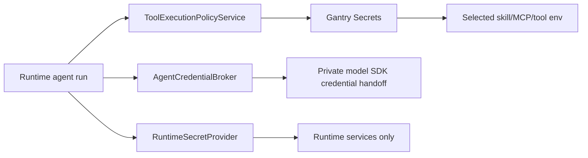

# Credential Management

Gantry separates runtime-owned secrets, model broker credentials, and
capability environment secrets projected to approved skills, MCP servers, and
tools.

## Source Lanes

Gantry uses four source lanes:

- `settings.yaml` stores non-secret configuration, such as credential broker
  mode, broker endpoint URLs, channel enablement, schemas, allowlists, and
  model selections.
- `RuntimeSecretProvider` resolves runtime-owned secrets. The local/personal
  implementation reads runtime `.env` and process env for values such as
  database URLs, channel bot tokens, webhook/control secrets, and OneCLI
  persistence secrets.
- Gantry Secrets store capability env var values for selected skills, MCP
  servers, and reviewed tools. Values are encrypted in Postgres and projected
  only when a selected capability declares the matching env var or credential
  ref.
- `AgentCredentialBroker` resolves model-provider access and broker-safe model
  adapter injections such as provider base URLs, local provider-only proxy
  endpoints, and certificate file paths. Model credentials must not be reused as
  tool env.

There is no global `.env > database > broker` precedence. Precedence is
lane-specific: settings choose behavior, runtime secret providers resolve
runtime secrets, Gantry Secrets resolve capability env vars, and model
credentials come from the selected broker. If a value appears in the wrong lane,
Gantry reports it as a configuration error instead of silently ignoring or
overriding it.

Wrong-lane checks apply to both runtime `.env` and the process environment used
to start Gantry. Process env may override local `.env` only inside
runtime-secret resolution; it is not ambient agent tool env. If a local shell
already has a capability secret, import it explicitly with `gantry secrets
import-env NAME`.

Existing local installs must be cleaned up manually as a one-time cutover: move
settings-owned values from `.env` into `settings.yaml`, remove raw
agent-accessed credentials from the runtime env file, recreate model
credentials in the selected broker, and import capability-owned skill, MCP, or
tool env vars with `gantry secrets set` or `gantry secrets import-env`.

## Runtime-Owned Secrets

Runtime-owned secrets are needed to start and operate Gantry or its connected
services. They are read through `RuntimeSecretProvider`.

Examples:

- `GANTRY_DATABASE_URL`
- `SLACK_BOT_TOKEN`
- `SLACK_APP_TOKEN`
- `TELEGRAM_BOT_TOKEN`
- webhook secret
- control API secret
- `ONECLI_DATABASE_URL`
- `SECRET_ENCRYPTION_KEY`

Runtime-owned secrets are never injected into an agent runner. They are checked
by runtime preflight, doctor, channel setup, storage readiness, and broker
persistence readiness.

Runtime `.env` and process env are valid for these local/personal secrets. They
must not contain non-secret settings such as credential mode or broker URLs.

## Gantry Secrets

Gantry Secrets are the central store for simple env-var-shaped secrets needed by
approved agent capabilities. They are encrypted with `SECRET_ENCRYPTION_KEY` in
the Gantry Postgres schema and are never written to `settings.yaml`.

Examples:

- `GITHUB_TOKEN` for a GitHub MCP server
- `LINKEDIN_ACCESS_TOKEN` for a LinkedIn posting skill
- `GOOGLE_APPLICATION_CREDENTIALS_JSON` for a reviewed local tool that expects
  an env var

CLI management:

```bash
gantry secrets list
gantry secrets set LINKEDIN_ACCESS_TOKEN
gantry secrets import-env GITHUB_TOKEN
gantry secrets unset GITHUB_TOKEN
```

Agents do not edit `.env`, `settings.yaml`, skill directories, or MCP config to
manage these values. When a selected skill or MCP server needs a missing secret,
the runtime fails closed with `gantry secrets set NAME` guidance. If the value
already exists in the host shell, an admin can run `gantry secrets import-env
NAME` to move it into the central store.

Skill action manifests declare required env-var names and scoped commands; they
must not instruct agents to set shell env vars inline. Runtime injects approved
skill secrets and neutral CA trust aliases for approved tool calls, so skill
commands should stay argv-shaped, such as
`python3 skills/linkedin-posting/post.py --file ...`.

## Agent-Accessed Credentials

Agent-accessed credentials are credentials an agent may use after policy allows
the action. They include LLM provider access and tool or API credentials, but
those two categories are not scoped the same way. Model-provider credentials
come from the broker. Tool env vars come from Gantry Secrets when a selected
capability declares a need. Reviewed `local_cli` capabilities are valid when
the CLI already owns its own authenticated account state and Gantry pins the
executable, command templates, preflight, protected paths, and denied
environment overrides before projecting scoped command authority.

Model-provider access is account-level Model Access. Gantry always requests it
with `purpose=model_runtime` through the reserved broker profile
`gantry-model-access`; it is not bound to an individual agent, conversation,
memory worker, subagent, or job. Agents, subagents, jobs, and memory workers
select catalog model aliases only. Anthropic and OpenRouter credentials are
configured once in OneCLI or the selected enterprise broker and then projected
to model SDK runs according to the selected model provider.

Agents do not receive every raw secret value from Gantry. Runtime code projects
only the selected capability's declared Gantry Secret names. Selected skills get
their `requiredEnvVars`; selected MCP servers get only their reviewed
credential refs; reviewed tools get only their declared env needs. Model
credential injection remains broker-owned and must never be reused for tool
env.

For local authenticated CLIs, Gantry does not copy raw OAuth tokens or broker
proxies into generic Bash. The approved semantic capability maps to narrow
scoped command templates and protected credential/config paths. User-defined
local CLI capabilities require pinned executable identity, version/hash, auth
preflight, protected paths, and denied environment overrides before runtime
projects scoped command authority. Agents may not override
token, credential file, config directory, proxy, keychain/keyring, CA, or
authority environment keys unless a future capability explicitly models that
behavior.

Raw provider credentials such as `ANTHROPIC_API_KEY`, `OPENAI_API_KEY`, and
`CLAUDE_CODE_OAUTH_TOKEN` must be configured through OneCLI or the selected
enterprise credential broker, never in Gantry `.env` or process env.

## Common Key Placement

| Value                                                         | Source                                                  |
| ------------------------------------------------------------- | ------------------------------------------------------- |
| `credential_broker.mode`                                      | `settings.yaml` advanced override                       |
| `credential_broker.onecli.url`                                | `settings.yaml` advanced override                       |
| `credential_broker.external.base_url`                         | `settings.yaml` advanced override                       |
| `agent.name`                                                  | `settings.yaml`                                         |
| `agent.default_model`                                         | `settings.yaml`                                         |
| `agent.one_time_job_default_model`                            | `settings.yaml`                                         |
| `agent.recurring_job_default_model`                           | `settings.yaml`                                         |
| `memory.llm.models.*`                                         | `settings.yaml`                                         |
| Conversation approvers                                        | `settings.yaml` and Postgres conversation approver rows |
| `storage.postgres.url_env`                                    | `settings.yaml` advanced override                       |
| `GANTRY_DATABASE_URL`                                         | `RuntimeSecretProvider` / local `.env`                  |
| `TELEGRAM_BOT_TOKEN`                                          | `RuntimeSecretProvider` / local `.env`                  |
| `SLACK_BOT_TOKEN`, `SLACK_APP_TOKEN`                          | `RuntimeSecretProvider` / local `.env`                  |
| `ONECLI_DATABASE_URL`, `SECRET_ENCRYPTION_KEY`                | `RuntimeSecretProvider` / local `.env`                  |
| Skill, MCP, and reviewed tool env vars                        | Gantry Secrets (`gantry secrets ...`)                   |
| `ANTHROPIC_API_KEY`, `ANTHROPIC_AUTH_TOKEN`, `OPENAI_API_KEY` | `AgentCredentialBroker`                                 |
| `CLAUDE_CODE_OAUTH_TOKEN`                                     | `AgentCredentialBroker`                                 |

Model env keys such as `ANTHROPIC_MODEL`, `ANTHROPIC_BASE_URL`, and
`ANTHROPIC_DEFAULT_*_MODEL` are child-process adapter projections. Gantry
runtime config does not accept them from runtime `.env`; use provider-neutral
aliases through `agent.default_model`, `agent.one_time_job_default_model`,
`agent.recurring_job_default_model`, `memory.llm.models.*`, `gantry model`, the
Control API defaults route, and group `/model` overrides for model selection.
OpenRouter is selected by provider or catalog alias. The current
OpenRouter adapter projection uses the Claude Agent SDK-compatible endpoint,
with the adapter token supplied by `AgentCredentialBroker` and native API-key
env intentionally blank for that child process.

## Broker Profiles

`credential_broker.mode` supports:

- `onecli`: local/personal default using the OneCLI adapter.
- `none`: development mode with no broker injection.
- `external`: future enterprise-managed credentials.

The `external` profile is a placeholder contract. It does not include a Vault,
Kubernetes, AWS, GCP, Azure, or custom implementation yet.

Future Vault, Kubernetes Secrets, AWS Secrets Manager, GCP Secret Manager, Azure
Key Vault, or custom integrations must implement either `RuntimeSecretProvider`
for runtime-owned secrets or `AgentCredentialBroker` for agent-accessed
credentials. They must not add ad hoc runtime `.env` fallbacks for agent
credentials.

## OneCLI Adapter

OneCLI remains supported as the default personal broker. Its implementation
lives under `apps/core/src/adapters/credentials/onecli/`.

The adapter owns:

- `@onecli-sh/sdk` usage
- OneCLI URL validation
- broker-safe environment filtering
- OneCLI CA certificate materialization for host runners
- local OneCLI persistence readiness checks

OneCLI model access is resolved through the `gantry-model-access` profile. Setup
and runtime startup create that profile directly; there is no fallback to
`main-agent` or per-agent model credential rows.

OneCLI may return local provider proxy variables such as `HTTP_PROXY`,
`HTTPS_PROXY`, and `NODE_USE_ENV_PROXY` for the model credential lane. Gantry
accepts only broker-shaped local HTTP proxy endpoints, normalizes Docker-only
loopback aliases such as `host.docker.internal` to `127.0.0.1` for host
runners, and hides that provider proxy behind the Gantry-owned egress gateway.
The Claude SDK process receives the Gantry loopback gateway URL, not the
broker's proxy URL. Egress is default-allow; `permissions.egress.denylist` is an
optional hostname-glob denylist that returns a 403 JSON body and writes an audit
event when matched. General runner, scheduled-script, browser, and MCP process
environments must not receive broker proxy variables. When the model-credential
lane includes `NODE_EXTRA_CA_CERTS`, the Claude SDK process also receives only
neutral CA trust aliases (`SSL_CERT_FILE`,
`REQUESTS_CA_BUNDLE`, `CURL_CA_BUNDLE`, `GIT_SSL_CAINFO`, `PIP_CERT`,
`AWS_CA_BUNDLE`, `CARGO_HTTP_CAINFO`, and `DENO_CERT`) derived from that same
bundle path. Approved Bash tool calls get the same aliases as a command prefix
for cooperative host CLIs and language package managers; explicit `env -i`
commands intentionally clear env and are not treated as supported trust
propagation. The Claude SDK runner sets
`CLAUDE_CODE_SUBPROCESS_ENV_SCRUB=1` so provider credentials remain with the
Claude process and are stripped from Bash, hooks, and MCP stdio subprocesses.
Git/tool-specific proxy controls remain forbidden in the broker lane.

`NO_PROXY` and `no_proxy` are compatibility hints for cooperative tools, not an
authorization boundary. They keep common developer tools such as `gh`, `git`,
`curl`, Go, Python, and Node from routing trusted developer-platform traffic
through model credential transport when those tools honor proxy environment
variables. A malicious or vulnerable tool can ignore those variables, so
protection still comes from capability selection, permission policy, sandbox
policy, and audit.

The runtime calls the application credential service and receives a generic
`AgentCredentialInjection`; it does not instantiate OneCLI.

OneCLI is only a model credential broker. It never executes tools, approves
permissions, owns scheduler policy, evaluates protected capability changes, or
enforces egress policy. Model credential env is passed only to the Claude SDK
process private model credential handoff. Bash tools, MCP stdio subprocesses,
browser tools, and skills do not receive OneCLI model proxy or provider tokens.
Approved Bash commands may receive the non-secret CA bundle path as neutral TLS
trust aliases for host CLI trust stores; MCP stdio subprocesses and browser
tools do not receive broker CA variables. Approved Bash commands also receive
`GODEBUG=netdns=go` so Go-based CLIs use Go DNS resolution instead of macOS
resolver services that are blocked inside the sandbox. The Claude SDK sandbox
enables local binding for its own network proxy path, and on macOS also enables
its trustd lookup exception for sandboxed Bash so approved Go-based CLIs can
verify TLS certificates through the OS trust service without becoming
unsandboxed. Host-owned scheduler scripts are not supported.

The SDK process receives sandbox policy and model credentials as separate
adapter projections. Protected filesystem paths are passed through
`GANTRY_PROTECTED_FILESYSTEM_PATHS_JSON` and become Claude SDK
`sandbox.filesystem.denyWrite` entries; model credentials remain only in the
private SDK env handoff. Do not use OneCLI, MCP stdio env, browser env, or any
future scheduler script env to carry sandbox authority or provider credentials.

## Permission Boundary

Credential injection is not permission approval. Agent actions must still pass
through `ToolExecutionPolicyService` and the permission/capability binding
checks before credentials are injected or used for a tool/API action.


